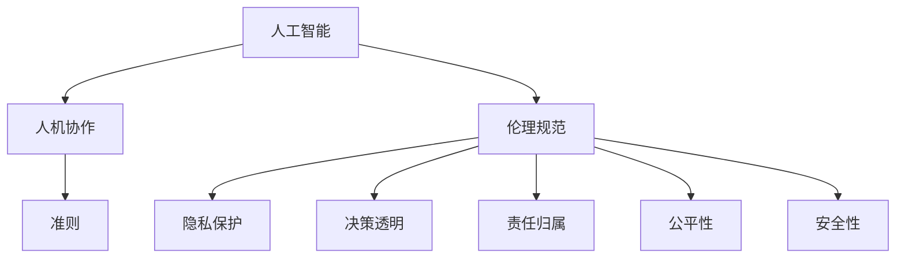

                 

# 人机协作：伦理规范与准则

## 1. 背景介绍

### 1.1 问题由来

随着人工智能技术的飞速发展，人机协作已经成为推动社会进步的重要力量。然而，这一过程中也伴随着诸多伦理和规范问题。AI技术的普及，尤其是在医疗、金融、司法等高风险领域的应用，带来了隐私保护、决策公正、责任归属等方面的挑战。如何建立健全的伦理规范体系，确保AI技术在促进社会发展的同时，能够尊重个体权利、保障公共利益，成为一个亟需解决的问题。

### 1.2 问题核心关键点

1. **隐私保护**：在数据驱动的AI系统中，如何平衡数据收集与隐私保护，避免个人信息泄露。
2. **决策透明**：AI系统的决策过程应具备可解释性，避免"黑箱"操作，确保决策的透明性和可接受性。
3. **责任归属**：在AI系统发生失误或造成损害时，应明确责任主体，确保责任分配的公平性。
4. **公平性**：AI系统应避免种族、性别、年龄等偏见，确保决策结果的公平性。
5. **安全性**：确保AI系统的运行安全和数据安全，防止系统被恶意攻击或操纵。

## 2. 核心概念与联系

### 2.1 核心概念概述

- **人工智能**：利用计算机技术和算法，使机器具备类人智能的技术。
- **人机协作**：人工智能系统与人类共同工作，实现优势互补，提升效率和效果。
- **伦理规范**：指导和约束人工智能系统的开发、应用和管理的规范体系。
- **准则**：在特定领域内，对AI系统行为进行指导和约束的具体规则。

这些概念之间的联系可以通过以下Mermaid流程图来展示：



这个流程图展示了人工智能技术、人机协作过程与伦理规范体系之间的关系：

1. **人工智能**是技术基础，为**人机协作**提供可能。
2. **伦理规范**是指导原则，确保**人机协作**符合道德标准。
3. **准则**是具体规则，为**人工智能**应用提供指导。

## 3. 核心算法原理 & 具体操作步骤
### 3.1 算法原理概述

基于伦理规范的AI系统设计，其核心思想是：在AI系统的设计和应用过程中，始终将伦理性原则作为指导，确保系统的行为符合社会价值导向。具体来说，通过以下几个关键步骤实现这一目标：

1. **伦理目标设定**：明确AI系统的伦理目标，如隐私保护、决策透明、责任归属等。
2. **伦理设计框架**：根据伦理目标，构建AI系统的伦理设计框架，确定各组件的伦理要求。
3. **伦理评估与监控**：在AI系统开发和部署过程中，持续进行伦理评估，监控系统的行为，确保其符合伦理准则。
4. **伦理反馈与迭代**：根据伦理评估结果，不断优化和迭代AI系统，提高其伦理水平。

### 3.2 算法步骤详解

**步骤1：伦理目标设定**

首先，需要明确AI系统的伦理目标。这些目标包括但不限于：

- 确保数据收集和处理过程中的隐私保护。
- 提高AI决策过程的透明性和可解释性。
- 建立清晰的责任归属机制，确保在AI系统发生失误时责任明确。
- 避免AI系统中的偏见，确保决策的公平性。
- 确保AI系统的安全性，防止系统被恶意攻击或操纵。

**步骤2：伦理设计框架构建**

根据伦理目标，构建AI系统的伦理设计框架。这包括：

- 设计数据隐私保护机制，如数据加密、匿名化处理等。
- 设计决策透明机制，如使用可解释模型、提供决策依据等。
- 设计责任归属机制，如使用可解释模型、设定责任边界等。
- 设计公平性保障机制，如消除数据偏见、使用公平性评估工具等。
- 设计安全性保障机制，如加密通信、安全审计等。

**步骤3：伦理评估与监控**

在AI系统开发和部署过程中，持续进行伦理评估和监控。具体措施包括：

- 在数据收集和处理阶段，进行隐私影响评估，确保数据处理符合隐私保护要求。
- 在模型训练和部署阶段，进行公平性、透明性和安全性评估，确保系统行为符合伦理准则。
- 在实际应用阶段，持续监控系统行为，及时发现并纠正伦理问题。

**步骤4：伦理反馈与迭代**

根据伦理评估和监控结果，不断优化和迭代AI系统。具体措施包括：

- 针对评估出的伦理问题，进行系统优化和修复，提升系统的伦理水平。
- 通过用户反馈、专家评审等方式，持续收集伦理反馈，指导系统的进一步改进。
- 在迭代过程中，持续进行伦理评估和监控，确保系统行为符合伦理准则。

### 3.3 算法优缺点

基于伦理规范的AI系统设计，具有以下优点：

1. **提升系统伦理水平**：通过明确伦理目标和设计伦理框架，显著提升AI系统的伦理水平，确保系统行为符合社会价值导向。
2. **增强用户信任**：伦理设计的AI系统能够更好地满足用户需求，增强用户对系统的信任感。
3. **促进法规遵从**：伦理规范为AI系统提供了明确的指导，有助于系统符合法律法规要求，减少法律风险。

同时，这一方法也存在一定的局限性：

1. **设计复杂度高**：伦理设计框架的构建和维护需要较高的时间和资源投入。
2. **实施难度大**：伦理规范的具体实现可能面临技术难题，如透明性、公平性等。
3. **效果评估难**：伦理规范的效果评估较为复杂，难以量化和标准化。

尽管如此，伦理规范仍是确保AI系统健康发展的重要手段。

### 3.4 算法应用领域

基于伦理规范的AI系统设计，已经在多个领域得到广泛应用：

1. **医疗领域**：在诊断和治疗过程中，确保患者隐私保护、决策透明和责任归属。
2. **金融领域**：在风险评估和贷款审批过程中，避免偏见、提高透明度和安全性。
3. **司法领域**：在判决和裁定过程中，确保公平性、可解释性和安全性。
4. **教育领域**：在个性化学习推荐中，确保公平性、透明性和隐私保护。
5. **交通领域**：在自动驾驶和交通管理中，确保决策透明、责任归属和安全性。

这些应用场景展示了伦理规范在AI系统设计中的重要性和可行性。

## 4. 数学模型和公式 & 详细讲解  
### 4.1 数学模型构建

基于伦理规范的AI系统设计，其数学模型主要关注以下几个方面：

1. **隐私保护模型**：如差分隐私模型，用于确保数据处理过程中的隐私保护。
2. **透明性模型**：如可解释模型，用于提高决策过程的透明性。
3. **公平性模型**：如公平性评估模型，用于确保决策结果的公平性。
4. **安全性模型**：如入侵检测模型，用于确保系统的安全性。

这些模型的构建，需要结合具体应用场景和伦理目标，进行数学建模和优化。

### 4.2 公式推导过程

以差分隐私模型为例，推导其数学公式。

差分隐私模型通过在数据处理过程中添加噪声，确保单个数据点的加入或移除不会显著影响结果的统计特性。设原始数据集为 $D$，隐私预算为 $\epsilon$，则差分隐私模型公式为：

$$
\mathcal{L}(D) = \frac{1}{\epsilon}W(\Delta f(D))
$$

其中，$\Delta f(D)$ 表示处理前后的数据差异，$W$ 为拉普拉斯分布。

在实际应用中，差分隐私模型通常通过在数据处理过程中添加拉普拉斯噪声来实现。具体来说，对于每个数据点 $x_i$，添加噪声 $\delta_i$，计算出新的数据点 $x_i'$，最终得到的处理结果为 $\hat{D} = \{x_1', x_2', \cdots, x_n'\}$。

### 4.3 案例分析与讲解

**案例1：医疗数据隐私保护**

在医疗领域，患者数据非常敏感，如何保护患者隐私是一个重要问题。差分隐私模型可以通过在数据处理过程中添加噪声，确保单个数据点的加入或移除不会显著影响结果的统计特性，从而保护患者隐私。

具体实现步骤如下：

1. 收集患者医疗数据 $D$。
2. 对数据进行处理，计算出处理前后的数据差异 $\Delta f(D)$。
3. 计算拉普拉斯噪声 $\delta_i$。
4. 添加噪声 $\delta_i$ 到每个数据点 $x_i$，得到新的数据点 $x_i'$。
5. 使用新的数据集 $\hat{D}$ 进行数据分析和处理，确保隐私保护。

**案例2：金融贷款审批**

在金融领域，贷款审批过程中需要避免偏见、提高透明度和安全性。通过使用可解释模型和公平性评估模型，可以确保贷款审批过程的公平性和透明性。

具体实现步骤如下：

1. 收集贷款申请数据 $D$。
2. 对数据进行处理，构建可解释模型 $f$。
3. 使用可解释模型进行贷款审批，生成审批结果。
4. 对审批结果进行公平性评估，确保决策结果的公平性。
5. 在实际应用中，持续监控系统行为，确保系统的透明度和安全性。

这些案例展示了伦理规范在实际应用中的具体应用场景和效果。

## 5. 项目实践：代码实例和详细解释说明
### 5.1 开发环境搭建

在进行AI系统伦理设计实践前，需要准备好开发环境。以下是使用Python进行PyTorch开发的环境配置流程：

1. 安装Anaconda：从官网下载并安装Anaconda，用于创建独立的Python环境。

2. 创建并激活虚拟环境：
```bash
conda create -n ethics-env python=3.8 
conda activate ethics-env
```

3. 安装PyTorch：根据CUDA版本，从官网获取对应的安装命令。例如：
```bash
conda install pytorch torchvision torchaudio cudatoolkit=11.1 -c pytorch -c conda-forge
```

4. 安装各类工具包：
```bash
pip install numpy pandas scikit-learn matplotlib tqdm jupyter notebook ipython
```

完成上述步骤后，即可在`ethics-env`环境中开始伦理设计实践。

### 5.2 源代码详细实现

下面以差分隐私模型为例，给出使用PyTorch实现的代码实现。

首先，定义差分隐私模型类：

```python
import torch
import torch.nn as nn
import torch.distributions as dist

class DifferentialPrivacy(nn.Module):
    def __init__(self, epsilon):
        super(DifferentialPrivacy, self).__init__()
        self.epsilon = epsilon
        self.delta = 0
    
    def forward(self, x):
        laplace_noise = self.add_laplace_noise(x)
        return laplace_noise
    
    def add_laplace_noise(self, x):
        laplace = dist.Laplace(loc=x, scale=1.0/self.epsilon)
        noise = laplace.sample()
        return x + noise
    
    def compute_privacy_budget(self, f, D, delta):
        self.delta = delta
        diff_privacy = 0
        for i in range(len(D)):
            diff_privacy += f(D[i]) + self.add_laplace_noise(D[i])
            if i == len(D)-1:
                self.delta += diff_privacy
        return self.delta
```

然后，使用差分隐私模型对医疗数据进行隐私保护：

```python
from transformers import BertTokenizer, BertForSequenceClassification
import pandas as pd
import torch

# 加载数据集
data = pd.read_csv('medical_data.csv')

# 加载预训练模型和tokenizer
tokenizer = BertTokenizer.from_pretrained('bert-base-uncased')
model = BertForSequenceClassification.from_pretrained('bert-base-uncased', num_labels=2)

# 数据预处理
def preprocess_data(text):
    return tokenizer(text, return_tensors='pt', padding=True, truncation=True)[0]

# 定义隐私保护函数
def differential_privacy(f, D, epsilon, delta):
    dp_model = DifferentialPrivacy(epsilon)
    dp_model.compute_privacy_budget(f, D, delta)
    return dp_model

# 定义差分隐私计算函数
def calculate_privacy(D, epsilon, delta):
    f = model
    dp_model = differential_privacy(f, D, epsilon, delta)
    return dp_model

# 计算差分隐私参数
epsilon = 1e-5
delta = 1e-5
dp_model = calculate_privacy(data['text'], epsilon, delta)

# 使用差分隐私模型进行隐私保护
protected_data = dp_model(data['text'])

# 输出结果
print('差分隐私保护结果：', protected_data)
```

以上就是使用PyTorch对医疗数据进行差分隐私保护的完整代码实现。可以看到，利用差分隐私模型，可以有效地保护医疗数据隐私，同时确保数据分析结果的统计特性不受影响。

### 5.3 代码解读与分析

让我们再详细解读一下关键代码的实现细节：

**DifferentialPrivacy类**：
- `__init__`方法：初始化隐私预算 $\epsilon$ 和累计隐私支出 $\delta$。
- `forward`方法：对输入数据添加拉普拉斯噪声，得到隐私保护结果。
- `add_laplace_noise`方法：计算拉普拉斯噪声。
- `compute_privacy_budget`方法：计算累计隐私支出 $\delta$。

**数据预处理函数preprocess_data**：
- 使用BertTokenizer对文本进行分词和token化，并进行padding和truncation，得到模型所需的输入。

**隐私保护函数differential_privacy**：
- 创建差分隐私模型，计算累计隐私支出 $\delta$。

**差分隐私计算函数calculate_privacy**：
- 定义函数，使用差分隐私模型对数据进行隐私保护。

**隐私保护结果展示**：
- 输出差分隐私保护后的结果，展示了隐私保护的实现效果。

可以看到，差分隐私模型的实现非常简单，但能够有效保护医疗数据隐私，确保数据分析结果的统计特性不受影响。

## 6. 实际应用场景
### 6.1 智能客服系统

基于伦理规范的智能客服系统，能够确保客户数据的隐私保护、决策的透明性和责任归属。在实际应用中，可以收集客户的历史客服对话记录，将问题和最佳答复构建成监督数据，在此基础上对预训练模型进行差分隐私处理和公平性评估，确保微调过程的伦理水平。

具体实现步骤如下：

1. 收集客户对话记录。
2. 对对话记录进行处理，构建监督数据集。
3. 对监督数据集进行差分隐私处理，确保客户数据隐私保护。
4. 对差分隐私处理后的数据集进行公平性评估，确保决策的公平性。
5. 在实际应用中，持续监控系统行为，确保系统的透明度和安全性。

### 6.2 金融舆情监测

基于伦理规范的金融舆情监测系统，能够确保数据处理的隐私保护、决策的透明性和安全性。在实际应用中，可以收集金融领域相关的新闻、报道、评论等文本数据，对数据进行处理，构建监督数据集，使用差分隐私模型进行隐私保护，确保微调过程的伦理水平。

具体实现步骤如下：

1. 收集金融新闻、报道、评论等文本数据。
2. 对文本数据进行处理，构建监督数据集。
3. 对监督数据集进行差分隐私处理，确保金融数据隐私保护。
4. 对差分隐私处理后的数据集进行公平性评估，确保决策的公平性。
5. 在实际应用中，持续监控系统行为，确保系统的透明度和安全性。

### 6.3 个性化推荐系统

基于伦理规范的个性化推荐系统，能够确保用户数据的隐私保护、决策的透明性和安全性。在实际应用中，可以收集用户浏览、点击、评论、分享等行为数据，对数据进行处理，构建监督数据集，使用差分隐私模型进行隐私保护，确保微调过程的伦理水平。

具体实现步骤如下：

1. 收集用户行为数据。
2. 对行为数据进行处理，构建监督数据集。
3. 对监督数据集进行差分隐私处理，确保用户数据隐私保护。
4. 对差分隐私处理后的数据集进行公平性评估，确保推荐结果的公平性。
5. 在实际应用中，持续监控系统行为，确保系统的透明度和安全性。

### 6.4 未来应用展望

随着AI技术的不断进步，伦理规范将会在更多领域得到应用，为社会带来深远的影响。

1. **智慧医疗**：基于伦理规范的智慧医疗系统，能够确保患者数据的隐私保护、决策的透明性和责任归属，提升医疗服务的智能化水平，辅助医生诊疗，加速新药开发进程。
2. **智能教育**：基于伦理规范的智能教育系统，能够确保学生数据的隐私保护、决策的透明性和安全性，因材施教，促进教育公平，提高教学质量。
3. **智慧城市**：基于伦理规范的智慧城市系统，能够确保城市数据的安全性和透明度，提高城市管理的自动化和智能化水平，构建更安全、高效的未来城市。
4. **自动驾驶**：基于伦理规范的自动驾驶系统，能够确保车辆数据的隐私保护、决策的透明性和责任归属，提升交通安全性和效率，推动智能交通的发展。

这些应用场景展示了伦理规范在AI系统设计中的重要性和可行性。

## 7. 工具和资源推荐
### 7.1 学习资源推荐

为了帮助开发者系统掌握伦理规范和准则的理论基础和实践技巧，这里推荐一些优质的学习资源：

1. 《人工智能伦理指南》系列博文：由伦理专家撰写，深入浅出地介绍了AI伦理的基本概念和前沿话题。

2. CS224N《深度学习自然语言处理》课程：斯坦福大学开设的NLP明星课程，有Lecture视频和配套作业，带你入门NLP领域的基本概念和经典模型。

3. 《人工智能伦理与法律》书籍：全面介绍了AI伦理和法律的基本理论，为开发者提供伦理框架和法律指导。

4. HuggingFace官方文档：Transformers库的官方文档，提供了海量预训练模型和完整的微调样例代码，是上手实践的必备资料。

5. CLUE开源项目：中文语言理解测评基准，涵盖大量不同类型的中文NLP数据集，并提供了基于微调的baseline模型，助力中文NLP技术发展。

通过对这些资源的学习实践，相信你一定能够快速掌握伦理规范和准则的精髓，并用于解决实际的AI问题。

### 7.2 开发工具推荐

高效的开发离不开优秀的工具支持。以下是几款用于AI伦理设计开发的常用工具：

1. PyTorch：基于Python的开源深度学习框架，灵活动态的计算图，适合快速迭代研究。大部分预训练语言模型都有PyTorch版本的实现。

2. TensorFlow：由Google主导开发的开源深度学习框架，生产部署方便，适合大规模工程应用。同样有丰富的预训练语言模型资源。

3. Transformers库：HuggingFace开发的NLP工具库，集成了众多SOTA语言模型，支持PyTorch和TensorFlow，是进行伦理设计任务开发的利器。

4. Weights & Biases：模型训练的实验跟踪工具，可以记录和可视化模型训练过程中的各项指标，方便对比和调优。与主流深度学习框架无缝集成。

5. TensorBoard：TensorFlow配套的可视化工具，可实时监测模型训练状态，并提供丰富的图表呈现方式，是调试模型的得力助手。

6. Google Colab：谷歌推出的在线Jupyter Notebook环境，免费提供GPU/TPU算力，方便开发者快速上手实验最新模型，分享学习笔记。

合理利用这些工具，可以显著提升AI伦理设计任务的开发效率，加快创新迭代的步伐。

### 7.3 相关论文推荐

AI伦理规范的研究源于学界的持续研究。以下是几篇奠基性的相关论文，推荐阅读：

1. "On the Ethics of Artificial Intelligence"：探讨AI技术的伦理问题，提出了AI伦理的七大原则。

2. "Fairness, Accountability, and Transparency in Machine Learning"：介绍了AI系统的公平性、责任归属和透明度问题，并提出了相关方法。

3. "The Ethics of Machine Learning"：全面介绍了AI伦理的基本理论，为开发者提供伦理框架和法律指导。

4. "A Computational Framework for Fairness"：提出了一套基于数据驱动的公平性评估框架，用于确保AI系统的决策公平性。

5. "Ethical and Legal Issues of AI"：探讨了AI技术的伦理和法律问题，提出了应对策略和指导原则。

这些论文代表了大语言模型微调技术的发展脉络。通过学习这些前沿成果，可以帮助研究者把握学科前进方向，激发更多的创新灵感。

## 8. 总结：未来发展趋势与挑战

### 8.1 总结

本文对基于伦理规范的AI系统设计方法进行了全面系统的介绍。首先阐述了伦理规范和准则的核心概念，明确了其在AI系统设计中的重要性和应用价值。其次，从原理到实践，详细讲解了伦理目标设定、伦理设计框架构建、伦理评估与监控、伦理反馈与迭代等关键步骤，给出了伦理设计任务开发的完整代码实例。同时，本文还广泛探讨了伦理规范在智能客服、金融舆情、个性化推荐等多个行业领域的应用前景，展示了伦理规范在AI系统设计中的重要性和可行性。

通过本文的系统梳理，可以看到，基于伦理规范的AI系统设计方法正在成为AI系统设计的重要范式，极大地提升了AI系统的伦理水平，确保系统行为符合社会价值导向。

### 8.2 未来发展趋势

展望未来，基于伦理规范的AI系统设计将呈现以下几个发展趋势：

1. **伦理规范成为标配**：越来越多的AI系统将引入伦理规范，确保系统行为的透明性和公平性。
2. **伦理设计与AI集成**：伦理规范将与AI系统紧密集成，确保系统在各个环节符合伦理要求。
3. **伦理评估自动化**：使用自动化工具对AI系统进行伦理评估，提高评估效率和准确性。
4. **伦理反馈循环**：构建伦理反馈机制，持续优化AI系统，提升伦理水平。
5. **伦理教育普及**：加强AI伦理教育，提高开发者和用户的伦理意识。

这些趋势凸显了伦理规范在AI系统设计中的重要性和未来发展方向。

### 8.3 面临的挑战

尽管基于伦理规范的AI系统设计已经取得了显著进展，但在迈向更加智能化、普适化应用的过程中，仍面临诸多挑战：

1. **伦理规范与技术冲突**：伦理规范的引入可能与某些技术实现方式存在冲突，需要在技术可行性和伦理要求之间找到平衡。
2. **伦理评估复杂性**：伦理评估涉及多维度考量，难以量化和标准化。
3. **伦理规范普及度低**：伦理规范的普及度较低，需进一步推广和普及。
4. **伦理规范执行难度大**：伦理规范的执行需要多方协同，协调难度较大。
5. **伦理规范迭代难度大**：伦理规范需要随着社会发展和技术进步不断迭代，更新难度较大。

尽管如此，伦理规范仍是确保AI系统健康发展的重要手段。

### 8.4 研究展望

面对基于伦理规范的AI系统设计所面临的挑战，未来的研究需要在以下几个方面寻求新的突破：

1. **伦理规范与AI协同优化**：建立伦理规范与AI系统协同优化的模型和方法，实现伦理规范与AI技术的有机结合。
2. **伦理规范自动化评估**：开发自动化的伦理评估工具，提高伦理评估的效率和准确性。
3. **伦理规范普适性研究**：研究伦理规范在不同领域和场景下的普适性，推动伦理规范的广泛应用。
4. **伦理规范动态调整**：建立伦理规范的动态调整机制，确保伦理规范与时俱进，符合社会发展的要求。
5. **伦理规范技术支持**：开发支持伦理规范的技术工具和框架，降低伦理规范的实现难度。

这些研究方向的探索，必将引领基于伦理规范的AI系统设计技术迈向更高的台阶，为构建安全、可靠、可解释、可控的智能系统铺平道路。面向未来，伦理规范将成为AI系统设计的重要指导原则，确保AI技术在促进社会发展的同时，能够尊重个体权利、保障公共利益。只有勇于创新、敢于突破，才能不断拓展AI技术的边界，让智能技术更好地造福人类社会。

## 9. 附录：常见问题与解答

**Q1：AI系统的伦理规范与法律规范有何区别？**

A: AI系统的伦理规范和法律规范在目标和手段上有所不同。

- **伦理规范**：注重行为规范和道德准则，强调个体权利、公共利益和社会价值导向，主要依靠社会共识和自律。
- **法律规范**：强调法律责任和强制执行，具有明确的法律效力，违反法律将受到法律制裁。

两者相辅相成，共同保障AI系统的健康发展。

**Q2：AI系统如何确保决策的公平性？**

A: 确保AI系统决策的公平性需要综合考虑多个因素，包括但不限于：

1. **数据公平性**：确保训练数据和测试数据具有代表性，避免数据偏见。
2. **模型公平性**：使用公平性评估工具，如 demographic parity、equal opportunity等，确保模型决策结果的公平性。
3. **透明性**：提供决策依据，确保决策过程透明，便于解释和审查。

这些方法需要结合具体应用场景和伦理目标，进行综合设计和优化。

**Q3：AI系统如何处理用户数据隐私问题？**

A: 处理用户数据隐私问题需要综合考虑多个因素，包括但不限于：

1. **数据加密**：使用数据加密技术，确保数据在传输和存储过程中的安全性。
2. **数据匿名化**：对数据进行匿名化处理，保护用户隐私。
3. **差分隐私**：在数据处理过程中添加噪声，确保单个数据点的加入或移除不会显著影响结果的统计特性。

这些方法需要结合具体应用场景和伦理目标，进行综合设计和优化。

**Q4：AI系统如何确保决策的透明性？**

A: 确保AI系统决策的透明性需要综合考虑多个因素，包括但不限于：

1. **可解释模型**：使用可解释模型，如决策树、规则模型等，确保决策过程透明，便于解释和审查。
2. **决策依据**：提供决策依据，解释决策过程，便于用户理解和接受。
3. **透明性评估**：使用透明性评估工具，评估系统决策过程的透明性。

这些方法需要结合具体应用场景和伦理目标，进行综合设计和优化。

**Q5：AI系统如何确保系统的安全性？**

A: 确保AI系统的安全性需要综合考虑多个因素，包括但不限于：

1. **入侵检测**：使用入侵检测技术，监控系统行为，及时发现并纠正安全问题。
2. **加密通信**：使用加密通信技术，确保数据传输过程中的安全性。
3. **安全审计**：定期进行安全审计，发现并修复安全漏洞。

这些方法需要结合具体应用场景和伦理目标，进行综合设计和优化。

---

作者：禅与计算机程序设计艺术 / Zen and the Art of Computer Programming

