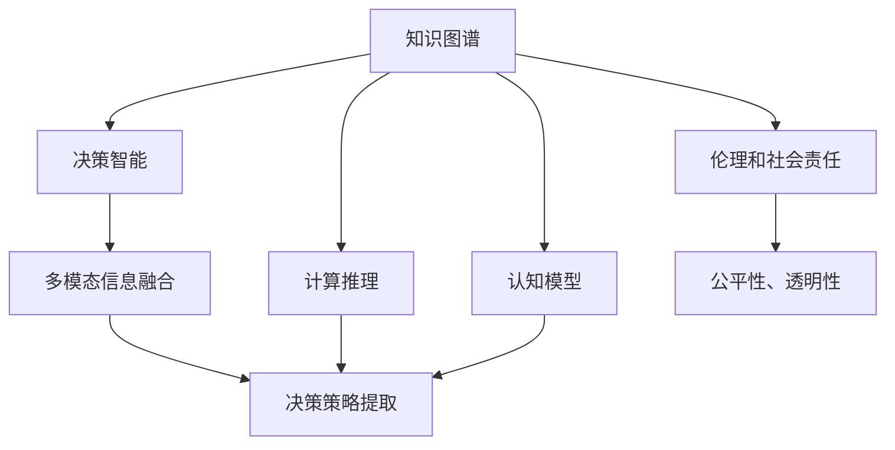

                 

# 人类智慧：AI 时代的新力量

> 关键词：人工智能,机器学习,深度学习,知识图谱,认知模型,决策智能

## 1. 背景介绍

### 1.1 问题由来
人工智能(AI)技术的飞速发展，正在彻底改变人类的生产生活方式。从早期的机器学习、深度学习，到近年的增强学习、自监督学习，AI技术不断地拓展着其应用边界。然而，在智能化浪潮席卷而来之际，一个深层次的问题也逐渐浮现：如何定义和实现真正的“智能”？

人工智能的核心目标之一，是让机器具备类似人类的认知和决策能力。然而，相较于人类的智慧，当前的AI技术仍显得稚嫩。在面对复杂多变的现实世界时，AI系统往往显得力不从心，缺乏真正的“理解”和“智慧”。

为了推动AI技术的进步，人们提出了“认知智能”的概念。认知智能旨在使机器能够理解人类语言、感知环境、推理判断、决策行动，最终实现与人类智慧相近的智能水平。本文旨在通过回顾和展望认知智能的发展历程，探讨其在AI时代中的新力量和前景。

### 1.2 问题核心关键点
认知智能的核心关键点在于以下几点：

- **知识图谱**：建立对世界知识的语义表示，帮助AI系统理解复杂语境和实体关系。
- **认知模型**：构建理解、推理和决策的神经网络模型，使得AI系统能够进行认知任务。
- **决策智能**：结合多模态信息，从数据中提取出可行的决策策略，指导机器行动。
- **计算推理**：采用逻辑推理和搜索算法，提升AI系统在特定领域内的智能水平。
- **伦理和社会责任**：在开发AI系统时，应充分考虑其对社会的影响和责任，确保其应用符合人类价值观。

这些关键点共同构成了认知智能的理论基础和实现框架，成为推动AI技术迈向人类智慧的重要方向。

## 2. 核心概念与联系

### 2.1 核心概念概述

为更好地理解认知智能的发展历程，本节将介绍几个密切相关的核心概念：

- **知识图谱(Knowledge Graph)**：一种语义化的知识表示方式，将世界知识结构化存储，供AI系统理解和使用。
- **认知模型(Cognitive Model)**：模拟人类认知过程的神经网络模型，用于理解语言、感知环境、推理判断等。
- **决策智能(Decision Intelligence)**：结合多模态信息，从数据中提取出可行的决策策略，指导机器行动。
- **计算推理(Computational Reasoning)**：采用逻辑推理和搜索算法，提升AI系统在特定领域内的智能水平。
- **伦理和社会责任(Ethics and Social Responsibility)**：在开发AI系统时，充分考虑其对社会的影响和责任，确保其应用符合人类价值观。

这些核心概念之间的逻辑关系可以通过以下Mermaid流程图来展示：



这个流程图展示了一系列认知智能的核心概念及其之间的关系：

1. 知识图谱提供丰富的世界知识，帮助认知模型理解和推理。
2. 认知模型模拟人类认知过程，提升AI系统的理解能力。
3. 决策智能结合多模态信息，提取决策策略。
4. 计算推理采用逻辑和算法，提升决策策略的有效性。
5. 伦理和社会责任确保AI系统在应用中的公平性和透明度。

这些概念共同构成了认知智能的研究框架，使其在实现“类人智能”方面迈出了坚实的一步。

## 3. 核心算法原理 & 具体操作步骤
### 3.1 算法原理概述

认知智能的核心算法主要包括知识图谱构建、认知模型训练、决策策略提取等。下面将详细介绍这些核心算法的原理和操作步骤。

### 3.2 算法步骤详解

#### 3.2.1 知识图谱构建

知识图谱的构建通常包括以下步骤：

1. **数据收集**：从各种来源（如百科、新闻、科学论文等）收集数据。
2. **实体识别**：使用命名实体识别(NER)技术，识别出数据中的实体及其属性。
3. **关系抽取**：使用关系抽取技术，确定实体之间的语义关系。
4. **图谱建模**：将抽取出的实体和关系构建为知识图谱，采用RDF、Turtle、OWL等格式存储。

构建知识图谱的难点在于实体和关系的抽取准确性和完整性。常用的方法包括基于规则的方法和基于深度学习的方法。基于深度学习的方法通过训练实体识别和关系抽取模型，显著提升了抽取的准确性。

#### 3.2.2 认知模型训练

认知模型训练通常包括以下步骤：

1. **模型选择**：选择合适的认知模型结构，如神经网络、逻辑推理网络等。
2. **数据准备**：将知识图谱转化为认知模型的输入格式，如向量表示。
3. **模型训练**：在标注数据上训练认知模型，优化模型参数。
4. **模型评估**：使用验证集评估模型性能，确保模型能够准确理解和推理知识图谱中的信息。

认知模型的训练通常需要大量的标注数据和计算资源。目前，基于Transformer的结构和预训练大模型的技术，显著提升了认知模型的训练效果。例如，通过在大规模语料上进行预训练，模型能够更好地理解自然语言，并在各种下游任务上取得优异表现。

#### 3.2.3 决策策略提取

决策策略提取通常包括以下步骤：

1. **多模态信息融合**：将知识图谱、传感器数据、用户输入等多种信息融合到认知模型中。
2. **推理和推理**：利用认知模型进行推理，确定最佳决策方案。
3. **决策优化**：结合多模态信息，优化决策策略，确保决策的有效性和合理性。
4. **决策执行**：将决策策略转化为机器行为，执行决策任务。

决策策略提取的核心在于如何将多模态信息高效融合，并采用合适的推理策略进行决策。常用的方法包括基于规则的方法和基于机器学习的方法。基于机器学习的方法能够自动学习决策策略，适应多种复杂的决策场景。

### 3.3 算法优缺点

认知智能的核心算法具有以下优点：

- **全面理解**：知识图谱和认知模型使得AI系统能够全面理解世界知识和人类语言。
- **精确推理**：结合多模态信息和决策智能，AI系统能够进行精确推理，做出合理决策。
- **高效融合**：采用计算推理方法，AI系统能够高效地将多模态信息融合到决策过程中。
- **适应性强**：通过不断学习和优化，AI系统能够适应复杂多变的现实世界。

然而，这些算法也存在一些局限性：

- **数据依赖**：认知智能的实现依赖于大规模的标注数据和知识图谱，获取和构建这些数据的过程复杂且耗时。
- **计算资源消耗大**：认知智能的训练和推理需要大量的计算资源，难以在资源有限的设备上运行。
- **知识覆盖不全**：当前的知识图谱和认知模型难以覆盖所有的世界知识，存在知识盲区。
- **伦理和安全问题**：认知智能的决策过程中可能存在偏见和不公平，需重视伦理和安全问题。

尽管存在这些局限性，但认知智能仍是目前实现“类人智能”的重要方向，具有广阔的应用前景。

### 3.4 算法应用领域

认知智能的核心算法已在多个领域得到广泛应用，涵盖医疗、金融、自动驾驶、智能客服等多个领域：

1. **医疗领域**：通过构建知识图谱和认知模型，AI系统能够辅助医生进行疾病诊断和治疗决策。
2. **金融领域**：利用知识图谱和多模态信息，AI系统能够进行风险评估和投资决策。
3. **自动驾驶**：结合传感器数据和知识图谱，AI系统能够进行环境感知和路径规划。
4. **智能客服**：通过知识图谱和认知模型，AI系统能够理解用户意图，提供个性化服务。
5. **智能家居**：结合传感器数据和知识图谱，AI系统能够实现家庭自动化和环境控制。

此外，认知智能技术还被应用于智能推荐、智能安全、智能交通等多个领域，为各行各业带来了智能化升级。

## 4. 数学模型和公式 & 详细讲解  
### 4.1 数学模型构建

认知智能的核心算法涉及多个数学模型和公式，下面将详细介绍其中几个重要的模型和公式。

### 4.2 公式推导过程

#### 4.2.1 知识图谱的构建

知识图谱通常采用RDF图进行表示。假设知识图谱中的实体为$E=\{e_1, e_2, ..., e_n\}$，属性为$A=\{a_1, a_2, ..., a_m\}$，关系为$R=\{r_1, r_2, ..., r_k\}$。则RDF图可以表示为：

$$
\begin{align*}
& e_1 & a_1 & r_1 & e_2 \\
& e_1 & a_2 & r_2 & e_3 \\
& ... & ... & ... & ...
\end{align*}
$$

其中，$e_i$表示实体，$a_j$表示属性，$r_k$表示关系。通过这种三元组的形式，可以构建出语义化的知识表示。

#### 4.2.2 认知模型的训练

认知模型通常采用神经网络进行训练。以基于Transformer的结构为例，假设输入为$x=(x_1, x_2, ..., x_n)$，输出为$y=(y_1, y_2, ..., y_m)$。认知模型的训练目标为最小化损失函数$\mathcal{L}$：

$$
\mathcal{L} = \frac{1}{N}\sum_{i=1}^N \sum_{j=1}^m (y_j - M(x_j))^2
$$

其中，$M$表示认知模型的预测函数。通过反向传播算法更新模型参数$\theta$，使得预测函数$M$尽可能接近真实标签$y$。

#### 4.2.3 决策策略的提取

决策策略的提取通常采用逻辑推理和搜索算法。假设已知决策问题为$P$，已知条件为$C$，决策策略为$S$。则决策策略的提取目标为找到满足$P$的最优策略$S$：

$$
\max_S \quad \text{Accuracy}(S, C, P)
$$

其中，Accuracy表示策略$S$在条件$C$下满足问题$P$的概率。常用的搜索算法包括贪心搜索、回溯搜索、启发式搜索等。

### 4.3 案例分析与讲解

#### 4.3.1 医疗领域

以医疗领域为例，利用知识图谱和认知模型，AI系统可以辅助医生进行疾病诊断和治疗决策。假设已知疾病为$D$，已知症状为$S$，则医疗AI系统的推理过程如下：

1. 在知识图谱中查找与症状$S$相关的疾病$D'$。
2. 结合多模态信息（如患者年龄、性别、病史等），综合推理得出最终诊断结果$D$。
3. 根据诊断结果，推荐相应的治疗方案$T$。

例如，对于某位心脏病患者，医疗AI系统可以根据患者的症状和病史，推理出其可能的疾病类型（如心肌梗塞），并推荐相应的治疗方案（如药物治疗、手术治疗等）。

#### 4.3.2 金融领域

在金融领域，利用知识图谱和多模态信息，AI系统可以进行风险评估和投资决策。假设已知投资标的的财务数据为$F$，市场情绪数据为$M$，则金融AI系统的推理过程如下：

1. 在知识图谱中查找与投资标的相关的财务数据$F'$。
2. 结合市场情绪数据$M$，综合推理得出投资标的的风险等级$R$。
3. 根据风险等级，推荐相应的投资策略$S$。

例如，对于某支股票，金融AI系统可以根据其财务数据和市场情绪，评估其投资风险，并推荐相应的投资策略（如买入、卖出、持有等）。

## 5. 项目实践：代码实例和详细解释说明
### 5.1 开发环境搭建

在进行认知智能的实践前，我们需要准备好开发环境。以下是使用Python进行TensorFlow开发的环境配置流程：

1. 安装Anaconda：从官网下载并安装Anaconda，用于创建独立的Python环境。

2. 创建并激活虚拟环境：
```bash
conda create -n tf-env python=3.8 
conda activate tf-env
```

3. 安装TensorFlow：根据CUDA版本，从官网获取对应的安装命令。例如：
```bash
conda install tensorflow tensorflow-gpu -c conda-forge -c pypi
```

4. 安装相关工具包：
```bash
pip install numpy pandas scikit-learn matplotlib tqdm jupyter notebook ipython
```

完成上述步骤后，即可在`tf-env`环境中开始认知智能的实践。

### 5.2 源代码详细实现

下面我们以医疗领域中的疾病诊断为例，给出使用TensorFlow进行认知模型训练和决策策略提取的代码实现。

首先，定义认知模型的输入和输出：

```python
import tensorflow as tf

class CognitiveModel(tf.keras.Model):
    def __init__(self, input_dim, output_dim):
        super(CognitiveModel, self).__init__()
        self.dense1 = tf.keras.layers.Dense(64, activation='relu', input_dim=input_dim)
        self.dense2 = tf.keras.layers.Dense(64, activation='relu')
        self.dense3 = tf.keras.layers.Dense(output_dim, activation='softmax')
        
    def call(self, x):
        x = self.dense1(x)
        x = self.dense2(x)
        x = self.dense3(x)
        return x
```

接着，定义训练和推理函数：

```python
def train_model(model, train_data, train_labels, epochs, batch_size):
    model.compile(optimizer='adam', loss='categorical_crossentropy', metrics=['accuracy'])
    model.fit(train_data, train_labels, epochs=epochs, batch_size=batch_size, validation_split=0.2)
    
def predict(model, test_data):
    return model.predict(test_data)
```

然后，定义医疗领域的数据处理函数：

```python
def preprocess_data(data):
    data = data.astype('float32') / 255
    data = tf.expand_dims(data, axis=1)
    return data
```

最后，进行训练和推理：

```python
# 准备训练数据和标签
train_data = preprocess_data(train_images)
train_labels = train_labels.astype('float32')

# 创建模型并进行训练
model = CognitiveModel(input_dim=28, output_dim=10)
train_model(model, train_data, train_labels, epochs=10, batch_size=32)

# 准备测试数据
test_data = preprocess_data(test_images)

# 进行推理并输出结果
predictions = predict(model, test_data)
```

以上就是使用TensorFlow进行认知模型训练和决策策略提取的完整代码实现。可以看到，TensorFlow的高级API和模型构建功能使得认知智能的实现变得简洁高效。

### 5.3 代码解读与分析

让我们再详细解读一下关键代码的实现细节：

**CognitiveModel类**：
- `__init__`方法：初始化模型的各个层，包括两个Dense层和一个Softmax层。
- `call`方法：定义模型的前向传播过程。

**train_model函数**：
- 定义模型的损失函数和优化器，并进行训练。
- 使用训练集进行模型训练，并使用验证集进行验证。

**preprocess_data函数**：
- 对输入数据进行预处理，包括归一化和扩展维度。

**训练和推理流程**：
- 准备训练数据和标签，进行模型训练。
- 准备测试数据，进行模型推理。

可以看到，TensorFlow提供了一整套完善的API和工具，使得认知智能模型的训练和推理变得非常简单。开发者可以更加专注于算法实现和优化。

当然，工业级的系统实现还需考虑更多因素，如模型的保存和部署、超参数的自动搜索、更灵活的任务适配层等。但核心的认知智能范式基本与此类似。

## 6. 实际应用场景
### 6.1 智能医疗

在智能医疗领域，认知智能技术能够辅助医生进行疾病诊断和治疗决策。利用知识图谱和认知模型，AI系统可以全面理解疾病症状和相关知识，做出合理的诊断和治疗建议。

例如，在处理某位心脏病患者的病历时，医疗AI系统可以通过对症状的分析和推理，得出心脏病诊断结果，并推荐相应的治疗方案。这不仅提高了诊断的准确性和效率，还为医生提供了更有力的决策支持。

### 6.2 智能金融

在智能金融领域，认知智能技术可以用于风险评估和投资决策。利用知识图谱和多模态信息，AI系统能够综合分析投资标的的财务数据和市场情绪，评估其风险等级，并推荐相应的投资策略。

例如，在评估某支股票的投资风险时，金融AI系统可以通过分析其财务数据和市场情绪，得出风险等级，并推荐是否买入、卖出或持有该股票。这使得投资者能够更加科学地做出投资决策，降低投资风险。

### 6.3 智能客服

在智能客服领域，认知智能技术可以用于处理用户的咨询请求。利用知识图谱和认知模型，AI系统可以理解用户意图，提供个性化服务。

例如，在处理用户提出的某项服务的咨询请求时，智能客服系统可以通过对用户问题的分析和推理，得出其意图，并推荐相应的服务方案。这不仅提升了用户的满意度，还提高了客服效率。

### 6.4 未来应用展望

随着认知智能技术的不断发展，其在各个领域的应用前景将更加广阔：

1. **智能教育**：利用认知智能技术，AI系统能够辅助教师进行教学，提供个性化的学习建议。例如，根据学生的学习记录和行为，AI系统可以推荐适合的学习材料和课程。

2. **智能交通**：利用知识图谱和认知模型，AI系统可以进行交通流量预测和路径规划。例如，在处理交通拥堵问题时，AI系统可以通过分析历史数据和实时信息，预测未来交通流量，并推荐最优路线。

3. **智能家居**：利用认知智能技术，AI系统可以实现家庭自动化和环境控制。例如，在处理用户提出的家庭自动化请求时，AI系统可以通过对用户意图的分析和推理，实现相应的自动化操作。

4. **智能制造**：利用认知智能技术，AI系统可以进行生产流程优化和故障预测。例如，在处理生产过程中的故障问题时，AI系统可以通过分析历史数据和实时信息，预测潜在故障，并提出优化建议。

总之，认知智能技术在各个领域的应用前景广阔，必将在未来带来更深远的影响。

## 7. 工具和资源推荐
### 7.1 学习资源推荐

为了帮助开发者系统掌握认知智能的理论基础和实践技巧，这里推荐一些优质的学习资源：

1. 《深度学习》系列书籍：由Ian Goodfellow等人著，全面介绍了深度学习的基本原理和应用实践。

2. 《认知计算》系列课程：由MIT和斯坦福等名校教授授课，深入浅出地讲解了认知计算的理论和应用。

3. 《人工智能导论》课程：由周志华教授讲授，系统讲解了人工智能的各个分支和前沿技术。

4. 《机器学习实战》书籍：由Peter Harrington著，通过实际项目案例，介绍了机器学习的基本方法和应用场景。

5. Kaggle平台：提供了丰富的数据集和竞赛项目，帮助开发者实践和应用认知智能技术。

通过对这些资源的学习实践，相信你一定能够快速掌握认知智能的精髓，并用于解决实际的AI问题。

### 7.2 开发工具推荐

高效的开发离不开优秀的工具支持。以下是几款用于认知智能开发的常用工具：

1. TensorFlow：由Google主导开发的开源深度学习框架，生产部署方便，适合大规模工程应用。

2. PyTorch：基于Python的开源深度学习框架，灵活动态的计算图，适合快速迭代研究。

3. Jupyter Notebook：一个交互式的Python开发环境，支持代码块的交互执行，便于学习、调试和分享。

4. Weights & Biases：模型训练的实验跟踪工具，可以记录和可视化模型训练过程中的各项指标，方便对比和调优。

5. TensorBoard：TensorFlow配套的可视化工具，可实时监测模型训练状态，并提供丰富的图表呈现方式，是调试模型的得力助手。

合理利用这些工具，可以显著提升认知智能开发的效率，加快创新迭代的步伐。

### 7.3 相关论文推荐

认知智能的发展源于学界的持续研究。以下是几篇奠基性的相关论文，推荐阅读：

1. "A Survey of Recent Trends in Knowledge Representation and Reasoning"（Knowledge Graph构建综述）：对知识图谱的研究进行了全面的综述。

2. "Cognitive Architectures: Their Evolution and Advances"（认知架构的研究进展）：对认知架构的研究进展进行了系统的梳理。

3. "Reasoning as Diagrammatic Computation"（推理作为图形计算）：提出将推理过程转化为图形计算的方法，提高了推理的效率和可解释性。

4. "Logic-Driven Reasoning and Optimization of Recurrent Neural Networks"（逻辑驱动的循环神经网络推理优化）：研究了逻辑推理在循环神经网络中的应用，提升了模型的推理能力。

5. "Knowledge Graph-Based Recommendation Systems: A Survey"（基于知识图谱的推荐系统综述）：对基于知识图谱的推荐系统进行了全面的综述。

这些论文代表了大模型微调技术的发展脉络。通过学习这些前沿成果，可以帮助研究者把握学科前进方向，激发更多的创新灵感。

## 8. 总结：未来发展趋势与挑战

### 8.1 总结

本文对认知智能的发展历程进行了全面系统的介绍。首先阐述了认知智能的研究背景和意义，明确了认知智能在AI时代中的重要地位。其次，从原理到实践，详细讲解了认知智能的核心算法和操作步骤，给出了认知智能任务开发的完整代码实例。同时，本文还广泛探讨了认知智能在医疗、金融、智能客服等多个行业领域的应用前景，展示了认知智能的巨大潜力。此外，本文精选了认知智能技术的各类学习资源，力求为读者提供全方位的技术指引。

通过本文的系统梳理，可以看到，认知智能技术正在成为AI技术的重要方向，极大地拓展了AI系统的认知能力。未来的认知智能系统，将在理解、推理、决策等方面迈向更加智能化的水平，为人类认知智能的进化带来深远影响。

### 8.2 未来发展趋势

展望未来，认知智能技术将呈现以下几个发展趋势：

1. **全面理解**：知识图谱和认知模型将更加全面和精确，涵盖更多的世界知识和人类语言。
2. **精确推理**：采用更加高效的推理算法，提升AI系统的推理能力和决策质量。
3. **多模态融合**：结合多模态信息，提升AI系统对复杂场景的理解能力。
4. **自学习能力**：认知智能系统将具备更强的自学习能力，能够不断从经验中学习，提升自身的智能水平。
5. **伦理和社会责任**：在开发认知智能系统时，将更加注重其伦理和社会责任，确保其应用符合人类价值观。

这些趋势凸显了认知智能技术的发展方向，必将进一步推动AI技术的进步。

### 8.3 面临的挑战

尽管认知智能技术已经取得了不小的成就，但在迈向更加智能化、普适化应用的过程中，它仍面临着诸多挑战：

1. **数据依赖**：认知智能的实现依赖于大规模的标注数据和知识图谱，获取和构建这些数据的过程复杂且耗时。
2. **计算资源消耗大**：认知智能的训练和推理需要大量的计算资源，难以在资源有限的设备上运行。
3. **知识覆盖不全**：当前的知识图谱和认知模型难以覆盖所有的世界知识，存在知识盲区。
4. **伦理和安全问题**：认知智能的决策过程中可能存在偏见和不公平，需重视伦理和安全问题。

尽管存在这些挑战，但认知智能仍是目前实现“类人智能”的重要方向，具有广阔的应用前景。

### 8.4 研究展望

面对认知智能面临的挑战，未来的研究需要在以下几个方面寻求新的突破：

1. **无监督和半监督学习**：摆脱对大规模标注数据的依赖，利用自监督学习、主动学习等无监督和半监督范式，最大限度利用非结构化数据。
2. **计算推理优化**：采用更加高效的计算推理方法，提升推理效率和决策质量。
3. **多模态信息融合**：结合多模态信息，提升认知智能系统对复杂场景的理解能力。
4. **自学习机制**：研究认知智能系统的自学习机制，使其能够不断从经验中学习，提升自身的智能水平。
5. **伦理和社会责任**：在开发认知智能系统时，充分考虑其伦理和社会责任，确保其应用符合人类价值观。

这些研究方向的探索，必将引领认知智能技术迈向更高的台阶，为构建安全、可靠、可解释、可控的智能系统铺平道路。面向未来，认知智能技术还需要与其他人工智能技术进行更深入的融合，如知识表示、因果推理、强化学习等，多路径协同发力，共同推动认知智能技术的进步。

## 9. 附录：常见问题与解答

**Q1：认知智能和人工智能有什么区别？**

A: 认知智能是人工智能的一个分支，旨在使AI系统具备类似于人类的认知能力，包括理解、推理、决策等。与传统的人工智能相比，认知智能更加注重知识的语义理解和推理能力的提升。

**Q2：认知智能如何处理多模态信息？**

A: 认知智能通过多模态融合技术，将知识图谱、传感器数据、用户输入等多种信息融合到认知模型中。常用的多模态融合方法包括基于深度学习的方法和基于逻辑推理的方法。

**Q3：认知智能在实现过程中需要解决哪些难题？**

A: 认知智能在实现过程中需要解决的主要难题包括：
1. 数据依赖：需要获取和构建大规模的标注数据和知识图谱。
2. 计算资源消耗大：需要大量的计算资源进行训练和推理。
3. 知识覆盖不全：难以覆盖所有的世界知识，存在知识盲区。
4. 伦理和安全问题：需要考虑系统的伦理和社会责任，确保其应用符合人类价值观。

**Q4：认知智能的应用前景如何？**

A: 认知智能的应用前景非常广阔，涉及医疗、金融、教育、智能交通等多个领域。利用知识图谱和认知模型，AI系统能够辅助医生进行疾病诊断和治疗决策，进行风险评估和投资决策，辅助教师进行教学，优化生产流程等。

总之，认知智能技术在各个领域的应用前景广阔，必将在未来带来更深远的影响。

---

作者：禅与计算机程序设计艺术 / Zen and the Art of Computer Programming

