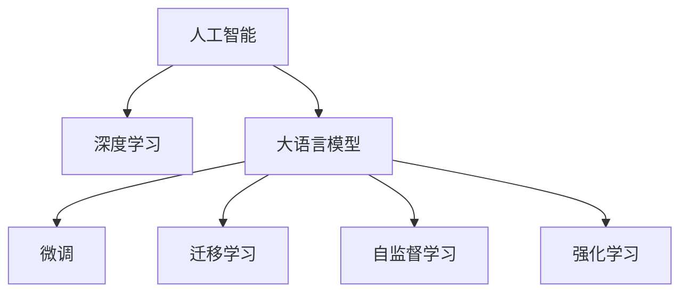

                 

# 人类智慧：AI 时代的新力量

## 1. 背景介绍

### 1.1 问题由来
进入21世纪以来，人工智能（AI）技术飞速发展，逐渐渗透到经济社会的各个角落。从自然语言处理（NLP）到计算机视觉（CV），从机器学习（ML）到深度学习（DL），AI技术正开启一个新的智能化时代。然而，尽管AI技术已取得诸多突破，但关于AI究竟如何赋能人类智慧，究竟能在多大程度上替代人类思考的问题，仍存在诸多争议。

### 1.2 问题核心关键点
AI时代的核心关键点在于：AI究竟能否帮助人类拓展智慧边界？它是否只是对人类智慧的延伸或替代？AI的发展，是否会对人类的思维方式、价值观念产生深远影响？

这些问题在AI的萌芽时期就已提出，但随着深度学习和神经网络技术的兴起，这些问题的答案也越发模糊。AI技术如大模型、微调、自监督学习等，正在逐步从算法层面接近甚至超越人类的某些智能能力，但这种超越是否等同于智慧的升华？AI的发展是否真正代表了人类智慧的进步？

### 1.3 问题研究意义
探讨AI与人类智慧的关系，不仅具有学术价值，还具有重要的实际意义：

1. **技术导向**：从技术层面，理解AI的底层原理和算法机制，有助于开发者更高效地设计和使用AI工具。
2. **社会影响**：从社会层面，了解AI对人类生活的影响，有助于公众更好地接受和使用AI技术，提升社会整体的技术素养。
3. **伦理考量**：从伦理层面，探讨AI与人类智慧的关系，有助于制定合理的AI伦理标准，规避AI带来的风险。
4. **教育启示**：从教育层面，AI的发展趋势和应用前景可以为未来的教育体系提供新思路，培养符合未来需求的复合型人才。

## 2. 核心概念与联系

### 2.1 核心概念概述

为了更好地理解AI时代对人类智慧的影响，本节将介绍几个核心的概念及其相互关联：

- **人工智能（AI）**：一种模拟人类智能行为的技术，包括感知、学习、推理、自然语言理解等能力。
- **深度学习（DL）**：一种基于神经网络的机器学习范式，通过多层次的特征提取和抽象，自动学习输入数据的高级表征。
- **大语言模型（LLMs）**：以Transformer为代表的自回归模型，通过海量无标签数据预训练，学习语言的全局表征和逻辑结构。
- **微调（Fine-Tuning）**：在预训练模型的基础上，通过有监督学习优化模型在某特定任务上的性能。
- **迁移学习（Transfer Learning）**：通过在不同但相关的任务间传递知识，提升模型在新任务上的表现。
- **自监督学习（SSL）**：无需标签数据，通过预训练模型内部的结构和学习任务，提取数据中的潜在信号。
- **强化学习（RL）**：通过环境反馈，模型自动学习最优策略，实现复杂决策任务的优化。

这些核心概念共同构成了AI技术的核心框架，通过对这些概念的深入理解，可以更好地把握AI时代的技术脉络。

### 2.2 核心概念原理和架构的 Mermaid 流程图


## 3. 核心算法原理 & 具体操作步骤

### 3.1 算法原理概述

AI时代的算法原理，主要围绕数据处理、模型训练和应用部署三个环节展开。在数据处理环节，AI技术通过数据收集、清洗、标注，为模型的训练提供输入。在模型训练环节，AI算法通过迭代优化，自动学习输入数据的表征和模式。在应用部署环节，AI模型通过推理，将学到的知识应用于现实场景。

AI算法主要分为三类：

1. **监督学习（Supervised Learning）**：使用标注数据训练模型，使其学习输入和输出之间的映射关系。
2. **无监督学习（Unsupervised Learning）**：使用无标注数据训练模型，使其学习数据的内在结构和规律。
3. **半监督学习（Semi-Supervised Learning）**：结合少量标注数据和大量无标注数据，提高模型的泛化能力。

在深度学习领域，监督学习常用于分类、回归、序列预测等任务。无监督学习常用于聚类、降维、生成模型等任务。半监督学习常用于图像、文本等领域。

### 3.2 算法步骤详解

AI算法的详细步骤通常包括：

1. **数据预处理**：对原始数据进行清洗、归一化、编码等预处理操作，使其适合模型输入。
2. **模型构建**：选择合适的模型架构，包括卷积神经网络（CNN）、循环神经网络（RNN）、Transformer等，并设置超参数。
3. **模型训练**：使用训练数据集，通过反向传播算法优化模型参数，最小化损失函数。
4. **模型评估**：使用验证数据集，评估模型的性能指标，如准确率、召回率、F1值等。
5. **模型部署**：将训练好的模型保存为二进制文件，并在实际应用场景中使用。

### 3.3 算法优缺点

AI算法具有以下优点：

1. **高效自动化**：AI算法通过自动化数据处理和模型训练，大幅提升工作效率，降低人工干预。
2. **泛化能力强**：通过深度学习模型，AI算法能够学习输入数据的高级特征，提高泛化能力。
3. **灵活可扩展**：AI算法可以根据具体任务需求，进行模型定制和优化，灵活性强。

然而，AI算法也存在以下缺点：

1. **数据依赖性强**：AI算法需要大量标注数据，数据质量和数量直接影响模型性能。
2. **模型黑箱问题**：深度学习模型通常具有高复杂度，难以解释其内部工作机制，存在“黑箱”问题。
3. **过拟合风险**：模型在训练过程中容易过拟合，尤其是数据量不足时。
4. **对抗攻击脆弱**：AI模型容易受到对抗样本的攻击，模型鲁棒性不足。
5. **伦理风险**：AI模型可能学习到有害信息，产生误导性输出，带来伦理风险。

### 3.4 算法应用领域

AI算法在多个领域得到了广泛应用，包括：

- **自然语言处理（NLP）**：如文本分类、情感分析、机器翻译等任务。
- **计算机视觉（CV）**：如图像分类、目标检测、人脸识别等任务。
- **语音识别（ASR）**：如语音转文本、语音指令识别等任务。
- **推荐系统**：如电商推荐、音乐推荐、新闻推荐等任务。
- **医疗健康**：如疾病预测、影像分析、基因分析等任务。
- **金融风控**：如信用评估、风险预测、反欺诈等任务。
- **智能制造**：如质量检测、故障预测、智能调度等任务。
- **智能交通**：如交通监控、路径规划、自动驾驶等任务。
- **智慧城市**：如城市管理、环境监测、智能家居等任务。

这些领域的应用展示了AI技术的广泛影响力和实际价值。

## 4. 数学模型和公式 & 详细讲解 & 举例说明

### 4.1 数学模型构建

AI算法的数学模型通常包括损失函数、优化算法、正则化技术等。以深度学习中的交叉熵损失函数为例：

设输入数据为 $x$，输出为 $y$，模型预测为 $\hat{y}$，则交叉熵损失函数为：

$$
L = -\frac{1}{N}\sum_{i=1}^N [y_i\log \hat{y_i} + (1-y_i)\log(1-\hat{y_i})]
$$

其中 $N$ 为样本数量。

### 4.2 公式推导过程

以深度学习中的前向传播算法为例，假设输入为 $x$，模型参数为 $\theta$，输出为 $\hat{y}$，则前向传播过程如下：

$$
\hat{y} = f(x;\theta)
$$

其中 $f$ 为模型非线性变换。

### 4.3 案例分析与讲解

以ImageNet数据集为例，展示卷积神经网络（CNN）的图像分类任务。假设输入为 $x$，标签为 $y$，模型参数为 $\theta$，则CNN模型前向传播过程如下：

1. **卷积层**：使用卷积核对输入数据进行卷积运算，提取特征。
2. **池化层**：对卷积层输出进行池化操作，减少特征维度。
3. **全连接层**：将池化层输出展开为向量，输入全连接层进行分类。
4. **Softmax层**：将全连接层输出进行Softmax函数变换，输出类别概率分布。

通过反向传播算法，计算损失函数对模型参数的梯度，更新模型参数。最终模型参数的更新公式为：

$$
\theta \leftarrow \theta - \eta \nabla_{\theta}L
$$

其中 $\eta$ 为学习率。

## 5. 项目实践：代码实例和详细解释说明

### 5.1 开发环境搭建

在Python环境下，使用PyTorch框架搭建CNN模型。首先安装PyTorch及其相关工具：

```bash
pip install torch torchvision torchaudio
```

### 5.2 源代码详细实现

以下是CNN模型在ImageNet数据集上的分类任务实现：

```python
import torch
import torch.nn as nn
import torch.optim as optim
import torchvision
import torchvision.transforms as transforms

# 加载数据集
transform = transforms.Compose([
    transforms.Resize((224, 224)),
    transforms.ToTensor(),
    transforms.Normalize(mean=[0.485, 0.456, 0.406], std=[0.229, 0.224, 0.225])
])
trainset = torchvision.datasets.ImageNet(traindir, train=True, download=True, transform=transform)
trainloader = torch.utils.data.DataLoader(trainset, batch_size=64, shuffle=True, num_workers=2)
testset = torchvision.datasets.ImageNet(traindir, train=False, download=True, transform=transform)
testloader = torch.utils.data.DataLoader(testset, batch_size=64, shuffle=False, num_workers=2)

# 定义模型
class Net(nn.Module):
    def __init__(self):
        super(Net, self).__init__()
        self.conv1 = nn.Conv2d(3, 64, kernel_size=3, stride=1, padding=1)
        self.conv2 = nn.Conv2d(64, 128, kernel_size=3, stride=1, padding=1)
        self.pool = nn.MaxPool2d(kernel_size=2, stride=2)
        self.fc1 = nn.Linear(128 * 28 * 28, 256)
        self.fc2 = nn.Linear(256, 10)

    def forward(self, x):
        x = self.conv1(x)
        x = nn.functional.relu(x)
        x = self.pool(x)
        x = self.conv2(x)
        x = nn.functional.relu(x)
        x = self.pool(x)
        x = x.view(-1, 128 * 28 * 28)
        x = self.fc1(x)
        x = nn.functional.relu(x)
        x = self.fc2(x)
        return nn.functional.log_softmax(x, dim=1)

# 定义损失函数和优化器
model = Net()
criterion = nn.CrossEntropyLoss()
optimizer = optim.SGD(model.parameters(), lr=0.01, momentum=0.9)

# 训练模型
for epoch in range(10):
    running_loss = 0.0
    for i, data in enumerate(trainloader, 0):
        inputs, labels = data
        optimizer.zero_grad()
        outputs = model(inputs)
        loss = criterion(outputs, labels)
        loss.backward()
        optimizer.step()
        running_loss += loss.item()
    print('Epoch [%d], loss: %.3f' % (epoch + 1, running_loss / len(trainloader)))

# 测试模型
correct = 0
total = 0
with torch.no_grad():
    for data in testloader:
        images, labels = data
        outputs = model(images)
        _, predicted = torch.max(outputs.data, 1)
        total += labels.size(0)
        correct += (predicted == labels).sum().item()
print('Accuracy of the network on the 10000 test images: %d %%' % (100 * correct / total))
```

### 5.3 代码解读与分析

上述代码实现了CNN模型在ImageNet数据集上的分类任务。通过定义卷积层、池化层、全连接层等网络结构，使用交叉熵损失函数，优化器等，对模型进行训练和测试。

## 6. 实际应用场景

### 6.1 医疗影像分析

AI在医疗影像分析中具有重要应用价值。通过深度学习算法，可以对医学影像进行自动分割、病变识别、病理分析等任务。例如，卷积神经网络（CNN）可以对医学影像进行自动分割，将影像中的不同组织结构分割出来，辅助医生进行病理诊断。

### 6.2 金融风险预测

AI在金融风险预测中具有重要应用价值。通过深度学习算法，可以对金融市场进行预测，识别潜在的风险因素。例如，深度神经网络（DNN）可以对历史交易数据进行分析，预测未来的市场走势，帮助投资者规避风险。

### 6.3 智能制造质量检测

AI在智能制造质量检测中具有重要应用价值。通过深度学习算法，可以对制造过程中的缺陷进行自动识别，提高检测效率。例如，卷积神经网络（CNN）可以对制造过程中的图像进行自动检测，识别出缺陷图像，帮助工程师及时发现问题并进行修复。

### 6.4 智慧城市交通管理

AI在智慧城市交通管理中具有重要应用价值。通过深度学习算法，可以对交通流量进行实时预测，优化交通调度。例如，循环神经网络（RNN）可以对交通流量数据进行预测，帮助城市管理者实时调整交通信号灯，缓解交通拥堵。

### 6.5 教育推荐系统

AI在教育推荐系统中有重要应用价值。通过深度学习算法，可以对学生进行个性化推荐，提高学习效率。例如，协同过滤算法可以对学生的历史学习数据进行分析，推荐适合的学习资源，帮助学生更好地学习。

## 7. 工具和资源推荐

### 7.1 学习资源推荐

1. **《Deep Learning》by Ian Goodfellow**：该书全面介绍了深度学习的原理和应用，是深度学习领域的经典教材。
2. **《Hands-On Machine Learning with Scikit-Learn, Keras, and TensorFlow》by Aurélien Géron**：该书深入浅出地介绍了机器学习算法，并使用Keras和TensorFlow实现。
3. **《Neural Networks and Deep Learning》by Michael Nielsen**：该网站介绍了神经网络和深度学习的原理，并使用Python实现。
4. **Coursera Machine Learning by Andrew Ng**：斯坦福大学开设的在线课程，涵盖机器学习的基本概念和算法。
5. **Kaggle机器学习竞赛平台**：该平台提供丰富的数据集和算法竞赛，帮助开发者提升实战技能。

### 7.2 开发工具推荐

1. **PyTorch**：Python的深度学习框架，支持GPU加速和分布式训练。
2. **TensorFlow**：Google的深度学习框架，支持GPU加速和分布式训练。
3. **Jupyter Notebook**：Python的交互式编程环境，支持代码编写和实时运行。
4. **Scikit-Learn**：Python的机器学习库，提供丰富的算法和工具。
5. **TensorBoard**：TensorFlow的可视化工具，可实时监控模型训练状态。

### 7.3 相关论文推荐

1. **ImageNet Classification with Deep Convolutional Neural Networks**：AlexNet论文，展示了CNN在ImageNet数据集上的分类效果。
2. **Deep Residual Learning for Image Recognition**：ResNet论文，展示了深度残差网络的训练技巧和分类效果。
3. **Playing Atari with Deep Reinforcement Learning**：DQN论文，展示了深度Q网络在Atari游戏上的强化学习效果。
4. **Attention is All You Need**：Transformer论文，展示了Transformer在NLP任务上的效果。
5. **BERT: Pre-training of Deep Bidirectional Transformers for Language Understanding**：BERT论文，展示了BERT在NLP任务上的效果。

## 8. 总结：未来发展趋势与挑战

### 8.1 研究成果总结

AI技术在多个领域取得了显著进展，逐步从实验室走向应用。深度学习、卷积神经网络、循环神经网络等技术在图像、语音、自然语言处理等领域得到了广泛应用。AI技术正在逐步改变人类社会的各个方面，带来了巨大的经济效益和社会效益。

### 8.2 未来发展趋势

未来，AI技术的发展趋势如下：

1. **更加智能化**：AI技术将不断突破人类智慧的边界，实现更加复杂和精细的任务。
2. **更加普适化**：AI技术将逐步应用于各个领域，提升各行各业的效率和质量。
3. **更加自适应**：AI技术将具备更强的自适应能力，能够实时调整模型参数和策略。
4. **更加人性化**：AI技术将具备更强的情感识别和交互能力，更好地理解人类需求。
5. **更加透明化**：AI技术将具备更强的可解释性，能够清晰解释其决策过程和推理逻辑。
6. **更加协同化**：AI技术将与其他技术协同发展，如知识表示、因果推理、强化学习等，形成更加全面的技术体系。

### 8.3 面临的挑战

AI技术在发展过程中面临以下挑战：

1. **数据获取难度大**：AI算法需要大量标注数据，但数据获取和标注成本高。
2. **算法复杂度高**：AI算法通常具有高复杂度，难以解释其内部工作机制。
3. **模型鲁棒性不足**：AI模型容易受到对抗样本的攻击，模型鲁棒性不足。
4. **伦理和安全风险**：AI模型可能学习到有害信息，产生误导性输出。
5. **技术普及难度大**：AI技术复杂度高，普及难度大，需要大量技术人才和资源支持。

### 8.4 研究展望

未来，AI技术的研究方向如下：

1. **更加智能化的AI算法**：研究更加智能化和自适应的AI算法，提升模型性能和泛化能力。
2. **更加普适化的AI技术**：研究适用于各个领域的AI技术，推动AI技术的广泛应用。
3. **更加透明的AI模型**：研究可解释性更强的AI模型，提升模型的可信度和可接受度。
4. **更加安全可靠的AI系统**：研究安全可靠、具备伦理道德约束的AI系统，规避AI带来的风险。
5. **更加协同发展的AI技术**：研究与其他技术协同发展的AI技术，形成更加全面的技术体系。

## 9. 附录：常见问题与解答

### Q1：AI是否能够替代人类智慧？

A：AI技术能够在某些领域替代人类智慧，但并不能完全替代人类智慧。AI技术在处理复杂任务时，仍然需要人类智慧的引导和解释。

### Q2：AI技术的发展前景如何？

A：AI技术的发展前景广阔，未来将逐步渗透到各个领域，提升各行各业的效率和质量。

### Q3：AI技术有哪些应用？

A：AI技术在医疗、金融、制造、交通、教育等多个领域得到了广泛应用。

### Q4：AI技术有哪些挑战？

A：AI技术面临数据获取难度大、算法复杂度高、模型鲁棒性不足、伦理和安全风险、技术普及难度大等挑战。

### Q5：AI技术有哪些未来发展方向？

A：AI技术未来将朝着更加智能化、普适化、自适应、人性化、透明化、协同化方向发展。

---

作者：禅与计算机程序设计艺术 / Zen and the Art of Computer Programming

