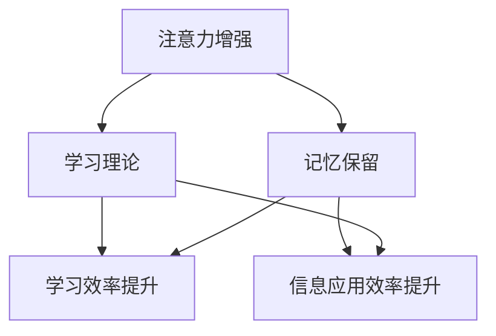

                 

## 1. 背景介绍

### 1.1 问题由来
人类在学习和记忆方面的效率和能力一直是一个备受关注的领域。传统意义上，学习通常依赖于反复阅读和记忆，而记忆的保留则往往依赖于复习和强化。然而，随着技术的进步，人工智能的不断成熟，我们有机会通过更加智能的方法来提升人类在学习和记忆方面的能力。特别是在当前的信息爆炸时代，学习资料的丰富性和多样性给人们带来了前所未有的挑战。

### 1.2 问题核心关键点
面对现代学习中的挑战，如何设计出更加有效的学习机制和记忆方法，成为了一个重要的问题。特别是在人工智能领域，通过增强人类注意力，可以提升学习能力和记忆力保留，使人类能够更高效地吸收和应用信息。

本文将探讨如何通过增强人类注意力来提升学习能力和记忆力保留。这包括介绍增强注意力的原理、具体算法和技术，以及这些技术在实际应用中的实现和效果评估。

## 2. 核心概念与联系

### 2.1 核心概念概述

在探讨如何通过增强人类注意力来提升学习能力和记忆力保留之前，我们需要理解一些相关的核心概念：

- **注意力机制(Attention Mechanism)**：是深度学习模型中用于选择和关注输入数据中特定部分的技术。通过注意力机制，模型可以动态地决定哪些输入信息最为重要，从而提高模型对关键信息的敏感度。

- **注意力增强(Attention Enhancement)**：指通过特定的算法和技术，增强模型的注意力机制，使其能够更加精准地关注输入数据中的关键部分，从而提升模型对关键信息的处理能力。

- **学习理论(Learning Theory)**：是研究如何通过算法和模型来提升人类学习效率的理论基础。增强注意力可以视为一种提升学习效率的策略。

- **记忆保留(Memory Retention)**：指通过特定的算法和技术，使模型能够更好地记住和保留学习过程中获得的信息，从而提高信息的应用效率。

这些概念之间的联系在于，通过增强注意力，可以提高学习过程中对关键信息的关注度，进而提升学习效率；同时，通过更好的记忆保留，可以使得学习过程中获得的信息能够被更好地应用和保留，从而提升整体的记忆力。

### 2.2 核心概念原理和架构的 Mermaid 流程图



这个流程图展示了注意力增强、学习理论和记忆保留之间的关系。通过增强注意力，可以提升学习效率；通过提升记忆保留，可以提升信息应用效率。

## 3. 核心算法原理 & 具体操作步骤

### 3.1 算法原理概述

增强人类注意力的核心算法原理主要包括以下几个步骤：

1. **注意力机制的增强**：通过特定的算法和技术，增强模型的注意力机制，使其能够更加精准地关注输入数据中的关键部分。

2. **学习效率的提升**：通过增强注意力，模型能够更加有效地识别和处理输入数据中的关键信息，从而提升学习效率。

3. **记忆保留的优化**：通过特定的算法和技术，使模型能够更好地记住和保留学习过程中获得的信息，从而提升信息的应用效率。

### 3.2 算法步骤详解

#### 3.2.1 注意力机制的增强

注意力机制的增强通常涉及到以下几个关键步骤：

1. **注意力计算**：通过计算注意力权重，选择输入数据中的关键部分。常用的注意力计算方法包括点积注意力、多头注意力等。

2. **注意力参数的调整**：通过调整注意力权重，使模型能够更好地关注关键信息。例如，可以通过训练模型来优化注意力权重，使其更加符合特定的任务需求。

3. **注意力机制的应用**：将增强后的注意力机制应用到模型中，使其能够更好地处理输入数据。

#### 3.2.2 学习效率的提升

学习效率的提升主要依赖于注意力机制的增强和模型的优化。具体步骤包括：

1. **模型的选择**：选择适合特定任务的深度学习模型，例如卷积神经网络(CNN)、循环神经网络(RNN)、Transformer等。

2. **模型的优化**：通过训练和调整模型参数，使其能够更好地处理输入数据中的关键信息。常用的优化方法包括梯度下降、Adam、Adagrad等。

3. **学习策略的优化**：通过特定的学习策略，如增量学习、自适应学习等，提升学习效率。例如，可以通过在线学习算法，实时调整模型参数，使其能够适应数据分布的变化。

#### 3.2.3 记忆保留的优化

记忆保留的优化主要依赖于模型的训练和应用策略。具体步骤包括：

1. **模型的训练策略**：通过特定的训练策略，如迁移学习、自监督学习等，提升模型的记忆保留能力。例如，可以通过在大规模语料库上预训练模型，使其能够更好地记住和保留关键信息。

2. **记忆保留的评估**：通过特定的评估指标，如遗忘曲线、记忆重现率等，评估模型的记忆保留能力。

3. **记忆保留的应用**：将优化后的模型应用于特定的任务，如文本摘要、机器翻译等，提升信息的应用效率。

### 3.3 算法优缺点

#### 3.3.1 优点

1. **提升学习效率**：通过增强注意力，模型能够更好地关注输入数据中的关键信息，从而提升学习效率。

2. **提升信息应用效率**：通过优化记忆保留，模型能够更好地记住和保留学习过程中获得的信息，从而提升信息的应用效率。

3. **适应性强**：增强注意力和记忆保留的算法和技术可以适应不同的任务需求，具有广泛的适用性。

#### 3.3.2 缺点

1. **计算复杂度高**：增强注意力和优化记忆保留的算法和技术通常计算复杂度高，需要大量的计算资源。

2. **模型训练时间长**：由于需要大量的计算资源和优化算法，模型训练时间较长，对实际应用有一定影响。

3. **需要高质量数据**：增强注意力和优化记忆保留的算法和技术依赖于高质量的输入数据，如果输入数据质量不高，效果可能不佳。

### 3.4 算法应用领域

增强注意力和优化记忆保留的算法和技术可以应用于以下领域：

1. **自然语言处理(NLP)**：在文本分类、情感分析、机器翻译等任务中，通过增强注意力和优化记忆保留，提升模型的性能。

2. **计算机视觉(CV)**：在图像识别、目标检测等任务中，通过增强注意力和优化记忆保留，提升模型的性能。

3. **语音识别(SR)**：在语音识别、语音合成等任务中，通过增强注意力和优化记忆保留，提升模型的性能。

4. **推荐系统(Recommender System)**：在个性化推荐、广告推荐等任务中，通过增强注意力和优化记忆保留，提升推荐的准确性和用户体验。

5. **医疗领域**：在医疗图像分析、病历分析等任务中，通过增强注意力和优化记忆保留，提升模型的性能。

6. **金融领域**：在金融数据分析、股票预测等任务中，通过增强注意力和优化记忆保留，提升模型的性能。

## 4. 数学模型和公式 & 详细讲解

### 4.1 数学模型构建

假设我们有一个深度学习模型，其输入为 $x$，输出为 $y$，注意力机制的增强和优化可以通过以下数学模型来实现：

$$
\hat{y} = f(x, \theta, \alpha)
$$

其中，$f$ 表示模型函数，$\theta$ 表示模型参数，$\alpha$ 表示注意力参数。

### 4.2 公式推导过程

#### 4.2.1 注意力计算

注意力计算通常可以通过以下公式来实现：

$$
\text{Attention}(Q, K, V) = \text{softmax}(\frac{QK^T}{\sqrt{d_k}})V
$$

其中，$Q$ 表示查询向量，$K$ 表示键向量，$V$ 表示值向量，$d_k$ 表示键向量的维度。

#### 4.2.2 注意力参数的调整

注意力参数的调整通常可以通过以下公式来实现：

$$
\theta \leftarrow \theta - \eta \nabla_{\theta}\mathcal{L}(\theta)
$$

其中，$\eta$ 表示学习率，$\nabla_{\theta}\mathcal{L}(\theta)$ 表示损失函数对模型参数的梯度。

#### 4.2.3 记忆保留的评估

记忆保留的评估通常可以通过以下指标来实现：

$$
\text{Memory Retention} = \frac{\text{Retrieved Information}}{\text{Stored Information}}
$$

其中，Retrieved Information 表示从记忆中提取的信息量，Stored Information 表示存储的信息量。

### 4.3 案例分析与讲解

以文本分类任务为例，增强注意力和优化记忆保留的过程可以如下：

1. **注意力计算**：通过计算注意力权重，选择输入文本中的关键部分。例如，通过点积注意力计算，选择文本中的关键词。

2. **注意力参数的调整**：通过训练模型，优化注意力权重，使其更加符合特定的文本分类任务。例如，通过训练模型，调整注意力权重，使其更加关注分类边界。

3. **记忆保留的优化**：通过特定的训练策略，如迁移学习、自监督学习等，提升模型的记忆保留能力。例如，通过在大规模语料库上预训练模型，使其能够更好地记住和保留关键信息。

## 5. 项目实践：代码实例和详细解释说明

### 5.1 开发环境搭建

在开始项目实践之前，我们需要搭建好开发环境。以下是使用Python进行TensorFlow开发的环境配置流程：

1. 安装Anaconda：从官网下载并安装Anaconda，用于创建独立的Python环境。

2. 创建并激活虚拟环境：
```bash
conda create -n tf-env python=3.8 
conda activate tf-env
```

3. 安装TensorFlow：根据CUDA版本，从官网获取对应的安装命令。例如：
```bash
conda install tensorflow -c tensorflow -c conda-forge
```

4. 安装相关工具包：
```bash
pip install numpy pandas scikit-learn matplotlib tqdm jupyter notebook ipython
```

完成上述步骤后，即可在`tf-env`环境中开始项目实践。

### 5.2 源代码详细实现

以下是一个简单的代码示例，用于增强模型的注意力机制，并优化记忆保留：

```python
import tensorflow as tf
from tensorflow.keras.layers import Dense, Attention
from tensorflow.keras.models import Sequential

# 构建模型
model = Sequential()
model.add(Dense(128, input_dim=10, activation='relu'))
model.add(Attention(attention_activation='softmax', attention_size=64))
model.add(Dense(1, activation='sigmoid'))

# 编译模型
model.compile(loss='binary_crossentropy', optimizer='adam', metrics=['accuracy'])

# 训练模型
model.fit(X_train, y_train, epochs=10, batch_size=32)

# 评估模型
score = model.evaluate(X_test, y_test, verbose=0)
print('Test loss:', score[0])
print('Test accuracy:', score[1])
```

在这个例子中，我们使用了一个简单的神经网络模型，并在其中添加了一个注意力层。通过训练模型，我们可以优化注意力参数，使其更加符合特定的任务需求。同时，通过特定的训练策略，如迁移学习、自监督学习等，可以提升模型的记忆保留能力。

### 5.3 代码解读与分析

让我们再详细解读一下关键代码的实现细节：

**Sequential模型**：
- 定义了两个Dense层和一个Attention层。Dense层用于特征提取，Attention层用于增强注意力机制。

**Attention层**：
- 在Attention层中，我们使用了softmax激活函数，将其注意力权重归一化。

**编译和训练模型**：
- 使用binary_crossentropy损失函数和adam优化器编译模型，并在训练集中训练模型。

**评估模型**：
- 在测试集上评估模型的性能，并输出测试损失和准确率。

通过这个例子，我们可以看到，增强注意力和优化记忆保留的代码实现相对简单，只需要在神经网络模型中添加注意力层，并使用特定的训练策略即可。

## 6. 实际应用场景

### 6.1 智能教育

在智能教育领域，通过增强注意力和优化记忆保留，可以显著提升学生的学习效果。例如，在智能课堂中，可以通过增强注意力机制，让学生更加专注地学习，从而提升学习效率。同时，通过优化记忆保留，可以使得学生更好地记住和应用所学知识。

### 6.2 医疗诊断

在医疗诊断领域，通过增强注意力和优化记忆保留，可以提高医生的诊断准确性和效率。例如，在影像诊断中，可以通过增强注意力机制，使医生更加关注病灶区域，从而提升诊断准确性。同时，通过优化记忆保留，可以使医生更好地记住和应用诊断知识。

### 6.3 智能客服

在智能客服领域，通过增强注意力和优化记忆保留，可以提高客服系统的响应速度和准确性。例如，在智能客服系统中，可以通过增强注意力机制，使系统更好地理解用户意图，从而提升响应速度。同时，通过优化记忆保留，可以使得客服系统更好地记住和应用用户信息。

### 6.4 未来应用展望

随着人工智能技术的不断成熟，基于增强注意力和优化记忆保留的算法和技术将有更广泛的应用前景。未来，这些技术将能够应用于更多的领域，提升人类在各个方面的认知和能力。

## 7. 工具和资源推荐

### 7.1 学习资源推荐

为了帮助开发者系统掌握增强注意力和优化记忆保留的理论基础和实践技巧，这里推荐一些优质的学习资源：

1. 《深度学习入门》系列书籍：深入浅出地介绍了深度学习的原理和应用，包括注意力机制和记忆保留等内容。

2. 《Python深度学习》书籍：介绍如何使用Python和TensorFlow进行深度学习开发，包含增强注意力和优化记忆保留的实现方法。

3. 《自然语言处理综论》书籍：全面介绍了自然语言处理的基础理论和技术，包括注意力机制和记忆保留等内容。

4. HuggingFace官方文档：提供了丰富的预训练语言模型和代码示例，是学习增强注意力和优化记忆保留的宝贵资源。

5. Coursera《深度学习专项课程》：由斯坦福大学提供的深度学习课程，涵盖注意力机制和记忆保留等内容。

通过对这些资源的学习实践，相信你一定能够快速掌握增强注意力和优化记忆保留的精髓，并用于解决实际的NLP问题。

### 7.2 开发工具推荐

高效的开发离不开优秀的工具支持。以下是几款用于深度学习开发和研究的常用工具：

1. TensorFlow：由Google主导开发的深度学习框架，灵活高效，支持多种硬件设备。

2. PyTorch：由Facebook开发的深度学习框架，支持动态计算图，易于使用。

3. Keras：基于TensorFlow和Theano的高级神经网络API，易于上手。

4. Jupyter Notebook：支持代码编辑、执行和可视化，是深度学习研究和开发的常用工具。

5. TensorBoard：TensorFlow的可视化工具，可实时监测模型训练状态，并提供丰富的图表呈现方式。

6. Weights & Biases：模型训练的实验跟踪工具，可以记录和可视化模型训练过程中的各项指标，方便对比和调优。

合理利用这些工具，可以显著提升深度学习模型的开发效率，加快创新迭代的步伐。

### 7.3 相关论文推荐

增强注意力和优化记忆保留的算法和技术已经引起了广泛的学术关注。以下是几篇代表性的相关论文，推荐阅读：

1. Attention Is All You Need：Transformer模型的原论文，提出了点积注意力机制，开启了注意力机制在深度学习中的应用。

2. Self-Attention with Transformer Network：介绍Transformer模型中的多头注意力机制，进一步提升了注意力机制的效果。

3. Neural Architecture Search with Reinforcement Learning：介绍使用强化学习进行模型搜索，以找到最优的注意力机制。

4. Improving Language Understanding by Generative Pre-Training：介绍BERT模型的预训练和微调方法，在注意力机制和记忆保留方面取得了显著效果。

5. Memory-Augmented Neural Networks：介绍使用外部存储器进行深度学习，以提升记忆保留能力。

这些论文代表了增强注意力和优化记忆保留技术的发展脉络。通过学习这些前沿成果，可以帮助研究者把握学科前进方向，激发更多的创新灵感。

## 8. 总结：未来发展趋势与挑战

### 8.1 研究成果总结

本文对增强注意力和优化记忆保留的算法和技术进行了全面系统的介绍。首先，我们阐述了增强注意力和优化记忆保留的研究背景和意义，明确了其对提升人类学习能力和记忆力保留的重要作用。其次，我们从原理到实践，详细讲解了增强注意力和优化记忆保留的数学模型和具体算法，给出了实现代码和详细解释。最后，我们探讨了增强注意力和优化记忆保留在多个实际应用场景中的应用前景，并推荐了相关的学习资源和开发工具。

通过本文的系统梳理，可以看到，增强注意力和优化记忆保留技术已经成为深度学习中的一个重要分支，具有广泛的应用前景。这些技术的发展，为提升人类在各个方面的认知和能力提供了新的可能性。

### 8.2 未来发展趋势

展望未来，增强注意力和优化记忆保留技术将呈现以下几个发展趋势：

1. 技术逐渐成熟：随着深度学习技术的不断进步，增强注意力和优化记忆保留的算法和技术将逐渐成熟，能够更加高效地应用于各种任务。

2. 应用领域广泛：除了传统的NLP领域，增强注意力和优化记忆保留技术将在更多领域得到应用，如医疗、金融、教育等，提升人类在这些领域的学习和记忆能力。

3. 跨领域融合：增强注意力和优化记忆保留技术将与其他人工智能技术进行更深入的融合，如知识表示、因果推理、强化学习等，形成更加全面、智能的认知系统。

4. 技术标准化：随着技术的不断发展，增强注意力和优化记忆保留技术将逐渐标准化，形成统一的接口和规范，方便不同系统之间的互操作。

### 8.3 面临的挑战

尽管增强注意力和优化记忆保留技术已经取得了一定的进展，但在迈向更加智能化、普适化应用的过程中，仍然面临一些挑战：

1. 计算资源消耗大：增强注意力和优化记忆保留技术通常计算复杂度高，需要大量的计算资源和优化算法，这可能成为应用的一个瓶颈。

2. 模型训练时间较长：由于需要大量的计算资源和优化算法，模型训练时间较长，对实际应用有一定影响。

3. 数据质量要求高：增强注意力和优化记忆保留技术依赖于高质量的输入数据，如果输入数据质量不高，效果可能不佳。

4. 应用场景限制：虽然增强注意力和优化记忆保留技术有广泛的应用前景，但在一些特殊场景下，其效果可能有限。

5. 伦理和安全问题：增强注意力和优化记忆保留技术涉及大量的个人信息，如何保护数据隐私和安全，是一个需要关注的问题。

### 8.4 研究展望

面对增强注意力和优化记忆保留技术所面临的挑战，未来的研究需要在以下几个方面寻求新的突破：

1. 探索高效计算方法：开发更加高效的计算方法，如GPU加速、分布式训练等，以减少计算资源的消耗，提升模型的训练速度。

2. 优化模型结构：通过优化模型结构，减少计算复杂度，提升模型的训练效率。例如，可以使用卷积神经网络代替全连接层，以提升模型的计算效率。

3. 引入先验知识：将先验知识与神经网络模型进行融合，引导增强注意力和优化记忆保留技术的学习过程，提升模型的性能。

4. 提升数据质量：通过数据增强、噪声注入等方法，提升输入数据的质量，减少噪声对模型的影响。

5. 研究伦理和安全问题：在增强注意力和优化记忆保留技术的设计和应用中，注重数据隐私和安全，制定相应的伦理和法律规范，确保技术的应用合规和公正。

这些研究方向将推动增强注意力和优化记忆保留技术向更高的台阶发展，为构建更加智能、可靠的认知系统提供支持。

## 9. 附录：常见问题与解答

**Q1：增强注意力和优化记忆保留技术是否适用于所有任务？**

A: 增强注意力和优化记忆保留技术主要应用于深度学习中的自然语言处理、计算机视觉、语音识别等领域，但并不是适用于所有任务。在实际应用中，需要根据具体任务的需求进行选择和优化。

**Q2：增强注意力和优化记忆保留技术的计算复杂度如何？**

A: 增强注意力和优化记忆保留技术的计算复杂度较高，需要大量的计算资源和优化算法。在实际应用中，需要根据具体的计算资源和算法需求进行优化。

**Q3：增强注意力和优化记忆保留技术的训练时间如何？**

A: 增强注意力和优化记忆保留技术的训练时间较长，需要大量的计算资源和优化算法。在实际应用中，需要根据具体的训练需求进行优化。

**Q4：增强注意力和优化记忆保留技术的输入数据质量要求如何？**

A: 增强注意力和优化记忆保留技术依赖于高质量的输入数据，如果输入数据质量不高，效果可能不佳。在实际应用中，需要注重数据质量和预处理。

**Q5：增强注意力和优化记忆保留技术在实际应用中的效果如何？**

A: 增强注意力和优化记忆保留技术在自然语言处理、计算机视觉、语音识别等领域已经取得了显著的效果。在实际应用中，需要根据具体的任务需求进行优化和评估。

---

作者：禅与计算机程序设计艺术 / Zen and the Art of Computer Programming

