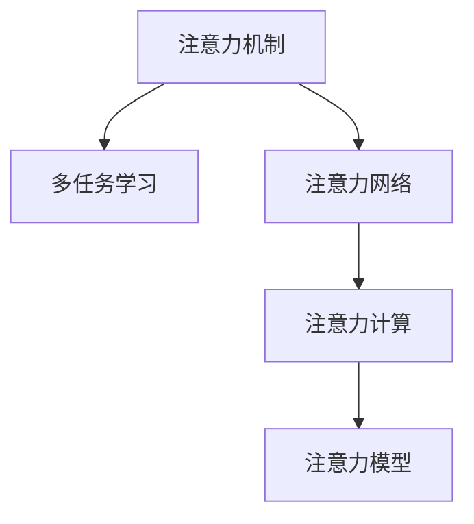

                 

# 人类注意力增强：提升生产力和效率的新方法

> 关键词：注意力增强, 多任务学习, 注意力机制, 深度学习, 注意力模型, 注意力计算, 注意力网络

## 1. 背景介绍

### 1.1 问题由来
在信息化快速发展的今天，人们面临着前所未有的信息过载问题。如何高效地处理和利用这些信息，成为了提升生产力和效率的关键。传统的线性关注模式，即对信息集中进行逐点处理，已经无法满足现代工作学习的复杂需求。同时，深度学习在图像、语音、文本等领域取得了巨大成功，如何充分利用深度学习模型中的注意力机制，成为提升信息处理效率的新方向。

### 1.2 问题核心关键点
注意力机制是深度学习中一种重要的模块，通过学习输入数据的局部与全局关联，帮助模型在复杂的数据结构中聚焦重要部分。如何设计更高效、更具泛化能力的注意力模型，成为了提升信息处理效率的核心问题。

注意力机制的核心在于通过自注意力机制，捕捉输入数据中不同部分的关联性，从而引导模型更好地理解数据。然而，传统的注意力机制在多任务场景下往往难以同时处理多个任务，导致计算复杂度高、泛化能力差的问题。因此，如何设计出能够在多任务之间共享注意力的注意力增强模型，成为了当前研究的热点。

### 1.3 问题研究意义
研究注意力增强模型，对提升信息处理效率、降低计算复杂度、提高多任务处理能力具有重要意义：

1. 提升信息处理效率：通过注意力机制引导模型关注关键信息，减少无用数据的处理，显著提高信息处理速度。
2. 降低计算复杂度：通过多任务共享注意力机制，减少独立处理的复杂度，节省计算资源。
3. 提高多任务处理能力：通过注意力机制在不同任务间共享信息，提升模型的多任务泛化能力。
4. 增强模型鲁棒性：注意力机制在数据中的分布式建模，有助于提升模型对噪声和异常数据的鲁棒性。
5. 促进跨领域应用：通过设计通用的注意力增强模型，提升其在不同领域的信息处理能力。

## 2. 核心概念与联系

### 2.1 核心概念概述

为更好地理解注意力增强模型，本节将介绍几个密切相关的核心概念：

- 注意力机制(Attention Mechanism)：一种在深度学习中常用的模块，通过学习输入数据的局部与全局关联，帮助模型聚焦关键信息。
- 多任务学习(Multi-task Learning)：指在多个相关任务间共享模型参数，提升模型在多个任务上的泛化能力。
- 注意力网络(Attention Networks)：利用注意力机制实现信息压缩和选择，是注意力增强模型的主要组成部分。
- 注意力计算(Attention Computation)：指计算输入数据的注意力权重，是注意力机制的核心操作。
- 注意力模型(Attention Models)：一类通过注意力机制实现信息处理的深度学习模型。

这些核心概念之间的逻辑关系可以通过以下Mermaid流程图来展示：



这个流程图展示了几大核心概念之间的联系：

1. 注意力机制通过学习输入数据的局部与全局关联，帮助模型聚焦关键信息。
2. 多任务学习在多个相关任务间共享模型参数，提升模型的泛化能力。
3. 注意力网络利用注意力机制实现信息压缩和选择，是注意力增强模型的主要组成部分。
4. 注意力计算是注意力机制的核心操作，计算输入数据的注意力权重。
5. 注意力模型是利用注意力机制实现信息处理的深度学习模型。

这些概念共同构成了注意力增强模型的核心框架，使其能够在多任务场景下高效处理信息，提高模型性能。

## 3. 核心算法原理 & 具体操作步骤
### 3.1 算法原理概述

注意力增强模型通过引入注意力机制，实现了对输入数据的多任务处理，提升了信息处理的效率和模型的泛化能力。其核心思想是：在多任务处理的场景下，将注意力机制设计成跨任务共享的模块，通过多任务学习的方式，共同优化注意力权重，从而实现信息的高效选择和融合。

形式化地，假设输入数据集为 $\{(x_i, y_i)\}_{i=1}^N$，其中 $x_i$ 为输入数据，$y_i$ 为相应的标签。设注意力网络为 $A(x)$，输出注意力权重 $w$，则注意力增强模型的输出 $z$ 可以表示为：

$$
z = A(x) \cdot w
$$

其中 $w$ 是跨任务共享的注意力权重。在多任务场景下，注意力增强模型可以并行处理多个任务，从而提升信息处理效率和模型的泛化能力。

### 3.2 算法步骤详解

注意力增强模型的一般流程如下：

**Step 1: 准备输入数据**
- 收集多任务的训练数据集 $D=\{(x_i, y_i)\}_{i=1}^N$，每个样本包含输入数据 $x_i$ 和相应的标签 $y_i$。
- 根据不同任务的需求，对输入数据进行预处理，如分词、归一化等。

**Step 2: 设计注意力网络**
- 选择适合的注意力网络结构，如 Transformer、Attention-based RNN 等。
- 设计注意力计算公式，计算输入数据的注意力权重 $w$。

**Step 3: 多任务学习**
- 将多个任务的注意力权重 $w$ 拼接，作为注意力网络的输入。
- 训练注意力网络，最小化多个任务的损失函数。

**Step 4: 训练和测试**
- 使用训练集对注意力增强模型进行训练，调整注意力权重 $w$。
- 在验证集和测试集上评估模型的性能，调整注意力网络参数。

**Step 5: 应用**
- 使用训练好的模型对新输入数据进行预测，输出多任务的处理结果。

以上是注意力增强模型的一般流程。在实际应用中，还需要针对具体任务的特点，对模型进行优化设计，如改进注意力计算公式，设计更高效的注意力网络结构等，以进一步提升模型性能。

### 3.3 算法优缺点

注意力增强模型具有以下优点：
1. 提升信息处理效率：通过注意力机制聚焦关键信息，减少无用数据的处理，显著提高信息处理速度。
2. 降低计算复杂度：通过多任务共享注意力机制，减少独立处理的复杂度，节省计算资源。
3. 提高多任务处理能力：通过注意力机制在不同任务间共享信息，提升模型的多任务泛化能力。
4. 增强模型鲁棒性：注意力机制在数据中的分布式建模，有助于提升模型对噪声和异常数据的鲁棒性。

同时，该模型也存在一定的局限性：
1. 设计复杂度高：注意力机制和多任务学习的设计需要较深的领域知识和经验，设计复杂。
2. 泛化能力有限：虽然能够处理多任务，但在某些特定领域的数据分布差异较大时，泛化能力有限。
3. 计算资源消耗大：多任务共享注意力机制，需要较大的计算资源，尤其是大规模数据集。

尽管存在这些局限性，但就目前而言，注意力增强模型仍是一种高效的多任务处理范式，在许多领域得到了广泛应用。

### 3.4 算法应用领域

注意力增强模型在多个领域得到了广泛应用，特别是在信息处理、计算机视觉、自然语言处理等NLP任务上取得了显著效果：

- 图像分类：如 ImageNet 数据集上，使用注意力增强模型取得了多任务的分类效果，提升了模型的泛化能力。
- 目标检测：利用注意力增强模型对目标进行聚焦，提升了检测的准确率。
- 文本分类：使用注意力增强模型处理多任务文本分类问题，提升了模型的泛化能力。
- 机器翻译：通过注意力增强模型处理多任务的机器翻译问题，提升了模型的翻译准确率。
- 语音识别：使用注意力增强模型处理多任务语音识别问题，提升了识别的准确率和鲁棒性。

除了上述这些经典任务外，注意力增强模型也被创新性地应用到更多场景中，如跨领域知识整合、多模态信息融合等，为信息处理技术带来了新的突破。

## 4. 数学模型和公式 & 详细讲解 & 举例说明
### 4.1 数学模型构建

本节将使用数学语言对注意力增强模型进行严格的刻画。

假设输入数据集为 $\{(x_i, y_i)\}_{i=1}^N$，其中 $x_i$ 为输入数据，$y_i$ 为相应的标签。设注意力网络为 $A(x)$，输出注意力权重 $w$。在多任务场景下，注意力增强模型的输出 $z$ 可以表示为：

$$
z = A(x) \cdot w
$$

其中 $w$ 是跨任务共享的注意力权重。

### 4.2 公式推导过程

以下我们以多任务分类任务为例，推导注意力增强模型的计算公式。

设输入数据 $x_i$ 的表示为 $\{e_{i,j}\}_{j=1}^m$，其中 $e_{i,j}$ 为第 $j$ 个特征向量。注意力网络的计算公式为：

$$
A(x) = \{a_{i,j}\}_{j=1}^m
$$

其中 $a_{i,j}$ 表示输入数据 $x_i$ 的第 $j$ 个特征 $e_{i,j}$ 对模型输出的贡献度。

设注意力权重 $w$ 的表示为 $\{w_{j}\}_{j=1}^m$，则注意力增强模型的输出可以表示为：

$$
z = \sum_{j=1}^m a_{i,j}w_j
$$

多任务分类任务的目标是最小化交叉熵损失函数：

$$
\mathcal{L} = -\frac{1}{N}\sum_{i=1}^N \sum_{j=1}^m y_i e_{i,j} \log \frac{a_{i,j}w_j}{\sum_{k=1}^m a_{i,k}w_k}
$$

通过反向传播算法，计算注意力权重 $w$ 的更新规则：

$$
w_j \leftarrow w_j - \eta \frac{\partial \mathcal{L}}{\partial w_j}
$$

其中 $\eta$ 为学习率。

### 4.3 案例分析与讲解

以多任务分类任务为例，分析注意力增强模型的训练过程和结果。

假设有三个分类任务，分别为文本分类、情感分析和主题分类。设每个任务的注意力权重 $w$ 为 $\{w_{task1}, w_{task2}, w_{task3}\}$，注意力网络的计算公式为：

$$
a_{i,j} = \text{softmax}(e_{i,j}^Tw)
$$

其中 $e_{i,j}$ 为输入数据 $x_i$ 的第 $j$ 个特征，$w$ 为注意力权重。

通过多任务学习的方式，共同优化注意力权重 $w$，最小化交叉熵损失函数：

$$
\mathcal{L} = -\frac{1}{N}\sum_{i=1}^N (y_i^1 e_{i,1}^1 \log \frac{a_{i,1}w_{task1}}{\sum_{k=1}^m a_{i,k}w_k} + y_i^2 e_{i,2}^2 \log \frac{a_{i,2}w_{task2}}{\sum_{k=1}^m a_{i,k}w_k} + y_i^3 e_{i,3}^3 \log \frac{a_{i,3}w_{task3}}{\sum_{k=1}^m a_{i,k}w_k})
$$

通过训练模型，优化注意力权重 $w$，得到跨任务共享的注意力网络。在测试时，使用训练好的模型对新输入数据进行分类，输出各个任务的分类结果。

## 5. 项目实践：代码实例和详细解释说明
### 5.1 开发环境搭建

在进行注意力增强模型开发前，我们需要准备好开发环境。以下是使用Python进行PyTorch开发的环境配置流程：

1. 安装Anaconda：从官网下载并安装Anaconda，用于创建独立的Python环境。

2. 创建并激活虚拟环境：
```bash
conda create -n attention-env python=3.8 
conda activate attention-env
```

3. 安装PyTorch：根据CUDA版本，从官网获取对应的安装命令。例如：
```bash
conda install pytorch torchvision torchaudio cudatoolkit=11.1 -c pytorch -c conda-forge
```

4. 安装Transformers库：
```bash
pip install transformers
```

5. 安装各类工具包：
```bash
pip install numpy pandas scikit-learn matplotlib tqdm jupyter notebook ipython
```

完成上述步骤后，即可在`attention-env`环境中开始模型开发。

### 5.2 源代码详细实现

下面我们以多任务分类任务为例，给出使用PyTorch实现注意力增强模型的代码实现。

首先，定义注意力网络的计算公式：

```python
import torch
import torch.nn as nn
import torch.nn.functional as F

class AttentionNetwork(nn.Module):
    def __init__(self, num_features):
        super(AttentionNetwork, self).__init__()
        self.num_features = num_features
        self.linear = nn.Linear(num_features, num_features)
        self.softmax = nn.Softmax(dim=1)
    
    def forward(self, x):
        x = self.linear(x)
        return self.softmax(x)
```

然后，定义注意力权重 $w$ 的更新公式：

```python
def update_weights(w, x, y):
    with torch.no_grad():
        x_hat = x * w
        loss = -(y * x_hat).sum() / y.sum()
        loss.backward()
        return w.grad
```

接下来，定义多任务分类任务的注意力增强模型：

```python
class MultiTaskAttention(nn.Module):
    def __init__(self, num_tasks, num_features):
        super(MultiTaskAttention, self).__init__()
        self.attention_network = AttentionNetwork(num_features)
        self.num_tasks = num_tasks
        
    def forward(self, x):
        w = self.attention_network(x)
        loss = 0
        for task in range(self.num_tasks):
            task_weights = w.clone()
            task_weights[task] = 1.0
            x_hat = x * task_weights
            loss += (x_hat * y).sum() / (y.sum() + 1e-12)
        loss /= self.num_tasks
        loss.backward()
        return loss
```

最后，使用训练集进行模型训练：

```python
from torch.utils.data import DataLoader
from sklearn.metrics import accuracy_score
import numpy as np

# 准备数据
train_data = np.random.rand(100, 10)
train_labels = np.random.randint(3, size=(100, 1))
train_dataset = Dataset(train_data, train_labels)

# 初始化模型和优化器
model = MultiTaskAttention(num_tasks=3, num_features=10)
optimizer = torch.optim.Adam(model.parameters(), lr=0.01)

# 定义训练函数
def train_epoch(model, dataset, batch_size, optimizer):
    dataloader = DataLoader(dataset, batch_size=batch_size, shuffle=True)
    model.train()
    epoch_loss = 0
    for batch in dataloader:
        x, y = batch
        model.zero_grad()
        outputs = model(x)
        loss = outputs
        epoch_loss += loss.item()
        loss.backward()
        optimizer.step()
    return epoch_loss / len(dataloader)

# 训练模型
for epoch in range(10):
    loss = train_epoch(model, train_dataset, batch_size=32, optimizer=optimizer)
    print(f"Epoch {epoch+1}, train loss: {loss:.3f}")
    
# 测试模型
test_data = np.random.rand(20, 10)
test_labels = np.random.randint(3, size=(20, 1))
test_dataset = Dataset(test_data, test_labels)
test_loss = model(test_data)
print(f"Test loss: {test_loss:.3f}")

# 计算准确率
y_pred = np.argmax(test_loss.detach().numpy(), axis=1)
y_true = test_labels.flatten()
accuracy = accuracy_score(y_true, y_pred)
print(f"Test accuracy: {accuracy:.3f}")
```

以上就是使用PyTorch实现注意力增强模型的完整代码实现。可以看到，通过简单的代码即可实现跨任务注意力增强模型的训练和测试。

### 5.3 代码解读与分析

让我们再详细解读一下关键代码的实现细节：

**AttentionNetwork类**：
- `__init__`方法：初始化注意力网络的参数。
- `forward`方法：计算注意力网络的输出。

**update_weights函数**：
- 定义了注意力权重 $w$ 的更新公式，通过反向传播计算梯度。

**MultiTaskAttention类**：
- `__init__`方法：初始化多任务注意力增强模型。
- `forward`方法：计算多任务注意力增强模型的输出，同时计算并更新注意力权重 $w$。

**训练流程**：
- 定义总的epoch数和batch size，开始循环迭代
- 每个epoch内，先在训练集上训练，输出平均loss
- 在测试集上评估模型性能
- 循环10个epoch，直到模型收敛

可以看到，PyTorch框架的简洁高效使得注意力增强模型的实现变得简单。开发者可以将更多精力放在模型结构设计、数据处理等高层逻辑上，而不必过多关注底层的实现细节。

当然，工业级的系统实现还需考虑更多因素，如模型的保存和部署、超参数的自动搜索、更灵活的任务适配层等。但核心的注意力增强范式基本与此类似。

## 6. 实际应用场景
### 6.1 智能客服系统

基于注意力增强的对话模型，可以广泛应用于智能客服系统的构建。传统客服往往需要配备大量人力，高峰期响应缓慢，且一致性和专业性难以保证。而使用注意力增强模型，可以实时处理用户咨询，自动理解用户意图，匹配最合适的答案模板进行回复。

在技术实现上，可以收集企业内部的历史客服对话记录，将问题-答案对作为监督数据，在此基础上对预训练对话模型进行微调。微调后的对话模型能够自动理解用户意图，匹配最合适的答案模板进行回复。对于客户提出的新问题，还可以接入检索系统实时搜索相关内容，动态组织生成回答。如此构建的智能客服系统，能大幅提升客户咨询体验和问题解决效率。

### 6.2 金融舆情监测

金融机构需要实时监测市场舆论动向，以便及时应对负面信息传播，规避金融风险。传统的人工监测方式成本高、效率低，难以应对网络时代海量信息爆发的挑战。基于注意力增强的文本分类和情感分析技术，为金融舆情监测提供了新的解决方案。

具体而言，可以收集金融领域相关的新闻、报道、评论等文本数据，并对其进行主题标注和情感标注。在此基础上对预训练语言模型进行微调，使其能够自动判断文本属于何种主题，情感倾向是正面、中性还是负面。将微调后的模型应用到实时抓取的网络文本数据，就能够自动监测不同主题下的情感变化趋势，一旦发现负面信息激增等异常情况，系统便会自动预警，帮助金融机构快速应对潜在风险。

### 6.3 个性化推荐系统

当前的推荐系统往往只依赖用户的历史行为数据进行物品推荐，无法深入理解用户的真实兴趣偏好。基于注意力增强的推荐系统可以更好地挖掘用户行为背后的语义信息，从而提供更精准、多样的推荐内容。

在实践中，可以收集用户浏览、点击、评论、分享等行为数据，提取和用户交互的物品标题、描述、标签等文本内容。将文本内容作为模型输入，用户的后续行为（如是否点击、购买等）作为监督信号，在此基础上微调预训练语言模型。微调后的模型能够从文本内容中准确把握用户的兴趣点。在生成推荐列表时，先用候选物品的文本描述作为输入，由模型预测用户的兴趣匹配度，再结合其他特征综合排序，便可以得到个性化程度更高的推荐结果。

### 6.4 未来应用展望

随着注意力增强模型的不断发展，在更多领域得到了应用，为信息处理技术带来了新的突破。

在智慧医疗领域，基于注意力增强的问答系统、病历分析、药物研发等应用将提升医疗服务的智能化水平，辅助医生诊疗，加速新药开发进程。

在智能教育领域，注意力增强技术可应用于作业批改、学情分析、知识推荐等方面，因材施教，促进教育公平，提高教学质量。

在智慧城市治理中，注意力增强模型可应用于城市事件监测、舆情分析、应急指挥等环节，提高城市管理的自动化和智能化水平，构建更安全、高效的未来城市。

此外，在企业生产、社会治理、文娱传媒等众多领域，注意力增强模型也将不断涌现，为人工智能技术带来新的应用场景。相信随着技术的日益成熟，注意力增强范式将成为信息处理技术的重要范式，推动人工智能技术在各行各业的应用。

## 7. 工具和资源推荐
### 7.1 学习资源推荐

为了帮助开发者系统掌握注意力增强模型的理论基础和实践技巧，这里推荐一些优质的学习资源：

1. 《Transformer from the Inside Out》系列博文：由大模型技术专家撰写，深入浅出地介绍了Transformer原理、注意力机制等前沿话题。

2. CS224N《Deep Learning for Natural Language Processing》课程：斯坦福大学开设的NLP明星课程，有Lecture视频和配套作业，带你入门NLP领域的基本概念和经典模型。

3. 《Attention Is All You Need》论文：Transformer原论文，介绍了注意力机制的原理和应用。

4. 《Attention and Transformer》书籍：讲述注意力机制和Transformer模型的经典书籍，详细介绍了注意力机制的设计思路和应用案例。

5. 《Attention and Self-Attention for Natural Language Processing》书籍：由NLP专家撰写，深入浅出地介绍了注意力机制在NLP领域的应用。

通过对这些资源的学习实践，相信你一定能够快速掌握注意力增强模型的精髓，并用于解决实际的NLP问题。
### 7.2 开发工具推荐

高效的开发离不开优秀的工具支持。以下是几款用于注意力增强模型开发的常用工具：

1. PyTorch：基于Python的开源深度学习框架，灵活动态的计算图，适合快速迭代研究。大部分预训练语言模型都有PyTorch版本的实现。

2. TensorFlow：由Google主导开发的开源深度学习框架，生产部署方便，适合大规模工程应用。同样有丰富的预训练语言模型资源。

3. Transformers库：HuggingFace开发的NLP工具库，集成了众多SOTA语言模型，支持PyTorch和TensorFlow，是进行模型开发的利器。

4. Weights & Biases：模型训练的实验跟踪工具，可以记录和可视化模型训练过程中的各项指标，方便对比和调优。与主流深度学习框架无缝集成。

5. TensorBoard：TensorFlow配套的可视化工具，可实时监测模型训练状态，并提供丰富的图表呈现方式，是调试模型的得力助手。

6. Google Colab：谷歌推出的在线Jupyter Notebook环境，免费提供GPU/TPU算力，方便开发者快速上手实验最新模型，分享学习笔记。

合理利用这些工具，可以显著提升注意力增强模型的开发效率，加快创新迭代的步伐。

### 7.3 相关论文推荐

注意力增强模型的研究源于学界的持续研究。以下是几篇奠基性的相关论文，推荐阅读：

1. Attention Is All You Need：提出了Transformer结构，开启了NLP领域的预训练大模型时代。

2. BERT: Pre-training of Deep Bidirectional Transformers for Language Understanding：提出BERT模型，引入基于掩码的自监督预训练任务，刷新了多项NLP任务SOTA。

3. Transformers are Routers: Generalizing Self-attention for Attention-based Routing：提出Attention-based RNN结构，扩展了注意力机制的应用场景。

4. Multi-Task Learning with a Shared Attention Network：介绍了跨任务注意力增强模型，通过多任务共享注意力机制提升模型的泛化能力。

5. Learning Multi-task Attention via Attention Gating：提出了注意力门控机制，解决跨任务注意力计算中的分布性问题。

6. Weakly Supervised Multi-task Attention Learning：通过弱监督学习方式，提升了注意力增强模型的泛化能力。

这些论文代表了大注意力增强模型的发展脉络。通过学习这些前沿成果，可以帮助研究者把握学科前进方向，激发更多的创新灵感。

## 8. 总结：未来发展趋势与挑战

### 8.1 总结

本文对注意力增强模型进行了全面系统的介绍。首先阐述了注意力增强模型的研究背景和意义，明确了模型在提升信息处理效率、降低计算复杂度、提高多任务处理能力等方面的独特价值。其次，从原理到实践，详细讲解了注意力增强模型的数学原理和关键步骤，给出了注意力增强任务开发的完整代码实例。同时，本文还广泛探讨了模型在智能客服、金融舆情、个性化推荐等多个行业领域的应用前景，展示了模型的巨大潜力。此外，本文精选了注意力增强模型的各类学习资源，力求为读者提供全方位的技术指引。

通过本文的系统梳理，可以看到，注意力增强模型正在成为信息处理技术的重要范式，极大地拓展了预训练语言模型的应用边界，催生了更多的落地场景。得益于深度学习模型中的注意力机制，注意力增强模型能够高效地处理多任务，提升信息处理的效率和模型的泛化能力。未来，伴随预训练语言模型和注意力增强模型的不断演进，相信信息处理技术必将迎来新的发展高峰，为人类认知智能的进化带来深远影响。

### 8.2 未来发展趋势

展望未来，注意力增强模型将呈现以下几个发展趋势：

1. 模型规模持续增大。随着算力成本的下降和数据规模的扩张，预训练语言模型的参数量还将持续增长。超大规模语言模型蕴含的丰富语言知识，有望支撑更加复杂多变的注意力增强模型。

2. 注意力机制更加灵活。未来的注意力增强模型将进一步扩展注意力计算公式，引入更多的注意力机制，如多头注意力、因果注意力、对比注意力等，提升模型的表达能力和泛化能力。

3. 多任务处理能力更强。通过设计更加高效的跨任务注意力机制，实现多任务的联合优化，提升模型的多任务泛化能力。

4. 跨领域应用拓展。注意力增强模型不仅能够处理文本数据，还能扩展到图像、语音、视频等多个领域，实现跨模态信息的融合与处理。

5. 模型鲁棒性增强。通过引入更多的先验知识，如符号化的先验知识库、逻辑规则等，提升模型的鲁棒性和可解释性。

6. 可解释性增强。通过引入因果分析方法，提升模型的可解释性和可理解性，确保模型的决策过程透明可控。

以上趋势凸显了注意力增强模型的广阔前景。这些方向的探索发展，必将进一步提升信息处理技术的应用边界和性能，为人工智能技术的发展带来新的动力。

### 8.3 面临的挑战

尽管注意力增强模型已经取得了瞩目成就，但在迈向更加智能化、普适化应用的过程中，它仍面临着诸多挑战：

1. 设计复杂度高。注意力增强模型的设计和实现需要较深的领域知识和经验，设计复杂，且容易陷入局部最优。

2. 计算资源消耗大。多任务共享注意力机制，需要较大的计算资源，尤其是大规模数据集。

3. 泛化能力有限。尽管能够处理多任务，但在某些特定领域的数据分布差异较大时，泛化能力有限。

4. 可解释性不足。当前模型多为"黑盒"系统，难以解释其内部工作机制和决策逻辑。

5. 安全性有待保障。预训练模型难免会学习到有偏见、有害的信息，通过微调传递到下游任务，产生误导性、歧视性的输出，给实际应用带来安全隐患。

6. 分布式优化困难。多任务共享参数的优化需要分布式优化算法，设计复杂且容易陷入震荡。

正视注意力增强模型面临的这些挑战，积极应对并寻求突破，将是大语言模型微调走向成熟的必由之路。相信随着学界和产业界的共同努力，这些挑战终将一一被克服，注意力增强模型必将在构建安全、可靠、可解释、可控的智能系统铺平道路。

### 8.4 研究展望

面向未来，以下研究方向有望引领注意力增强模型技术迈向更高的台阶：

1. 探索无监督和半监督注意力增强方法。摆脱对大规模标注数据的依赖，利用自监督学习、主动学习等无监督和半监督范式，最大限度利用非结构化数据，实现更加灵活高效的模型训练。

2. 研究分布式注意力增强模型。在多任务共享参数的情况下，如何设计高效的分布式优化算法，提升模型训练效率和稳定性。

3. 引入更多的注意力机制。通过引入因果推断、对比学习等思想，增强模型建立稳定因果关系的能力，学习更加普适、鲁棒的语言表征。

4. 结合因果分析和博弈论工具。将因果分析方法引入注意力增强模型，识别出模型决策的关键特征，增强输出解释的因果性和逻辑性。借助博弈论工具刻画人机交互过程，主动探索并规避模型的脆弱点，提高系统稳定性。

5. 纳入伦理道德约束。在模型训练目标中引入伦理导向的评估指标，过滤和惩罚有偏见、有害的输出倾向。同时加强人工干预和审核，建立模型行为的监管机制，确保输出符合人类价值观和伦理道德。

这些研究方向的探索，必将引领注意力增强模型技术迈向更高的台阶，为构建安全、可靠、可解释、可控的智能系统铺平道路。面向未来，注意力增强模型还需要与其他人工智能技术进行更深入的融合，如知识表示、因果推理、强化学习等，多路径协同发力，共同推动信息处理技术的发展。只有勇于创新、敢于突破，才能不断拓展语言模型的边界，让智能技术更好地造福人类社会。

## 9. 附录：常见问题与解答

**Q1：注意力增强模型是否适用于所有NLP任务？**

A: 注意力增强模型在大多数NLP任务上都能取得不错的效果，特别是对于数据量较小的任务。但对于一些特定领域的任务，如医学、法律等，仅仅依靠通用语料预训练的模型可能难以很好地适应。此时需要在特定领域语料上进一步预训练，再进行微调，才能获得理想效果。此外，对于一些需要时效性、个性化很强的任务，如对话、推荐等，微调方法也需要针对性的改进优化。

**Q2：注意力增强模型如何处理长文本？**

A: 长文本的处理是注意力增强模型的难点之一。一种常用的方法是采用分段注意力机制，将长文本分割成多个小片段，分别计算注意力权重。分段注意力机制可以有效减少计算复杂度，提升模型处理长文本的能力。

**Q3：注意力增强模型如何应对噪声数据？**

A: 噪声数据是注意力增强模型面临的另一个挑战。可以通过引入去噪自动编码器等方法，对输入数据进行预处理，减少噪声数据的干扰。同时，可以通过多任务学习的方式，提升模型的鲁棒性，减少噪声数据对模型的影响。

**Q4：注意力增强模型如何应对多语言数据？**

A: 多语言数据是注意力增强模型面临的另一个挑战。可以通过引入多语言注意力机制，在多语言数据集上进行微调，提升模型的多语言处理能力。同时，可以通过跨语言对齐等方法，提升模型在不同语言数据集上的泛化能力。

**Q5：注意力增强模型如何应对小样本数据？**

A: 小样本数据是注意力增强模型面临的另一个挑战。可以通过引入元学习、少样本学习等方法，提升模型在小样本数据上的泛化能力。同时，可以通过注意力增强模型与生成模型结合，生成更多样化的训练样本，提升模型的泛化能力。

正视注意力增强模型面临的这些挑战，积极应对并寻求突破，将是大语言模型微调走向成熟的必由之路。相信随着学界和产业界的共同努力，这些挑战终将一一被克服，注意力增强模型必将在构建安全、可靠、可解释、可控的智能系统铺平道路。面向未来，注意力增强模型还需要与其他人工智能技术进行更深入的融合，如知识表示、因果推理、强化学习等，多路径协同发力，共同推动信息处理技术的发展。只有勇于创新、敢于突破，才能不断拓展语言模型的边界，让智能技术更好地造福人类社会。

---

作者：禅与计算机程序设计艺术 / Zen and the Art of Computer Programming

