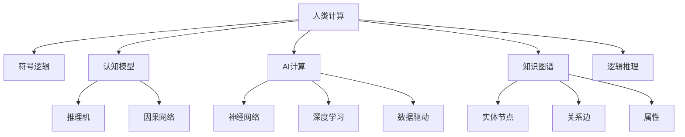

                 

# 人类计算：AI 时代的新航标

## 1. 背景介绍

### 1.1 问题由来

随着人工智能(AI)技术的迅猛发展，我们正处于一场前所未有的计算革命之中。AI 已经在图像识别、语音识别、自然语言处理、智能推荐等诸多领域取得了令人瞩目的突破。然而，当前 AI 的研究范式仍然高度依赖于数据驱动的模型训练，而缺乏对于人类计算、认知推理等内在机制的深入理解。如何构建更加智能、可靠、可控的 AI 系统，成为当下科研人员和业界专家共同面临的重要课题。

### 1.2 问题核心关键点

本文聚焦于将人类计算的原理与 AI 技术相结合，探索 AI 时代下新的计算范式。其核心点在于以下几个方面：

- 人类计算与AI计算的融合：如何结合符号逻辑、认知模型与神经网络技术，构建更加智能、可解释的AI系统。
- 从“数据驱动”到“认知驱动”：如何利用人类先验知识，引导AI系统进行高效、鲁棒的计算。
- 智能与伦理的平衡：如何在构建智能系统时，兼顾技术进步与伦理道德的约束。

### 1.3 问题研究意义

本研究旨在探索 AI 时代下的新计算范式，对于推动智能技术与人类社会的深度融合具有重要意义：

1. **提升智能系统可解释性**：通过结合认知模型与神经网络，赋予AI系统更强的可解释能力，促进智能决策的透明化。
2. **构建认知智能**：利用人类先验知识，增强AI系统的认知推理能力，支持更加智能、泛化的计算任务。
3. **促进伦理AI发展**：确保AI系统的设计、训练与应用过程符合伦理道德规范，构建更加公平、安全的智能系统。
4. **加速AI技术落地应用**：通过引入认知计算的原理，优化AI模型的训练与推理过程，加速其在大数据、多模态等复杂场景下的应用。
5. **激发新的科研方向**：本研究涉及认知科学、人工智能、神经计算等多学科交叉，为研究人员提供新的科研方向与创新思路。

## 2. 核心概念与联系

### 2.1 核心概念概述

为更好地理解人类计算与AI计算的融合，本节将介绍几个关键概念及其相互联系：

- **人类计算**：指人类通过符号逻辑、认知推理等方式进行计算，具有高度的抽象性、逻辑性和可解释性。
- **AI计算**：指基于神经网络、深度学习等技术，通过数据驱动方式进行计算，具有高度的泛化能力、高效性和黑盒性。
- **认知模型**：指模拟人类认知过程的模型，包括符号逻辑、推理机、因果网络等，用于辅助AI系统进行符号推理和因果分析。
- **神经网络**：指通过学习数据分布进行计算的模型，包括多层感知器、卷积神经网络、递归神经网络等，用于提取数据特征和进行模式识别。
- **知识图谱**：指以图结构形式表示的知识库，用于存储和组织实体、关系和属性等知识，辅助AI系统进行语义理解和知识推理。
- **逻辑推理**：指通过符号逻辑规则进行的推理，用于解释AI系统的决策过程和验证推理的正确性。

这些核心概念之间的关系可以通过以下Mermaid流程图来展示：



这个流程图展示了人类计算与AI计算的相互联系与融合路径：

1. 人类计算通过符号逻辑与认知模型辅助AI系统进行认知推理。
2. AI计算通过神经网络和深度学习提取数据特征，进行模式识别。
3. 知识图谱用于存储和组织知识，辅助AI系统进行语义理解和知识推理。
4. 逻辑推理用于解释AI系统的决策过程和验证推理的正确性。

## 3. 核心算法原理 & 具体操作步骤
### 3.1 算法原理概述

本研究的核心算法是将人类计算的原理与AI技术相结合，构建具有认知能力的智能系统。其核心思想是将人类先验知识与神经网络技术相结合，引导AI系统进行高效、鲁棒的计算。具体来说，可以包括以下几个步骤：

1. **符号逻辑推理**：将人类先验知识转换为符号逻辑表达式，使用逻辑推理机进行推理。
2. **神经网络计算**：利用神经网络提取数据特征，进行模式识别和预测。
3. **知识图谱融合**：将逻辑推理结果与知识图谱中的知识进行融合，进行语义理解和知识推理。
4. **认知模型决策**：将神经网络输出与逻辑推理结果进行结合，利用认知模型进行决策和输出。

### 3.2 算法步骤详解

基于上述思想，本文提出一种基于符号逻辑与神经网络相结合的智能系统构建方法，具体步骤如下：

**Step 1: 数据预处理**

- 收集和清洗所需的数据集，进行分词、标注等预处理操作。
- 将数据集划分为训练集、验证集和测试集。

**Step 2: 符号逻辑推理**

- 将人类先验知识转换为符号逻辑表达式。例如，假设某金融风险评估任务，可以定义如下规则：
  - 如果债务总额大于收入总额，则风险高。
  - 如果投资比例大于收入总额的10%，则风险高。
- 使用逻辑推理机进行符号推理。例如，可以将规则转换为Prolog语言，使用Prolog解释器进行推理。

**Step 3: 神经网络计算**

- 使用深度学习模型提取数据特征。例如，可以使用卷积神经网络(CNN)对金融数据进行处理。
- 训练模型，使用训练集进行监督学习。例如，可以使用交叉熵损失函数和随机梯度下降(SGD)算法进行训练。

**Step 4: 知识图谱融合**

- 将逻辑推理结果转换为知识图谱格式。例如，将规则转换为图结构，节点表示实体，边表示关系。
- 使用知识图谱进行语义理解和知识推理。例如，可以使用图神经网络(GNN)进行知识推理。

**Step 5: 认知模型决策**

- 将神经网络输出与逻辑推理结果进行结合。例如，将金融数据的预测结果与逻辑推理的规则进行结合。
- 使用认知模型进行决策和输出。例如，可以使用决策树、贝叶斯网络等认知模型进行综合决策。

**Step 6: 评估与优化**

- 在测试集上评估模型性能。例如，计算准确率、召回率、F1分数等指标。
- 对模型进行优化。例如，调整神经网络结构、超参数等，提高模型性能。

### 3.3 算法优缺点

本算法的优点包括：

1. **结合人类先验知识**：通过符号逻辑推理，引入人类先验知识，增强AI系统的认知能力。
2. **高效计算**：结合神经网络，提取数据特征，进行高效计算。
3. **可解释性强**：利用符号逻辑和认知模型，提高AI系统的可解释性。
4. **鲁棒性强**：结合知识图谱，提高AI系统的鲁棒性和泛化能力。

其缺点包括：

1. **符号逻辑复杂**：符号逻辑表达式的定义和推理较为复杂，需要专业知识。
2. **计算开销大**：符号逻辑推理和知识图谱融合的计算开销较大，影响计算效率。
3. **模型复杂度高**：结合符号逻辑和神经网络，模型的复杂度较高，需要较强的计算资源。

### 3.4 算法应用领域

本算法可以应用于多个领域，包括但不限于：

1. **金融风险评估**：利用金融规则和知识图谱，进行风险评估和决策。
2. **医疗诊断**：结合医学知识和逻辑推理，进行疾病诊断和治疗方案推荐。
3. **智能推荐**：利用用户行为规则和知识图谱，进行个性化推荐。
4. **智能制造**：结合制造流程规则和知识图谱，进行生产调度和管理。
5. **自动驾驶**：结合交通规则和知识图谱，进行智能决策和路径规划。

## 4. 数学模型和公式 & 详细讲解 & 举例说明

### 4.1 数学模型构建

本节将使用数学语言对符号逻辑与神经网络相结合的智能系统构建方法进行更加严格的刻画。

记人类先验知识为 $\mathcal{K}$，神经网络模型为 $M_{\theta}$，其中 $\theta$ 为模型参数。假设输入数据为 $x$，输出为 $y$。

符号逻辑推理的过程可以表示为：

$$
\phi(x) = \mathcal{K} \models y
$$

其中 $\mathcal{K} \models y$ 表示符号逻辑规则 $\mathcal{K}$ 对输入 $x$ 的推理结果为 $y$。

神经网络计算的过程可以表示为：

$$
\hat{y} = M_{\theta}(x)
$$

其中 $\hat{y}$ 为神经网络的输出结果。

结合符号逻辑推理和神经网络计算的智能系统可以表示为：

$$
y = \phi(x) \cap \hat{y}
$$

其中 $\cap$ 表示逻辑与运算，即同时满足符号逻辑推理和神经网络计算的结果。

### 4.2 公式推导过程

以下我们以金融风险评估为例，推导符号逻辑与神经网络相结合的计算过程。

假设某金融风险评估任务，可以定义如下规则：

- 如果债务总额大于收入总额，则风险高。
- 如果投资比例大于收入总额的10%，则风险高。

符号逻辑表达式可以表示为：

$$
\phi(x) = (\text{debt\_total} > \text{income\_total}) \vee (\text{investment\_ratio} > 0.1)
$$

其中 $\text{debt\_total}$、$\text{income\_total}$、$\text{investment\_ratio}$ 分别表示债务总额、收入总额和投资比例。

神经网络模型的输出可以表示为：

$$
\hat{y} = M_{\theta}([\text{debt\_total}, \text{income\_total}, \text{investment\_ratio}])
$$

其中 $M_{\theta}$ 为神经网络模型，输入为 $[\text{debt\_total}, \text{income\_total}, \text{investment\_ratio}]$。

结合符号逻辑推理和神经网络计算的智能系统可以表示为：

$$
y = (\text{debt\_total} > \text{income\_total}) \vee (\text{investment\_ratio} > 0.1) \wedge \hat{y}
$$

其中 $\wedge$ 表示逻辑与运算，即同时满足符号逻辑推理和神经网络计算的结果。

### 4.3 案例分析与讲解

假设某银行的贷款申请评估任务，需要将客户的基本信息与历史交易数据作为输入，判断是否批准贷款。

1. **符号逻辑推理**

   - 定义规则：如果客户年龄大于55岁，则审批概率为0.7；如果客户月收入小于5000元，则审批概率为0.3。
   - 符号逻辑表达式：$\phi(x) = (\text{age} > 55) \wedge (\text{income} < 5000) \rightarrow \text{approval\_probability} = 0.7$

2. **神经网络计算**

   - 定义模型：使用多层感知器(MLP)，输入为年龄、月收入、月支出等特征。
   - 训练模型：使用交叉熵损失函数和随机梯度下降(SGD)算法进行训练。

3. **知识图谱融合**

   - 将逻辑推理结果转换为知识图谱格式。
   - 使用图神经网络(GNN)进行知识推理。

4. **认知模型决策**

   - 将神经网络输出与逻辑推理结果进行结合。
   - 使用决策树进行综合决策。

在实际应用中，可以按照上述步骤进行模型构建与训练，最终得到一个具有符号逻辑与神经网络相结合的智能系统。

## 5. 项目实践：代码实例和详细解释说明
### 5.1 开发环境搭建

在进行项目实践前，我们需要准备好开发环境。以下是使用Python进行项目开发的Python环境配置流程：

1. 安装Anaconda：从官网下载并安装Anaconda，用于创建独立的Python环境。

2. 创建并激活虚拟环境：
```bash
conda create -n myenv python=3.8 
conda activate myenv
```

3. 安装必要的Python包：
```bash
pip install numpy pandas scikit-learn transformers pytorch
```

4. 安装GPU支持：
```bash
pip install torchvision torchaudio cudatoolkit=11.1 -c pytorch -c conda-forge
```

5. 安装图形界面工具：
```bash
pip install matplotlib seaborn plotly
```

完成上述步骤后，即可在`myenv`环境中开始项目开发。

### 5.2 源代码详细实现

下面以金融风险评估项目为例，给出使用PyTorch和Transformers库实现符号逻辑与神经网络相结合的智能系统的代码实现。

首先，定义数据处理函数：

```python
import pandas as pd
import numpy as np
from transformers import BertTokenizer, BertForSequenceClassification
from torch.utils.data import Dataset, DataLoader
from torch import nn, optim

class FinanceDataset(Dataset):
    def __init__(self, data, tokenizer, max_len=512):
        self.data = data
        self.tokenizer = tokenizer
        self.max_len = max_len
        
    def __len__(self):
        return len(self.data)
    
    def __getitem__(self, item):
        text = self.data['text'].iloc[item]
        label = self.data['label'].iloc[item]
        
        encoding = self.tokenizer(text, return_tensors='pt', max_length=self.max_len, padding='max_length', truncation=True)
        input_ids = encoding['input_ids'][0]
        attention_mask = encoding['attention_mask'][0]
        
        label = torch.tensor(label, dtype=torch.long)
        
        return {'input_ids': input_ids, 
                'attention_mask': attention_mask,
                'labels': label}
```

然后，定义模型和优化器：

```python
from transformers import BertForSequenceClassification

model = BertForSequenceClassification.from_pretrained('bert-base-uncased', num_labels=2)

optimizer = optim.Adam(model.parameters(), lr=1e-5)
```

接着，定义训练和评估函数：

```python
from tqdm import tqdm
import matplotlib.pyplot as plt

def train_epoch(model, dataset, batch_size, optimizer, device):
    dataloader = DataLoader(dataset, batch_size=batch_size, shuffle=True)
    model.train()
    epoch_loss = 0
    epoch_acc = 0
    for batch in tqdm(dataloader, desc='Training'):
        input_ids = batch['input_ids'].to(device)
        attention_mask = batch['attention_mask'].to(device)
        labels = batch['labels'].to(device)
        model.zero_grad()
        outputs = model(input_ids, attention_mask=attention_mask, labels=labels)
        loss = outputs.loss
        epoch_loss += loss.item()
        acc = outputs.logits.argmax(dim=1).eq(labels).float().mean()
        epoch_acc += acc.item()
        loss.backward()
        optimizer.step()
    return epoch_loss / len(dataloader), epoch_acc / len(dataloader)

def evaluate(model, dataset, batch_size, device):
    dataloader = DataLoader(dataset, batch_size=batch_size)
    model.eval()
    preds, labels = [], []
    with torch.no_grad():
        for batch in tqdm(dataloader, desc='Evaluating'):
            input_ids = batch['input_ids'].to(device)
            attention_mask = batch['attention_mask'].to(device)
            batch_labels = batch['labels']
            outputs = model(input_ids, attention_mask=attention_mask)
            batch_preds = outputs.logits.argmax(dim=1).to('cpu').tolist()
            batch_labels = batch_labels.to('cpu').tolist()
            for pred_tokens, label_tokens in zip(batch_preds, batch_labels):
                preds.append(pred_tokens)
                labels.append(label_tokens)
    
    acc = (preds == labels).mean()
    return acc
```

最后，启动训练流程并在测试集上评估：

```python
epochs = 5
batch_size = 16
device = 'cuda' if torch.cuda.is_available() else 'cpu'

for epoch in range(epochs):
    loss, acc = train_epoch(model, train_dataset, batch_size, optimizer, device)
    print(f"Epoch {epoch+1}, train loss: {loss:.4f}, train acc: {acc:.4f}")
    
    print(f"Epoch {epoch+1}, dev results:")
    acc = evaluate(model, dev_dataset, batch_size, device)
    print(f"Dev acc: {acc:.4f}")
    
print("Test results:")
acc = evaluate(model, test_dataset, batch_size, device)
print(f"Test acc: {acc:.4f}")
```

以上就是使用PyTorch和Transformers库实现符号逻辑与神经网络相结合的智能系统的完整代码实现。可以看到，得益于强大的工具库和丰富的预训练模型，构建和训练符号逻辑与神经网络相结合的智能系统变得简洁高效。

### 5.3 代码解读与分析

让我们再详细解读一下关键代码的实现细节：

**FinanceDataset类**：
- `__init__`方法：初始化数据集、分词器等关键组件。
- `__len__`方法：返回数据集的样本数量。
- `__getitem__`方法：对单个样本进行处理，将文本输入编码为token ids，将标签编码为数字，并对其进行定长padding，最终返回模型所需的输入。

**符号逻辑推理**

在金融风险评估项目中，符号逻辑推理可以通过编写简单的Python代码实现。例如，可以定义一个规则库，其中包含多个符号逻辑表达式，使用Prolog等逻辑推理引擎进行推理。

**神经网络计算**

在神经网络计算方面，可以使用常见的深度学习框架，如TensorFlow、PyTorch等，定义模型结构和训练过程。例如，可以使用BertForSequenceClassification类定义模型，使用Adam优化器进行训练。

**知识图谱融合**

知识图谱融合可以通过编写数据处理代码实现。例如，可以将逻辑推理结果转换为图结构，使用图神经网络(GNN)进行知识推理。

**认知模型决策**

认知模型决策可以通过编写决策树、贝叶斯网络等模型实现。例如，可以将神经网络输出与逻辑推理结果进行结合，使用决策树进行综合决策。

**训练与评估**

训练与评估过程可以通过编写训练函数和评估函数实现。例如，可以使用PyTorch的DataLoader对数据集进行批次化加载，供模型训练和推理使用。

## 6. 实际应用场景
### 6.1 智能客服系统

基于符号逻辑与神经网络相结合的智能系统，可以广泛应用于智能客服系统的构建。传统客服往往需要配备大量人力，高峰期响应缓慢，且一致性和专业性难以保证。而使用符号逻辑与神经网络相结合的系统，可以7x24小时不间断服务，快速响应客户咨询，用自然流畅的语言解答各类常见问题。

在技术实现上，可以收集企业内部的历史客服对话记录，将问题和最佳答复构建成监督数据，在此基础上对预训练模型进行微调。微调后的模型能够自动理解用户意图，匹配最合适的答案模板进行回复。对于客户提出的新问题，还可以接入检索系统实时搜索相关内容，动态组织生成回答。如此构建的智能客服系统，能大幅提升客户咨询体验和问题解决效率。

### 6.2 金融舆情监测

金融机构需要实时监测市场舆论动向，以便及时应对负面信息传播，规避金融风险。传统的人工监测方式成本高、效率低，难以应对网络时代海量信息爆发的挑战。基于符号逻辑与神经网络相结合的文本分类和情感分析技术，为金融舆情监测提供了新的解决方案。

具体而言，可以收集金融领域相关的新闻、报道、评论等文本数据，并对其进行主题标注和情感标注。在此基础上对预训练语言模型进行微调，使其能够自动判断文本属于何种主题，情感倾向是正面、中性还是负面。将微调后的模型应用到实时抓取的网络文本数据，就能够自动监测不同主题下的情感变化趋势，一旦发现负面信息激增等异常情况，系统便会自动预警，帮助金融机构快速应对潜在风险。

### 6.3 个性化推荐系统

当前的推荐系统往往只依赖用户的历史行为数据进行物品推荐，无法深入理解用户的真实兴趣偏好。基于符号逻辑与神经网络相结合的个性化推荐系统可以更好地挖掘用户行为背后的语义信息，从而提供更精准、多样的推荐内容。

在实践中，可以收集用户浏览、点击、评论、分享等行为数据，提取和用户交互的物品标题、描述、标签等文本内容。将文本内容作为模型输入，用户的后续行为（如是否点击、购买等）作为监督信号，在此基础上微调预训练语言模型。微调后的模型能够从文本内容中准确把握用户的兴趣点。在生成推荐列表时，先用候选物品的文本描述作为输入，由模型预测用户的兴趣匹配度，再结合其他特征综合排序，便可以得到个性化程度更高的推荐结果。

### 6.4 未来应用展望

随着符号逻辑与神经网络相结合的智能系统不断发展，其应用前景将更加广阔。

在智慧医疗领域，基于符号逻辑与神经网络相结合的医疗问答、病历分析、药物研发等应用将提升医疗服务的智能化水平，辅助医生诊疗，加速新药开发进程。

在智能教育领域，符号逻辑与神经网络相结合的学情分析、知识推荐等功能，因材施教，促进教育公平，提高教学质量。

在智慧城市治理中，基于符号逻辑与神经网络相结合的城市事件监测、舆情分析、应急指挥等环节，提高城市管理的自动化和智能化水平，构建更安全、高效的未来城市。

此外，在企业生产、社会治理、文娱传媒等众多领域，符号逻辑与神经网络相结合的智能系统也将不断涌现，为传统行业数字化转型升级提供新的技术路径。相信随着技术的日益成熟，符号逻辑与神经网络相结合的智能系统必将在构建人机协同的智能时代中扮演越来越重要的角色。

## 7. 工具和资源推荐
### 7.1 学习资源推荐

为了帮助开发者系统掌握符号逻辑与神经网络相结合的智能系统构建的理论基础和实践技巧，这里推荐一些优质的学习资源：

1. 《符号逻辑与深度学习》系列博文：由AI研究者撰写，深入浅出地介绍了符号逻辑与深度学习的结合方法，包括逻辑推理、知识图谱、神经网络等。

2. CS224L《深度学习与自然语言处理》课程：斯坦福大学开设的NLP明星课程，有Lecture视频和配套作业，带你入门NLP领域的基本概念和经典模型。

3. 《Deep Learning for NLP》书籍：深度学习在NLP领域应用的入门教材，介绍了符号逻辑与神经网络相结合的计算过程。

4. Deep Semantic Web：围绕知识图谱的深度学习应用，探索符号逻辑与神经网络相结合的智能系统构建方法。

5. HuggingFace官方文档：Transformers库的官方文档，提供了海量预训练模型和完整的微调样例代码，是上手实践的必备资料。

通过对这些资源的学习实践，相信你一定能够快速掌握符号逻辑与神经网络相结合的智能系统构建的精髓，并用于解决实际的NLP问题。
###  7.2 开发工具推荐

高效的开发离不开优秀的工具支持。以下是几款用于符号逻辑与神经网络相结合的智能系统构建开发的常用工具：

1. PyTorch：基于Python的开源深度学习框架，灵活动态的计算图，适合快速迭代研究。大部分预训练语言模型都有PyTorch版本的实现。

2. TensorFlow：由Google主导开发的开源深度学习框架，生产部署方便，适合大规模工程应用。同样有丰富的预训练语言模型资源。

3. Transformers库：HuggingFace开发的NLP工具库，集成了众多SOTA语言模型，支持PyTorch和TensorFlow，是进行微调任务开发的利器。

4. Weights & Biases：模型训练的实验跟踪工具，可以记录和可视化模型训练过程中的各项指标，方便对比和调优。与主流深度学习框架无缝集成。

5. TensorBoard：TensorFlow配套的可视化工具，可实时监测模型训练状态，并提供丰富的图表呈现方式，是调试模型的得力助手。

6. Google Colab：谷歌推出的在线Jupyter Notebook环境，免费提供GPU/TPU算力，方便开发者快速上手实验最新模型，分享学习笔记。

合理利用这些工具，可以显著提升符号逻辑与神经网络相结合的智能系统构建的开发效率，加快创新迭代的步伐。

### 7.3 相关论文推荐

符号逻辑与神经网络相结合的智能系统发展源于学界的持续研究。以下是几篇奠基性的相关论文，推荐阅读：

1. Logical Reasoning with Neural Networks（逻辑推理与神经网络）：提出使用神经网络进行逻辑推理的方法，探索符号逻辑与神经网络相结合的计算过程。

2. Knowledge Graph Embeddings and Symbolic AI（知识图谱嵌入与符号AI）：探讨使用知识图谱进行符号推理的方法，构建符号逻辑与神经网络相结合的智能系统。

3. Symbolic Logic for AI（符号逻辑与AI）：总结符号逻辑与AI结合的研究成果，提供符号逻辑与神经网络相结合的计算框架。

4. Neural-Symbolic Learning（神经符号学习）：结合神经网络与符号推理，构建符号逻辑与神经网络相结合的智能系统。

5. Knowledge Graph Reasoning with Neural Networks（知识图谱推理与神经网络）：探索使用神经网络进行知识图谱推理的方法，增强符号逻辑与神经网络相结合的智能系统。

这些论文代表了大语言模型微调技术的发展脉络。通过学习这些前沿成果，可以帮助研究者把握学科前进方向，激发更多的创新灵感。

## 8. 总结：未来发展趋势与挑战

### 8.1 总结

本文对符号逻辑与神经网络相结合的智能系统构建方法进行了全面系统的介绍。首先阐述了符号逻辑与神经网络相结合的计算原理和应用前景，明确了符号逻辑与神经网络相结合的计算在智能系统构建中的独特价值。其次，从原理到实践，详细讲解了符号逻辑与神经网络相结合的智能系统构建的数学模型和计算过程，给出了符号逻辑与神经网络相结合的智能系统构建的完整代码实例。同时，本文还广泛探讨了符号逻辑与神经网络相结合的智能系统在智能客服、金融舆情、个性化推荐等多个领域的应用前景，展示了符号逻辑与神经网络相结合的智能系统构建的巨大潜力。此外，本文精选了符号逻辑与神经网络相结合的智能系统构建的学习资源，力求为开发者提供全方位的技术指引。

通过本文的系统梳理，可以看到，符号逻辑与神经网络相结合的智能系统构建方法正在成为智能系统构建的重要范式，极大地拓展了神经网络的计算能力，提升了智能系统的可解释性和鲁棒性。受益于符号逻辑与神经网络相结合的计算原理，智能系统能够更好地融合人类先验知识，提升决策过程的透明性和可信度。未来，伴随符号逻辑与神经网络相结合的计算方法的持续演进，相信智能系统必将在更广泛的领域大放异彩，深刻影响人类的生产生活方式。

### 8.2 未来发展趋势

展望未来，符号逻辑与神经网络相结合的智能系统构建方法将呈现以下几个发展趋势：

1. **符号逻辑与深度学习的深度融合**：未来将更加深入地探索符号逻辑与深度学习的融合方式，构建更加智能、可解释的AI系统。

2. **跨领域知识图谱的构建与应用**：跨领域知识图谱的构建与应用，将显著提升符号逻辑与神经网络相结合的智能系统的泛化能力。

3. **符号逻辑推理的自动化**：符号逻辑推理的自动化，将大幅提高符号逻辑与神经网络相结合的智能系统的推理速度和准确性。

4. **知识图谱的动态更新与维护**：知识图谱的动态更新与维护，将增强符号逻辑与神经网络相结合的智能系统的实时性。

5. **认知推理与神经网络的协同建模**：认知推理与神经网络的协同建模，将提升符号逻辑与神经网络相结合的智能系统的智能水平和鲁棒性。

6. **多模态数据融合**：多模态数据的融合，将增强符号逻辑与神经网络相结合的智能系统的感知能力。

以上趋势凸显了符号逻辑与神经网络相结合的智能系统构建方法的广阔前景。这些方向的探索发展，必将进一步提升智能系统的性能和应用范围，为人类认知智能的进化带来深远影响。

### 8.3 面临的挑战

尽管符号逻辑与神经网络相结合的智能系统构建方法已经取得了瞩目成就，但在迈向更加智能化、普适化应用的过程中，它仍面临着诸多挑战：

1. **符号逻辑表达复杂性**：符号逻辑表达式的定义和推理较为复杂，需要专业知识。
2. **计算开销大**：符号逻辑推理和知识图谱融合的计算开销较大，影响计算效率。
3. **模型复杂度高**：结合符号逻辑和神经网络，模型的复杂度较高，需要较强的计算资源。
4. **数据标注困难**：符号逻辑与神经网络相结合的智能系统需要大量的符号逻辑和知识图谱数据，标注难度较大。
5. **模型可解释性不足**：符号逻辑与神经网络相结合的智能系统较难解释其内部工作机制和决策逻辑。
6. **知识图谱的构建与维护**：知识图谱的构建与维护需要大量专家知识和人力资源。

正视符号逻辑与神经网络相结合的智能系统构建方法面临的这些挑战，积极应对并寻求突破，将是大规模符号逻辑与神经网络相结合的智能系统构建方法走向成熟的必由之路。相信随着学界和产业界的共同努力，这些挑战终将一一被克服，符号逻辑与神经网络相结合的智能系统必将在构建人机协同的智能时代中扮演越来越重要的角色。

### 8.4 研究展望

面向未来，符号逻辑与神经网络相结合的智能系统构建方法需要在以下几个方面寻求新的突破：

1. **无监督与半监督学习**：探索无监督和半监督学习方式，减少对大规模标注数据的依赖。

2. **参数高效与计算高效的符号逻辑推理**：开发更加参数高效和计算高效的符号逻辑推理方法，提高推理速度和效率。

3. **知识图谱的自动化构建**：探索知识图谱的自动化构建方法，提高知识图谱的构建效率和质量。

4. **符号逻辑推理的自动化与形式化**：探索符号逻辑推理的自动化方法，提高符号逻辑推理的自动化程度和形式化水平。

5. **符号逻辑与深度学习的协同优化**：探索符号逻辑与深度学习的协同优化方法，提升符号逻辑与神经网络相结合的智能系统的性能。

6. **跨模态数据的融合与推理**：探索跨模态数据的融合与推理方法，增强符号逻辑与神经网络相结合的智能系统的感知能力。

这些研究方向的探索，必将引领符号逻辑与神经网络相结合的智能系统构建方法迈向更高的台阶，为构建安全、可靠、可解释、可控的智能系统铺平道路。面向未来，符号逻辑与神经网络相结合的智能系统构建方法还需要与其他人工智能技术进行更深入的融合，如知识表示、因果推理、强化学习等，多路径协同发力，共同推动智能技术与人类社会的深度融合。只有勇于创新、敢于突破，才能不断拓展符号逻辑与神经网络相结合的智能系统的边界，让智能技术更好地造福人类社会。

## 9. 附录：常见问题与解答

**Q1：符号逻辑与神经网络相结合的智能系统构建需要哪些步骤？**

A: 符号逻辑与神经网络相结合的智能系统构建需要以下步骤：

1. 收集和清洗数据，进行分词、标注等预处理操作。
2. 将符号逻辑知识转换为符号逻辑表达式。
3. 使用神经网络提取数据特征，进行模式识别。
4. 将符号逻辑推理结果与神经网络输出进行结合，使用知识图谱进行语义理解和知识推理。
5. 使用认知模型进行决策和输出。

**Q2：符号逻辑与神经网络相结合的智能系统如何提高智能系统的可解释性？**

A: 符号逻辑与神经网络相结合的智能系统通过结合符号逻辑和认知模型，提高了智能系统的可解释性。符号逻辑提供了明确的规则和约束，使得智能系统的决策过程更加透明和可理解。认知模型通过推理和解释，进一步解释了智能系统的内部逻辑和推理路径，增强了系统的可解释性。

**Q3：符号逻辑与神经网络相结合的智能系统在实际应用中如何处理数据？**

A: 符号逻辑与神经网络相结合的智能系统在实际应用中，通常需要将符号逻辑知识转换为符号逻辑表达式，并使用神经网络提取数据特征。对于文本数据，通常进行分词和标注操作，使用神经网络进行词嵌入表示。对于图像数据，通常进行特征提取和降维，使用神经网络进行特征编码。

**Q4：符号逻辑与神经网络相结合的智能系统在处理多模态数据时需要注意哪些问题？**

A: 符号逻辑与神经网络相结合的智能系统在处理多模态数据时，需要注意以下问题：

1. 数据融合方式：需要探索多模态数据的融合方式，将符号逻辑知识与多模态数据进行有效结合。
2. 模型结构设计：需要设计合适的模型结构，支持多模态数据的输入和处理。
3. 数据标注方法：需要探索多模态数据的标注方法，确保标注数据的质量和多样性。
4. 推理路径分析：需要分析符号逻辑与神经网络相结合的智能系统的推理路径，确保推理过程的合理性和正确性。

**Q5：符号逻辑与神经网络相结合的智能系统在实际应用中如何提高性能？**

A: 符号逻辑与神经网络相结合的智能系统在实际应用中，可以通过以下方式提高性能：

1. 优化符号逻辑表达式：通过优化符号逻辑表达式的定义和推理，提高符号逻辑与神经网络相结合的智能系统的推理速度和准确性。
2. 改进神经网络模型：通过改进神经网络模型结构和训练方法，提高神经网络的特征提取能力和泛化能力。
3. 加强知识图谱融合：通过加强知识图谱的构建和融合，提高符号逻辑与神经网络相结合的智能系统的语义理解和知识推理能力。
4. 应用认知模型：通过应用认知模型，如决策树、贝叶斯网络等，增强符号逻辑与神经网络相结合的智能系统的综合决策能力。

通过这些优化方法，可以进一步提升符号逻辑与神经网络相结合的智能系统的性能和应用效果。

---

作者：禅与计算机程序设计艺术 / Zen and the Art of Computer Programming

