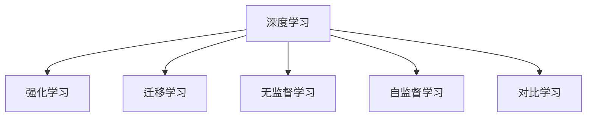

                 

# 人类计算：AI 时代的新航标

## 1. 背景介绍

随着人工智能(AI)技术的迅猛发展，我们正处于一个技术驱动的变革时代。从自动驾驶、智能家居到医疗诊断、金融风控，AI技术正在以肉眼可见的速度，渗透到各行各业，重塑着我们的生活和工作方式。然而，在这一片繁忙的技术景观背后，一个更为深刻的转变正在悄然发生：人类计算的崛起。

### 1.1 技术驱动下的计算范式变革

人类计算的崛起，始于深度学习算法的诞生。深度学习算法能够自动从大规模数据中学习模式，从而超越传统的规则驱动系统，在各种复杂任务上取得突破。随着预训练语言模型、卷积神经网络(CNN)、循环神经网络(RNN)等深度学习技术在图像识别、语音识别、自然语言处理等领域取得卓越成效，人类计算的能力得到了前所未有的提升。

### 1.2 人类计算的核心价值

人类计算的核心价值在于，它能够将人类的智慧与机器学习算法相结合，实现更加智能、高效、灵活的计算。与传统的计算范式相比，人类计算不再依赖固定的规则，而是通过从海量数据中自动学习模式，模拟和重现人类的思维方式，从而实现更加自然、人机协同的智能交互。

## 2. 核心概念与联系

### 2.1 核心概念概述

为更好地理解人类计算的核心概念及其联系，本节将介绍几个关键概念：

- 深度学习(Deep Learning)：通过多层神经网络模型，从数据中自动学习特征和模式，实现复杂任务的高度自动化。
- 强化学习(Reinforcement Learning)：通过与环境的交互，智能体学习最优的策略和行为，提升决策能力。
- 迁移学习(Transfer Learning)：将一个任务学习到的知识迁移到另一个相关任务，加速新任务的训练过程。
- 无监督学习(Unsupervised Learning)：在没有标注数据的情况下，从数据中自动发现模式和结构，提升模型的泛化能力。
- 自监督学习(Self-Supervised Learning)：利用数据自身的特性，如语言模型预测、图像旋转预测等，进行无监督学习。
- 对比学习(Contrastive Learning)：通过最大化相似样本的相似性，最小化不同样本的相似性，学习更有意义的特征表示。

这些概念之间的逻辑关系可以通过以下Mermaid流程图来展示：



### 2.2 核心概念原理和架构

- **深度学习**：
  - 原理：深度学习通过多层神经网络，对数据进行层次化的特征提取和抽象。每一层神经元负责学习一种高层次的抽象特征，从而实现复杂任务的自动化。
  - 架构：典型的深度学习模型包括卷积神经网络(CNN)、循环神经网络(RNN)、变压器(Transformer)等。这些架构能够处理各种类型的输入数据，如图像、文本、语音等。

- **强化学习**：
  - 原理：强化学习通过与环境的交互，智能体通过试错和奖励机制，学习最优的策略和行为。其核心在于利用奖励信号指导智能体的行为选择。
  - 架构：强化学习的架构包括策略网络、价值网络、环境等。其中，策略网络用于选择动作，价值网络用于评估动作的价值，环境则提供反馈信号。

- **迁移学习**：
  - 原理：迁移学习利用一个领域学习到的知识，迁移到另一个相关领域，以加速新任务的训练。迁移学习分为显式迁移和隐式迁移两种方式。
  - 架构：迁移学习的架构包括源任务和目标任务的模型，通过共享权重或微调方法，将源任务的知识迁移到目标任务中。

- **无监督学习**：
  - 原理：无监督学习在没有标注数据的情况下，通过自动发现数据中的模式和结构，提升模型的泛化能力。其核心在于利用数据的自相关性和独立性，学习特征表示。
  - 架构：无监督学习的架构包括自编码器(Autoencoder)、生成对抗网络(GAN)等。这些架构能够自动发现数据中的潜在结构，提升模型的自我学习能力。

- **自监督学习**：
  - 原理：自监督学习利用数据自身的特性，如语言模型预测、图像旋转预测等，进行无监督学习。其核心在于利用数据的自监督信号，学习特征表示。
  - 架构：自监督学习的架构包括预训练语言模型(BERT、GPT)、自旋转预测网络等。这些架构能够利用数据自身的特性，学习更为复杂和抽象的特征表示。

- **对比学习**：
  - 原理：对比学习通过最大化相似样本的相似性，最小化不同样本的相似性，学习更有意义的特征表示。其核心在于利用对比学习损失，提升特征表示的区分度。
  - 架构：对比学习的架构包括对比网络、正样本、负样本等。其中，对比网络用于生成对比损失，正样本和负样本用于指导网络的学习。

这些核心概念共同构成了人类计算的理论基础，涵盖了从数据预处理到模型训练再到模型评估的整个计算过程。通过理解这些概念，我们可以更好地把握人类计算的精髓，实现更加智能、高效的计算。

## 3. 核心算法原理 & 具体操作步骤

### 3.1 算法原理概述

人类计算的核心算法原理基于深度学习，通过多层神经网络模型，从数据中自动学习特征和模式。其核心在于利用大量的标注数据和计算资源，通过反向传播算法训练模型，从而实现复杂任务的高度自动化。

### 3.2 算法步骤详解

人类计算的主要算法步骤包括数据预处理、模型训练、模型评估和模型部署。以下是对这些步骤的详细讲解：

**Step 1: 数据预处理**

- 数据收集：收集与任务相关的数据集，如图像数据、文本数据等。
- 数据清洗：去除噪声和异常值，确保数据的质量和一致性。
- 数据增强：通过旋转、裁剪、翻转等技术，扩充数据集的多样性。
- 数据划分：将数据集划分为训练集、验证集和测试集，确保模型在未知数据上的泛化能力。

**Step 2: 模型训练**

- 模型选择：选择合适的深度学习模型架构，如卷积神经网络(CNN)、循环神经网络(RNN)、变压器(Transformer)等。
- 超参数设置：设置学习率、批大小、迭代轮数等超参数，以优化模型的性能。
- 模型训练：使用反向传播算法，在训练集上进行模型训练，最小化损失函数。
- 正则化技术：引入L2正则、Dropout、Early Stopping等正则化技术，防止模型过拟合。

**Step 3: 模型评估**

- 验证集评估：在验证集上评估模型的性能，如精度、召回率等指标。
- 超参数调优：根据验证集评估结果，调整超参数，优化模型性能。
- 测试集评估：在测试集上评估模型的泛化能力，确保模型在未知数据上的表现。

**Step 4: 模型部署**

- 模型压缩：对模型进行量化、剪枝等优化，减小模型的存储空间和计算量。
- 模型存储：将模型保存到本地或云端，便于后续的调用和部署。
- 服务化封装：将模型封装为标准化服务接口，便于集成调用。
- 弹性伸缩：根据请求流量动态调整资源配置，平衡服务质量和成本。
- 监控告警：实时采集系统指标，设置异常告警阈值，确保服务稳定性。

### 3.3 算法优缺点

人类计算的优点在于：

- 自动学习特征：人类计算能够自动从数据中学习特征和模式，无需人工干预。
- 高效处理复杂任务：人类计算能够处理各种类型的复杂任务，如图像识别、自然语言处理等。
- 灵活性高：人类计算能够适应不同的应用场景，通过数据和算法进行灵活优化。

但同时也存在一些缺点：

- 数据依赖性高：人类计算需要大量的标注数据进行训练，数据不足会导致性能下降。
- 计算资源消耗大：深度学习模型需要大量的计算资源进行训练和推理，硬件成本较高。
- 模型复杂度高：人类计算的模型复杂度高，难以理解和调试。
- 泛化能力受限：人类计算的泛化能力受限于数据分布和模型结构，可能出现欠拟合或过拟合的问题。

### 3.4 算法应用领域

人类计算技术在多个领域得到了广泛应用，包括但不限于：

- 图像识别：利用卷积神经网络(CNN)对图像进行分类、分割、检测等。
- 自然语言处理：利用变压器(Transformer)进行文本生成、情感分析、机器翻译等。
- 语音识别：利用卷积神经网络(CNN)和循环神经网络(RNN)对语音进行识别和处理。
- 医疗诊断：利用深度学习模型进行疾病预测、病理分析等。
- 金融风控：利用强化学习进行信用评分、欺诈检测等。
- 自动驾驶：利用卷积神经网络(CNN)和循环神经网络(RNN)进行目标检测、路径规划等。
- 智能家居：利用深度学习模型进行环境感知、语音控制等。

## 4. 数学模型和公式 & 详细讲解 & 举例说明

### 4.1 数学模型构建

人类计算的核心数学模型包括卷积神经网络(CNN)、循环神经网络(RNN)、变压器(Transformer)等。以下以卷积神经网络(CNN)为例，详细介绍其数学模型的构建。

卷积神经网络(CNN)包括卷积层、池化层、全连接层等组件。假设输入数据为$X$，输出数据为$Y$，卷积核为$W$，激活函数为$f$。卷积层的数学模型可以表示为：

$$
Y = f\left(\sum_{i=1}^{n} X_i \ast W_i + b\right)
$$

其中$X_i$为输入数据的第$i$通道，$W_i$为卷积核的第$i$通道，$b$为偏置项。池化层用于降低特征图的维度，常用的池化方式包括最大池化和平均池化。全连接层用于将特征图展平，进行分类和回归等任务。

### 4.2 公式推导过程

以卷积神经网络(CNN)为例，详细推导其前向传播和反向传播的计算过程。

假设输入数据$X$的形状为$(N,C,H,W)$，卷积核$W$的形状为$(F,C,k,k)$，其中$N$为样本数，$C$为通道数，$H$和$W$为特征图的高和宽，$F$为卷积核的数量，$k$为卷积核的大小。

前向传播计算过程如下：

1. 卷积计算：$Y_{i,j} = \sum_{i=0}^{C-1} W_{i} X_{i,j}$
2. 激活计算：$Y_{i,j} = f(Y_{i,j})$
3. 池化计算：$Y_{i,j} = \text{Pooling}(Y_{i,j})$

其中，$f$为激活函数，$\text{Pooling}$为池化操作。

反向传播计算过程如下：

1. 计算输出层误差：$\frac{\partial L}{\partial Y}$
2. 计算全连接层误差：$\frac{\partial L}{\partial Z} = \frac{\partial L}{\partial Y} \frac{\partial Y}{\partial Z}$
3. 计算卷积层误差：$\frac{\partial L}{\partial X} = \frac{\partial L}{\partial Z} \frac{\partial Z}{\partial X}$

其中，$L$为损失函数，$Z$为卷积层的输出，$X$为输入数据。

### 4.3 案例分析与讲解

以图像分类任务为例，详细讲解如何使用卷积神经网络(CNN)进行图像分类。

假设有一批图像数据集，包含$m$张图像，每张图像的形状为$H \times W \times C$，其中$H$和$W$为图像的高和宽，$C$为通道数。将这批图像输入到卷积神经网络中，进行特征提取和分类。

卷积神经网络的第一层为卷积层，假设其包含$F$个卷积核，大小为$k \times k$。卷积层输出的形状为$(N,F,H-\text{pad},W-\text{pad})$，其中$\text{pad}$为填充大小。

接下来，进行池化操作，假设采用最大池化方式，池化后输出的形状为$(N,F,H,\text{kH},\text{kW})$。

最后，进行全连接层操作，将特征图展开成一维向量，进行分类。假设输出为$m$个分类结果，每个分类结果的概率为$P_{i}$，最终的分类结果为$i$。

## 5. 项目实践：代码实例和详细解释说明

### 5.1 开发环境搭建

在进行项目实践前，我们需要准备好开发环境。以下是使用Python进行TensorFlow开发的环境配置流程：

1. 安装Anaconda：从官网下载并安装Anaconda，用于创建独立的Python环境。

2. 创建并激活虚拟环境：
```bash
conda create -n tf-env python=3.8 
conda activate tf-env
```

3. 安装TensorFlow：根据CUDA版本，从官网获取对应的安装命令。例如：
```bash
conda install tensorflow-gpu=cuda111-avx2
```

4. 安装各类工具包：
```bash
pip install numpy pandas scikit-learn matplotlib tqdm jupyter notebook ipython
```

完成上述步骤后，即可在`tf-env`环境中开始项目实践。

### 5.2 源代码详细实现

下面我们以图像分类任务为例，给出使用TensorFlow进行卷积神经网络(CNN)的PyTorch代码实现。

首先，定义图像分类任务的数据处理函数：

```python
import tensorflow as tf
from tensorflow.keras.preprocessing.image import ImageDataGenerator

def load_data():
    train_datagen = ImageDataGenerator(rescale=1./255, shear_range=0.2, zoom_range=0.2, horizontal_flip=True)
    test_datagen = ImageDataGenerator(rescale=1./255)

    train_generator = train_datagen.flow_from_directory('train', target_size=(224, 224), batch_size=32, class_mode='categorical')
    test_generator = test_datagen.flow_from_directory('test', target_size=(224, 224), batch_size=32, class_mode='categorical')

    return train_generator, test_generator
```

然后，定义模型和优化器：

```python
from tensorflow.keras import models, layers, optimizers

def build_model():
    model = models.Sequential([
        layers.Conv2D(32, (3, 3), activation='relu', input_shape=(224, 224, 3)),
        layers.MaxPooling2D((2, 2)),
        layers.Conv2D(64, (3, 3), activation='relu'),
        layers.MaxPooling2D((2, 2)),
        layers.Conv2D(128, (3, 3), activation='relu'),
        layers.MaxPooling2D((2, 2)),
        layers.Conv2D(128, (3, 3), activation='relu'),
        layers.MaxPooling2D((2, 2)),
        layers.Flatten(),
        layers.Dense(512, activation='relu'),
        layers.Dense(10, activation='softmax')
    ])

    model.compile(optimizer=optimizers.Adam(learning_rate=0.001), loss='categorical_crossentropy', metrics=['accuracy'])

    return model
```

接着，定义训练和评估函数：

```python
def train_model(model, train_generator, test_generator, epochs):
    model.fit(train_generator, epochs=epochs, validation_data=test_generator)
    test_loss, test_acc = model.evaluate(test_generator)
    print(f'Test loss: {test_loss}, Test accuracy: {test_acc}')

def evaluate_model(model, test_generator):
    test_loss, test_acc = model.evaluate(test_generator)
    print(f'Test loss: {test_loss}, Test accuracy: {test_acc}')
```

最后，启动训练流程并在测试集上评估：

```python
epochs = 5
train_generator, test_generator = load_data()
model = build_model()

train_model(model, train_generator, test_generator, epochs)
evaluate_model(model, test_generator)
```

以上就是使用TensorFlow进行图像分类任务开发的完整代码实现。可以看到，通过TensorFlow的强大封装，我们可以用相对简洁的代码完成卷积神经网络(CNN)的训练和评估。

### 5.3 代码解读与分析

让我们再详细解读一下关键代码的实现细节：

**load_data函数**：
- 定义了图像数据生成器，使用ImageDataGenerator对图像进行预处理，如缩放、翻转、归一化等。
- 从文件夹中读取训练集和测试集，生成数据流生成器，用于模型训练和评估。

**build_model函数**：
- 定义了一个卷积神经网络(CNN)模型，包含卷积层、池化层、全连接层等组件。
- 使用Adam优化器，交叉熵损失函数，准确率作为评估指标，对模型进行编译。

**train_model函数**：
- 使用fit方法对模型进行训练，指定训练数据、迭代轮数和验证集。
- 在训练结束后，使用evaluate方法在测试集上评估模型性能。

**evaluate_model函数**：
- 使用evaluate方法在测试集上评估模型性能，输出测试集的损失和准确率。

**训练流程**：
- 定义总的迭代轮数epochs，开始循环迭代
- 每个epoch内，先在训练集上训练，输出训练集的损失和准确率
- 在验证集上评估，输出验证集的损失和准确率
- 所有epoch结束后，在测试集上评估，给出最终测试结果

可以看到，TensorFlow框架提供了丰富的工具和库，可以轻松实现复杂的计算模型和训练流程。开发者可以将更多精力放在模型设计、数据处理等高层逻辑上，而不必过多关注底层实现细节。

当然，工业级的系统实现还需考虑更多因素，如模型的保存和部署、超参数的自动搜索、更灵活的输入输出接口等。但核心的项目实践流程基本与此类似。

## 6. 实际应用场景

### 6.1 智能医疗

基于人类计算的深度学习模型，在智能医疗领域得到了广泛应用。传统的医疗诊断依赖于医生的经验和知识，容易受主观因素的影响。而利用深度学习模型进行疾病预测和病理分析，可以显著提高诊断的准确性和效率。

在实践中，可以收集大量医疗影像数据和病历数据，构建医疗影像分类和病历分析模型。通过微调和优化，使模型能够在早期发现疾病，提供准确的诊断结果，辅助医生进行决策。此外，深度学习模型还可以应用于药物研发、基因分析等医疗领域，进一步提升医疗服务的智能化水平。

### 6.2 金融风控

金融风控是风险管理的重要环节，传统的金融风控依赖于人工审核和规则设定，效率低下且易出现误判。基于人类计算的强化学习模型，可以实现自动化风险评估和决策，提升金融风控的效率和精度。

在实践中，可以收集历史交易数据和用户行为数据，构建风险评估和决策模型。通过强化学习算法，模型能够根据历史数据和实时数据，动态调整风险评估策略，及时发现异常行为，防止欺诈和风险。此外，深度学习模型还可以应用于信用评分、资产管理等金融领域，进一步提升金融服务的智能化水平。

### 6.3 自动驾驶

自动驾驶是未来交通的重要方向，传统的自动驾驶依赖于传感器和规则，难以应对复杂多变的道路环境。基于人类计算的深度学习模型，可以实现更加智能和灵活的自动驾驶系统。

在实践中，可以收集大量的道路数据和传感器数据，构建自动驾驶模型。通过深度学习算法，模型能够实时感知环境、进行路径规划和决策，提升自动驾驶的安全性和可靠性。此外，深度学习模型还可以应用于智能交通、无人机等领域，进一步推动智能交通的普及。

### 6.4 未来应用展望

随着深度学习算法的不断演进，人类计算的应用领域将不断拓展，为各行各业带来新的变革。

在智慧城市治理中，基于深度学习的人类计算技术，可以实现智能交通、智能安防、智能环保等应用，提升城市管理的智能化水平，构建更安全、高效的未来城市。

在教育培训领域，基于深度学习的人类计算技术，可以实现个性化学习、智能辅导等应用，因材施教，促进教育公平，提高教学质量。

在娱乐传媒领域，基于深度学习的人类计算技术，可以实现智能推荐、内容生成等应用，提升用户体验，创造更多商业价值。

此外，在智慧物流、智能制造、智能农业等领域，基于深度学习的人类计算技术也将不断涌现，为各行各业带来新的发展机遇。相信随着技术的日益成熟，人类计算必将在各个领域大放异彩，推动智能化、数字化、自动化时代的到来。

## 7. 工具和资源推荐

### 7.1 学习资源推荐

为了帮助开发者系统掌握人类计算的理论基础和实践技巧，这里推荐一些优质的学习资源：

1. 《深度学习》书籍：Ian Goodfellow、Yoshua Bengio和Aaron Courville合著的经典教材，全面介绍了深度学习的基础理论和应用实例。
2. 《深度学习入门：基于Python的理论与实现》书籍：斋藤康毅所著，详细讲解了深度学习的原理和实践方法，适合入门学习。
3. CS231n《卷积神经网络》课程：斯坦福大学开设的计算机视觉课程，详细介绍了卷积神经网络(CNN)的原理和应用。
4. CS224n《自然语言处理》课程：斯坦福大学开设的自然语言处理课程，涵盖了NLP领域的经典模型和算法。
5. 《强化学习》书籍：Richard S. Sutton和Andrew G. Barto合著的经典教材，全面介绍了强化学习的基础理论和应用实例。

通过对这些资源的学习实践，相信你一定能够快速掌握人类计算的精髓，并用于解决实际的NLP问题。

### 7.2 开发工具推荐

高效的开发离不开优秀的工具支持。以下是几款用于人类计算开发的常用工具：

1. TensorFlow：由Google主导开发的开源深度学习框架，生产部署方便，适合大规模工程应用。
2. PyTorch：由Facebook主导开发的开源深度学习框架，灵活动态的计算图，适合快速迭代研究。
3. Keras：基于TensorFlow和Theano的高级神经网络API，提供简单易用的接口，适合快速原型开发。
4. Jupyter Notebook：开源的交互式笔记本工具，支持Python代码编写和实时预览，适合快速实验和演示。
5. Visual Studio Code：微软开发的轻量级代码编辑器，支持Python开发和调试，适合日常开发。

合理利用这些工具，可以显著提升人类计算开发的效率，加快创新迭代的步伐。

### 7.3 相关论文推荐

人类计算的核心思想来源于深度学习和强化学习，其发展离不开学界的持续研究。以下是几篇奠基性的相关论文，推荐阅读：

1. AlexNet：ImageNet Large Scale Visual Recognition Challenge，2012年，提出了卷积神经网络(CNN)在图像识别任务上的应用。
2. ResNet：Deep Residual Learning for Image Recognition，2015年，提出了残差网络(RN)，解决了深层网络训练中的梯度消失问题。
3. AlphaGo：Mastering the Game of Go without Human Knowledge，2016年，展示了深度强化学习在智能游戏中的应用。
4. BERT：Bidirectional Encoder Representations from Transformers，2018年，提出了预训练语言模型(BERT)，刷新了多项NLP任务的SOTA。
5. GPT-2：Language Models are Unsupervised Multitask Learners，2019年，展示了预训练语言模型在零样本学习和少样本学习中的应用。
6. LoRA：Hidden Layer Representation for Efficient Inference and Transfer Learning in Deep Neural Networks，2021年，提出了参数高效微调方法LoRA，进一步提升了微调的效率和效果。

这些论文代表了大语言模型微调技术的发展脉络。通过学习这些前沿成果，可以帮助研究者把握学科前进方向，激发更多的创新灵感。

## 8. 总结：未来发展趋势与挑战

### 8.1 总结

本文对基于深度学习的人类计算进行了全面系统的介绍。首先阐述了人类计算的背景和意义，明确了深度学习在复杂任务中的强大潜力。其次，从原理到实践，详细讲解了人类计算的数学模型和算法步骤，给出了人类计算任务开发的完整代码实现。同时，本文还广泛探讨了人类计算在智能医疗、金融风控、自动驾驶等多个领域的应用前景，展示了人类计算技术的广阔前景。此外，本文精选了人类计算技术的各类学习资源，力求为读者提供全方位的技术指引。

通过本文的系统梳理，可以看到，基于深度学习的人类计算技术正在成为计算领域的重要范式，极大地拓展了深度学习的应用边界，催生了更多的落地场景。受益于深度学习算法的持续演进，人类计算技术将继续在各个领域大放异彩，推动智能化、数字化、自动化时代的到来。

### 8.2 未来发展趋势

展望未来，人类计算技术将呈现以下几个发展趋势：

1. 模型规模持续增大。随着算力成本的下降和数据规模的扩张，深度学习模型的参数量还将持续增长。超大规模模型蕴含的丰富知识，有望支撑更加复杂多变的下游任务。
2. 微调方法日趋多样。除了传统的全参数微调外，未来会涌现更多参数高效的微调方法，如LoRA、Prefix等，在固定大部分预训练参数的同时，只更新极少量的任务相关参数。
3. 持续学习成为常态。随着数据分布的不断变化，微调模型也需要持续学习新知识以保持性能。如何在不遗忘原有知识的同时，高效吸收新样本信息，将成为重要的研究课题。
4. 标注样本需求降低。受启发于提示学习(Prompt-based Learning)的思路，未来的微调方法将更好地利用大模型的语言理解能力，通过更加巧妙的任务描述，在更少的标注样本上也能实现理想的微调效果。
5. 模型通用性增强。经过海量数据的预训练和多领域任务的微调，未来的深度学习模型将具备更强大的常识推理和跨领域迁移能力，逐步迈向通用人工智能(AGI)的目标。
6. 多模态微调崛起。当前的微调主要聚焦于纯文本数据，未来会进一步拓展到图像、视频、语音等多模态数据微调。多模态信息的融合，将显著提升模型对现实世界的理解和建模能力。

以上趋势凸显了人类计算技术的广阔前景。这些方向的探索发展，必将进一步提升深度学习模型的性能和应用范围，为人类认知智能的进化带来深远影响。

### 8.3 面临的挑战

尽管深度学习算法在各个领域取得了显著成果，但在大规模应用过程中，仍面临诸多挑战：

1. 数据依赖性高。深度学习模型需要大量的标注数据进行训练，数据不足会导致性能下降。如何获取高质量的标注数据，降低标注成本，将成为未来的重要课题。
2. 计算资源消耗大。深度学习模型需要大量的计算资源进行训练和推理，硬件成本较高。如何降低计算资源消耗，优化模型结构，提升计算效率，将是重要的优化方向。
3. 模型复杂度高。深度学习模型的复杂度高，难以理解和调试。如何提升模型的可解释性，构建透明、可解释的AI系统，将是重要的研究方向。
4. 泛化能力受限。深度学习模型的泛化能力受限于数据分布和模型结构，可能出现欠拟合或过拟合的问题。如何提升模型的泛化能力，增强其适应性，将是重要的研究课题。
5. 伦理道德问题。深度学习模型可能会学习到有偏见、有害的信息，传递到下游任务，造成负面影响。如何确保模型的公平性、公正性和安全性，将是重要的研究课题。

### 8.4 研究展望

面对深度学习算法所面临的诸多挑战，未来的研究需要在以下几个方面寻求新的突破：

1. 探索无监督和半监督学习方法。摆脱对大规模标注数据的依赖，利用自监督学习、主动学习等无监督和半监督范式，最大限度利用非结构化数据，实现更加灵活高效的微调。
2. 研究参数高效和计算高效的微调范式。开发更加参数高效的微调方法，在固定大部分预训练参数的同时，只更新极少量的任务相关参数。同时优化微调模型的计算图，减少前向传播和反向传播的资源消耗，实现更加轻量级、实时性的部署。
3. 融合因果和对比学习范式。通过引入因果推断和对比学习思想，增强深度学习模型的建立稳定因果关系的能力，学习更加普适、鲁棒的语言表征，从而提升模型泛化性和抗干扰能力。
4. 引入更多先验知识。将符号化的先验知识，如知识图谱、逻辑规则等，与神经网络模型进行巧妙融合，引导深度学习模型学习更准确、合理的语言模型。同时加强不同模态数据的整合，实现视觉、语音等多模态信息与文本信息的协同建模。
5. 结合因果分析和博弈论工具。将因果分析方法引入深度学习模型，识别出模型决策的关键特征，增强输出解释的因果性和逻辑性。借助博弈论工具刻画人机交互过程，主动探索并规避模型的脆弱点，提高系统稳定性。
6. 纳入伦理道德约束。在深度学习模型的训练目标中引入伦理导向的评估指标，过滤和惩罚有偏见、有害的输出倾向。同时加强人工干预和审核，建立模型行为的监管机制，确保输出符合人类价值观和伦理道德。

这些研究方向的探索，必将引领深度学习算法迈向更高的台阶，为构建安全、可靠、可解释、可控的智能系统铺平道路。面向未来，深度学习算法还需要与其他人工智能技术进行更深入的融合，如知识表示、因果推理、强化学习等，多路径协同发力，共同推动人工智能技术的发展。只有勇于创新、敢于突破，才能不断拓展深度学习算法的边界，让智能技术更好地造福人类社会。

## 9. 附录：常见问题与解答

**Q1：人类计算与传统计算的区别是什么？**

A: 人类计算与传统计算的最大区别在于，它能够自动从数据中学习特征和模式，无需人工干预。传统计算依赖于固定的规则和算法，难以应对复杂多变的任务和数据。

**Q2：人类计算需要多少数据进行训练？**

A: 人类计算需要大量的标注数据进行训练，一般建议数据集大小在数千到数百万不等。数据不足会导致模型性能下降，因此数据采集和标注是深度学习项目中的关键步骤。

**Q3：人类计算的计算资源消耗大吗？**

A: 人类计算需要大量的计算资源进行训练和推理，特别是深度学习模型，硬件成本较高。但是随着硬件技术的发展，计算资源的成本正在逐渐降低，适合工业级应用的深度学习模型已经在云端部署，提高了计算效率。

**Q4：人类计算的模型复杂度高吗？**

A: 人类计算的模型复杂度较高，特别是深度学习模型，难以理解和调试。但通过可视化工具和解释方法，如Attention机制、LIME等，可以增强模型的可解释性，提升模型的可信度和透明度。

**Q5：人类计算的泛化能力受限吗？**

A: 人类计算的泛化能力受限于数据分布和模型结构，可能出现欠拟合或过拟合的问题。但通过数据增强、正则化、模型选择等方法，可以提升模型的泛化能力，增强其适应性。

综上所述，人类计算作为深度学习算法的延伸，为复杂任务的高效自动化提供了新的解决方案。通过数据驱动的自动学习，人类计算能够应对更加复杂多变的任务和数据，推动人工智能技术在各个领域的广泛应用。但面对数据依赖性、计算资源消耗、模型复杂度、泛化能力等挑战，人类计算仍需不断优化和改进，才能实现更加智能、高效、可靠的应用。相信在未来的研究和发展中，人类计算必将在各个领域大放异彩，推动智能化、数字化、自动化时代的到来。

---

作者：禅与计算机程序设计艺术 / Zen and the Art of Computer Programming

