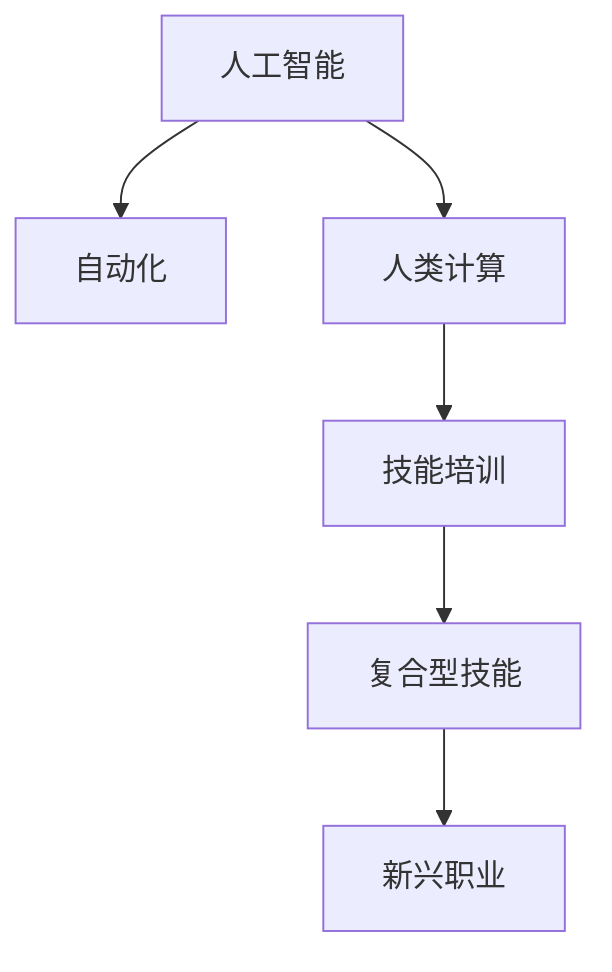

                 

## 1. 背景介绍

### 1.1 问题由来
人工智能(AI)和自动化技术的飞速发展正在深刻改变全球的就业结构。一方面，AI和自动化正在取代许多传统劳动密集型工作，导致这些职业的岗位数量大幅减少。另一方面，AI也在创造新的就业机会，推动新兴职业的增长。然而，这些新兴职业往往需要掌握高度专业化的技能，导致劳动力市场的技能供需不匹配问题日益严重。

在AI时代，对于劳动力的需求正从体力劳动向智力劳动转变，对于技能培训的要求也从单一技能向复合型技能转变。这一趋势对于传统职业培训体系提出了新的挑战，要求我们思考如何适应技术变革，为未来的劳动力市场做好充分准备。

### 1.2 问题核心关键点
本文旨在探讨AI时代下，人类计算的新模式及其对就业市场和技能培训的影响，为政策制定者和教育机构提供参考，帮助他们更好地应对AI时代的就业挑战。

## 2. 核心概念与联系

### 2.1 核心概念概述

为更好地理解AI时代下人类计算的新模式，本文将介绍几个关键概念：

- 人工智能(AI)：利用计算机技术模拟人类智能，涵盖机器学习、深度学习、自然语言处理等多种技术。
- 自动化：通过程序化的方法实现任务的自动化处理，减少人力成本，提高生产效率。
- 人类计算：指将部分原本由机器完成的计算任务转交给人类进行，提升计算的精准性和解释性。
- 技能培训：旨在通过教育和培训，使劳动力掌握新兴技能，适应AI时代的就业需求。
- 复合型技能：指跨学科、跨领域、跨技术的综合性技能，符合AI时代对劳动力的新要求。

这些概念之间的逻辑关系可以通过以下Mermaid流程图来展示：



这个流程图展示了几大核心概念之间的联系：

1. 人工智能通过自动化技术推动计算任务的自动化。
2. 人类计算取代了部分由机器完成的计算任务。
3. 技能培训帮助劳动力掌握新的复合型技能。
4. 复合型技能促使新兴职业的产生和发展。

这些概念共同构成了AI时代下人类计算的新模式，为未来的劳动力市场带来了新的机遇和挑战。

## 3. 核心算法原理 & 具体操作步骤
### 3.1 算法原理概述

人类计算的核心思想是利用人类的智力优势，在特定计算任务中取代机器。这一过程通常涉及以下几个步骤：

1. **数据收集与清洗**：收集相关的数据集，并进行预处理，以确保数据的质量和完整性。
2. **任务定义**：明确计算任务的目标和要求，确定哪些任务可以由人类进行。
3. **任务分配**：将数据集分配给不同的计算节点，每个节点可以由一个人或一个小团队负责。
4. **任务执行**：节点上的工作者执行具体的计算任务，如数据分析、标注、验证等。
5. **结果汇总与反馈**：将各个节点的计算结果汇总，并进行必要的调整和验证，反馈给数据集原始提供者。

### 3.2 算法步骤详解

#### 数据收集与清洗

数据收集与清洗是人工智能项目的基础，涉及以下几个关键步骤：

1. **数据来源**：确定数据来源，可以是公开数据集、企业数据、互联网数据等。
2. **数据格式**：将不同来源的数据转换为统一的格式，如CSV、JSON等，以便后续处理。
3. **数据质量**：检查数据的完整性、准确性和一致性，识别并处理缺失值、异常值等问题。
4. **数据清洗**：去除重复数据、无关数据，进行必要的标准化和归一化。

#### 任务定义

明确计算任务的目标和要求，通常包括以下步骤：

1. **任务需求分析**：理解任务的业务需求和技术要求，确定任务的范围和边界。
2. **任务分解**：将复杂的任务分解为可执行的子任务，便于节点分配和管理。
3. **任务评估**：评估任务的复杂度、数据量、资源需求等，确定每个任务所需的时间和人力。
4. **任务分配策略**：确定任务的分配策略，如按技能水平、地理位置、工作时长等。

#### 任务分配

任务分配是将数据集分配给不同计算节点，通常包括以下步骤：

1. **节点划分**：将数据集划分为多个子集，每个子集分配给一个或多个节点。
2. **节点选择**：根据任务需求、资源可用性等因素，选择适合执行该任务的节点。
3. **节点协调**：协调不同节点之间的任务分配和进度，确保任务按时完成。

#### 任务执行

任务执行是数据处理的核心阶段，通常包括以下步骤：

1. **任务实施**：节点上的工作者执行具体的计算任务，如数据分析、标注、验证等。
2. **任务监控**：实时监控任务的执行进度和质量，及时发现和解决问题。
3. **任务提交**：将计算结果提交给中央服务器或数据集原始提供者，进行汇总和处理。

#### 结果汇总与反馈

结果汇总与反馈是将各个节点的计算结果汇总，并进行必要的调整和验证，通常包括以下步骤：

1. **结果整合**：将各个节点的计算结果进行整合，生成最终的计算结果。
2. **结果验证**：对计算结果进行验证和调整，确保结果的准确性和一致性。
3. **反馈机制**：将计算结果反馈给数据集原始提供者，供其进一步分析和改进。

### 3.3 算法优缺点

人类计算的优点包括：

1. **精度高**：人类在处理复杂任务时，能够进行深度分析和判断，减少计算误差。
2. **可解释性**：人类计算的结果具有更高的可解释性，便于理解和使用。
3. **灵活性**：人类能够适应不同场景和任务，灵活调整计算策略。

然而，人类计算也存在一些缺点：

1. **成本高**：需要支付人力成本，成本较高，尤其是大规模计算任务。
2. **效率低**：相对于机器计算，人类计算的速度较慢，无法处理大量数据。
3. **依赖性强**：依赖于工作者的专业技能和经验，易受人为因素影响。

### 3.4 算法应用领域

人类计算在多个领域都有广泛应用，例如：

- **数据分析与处理**：在数据清洗、特征工程、模型验证等环节，人类计算能够提供更高的精度和可解释性。
- **自然语言处理**：在文本分类、情感分析、语义理解等任务中，人类计算能够处理复杂语义和情感表达。
- **医学影像分析**：在医学影像标注、病理分析等任务中，人类计算能够提供更准确的诊断结果。
- **金融风控**：在信用评估、欺诈检测等任务中，人类计算能够进行深度分析，提高风险管理能力。
- **工业设计**：在产品设计和原型验证等环节，人类计算能够提供创新思路和设计优化。

## 4. 数学模型和公式 & 详细讲解  
### 4.1 数学模型构建

人类计算的核心任务是数据处理和分析，其数学模型通常涉及以下元素：

- **数据集**：由样本数据组成的集合，通常包含输入和输出，形式为$(X, Y)$。
- **模型**：对数据进行建模，形式为$f(X)$，其中$X$为输入，$f$为函数。
- **损失函数**：衡量模型预测结果与真实结果之间的差异，形式为$L(Y, f(X))$。
- **优化算法**：用于最小化损失函数，形式为$argmin(L(Y, f(X)))$。

### 4.2 公式推导过程

以数据标注任务为例，其数学模型和公式推导如下：

- **输入与输出**：输入为标注文本$x_i$，输出为标注标签$y_i$。
- **模型**：将标注文本$x_i$输入到预训练模型中，得到特征表示$z_i$，然后通过逻辑回归等方法生成标签$y_i$。
- **损失函数**：交叉熵损失函数$L(y_i, \hat{y}_i) = -(y_i \log \hat{y}_i + (1-y_i) \log(1-\hat{y}_i))$，其中$\hat{y}_i$为模型预测标签。
- **优化算法**：使用梯度下降等算法优化模型参数，形式为$\theta = \theta - \eta \nabla_{\theta}L(y_i, \hat{y}_i)$，其中$\eta$为学习率，$\nabla_{\theta}L(y_i, \hat{y}_i)$为损失函数对模型参数的梯度。

### 4.3 案例分析与讲解

以医学影像标注为例，其数学模型和公式推导如下：

- **输入与输出**：输入为医学影像$x_i$，输出为病理标注$y_i$。
- **模型**：将医学影像$x_i$输入到卷积神经网络中，得到特征表示$z_i$，然后通过分类器生成病理标注$y_i$。
- **损失函数**：交叉熵损失函数$L(y_i, \hat{y}_i) = -(y_i \log \hat{y}_i + (1-y_i) \log(1-\hat{y}_i))$，其中$\hat{y}_i$为模型预测病理标注。
- **优化算法**：使用梯度下降等算法优化模型参数，形式为$\theta = \theta - \eta \nabla_{\theta}L(y_i, \hat{y}_i)$，其中$\eta$为学习率，$\nabla_{\theta}L(y_i, \hat{y}_i)$为损失函数对模型参数的梯度。

## 5. 项目实践：代码实例和详细解释说明
### 5.1 开发环境搭建

在进行人类计算实践前，我们需要准备好开发环境。以下是使用Python进行PyTorch开发的环境配置流程：

1. 安装Anaconda：从官网下载并安装Anaconda，用于创建独立的Python环境。

2. 创建并激活虚拟环境：
```bash
conda create -n human-computing-env python=3.8 
conda activate human-computing-env
```

3. 安装PyTorch：根据CUDA版本，从官网获取对应的安装命令。例如：
```bash
conda install pytorch torchvision torchaudio cudatoolkit=11.1 -c pytorch -c conda-forge
```

4. 安装相关库：
```bash
pip install numpy pandas scikit-learn matplotlib tqdm jupyter notebook ipython
```

完成上述步骤后，即可在`human-computing-env`环境中开始人类计算实践。

### 5.2 源代码详细实现

下面我们以医学影像标注任务为例，给出使用PyTorch进行人类计算的代码实现。

首先，定义标注任务的数据处理函数：

```python
from transformers import BertTokenizer
from torch.utils.data import Dataset
import torch

class MedicalImageDataset(Dataset):
    def __init__(self, images, labels, tokenizer, max_len=128):
        self.images = images
        self.labels = labels
        self.tokenizer = tokenizer
        self.max_len = max_len
        
    def __len__(self):
        return len(self.images)
    
    def __getitem__(self, item):
        image = self.images[item]
        label = self.labels[item]
        
        encoding = self.tokenizer(image, return_tensors='pt', max_length=self.max_len, padding='max_length', truncation=True)
        input_ids = encoding['input_ids'][0]
        attention_mask = encoding['attention_mask'][0]
        
        # 对token-wise的标签进行编码
        encoded_label = label2id[label] 
        encoded_label.extend([label2id['O']] * (self.max_len - 1))
        labels = torch.tensor(encoded_label, dtype=torch.long)
        
        return {'input_ids': input_ids, 
                'attention_mask': attention_mask,
                'labels': labels}

# 标签与id的映射
label2id = {'O': 0, 'Benign': 1, 'Malignant': 2}
id2label = {v: k for k, v in label2id.items()}

# 创建dataset
tokenizer = BertTokenizer.from_pretrained('bert-base-cased')

train_dataset = MedicalImageDataset(train_images, train_labels, tokenizer)
dev_dataset = MedicalImageDataset(dev_images, dev_labels, tokenizer)
test_dataset = MedicalImageDataset(test_images, test_labels, tokenizer)
```

然后，定义模型和优化器：

```python
from transformers import BertForTokenClassification, AdamW

model = BertForTokenClassification.from_pretrained('bert-base-cased', num_labels=len(label2id))

optimizer = AdamW(model.parameters(), lr=2e-5)
```

接着，定义训练和评估函数：

```python
from torch.utils.data import DataLoader
from tqdm import tqdm
from sklearn.metrics import classification_report

device = torch.device('cuda') if torch.cuda.is_available() else torch.device('cpu')
model.to(device)

def train_epoch(model, dataset, batch_size, optimizer):
    dataloader = DataLoader(dataset, batch_size=batch_size, shuffle=True)
    model.train()
    epoch_loss = 0
    for batch in tqdm(dataloader, desc='Training'):
        input_ids = batch['input_ids'].to(device)
        attention_mask = batch['attention_mask'].to(device)
        labels = batch['labels'].to(device)
        model.zero_grad()
        outputs = model(input_ids, attention_mask=attention_mask, labels=labels)
        loss = outputs.loss
        epoch_loss += loss.item()
        loss.backward()
        optimizer.step()
    return epoch_loss / len(dataloader)

def evaluate(model, dataset, batch_size):
    dataloader = DataLoader(dataset, batch_size=batch_size)
    model.eval()
    preds, labels = [], []
    with torch.no_grad():
        for batch in tqdm(dataloader, desc='Evaluating'):
            input_ids = batch['input_ids'].to(device)
            attention_mask = batch['attention_mask'].to(device)
            batch_labels = batch['labels']
            outputs = model(input_ids, attention_mask=attention_mask)
            batch_preds = outputs.logits.argmax(dim=2).to('cpu').tolist()
            batch_labels = batch_labels.to('cpu').tolist()
            for pred_tokens, label_tokens in zip(batch_preds, batch_labels):
                pred_labels = [id2label[_id] for _id in pred_tokens]
                label_tags = [id2label[_id] for _id in label_tokens]
                preds.append(pred_labels[:len(label_tokens)])
                labels.append(label_tags)
                
    print(classification_report(labels, preds))
```

最后，启动训练流程并在测试集上评估：

```python
epochs = 5
batch_size = 16

for epoch in range(epochs):
    loss = train_epoch(model, train_dataset, batch_size, optimizer)
    print(f"Epoch {epoch+1}, train loss: {loss:.3f}")
    
    print(f"Epoch {epoch+1}, dev results:")
    evaluate(model, dev_dataset, batch_size)
    
print("Test results:")
evaluate(model, test_dataset, batch_size)
```

以上就是使用PyTorch进行医学影像标注任务人类计算的完整代码实现。可以看到，得益于Transformers库的强大封装，我们可以用相对简洁的代码完成模型的训练和评估。

### 5.3 代码解读与分析

让我们再详细解读一下关键代码的实现细节：

**MedicalImageDataset类**：
- `__init__`方法：初始化图像、标签、分词器等关键组件。
- `__len__`方法：返回数据集的样本数量。
- `__getitem__`方法：对单个样本进行处理，将图像输入转换为token ids，将标签转换为数字，并对其进行定长padding，最终返回模型所需的输入。

**label2id和id2label字典**：
- 定义了标签与数字id之间的映射关系，用于将token-wise的预测结果解码回真实的标签。

**训练和评估函数**：
- 使用PyTorch的DataLoader对数据集进行批次化加载，供模型训练和推理使用。
- 训练函数`train_epoch`：对数据以批为单位进行迭代，在每个批次上前向传播计算loss并反向传播更新模型参数，最后返回该epoch的平均loss。
- 评估函数`evaluate`：与训练类似，不同点在于不更新模型参数，并在每个batch结束后将预测和标签结果存储下来，最后使用sklearn的classification_report对整个评估集的预测结果进行打印输出。

**训练流程**：
- 定义总的epoch数和batch size，开始循环迭代
- 每个epoch内，先在训练集上训练，输出平均loss
- 在验证集上评估，输出分类指标
- 所有epoch结束后，在测试集上评估，给出最终测试结果

可以看到，PyTorch配合Transformers库使得医学影像标注任务的实现变得简洁高效。开发者可以将更多精力放在数据处理、模型改进等高层逻辑上，而不必过多关注底层的实现细节。

当然，工业级的系统实现还需考虑更多因素，如模型的保存和部署、超参数的自动搜索、更灵活的任务适配层等。但核心的微调范式基本与此类似。

## 6. 实际应用场景
### 6.1 智能客服系统

基于人类计算的智能客服系统，可以广泛应用于智能客服系统的构建。传统客服往往需要配备大量人力，高峰期响应缓慢，且一致性和专业性难以保证。而使用人类计算的智能客服系统，可以在非高峰期使用人工智能技术处理常见问题，高峰期通过人工计算的方式快速响应复杂问题，提供更高效、更精准的客服服务。

在技术实现上，可以收集企业内部的历史客服对话记录，将问题和最佳答复构建成监督数据，在此基础上对预训练模型进行微调。微调后的模型能够自动理解用户意图，匹配最合适的答案模板进行回复。对于客户提出的新问题，还可以接入检索系统实时搜索相关内容，动态组织生成回答。如此构建的智能客服系统，能大幅提升客户咨询体验和问题解决效率。

### 6.2 金融舆情监测

金融机构需要实时监测市场舆论动向，以便及时应对负面信息传播，规避金融风险。传统的人工监测方式成本高、效率低，难以应对网络时代海量信息爆发的挑战。基于人类计算的金融舆情监测系统，可以实时抓取互联网上的新闻、评论、社交媒体等数据，通过自然语言处理技术进行情感分析和主题分类，自动识别舆情热点和风险预警。

在技术实现上，可以收集金融领域相关的新闻、报道、评论等文本数据，并对其进行主题标注和情感标注。在此基础上对预训练语言模型进行微调，使其能够自动判断文本属于何种主题，情感倾向是正面、中性还是负面。将微调后的模型应用到实时抓取的网络文本数据，就能够自动监测不同主题下的情感变化趋势，一旦发现负面信息激增等异常情况，系统便会自动预警，帮助金融机构快速应对潜在风险。

### 6.3 个性化推荐系统

当前的推荐系统往往只依赖用户的历史行为数据进行物品推荐，无法深入理解用户的真实兴趣偏好。基于人类计算的个性化推荐系统，可以更好地挖掘用户行为背后的语义信息，从而提供更精准、多样的推荐内容。

在技术实现上，可以收集用户浏览、点击、评论、分享等行为数据，提取和用户交互的物品标题、描述、标签等文本内容。将文本内容作为模型输入，用户的后续行为（如是否点击、购买等）作为监督信号，在此基础上微调预训练语言模型。微调后的模型能够从文本内容中准确把握用户的兴趣点。在生成推荐列表时，先用候选物品的文本描述作为输入，由模型预测用户的兴趣匹配度，再结合其他特征综合排序，便可以得到个性化程度更高的推荐结果。

### 6.4 未来应用展望

随着人类计算技术的发展，其应用前景将更加广阔，特别是在以下几个方面：

- **医疗诊断**：在医学影像分析、病理诊断等任务中，人类计算可以提供更精准的诊断结果，辅助医生进行疾病诊断和治疗。
- **智能制造**：在产品设计和原型验证等环节，人类计算可以提供创新的设计思路和设计优化，提升产品质量和制造效率。
- **环境保护**：在环境监测和数据分析等任务中，人类计算可以提供更全面、更深入的环境信息，支持环保政策的制定和实施。
- **文化传承**：在历史文献分析、文化传承等任务中，人类计算可以提供更准确的文本分析和知识发现，促进文化的传承和创新。

这些应用场景展示了人类计算的巨大潜力，将在多个领域推动技术进步和社会发展。

## 7. 工具和资源推荐
### 7.1 学习资源推荐

为了帮助开发者系统掌握人类计算的理论基础和实践技巧，这里推荐一些优质的学习资源：

1. 《人工智能基础》系列课程：由知名大学和研究机构开设的入门级课程，涵盖人工智能的基本概念和核心算法。
2. 《深度学习入门》书籍：介绍深度学习的基本原理和应用，包括神经网络、卷积神经网络、循环神经网络等。
3. 《自然语言处理》课程：斯坦福大学开设的NLP明星课程，有Lecture视频和配套作业，带你入门NLP领域的基本概念和经典模型。
4. 《Python数据科学手册》书籍：介绍Python在数据科学和机器学习中的应用，涵盖数据处理、机器学习、可视化等技术。
5. Kaggle：一个数据科学和机器学习的竞赛平台，提供大量的数据集和开源代码，是学习和实践的绝佳资源。

通过对这些资源的学习实践，相信你一定能够快速掌握人类计算的精髓，并用于解决实际的计算任务。

### 7.2 开发工具推荐

高效的开发离不开优秀的工具支持。以下是几款用于人类计算开发的常用工具：

1. Python：一款功能强大的编程语言，广泛应用于数据科学和机器学习领域，有丰富的第三方库和工具支持。
2. Jupyter Notebook：一款交互式笔记本工具，支持Python、R等多种编程语言，方便开发和调试。
3. PyTorch：基于Python的深度学习框架，支持动态计算图，灵活性高，易于使用。
4. TensorFlow：由Google主导开发的深度学习框架，生产部署方便，支持多种设备。
5. scikit-learn：一个Python科学计算库，提供多种机器学习算法和工具，适合快速原型开发。

合理利用这些工具，可以显著提升人类计算任务的开发效率，加快创新迭代的步伐。

### 7.3 相关论文推荐

人类计算的研究源于学界的持续研究。以下是几篇奠基性的相关论文，推荐阅读：

1. 《The Ethics of Artificial Intelligence》：探讨AI伦理问题，强调人类计算在伦理和社会影响方面的重要性。
2. 《Human-in-the-loop Machine Learning》：研究人机协同的机器学习算法，介绍人类计算在机器学习中的应用。
3. 《Human-in-the-loop Data Analysis》：讨论人类计算在数据分析和信息抽取中的应用，提升数据处理的精度和解释性。
4. 《Natural Language Processing with Human-in-the-loop》：研究人机协同的自然语言处理算法，提高NLP任务的准确性和可解释性。
5. 《Human-in-the-loop Design of Machine Learning Models》：讨论人类计算在机器学习模型设计中的应用，提升模型的鲁棒性和可解释性。

这些论文代表了大语言模型微调技术的发展脉络。通过学习这些前沿成果，可以帮助研究者把握学科前进方向，激发更多的创新灵感。

## 8. 总结：未来发展趋势与挑战

### 8.1 总结

本文对AI时代下人类计算的新模式及其对就业市场和技能培训的影响进行了全面系统的介绍。首先阐述了人类计算在新兴职业和技能培训中的重要性，明确了人类计算在AI时代下的新角色和需求。其次，从原理到实践，详细讲解了人类计算的数学模型和关键步骤，给出了人类计算任务开发的完整代码实例。同时，本文还广泛探讨了人类计算在多个行业领域的应用前景，展示了人类计算的巨大潜力。

通过本文的系统梳理，可以看到，人类计算正在成为AI时代下重要的计算模式，为未来的劳动力市场带来了新的机遇和挑战。

### 8.2 未来发展趋势

展望未来，人类计算技术将呈现以下几个发展趋势：

1. **智能与人工协同**：未来的人类计算系统将更加注重智能与人工的协同，结合人工智能和人类计算的优势，实现更高效、更精准的计算。
2. **多模态融合**：人类计算将融合多种模态数据，如图像、视频、声音等，提升计算任务的综合能力。
3. **知识图谱应用**：人类计算将结合知识图谱，提升计算任务的推理能力和知识整合能力。
4. **伦理与安全**：人类计算将注重计算任务的伦理和安全问题，确保计算结果符合人类价值观和伦理道德。
5. **自动化与适应性**：人类计算将结合自动化技术，提升计算任务的适应性和灵活性，减少人工干预。

以上趋势凸显了人类计算技术的广阔前景，将在多个领域推动技术进步和社会发展。

### 8.3 面临的挑战

尽管人类计算技术正在快速发展，但在迈向更加智能化、普适化应用的过程中，它仍面临着诸多挑战：

1. **数据依赖性强**：人类计算对数据的质量和数量依赖较强，数据采集和处理成本较高。
2. **技术壁垒高**：人类计算需要跨学科、跨领域的知识，技术门槛较高。
3. **效率瓶颈**：人类计算的效率较低，难以处理大规模计算任务。
4. **成本高**：人类计算需要大量人力成本，成本较高。
5. **解释性不足**：人类计算的结果难以解释，缺乏透明性和可追溯性。

### 8.4 研究展望

面对人类计算所面临的种种挑战，未来的研究需要在以下几个方面寻求新的突破：

1. **自动化与智能化**：开发更加智能化的自动化技术，提高计算任务的效率和准确性。
2. **多模态融合**：研究多模态数据的融合技术，提升计算任务的综合能力。
3. **知识图谱应用**：将知识图谱与人类计算相结合，提升计算任务的推理能力和知识整合能力。
4. **伦理与安全**：研究计算任务的伦理和安全问题，确保计算结果符合人类价值观和伦理道德。
5. **成本控制**：研究高效的数据采集和处理技术，降低计算任务的成本。

这些研究方向的探索，必将引领人类计算技术迈向更高的台阶，为构建安全、可靠、可解释、可控的智能系统铺平道路。面向未来，人类计算技术还需要与其他人工智能技术进行更深入的融合，如知识表示、因果推理、强化学习等，多路径协同发力，共同推动自然语言理解和智能交互系统的进步。只有勇于创新、敢于突破，才能不断拓展人类计算的边界，让智能技术更好地造福人类社会。

## 9. 附录：常见问题与解答

**Q1：人类计算是否适用于所有计算任务？**

A: 人类计算适用于需要深度理解和解释的计算任务，如文本分析、复杂推理、多模态融合等。但对于简单、重复的计算任务，机器计算更加高效，更适合使用机器自动化处理。

**Q2：人类计算与人工智能的关系是什么？**

A: 人类计算与人工智能互补，前者适用于需要深度理解和解释的复杂任务，后者适用于简单、重复的计算任务。未来，两者将更加紧密地结合，实现更高效、更智能的计算。

**Q3：人类计算的效率如何？**

A: 人类计算的效率较低，难以处理大规模计算任务。通常需要结合自动化技术，提升计算任务的效率和准确性。

**Q4：人类计算的适用场景有哪些？**

A: 人类计算适用于需要深度理解和解释的计算任务，如文本分析、复杂推理、多模态融合等。典型应用场景包括医学影像分析、金融舆情监测、智能客服系统、个性化推荐系统等。

**Q5：人类计算的挑战有哪些？**

A: 人类计算的挑战包括数据依赖性强、技术门槛高、效率瓶颈、成本高、解释性不足等。未来需要进一步优化数据采集和处理技术，降低计算任务成本，提升计算任务效率和解释性。

---

作者：禅与计算机程序设计艺术 / Zen and the Art of Computer Programming

