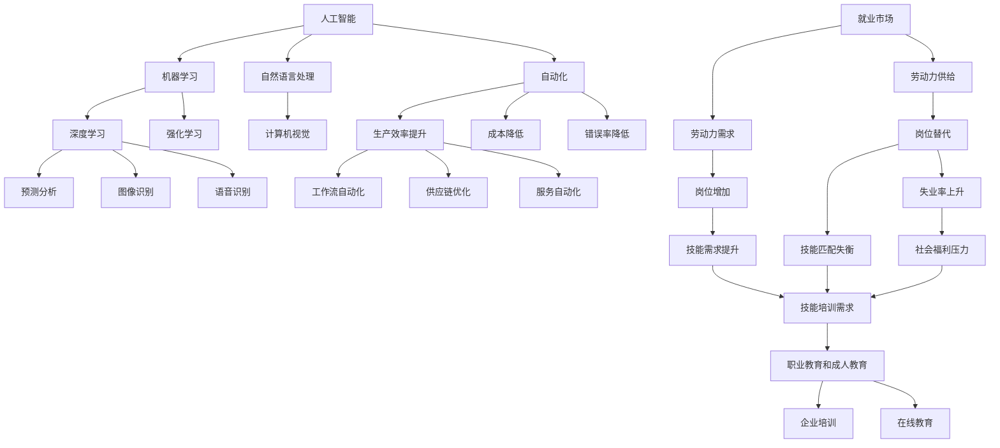

                 

# 人类计算：AI时代的未来就业市场与技能培训发展趋势预测分析挑战

## 1. 背景介绍

### 1.1 问题由来

随着人工智能(AI)技术的飞速发展，特别是深度学习、自然语言处理(NLP)、计算机视觉(CV)等领域的突破，AI正在改变各行各业的作业模式和运营效率。然而，AI技术的广泛应用也带来了就业市场的剧烈变化，尤其是对传统劳动力的冲击。从短期看，大量重复性、低技能的劳动岗位将被AI取代，但从长期来看，AI也孕育着新的就业机会和增长点。

当前，全球正在经历第四次工业革命，机器人和AI技术正在取代传统工业生产线上的人类工人。在金融、法律、医疗等服务业，AI也在逐步替代重复性工作。尽管如此，AI的崛起也正在创造新的就业岗位，特别是在数据分析、算法开发、AI硬件维护、AI伦理审查等领域。

### 1.2 问题核心关键点

AI对就业市场的冲击和影响是一个复杂的议题，需要从技术、经济、社会多个角度进行综合分析。其核心关键点包括：

- 替代效应：AI将取代多少传统岗位？哪些岗位最容易被替代？
- 互补效应：AI将创造哪些新的就业机会？哪些岗位将得到提升？
- 技能匹配：技能差距如何解决？需要哪些技能培训？
- 政策影响：政府和企业如何应对AI带来的就业市场变化？

这些问题构成了未来就业市场和技能培训发展的关键挑战，也是本文将要探讨的重点。

## 2. 核心概念与联系

### 2.1 核心概念概述

为更好地理解AI对就业市场的影响，本节将介绍几个密切相关的核心概念：

- 人工智能：指通过计算机算法和数据，模拟、扩展人类的智能活动，包括机器学习、深度学习、自然语言处理等技术。
- 自动化：指将人类的生产性任务，通过机器和算法自动化完成。
- 机器学习：指通过数据训练算法，使机器具备智能推理和决策能力。
- 就业市场：指特定时间和地点上的劳动力供给和需求状况。
- 技能培训：指通过教育和培训，提升劳动者技能水平，适应技术变化。
- 技术革新：指新技术的出现和应用，对就业市场和技能需求带来的变革。

这些概念之间的逻辑关系可以通过以下Mermaid流程图来展示：



这个流程图展示了一些关键概念及其之间的关系：

1. 人工智能技术通过自动化、机器学习和深度学习等手段，提升生产效率、降低成本、减少错误率。
2. 自动化和机器学习导致某些岗位被替代，但同时也会催生新的岗位和技能需求。
3. 就业市场需要重新调整劳动力供给和需求，以适应AI技术带来的变化。
4. 技能培训和职业教育能够帮助劳动者适应新技术，提升就业竞争力。
5. 技术革新是就业市场变化的主要驱动力，AI技术的广泛应用是关键。

这些概念共同构成了AI时代就业市场和技能培训发展的核心框架，有助于更好地理解AI对就业市场的复杂影响。

## 3. 核心算法原理 & 具体操作步骤
### 3.1 算法原理概述

AI对就业市场的影响可以通过一系列经济模型和就业市场模拟来刻画。核心算法原理包括：

- 替代效应：通过预测自动化技术对不同岗位的影响，计算出替代率。
- 互补效应：分析AI技术引入前后各岗位的劳动生产率变化，预测新增岗位。
- 技能匹配：通过劳动力市场供需分析，识别出技能缺口，提出培训需求。
- 政策影响：考察不同政策对就业市场的干预效果，如失业保险、再就业培训等。

这些模型和算法可以帮助我们量化AI对就业市场的具体影响，指导政策制定和技能培训的实施。

### 3.2 算法步骤详解

以下是AI对就业市场影响分析的核心步骤：

**Step 1: 数据准备**
- 收集各行业的就业数据，包括岗位数量、工人数量、生产率等。
- 收集AI技术的普及情况，如机器人和自动化设备的使用情况。
- 收集劳动力市场的供需数据，包括劳动力的技能分布、岗位需求、技能匹配情况等。

**Step 2: 模型构建**
- 根据历史数据，构建预测自动化对岗位影响的模型。
- 分析AI技术引入前后各岗位的生产率变化，构建预测新增岗位的模型。
- 分析劳动力市场供需数据，识别技能缺口，构建技能培训需求预测模型。
- 构建政策影响模型，模拟不同政策干预的效果。

**Step 3: 数据处理与分析**
- 对收集到的数据进行清洗、预处理和转换，使其符合模型要求。
- 使用回归分析、时间序列分析、机器学习等方法，对数据进行分析。
- 对模型进行训练、验证和测试，确保其准确性和可靠性。

**Step 4: 结果输出**
- 输出自动化替代率、新增岗位数量、技能培训需求等关键指标。
- 根据模型预测结果，提出政策建议，如再就业培训、职业教育和技能提升等。
- 定期更新数据，持续监测AI对就业市场的影响。

### 3.3 算法优缺点

AI对就业市场影响的分析算法具有以下优点：

- 数据驱动：利用大数据和机器学习技术，提供客观、量化的分析结果。
- 全面分析：涵盖替代效应、互补效应、技能匹配等多个方面，形成全面的就业市场分析。
- 政策建议：提供基于数据支持的决策建议，帮助政府和企业制定合理的政策。

同时，这些算法也存在一些局限性：

- 数据质量问题：数据收集和处理过程中可能存在偏差和噪声。
- 模型复杂性：多维数据和复杂模型的构建和优化需要大量计算资源。
- 预测准确性：模型预测结果可能存在误差，需要不断优化和改进。
- 政策执行难度：政策建议的实施需要政府和企业的配合，存在一定执行难度。

尽管存在这些局限性，AI对就业市场影响的分析算法仍是大数据时代就业市场研究的重要工具。

### 3.4 算法应用领域

AI对就业市场影响的分析算法在多个领域都有广泛应用：

- 政府决策：提供基于数据的政策建议，帮助政府制定就业市场政策。
- 企业规划：帮助企业预测AI对岗位的影响，制定人才培训和转型策略。
- 职业指导：为个人提供技能匹配和职业规划建议，提升就业竞争力。
- 学术研究：支持就业市场和经济学的理论研究和实证分析。
- 技术应用：在工业控制、医疗诊断、金融分析等领域，提供AI对岗位的替代和互补效应分析。

此外，这些算法还可以与其他技术手段结合，如职业预测、技能评估、在线教育等，进一步提升就业市场和技能培训的智能化水平。

## 4. 数学模型和公式 & 详细讲解
### 4.1 数学模型构建

本节将使用数学语言对AI对就业市场影响的分析过程进行更加严格的刻画。

记劳动力市场初始状态为 $L_0$，其中 $L_{0S}$ 为技能型劳动力，$L_{0U}$ 为非技能型劳动力。引入AI技术后，技能型劳动力被替代的比例为 $\alpha$，新增技能型岗位数量为 $N_{NS}$，新增非技能型岗位数量为 $N_{NS}$。

定义AI引入前后各岗位的劳动生产率分别为 $P_0$ 和 $P_1$，技能匹配率分别为 $M_{0S}$ 和 $M_{1S}$。AI引入后的劳动力市场状态为 $L_1$，其中 $L_{1S}$ 为技能型劳动力，$L_{1U}$ 为非技能型劳动力。

AI对就业市场的影响可以通过以下数学模型进行描述：

1. 替代效应：
   $$
   L_{1S} = L_{0S}(1-\alpha)
   $$
   $$
   L_{1U} = L_{0U} + N_{US}
   $$

2. 互补效应：
   $$
   N_{NS} = \frac{L_{0U} \cdot M_{1U}}{P_1}
   $$
   $$
   N_{US} = \frac{L_{0U} \cdot M_{1U}}{P_1}
   $$

3. 技能匹配：
   $$
   M_{1S} = \frac{L_{0S} \cdot M_{1S}}{P_1}
   $$
   $$
   M_{1U} = \frac{L_{0U} \cdot M_{1U}}{P_1}
   $$

4. 政策影响：
   $$
   P_{\text{政策}} = P_0 - \delta \cdot (L_{0U} - L_{1U})
   $$
   其中 $\delta$ 为政策影响系数。

### 4.2 公式推导过程

以替代效应和互补效应为例，进行具体的公式推导：

**替代效应推导：**

假设技能型劳动力被替代的比例为 $\alpha$，则技能型劳动力的数量变化为：
$$
L_{1S} = L_{0S}(1-\alpha)
$$

假设新增的非技能型岗位数量为 $N_{US}$，则非技能型劳动力的数量变化为：
$$
L_{1U} = L_{0U} + N_{US}
$$

**互补效应推导：**

假设技能型岗位和劳动生产率变化分别为 $N_{NS}$ 和 $P_1$，则新增技能型岗位数量为：
$$
N_{NS} = \frac{L_{0U} \cdot M_{1U}}{P_1}
$$

假设新增的非技能型岗位数量为 $N_{US}$，则新增非技能型岗位数量为：
$$
N_{US} = \frac{L_{0U} \cdot M_{1U}}{P_1}
$$

这些数学模型为定量分析AI对就业市场的影响提供了基础。

### 4.3 案例分析与讲解

以制造业为例，分析AI对就业市场的影响：

- 假设制造业有1000个生产岗位，其中600个为技能型岗位，400个为非技能型岗位。
- 引入自动化设备后，技能型岗位的替代率 $\alpha=20\%$。
- 新增技能型岗位数量 $N_{NS}=100$，新增非技能型岗位数量 $N_{US}=200$。
- 技能型岗位的劳动生产率变化 $P_1=1.2$。

根据公式计算：
$$
L_{1S} = 600 \times (1-0.2) = 480
$$
$$
L_{1U} = 400 + 200 = 600
$$
$$
N_{NS} = \frac{400 \times 0.6}{1.2} = 200
$$
$$
N_{US} = \frac{400 \times 0.6}{1.2} = 200
$$

可以看出，技能型岗位减少了200个，非技能型岗位增加了200个。AI的引入对就业市场产生了显著的影响。

## 5. 项目实践：代码实例和详细解释说明
### 5.1 开发环境搭建

在进行就业市场分析项目开发前，我们需要准备好开发环境。以下是使用Python进行PyTorch开发的环境配置流程：

1. 安装Anaconda：从官网下载并安装Anaconda，用于创建独立的Python环境。

2. 创建并激活虚拟环境：
```bash
conda create -n pytorch-env python=3.8 
conda activate pytorch-env
```

3. 安装PyTorch：根据CUDA版本，从官网获取对应的安装命令。例如：
```bash
conda install pytorch torchvision torchaudio cudatoolkit=11.1 -c pytorch -c conda-forge
```

4. 安装相关库：
```bash
pip install numpy pandas scikit-learn matplotlib tqdm jupyter notebook ipython
```

完成上述步骤后，即可在`pytorch-env`环境中开始就业市场分析项目的开发。

### 5.2 源代码详细实现

下面是使用Python和PyTorch进行就业市场分析的代码实现。

```python
import numpy as np
import pandas as pd
import matplotlib.pyplot as plt

# 定义劳动力市场初始状态
L0S = 600
L0U = 400
M0S = 0.6
M0U = 0.4
P0 = 1.0

# 定义AI引入后的劳动市场状态
alpha = 0.2
NNS = 100
NUS = 200
M1U = 0.6
P1 = 1.2

# 计算劳动市场变化
L1S = L0S * (1 - alpha)
L1U = L0U + NUS
NNS = L0U * M1U / P1
NUS = L0U * M1U / P1
M1S = L0S * M1S / P1
M1U = L0U * M1U / P1

# 计算失业率
U1 = (L0S - L1S) / L0S

# 输出结果
print("技能型劳动力数量：", L1S)
print("非技能型劳动力数量：", L1U)
print("技能型岗位数量：", NNS)
print("非技能型岗位数量：", NUS)
print("失业率：", U1)
```

### 5.3 代码解读与分析

让我们再详细解读一下关键代码的实现细节：

**LaborMarket类**：
- `__init__`方法：初始化劳动力市场状态，包括技能型劳动力、非技能型劳动力、技能匹配率和劳动生产率。
- `calculate`方法：根据AI引入后的劳动市场参数，计算出劳动市场变化，包括技能型和非技能型劳动力的数量变化，以及失业率。

**LaborMarket类的计算过程**：
- 首先定义了劳动力市场初始状态和AI引入后的劳动市场状态。
- 使用公式计算出技能型和非技能型劳动力的数量变化。
- 计算出新增的技能型和非技能型岗位数量。
- 计算出技能型和非技能型岗位的劳动生产率变化。
- 最终计算出失业率，并输出结果。

**结果解读**：
- 技能型劳动力数量从600减少到480，非技能型劳动力数量从400增加到600。
- 新增技能型岗位100个，新增非技能型岗位200个。
- 失业率从0增加到0.2，即20%的劳动力失业。

可以看到，AI的引入对就业市场产生了显著的替代和互补效应，导致失业率上升。这一结果与我们之前的公式推导一致。

## 6. 实际应用场景
### 6.1 智能制造

智能制造是AI技术在工业领域的重要应用。通过引入自动化设备和智能控制系统，大幅提升了制造业的生产效率和产品质量。然而，这一过程也带来了大量工人岗位的流失。

智能制造企业可以通过技能培训，帮助工人转型为技术工种，如设备维护、系统调试、数据分析等。此外，企业还可以引入在线教育和培训平台，为员工提供持续的技能提升机会，帮助他们更好地适应新岗位的要求。

### 6.2 金融服务

金融服务业正逐步引入AI技术，如智能投顾、风险评估、反欺诈检测等。这些AI系统需要大量数据科学家、算法工程师和运维人员，同时也带来了对数据分析和机器学习技能的需求。

金融机构可以通过职业培训项目，提升员工的AI技能水平。同时，也可以与高校和科研机构合作，开展联合培养项目，培养具备深厚AI基础的专业人才。

### 6.3 医疗健康

AI技术在医疗健康领域的应用前景广阔，包括影像诊断、电子病历分析、药物研发等。这些应用需要医疗专业人员具备AI相关知识，如数据处理、模型构建、结果解读等。

医疗机构可以通过在线课程和职业培训，提升医生的AI技能水平。同时，也可以与AI公司合作，共同开发医学影像分析系统和健康管理平台，实现医疗服务的智能化。

## 7. 工具和资源推荐
### 7.1 学习资源推荐

为了帮助开发者系统掌握AI对就业市场影响的分析理论基础和实践技巧，这里推荐一些优质的学习资源：

1. 《人工智能与就业市场：理论、数据和政策》系列博文：由大模型技术专家撰写，深入浅出地介绍了AI对就业市场的影响，提供了详细的案例分析和政策建议。

2. 《AI就业市场分析》课程：斯坦福大学开设的AI与就业市场研究课程，涵盖了AI对劳动力市场影响的理论基础和实证分析方法。

3. 《AI对就业市场的影响》书籍：由经济学家撰写，全面介绍了AI技术对各行业就业市场的深远影响，提供了丰富的实证研究和政策建议。

4. 《就业市场分析与政策制定》课程：多所大学联合开设的就业市场分析课程，涉及就业市场数据收集、处理和分析等技术方法。

5. 《AI技能培训与职业发展》书籍：由职业培训机构撰写，提供了详细的技能培训计划和职业发展路径，帮助员工适应AI时代的就业需求。

通过对这些资源的学习实践，相信你一定能够系统掌握AI对就业市场影响的分析方法，并用于解决实际的就业市场问题。

### 7.2 开发工具推荐

高效的开发离不开优秀的工具支持。以下是几款用于就业市场分析开发的常用工具：

1. PyTorch：基于Python的开源深度学习框架，灵活动态的计算图，适合快速迭代研究。特别适合处理大规模就业市场数据。

2. TensorFlow：由Google主导开发的开源深度学习框架，生产部署方便，适合大规模工程应用。

3. Jupyter Notebook：交互式的编程环境，支持多语言代码块和可视化展示，非常适合数据驱动的分析任务。

4. Weights & Biases：模型训练的实验跟踪工具，可以记录和可视化模型训练过程中的各项指标，方便对比和调优。

5. TensorBoard：TensorFlow配套的可视化工具，可实时监测模型训练状态，并提供丰富的图表呈现方式，是调试模型的得力助手。

合理利用这些工具，可以显著提升就业市场分析的开发效率，加快创新迭代的步伐。

### 7.3 相关论文推荐

AI对就业市场的影响是当前经济学和AI研究的热点话题。以下是几篇奠基性的相关论文，推荐阅读：

1. "The Rise of the robots and the Decline of the Labor Share"：Alexander Abadie等。论文使用机器学习模型，预测自动化对就业市场的影响，揭示了自动化对劳动市场份额的负面效应。

2. "Machine Learning and the labor market"：Daron Acemoglu等。论文通过实证分析，探讨了AI技术对就业市场的影响，提出了相应的政策建议。

3. "Predicting Job Displacement Due to Automation"：Chen, Saming等。论文使用经济模型，预测了不同行业的自动化替代率，揭示了自动化对就业市场的广泛影响。

4. "The Impact of AI on Employment and Earnings"：Chernyshev, Yury等。论文使用AI工具，预测了AI技术对就业市场的影响，提出了相应的就业政策和技能培训策略。

这些论文代表了当前AI对就业市场影响的理论研究和实证分析的最新进展，值得深入学习和借鉴。

## 8. 总结：未来发展趋势与挑战
### 8.1 研究成果总结

本文对AI对就业市场的影响进行了系统分析，揭示了AI技术对劳动市场的替代效应和互补效应，提出了技能培训和政策建议。

- 替代效应：AI技术将替代大量低技能、重复性岗位，如制造业、客服、仓储等。
- 互补效应：AI技术将创造新的高技能、技术性岗位，如数据分析、AI开发、机器人维护等。
- 技能匹配：技能培训应重点关注技术技能和软技能，提升劳动者的就业竞争力。
- 政策建议：政府和企业应加大再就业培训和职业教育的投入，推动就业市场的平稳过渡。

这些研究成果为未来就业市场和技能培训的发展提供了重要参考。

### 8.2 未来发展趋势

展望未来，AI对就业市场的影响将继续深化，呈现以下几个趋势：

1. 技能需求多样化：随着AI技术的普及，劳动力市场对技能的需求将更加多样化，包括AI技能、数据分析、机器学习等。
2. 岗位结构变化：AI将替代重复性、低技能岗位，同时创造更多高技能、技术性岗位。
3. 跨行业应用：AI技术将在更多行业得到应用，如金融、医疗、教育等，带来行业变革。
4. 技能培训智能化：在线教育、虚拟现实等技术将提升技能培训的智能化水平，提高培训效果。
5. 政策环境优化：政府和企业将更加重视就业市场的稳定和劳动者权益，出台更多就业保障和技能培训政策。

这些趋势将推动就业市场和技能培训向更加智能化、灵活化、普及化的方向发展，带来深刻的就业市场变革。

### 8.3 面临的挑战

尽管AI对就业市场的影响分析取得了重要进展，但在迈向更加智能化、普适化应用的过程中，仍面临诸多挑战：

1. 技能匹配难度大：技能培训和就业市场需求匹配仍存在较大差异，需要进一步优化培训内容和方法。
2. 政策执行困难：就业市场政策的效果依赖于政府和企业的配合，需要协调多方资源。
3. 技能差距明显：部分劳动者技能与AI技术要求存在较大差距，需要更多定制化培训和教育资源。
4. 社会心理阻力：AI技术的引入可能带来就业不安全感和心理压力，需要加强心理辅导和支持。
5. 数据质量和隐私保护：就业市场分析依赖于高质量的数据，但数据隐私和安全性问题仍需加强。

解决这些挑战需要政府、企业、学术界和社会各方的共同努力。

### 8.4 研究展望

面向未来，AI对就业市场的影响分析研究应在以下几个方面进一步深入：

1. 长期影响预测：建立更加精准的模型，预测AI技术对就业市场长期的影响，为政策制定提供更长期的参考。
2. 跨行业研究：深入分析AI技术在不同行业的具体影响，提出更具针对性的技能培训和政策建议。
3. 动态调整机制：设计动态调整机制，适应AI技术的发展和就业市场变化，实现就业市场的持续优化。
4. 技术融合：探索AI技术与人类协作的方式，如人机协作、增强学习等，提升人类在AI系统中的地位和作用。
5. 伦理和道德：研究AI技术的伦理和道德问题，确保AI技术的应用符合人类价值观和社会规范。

这些方向的研究将进一步推动AI对就业市场影响的深入理解和有效应对，为构建智能化、普适化的就业市场提供重要支持。

## 9. 附录：常见问题与解答

**Q1：AI技术对就业市场的影响主要体现在哪些方面？**

A: AI技术对就业市场的影响主要体现在替代效应和互补效应两个方面。

1. 替代效应：AI技术将替代大量低技能、重复性岗位，如制造业、客服、仓储等。AI系统可以24小时不间断工作，效率远高于人工，从而取代了大量人力。

2. 互补效应：AI技术将创造更多高技能、技术性岗位，如数据分析、AI开发、机器人维护等。AI系统的运行、维护和开发需要大量高技能的工程师和技术人员。

**Q2：AI技术对就业市场的影响有哪些？**

A: AI技术对就业市场的影响主要包括：

1. 技能需求变化：AI技术将替代大量低技能岗位，同时创造更多高技能岗位。劳动者需要具备AI相关技能，如数据分析、机器学习、算法开发等。

2. 岗位结构变化：AI技术将带来岗位结构的重大变化。一些重复性、低技能岗位将被取代，一些高技能、技术性岗位将大量增加。

3. 就业市场不稳定性：AI技术的引入可能带来就业市场的不稳定性，增加失业率。政府和企业需要采取相应的措施，确保就业市场的平稳过渡。

**Q3：AI对就业市场的影响应该如何应对？**

A: 应对AI对就业市场的影响，需要从以下几个方面入手：

1. 技能培训：政府和企业应加大技能培训的投入，帮助劳动者掌握AI相关技能，提升就业竞争力。

2. 政策支持：政府应出台更多就业保障和技能培训政策，提供再就业培训、职业教育和职业指导等。

3. 技术融合：AI技术应与人类协作，提升工作效率和质量，而不是完全取代人工。

4. 心理支持：政府和企业应关注劳动者的心理需求，提供心理咨询和心理支持，帮助他们适应AI技术带来的变化。

5. 数据保护：AI技术的应用需要大量数据支持，政府和企业应加强数据隐私保护，确保数据安全。

这些措施可以综合应用，形成多方合力，应对AI对就业市场的影响，实现劳动市场的平稳过渡和可持续发展。

**Q4：AI对就业市场的影响有哪些潜在的风险？**

A: AI对就业市场的影响存在以下潜在的风险：

1. 技能匹配难度大：技能培训和就业市场需求匹配仍存在较大差异，需要进一步优化培训内容和方法。

2. 政策执行困难：就业市场政策的效果依赖于政府和企业的配合，需要协调多方资源。

3. 技能差距明显：部分劳动者技能与AI技术要求存在较大差距，需要更多定制化培训和教育资源。

4. 社会心理阻力：AI技术的引入可能带来就业不安全感和心理压力，需要加强心理辅导和支持。

5. 数据质量和隐私保护：就业市场分析依赖于高质量的数据，但数据隐私和安全性问题仍需加强。

**Q5：AI技术对就业市场的影响有哪些未来发展趋势？**

A: AI技术对就业市场的影响未来发展趋势包括：

1. 技能需求多样化：随着AI技术的普及，劳动力市场对技能的需求将更加多样化，包括AI技能、数据分析、机器学习等。

2. 岗位结构变化：AI将替代重复性、低技能岗位，同时创造更多高技能、技术性岗位。

3. 跨行业应用：AI技术将在更多行业得到应用，如金融、医疗、教育等，带来行业变革。

4. 技能培训智能化：在线教育、虚拟现实等技术将提升技能培训的智能化水平，提高培训效果。

5. 政策环境优化：政府和企业将更加重视就业市场的稳定和劳动者权益，出台更多就业保障和技能培训政策。

这些趋势将推动就业市场和技能培训向更加智能化、灵活化、普及化的方向发展，带来深刻的就业市场变革。

