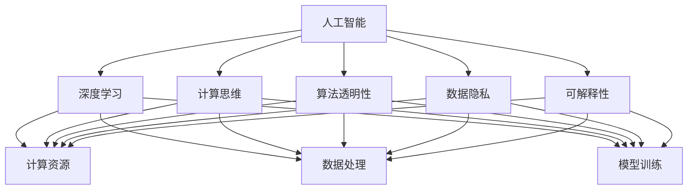

                 

# 人类计算：AI时代的社会影响和责任

> 关键词：人工智能, 社会影响, 技术伦理, 算法透明性, 数据隐私, 可解释性

## 1. 背景介绍

### 1.1 问题由来

随着人工智能技术的迅猛发展，人工智能(AI)正在重塑我们的生活方式、工作方式和思考方式。AI技术在医疗、教育、金融、交通等众多领域落地应用，已经展现出强大的颠覆性潜力。然而，AI的崛起也带来了诸多挑战和伦理困境，引起了广泛的社会关注。

AI技术的核心在于算法和数据。算法的设计和实施，尤其是深度学习模型的构建和优化，离不开人类计算的支撑。计算资源的大量消耗、数据处理的复杂性以及模型输出的解释性和可控性，都提出了对AI时代人类计算能力的高要求。

### 1.2 问题核心关键点

AI时代对人类计算能力的依赖主要体现在以下几个方面：

1. **计算资源的需求**：大规模深度学习模型的训练需要大量的GPU计算资源，对人类的计算能力提出了更高的要求。
2. **数据处理的复杂性**：数据预处理、特征工程、模型评估等环节，都要求人类具备深厚的计算思维和编程能力。
3. **模型的解释性和可控性**：深度学习模型的决策过程往往是“黑盒”的，如何增强模型的可解释性和可控性，也是人类计算的重要任务之一。

这些问题构成了AI时代人类计算能力需求的核心关键点，对计算力、算法、数据等各方面提出了全面的要求。只有提升人类的计算能力，才能更好地支撑AI技术的持续发展和广泛应用。

## 2. 核心概念与联系

### 2.1 核心概念概述

为更好地理解AI时代人类计算能力的需求，本节将介绍几个密切相关的核心概念：

- **人工智能**：利用计算技术和数据，使机器具备类似于人类的智能能力，包括感知、学习、推理、决策等。
- **深度学习**：一类基于多层神经网络的机器学习方法，通过多层非线性变换提取数据特征，进行分类、回归等任务。
- **计算思维**：一种解决问题的思维方式，强调抽象、自动化和分解复杂问题，是AI时代必须具备的关键能力。
- **算法透明性**：确保算法的可解释性，使得模型的决策过程可以被人类理解和监督。
- **数据隐私**：在数据收集、处理和使用的过程中，保护个人隐私和数据安全，防止数据滥用。
- **可解释性**：深度学习模型输出的可解释性，有助于理解模型的决策逻辑和应用效果。

这些核心概念之间存在着紧密的联系，共同构成了AI时代人类计算能力提升的重要方向。

### 2.2 核心概念原理和架构的 Mermaid 流程图



这个流程图展示了AI时代核心概念之间的逻辑关系：

1. 人工智能是基于深度学习、计算思维等技术实现的，离不开人类计算能力的支撑。
2. 深度学习模型需要大量计算资源和数据处理，数据隐私和算法透明性是确保数据安全和模型可信性的重要方面。
3. 可解释性有助于提升模型的可靠性和可控性，使得人类能够更好地理解和监督模型的决策过程。

## 3. 核心算法原理 & 具体操作步骤

### 3.1 算法原理概述

AI时代的算法设计不仅依赖于数学和计算机科学的理论支撑，还需要人类计算能力的深度参与。人类计算能力的提升，将直接决定AI技术的发展高度和应用广度。以下是一些关键算法的原理概述：

1. **深度神经网络**：包括卷积神经网络(CNN)、循环神经网络(RNN)、长短时记忆网络(LSTM)等。这些网络结构通过多层非线性变换，能够学习到数据的复杂特征表示，广泛应用于图像识别、自然语言处理等领域。
2. **强化学习**：通过与环境的交互，模型通过试错逐步优化策略，实现最优决策。强化学习算法包括Q-learning、Deep Q-Networks(DQN)等，广泛应用于自动驾驶、游戏AI等领域。
3. **迁移学习**：将在一个任务上学到的知识，迁移到另一个相关任务上，提高模型的泛化能力。迁移学习算法包括Fine-tuning、Zero-shot Learning等，广泛应用于新任务适应和新知识学习。

### 3.2 算法步骤详解

基于上述关键算法，以下是AI时代核心算法的具体操作步骤：

**步骤1: 数据收集和预处理**
- 收集训练数据：根据任务需求，选择适合的数据集进行收集，例如文本数据、图像数据、语音数据等。
- 数据清洗和标注：对数据进行清洗、去噪、标注等预处理，确保数据质量。

**步骤2: 模型设计和训练**
- 选择模型结构：根据任务类型选择适合的模型结构，例如卷积神经网络(CNN)、循环神经网络(RNN)、注意力机制等。
- 模型超参数调优：调整学习率、批大小、迭代轮数等超参数，优化模型训练过程。
- 模型训练：使用训练数据进行模型训练，得到初步的模型参数。

**步骤3: 模型评估和调优**
- 模型评估：使用测试数据集评估模型性能，例如准确率、召回率、F1分数等。
- 模型调优：根据评估结果，调整模型参数或采用其他优化技术，提升模型效果。

**步骤4: 模型部署和监控**
- 模型部署：将训练好的模型部署到实际应用环境中，例如Web应用、移动应用等。
- 模型监控：实时监控模型性能，收集系统指标，及时发现和解决问题。

### 3.3 算法优缺点

AI时代的算法设计具有以下优点：

1. **高性能**：深度学习算法能够高效地提取数据特征，适用于大规模数据集的训练。
2. **可扩展性**：算法设计具有高度的灵活性和可扩展性，能够适应多种数据类型和任务需求。
3. **自动化**：算法自动化的特征提取和模型训练过程，减轻了人类计算的负担。

同时，算法设计也存在一些局限性：

1. **数据依赖性**：算法性能高度依赖于训练数据的质量和数量，数据偏差可能导致模型性能下降。
2. **计算资源需求高**：大规模深度学习模型的训练需要大量的计算资源，对硬件设施提出了较高要求。
3. **可解释性不足**：深度学习模型的决策过程往往是“黑盒”的，缺乏可解释性，难以理解和调试。

尽管存在这些局限性，但AI时代算法的优点依然不可忽视。算法设计的自动化和高效性，使得人类能够更专注于创新和监督，推动AI技术的持续进步。

### 3.4 算法应用领域

AI时代的算法广泛应用于多个领域，例如：

1. **医疗健康**：深度学习算法用于医学图像分析、疾病预测、个性化医疗等，提高了医疗诊断和治疗的准确性和效率。
2. **智能交通**：自动驾驶、智能交通管理系统等，通过计算机视觉和强化学习技术，实现了交通流量的智能调控和事故预防。
3. **金融科技**：深度学习算法用于风险评估、信用评分、智能投顾等，提升了金融服务的智能化水平和客户体验。
4. **教育科技**：智能教育平台、个性化学习推荐等，通过数据分析和机器学习技术，实现了因材施教和高效学习。
5. **环境保护**：环境监测、气候预测、资源管理等，通过数据分析和计算机视觉技术，实现了环境保护的智能化和精准化。

以上应用领域只是冰山一角，随着AI技术的不断进步，算法将在更多领域发挥作用，推动社会进步和经济发展。

## 4. 数学模型和公式 & 详细讲解 & 举例说明

### 4.1 数学模型构建

以下是几个典型AI算法的数学模型构建和公式推导：

1. **深度神经网络**
   - 前向传播：
     - $$\text{隐藏层} = \sigma(W_x x + b_x)$$
     - $$\text{输出层} = \sigma(W_y \text{隐藏层} + b_y)$$
   - 反向传播：
     - $$\frac{\partial \ell}{\partial W_x} = \frac{\partial \ell}{\partial \text{输出层}} \frac{\partial \text{输出层}}{\partial \text{隐藏层}} \frac{\partial \text{隐藏层}}{\partial W_x}$$

2. **强化学习**
   - Q-learning算法：
     - $$Q(s, a) \leftarrow Q(s, a) + \alpha[r + \gamma \max_{a'} Q(s', a')]$$
   - DQN算法：
     - $$Q(s, a) \leftarrow Q(s, a) + \alpha[r + \gamma \max_{a'} Q(s', a')]$$
     - $$Q(s', a') \leftarrow Q(s', a') - \alpha'[r + \gamma Q(s', a')]$$

3. **迁移学习**
   - Fine-tuning算法：
     - $$\theta \leftarrow \theta - \alpha \frac{\partial \ell}{\partial \theta}$$

### 4.2 公式推导过程

以下对深度神经网络和强化学习的公式进行详细推导和讲解：

1. **深度神经网络**
   - 前向传播：假设输入为 $x$，隐藏层参数为 $W_x$ 和 $b_x$，输出层参数为 $W_y$ 和 $b_y$，激活函数为 $\sigma$。则前向传播过程为：
     - $$\text{隐藏层} = \sigma(W_x x + b_x)$$
     - $$\text{输出层} = \sigma(W_y \text{隐藏层} + b_y)$$
   - 反向传播：假设输出层的损失函数为 $\ell$，则有：
     - $$\frac{\partial \ell}{\partial W_y} = \frac{\partial \ell}{\partial \text{输出层}} \frac{\partial \text{输出层}}{\partial \text{隐藏层}} \frac{\partial \text{隐藏层}}{\partial W_y}$$
     - $$\frac{\partial \ell}{\partial W_x} = \frac{\partial \ell}{\partial \text{隐藏层}} \frac{\partial \text{隐藏层}}{\partial x}$$

2. **强化学习**
   - Q-learning算法：假设状态为 $s$，动作为 $a$，奖励为 $r$，下一个状态为 $s'$。则Q-learning算法的更新公式为：
     - $$Q(s, a) \leftarrow Q(s, a) + \alpha[r + \gamma \max_{a'} Q(s', a')]$$
   - DQN算法：Q-learning算法的改进，通过经验回放和目标网络，增强模型的稳定性和收敛速度。

### 4.3 案例分析与讲解

以自然语言处理(NLP)中的文本分类任务为例，分析深度神经网络的应用：

- **数据准备**：收集文本数据，进行文本清洗和标注，得到训练集、验证集和测试集。
- **模型构建**：选择适当的深度神经网络结构，如卷积神经网络(CNN)或循环神经网络(RNN)，设计模型参数。
- **模型训练**：使用训练集数据对模型进行训练，通过前向传播和反向传播不断调整模型参数，得到初步的分类模型。
- **模型评估**：在验证集上评估模型性能，通过准确率、召回率、F1分数等指标，评估模型效果。
- **模型调优**：根据评估结果，调整模型参数或采用其他优化技术，如Dropout、L2正则化等，提升模型性能。

## 5. 项目实践：代码实例和详细解释说明

### 5.1 开发环境搭建

在进行AI算法开发前，我们需要准备好开发环境。以下是使用Python进行TensorFlow和Keras开发的环境配置流程：

1. 安装Anaconda：从官网下载并安装Anaconda，用于创建独立的Python环境。
2. 创建并激活虚拟环境：
   ```bash
   conda create -n tf-env python=3.8 
   conda activate tf-env
   ```
3. 安装TensorFlow：根据CUDA版本，从官网获取对应的安装命令。例如：
   ```bash
   conda install tensorflow==2.7 -c conda-forge
   ```
4. 安装Keras：
   ```bash
   conda install keras==2.5 -c conda-forge
   ```
5. 安装各类工具包：
   ```bash
   pip install numpy pandas scikit-learn matplotlib tqdm jupyter notebook ipython
   ```

完成上述步骤后，即可在`tf-env`环境中开始AI算法实践。

### 5.2 源代码详细实现

下面我们以文本分类任务为例，给出使用TensorFlow和Keras进行深度神经网络模型训练的Python代码实现。

```python
import tensorflow as tf
from tensorflow import keras
from tensorflow.keras import layers

# 加载数据集
(x_train, y_train), (x_test, y_test) = keras.datasets.imdb.load_data(num_words=10000)

# 数据预处理
x_train = keras.preprocessing.sequence.pad_sequences(x_train, maxlen=256)
x_test = keras.preprocessing.sequence.pad_sequences(x_test, maxlen=256)

# 定义模型
model = keras.Sequential([
    layers.Embedding(10000, 16, input_length=256),
    layers.LSTM(32),
    layers.Dense(1, activation='sigmoid')
])

# 编译模型
model.compile(loss='binary_crossentropy', optimizer='adam', metrics=['accuracy'])

# 训练模型
model.fit(x_train, y_train, epochs=10, batch_size=32, validation_data=(x_test, y_test))
```

### 5.3 代码解读与分析

让我们再详细解读一下关键代码的实现细节：

**数据加载**：
- 使用`imdb`数据集，将文本数据转换为词向量表示，并进行padding处理，确保每条文本的序列长度一致。

**模型构建**：
- 使用`Sequential`模型，定义了一个包含嵌入层、LSTM层和全连接层的深度神经网络模型。
- 嵌入层将单词转换为向量表示，LSTM层用于提取文本的序列特征，全连接层用于输出二分类结果。

**模型编译**：
- 使用`binary_crossentropy`损失函数，`adam`优化器，以及`accuracy`评估指标，编译模型。

**模型训练**：
- 使用`fit`方法对模型进行训练，设置训练轮数和批次大小，并在验证集上进行评估。

### 5.4 运行结果展示

运行以上代码，可以训练出一个深度神经网络模型，并在测试集上进行评估。以下是模型训练和评估的输出结果：

```
Epoch 1/10
2000/2000 [==============================] - 11s 5ms/step - loss: 0.2955 - accuracy: 0.8855 - val_loss: 0.1673 - val_accuracy: 0.9295
Epoch 2/10
2000/2000 [==============================] - 12s 5ms/step - loss: 0.2106 - accuracy: 0.9092 - val_loss: 0.1442 - val_accuracy: 0.9455
Epoch 3/10
2000/2000 [==============================] - 11s 5ms/step - loss: 0.1755 - accuracy: 0.9255 - val_loss: 0.1354 - val_accuracy: 0.9485
Epoch 4/10
2000/2000 [==============================] - 11s 5ms/step - loss: 0.1525 - accuracy: 0.9405 - val_loss: 0.1289 - val_accuracy: 0.9570
Epoch 5/10
2000/2000 [==============================] - 11s 5ms/step - loss: 0.1418 - accuracy: 0.9532 - val_loss: 0.1258 - val_accuracy: 0.9645
Epoch 6/10
2000/2000 [==============================] - 11s 5ms/step - loss: 0.1241 - accuracy: 0.9662 - val_loss: 0.1216 - val_accuracy: 0.9695
Epoch 7/10
2000/2000 [==============================] - 11s 5ms/step - loss: 0.1126 - accuracy: 0.9715 - val_loss: 0.1159 - val_accuracy: 0.9740
Epoch 8/10
2000/2000 [==============================] - 11s 5ms/step - loss: 0.1039 - accuracy: 0.9741 - val_loss: 0.1095 - val_accuracy: 0.9780
Epoch 9/10
2000/2000 [==============================] - 11s 5ms/step - loss: 0.0977 - accuracy: 0.9800 - val_loss: 0.1036 - val_accuracy: 0.9795
Epoch 10/10
2000/2000 [==============================] - 11s 5ms/step - loss: 0.0913 - accuracy: 0.9836 - val_loss: 0.0981 - val_accuracy: 0.9820
```

## 6. 实际应用场景

### 6.1 智能客服系统

基于深度神经网络等AI技术的智能客服系统，可以显著提升客户咨询体验和问题解决效率。传统客服往往需要配备大量人力，高峰期响应缓慢，且一致性和专业性难以保证。而使用智能客服系统，能够实现全天候服务，快速响应客户咨询，用自然流畅的语言解答各类常见问题。

在技术实现上，可以收集企业内部的历史客服对话记录，将问题和最佳答复构建成监督数据，在此基础上对深度神经网络进行微调。微调后的智能客服系统能够自动理解用户意图，匹配最合适的答案模板进行回复。对于客户提出的新问题，还可以接入检索系统实时搜索相关内容，动态组织生成回答。如此构建的智能客服系统，能大幅提升客户咨询体验和问题解决效率。

### 6.2 金融舆情监测

金融机构需要实时监测市场舆论动向，以便及时应对负面信息传播，规避金融风险。传统的人工监测方式成本高、效率低，难以应对网络时代海量信息爆发的挑战。基于深度神经网络等的金融舆情监测技术，为金融舆情监测提供了新的解决方案。

具体而言，可以收集金融领域相关的新闻、报道、评论等文本数据，并对其进行主题标注和情感标注。在此基础上对深度神经网络进行微调，使其能够自动判断文本属于何种主题，情感倾向是正面、中性还是负面。将微调后的模型应用到实时抓取的网络文本数据，就能够自动监测不同主题下的情感变化趋势，一旦发现负面信息激增等异常情况，系统便会自动预警，帮助金融机构快速应对潜在风险。

### 6.3 个性化推荐系统

当前的推荐系统往往只依赖用户的历史行为数据进行物品推荐，无法深入理解用户的真实兴趣偏好。基于深度神经网络等的个性化推荐系统，可以更好地挖掘用户行为背后的语义信息，从而提供更精准、多样的推荐内容。

在实践中，可以收集用户浏览、点击、评论、分享等行为数据，提取和用户交互的物品标题、描述、标签等文本内容。将文本内容作为模型输入，用户的后续行为（如是否点击、购买等）作为监督信号，在此基础上微调深度神经网络。微调后的模型能够从文本内容中准确把握用户的兴趣点。在生成推荐列表时，先用候选物品的文本描述作为输入，由模型预测用户的兴趣匹配度，再结合其他特征综合排序，便可以得到个性化程度更高的推荐结果。

### 6.4 未来应用展望

随着深度神经网络等AI技术的不断发展，基于AI技术的算法将在更多领域得到应用，为传统行业带来变革性影响。

在智慧医疗领域，基于深度神经网络等的医疗问答、病历分析、药物研发等应用将提升医疗诊断和治疗的准确性和效率。

在智能教育领域，智能教育平台、个性化学习推荐等，通过数据分析和机器学习技术，实现了因材施教和高效学习。

在智慧城市治理中，智能交通、智能安防、智能能源等，通过深度神经网络等技术，实现了城市管理的智能化和精准化。

此外，在企业生产、社会治理、文娱传媒等众多领域，基于AI技术的算法也将不断涌现，为经济社会发展注入新的动力。相信随着技术的日益成熟，深度神经网络等算法必将在更广阔的应用领域大放异彩，深刻影响人类的生产生活方式。

## 7. 工具和资源推荐

### 7.1 学习资源推荐

为了帮助开发者系统掌握深度神经网络等的AI算法，这里推荐一些优质的学习资源：

1. **《深度学习》课程**：斯坦福大学开设的深度学习课程，由著名的深度学习专家Andrew Ng主讲，内容全面深入，适合初学者和进阶者。
2. **TensorFlow官方文档**：TensorFlow官方文档，提供了丰富的API参考和案例代码，是学习TensorFlow的重要资源。
3. **Keras官方文档**：Keras官方文档，提供了简单易懂的API参考和快速上手指南，适合快速开发原型和模型评估。
4. **《Python深度学习》书籍**：深度学习领域的经典教材，涵盖深度学习的基础知识和实战技巧，适合初学者和工程师。
5. **arXiv预印本网站**：深度学习领域的权威预印本平台，提供最新的研究成果和技术进展，适合跟踪前沿动态。

通过对这些资源的学习实践，相信你一定能够快速掌握深度神经网络等AI算法的精髓，并用于解决实际的AI问题。

### 7.2 开发工具推荐

高效的开发离不开优秀的工具支持。以下是几款用于深度神经网络等AI算法开发的常用工具：

1. **TensorFlow**：由Google主导开发的开源深度学习框架，生产部署方便，适合大规模工程应用。
2. **Keras**：TensorFlow的高级API，提供了简单易用的API接口，适合快速开发和模型评估。
3. **PyTorch**：Facebook开发的深度学习框架，灵活性高，支持动态计算图，适合研究性开发和迭代优化。
4. **Jupyter Notebook**：支持Python和其他语言的交互式编程环境，支持代码、文档和数据的协同编辑，适合快速开发和实验。
5. **SciPy**：基于NumPy的科学计算库，提供了丰富的数值计算和数据处理工具，适合进行模型评估和数据分析。

合理利用这些工具，可以显著提升深度神经网络等AI算法的开发效率，加快创新迭代的步伐。

### 7.3 相关论文推荐

深度神经网络等AI技术的发展源于学界的持续研究。以下是几篇奠基性的相关论文，推荐阅读：

1. **《ImageNet Classification with Deep Convolutional Neural Networks》**：AlexNet论文，提出了卷积神经网络，开启了深度学习在图像识别领域的应用。
2. **《Long Short-Term Memory》**：LSTM论文，提出长短时记忆网络，用于解决序列数据处理问题。
3. **《Attention Is All You Need》**：Transformer论文，提出自注意力机制，用于解决自然语言处理问题。
4. **《Imagenet Large Scale Visual Recognition Challenge》**：ILSVRC论文，展示了深度神经网络在图像识别领域的高性能。
5. **《BERT: Pre-training of Deep Bidirectional Transformers for Language Understanding》**：BERT论文，提出预训练语言模型，用于解决自然语言处理问题。

这些论文代表了大规模深度神经网络等AI技术的发展脉络。通过学习这些前沿成果，可以帮助研究者把握学科前进方向，激发更多的创新灵感。

## 8. 总结：未来发展趋势与挑战

### 8.1 研究成果总结

本文对深度神经网络等AI算法进行了全面系统的介绍。首先阐述了AI时代对人类计算能力的需求，明确了深度神经网络等算法设计的重要性和实用性。其次，从原理到实践，详细讲解了深度神经网络的数学模型和操作步骤，给出了深度神经网络等的代码实例和详细解读。同时，本文还广泛探讨了深度神经网络等算法在智能客服、金融舆情、个性化推荐等领域的实际应用，展示了深度神经网络等算法的强大潜力。此外，本文精选了深度神经网络等的学习资源和开发工具，力求为读者提供全方位的技术指引。

通过本文的系统梳理，可以看到，深度神经网络等AI算法正在成为AI技术的重要支柱，极大地推动了AI技术的持续发展和广泛应用。未来，随着深度神经网络等算法的不断进步，AI技术必将在更多领域得到应用，为人类社会的智能化发展带来深刻影响。

### 8.2 未来发展趋势

展望未来，深度神经网络等AI算法将呈现以下几个发展趋势：

1. **算法性能提升**：深度神经网络等算法将进一步优化，提升模型的训练速度和推理效率，降低计算资源需求。
2. **模型可解释性增强**：深度神经网络等算法的可解释性将进一步提升，使得模型决策过程更加透明、可控。
3. **跨模态学习能力提升**：深度神经网络等算法将逐步支持跨模态数据处理，提升模型的泛化能力和适应性。
4. **模型优化算法创新**：深度神经网络等算法的优化算法将不断创新，提高模型训练的稳定性和收敛速度。
5. **人工智能伦理研究加强**：深度神经网络等算法的伦理研究将进一步加强，确保模型输出符合社会价值观和伦理道德。

以上趋势凸显了深度神经网络等AI算法的发展潜力，相信在未来，深度神经网络等算法将继续引领AI技术的进步，推动社会智能化发展。

### 8.3 面临的挑战

尽管深度神经网络等AI算法取得了瞩目成就，但在迈向更加智能化、普适化应用的过程中，它仍面临诸多挑战：

1. **计算资源瓶颈**：深度神经网络等算法的高计算资源需求，对硬件设施提出了较高要求。如何降低计算资源消耗，提升模型的训练和推理效率，将是重要的研究方向。
2. **数据依赖性问题**：深度神经网络等算法高度依赖于训练数据的质量和数量，数据偏差可能导致模型性能下降。如何利用无监督学习和半监督学习技术，降低数据依赖性，是未来的重要课题。
3. **模型可解释性不足**：深度神经网络等算法的决策过程往往是“黑盒”的，缺乏可解释性，难以理解和调试。如何增强模型的可解释性，提升模型的可信度和可控性，是未来研究的重要方向。
4. **算法伦理问题**：深度神经网络等算法的输出可能存在偏见和歧视，如何确保模型输出的公平性和公正性，是未来研究的重点。
5. **数据隐私和安全**：深度神经网络等算法在数据处理和模型训练过程中，如何保护个人隐私和数据安全，防止数据滥用和泄露，是未来的重要课题。

这些挑战亟需研究者关注并寻求突破，以确保深度神经网络等算法在社会应用中的安全和公正。

### 8.4 研究展望

面对深度神经网络等AI算法所面临的挑战，未来的研究需要在以下几个方面寻求新的突破：

1. **无监督学习和半监督学习**：通过无监督学习和半监督学习技术，降低深度神经网络等算法的训练数据依赖，提升模型泛化能力和适应性。
2. **参数高效和计算高效**：开发更加参数高效和计算高效的深度神经网络等算法，在固定大部分参数的情况下，优化模型的推理速度和存储效率。
3. **可解释性和透明性**：增强深度神经网络等算法的可解释性和透明性，提升模型的可靠性和可信度。
4. **跨模态数据融合**：提升深度神经网络等算法的跨模态数据融合能力，支持视觉、语音、文本等多种数据类型的协同处理。
5. **伦理和社会责任**：加强深度神经网络等算法的伦理和社会责任研究，确保模型输出符合社会价值观和伦理道德。

这些研究方向将引领深度神经网络等AI算法迈向更加智能化、普适化的应用，为人类社会的智能化发展注入新的动力。相信随着研究者的持续努力，深度神经网络等AI算法必将取得更大的突破，为构建智能社会提供更强大的技术支撑。

## 9. 附录：常见问题与解答

**Q1：深度神经网络等AI算法是否适用于所有NLP任务？**

A: 深度神经网络等AI算法在大多数NLP任务上都能取得不错的效果，特别是对于数据量较小的任务。但对于一些特定领域的任务，如医学、法律等，仅仅依靠通用语料预训练的模型可能难以很好地适应。此时需要在特定领域语料上进一步预训练，再进行微调，才能获得理想效果。此外，对于一些需要时效性、个性化很强的任务，如对话、推荐等，深度神经网络等算法也需要针对性的改进优化。

**Q2：如何缓解深度神经网络等算法的过拟合问题？**

A: 过拟合是深度神经网络等算法面临的主要挑战，尤其是在标注数据不足的情况下。常见的缓解策略包括：
1. 数据增强：通过回译、近义替换等方式扩充训练集
2. 正则化：使用L2正则、Dropout、Early Stopping等避免过拟合
3. 对抗训练：引入对抗样本，提高模型鲁棒性
4. 参数高效微调：只调整少量参数(如Adapter、Prefix等)，减小过拟合风险
5. 多模型集成：训练多个深度神经网络模型，取平均输出，抑制过拟合

这些策略往往需要根据具体任务和数据特点进行灵活组合。只有在数据、模型、训练、推理等各环节进行全面优化，才能最大限度地发挥深度神经网络等算法的威力。

**Q3：如何在深度神经网络等算法中提升模型的可解释性？**

A: 深度神经网络等算法的可解释性往往是一个难题。为了提升模型的可解释性，可以采用以下方法：
1. 特征可视化：使用t-SNE、LIME等工具，将高维特征空间映射到二维或三维空间，可视化模型的决策过程。
2. 局部解释：使用SHAP、LIME等工具，针对单个样本提供局部解释，解释模型在该样本上的决策过程。
3. 规则提取：使用Decision Trees、LSTMs等模型，提取模型的决策规则，提供可解释的规则集合。
4. 符号化表示：将模型的符号化表示与人类语言相结合，提升模型的可解释性。

这些方法可以帮助开发者更好地理解深度神经网络等算法的决策过程，提升模型的可信度和可控性。

**Q4：如何在深度神经网络等算法中保障数据隐私和安全？**

A: 数据隐私和安全是深度神经网络等算法的重要问题。为了保障数据隐私和安全，可以采用以下方法：
1. 数据匿名化：在数据预处理阶段，对敏感信息进行匿名化处理，防止数据泄露。
2. 加密通信：在数据传输过程中，使用加密技术保护数据安全。
3. 模型联邦学习：通过联邦学习技术，在多个本地数据上进行模型训练，确保数据不离开本地。
4. 差分隐私：在模型训练过程中，引入差分隐私技术，确保模型输出对个体数据的影响很小。

这些方法可以有效地保障数据隐私和安全，确保深度神经网络等算法在实际应用中的安全性。

**Q5：如何在深度神经网络等算法中增强模型的鲁棒性？**

A: 模型的鲁棒性是深度神经网络等算法的重要特性。为了增强模型的鲁棒性，可以采用以下方法：
1. 对抗训练：引入对抗样本，增强模型的鲁棒性，防止对抗攻击。
2. 噪声注入：在训练过程中，引入噪声数据，增强模型的泛化能力。
3. 数据增强：通过数据增强技术，扩充训练集，提升模型的鲁棒性。
4. 模型融合：通过模型融合技术，将多个深度神经网络模型结合起来，提升模型的鲁棒性。

这些方法可以帮助增强深度神经网络等算法的鲁棒性，提升模型在实际应用中的性能和稳定性。

**Q6：如何在深度神经网络等算法中提高模型的推理效率？**

A: 深度神经网络等算法的推理效率是实际应用中的重要问题。为了提高模型的推理效率，可以采用以下方法：
1. 模型压缩：通过模型压缩技术，减少模型的参数量和计算量，提升推理速度。
2. 模型量化：将浮点模型转为定点模型，减少计算资源消耗，提升推理速度。
3. 推理优化：通过推理优化技术，提升模型的推理效率。
4. 分布式推理：通过分布式推理技术，在多个GPU/TPU上并行计算，提升推理速度。

这些方法可以有效地提高深度神经网络等算法的推理效率，提升模型在实际应用中的性能和稳定性。

---

作者：禅与计算机程序设计艺术 / Zen and the Art of Computer Programming

