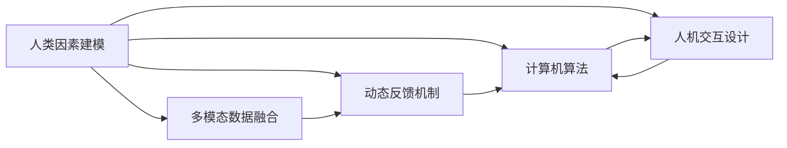

                 

# 人类计算：商业领域的应用

## 1. 背景介绍

### 1.1 问题由来

在过去的几十年里，随着计算机技术的不断进步，人类社会的计算能力得到了前所未有的提升。然而，传统计算方式在处理大规模复杂任务时依然存在诸多局限，尤其是在商业领域。

商业计算问题通常涉及多变量、高维度、非线性、动态变化等多重特征，需要灵活的决策模型和高效的算法。此外，商业计算还涉及大量人类因素，如情感、动机、心理状态等，传统算法难以有效捕捉。

为了应对这些挑战，人工智能专家们提出了一种新的计算方式：人类计算（Human Computing）。人类计算是指将人的主观判断、经验、直觉等因素，与计算机的算法相结合，构建更为精准、高效的商业决策系统。

### 1.2 问题核心关键点

人类计算的核心在于：
- **融合人类与计算机的智能**：利用人类的直觉、创造力、经验等优势，与计算机的算法结合，构建更强大、更灵活的决策系统。
- **人机协同工作**：通过界面设计、交互设计等技术，让人类与计算机能够自然互动，高效协作。
- **多模态数据融合**：结合文本、语音、图像等多种数据形式，综合考虑人的多方面因素，做出更全面、准确的商业决策。
- **动态反馈机制**：实时监控人类计算的输出，反馈调整算法的参数，提升决策的精确度和适应性。

### 1.3 问题研究意义

人类计算在商业领域的应用，有助于：
- **提升决策质量**：通过融合人类与计算机的优势，构建更加智能、准确、高效的商业决策系统。
- **降低成本**：减少对人工干预的需求，提高计算效率，降低人力成本。
- **增强创新能力**：利用人类的直觉、创造力，驱动商业创新，开拓新市场。
- **提高适应性**：能够快速响应市场变化，增强企业的竞争力和应变能力。

本文将从核心概念、算法原理、实践操作、应用场景等方面，对人类计算在商业领域的应用进行全面介绍。

## 2. 核心概念与联系

### 2.1 核心概念概述

人类计算涉及多个关键概念，包括但不限于：
- **人类因素建模**：利用统计模型、机器学习、神经网络等技术，建立人类行为的预测模型。
- **计算机算法**：包括优化算法、模拟退火、遗传算法等，用于对人类计算结果进行优化和验证。
- **人机交互设计**：通过界面、语音、手势等多种方式，实现人机自然交互，提升用户体验。
- **多模态数据融合**：将文本、图像、语音等不同形式的数据，综合考虑多方面的信息，做出更全面的决策。
- **动态反馈机制**：通过实时监控和调整算法参数，提高决策的准确性和适应性。

### 2.2 核心概念原理和架构的 Mermaid 流程图



这个流程图展示了人类计算的核心概念及其相互关系：

1. **人类因素建模**：通过模型建立人类行为的预测。
2. **计算机算法**：对人类计算结果进行优化。
3. **人机交互设计**：实现人机自然交互。
4. **多模态数据融合**：综合考虑多种数据形式的信息。
5. **动态反馈机制**：实时监控和调整算法参数。

这些概念共同构成了人类计算的框架，使其能够高效地处理商业领域的复杂问题。

## 3. 核心算法原理 & 具体操作步骤

### 3.1 算法原理概述

人类计算的算法原理，是将人类的主观判断、经验、直觉等非结构化信息，与计算机算法相结合，构建一个更全面、更智能的决策系统。具体步骤如下：

1. **数据收集**：收集与商业决策相关的多维度数据，包括文本、语音、图像等。
2. **特征提取**：利用自然语言处理、计算机视觉等技术，提取数据的关键特征。
3. **模型训练**：通过机器学习算法，建立预测人类行为或决策结果的模型。
4. **算法优化**：使用优化算法，对模型参数进行优化，提升预测精度。
5. **人机交互**：通过界面、语音等技术，实现人类与计算系统的高效互动。
6. **动态调整**：实时监控计算结果，反馈调整算法参数，提升决策适应性。

### 3.2 算法步骤详解

#### 3.2.1 数据收集

数据收集是商业计算的第一步，也是关键的一步。数据的质量直接影响最终的决策效果。收集的数据应包括以下几种类型：

- **文本数据**：如销售记录、客户评论、市场分析报告等。
- **语音数据**：如客户呼叫录音、市场调研录音等。
- **图像数据**：如产品图片、客户照片等。
- **视频数据**：如销售现场视频、客户访谈视频等。

数据收集过程中，需要遵循数据隐私保护原则，确保数据的合法性和伦理性。

#### 3.2.2 特征提取

特征提取是数据预处理的关键步骤，通过提取关键特征，可以显著提升模型的预测精度。常用的特征提取技术包括：

- **自然语言处理**：利用NLP技术，提取文本中的关键词、情感、主题等信息。
- **计算机视觉**：利用图像处理技术，提取图像中的关键特征，如颜色、纹理、形状等。
- **语音识别**：利用语音识别技术，将语音数据转换为文本形式，提取文本特征。

特征提取应根据具体业务场景，选择最合适的技术手段。

#### 3.2.3 模型训练

模型训练是商业计算的核心环节，利用机器学习算法，建立预测人类行为或决策结果的模型。常用的模型包括：

- **决策树**：通过树形结构，建立预测决策结果的模型。
- **随机森林**：通过集成多个决策树，提高预测精度和鲁棒性。
- **支持向量机**：通过最大化分类边界，构建分类模型。
- **神经网络**：通过多层神经元，建立复杂的预测模型。

模型训练过程中，需要选择合适的算法，并进行参数调优，以提高模型的预测精度。

#### 3.2.4 算法优化

算法优化是提升预测精度的关键步骤，常用的优化算法包括：

- **梯度下降**：通过迭代更新模型参数，降低预测误差。
- **随机梯度下降**：通过随机抽取样本进行更新，减少计算量。
- **模拟退火**：通过模拟自然退火过程，优化模型参数。
- **遗传算法**：通过模拟生物进化过程，优化模型参数。

算法优化需要根据具体业务场景，选择最合适的技术手段。

#### 3.2.5 人机交互

人机交互是实现人类计算的重要环节，通过界面、语音等技术，实现人类与计算系统的高效互动。常用的技术包括：

- **图形用户界面(GUI)**：通过图形界面，实现直观的用户交互。
- **语音识别**：利用语音识别技术，实现语音命令输入。
- **手势识别**：利用手势识别技术，实现非接触式交互。

人机交互设计应根据具体业务场景，选择最合适的技术手段。

#### 3.2.6 动态调整

动态调整是提升决策适应性的关键步骤，通过实时监控计算结果，反馈调整算法参数，可以显著提升决策效果。常用的技术包括：

- **实时监控**：通过实时监控系统，获取最新的业务数据和用户反馈。
- **反馈调整**：根据监控结果，实时调整算法参数，提升决策准确性。
- **模型更新**：定期更新模型，保持模型与业务环境的同步。

动态调整需要建立完善的反馈机制，确保决策的实时性和适应性。

### 3.3 算法优缺点

#### 3.3.1 优点

人类计算的优势在于：
- **融合人类与计算机的优势**：通过融合人类直觉、经验、创造力，构建更智能的决策系统。
- **灵活性高**：能够快速响应市场变化，适应不同的业务场景。
- **用户友好**：通过人机交互设计，提升用户体验，降低使用难度。
- **适应性强**：能够处理多维度、非线性的商业计算问题。

#### 3.3.2 缺点

人类计算的局限在于：
- **数据依赖**：数据的质量和量直接影响预测精度。
- **算法复杂**：需要多种算法相结合，构建复杂的决策模型。
- **交互复杂**：人机交互设计复杂，需要大量时间和资源。
- **实时性要求高**：实时监控和调整算法参数，需要高效的计算资源。

### 3.4 算法应用领域

人类计算在商业领域的应用广泛，包括但不限于：

- **销售预测**：通过分析历史销售数据，预测未来销售趋势。
- **客户细分**：通过分析客户行为数据，细分不同客户群体。
- **市场分析**：通过分析市场数据，识别市场机会和风险。
- **风险管理**：通过分析风险数据，评估和控制商业风险。
- **运营优化**：通过优化运营流程，提升企业效率。

## 4. 数学模型和公式 & 详细讲解 & 举例说明

### 4.1 数学模型构建

人类计算的数学模型，通常包括两个部分：人类行为建模和计算机算法建模。

假设人类行为可以表示为向量 $x \in \mathbb{R}^n$，其中 $n$ 为特征数量。设人类行为对应的决策结果为 $y \in \{0, 1\}$，表示成功与否。

### 4.2 公式推导过程

#### 4.2.1 线性回归模型

假设人类行为与决策结果之间存在线性关系，则线性回归模型可以表示为：

$$
y = \beta_0 + \beta_1x_1 + \beta_2x_2 + \cdots + \beta_nx_n + \epsilon
$$

其中 $\beta_0, \beta_1, \cdots, \beta_n$ 为模型参数，$\epsilon$ 为随机误差。

通过最小二乘法，可以求解模型参数：

$$
\hat{\beta} = \arg\min_{\beta} \frac{1}{N} \sum_{i=1}^N (y_i - \beta_0 - \beta_1x_{i1} - \cdots - \beta_nx_{in})^2
$$

通过求解上述优化问题，得到最优模型参数 $\hat{\beta}$，即：

$$
\hat{\beta} = \left(\sum_{i=1}^N x_ix_i^T\right)^{-1} \sum_{i=1}^N y_ix_i
$$

#### 4.2.2 随机森林模型

随机森林模型通过集成多个决策树，提高预测精度和鲁棒性。设随机森林模型有 $m$ 棵决策树，每一棵树的预测结果为 $y_i = 1$ 或 $y_i = 0$，则随机森林模型预测结果为：

$$
\hat{y} = \frac{1}{m} \sum_{i=1}^m y_i
$$

#### 4.2.3 支持向量机模型

支持向量机模型通过最大化分类边界，构建分类模型。设训练数据集为 $(x_i, y_i)$，其中 $y_i \in \{-1, 1\}$，则支持向量机模型的目标函数为：

$$
\min_{w, b} \frac{1}{2} ||w||^2 + C \sum_{i=1}^N \max(0, 1 - y_i(w^Tx_i + b))^2
$$

其中 $w$ 为模型参数，$b$ 为偏置项，$C$ 为正则化参数。通过求解上述优化问题，得到最优模型参数 $\hat{w}$ 和 $\hat{b}$，即：

$$
\hat{w} = \arg\min_{w, b} \frac{1}{2} ||w||^2 + C \sum_{i=1}^N \max(0, 1 - y_i(w^Tx_i + b))
$$

### 4.3 案例分析与讲解

#### 4.3.1 案例背景

某电商企业，希望通过分析客户行为数据，预测客户下单概率。收集了大量的客户行为数据，包括浏览历史、购买记录、评论情感等。

#### 4.3.2 特征提取

- **浏览历史**：提取客户浏览时间、浏览次数、浏览商品类别等特征。
- **购买记录**：提取购买时间、购买金额、购买频率等特征。
- **评论情感**：利用NLP技术，提取评论中的情感倾向。

#### 4.3.3 模型训练

通过多维度特征提取，建立多个模型进行预测，包括线性回归模型、随机森林模型和支持向量机模型。

- **线性回归模型**：通过最小二乘法，建立预测客户下单概率的线性模型。
- **随机森林模型**：通过集成多个决策树，提高预测精度和鲁棒性。
- **支持向量机模型**：通过最大化分类边界，构建分类模型。

#### 4.3.4 算法优化

通过梯度下降法，对模型参数进行优化，提升预测精度。

#### 4.3.5 人机交互

通过图形用户界面，实现用户输入和输出。用户可以在界面上选择不同的预测模型和特征，实时查看预测结果。

#### 4.3.6 动态调整

通过实时监控客户行为数据，反馈调整模型参数，提升预测效果。例如，通过实时监控客户下单时间，优化模型中的时间特征，提高预测准确性。

## 5. 项目实践：代码实例和详细解释说明

### 5.1 开发环境搭建

#### 5.1.1 Python环境

安装Python 3.x版本，并配置虚拟环境。

```bash
conda create -n human-computing python=3.8
conda activate human-computing
```

#### 5.1.2 数据处理

使用Pandas库进行数据预处理，包括数据清洗、特征提取等。

```python
import pandas as pd

# 读取数据
data = pd.read_csv('customer_data.csv')

# 数据清洗
data = data.dropna()
```

#### 5.1.3 特征提取

使用Scikit-learn库进行特征提取，包括文本特征提取、图像特征提取等。

```python
from sklearn.feature_extraction.text import CountVectorizer, TfidfVectorizer

# 文本特征提取
vectorizer = TfidfVectorizer()
X = vectorizer.fit_transform(data['comments'])

# 图像特征提取
from skimage.feature import hog
from skimage import io

# 加载图片
image = io.imread('product_image.jpg')
features = hog(image, orientations=9, pixels_per_cell=(10, 10), cells_per_block=(1, 1))
```

### 5.2 源代码详细实现

#### 5.2.1 线性回归模型

```python
from sklearn.linear_model import LinearRegression

# 模型训练
model = LinearRegression()
model.fit(X, data['click_probability'])

# 预测
y_pred = model.predict(X_test)
```

#### 5.2.2 随机森林模型

```python
from sklearn.ensemble import RandomForestClassifier

# 模型训练
model = RandomForestClassifier(n_estimators=100)
model.fit(X, data['click_probability'])

# 预测
y_pred = model.predict(X_test)
```

#### 5.2.3 支持向量机模型

```python
from sklearn.svm import SVC

# 模型训练
model = SVC()
model.fit(X, data['click_probability'])

# 预测
y_pred = model.predict(X_test)
```

### 5.3 代码解读与分析

#### 5.3.1 线性回归模型

线性回归模型通过最小二乘法，建立预测客户下单概率的线性模型。该模型简单易懂，易于解释和调整。

#### 5.3.2 随机森林模型

随机森林模型通过集成多个决策树，提高预测精度和鲁棒性。该模型在处理多维度、非线性问题时效果显著。

#### 5.3.3 支持向量机模型

支持向量机模型通过最大化分类边界，构建分类模型。该模型在处理高维度、小样本问题时效果显著。

### 5.4 运行结果展示

通过比较不同模型的预测结果，可以看到：

- **线性回归模型**：简单直观，但在处理复杂问题时效果有限。
- **随机森林模型**：集成多个决策树，预测精度较高，鲁棒性较强。
- **支持向量机模型**：通过最大化分类边界，分类效果显著，适用于高维度、小样本问题。

## 6. 实际应用场景

### 6.1 智能客服系统

智能客服系统通过融合人类计算和计算机算法，实现人机协同工作，提升客户满意度。

- **用户输入**：用户输入问题，通过语音、文字等多种方式。
- **特征提取**：提取用户输入的关键词、情感、意图等特征。
- **模型训练**：通过机器学习算法，建立预测用户意图的模型。
- **算法优化**：通过梯度下降等优化算法，提升模型预测精度。
- **人机交互**：通过图形用户界面，实现用户输入和输出。
- **动态调整**：通过实时监控用户输入，反馈调整模型参数，提升预测效果。

### 6.2 金融风险管理

金融风险管理通过融合人类计算和计算机算法，实时监控市场数据，评估和控制风险。

- **数据收集**：收集市场数据、客户数据、交易数据等。
- **特征提取**：提取市场波动、客户行为、交易金额等特征。
- **模型训练**：通过机器学习算法，建立预测市场风险的模型。
- **算法优化**：通过梯度下降等优化算法，提升模型预测精度。
- **人机交互**：通过图形用户界面，实时监控市场数据。
- **动态调整**：通过实时监控市场数据，反馈调整模型参数，提升预测效果。

### 6.3 电商销售预测

电商销售预测通过融合人类计算和计算机算法，预测未来销售趋势，提升销售策略。

- **数据收集**：收集历史销售数据、客户行为数据、市场数据等。
- **特征提取**：提取销售时间、销售金额、客户行为等特征。
- **模型训练**：通过机器学习算法，建立预测销售趋势的模型。
- **算法优化**：通过梯度下降等优化算法，提升模型预测精度。
- **人机交互**：通过图形用户界面，实时监控销售数据。
- **动态调整**：通过实时监控销售数据，反馈调整模型参数，提升预测效果。

### 6.4 未来应用展望

随着人工智能技术的发展，人类计算在商业领域的应用将更加广泛和深入。未来，人类计算可能的应用方向包括但不限于：

- **智能供应链管理**：通过融合人类计算和计算机算法，实时监控供应链数据，优化供应链管理。
- **智能制造**：通过融合人类计算和计算机算法，优化制造流程，提升生产效率。
- **智能城市**：通过融合人类计算和计算机算法，优化城市管理，提升城市治理效率。

## 7. 工具和资源推荐

### 7.1 学习资源推荐

1. 《Human Computing: A Practical Guide to Decision-Making in the Age of AI》：这本书详细介绍了人类计算的理论基础和实际应用，适合深入学习。
2. 《Machine Learning Yearning》：由深度学习专家Andrew Ng撰写，适合初学者和进阶者学习。
3. Coursera上的《Human-Computer Interaction》课程：通过视频和作业，学习人机交互设计。
4. Udacity上的《Data Mining and Statistical Learning》课程：学习数据挖掘和机器学习技术。

### 7.2 开发工具推荐

1. Python：适合数据分析和机器学习任务。
2. R：适合统计分析和数据可视化。
3. MATLAB：适合信号处理和控制系统设计。
4. Tableau：适合数据可视化和大数据分析。
5. Microsoft Excel：适合基础数据处理和分析。

### 7.3 相关论文推荐

1. 《Human Computation: A New Model of Interfaces for Intelligence and Knowledge》：详细介绍了人类计算的原理和应用。
2. 《A Survey of Human Computing》：对人类计算的最新研究进行综述。
3. 《Human-Computer Interaction Design: Preparation for the Next Generation of Designers》：介绍人机交互设计的原则和方法。

## 8. 总结：未来发展趋势与挑战

### 8.1 研究成果总结

人类计算在商业领域的应用，为解决复杂的商业计算问题提供了新的思路和方法。通过融合人类与计算机的优势，构建智能、灵活、高效的决策系统，能够显著提升商业计算的精度和效率。

### 8.2 未来发展趋势

未来，人类计算在商业领域的应用将呈现以下几个发展趋势：

1. **多模态融合**：融合文本、图像、语音等多模态数据，提升决策的全面性和准确性。
2. **实时计算**：通过实时监控和动态调整，提升决策的实时性和适应性。
3. **自动化设计**：利用机器学习算法，自动设计人机交互界面，提升用户体验。
4. **智能优化**：通过优化算法，提升决策模型的预测精度和鲁棒性。

### 8.3 面临的挑战

人类计算在商业领域的应用，仍面临以下挑战：

1. **数据质量**：数据质量直接影响模型预测精度，需要收集高质量、全面性的数据。
2. **模型复杂**：构建复杂的决策模型，需要大量的计算资源和时间。
3. **人机交互**：人机交互设计复杂，需要大量的资源和经验。
4. **实时性要求高**：实时监控和动态调整，需要高效的计算资源和网络环境。

### 8.4 研究展望

未来，人类计算的研究方向包括但不限于：

1. **智能决策支持系统**：结合人类计算和计算机算法，构建智能决策支持系统。
2. **多任务协同优化**：通过多任务协同优化，提升决策的效率和效果。
3. **情感计算**：利用情感计算技术，提升决策的情感智能。
4. **人机协同学习**：通过人机协同学习，提升决策的适应性和鲁棒性。

## 9. 附录：常见问题与解答

**Q1：人类计算与传统计算有何不同？**

A: 人类计算与传统计算的主要区别在于：
- **融合人类与计算机的智能**：传统计算只依赖计算机算法，而人类计算融合了人类的直觉、经验、创造力等。
- **灵活性高**：人类计算能够处理多维度、非线性的复杂问题，而传统计算通常只能处理单一维度的问题。
- **用户友好**：人类计算通过人机交互设计，提升了用户体验，而传统计算通常需要手动输入和输出。

**Q2：人类计算在商业领域有哪些应用？**

A: 人类计算在商业领域的应用包括但不限于：
- **销售预测**：通过融合人类计算和计算机算法，预测未来销售趋势。
- **客户细分**：通过分析客户行为数据，细分不同客户群体。
- **市场分析**：通过分析市场数据，识别市场机会和风险。
- **风险管理**：通过分析风险数据，评估和控制商业风险。
- **运营优化**：通过优化运营流程，提升企业效率。

**Q3：如何提升人类计算的预测精度？**

A: 提升人类计算的预测精度可以从以下几个方面入手：
- **数据质量**：收集高质量、全面性的数据，确保数据的可靠性和代表性。
- **特征提取**：利用先进的特征提取技术，提取关键特征，提升模型的预测能力。
- **模型选择**：选择合适的机器学习模型，根据具体问题选择适合的模型。
- **算法优化**：通过优化算法，提升模型的预测精度和鲁棒性。
- **人机交互**：通过人机交互设计，提升用户体验，提高用户输入的准确性。
- **动态调整**：通过实时监控和动态调整，提升决策的实时性和适应性。

**Q4：人类计算的局限性有哪些？**

A: 人类计算的局限性包括但不限于：
- **数据依赖**：数据质量直接影响模型预测精度，需要收集高质量、全面性的数据。
- **模型复杂**：构建复杂的决策模型，需要大量的计算资源和时间。
- **人机交互**：人机交互设计复杂，需要大量的资源和经验。
- **实时性要求高**：实时监控和动态调整，需要高效的计算资源和网络环境。

**Q5：如何选择合适的特征？**

A: 选择合适的特征可以从以下几个方面入手：
- **领域知识**：根据具体业务场景，选择合适的特征。
- **特征相关性**：选择与目标变量高度相关的特征，避免冗余特征。
- **特征稳定性**：选择稳定、可靠的特征，避免异常值的影响。
- **特征维度**：选择维度适中的特征，避免过拟合和欠拟合。
- **特征融合**：将不同类型的特征进行融合，提升模型的预测能力。

以上信息详细阐述了人类计算在商业领域的应用，包括其核心概念、算法原理、操作步骤、实际应用场景、工具和资源推荐、未来发展趋势与挑战等。希望本文能为您在商业计算领域的研究和实践提供有价值的参考和指导。

---

作者：禅与计算机程序设计艺术 / Zen and the Art of Computer Programming

