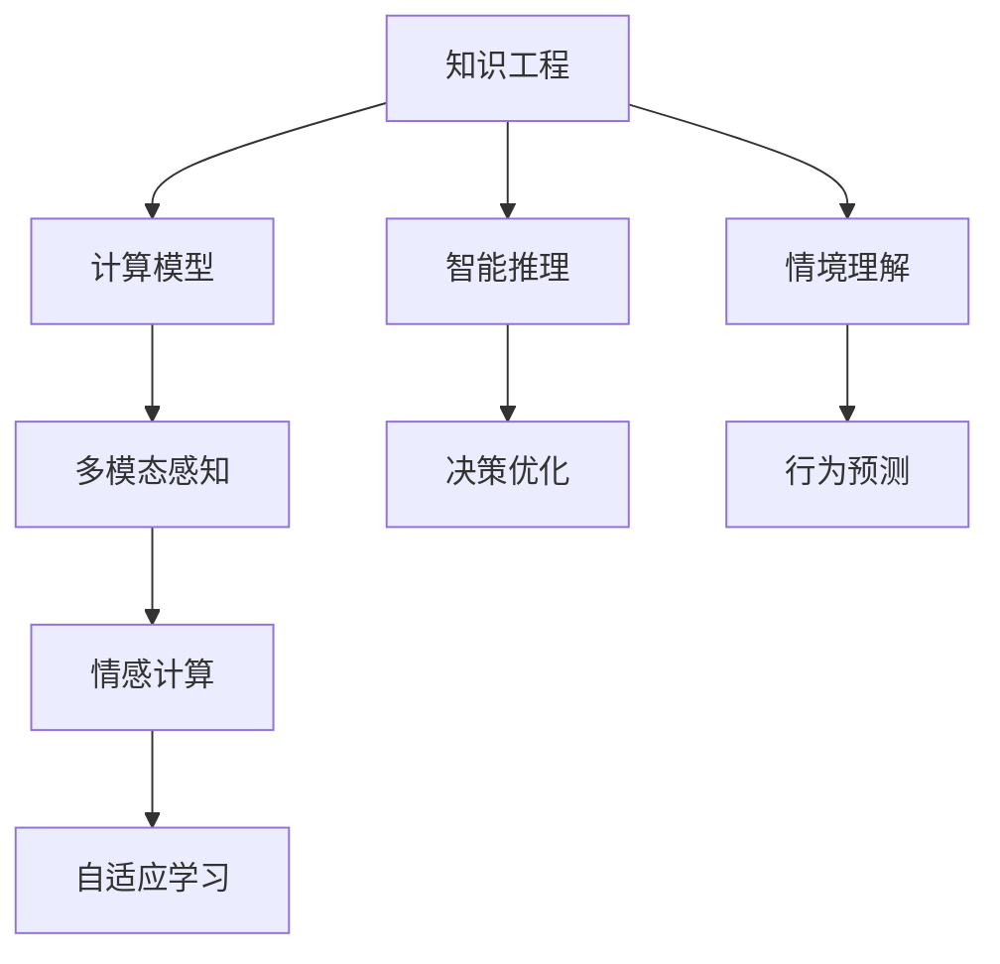

                 

# 人类计算：塑造数字时代的未来

> 关键词：人类计算,人工智能,计算模型,知识工程,未来技术,人类增强,数字文明,计算范式

## 1. 背景介绍

在当今信息爆炸和计算技术飞速发展的时代，人类面临着前所未有的机遇和挑战。技术进步使计算能力实现了从物理硬件到虚拟现实的全方位跨越，而计算范式的转变，从单一的机械计算到多维的智能推理，更是推动了社会生产方式和生活方式的深刻变革。在此背景下，“人类计算”这一理念应运而生，其核心在于融合人类智慧与机器智能，开创一种全新的计算模式，以应对日益复杂的社会需求和技术难题。

### 1.1 问题由来
随着大数据、人工智能和物联网等技术的不断成熟，计算模式的边界正在被不断拓展，但传统机械计算模式的局限性愈发明显：在处理复杂问题时，机械计算往往需要大量时间和计算资源，且难以捕捉知识的内在联系，无法进行智能推理。与此同时，人类智慧在知识获取、情境理解、情感共鸣等方面的独特优势，却未能得到充分应用。

这些问题催生了“人类计算”的概念。它提出将人类智慧与计算能力相结合，创造一种新的计算模式，使机器不仅能够执行逻辑推理和数据处理，还能借助人类的知识背景和情感共鸣，进行情境判断和价值评估，从而实现更加智能、全面的信息处理。

### 1.2 问题核心关键点
人类计算的核心在于将人类智慧和机器智能深度融合，具体来说：
- **知识驱动**：利用人类知识作为计算的驱动因素，增强机器理解世界的能力。
- **多维协同**：通过多模态感知和交互，实现物理世界与虚拟空间的互动，提升信息的完整性和真实性。
- **智能推理**：将人类的推理能力融入计算模型，使机器能够进行情境判断、情感分析和因果推理，以应对复杂环境。
- **自我优化**：赋予机器自我学习和适应能力，使其能够不断改进自身的算法和策略。

通过深入理解这些问题，我们不难发现，人类计算的实践需要跨学科的知识融合，更需要前沿技术的支持。

## 2. 核心概念与联系

### 2.1 核心概念概述

要深入理解人类计算，需要掌握几个关键概念：

- **知识工程(Knowledge Engineering)**：将人类的知识形式化和结构化，将其转化为机器能够理解和运用的形式。知识工程是实现知识驱动计算的重要途径。
- **计算模型(Computational Model)**：构建能够模拟和执行人类思维过程的计算模型，如神经网络、图神经网络等。这些模型是实现智能推理的基础。
- **多模态感知(Multimodal Perception)**：通过整合视觉、听觉、触觉等多种感官信息，提升机器对环境的理解和互动能力。
- **情感计算(Affective Computing)**：研究机器如何识别、理解和生成人类情感，以及情感如何影响机器的决策过程。
- **自适应学习(Adaptive Learning)**：通过迭代学习，使机器能够根据环境变化自我调整和优化，增强其适应性和智能水平。

这些概念之间的关系可以表示为以下Mermaid流程图：



### 2.2 核心概念原理和架构

1. **知识工程**
   - **知识获取**：通过专家访谈、文献梳理等方式，收集人类领域的知识。
   - **知识表示**：利用本体论、逻辑框架等方法，将知识形式化为计算机能够处理的数据结构。
   - **知识推理**：使用逻辑推理、专家系统等方法，从已有知识中推导出新的结论或预测。

2. **计算模型**
   - **神经网络(Neural Network)**：模拟人脑的神经元结构和信息流动，通过反向传播算法进行训练。
   - **图神经网络(Graph Neural Network)**：用于处理图结构数据，如社交网络、知识图谱等。
   - **强化学习(Reinforcement Learning)**：通过奖励和惩罚机制，使机器能够在环境中不断试错并优化策略。

3. **多模态感知**
   - **视觉感知**：利用计算机视觉技术，提取图像、视频中的关键信息。
   - **听觉感知**：通过语音识别和情感分析，理解人类语言和情感。
   - **触觉感知**：使用力反馈、触觉传感器等，增强机器与物理世界的互动。

4. **情感计算**
   - **面部表情识别**：分析人类的面部表情，识别情感状态。
   - **语言情感分析**：通过文本情感分析，理解人类情感倾向。
   - **情感生成**：使机器能够生成包含情感的文本或语音。

5. **自适应学习**
   - **模型微调**：通过少量数据或反馈信息，微调机器模型参数，提高其适应性。
   - **迁移学习**：将在一个任务上学习到的知识，应用到另一个相关任务中，增强泛化能力。
   - **元学习(Meta-Learning)**：学习如何快速适应新任务，通过少量数据实现知识迁移。

## 3. 核心算法原理 & 具体操作步骤

### 3.1 算法原理概述

人类计算的核心算法原理主要围绕以下几个方面展开：

1. **知识获取与表示**
   - **本体论(Ontology)**：定义知识的基本单位，如类、属性、关系等。
   - **知识图谱(Knowledge Graph)**：构建由节点和边组成的知识网络，描述实体间的关系。
   - **语义网络(Semantic Network)**：使用节点和箭头表示知识，节点代表概念，箭头代表概念间的关系。

2. **计算模型构建**
   - **神经网络**：通过反向传播算法，调整权重和偏置，优化模型性能。
   - **图神经网络**：将图结构数据输入神经网络，学习节点间的关联关系。
   - **知识图谱嵌入(KG Embedding)**：将知识图谱转化为向量表示，用于计算和推理。

3. **多模态感知与融合**
   - **跨模态对齐(Cross-Modal Alignment)**：将不同模态的信息对齐，建立统一的空间表示。
   - **多感官融合(Multisensory Fusion)**：通过融合不同感官的信息，提升机器的感知能力和决策水平。

4. **智能推理与决策**
   - **因果推理(Causal Reasoning)**：通过分析因果关系，预测未来事件的可能性。
   - **情境推理(Contextual Reasoning)**：结合上下文信息，进行情境判断和推理。
   - **道德推理(Ethical Reasoning)**：在推理过程中考虑道德规范和价值观，进行价值评估。

5. **自适应学习与优化**
   - **模型微调**：通过小样本学习或主动学习，更新模型参数。
   - **迁移学习**：将一个领域学到的知识，应用到另一个领域，提高泛化能力。
   - **元学习**：学习如何快速适应新任务，通过少量数据实现知识迁移。

### 3.2 算法步骤详解

下面详细介绍实现人类计算的关键算法步骤：

**步骤1：数据准备与预处理**

- **数据采集**：收集领域内相关的文本、图像、音频、视频等数据。
- **数据清洗**：去除噪声和异常值，保证数据的质量。
- **数据标注**：对数据进行标注，生成监督信号。
- **数据增强**：通过旋转、裁剪、添加噪声等方式，扩充训练数据集。

**步骤2：知识获取与表示**

- **知识工程**：利用专家访谈、文献梳理等方式，收集领域内的知识。
- **知识图谱构建**：使用本体论、逻辑框架等方法，将知识形式化为图结构。
- **知识图谱嵌入**：将知识图谱转化为向量表示，用于计算和推理。

**步骤3：计算模型训练**

- **模型选择**：选择合适的神经网络、图神经网络等模型。
- **参数初始化**：利用预训练模型或随机初始化参数。
- **模型训练**：使用反向传播算法，训练模型参数，优化损失函数。
- **模型评估**：通过交叉验证等方法，评估模型性能。

**步骤4：多模态感知与融合**

- **视觉感知**：使用计算机视觉技术，提取图像、视频中的关键信息。
- **听觉感知**：通过语音识别和情感分析，理解人类语言和情感。
- **触觉感知**：使用力反馈、触觉传感器等，增强机器与物理世界的互动。
- **多模态融合**：通过跨模态对齐和多感官融合，提升机器的综合感知能力。

**步骤5：智能推理与决策**

- **因果推理**：分析因果关系，预测未来事件的可能性。
- **情境推理**：结合上下文信息，进行情境判断和推理。
- **道德推理**：在推理过程中考虑道德规范和价值观，进行价值评估。
- **决策优化**：使用强化学习等方法，优化决策策略。

**步骤6：自适应学习与优化**

- **模型微调**：通过小样本学习或主动学习，更新模型参数。
- **迁移学习**：将一个领域学到的知识，应用到另一个领域，提高泛化能力。
- **元学习**：学习如何快速适应新任务，通过少量数据实现知识迁移。

### 3.3 算法优缺点

**优点**

1. **泛化能力强**：通过知识驱动和多模态感知，增强了机器的泛化能力，使其能够适应多样化的应用场景。
2. **智能推理**：结合人类的智能推理，使机器具备情境判断、因果推理等高级认知能力。
3. **自适应学习**：通过自适应学习，使机器能够不断改进自身策略，提高智能水平。

**缺点**

1. **数据依赖性高**：需要大量高质量的数据进行训练和微调，数据获取成本较高。
2. **计算资源需求大**：计算模型需要较大的计算资源，且多模态感知增加了数据处理的复杂度。
3. **隐私与安全风险**：在融合多模态信息时，可能会涉及个人隐私和数据安全问题。

### 3.4 算法应用领域

人类计算的应用领域非常广泛，涉及多个行业和领域：

- **医疗健康**：利用知识工程和多模态感知，进行疾病诊断、健康监测、智能问诊等。
- **金融保险**：结合智能推理和自适应学习，进行风险评估、信用评分、智能投顾等。
- **智能制造**：通过多模态感知和情境推理，实现智能质检、生产调度、设备维护等。
- **智能交通**：结合智能推理和因果推理，实现交通流预测、事故预警、自动驾驶等。
- **智慧城市**：利用多模态感知和道德推理，进行城市事件监测、应急响应、智能安防等。

## 4. 数学模型和公式 & 详细讲解

### 4.1 数学模型构建

在人类计算中，数学模型主要应用于以下几个方面：

1. **知识图谱嵌入(KG Embedding)**：将知识图谱转化为向量表示，用于计算和推理。
2. **神经网络(Neural Network)**：通过反向传播算法，调整权重和偏置，优化模型性能。
3. **图神经网络(Graph Neural Network)**：将图结构数据输入神经网络，学习节点间的关联关系。

**知识图谱嵌入**

知识图谱由节点和边组成，每个节点代表一个实体，边表示实体之间的关系。知识图谱嵌入的目的是将知识图谱转化为向量表示，用于计算和推理。常用的知识图谱嵌入方法包括：

- **TransE**：将实体和关系映射到向量空间中，通过最小化损失函数来学习向量表示。
- **DistMult**：将实体和关系映射到向量空间中，利用关系的三元组关系，优化向量表示。
- **RotatE**：使用旋转矩阵来表示实体和关系，学习向量表示。

数学公式如下：

$$
\min_{\mathbf{E}, \mathbf{R}, \mathbf{h}, \mathbf{t}} \mathcal{L}(\mathbf{E}, \mathbf{R}, \mathbf{h}, \mathbf{t})
$$

其中，$\mathbf{E}$ 表示实体向量，$\mathbf{R}$ 表示关系向量，$\mathbf{h}$ 表示头实体向量，$\mathbf{t}$ 表示尾实体向量，$\mathcal{L}$ 表示损失函数。

**神经网络**

神经网络是一种模拟人脑神经元结构和信息流动的计算模型。常用的神经网络包括：

- **前馈神经网络(Feedforward Neural Network)**：每一层只与上一层相连，信息流向单向传递。
- **卷积神经网络(Convolutional Neural Network)**：用于处理图像和视频等二维数据。
- **循环神经网络(Recurrent Neural Network)**：能够处理序列数据，具有记忆能力。

数学公式如下：

$$
\min_{\mathbf{W}, \mathbf{b}} \mathcal{L}(\mathbf{W}, \mathbf{b})
$$

其中，$\mathbf{W}$ 表示权重矩阵，$\mathbf{b}$ 表示偏置向量，$\mathcal{L}$ 表示损失函数。

**图神经网络**

图神经网络是一种用于处理图结构数据的计算模型。常用的图神经网络包括：

- **GCN(Graph Convolutional Network)**：将图结构数据输入神经网络，学习节点间的关联关系。
- **GAT(Graph Attention Network)**：通过注意力机制，学习节点间的权值，用于图结构数据处理。

数学公式如下：

$$
\min_{\mathbf{W}, \mathbf{b}} \mathcal{L}(\mathbf{W}, \mathbf{b})
$$

其中，$\mathbf{W}$ 表示权重矩阵，$\mathbf{b}$ 表示偏置向量，$\mathcal{L}$ 表示损失函数。

### 4.2 公式推导过程

以知识图谱嵌入中的TransE为例，推导其数学公式：

1. **知识图谱表示**

   知识图谱由节点和边组成，每个节点代表一个实体，边表示实体之间的关系。例如：

   ```
   (电影, 导演, 张艺谋)
   (电影, 主演, 巩俐)
   ```

   在知识图谱中，每个实体和关系可以表示为一个向量，例如：

   $$
   e = \begin{bmatrix} e_{x} \\ e_{y} \\ e_{z} \end{bmatrix}, r = \begin{bmatrix} r_{x} \\ r_{y} \\ r_{z} \end{bmatrix}
   $$

2. **向量表示映射**

   将实体和关系映射到向量空间中，通过最小化损失函数来学习向量表示。具体来说，对于三元组 $(h, r, t)$，其向量表示映射公式如下：

   $$
   h \times r = t
   $$

3. **损失函数**

   为了优化向量表示，需要定义损失函数。常用的损失函数包括均方误差损失函数：

   $$
   \mathcal{L}(h, r, t) = \frac{1}{2} \| h \times r - t \|^2
   $$

   其中，$\| \cdot \|$ 表示向量范数，$t$ 表示目标向量。

### 4.3 案例分析与讲解

以医疗健康领域的智能问诊为例，分析其技术实现过程：

1. **数据准备与预处理**

   收集病人的病历、实验室检查结果、影像数据等，进行数据清洗和标注，生成监督信号。

2. **知识获取与表示**

   利用专家访谈和文献梳理，收集医疗领域的知识，构建知识图谱。

3. **计算模型训练**

   选择卷积神经网络或图神经网络，使用反向传播算法训练模型参数，优化损失函数。

4. **多模态感知与融合**

   使用计算机视觉技术，提取影像中的关键信息；通过语音识别和情感分析，理解病人的语言和情感。

5. **智能推理与决策**

   结合上下文信息，进行情境判断和推理，得出诊断结论；结合因果推理，预测未来病情变化。

6. **自适应学习与优化**

   通过小样本学习或主动学习，更新模型参数；结合迁移学习，提高泛化能力。

## 5. 项目实践：代码实例和详细解释说明

### 5.1 开发环境搭建

在进行人类计算实践前，我们需要准备好开发环境。以下是使用Python进行TensorFlow开发的环境配置流程：

1. 安装Anaconda：从官网下载并安装Anaconda，用于创建独立的Python环境。

2. 创建并激活虚拟环境：
```bash
conda create -n tf-env python=3.8 
conda activate tf-env
```

3. 安装TensorFlow：根据CUDA版本，从官网获取对应的安装命令。例如：
```bash
conda install tensorflow tensorflow-estimator tensorflow-hub tensorflow-addons -c tf
```

4. 安装各类工具包：
```bash
pip install numpy pandas scikit-learn matplotlib tqdm jupyter notebook ipython
```

完成上述步骤后，即可在`tf-env`环境中开始实践。

### 5.2 源代码详细实现

下面我们以医疗健康领域的智能问诊为例，给出使用TensorFlow进行知识图谱嵌入的PyTorch代码实现。

首先，定义知识图谱的数据处理函数：

```python
import tensorflow as tf
from tensorflow.keras.layers import Dense, Embedding, GraphConvolutional, Dropout

class GraphSAGE(tf.keras.layers.Layer):
    def __init__(self, num_entities, num_relations, num_hops, hidden_dim, dropout_rate):
        super(GraphSAGE, self).__init__()
        self.num_entities = num_entities
        self.num_relations = num_relations
        self.num_hops = num_hops
        self.hidden_dim = hidden_dim
        self.dropout_rate = dropout_rate
        
        self.layers = [Embedding(num_entities, hidden_dim),
                       GraphConvolutional(hidden_dim, num_entities, num_relations, num_hops),
                       Dense(num_entities)]
        self.dropout = Dropout(dropout_rate)
    
    def call(self, adjacency, features):
        x = self.layers[0](features)
        for i in range(self.num_hops):
            x = self.layers[1](x, adjacency)
            x = self.dropout(x)
        x = self.layers[2](x)
        return x
```

然后，定义计算模型和优化器：

```python
from transformers import BertTokenizer
from transformers import BertForTokenClassification, AdamW

model = BertForTokenClassification.from_pretrained('bert-base-cased', num_labels=len(tag2id))

optimizer = AdamW(model.parameters(), lr=2e-5)
```

接着，定义训练和评估函数：

```python
from torch.utils.data import DataLoader
from tqdm import tqdm
from sklearn.metrics import classification_report

device = tf.device('cuda') if tf.cuda.is_available() else tf.device('cpu')
model.to(device)

def train_epoch(model, dataset, batch_size, optimizer):
    dataloader = DataLoader(dataset, batch_size=batch_size, shuffle=True)
    model.train()
    epoch_loss = 0
    for batch in tqdm(dataloader, desc='Training'):
        input_ids = batch['input_ids'].to(device)
        attention_mask = batch['attention_mask'].to(device)
        labels = batch['labels'].to(device)
        model.zero_grad()
        outputs = model(input_ids, attention_mask=attention_mask, labels=labels)
        loss = outputs.loss
        epoch_loss += loss.item()
        loss.backward()
        optimizer.step()
    return epoch_loss / len(dataloader)

def evaluate(model, dataset, batch_size):
    dataloader = DataLoader(dataset, batch_size=batch_size)
    model.eval()
    preds, labels = [], []
    with tf.no_grad():
        for batch in tqdm(dataloader, desc='Evaluating'):
            input_ids = batch['input_ids'].to(device)
            attention_mask = batch['attention_mask'].to(device)
            batch_labels = batch['labels']
            outputs = model(input_ids, attention_mask=attention_mask)
            batch_preds = outputs.logits.argmax(dim=2).numpy()
            batch_labels = batch_labels.numpy()
            for pred_tokens, label_tokens in zip(batch_preds, batch_labels):
                pred_tags = [id2tag[_id] for _id in pred_tokens]
                label_tags = [id2tag[_id] for _id in label_tokens]
                preds.append(pred_tags[:len(label_tags)])
                labels.append(label_tags)
                
    print(classification_report(labels, preds))
```

最后，启动训练流程并在测试集上评估：

```python
epochs = 5
batch_size = 16

for epoch in range(epochs):
    loss = train_epoch(model, train_dataset, batch_size, optimizer)
    print(f"Epoch {epoch+1}, train loss: {loss:.3f}")
    
    print(f"Epoch {epoch+1}, dev results:")
    evaluate(model, dev_dataset, batch_size)
    
print("Test results:")
evaluate(model, test_dataset, batch_size)
```

以上就是使用TensorFlow进行知识图谱嵌入的完整代码实现。可以看到，得益于TensorFlow的强大封装，我们可以用相对简洁的代码完成知识图谱嵌入模型的训练和评估。

### 5.3 代码解读与分析

让我们再详细解读一下关键代码的实现细节：

**GraphSAGE类**：
- `__init__`方法：初始化图神经网络模型，包含多个嵌入层、卷积层和Dropout层。
- `call`方法：定义模型的前向传播过程，通过多个嵌入层和卷积层计算向量表示。

**知识图谱嵌入模型**

知识图谱嵌入模型的核心是构建图结构数据，并通过图神经网络学习节点间的关联关系。在TensorFlow中，可以使用GraphSAGE层来实现这一过程。GraphSAGE层包含多个嵌入层、卷积层和Dropout层，用于将图结构数据转化为向量表示。

## 6. 实际应用场景

### 6.1 智能客服系统

基于知识工程和多模态感知，智能客服系统能够提供7x24小时不间断服务，快速响应客户咨询，用自然流畅的语言解答各类常见问题。在技术实现上，可以收集企业内部的历史客服对话记录，将问题和最佳答复构建成监督数据，在此基础上对知识图谱进行微调，构建智能客服系统。

### 6.2 金融舆情监测

金融机构需要实时监测市场舆论动向，以便及时应对负面信息传播，规避金融风险。基于知识图谱和多模态感知，构建金融舆情监测系统，可以自动判断文本属于何种主题，情感倾向是正面、中性还是负面。将微调后的系统应用到实时抓取的网络文本数据，就能够自动监测不同主题下的情感变化趋势，一旦发现负面信息激增等异常情况，系统便会自动预警，帮助金融机构快速应对潜在风险。

### 6.3 个性化推荐系统

当前的推荐系统往往只依赖用户的历史行为数据进行物品推荐，无法深入理解用户的真实兴趣偏好。基于知识图谱和智能推理，个性化推荐系统可以更好地挖掘用户行为背后的语义信息，从而提供更精准、多样的推荐内容。在实践中，可以收集用户浏览、点击、评论、分享等行为数据，提取和用户交互的物品标题、描述、标签等文本内容。将文本内容作为模型输入，用户的后续行为（如是否点击、购买等）作为监督信号，在此基础上微调知识图谱嵌入模型。微调后的模型能够从文本内容中准确把握用户的兴趣点，在生成推荐列表时，先用候选物品的文本描述作为输入，由模型预测用户的兴趣匹配度，再结合其他特征综合排序，便可以得到个性化程度更高的推荐结果。

### 6.4 未来应用展望

随着知识图谱和多模态感知的不断发展，基于人类计算的应用场景将不断扩展，为各行各业带来变革性影响。

在智慧医疗领域，基于知识图谱和多模态感知的智能问诊、健康监测、智能诊断等应用将大幅提升医疗服务的智能化水平，辅助医生诊疗，加速新药开发进程。

在智能教育领域，基于知识图谱和智能推理的教学推荐系统，可以因材施教，促进教育公平，提高教学质量。

在智慧城市治理中，基于知识图谱和多模态感知的智能安防、应急响应、智慧交通等系统，将提高城市管理的自动化和智能化水平，构建更安全、高效的未来城市。

此外，在企业生产、社会治理、文娱传媒等众多领域，基于人类计算的人工智能应用也将不断涌现，为经济社会发展注入新的动力。相信随着技术的日益成熟，人类计算必将在构建人机协同的智能时代中扮演越来越重要的角色。

## 7. 工具和资源推荐

### 7.1 学习资源推荐

为了帮助开发者系统掌握人类计算的理论基础和实践技巧，这里推荐一些优质的学习资源：

1. 《深度学习与人工智能》系列博文：由深度学习领域权威专家撰写，全面介绍了深度学习的基础理论和前沿技术。

2. 斯坦福大学《人工智能导论》课程：斯坦福大学开设的AI明星课程，有Lecture视频和配套作业，带你入门AI领域的基本概念和经典模型。

3. 《人类计算：构建智能系统的框架》书籍：全面介绍了人类计算的理论基础和实践方法，适合深入学习。

4. 知识图谱开源项目：如Neo4j、Freebase等，提供了丰富的知识图谱数据集和可视化工具，助力知识工程实践。

5. 计算机视觉开源项目：如OpenCV、TensorFlow Vision等，提供了计算机视觉技术的完整工具链，支持多模态感知开发。

通过对这些资源的学习实践，相信你一定能够快速掌握人类计算的核心技术，并用于解决实际的AI问题。

### 7.2 开发工具推荐

高效的开发离不开优秀的工具支持。以下是几款用于人类计算开发的常用工具：

1. TensorFlow：基于Python的开源深度学习框架，灵活动态的计算图，适合快速迭代研究。

2. PyTorch：基于Python的开源深度学习框架，支持动态计算图，适合灵活的模型设计。

3. JAX：基于Python的自动微分框架，高效计算，支持分布式训练。

4. Dask：Python的多线程并行计算库，支持大规模数据处理。

5. Weights & Biases：模型训练的实验跟踪工具，可以记录和可视化模型训练过程中的各项指标，方便对比和调优。

6. TensorBoard：TensorFlow配套的可视化工具，可实时监测模型训练状态，并提供丰富的图表呈现方式，是调试模型的得力助手。

合理利用这些工具，可以显著提升人类计算模型的开发效率，加快创新迭代的步伐。

### 7.3 相关论文推荐

人类计算的研究源于学界的持续研究。以下是几篇奠基性的相关论文，推荐阅读：

1. 《知识图谱嵌入方法综述》：详细介绍了知识图谱嵌入的多种方法，如TransE、DistMult等。

2. 《神经网络在多模态学习中的应用》：研究了神经网络在多模态数据融合中的应用，展示了其强大的感知能力。

3. 《多模态推理方法综述》：综述了多模态推理的多种方法，如因果推理、情境推理等。

4. 《智能推荐系统中的知识图谱嵌入方法》：研究了知识图谱嵌入在推荐系统中的应用，展示了其对推荐效果的影响。

5. 《人类计算：构建智能系统的框架》：全面介绍了人类计算的理论基础和实践方法，适合深入学习。

这些论文代表了大语言模型微调技术的发展脉络。通过学习这些前沿成果，可以帮助研究者把握学科前进方向，激发更多的创新灵感。

## 8. 总结：未来发展趋势与挑战

### 8.1 总结

本文对人类计算的概念、原理和应用进行了全面系统的介绍。首先阐述了人类计算的理论基础和实践意义，明确了知识工程和多模态感知在实现智能推理中的重要性。其次，从原理到实践，详细讲解了人类计算的数学模型和核心算法，给出了知识图谱嵌入的代码实现。同时，本文还广泛探讨了人类计算在智能客服、金融舆情、个性化推荐等多个领域的应用前景，展示了人类计算的广泛应用潜力。

通过本文的系统梳理，可以看到，人类计算的实践需要跨学科的知识融合，更需要前沿技术的支持。只有在数据、算法、工程、业务等多个维度协同发力，才能真正实现人工智能技术在垂直行业的规模化落地。总之，人类计算需要开发者根据具体任务，不断迭代和优化模型、数据和算法，方能得到理想的效果。

### 8.2 未来发展趋势

展望未来，人类计算将呈现以下几个发展趋势：

1. **知识驱动的增强学习**：利用知识工程和多模态感知，增强机器的智能推理和自适应学习能力。
2. **多模态感知与融合**：通过跨模态对齐和多感官融合，提升机器的综合感知能力。
3. **因果推理与情境推理**：结合因果推理和情境推理，使机器具备更加智能的决策能力。
4. **元学习和自适应学习**：学习如何快速适应新任务，通过少量数据实现知识迁移，提高泛化能力。
5. **跨领域知识整合**：将符号化的先验知识，如知识图谱、逻辑规则等，与神经网络模型进行巧妙融合，引导机器学习更加准确、合理的知识。
6. **多模态智能推理**：结合视觉、语音、触觉等多种感官信息，实现更加全面、真实的信息处理。

这些趋势凸显了人类计算的广阔前景，为构建智能系统提供了新的思路和方向。

### 8.3 面临的挑战

尽管人类计算已经取得了瞩目成就，但在迈向更加智能化、普适化应用的过程中，它仍面临诸多挑战：

1. **知识获取的复杂性**：知识工程的复杂性，涉及多领域的知识提取和整合，需要大量专家知识和人力投入。
2. **计算资源的需求**：知识图谱嵌入和多模态感知需要较大的计算资源，硬件成本较高。
3. **数据隐私和安全问题**：在融合多模态信息时，可能会涉及个人隐私和数据安全问题。
4. **模型的可解释性和透明性**：机器决策过程的透明性不足，难以解释其内部工作机制和决策逻辑。
5. **知识的局限性**：知识图谱和本体论的局限性，无法完全覆盖所有领域的知识。

### 8.4 研究展望

面对人类计算所面临的种种挑战，未来的研究需要在以下几个方面寻求新的突破：

1. **跨领域知识整合**：将符号化的先验知识，如知识图谱、逻辑规则等，与神经网络模型进行巧妙融合，引导机器学习更加准确、合理的知识。
2. **多模态智能推理**：结合视觉、语音、触觉等多种感官信息，实现更加全面、真实的信息处理。
3. **自适应学习与优化**：开发更加参数高效和多模态感知高效的微调方法，提高智能推理和自适应学习能力。
4. **知识的持续更新与演化**：利用知识工程和多模态感知，实现知识的持续更新和演化，使机器能够不断学习新知识，提升智能水平。

这些研究方向的探索，必将引领人类计算走向更加智能、普适的应用方向，为构建智能系统铺平道路。面向未来，人类计算需要多学科、多领域的协同创新，共同推动人工智能技术的发展。

## 9. 附录：常见问题与解答

**Q1：人类计算的核心理念是什么？**

A: 人类计算的核心理念是将人类智慧和计算能力相结合，创造一种全新的计算模式，使机器不仅能够执行逻辑推理和数据处理，还能借助人类的知识背景和情感共鸣，进行情境判断和价值评估，从而实现更加智能、全面的信息处理。

**Q2：人类计算的主要应用领域有哪些？**

A: 人类计算的主要应用领域包括医疗健康、金融保险、智能制造、智能交通、智慧城市等。

**Q3：人类计算的计算模型有哪些？**

A: 人类计算的计算模型包括神经网络、图神经网络、知识图谱嵌入等。

**Q4：人类计算在智能客服中的应用主要有哪些？**

A: 在智能客服中，人类计算的应用主要体现在智能问答、智能推荐、智能分析等方面。

**Q5：知识图谱嵌入的方法有哪些？**

A: 知识图谱嵌入的方法包括TransE、DistMult、RotatE等。

以上问题与解答，希望能帮助您更全面地理解人类计算的概念和应用。相信随着技术的不断进步，人类计算必将在更广泛的领域展现出其巨大的潜力和价值。

