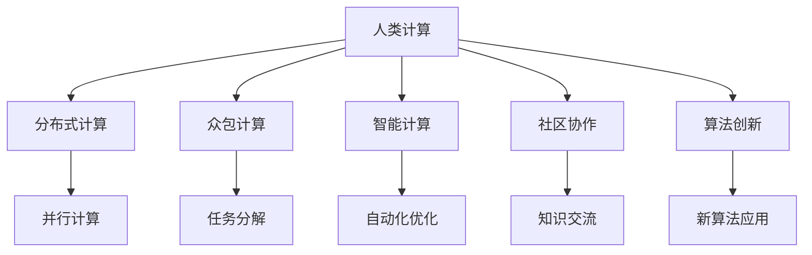

                 

# 人类计算：释放人类潜力的无限可能

## 1. 背景介绍

### 1.1 问题由来

在当今信息爆炸的时代，人类面临的信息处理任务越来越复杂，超出了个人和传统计算机的能力范围。无论是数据的存储、处理、分析，还是复杂问题的求解，都亟需新的计算范式来提升效率和效果。传统计算机的处理方式，依赖于硬件的速度和规模，但这些限制已接近物理极限。因此，探索全新的计算方式，利用人类智慧与计算资源的结合，成为当务之急。

### 1.2 问题核心关键点

人类计算的核心关键点在于如何利用人类的智慧与计算资源相结合，实现超越传统计算方式的效率和效果。其核心包括以下几个方面：

1. **分布式计算**：利用网络的互联性，将计算任务分布到多个节点上进行协同计算。
2. **众包计算**：将复杂计算任务分解为简单子任务，分发给大众用户进行协作计算。
3. **智能计算**：结合人工智能技术，自动优化计算过程，提升计算效率。
4. **社区协作**：建立社区平台，鼓励用户交流和分享计算经验和成果。
5. **算法创新**：研究和应用新的计算算法，提高计算效率和效果。

这些关键点共同构成了人类计算的核心框架，旨在通过多层次的计算手段，实现对大规模复杂问题的高效处理。

## 2. 核心概念与联系

### 2.1 核心概念概述

为更好地理解人类计算的核心理念，本节将介绍几个关键概念及其相互联系：

- **人类计算(Human Computing)**：利用人类的智慧和劳动，通过网络协作、社区交流等方式，对大规模数据进行处理和分析的计算范式。
- **分布式计算(Distributed Computing)**：通过网络将计算任务分布到多个节点上进行并行计算。
- **众包计算(Crowdsourcing Computing)**：将复杂计算任务分解为简单子任务，分发给大众用户协作完成。
- **智能计算(Intelligent Computing)**：结合人工智能技术，自动优化计算过程，提升计算效率。
- **社区协作(Community Collaboration)**：建立社区平台，促进用户之间的交流和协作，分享计算资源和成果。
- **算法创新(Algorithm Innovation)**：研究和应用新的计算算法，提高计算效率和效果。

这些概念之间的联系可以通过以下Mermaid流程图来展示：



这个流程图展示了人类计算的核心概念及其之间的逻辑关系：

1. 人类计算利用分布式计算、众包计算、智能计算、社区协作和算法创新等多种手段，实现对大规模复杂问题的处理。
2. 分布式计算将计算任务分布在多个节点上进行并行计算。
3. 众包计算将复杂任务分解为简单子任务，通过大众协作完成。
4. 智能计算结合人工智能技术，自动优化计算过程。
5. 社区协作建立平台，促进用户交流和协作，分享计算资源和成果。
6. 算法创新研究和应用新的计算算法，提升计算效率和效果。

这些概念共同构成了人类计算的基本框架，为大规模复杂问题的解决提供了新的思路和工具。

## 3. 核心算法原理 & 具体操作步骤

### 3.1 算法原理概述

人类计算的核心理算即为分布式计算和众包计算。其原理是通过将计算任务分布到多个节点或用户上，协同完成复杂的计算任务。

### 3.2 算法步骤详解

#### 3.2.1 分布式计算

**步骤1: 任务划分与调度**
1. **任务划分**：将大规模计算任务划分为多个子任务，每个子任务可以独立执行。
2. **任务调度**：根据每个节点的计算能力和当前负载，动态分配任务，避免资源浪费和过载。

**步骤2: 并行计算**
1. **节点并行**：每个子任务在分配到的节点上独立执行，并行计算结果。
2. **结果合并**：将各个节点的计算结果汇总，得到最终的计算结果。

**步骤3: 系统优化**
1. **负载均衡**：动态调整任务分配，平衡各个节点的负载。
2. **故障处理**：实时监控节点状态，及时处理故障和异常。

#### 3.2.2 众包计算

**步骤1: 任务分解**
1. **任务分解**：将复杂计算任务分解为多个简单子任务。
2. **任务发布**：将任务发布到众包平台，招募用户进行计算。

**步骤2: 任务执行**
1. **用户提交**：用户接收到任务后，提交计算结果。
2. **结果审查**：平台对提交结果进行审核，确保质量。

**步骤3: 结果汇总**
1. **结果合并**：将各个用户的计算结果汇总，得到最终的计算结果。
2. **质量控制**：平台对计算结果进行质量控制，确保准确性。

### 3.3 算法优缺点

人类计算的优势在于：

1. **大规模处理能力**：能够处理超出传统计算方式的数据量和复杂度。
2. **灵活性高**：可以根据任务需求和资源情况，灵活调整计算方式。
3. **用户参与**：充分利用人类智慧和劳动力，降低计算成本。

然而，人类计算也存在以下缺点：

1. **质量控制困难**：用户提交的结果质量难以保证，需要平台进行严格审核。
2. **数据隐私风险**：用户计算过程中可能泄露敏感信息，需要平台提供数据保护措施。
3. **计算效率不稳定**：受用户参与度等因素影响，计算效率不稳定。

### 3.4 算法应用领域

人类计算在多个领域中得到了广泛应用，包括：

- **大数据处理**：利用分布式计算和众包计算，处理大规模数据集。
- **科学计算**：结合智能计算和社区协作，解决复杂的科学问题。
- **工程设计**：利用众包计算，进行复杂的工程设计和模拟。
- **社会服务**：通过社区协作平台，提供公共服务和社会治理。
- **教育培训**：利用众包计算和社区协作，进行在线教育培训。

## 4. 数学模型和公式 & 详细讲解 & 举例说明

### 4.1 数学模型构建

人类计算的数学模型主要包括任务划分、任务调度、并行计算和结果合并等步骤。

- **任务划分**：将计算任务划分为多个子任务，可以用以下公式表示：
  $$
  T = \bigcup_{i=1}^{n} T_i
  $$
  其中 $T$ 为整个计算任务，$T_i$ 为第 $i$ 个子任务。

- **任务调度**：根据节点计算能力和负载，动态分配任务，可以用以下公式表示：
  $$
  A_i = \frac{C_i}{L_i} \times T
  $$
  其中 $A_i$ 为第 $i$ 个节点分配的任务量，$C_i$ 为节点计算能力，$L_i$ 为节点当前负载。

- **并行计算**：各节点独立执行子任务，并行计算结果，可以用以下公式表示：
  $$
  R_i = F_i(A_i)
  $$
  其中 $R_i$ 为第 $i$ 个节点的计算结果，$F_i$ 为节点计算函数，$A_i$ 为节点分配的任务量。

- **结果合并**：将各个节点的计算结果汇总，得到最终结果，可以用以下公式表示：
  $$
  R = \bigcup_{i=1}^{n} R_i
  $$

### 4.2 公式推导过程

以下以任务划分和任务调度为例，详细推导其公式：

**任务划分公式推导**：
假设整个计算任务 $T$ 可以被划分为 $n$ 个子任务 $T_1, T_2, ..., T_n$。则任务划分的公式可以表示为：
$$
T = \bigcup_{i=1}^{n} T_i
$$
这个公式表示，将整个任务 $T$ 划分为 $n$ 个子任务后，其并集仍然是整个任务 $T$。

**任务调度公式推导**：
假设每个节点的计算能力为 $C_i$，当前负载为 $L_i$，分配的任务量为 $A_i$。则任务调度的公式可以表示为：
$$
A_i = \frac{C_i}{L_i} \times T
$$
这个公式表示，根据节点的计算能力和当前负载，动态调整分配的任务量，以平衡各个节点的负载。

### 4.3 案例分析与讲解

**案例1: 大数据处理**

某电商公司需要处理大规模用户数据，以分析用户行为和市场趋势。公司利用分布式计算和众包计算，将数据处理任务分配到多个节点上进行协同计算。

**步骤1: 任务划分**
公司将数据处理任务划分为多个子任务，每个子任务独立执行。例如，将数据清洗任务划分为数据预处理、缺失值处理和异常值处理等子任务。

**步骤2: 任务调度**
根据每个节点的计算能力和当前负载，动态调整任务分配。例如，计算能力较强的节点分配更多的任务，负载较高的节点分配较少的任务。

**步骤3: 并行计算**
各节点独立执行子任务，并行计算结果。例如，节点1处理数据预处理任务，节点2处理缺失值处理任务，节点3处理异常值处理任务。

**步骤4: 结果合并**
将各个节点的计算结果汇总，得到最终处理结果。例如，将节点1、节点2和节点3的处理结果合并，得到完整的用户行为数据。

**案例2: 科学计算**

某科研项目需要模拟天体运动，计算量巨大。利用人类计算，将计算任务分解为多个简单子任务，分发给大众用户协作完成。

**步骤1: 任务分解**
将天体运动模拟任务分解为轨道计算、引力计算和运动轨迹计算等子任务。例如，轨道计算为计算天体轨道方程，引力计算为计算天体之间的引力，运动轨迹计算为计算天体运动轨迹。

**步骤2: 任务执行**
将任务发布到众包平台，招募用户进行计算。例如，平台发布轨道计算任务，用户提交计算结果，平台审核后接受。

**步骤3: 结果汇总**
将各个用户的计算结果汇总，得到最终计算结果。例如，将各用户提交的轨道计算结果合并，得到天体轨道方程。

## 5. 项目实践：代码实例和详细解释说明

### 5.1 开发环境搭建

在进行人类计算的实践前，我们需要准备好开发环境。以下是使用Python进行分布式计算的开发环境配置流程：

1. 安装Python：从官网下载并安装Python，确保版本为3.8及以上。
2. 安装分布式计算库：例如，安装Apache Spark或Apache Flink，用于分布式计算。
3. 安装众包平台：例如，安装Elastic Crowd、Mturk等众包平台，用于任务发布和用户协作。
4. 安装数据分析库：例如，安装Pandas、NumPy等库，用于数据处理和分析。
5. 安装网络库：例如，安装Requests库，用于网络通信和任务调度。

完成上述步骤后，即可在Python环境中进行分布式计算和众包计算的实践。

### 5.2 源代码详细实现

下面我们以分布式计算为例，给出使用Apache Spark进行分布式计算的PyTorch代码实现。

首先，定义分布式计算的任务函数：

```python
from pyspark import SparkContext, SparkConf

def distributed_calculation(data, func):
    sc = SparkContext()
    rdd = sc.parallelize(data)
    result = rdd.map(func).collect()
    return result
```

然后，定义任务执行函数：

```python
def task_processing(data, func):
    result = distributed_calculation(data, func)
    return result
```

最后，启动分布式计算流程：

```python
data = [1, 2, 3, 4, 5]
result = task_processing(data, lambda x: x * 2)
print(result)
```

在这个代码中，`distributed_calculation`函数利用Apache Spark的RDD（弹性分布式数据集）并行计算数据，`task_processing`函数则用于启动分布式计算流程。

### 5.3 代码解读与分析

让我们再详细解读一下关键代码的实现细节：

**distributed_calculation函数**：
- `sc = SparkContext()`：创建Spark上下文，用于管理分布式计算任务。
- `rdd = sc.parallelize(data)`：将数据并行化到Spark集群，形成分布式数据集。
- `result = rdd.map(func).collect()`：对数据集进行并行处理，计算每个元素，并将结果收集到本地。

**task_processing函数**：
- `result = distributed_calculation(data, func)`：调用分布式计算函数，执行任务。
- `return result`：返回计算结果。

**启动分布式计算流程**：
- `data = [1, 2, 3, 4, 5]`：定义待处理的数据。
- `result = task_processing(data, lambda x: x * 2)`：启动任务处理流程，将数据元素乘以2。
- `print(result)`：输出计算结果。

可以看到，利用Apache Spark进行分布式计算的代码实现非常简单高效，只需几行代码即可实现大规模数据并行处理。

## 6. 实际应用场景

### 6.1 智慧城市管理

智慧城市管理是利用人类计算技术的重要应用场景。通过分布式计算和众包计算，智慧城市可以实时处理海量数据，优化城市资源配置，提高城市管理效率。

**应用场景**：
- **交通流量监测**：利用分布式计算实时处理交通流量数据，优化交通信号灯，缓解交通拥堵。
- **能源消耗管理**：利用分布式计算实时处理能源消耗数据，优化能源分配，减少能源浪费。
- **环境监测**：利用分布式计算实时处理环境监测数据，预警环境污染，提升环境治理效果。

**技术实现**：
- **数据采集**：部署传感器和摄像头，实时采集城市数据。
- **分布式计算**：利用Apache Spark等分布式计算框架处理海量数据。
- **任务发布**：通过众包平台发布计算任务，招募用户参与数据处理。
- **结果汇总**：将用户提交的结果汇总，得到城市管理决策数据。

### 6.2 科学研究

科学研究领域中，人类计算技术也有广泛应用。利用分布式计算和智能计算，科学家可以高效处理海量数据，解决复杂的科学问题。

**应用场景**：
- **基因组分析**：利用分布式计算处理基因组数据，分析基因突变，揭示生命本质。
- **天文学研究**：利用分布式计算处理天文数据，模拟天体运动，探索宇宙奥秘。
- **气象预测**：利用分布式计算处理气象数据，预测天气变化，保障人民生活安全。

**技术实现**：
- **数据获取**：通过卫星、地面观测站等获取数据。
- **任务划分**：将数据处理任务划分为多个子任务。
- **分布式计算**：利用Apache Spark等分布式计算框架处理数据。
- **智能计算**：利用机器学习算法自动优化计算过程。
- **结果汇总**：将各节点的计算结果汇总，得到科学研究成果。

### 6.3 金融风险管理

金融领域中，风险管理是核心任务之一。利用人类计算技术，金融机构可以高效处理海量交易数据，预警金融风险。

**应用场景**：
- **市场监测**：利用分布式计算处理市场数据，监控市场波动，预警金融风险。
- **信用评估**：利用分布式计算处理信用数据，评估客户信用，优化信贷决策。
- **反欺诈检测**：利用分布式计算处理交易数据，检测欺诈行为，保护客户资产。

**技术实现**：
- **数据获取**：通过交易系统、信用记录系统等获取数据。
- **任务划分**：将数据处理任务划分为多个子任务。
- **分布式计算**：利用Apache Spark等分布式计算框架处理数据。
- **智能计算**：利用机器学习算法自动优化计算过程。
- **结果汇总**：将各节点的计算结果汇总，得到风险预警数据。

## 7. 工具和资源推荐

### 7.1 学习资源推荐

为了帮助开发者系统掌握人类计算的理论基础和实践技巧，这里推荐一些优质的学习资源：

1. 《Human Computing: The Next Wave of Computing》系列博文：由大计算技术专家撰写，深入浅出地介绍了人类计算的基本概念和前沿技术。

2. CS224N《Distributed Computing and Crowdsourcing》课程：斯坦福大学开设的分布式计算和众包计算明星课程，有Lecture视频和配套作业，带你入门人类计算的基本概念和经典模型。

3. 《Distributed Systems: Concepts and Design》书籍：经典分布式计算教材，全面介绍了分布式系统原理和设计方法。

4. 《Crowdsourcing: A Platforms Approach to a Collaborative Marketplace》书籍：系统讲解了众包计算的理论和实践，提供了丰富的案例和实用技巧。

5. Kaggle平台：全球最大的数据科学竞赛平台，提供大量的数据集和挑战任务，供开发者实践和提升技能。

通过对这些资源的学习实践，相信你一定能够快速掌握人类计算的精髓，并用于解决实际的科学和工程问题。

### 7.2 开发工具推荐

高效的开发离不开优秀的工具支持。以下是几款用于人类计算开发的常用工具：

1. Apache Spark：分布式计算框架，支持大数据处理、机器学习等任务。

2. Apache Flink：分布式计算框架，支持流式计算、批处理等任务。

3. Elasticsearch：搜索引擎和分布式数据存储系统，支持海量数据的快速查询和处理。

4. Redis：内存数据存储系统，支持高并发的分布式计算任务。

5. TensorFlow：开源机器学习框架，支持深度学习模型的分布式训练和推理。

6. Flask：Python Web框架，支持快速搭建分布式计算任务API。

合理利用这些工具，可以显著提升人类计算任务的开发效率，加快创新迭代的步伐。

### 7.3 相关论文推荐

人类计算的研究源于学界的持续研究。以下是几篇奠基性的相关论文，推荐阅读：

1. MapReduce: Simplified Data Processing on Large Clusters：提出了MapReduce算法，实现了大规模数据的分布式计算。

2. Pregel: Pregel是一个分布式图处理系统，用于处理大规模图数据集。

3. Spark: A Cluster Computing System: Simplified: Big Data with General Parallelism（Spark论文）：介绍了Spark分布式计算框架的原理和实现。

4. Crowdsourcing Opportunities and Challenges for Research, Design and Development（Crowdsourcing论文）：系统总结了众包计算的理论和实践，提供了丰富的案例和实用技巧。

这些论文代表了大计算技术的发展脉络。通过学习这些前沿成果，可以帮助研究者把握学科前进方向，激发更多的创新灵感。

## 8. 总结：未来发展趋势与挑战

### 8.1 研究成果总结

本文对人类计算的基本概念、原理和实践进行了全面系统的介绍。首先阐述了人类计算的定义和核心概念，明确了其在高性能计算、科学计算和工程应用中的重要价值。其次，从原理到实践，详细讲解了分布式计算和众包计算的算法原理和具体操作步骤，给出了实际应用场景和开发环境搭建方法。

通过本文的系统梳理，可以看到，人类计算技术正在成为大规模复杂问题解决的新范式，为科学研究、智慧城市管理、金融风险控制等领域提供了新的计算手段。人类计算通过分布式计算和众包计算的结合，充分利用了人类的智慧和计算资源，极大提升了计算效率和效果。未来，伴随算法的不断优化和技术的不断进步，人类计算必将在更多领域得到广泛应用，成为人工智能技术发展的重要组成部分。

### 8.2 未来发展趋势

展望未来，人类计算技术将呈现以下几个发展趋势：

1. **分布式计算技术优化**：进一步提升分布式计算的效率和可扩展性，支持更大规模的数据处理任务。

2. **智能计算与机器学习结合**：结合人工智能技术，自动优化计算过程，提升计算效率和效果。

3. **社区协作平台升级**：优化众包平台功能，提高任务发布和审核效率，增强用户互动和反馈机制。

4. **跨领域应用拓展**：拓展人类计算在金融、医疗、教育等多个领域的实际应用，推动社会进步和产业升级。

5. **数据安全和隐私保护**：加强数据安全和隐私保护措施，确保用户数据的安全性和隐私性。

6. **跨平台和跨设备协同**：实现跨平台和跨设备协同计算，提升计算效率和资源利用率。

以上趋势凸显了人类计算技术的多样化和应用广泛性，为大规模复杂问题的解决提供了更多可能。

### 8.3 面临的挑战

尽管人类计算技术已经取得了显著成就，但在迈向更加智能化、普适化应用的过程中，它仍面临着诸多挑战：

1. **任务划分和调度**：如何科学合理地划分任务，并根据节点负载进行动态调度，是实现高效计算的关键问题。

2. **数据隐私和安全**：在众包计算中，用户提交的数据可能包含敏感信息，如何保护用户隐私和数据安全是一个重要挑战。

3. **用户参与度**：众包计算中，用户参与度和计算质量不稳定，如何激励用户参与和提高计算效率是亟需解决的问题。

4. **算法优化**：如何结合分布式计算和智能计算，设计高效的算法，提升计算效率和效果。

5. **资源优化**：在实际应用中，计算资源有限，如何优化资源利用率，实现高效计算是一个重要挑战。

6. **系统可扩展性**：大规模数据和复杂任务的计算，对系统可扩展性提出了更高要求。

### 8.4 研究展望

面对人类计算面临的挑战，未来的研究需要在以下几个方面寻求新的突破：

1. **任务划分与调度优化**：研究更高效的任务划分和调度算法，确保任务平衡分配和动态调整。

2. **数据隐私和安全保护**：研究数据隐私保护技术，确保用户数据的安全性和隐私性。

3. **用户激励机制设计**：设计更有效的用户激励机制，提高用户参与度和计算质量。

4. **智能计算算法创新**：结合分布式计算和智能计算，设计高效的计算算法，提升计算效率和效果。

5. **跨平台和跨设备协同计算**：实现跨平台和跨设备协同计算，提升计算效率和资源利用率。

6. **系统可扩展性优化**：研究系统可扩展性优化技术，支持更大规模的计算任务。

这些研究方向的探索，必将引领人类计算技术迈向更高的台阶，为大规模复杂问题的解决提供更多可能。相信随着学界和产业界的共同努力，人类计算技术必将在未来得到广泛应用，推动科学、经济和社会的发展。

## 9. 附录：常见问题与解答

**Q1：人类计算与分布式计算有何区别？**

A: 人类计算利用人类智慧和计算资源相结合，而分布式计算则是将计算任务分布到多个节点上进行并行计算。人类计算不仅强调计算的并行性，还利用人类的智慧和协作，实现更加灵活和高效的计算。

**Q2：人类计算如何保证数据隐私和安全？**

A: 在众包计算中，平台需要对用户数据进行严格的数据保护和隐私管理。例如，使用加密技术保护用户数据传输和存储，对用户数据进行匿名化处理，确保数据隐私。同时，平台需要进行严格的权限控制和访问审计，防止数据泄露和滥用。

**Q3：人类计算在实际应用中面临哪些技术挑战？**

A: 人类计算在实际应用中面临以下技术挑战：

1. 任务划分和调度：如何科学合理地划分任务，并根据节点负载进行动态调度。
2. 数据隐私和安全：在众包计算中，如何保护用户隐私和数据安全。
3. 用户参与度：如何激励用户参与和提高计算质量。
4. 算法优化：如何结合分布式计算和智能计算，设计高效的算法。
5. 资源优化：在实际应用中，如何优化资源利用率，实现高效计算。
6. 系统可扩展性：如何支持更大规模的计算任务。

**Q4：人类计算有哪些实际应用场景？**

A: 人类计算在多个领域中得到了广泛应用，包括：

1. 大数据处理：利用分布式计算和众包计算处理大规模数据集。
2. 科学计算：结合智能计算和社区协作，解决复杂的科学问题。
3. 工程设计：利用众包计算进行复杂的工程设计和模拟。
4. 社会服务：通过社区协作平台提供公共服务和社会治理。
5. 教育培训：利用众包计算和社区协作进行在线教育培训。

**Q5：人类计算技术的发展前景如何？**

A: 人类计算技术具有广阔的发展前景，未来将会在更多领域得到应用。其发展方向包括：

1. 分布式计算技术的优化。
2. 智能计算与机器学习结合。
3. 社区协作平台升级。
4. 跨领域应用拓展。
5. 数据安全和隐私保护。
6. 跨平台和跨设备协同计算。

这些方向的探索，必将引领人类计算技术迈向更高的台阶，为大规模复杂问题的解决提供更多可能。

---

作者：禅与计算机程序设计艺术 / Zen and the Art of Computer Programming

