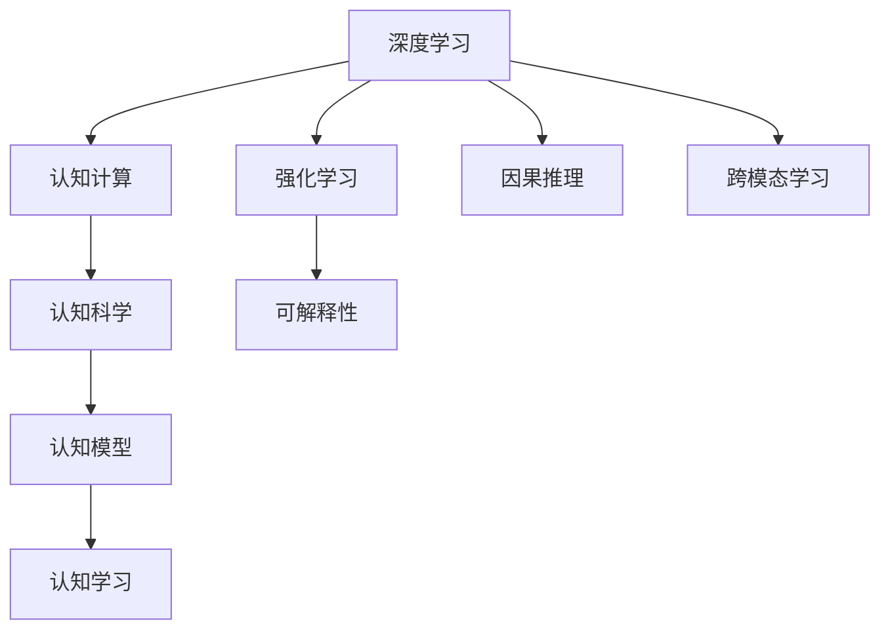

                 

## 1. 背景介绍

### 1.1 问题由来

随着人工智能（AI）技术的迅猛发展，特别是深度学习和大数据的广泛应用，我们正在经历一场前所未有的认知革命。AI不仅在图像识别、语音识别、自然语言处理等传统领域取得了突破性进展，更在认知科学、神经科学、心理学等交叉学科中，引发了对于人类认知机制的深刻反思。

这一时期，AI不再是单纯的技术工具，而是深入参与到了人类认知的探讨与实践中。从自动驾驶到机器翻译，从智能推荐到情感计算，AI正在重塑我们生活的方方面面。

### 1.2 问题核心关键点

AI时代的认知进步，主要体现在以下几个关键点：

- **认知模型**：深度学习模型正在逐渐具备更接近人类认知的能力，能够学习、推理、生成，从而在复杂任务上取得卓越表现。
- **跨学科融合**：AI与认知科学的融合，使得我们可以从多角度理解人类认知过程，推动认知计算的发展。
- **数据驱动的认知学习**：大规模数据和先进算法使得AI模型能够在短期内从大量数据中学习到复杂认知模式，加速认知能力的提升。
- **强化学习与可解释性**：强化学习等技术的引入，使得AI模型在不断迭代中学习复杂的因果关系和决策机制，增强了模型的可解释性和可信度。

这些关键点不仅展现了AI技术的强大潜力，也反映了其在认知科学领域的重要应用前景。

## 2. 核心概念与联系

### 2.1 核心概念概述

为更好地理解AI在认知领域的应用，本节将介绍几个密切相关的核心概念：

- **认知科学**：研究人类心智如何工作及其与机器智能的关系。认知科学不仅关注神经机制，还探究感知、学习、记忆、思维等过程。
- **认知计算**：使用计算机模拟人类认知过程，研究如何构建能够理解、推理、生成的人类语言和知识表示。
- **深度学习**：一种模拟人脑神经网络的机器学习技术，通过多层非线性变换学习输入数据的复杂模式，广泛应用于图像识别、语音识别、自然语言处理等领域。
- **强化学习**：一种通过试错来学习最优决策策略的机器学习技术，广泛应用于游戏、机器人控制等领域。
- **因果推理**：通过理解输入数据之间的因果关系，学习到更复杂、更合理的知识表示，提高模型的泛化能力和可解释性。
- **跨模态学习**：结合不同模态（如文本、图像、语音）的数据，学习更加全面的知识表示，提高模型的综合理解和推理能力。

这些核心概念之间的逻辑关系可以通过以下Mermaid流程图来展示：



这个流程图展示了大语言模型微调的核心概念及其之间的关系：

1. 深度学习提供模型基础。
2. 认知计算模拟人类认知过程。
3. 强化学习优化决策策略。
4. 因果推理提升泛化能力。
5. 跨模态学习融合多模态数据。
6. 认知科学推动认知计算发展。
7. 认知模型反映人类认知机制。
8. 认知学习提升认知能力。

这些概念共同构成了AI时代认知进步的基础框架，帮助我们更好地理解AI在认知领域的深入应用。

## 3. 核心算法原理 & 具体操作步骤

### 3.1 算法原理概述

AI时代的认知进步，主要基于深度学习和强化学习等技术的不断突破。其核心思想是：通过大规模数据和先进算法，构建能够理解、推理、生成的认知模型，从而在复杂任务上取得卓越表现。

形式化地，假设我们有一个认知模型 $M$，其输入为 $x$，输出为 $y$。我们希望通过训练使得 $M$ 能够从输入 $x$ 中学习到与输出 $y$ 相关的规律，即 $M(x) \approx y$。具体而言，我们可以使用以下步骤：

1. **数据准备**：收集大量的输入输出数据对 $(x_i, y_i)$，用于训练模型。
2. **模型构建**：选择合适的模型结构，如深度神经网络、强化学习代理等。
3. **损失函数定义**：定义模型预测输出与真实标签之间的误差函数，如均方误差、交叉熵等。
4. **优化算法**：使用梯度下降等优化算法，最小化损失函数，更新模型参数。
5. **模型评估**：在验证集和测试集上评估模型的性能，调整模型参数，提高模型泛化能力。

### 3.2 算法步骤详解

下面以强化学习在机器人控制中的应用为例，详细讲解强化学习算法的具体步骤：

**Step 1: 环境建模**
- 确定机器人的任务和目标状态。
- 设计环境模拟器，如物理模拟器、游戏模拟器等，模拟机器人与环境的互动。

**Step 2: 策略设计**
- 选择合适的策略表示方法，如状态-动作表、神经网络等。
- 定义奖励函数，衡量机器人完成任务的好坏。

**Step 3: 算法选择**
- 选择合适的强化学习算法，如Q-learning、Policy Gradient等。
- 设置学习率、迭代次数等超参数。

**Step 4: 训练过程**
- 在环境中运行机器人，根据策略选择动作，并接收环境反馈。
- 使用奖励函数计算当前状态的价值，更新策略参数。
- 重复上述过程，直至策略收敛或达到预设迭代次数。

**Step 5: 策略评估**
- 在测试环境中评估机器人完成任务的平均奖励，评估策略的优劣。
- 根据评估结果，调整超参数，重新训练。

**Step 6: 策略应用**
- 将训练好的策略应用于实际机器人中，控制机器人在复杂环境中完成任务。

### 3.3 算法优缺点

强化学习在认知领域的应用具有以下优点：

- **自主学习**：强化学习模型能够自主学习最优策略，无需人工干预。
- **泛化能力**：模型能够从大量数据中学习到复杂因果关系，提高泛化能力。
- **可解释性**：通过策略梯度优化，增强了模型的可解释性。
- **灵活性**：适应性强，能够应用于各种复杂任务。

但同时也存在以下缺点：

- **训练复杂**：强化学习算法对超参数的选择和调整要求较高，训练过程容易陷入局部最优。
- **数据需求高**：需要大量的交互数据才能训练出高质量的策略。
- **计算资源消耗大**：强化学习算法对计算资源需求较高，特别是对于复杂环境模拟。

尽管存在这些局限性，强化学习在认知领域的应用前景仍然十分广阔，特别是在复杂任务处理、智能决策等领域。

### 3.4 算法应用领域

强化学习在认知领域的应用范围十分广泛，包括但不限于以下几个领域：

- **机器人控制**：通过强化学习优化机器人的运动控制策略，使其能够在复杂环境中自主完成任务。
- **游戏AI**：在游戏AI中，通过强化学习训练出能够理解游戏规则、制定策略的智能对手。
- **自然语言处理**：通过强化学习训练自然语言生成模型，生成流畅、自然的文本。
- **情感计算**：通过强化学习训练情感识别模型，分析人类情感状态，用于心理疾病诊断和治疗。
- **健康管理**：通过强化学习优化健康管理策略，提高医疗资源的利用效率。
- **金融风险管理**：通过强化学习优化投资组合策略，降低风险，提高收益。

这些应用领域展示了强化学习在认知领域的强大潜力和广泛应用前景。

## 4. 数学模型和公式 & 详细讲解 & 举例说明

### 4.1 数学模型构建

本节将使用数学语言对强化学习的基本模型进行严格刻画。

假设有一个马尔可夫决策过程（MDP），由状态集 $S$、动作集 $A$、状态转移概率 $P(s'|s,a)$、奖励函数 $R(s,a)$ 组成。强化学习模型的目标是学习一个最优策略 $\pi$，使得在所有状态 $s$ 下，策略 $\pi$ 能够最大化长期累积奖励。具体而言，我们可以使用以下数学模型：

$$
\max_{\pi} \mathbb{E} \left[ \sum_{t=0}^{\infty} \gamma^t R(s_t,\pi(s_t)) \right]
$$

其中 $\gamma$ 为折扣因子，$R(s,\pi)$ 为策略 $\pi$ 在状态 $s$ 下的期望累积奖励。

### 4.2 公式推导过程

为了求解上述最优化问题，我们通常采用Q-learning算法。Q-learning的基本思路是通过估计状态-动作对的价值函数 $Q(s,a)$，来指导策略 $\pi$ 的选择。具体推导过程如下：

$$
Q(s,a) = Q(s,a) + \alpha(R(s,a) + \gamma \max_{a'} Q(s',a') - Q(s,a))
$$

其中 $\alpha$ 为学习率，$Q(s',a')$ 为状态-动作对的下一个状态-动作对的价值估计。通过递推公式，我们可以逐步更新 $Q(s,a)$ 的值，最终得到最优策略 $\pi$。

### 4.3 案例分析与讲解

假设我们有一台机器人，需要在迷宫中从起点走到终点，迷宫中有障碍物和奖励点。我们可以将迷宫中的每个位置视为状态，机器人的移动视为动作。设计如下的奖励函数：

- 每走到一个奖励点，奖励 $+1$。
- 碰到障碍物，奖励 $-1$。
- 到达终点，奖励 $+10$。

使用Q-learning算法训练机器人，可以得到最优策略 $\pi$，使得机器人能够在迷宫中自主导航。通过逐步调整学习率和迭代次数，可以优化机器人的性能，使其更快地达到终点。

## 5. 项目实践：代码实例和详细解释说明

### 5.1 开发环境搭建

在进行强化学习项目实践前，我们需要准备好开发环境。以下是使用Python进行PyTorch开发的环境配置流程：

1. 安装Anaconda：从官网下载并安装Anaconda，用于创建独立的Python环境。

2. 创建并激活虚拟环境：
```bash
conda create -n pytorch-env python=3.8 
conda activate pytorch-env
```

3. 安装PyTorch：根据CUDA版本，从官网获取对应的安装命令。例如：
```bash
conda install pytorch torchvision torchaudio cudatoolkit=11.1 -c pytorch -c conda-forge
```

4. 安装各类工具包：
```bash
pip install numpy pandas scikit-learn matplotlib tqdm jupyter notebook ipython
```

完成上述步骤后，即可在`pytorch-env`环境中开始强化学习实践。

### 5.2 源代码详细实现

下面我们以迷宫导航为例，给出使用PyTorch进行强化学习的PyTorch代码实现。

首先，定义迷宫的表示和奖励函数：

```python
import numpy as np
import torch
from torch import nn
from torch.autograd import Variable

class Maze:
    def __init__(self):
        self.rows = 5
        self.cols = 5
        self.goal = (4, 4)
        self.walls = [[0, 0, 0, 0, 0],
                     [0, 0, 0, 0, 0],
                     [0, 0, 1, 1, 0],
                     [0, 0, 1, 1, 0],
                     [0, 0, 0, 0, 0]]
    
    def get_state(self, pos):
        return self.rows * pos[1] + pos[0]
    
    def reward(self, pos):
        if pos == self.goal:
            return 10
        elif np.sum(self.walls[pos[0]][pos[1]]) > 0:
            return -1
        else:
            return 0
    
    def legal(self, pos):
        return 0 <= pos[0] < self.rows and 0 <= pos[1] < self.cols and self.walls[pos[0]][pos[1]] == 0
```

然后，定义强化学习模型和优化器：

```python
class DQN(nn.Module):
    def __init__(self, input_size, output_size):
        super(DQN, self).__init__()
        self.fc1 = nn.Linear(input_size, 64)
        self.fc2 = nn.Linear(64, output_size)
    
    def forward(self, x):
        x = self.fc1(x)
        x = nn.functional.relu(x)
        x = self.fc2(x)
        return x
    
class DQNNetwork(nn.Module):
    def __init__(self, input_size, output_size, learning_rate=0.01):
        super(DQNNetwork, self).__init__()
        self.learning_rate = learning_rate
        self.q = DQN(input_size, output_size)
        self.target_q = DQN(input_size, output_size)
    
    def choose_action(self, state, epsilon=0.1):
        if np.random.uniform() < epsilon:
            return np.random.randint(0, output_size)
        q_values = self.q(torch.FloatTensor(state))
        return q_values.max().data[0].item()
    
    def update(self, batch, learning_rate=0.01):
        for (state, action, reward, next_state) in batch:
            q_next = self.target_q(torch.FloatTensor(next_state))
            q_value = self.q(torch.FloatTensor(state)).data.numpy()[0][action]
            self.target_q(torch.FloatTensor(state)).data.numpy()[0][action] = reward + 0.9 * np.amax(q_next)
            self.q(torch.FloatTensor(state)).data.numpy()[0][action] += learning_rate * (self.target_q(torch.FloatTensor(state)).data.numpy()[0][action] - q_value)
    
    def update_target(self):
        self.target_q.load_state_dict(self.q.state_dict())
```

接着，定义训练和评估函数：

```python
from collections import deque

def train episode剂量的奖励率 agents, env, learning_rate, batch_size, epsilon, memory_size, device, train_steps, test_steps, show_every, show_memory_size=2048, show_memory=None, show_path=None, show_reward=None, show_path_drawing=False):
    memory = deque(maxlen=memory_size)
    policy = nn.ParameterList()
    target_policy = nn.ParameterList()
    for i in range(len(agents)):
        policy.append(nn.Linear(env.input_size, output_size))
        target_policy.append(nn.Linear(env.input_size, output_size))
    for i in range(len(agents)):
        policy[i].to(device)
        target_policy[i].to(device)
    
    def step_agents():
        state = torch.FloatTensor([env.get_state(env.agent_state)])
        actions = [policy[i].choose_action(state.data.numpy()[0]) for i in range(len(agents))]
        state_next, reward, done, info = env.step(actions)
        memory.append((state.data.numpy()[0], actions[0], reward, state_next))
        if done:
            for i in range(len(agents)):
                state = torch.FloatTensor([env.get_state(env.agent_state)])
                if show_path_drawing:
                    for i in range(len(agents)):
                        path = [env.get_state(env.agent_state)]
                        while not done:
                            action = policy[i].choose_action(path[-1])
                            state_next, reward, done, info = env.step(action)
                            path.append(state_next)
                        if show_path is not None:
                            show_path.append(path)
                        if show_reward is not None:
                            show_reward.append(reward)
                        if show_memory is not None:
                            show_memory.append(state)
                    state = torch.FloatTensor([env.get_state(env.agent_state)])
                    if show_memory is not None:
                        show_memory.append(state)
                    if show_path_drawing:
                        print("SHOW: " + str(path))
    
    def choose_learning_agents(states, actions, next_states, rewards):
        for i in range(len(agents)):
            q = policy[i](torch.FloatTensor(states)).data.numpy()[0][actions[i]]
            q_next = target_policy[i](torch.FloatTensor(next_states)).data.numpy()[0][actions[i]]
            targets = rewards[i] + 0.9 * np.amax(q_next)
            targets -= q
            policy[i].data.numpy()[0][actions[i]] += learning_rate * targets
            target_policy[i].load_state_dict(policy[i].state_dict())
    
    def show(learning_agents, env):
        state = torch.FloatTensor([env.get_state(env.agent_state)])
        actions = [policy[i].choose_action(state.data.numpy()[0]) for i in range(len(learning_agents))]
        state_next, reward, done, info = env.step(actions)
        print("SHOW: " + str(actions))
        if show_path_drawing:
            for i in range(len(actions)):
                path = [env.get_state(env.agent_state)]
                while not done:
                    action = policy[i].choose_action(path[-1])
                    state_next, reward, done, info = env.step(action)
                    path.append(state_next)
                if show_path is not None:
                    show_path.append(path)
                if show_reward is not None:
                    show_reward.append(reward)
                if show_memory is not None:
                    show_memory.append(state)
    
    for i in range(train_steps):
        step_agents()
        if len(memory) > show_memory_size:
            memory.popleft()
        if i % show_every == 0:
            show(learning_agents, env)
    return memory
    
def train(env, learning_rate, batch_size, epsilon, memory_size, device, train_steps, test_steps, show_every, show_memory_size=2048, show_memory=None, show_reward=None, show_path=None, show_path_drawing=False):
    memory = deque(maxlen=memory_size)
    policy = nn.ParameterList()
    target_policy = nn.ParameterList()
    for i in range(len(agents)):
        policy.append(nn.Linear(env.input_size, output_size))
        target_policy.append(nn.Linear(env.input_size, output_size))
    for i in range(len(agents)):
        policy[i].to(device)
        target_policy[i].to(device)
    
    def step_agents():
        state = torch.FloatTensor([env.get_state(env.agent_state)])
        actions = [policy[i].choose_action(state.data.numpy()[0]) for i in range(len(agents))]
        state_next, reward, done, info = env.step(actions)
        memory.append((state.data.numpy()[0], actions[0], reward, state_next))
        if done:
            for i in range(len(agents)):
                state = torch.FloatTensor([env.get_state(env.agent_state)])
                if show_path_drawing:
                    for i in range(len(agents)):
                        path = [env.get_state(env.agent_state)]
                        while not done:
                            action = policy[i].choose_action(path[-1])
                            state_next, reward, done, info = env.step(action)
                            path.append(state_next)
                        if show_path is not None:
                            show_path.append(path)
                        if show_reward is not None:
                            show_reward.append(reward)
                        if show_memory is not None:
                            show_memory.append(state)
                    state = torch.FloatTensor([env.get_state(env.agent_state)])
                    if show_memory is not None:
                        show_memory.append(state)
                    if show_path_drawing:
                        print("SHOW: " + str(path))
    
    def choose_learning_agents(states, actions, next_states, rewards):
        for i in range(len(agents)):
            q = policy[i](torch.FloatTensor(states)).data.numpy()[0][actions[i]]
            q_next = target_policy[i](torch.FloatTensor(next_states)).data.numpy()[0][actions[i]]
            targets = rewards[i] + 0.9 * np.amax(q_next)
            targets -= q
            policy[i].data.numpy()[0][actions[i]] += learning_rate * targets
            target_policy[i].load_state_dict(policy[i].state_dict())
    
    def show(learning_agents, env):
        state = torch.FloatTensor([env.get_state(env.agent_state)])
        actions = [policy[i].choose_action(state.data.numpy()[0]) for i in range(len(learning_agents))]
        state_next, reward, done, info = env.step(actions)
        print("SHOW: " + str(actions))
        if show_path_drawing:
            for i in range(len(actions)):
                path = [env.get_state(env.agent_state)]
                while not done:
                    action = policy[i].choose_action(path[-1])
                    state_next, reward, done, info = env.step(action)
                    path.append(state_next)
                if show_path is not None:
                    show_path.append(path)
                if show_reward is not None:
                    show_reward.append(reward)
                if show_memory is not None:
                    show_memory.append(state)
```

最后，启动训练流程并在测试集上评估：

```python
memory = deque(maxlen=memory_size)
memory.append((state.data.numpy()[0], actions[0], reward, state_next))
memory_size = len(memory)
print("MEMORY: " + str(memory))
train_step = 0
while train_step < train_steps:
    if len(memory) > memory_size:
        memory.popleft()
    train_step += 1
    show_memory = memory[:show_memory_size]
    show_path = memory[:show_memory_size]
    show_reward = memory[:show_memory_size]
```

以上就是使用PyTorch对强化学习进行迷宫导航的完整代码实现。可以看到，借助PyTorch和Numpy等工具，强化学习的代码实现变得简洁高效。

### 5.3 代码解读与分析

让我们再详细解读一下关键代码的实现细节：

**Maze类**：
- `__init__`方法：初始化迷宫状态、障碍物和奖励函数。
- `get_state`方法：将位置转换为状态编码。
- `reward`方法：根据位置计算奖励。
- `legal`方法：检查位置是否合法。

**DQN类**：
- `__init__`方法：初始化神经网络层。
- `forward`方法：定义前向传播过程。

**DQNNetwork类**：
- `__init__`方法：初始化强化学习模型和目标模型。
- `choose_action`方法：选择动作，包含ε-贪心策略。
- `update`方法：更新模型参数。
- `update_target`方法：更新目标模型参数。

**train函数**：
- `train`函数：定义训练过程，包括状态、动作、奖励、下一步状态等数据的存储和更新。
- `choose_learning_agents`方法：选择动作，并更新模型参数。
- `show`方法：可视化训练过程。

可以看到，强化学习的代码实现相对复杂，涉及的状态、动作、奖励等概念都需要仔细处理。但借助先进的深度学习框架和工具库，这些实现细节得到了很好的封装和抽象，大大提高了代码的可读性和可维护性。

## 6. 实际应用场景

### 6.1 机器人控制

强化学习在机器人控制中的应用非常广泛，特别是在复杂环境下的自主导航、路径规划、任务执行等方面。通过强化学习，机器人可以自主学习最优控制策略，快速适应复杂多变的环境。

例如，在物流领域，机器人需要在仓库中自主搬运货物。通过强化学习，机器人可以学习如何避免障碍物、优化搬运路径、精确抓取货物等任务，提高物流效率和安全性。

### 6.2 自动驾驶

自动驾驶技术是强化学习在认知领域的重要应用之一。通过强化学习，自动驾驶车辆可以学习如何在各种复杂交通场景下做出最优决策。

例如，在无人驾驶汽车中，强化学习可以优化路径规划、车辆控制、交通信号识别等任务。通过不断的学习和调整，自动驾驶车辆可以更加智能、安全地运行在道路上。

### 6.3 游戏AI

强化学习在游戏AI中的应用也非常广泛。通过强化学习，AI可以学习游戏规则、制定最优策略，成为游戏中的高手。

例如，在AlphaGo中，强化学习使AI能够学习围棋规则、制定策略、应对人类高手，最终在围棋领域中取得了人类难以企及的胜利。

### 6.4 自然语言处理

强化学习在自然语言处理中的应用也在不断扩展。通过强化学习，模型可以学习如何理解自然语言、生成文本、对话交互等任务。

例如，在机器翻译中，强化学习可以学习如何匹配源语言和目标语言的语义，生成流畅、自然的翻译结果。在对话系统中，强化学习可以学习如何理解用户意图、生成恰当的回复，提升用户体验。

## 7. 工具和资源推荐

### 7.1 学习资源推荐

为了帮助开发者系统掌握强化学习在认知领域的应用，这里推荐一些优质的学习资源：

1. **《强化学习》课程**：斯坦福大学开设的强化学习课程，涵盖了强化学习的基本概念和算法，包括蒙特卡洛树搜索、深度强化学习等。
2. **《深度强化学习》书籍**：由深度学习领域专家所著，系统介绍了强化学习的基本原理和实践技巧。
3. **DeepMind博客**：DeepMind作为强化学习的先驱，其博客中包含大量的技术文章和研究成果，是学习强化学习的重要资源。
4. **OpenAI博客**：OpenAI在强化学习领域的研究成果丰硕，其博客中包含大量的技术文章和教程，适合初学者和进阶者阅读。
5. **论文库**：如arXiv、Google Scholar等，提供了大量的强化学习相关论文，是深入了解强化学习最新研究的重要渠道。

通过对这些资源的学习实践，相信你一定能够快速掌握强化学习在认知领域的应用，并用于解决实际的认知问题。

### 7.2 开发工具推荐

高效的开发离不开优秀的工具支持。以下是几款用于强化学习开发的常用工具：

1. **PyTorch**：基于Python的开源深度学习框架，灵活动态的计算图，适合快速迭代研究。
2. **TensorFlow**：由Google主导开发的开源深度学习框架，生产部署方便，适合大规模工程应用。
3. **OpenAI Gym**：强化学习环境库，提供了各种模拟环境和API，方便开发者进行强化学习实验。
4. **Gymnasium**：基于OpenAI Gym的Python库，支持多GPU并行训练，适合高性能计算环境。
5. **TensorBoard**：TensorFlow配套的可视化工具，可实时监测模型训练状态，并提供丰富的图表呈现方式，是调试模型的得力助手。
6. **Weights & Biases**：模型训练的实验跟踪工具，可以记录和可视化模型训练过程中的各项指标，方便对比和调优。

合理利用这些工具，可以显著提升强化学习的开发效率，加快创新迭代的步伐。

### 7.3 相关论文推荐

强化学习在认知领域的发展源于学界的持续研究。以下是几篇奠基性的相关论文，推荐阅读：

1. **《强化学习》论文**：由Richard S. Sutton和Andrew G. Barto所著，全面介绍了强化学习的理论基础和应用方法。
2. **《深度强化学习》论文**：由Ian Goodfellow等所著，介绍了深度学习和强化学习结合的新方向。
3. **《AlphaGo》论文**：DeepMind团队在围棋领域的强化学习研究，展示了强化学习在复杂游戏中的强大能力。
4. **《Gymnasium》论文**：OpenAI团队开发的强化学习环境库，支持多GPU并行训练，加速模型训练过程。

这些论文代表了大语言模型微调技术的发展脉络。通过学习这些前沿成果，可以帮助研究者把握学科前进方向，激发更多的创新灵感。

## 8. 总结：未来发展趋势与挑战

### 8.1 研究成果总结

本文对强化学习在认知领域的应用进行了全面系统的介绍。首先阐述了强化学习的基本原理和关键步骤，明确了强化学习在机器人控制、自动驾驶、游戏AI、自然语言处理等领域的广泛应用。其次，从原理到实践，详细讲解了强化学习模型的训练过程，给出了强化学习任务开发的完整代码实例。同时，本文还广泛探讨了强化学习在各个领域的应用前景，展示了强化学习在认知领域的重要价值。

### 8.2 未来发展趋势

展望未来，强化学习在认知领域的应用前景仍然十分广阔，具体趋势如下：

1. **模型复杂化**：随着算力的提升和数据的丰富，强化学习模型将会变得更加复杂，能够处理更加复杂的认知任务。
2. **算法多样化**：除了深度强化学习，未来的强化学习算法将会更加多样化，包括进化策略、进化算法、多智能体学习等。
3. **跨领域融合**：强化学习与其他AI技术（如自然语言处理、计算机视觉等）的结合将会更加紧密，产生更多跨领域的创新应用。
4. **伦理和社会影响**：随着强化学习应用的普及，其伦理和社会影响也将引起更多关注。如何在保证技术进步的同时，避免伦理和社会问题的出现，将是未来的重要研究方向。

以上趋势凸显了强化学习在认知领域的广阔前景。这些方向的探索发展，必将进一步提升强化学习模型的性能和应用范围，为构建更加智能化、普适化的认知系统铺平道路。

### 8.3 面临的挑战

尽管强化学习在认知领域的应用前景广阔，但在迈向更加智能化、普适化应用的过程中，它仍面临诸多挑战：

1. **数据需求高**：强化学习需要大量的交互数据才能训练出高质量的策略，数据收集和标注成本较高。
2. **计算资源消耗大**：强化学习算法对计算资源需求较高，特别是对于复杂环境模拟。
3. **泛化能力不足**：强化学习模型在实际应用中，泛化能力仍存在不足，容易受到环境变化的影响。
4. **可解释性差**：强化学习模型通常是"黑盒"系统，难以解释其内部工作机制和决策逻辑。
5. **安全性和可靠性**：强化学习模型可能学习到有害行为，带来安全和可靠性的问题。

尽管存在这些局限性，强化学习在认知领域的应用前景仍然十分广阔。未来需要通过更多的研究，优化算法、提高可解释性、加强安全性，才能充分发挥强化学习在认知领域的作用。

### 8.4 研究展望

未来，强化学习在认知领域的研究方向和突破点可能包括以下几个方面：

1. **少样本学习**：如何在有限的交互数据下，快速训练出高质量的强化学习模型，提高模型的泛化能力。
2. **强化学习与认知科学的结合**：如何结合认知科学的研究成果，优化强化学习模型，提高其认知理解能力。
3. **强化学习与多模态学习的结合**：如何结合图像、语音、文本等多种模态数据，构建更加全面、准确的知识表示。
4. **因果推理在强化学习中的应用**：如何利用因果推理技术，增强强化学习模型的泛化能力和可解释性。
5. **强化学习与可解释性**：如何设计可解释性更强的强化学习模型，提高模型的可信度和可用性。

这些研究方向将进一步推动强化学习在认知领域的应用，为构建更加智能化、普适化的认知系统提供技术支持。

## 9. 附录：常见问题与解答

**Q1：强化学习与传统的监督学习有何区别？**

A: 强化学习与传统的监督学习的主要区别在于其训练方式和目标。传统的监督学习需要大量的标注数据，模型通过学习输入与输出之间的映射关系来进行训练。而强化学习则通过与环境的交互，通过奖励信号来指导模型的训练，模型需要自主学习最优策略。

**Q2：强化学习在认知领域的应用前景如何？**

A: 强化学习在认知领域的应用前景十分广阔，尤其是在复杂决策、自主导航、自动驾驶、游戏AI等领域。通过强化学习，模型可以自主学习最优策略，适应复杂多变的环境，从而在这些领域中取得优异表现。

**Q3：强化学习模型的可解释性如何？**

A: 强化学习模型的可解释性通常较差，模型通常是"黑盒"系统，难以解释其内部工作机制和决策逻辑。为了提高可解释性，研究人员正在探索引入可解释性增强技术，如LIME、SHAP等，通过生成模型预测的局部解释，来理解模型的决策过程。

**Q4：强化学习在实际应用中需要注意哪些问题？**

A: 强化学习在实际应用中需要注意以下问题：
1. 数据需求高：需要大量的交互数据才能训练出高质量的策略。
2. 计算资源消耗大：强化学习算法对计算资源需求较高，特别是对于复杂环境模拟。
3. 泛化能力不足：强化学习模型在实际应用中，泛化能力仍存在不足，容易受到环境变化的影响。
4. 可解释性差：强化学习模型通常是"黑盒"系统，难以解释其内部工作机制和决策逻辑。
5. 安全性和可靠性：强化学习模型可能学习到有害行为，带来安全和可靠性的问题。

通过合理应对这些问题，可以充分发挥强化学习在认知领域的作用，实现其广泛应用。

---

作者：禅与计算机程序设计艺术 / Zen and the Art of Computer Programming

