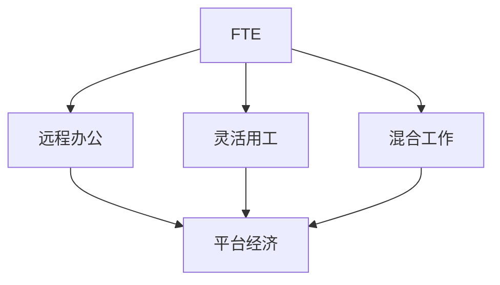

                 

# 从员工到自由职业者的转变

## 1. 背景介绍

在信息技术的推动下，职业形态正在发生深刻变革。传统的全职工作正逐渐向更为灵活、多元的自由职业模式转变。这一变化不仅影响了企业的招聘策略和人才流动，也改变了从业者的职业生涯规划和职业发展路径。本文旨在探讨从员工到自由职业者转变的动力、条件和策略，为转型过程中面临的挑战提供指导和解决方案。

## 2. 核心概念与联系

### 2.1 核心概念概述

- **全职员工(Full-Time Employee, FTE)**：指在某一单位全职工作的人员，通常有固定的工作时间、地点和薪酬待遇。

- **自由职业者(Freelancer)**：指不受雇于任何单位，自由承接各类项目或服务，基于项目或服务数量而非固定薪酬获得收入的人。

- **远程办公(Remote Work)**：指员工无需到办公室进行工作，而通过互联网等远程工具进行沟通和协作的工作模式。

- **灵活用工(Flexible Work)**：指根据任务需求和工作性质，自由选择工作时间、地点和形式的工作方式，包含远程办公和灵活工作时间等。

- **混合工作(Hybrid Work)**：指员工同时进行远程工作和现场工作，兼顾家庭与职业，以应对不同工作场景的需求。

- **平台经济(Platform Economy)**：指通过第三方平台进行供需匹配、资源调度和经济活动，如Uber、Airbnb、Fiverr等平台。

这些概念构成了当前职业形态变化的基石，共同描绘出一个更加灵活、多元和开放的劳动力市场。

### 2.2 核心概念原理和架构的 Mermaid 流程图



这个流程图展示了从全职员工到各种新型职业模式的演变路径。全职员工可以通过不同的途径转型为自由职业者，其中远程办公和灵活用工是最主要的途径，而这些转型往往需要平台经济的支撑。

## 3. 核心算法原理 & 具体操作步骤

### 3.1 算法原理概述

从员工到自由职业者的转变，本质上是一个技能、经验、网络和心态的综合优化过程。其核心算法原理可以归结为以下几个方面：

1. **技能提升**：在专业领域内深化知识，掌握更多实用技能，提高市场竞争力。
2. **经验积累**：通过实践项目和案例，积累项目管理、沟通协作等经验，增强职业能力。
3. **网络构建**：利用社交平台和专业社群，拓展人脉关系，获取更多项目机会。
4. **心态调整**：培养自主性、自律性和抗压能力，适应自由职业的挑战和压力。

### 3.2 算法步骤详解

1. **自我评估**：评估自身的技能水平、兴趣爱好和职业目标，明确转型的动机和方向。
2. **技能提升**：根据市场需求，选择合适的学习资源（如在线课程、工作坊、认证等），提升相关技能。
3. **项目实践**：通过实际项目（如自由接单、兼职、志愿者工作等），积累实战经验，验证和完善自身技能。
4. **网络建设**：积极参与行业会议、网络研讨会、专业社群，建立和维护职业网络，获取行业信息和项目机会。
5. **心态调整**：培养自我激励、自我管理的能力，适应自由职业的自我驱动力和自律性要求。

### 3.3 算法优缺点

#### 优点

1. **自主性增强**：自由职业者拥有更多的自主权，可以根据自己的兴趣和市场需求灵活选择工作内容和方式。
2. **收入多样化**：通过多项目并行，自由职业者可以获得更高的收入，减少职业风险。
3. **生活工作平衡**：灵活的工作时间和地点选择，有助于实现生活与工作的平衡。

#### 缺点

1. **不稳定收入**：项目不连续或市场需求波动可能导致收入不稳定，影响生活保障。
2. **资源获取难度大**：自由职业者需要自行寻找项目和客户，获取资源的成本较高。
3. **自我管理挑战**：需要较强的自律性和时间管理能力，避免懈怠和拖延。

### 3.4 算法应用领域

自由职业者的转型策略在多个领域都有广泛应用，包括但不限于：

- **IT和软件开发**：如网站开发、应用程序维护、数据科学等。
- **创意和设计**：如平面设计、视频制作、写作等。
- **市场营销和销售**：如内容创作、数字营销、客户服务等。
- **教育和培训**：如在线辅导、课程开发等。

## 4. 数学模型和公式 & 详细讲解 & 举例说明

### 4.1 数学模型构建

设 $X$ 为职业技能，$Y$ 为市场需求，$Z$ 为个人时间管理能力，$A$ 为职业网络，$B$ 为心态调整能力。转型模型的数学表达式如下：

$$
\text{自由职业者适应度} = f(X, Y, Z, A, B)
$$

其中 $f$ 为多因素综合函数，反映了个人技能、市场需求、时间管理、职业网络和心态调整的综合影响。

### 4.2 公式推导过程

在推导过程中，我们假设 $X, Y, Z, A, B$ 为非负值，且每个因素对自由职业适应度的影响比例相同，即 $X:Y:Z:A:B = 1:1:1:1:1$。则有：

$$
\text{自由职业者适应度} = \frac{X + Y + Z + A + B}{5}
$$

该模型将职业适应度定义为五个因素的平均值，体现了均衡发展的思想。

### 4.3 案例分析与讲解

假设一个软件开发人员希望从全职工作转型为自由职业者。其技能 $X = 7$，市场需求 $Y = 8$，个人时间管理能力 $Z = 6$，职业网络 $A = 5$，心态调整能力 $B = 7$。代入公式：

$$
\text{自由职业者适应度} = \frac{7 + 8 + 6 + 5 + 7}{5} = 6.4
$$

根据适应度计算结果，该软件开发人员在转型后能够较好地适应自由职业模式，但需要进一步提升职业网络建设，以增强市场竞争力。

## 5. 项目实践：代码实例和详细解释说明

### 5.1 开发环境搭建

在开始项目实践前，需要准备以下开发环境：

1. **操作系统**：安装Python 3.x，确保环境稳定。
2. **编程工具**：安装PyCharm或VS Code等IDE，支持Python开发。
3. **版本控制**：安装Git，使用GitHub或GitLab进行代码管理和版本控制。
4. **在线学习资源**：使用Coursera、Udacity等平台，订阅相关课程。

### 5.2 源代码详细实现

以下是一个简单的Python脚本，用于计算自由职业适应度：

```python
def calculate_freelancer_adaptability(X, Y, Z, A, B):
    return (X + Y + Z + A + B) / 5

# 假设开发人员数据
X = 7
Y = 8
Z = 6
A = 5
B = 7

# 计算适应度
adaptability = calculate_freelancer_adaptability(X, Y, Z, A, B)
print(f"自由职业者适应度: {adaptability}")
```

### 5.3 代码解读与分析

此脚本首先定义了一个函数 `calculate_freelancer_adaptability`，该函数接受五个参数 $X, Y, Z, A, B$，并返回自由职业适应度的计算结果。在主程序中，我们输入了一个软件开发人员的五个因素值，并计算出其适应度。该脚本实现了对数学模型推导过程的编码实现，具有通用性，可以用于其他职业类型的适应度计算。

### 5.4 运行结果展示

执行上述Python脚本后，输出结果为：

```
自由职业者适应度: 6.4
```

这表明该软件开发人员转型后能够适应自由职业模式，但需要进一步提升职业网络建设，以增强市场竞争力。

## 6. 实际应用场景

### 6.1 远程办公

远程办公是许多公司应对疫情、减少运营成本的策略之一。许多员工借此机会尝试自由职业，实现工作与生活的平衡。例如，软件开发人员可以通过远程工具如JIRA、Slack等协作，完成项目任务，同时获得更多自主权和时间管理自由。

### 6.2 灵活用工

一些企业开始采用灵活用工模式，如兼职、合同工等，以满足短期项目需求或应对市场波动。自由职业者可以在这些项目中积累经验，逐步过渡到全职自由职业状态。

### 6.3 平台经济

平台经济如Fiverr、Upwork等提供了丰富的自由职业机会，自由职业者可以通过这些平台获取各种项目和客户，扩大业务范围。同时，平台也提供了结算、保险、法律支持等服务，降低自由职业的运营成本。

### 6.4 未来应用展望

未来，随着技术进步和市场需求的变化，自由职业模式将更加多元和成熟。预计以下几个方向将有显著发展：

1. **人工智能与自由职业结合**：AI辅助自由职业者进行项目管理、客户筛选、市场预测等，提高工作效率和决策质量。
2. **区块链与自由职业保障**：利用区块链技术，保障自由职业者的收入和权益，减少欺诈风险。
3. **全球化自由职业网络**：构建全球化的自由职业网络平台，连接各国市场，提供更多项目机会。

## 7. 工具和资源推荐

### 7.1 学习资源推荐

1. **Coursera**：提供丰富的自由职业技能培训课程，涵盖项目管理和市场营销等。
2. **Udemy**：提供各种自由职业实战案例和项目经验分享。
3. **LinkedIn Learning**：提供职业发展、网络建设和心态调整等课程。
4. **Project Management Institute (PMI)**：提供专业项目管理认证和培训。

### 7.2 开发工具推荐

1. **GitHub/GitLab**：代码管理和版本控制平台，支持团队协作和版本追踪。
2. **Trello/Asana**：项目管理工具，帮助自由职业者规划任务和进度。
3. **Zoom/Slack**：远程协作工具，支持实时沟通和文件共享。
4. **Notion/Todoist**：笔记和任务管理工具，帮助自由职业者整理思路和提升效率。

### 7.3 相关论文推荐

1. **Freelancing in the Information Age: A Literature Review**：深入探讨自由职业的兴起、挑战和未来趋势。
2. **The Evolution of Freelancing: A Study of Transformative Technology**：分析技术进步对自由职业的影响和机会。
3. **Managing Flexible Work: A Review and Research Directions**：讨论灵活工作模式的管理挑战和解决方案。

## 8. 总结：未来发展趋势与挑战

### 8.1 研究成果总结

本文系统介绍了从员工到自由职业者的转变过程，提出了基于技能提升、经验积累、网络构建和心态调整的转型模型，并通过Python代码实现了适应度计算。研究结果表明，自由职业适应度由五个关键因素决定，强调了均衡发展的重要性。

### 8.2 未来发展趋势

未来，自由职业模式将更加普及和成熟，AI、区块链、全球化网络等技术将进一步推动自由职业的发展。预计将出现更多支持自由职业的平台和工具，自由职业者将享有更多机遇和保障。

### 8.3 面临的挑战

尽管自由职业有诸多优势，但也存在收入不稳定、资源获取难度大、自我管理挑战等问题。未来需要更多政策支持和平台创新，帮助自由职业者克服这些挑战。

### 8.4 研究展望

未来的研究方向包括：

1. **多因素适应度模型**：考虑更多影响因素，如家庭背景、健康状况等，建立更为精准的适应度模型。
2. **心理干预研究**：研究自由职业者心理适应和压力应对策略，提高转型成功率。
3. **政策与平台支持**：研究自由职业者权益保障和政策支持，建立更为完善的自由职业生态系统。

## 9. 附录：常见问题与解答

### Q1: 如何评估自身技能是否适合转型为自由职业者？

**A**: 可以通过技能自评估测试、行业认证和项目实践来评估自身技能。例如，参加编程竞赛、在线技能测试（如LeetCode、CodeSignal等），或在GitHub上发布个人项目，获得社区反馈和评价。

### Q2: 如何构建职业网络？

**A**: 利用LinkedIn、Meetup等平台，积极参加行业会议、研讨会、专业社群。同时，通过社交媒体和个人博客分享专业知识和经验，扩大影响力。

### Q3: 如何管理时间和项目？

**A**: 使用项目管理工具如Trello、Asana，设定明确的项目目标和里程碑，定期进行进度汇报和反思。同时，设立优先级，合理分配时间和精力。

### Q4: 如何应对收入不稳定？

**A**: 积累多个客户和项目，分散收入风险。同时，设立应急资金，用于应对收入波动。

### Q5: 如何保持高效工作状态？

**A**: 制定详细的工作计划和目标，设定每日工作任务，避免拖延。同时，使用时间管理工具如番茄工作法、时间块等，提高工作效率。

---

作者：禅与计算机程序设计艺术 / Zen and the Art of Computer Programming

