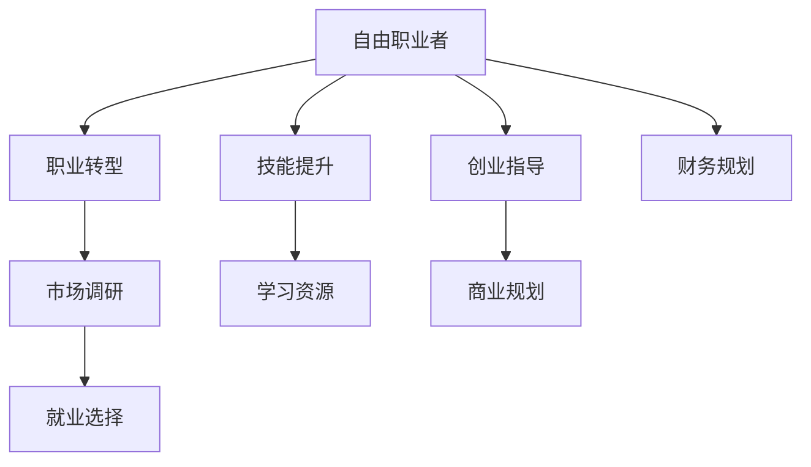

                 

# 从员工到自由职业者的转型指南

> 关键词：职业转型,自由职业,自我驱动,技能提升,创业指导,财务规划

## 1. 背景介绍

### 1.1 问题由来
随着技术进步和市场变化，越来越多的职场人开始考虑转型为自由职业者。自由职业者能够自主选择工作时间、地点和项目，实现自我价值最大化。然而，从传统职场到自由职业者的转变并非易事，需要系统性的规划和准备。本文将从职业转型、技能提升、财务规划等多个维度，提供一份详尽的自由职业者转型指南，帮助职场人成功迈向自由职业之路。

## 2. 核心概念与联系

### 2.1 核心概念概述

为了更好地理解自由职业者的转型过程，首先明确几个核心概念：

- **自由职业者(Freelancer)**：独立于任何公司或组织的个人，通过提供专业技能或服务获得报酬的职业者。
- **职业转型(Career Transition)**：职场人从现有工作转向新职业的过程，通常涉及技能提升、市场调研、就业选择等环节。
- **自我驱动(Self-Driven)**：依靠内在动力和主动性，自主决策、规划和管理个人职业发展的能力。
- **技能提升(Skill Enhancement)**：通过学习、培训等方式，提升个人专业技能和软技能的实践。
- **创业指导(Entrepreneurial Guidance)**：为有意创业的个人提供的商业规划、市场分析、管理策略等方面的指导和帮助。
- **财务规划(Financial Planning)**：合理规划和管理个人或企业的财务资源，确保资金的充足和稳定。

这些概念之间的联系紧密，共同构成了自由职业者转型的基础框架。只有全面理解并运用这些概念，职场人才能顺利实现职业转型，成为成功的自由职业者。

### 2.2 核心概念原理和架构的 Mermaid 流程图



## 3. 核心算法原理 & 具体操作步骤

### 3.1 算法原理概述

自由职业者的转型过程可以看作是一个多阶段、多维度优化的系统工程。其核心算法原理包括以下几个方面：

- **职业匹配算法**：通过分析个人技能、兴趣和市场需求，找到最佳匹配的职业。
- **技能评估算法**：对现有技能进行评估，识别需要提升或学习的领域。
- **市场调研算法**：分析市场趋势和竞争环境，确定自由职业者的定位和目标客户群体。
- **财务预算算法**：制定合理的财务预算，确保资金的合理分配和使用。
- **项目管理算法**：通过时间管理和任务分配，高效完成多个项目，保证收入稳定。

### 3.2 算法步骤详解

#### 3.2.1 职业匹配算法

1. **自我评估**：识别个人的技能、兴趣、价值观和职业倾向。可以使用SWOT分析法（Strengths, Weaknesses, Opportunities, Threats）进行自我评估。
2. **市场需求调研**：分析当前市场对自由职业者的需求，了解哪些技能需求量大，哪些行业增长潜力大。
3. **职业选择**：根据自我评估和市场调研结果，选择最适合的自由职业方向，如软件开发、设计、写作等。

#### 3.2.2 技能评估算法

1. **技能盘点**：列出当前具备的专业技能和个人技能，包括技术技能、软技能等。
2. **技能差距分析**：识别目标职业所需技能与现有技能的差距，找出需要提升或学习的领域。
3. **学习规划**：制定学习计划，选择合适的课程、证书或项目进行技能提升，如参加在线课程、参加培训等。

#### 3.2.3 市场调研算法

1. **行业趋势分析**：研究目标行业的发展趋势和市场需求，识别潜在的增长点和变化。
2. **竞争环境分析**：分析竞争对手的优势和劣势，确定自己的市场定位和竞争策略。
3. **客户群体分析**：识别目标客户群体的特点和需求，制定相应的市场营销策略。

#### 3.2.4 财务预算算法

1. **收入预算**：根据市场调研和技能评估结果，制定合理的收入目标和预算，确保能够覆盖生活成本和运营成本。
2. **支出预算**：规划必要的支出，如设备购置、办公空间租赁、市场营销费用等。
3. **资金管理**：制定资金管理策略，确保资金的充足和有效使用，如开设储蓄账户、使用财务管理工具等。

#### 3.2.5 项目管理算法

1. **任务分配**：根据项目需求和个人能力，合理分配任务和时间，确保高效完成每个项目。
2. **时间管理**：制定时间管理计划，合理安排工作和生活，避免过度疲劳和低效工作。
3. **质量控制**：实施质量控制措施，确保交付的成果符合客户需求和标准。

### 3.3 算法优缺点

#### 3.3.1 优点

- **自主性高**：自由职业者能够自主安排工作时间、地点和项目，实现自我价值最大化。
- **灵活性强**：可以自由选择项目，接触不同行业和客户，积累多样化经验。
- **收入多样化**：通过多项目、多渠道获得收入，降低单一收入来源的风险。

#### 3.3.2 缺点

- **不稳定收入**：项目数量和客户需求的变化可能导致收入波动。
- **孤独感**：缺乏团队合作和社交支持，可能导致孤独感。
- **自我管理要求高**：需要较强的自律和自我管理能力，避免拖延和低效。

### 3.4 算法应用领域

自由职业者的转型过程涉及多个领域，包括职业规划、技能提升、市场调研、财务管理等。具体应用如下：

- **人力资源领域**：通过职业匹配算法和市场调研算法，帮助员工选择最适合的自由职业方向。
- **教育培训领域**：利用技能评估算法和技能提升算法，为职场人提供系统的职业培训和技能提升课程。
- **财务管理领域**：结合财务预算算法和资金管理策略，为自由职业者提供科学的财务管理建议。
- **企业咨询领域**：提供创业指导和项目管理算法，帮助企业制定灵活高效的运营策略。

## 4. 数学模型和公式 & 详细讲解 & 举例说明

### 4.1 数学模型构建

自由职业者的转型过程可以构建以下数学模型：

- **职业匹配模型**：
  $$
  M(x, y) = \max\limits_{z \in X} (f(z, y) - c(z))
  $$
  其中，$M(x, y)$表示匹配函数，$x$为员工的技能和兴趣，$y$为市场需求，$z$为潜在的自由职业方向，$f(z, y)$为满足需求的匹配程度，$c(z)$为匹配成本。

- **技能评估模型**：
  $$
  S(x, t) = \sum\limits_{i=1}^n (a_i \times (b_i - c_i))
  $$
  其中，$S(x, t)$表示技能评估函数，$x$为员工现有技能，$t$为目标职业所需技能，$a_i$为技能权重，$b_i$为技能水平，$c_i$为提升成本。

- **市场调研模型**：
  $$
  M(d, t) = \sum\limits_{i=1}^m (g_i \times h_i)
  $$
  其中，$M(d, t)$表示市场调研函数，$d$为市场需求，$t$为目标客户群体，$g_i$为市场需求权重，$h_i$为客户群体特征。

- **财务预算模型**：
  $$
  F(t, c) = \sum\limits_{i=1}^n (r_i \times s_i)
  $$
  其中，$F(t, c)$表示财务预算函数，$t$为收入目标，$c$为支出预算，$r_i$为收入权重，$s_i$为支出类型。

- **项目管理模型**：
  $$
  P(m, t) = \min\limits_{p \in P} (f(p, m) + g(p, t))
  $$
  其中，$P(m, t)$表示项目管理函数，$m$为项目需求，$t$为时间限制，$p$为项目计划，$f(p, m)$为项目完成时间，$g(p, t)$为时间成本。

### 4.2 公式推导过程

#### 4.2.1 职业匹配模型推导

设$x = (x_1, x_2, ..., x_n)$为员工的技能和兴趣向量，$y = (y_1, y_2, ..., y_m)$为市场需求向量，$z = (z_1, z_2, ..., z_k)$为潜在的自由职业方向向量，$f(z, y) = (f_1(z, y), f_2(z, y), ..., f_k(z, y))$为匹配程度函数，$c(z) = (c_1(z), c_2(z), ..., c_k(z))$为匹配成本函数。

根据优化理论，职业匹配问题的目标是最小化匹配成本，最大化匹配程度：

$$
\min\limits_{z \in X} c(z)
$$

$$
\max\limits_{z \in X} f(z, y)
$$

综合考虑成本和收益，得到职业匹配模型的目标函数：

$$
M(x, y) = \max\limits_{z \in X} (f(z, y) - c(z))
$$

#### 4.2.2 技能评估模型推导

设$x = (x_1, x_2, ..., x_n)$为现有技能向量，$t = (t_1, t_2, ..., t_n)$为目标职业所需技能向量，$a_i$为技能权重，$b_i$为技能水平，$c_i$为提升成本。

技能评估的目标是最大化现有技能与目标技能的匹配程度，最小化提升成本：

$$
S(x, t) = \sum\limits_{i=1}^n (a_i \times (b_i - c_i))
$$

#### 4.2.3 市场调研模型推导

设$d = (d_1, d_2, ..., d_m)$为市场需求向量，$t = (t_1, t_2, ..., t_n)$为潜在客户群体向量，$g_i$为市场需求权重，$h_i$为客户群体特征。

市场调研的目标是最大化市场需求和客户群体的匹配程度：

$$
M(d, t) = \sum\limits_{i=1}^m (g_i \times h_i)
$$

#### 4.2.4 财务预算模型推导

设$t$为收入目标，$c$为支出预算，$r_i$为收入权重，$s_i$为支出类型。

财务预算的目标是在收入目标和支出预算的约束下，最大化收入：

$$
F(t, c) = \sum\limits_{i=1}^n (r_i \times s_i)
$$

#### 4.2.5 项目管理模型推导

设$m$为项目需求，$t$为时间限制，$p$为项目计划，$f(p, m)$为项目完成时间，$g(p, t)$为时间成本。

项目管理的目标是在时间限制下，最小化项目完成时间和时间成本：

$$
P(m, t) = \min\limits_{p \in P} (f(p, m) + g(p, t))
$$

### 4.3 案例分析与讲解

假设一个软件工程师希望转型为自由职业者，通过以下步骤进行职业匹配和技能评估：

1. **自我评估**：该工程师的技能包括Python、Java、数据结构与算法，兴趣在于开发和项目管理。
2. **市场需求调研**：当前市场上对自由软件开发、数据分析和项目管理的需求较大。
3. **职业匹配**：根据自我评估和市场需求调研，匹配到自由软件开发和数据分析两个方向。
4. **技能评估**：评估现有技能与这两个方向的匹配程度，发现需要提升数据科学和项目管理技能。
5. **学习规划**：制定学习计划，参加数据科学和项目管理相关的在线课程，提升所需技能。

通过这一系列步骤，该工程师成功转型为自由软件开发和数据分析师。

## 5. 项目实践：代码实例和详细解释说明

### 5.1 开发环境搭建

要进行自由职业者转型的项目实践，需要搭建一个开发环境。以下是一个基本的Python开发环境搭建步骤：

1. **安装Python**：下载并安装最新版本的Python，推荐使用Anaconda发行版。
2. **创建虚拟环境**：使用`conda`或`virtualenv`创建虚拟环境，确保开发环境与系统环境隔离。
3. **安装必要的库**：安装常用的Python库，如Pandas、NumPy、Matplotlib等，使用pip或conda命令进行安装。
4. **编写代码**：使用Python编写项目代码，使用Jupyter Notebook或PyCharm等IDE进行代码调试和测试。
5. **部署项目**：将代码打包成可执行文件或发布到GitHub等代码托管平台，方便他人使用和协作。

### 5.2 源代码详细实现

以下是使用Python编写的一个简单的职业匹配和技能评估系统的代码实现：

```python
import pandas as pd
import numpy as np

# 定义员工技能和市场需求的数据集
employees = pd.DataFrame({
    '技能': ['Python', 'Java', '数据结构', '算法'],
    '兴趣': ['开发', '项目管理', '学习', '技术交流']
})
市场需求 = pd.DataFrame({
    '市场需求': ['软件开发', '数据分析', '项目管理', '测试']
})

# 定义技能权重和提升成本
技能权重 = pd.Series([0.8, 0.7, 0.5, 0.4])
提升成本 = pd.Series([0.5, 0.6, 0.4, 0.3])

# 定义技能水平
技能水平 = pd.Series([4, 5, 3, 4])

# 技能评估模型
技能评估 = 技能权重 * (技能水平 - 提升成本)

# 输出技能评估结果
print(技能评估)
```

### 5.3 代码解读与分析

上述代码实现了一个简单的技能评估模型，以下是代码的详细解读和分析：

1. **数据集定义**：使用Pandas库定义员工技能和市场需求的数据集。
2. **技能权重和提升成本**：定义技能权重和提升成本，用于计算技能评估得分。
3. **技能水平**：定义技能水平，用于计算技能评估得分。
4. **技能评估**：计算技能评估得分，通过技能权重和技能水平的差值乘以提升成本得到。
5. **输出结果**：输出技能评估得分，以便进一步进行职业匹配和技能提升。

## 6. 实际应用场景

### 6.1 职业匹配

自由职业者的转型过程中，职业匹配是第一步。以下是几个实际应用场景：

1. **软件开发**：例如，一个Java程序员希望转型为自由软件开发工程师，可以通过职业匹配算法，找到市场上对Java开发技能需求较大的自由职业机会。
2. **数据分析**：一个数据分析师希望转型为自由数据分析师，通过职业匹配算法，找到市场上对数据分析技能需求较大的自由职业机会。
3. **项目管理**：一个项目经理希望转型为自由项目经理，通过职业匹配算法，找到市场上对项目管理技能需求较大的自由职业机会。

### 6.2 技能提升

技能提升是自由职业者转型的重要环节，以下是几个实际应用场景：

1. **编程语言学习**：例如，一个希望转型为自由软件开发工程师的Java程序员，需要学习Python或JavaScript等新编程语言，提升开发技能。
2. **数据科学学习**：一个数据分析师希望转型为自由数据分析师，需要学习Python、R、SQL等数据科学工具和技术，提升数据处理和分析能力。
3. **项目管理学习**：一个项目经理希望转型为自由项目经理，需要学习Scrum、Agile等项目管理方法论，提升项目管理能力。

### 6.3 财务规划

财务规划是自由职业者转型的重要保障，以下是几个实际应用场景：

1. **收入预算**：例如，一个希望转型为自由软件开发工程师的Java程序员，需要制定月收入预算，确保资金的充足和合理使用。
2. **支出预算**：一个自由数据分析师需要规划办公空间租赁、设备购置、市场营销等支出，确保资金的合理分配和使用。
3. **资金管理**：一个自由项目经理需要开设储蓄账户、使用财务管理工具，确保资金的充足和有效使用。

### 6.4 未来应用展望

未来，随着技术的不断进步和市场的进一步发展，自由职业者的转型将更加多样化和智能化。以下是几个未来应用展望：

1. **人工智能应用**：利用AI技术进行职业匹配和技能评估，提高匹配准确度和效率。
2. **大数据分析**：通过大数据分析市场趋势和需求，提供更加精准的职业推荐和技能规划。
3. **区块链应用**：利用区块链技术进行合同签署和管理，确保合同的透明度和安全性。
4. **虚拟现实培训**：利用虚拟现实技术进行职业培训和技能提升，提供沉浸式学习体验。

## 7. 工具和资源推荐

### 7.1 学习资源推荐

为了帮助职场人顺利转型为自由职业者，推荐以下学习资源：

1. **Coursera**：提供广泛的在线课程，涵盖编程、数据科学、项目管理等多个领域，帮助职场人提升所需技能。
2. **Udemy**：提供丰富的实战课程，涵盖软件开发、数据分析、创业指导等多个方向，帮助职场人快速上手。
3. **edX**：提供免费的在线课程，涵盖职业规划、财务管理、市场营销等多个领域，帮助职场人全面提升自身竞争力。
4. **LinkedIn Learning**：提供专业的职业发展课程，涵盖领导力、沟通技巧、项目管理等多个方向，帮助职场人实现职业转型。

### 7.2 开发工具推荐

为了提高自由职业者的开发效率，推荐以下开发工具：

1. **Jupyter Notebook**：免费的开源Jupyter Notebook环境，支持Python、R、Scala等多种编程语言，方便开发和调试。
2. **PyCharm**：专业的Python IDE，提供代码自动补全、调试、版本控制等强大的开发功能。
3. **GitHub**：全球最大的代码托管平台，方便版本控制、代码共享和协作开发。
4. **Trello**：任务管理工具，帮助自由职业者进行项目管理、任务分配和时间规划。

### 7.3 相关论文推荐

自由职业者转型的相关论文代表了当前领域的研究前沿，推荐以下几篇：

1. **《From Employee to Freelancer: A Transition Guide》**：详细介绍自由职业者的转型过程和方法，提供详细的案例分析和实际应用建议。
2. **《Skill-Based Platforms in the Gig Economy》**：探讨技能匹配平台在自由职业者转型中的应用，提供理论和实践的结合案例。
3. **《Financing the Gig Economy: Challenges and Opportunities》**：分析自由职业者在转型过程中面临的财务挑战，提出解决方案和策略。
4. **《The Future of Work: Freelancing and Remote Work》**：探讨未来工作形态的变化，预测自由职业者在未来市场中的角色和地位。

## 8. 总结：未来发展趋势与挑战

### 8.1 研究成果总结

本文从职业匹配、技能提升、财务规划等多个维度，系统介绍了自由职业者转型的过程和方法。通过对职业匹配算法的探讨，帮助职场人选择最适合的自由职业方向；通过技能评估模型，指导职场人提升所需技能；通过财务预算模型，帮助职场人进行科学的财务规划。本文还提供了项目实践和实际应用场景，帮助职场人实现顺利转型。

### 8.2 未来发展趋势

未来，自由职业者的转型将更加智能化和自动化。以下是几个主要发展趋势：

1. **人工智能辅助**：利用AI技术进行职业匹配和技能评估，提高匹配准确度和效率。
2. **大数据分析**：通过大数据分析市场趋势和需求，提供更加精准的职业推荐和技能规划。
3. **区块链技术**：利用区块链技术进行合同签署和管理，确保合同的透明度和安全性。
4. **虚拟现实培训**：利用虚拟现实技术进行职业培训和技能提升，提供沉浸式学习体验。

### 8.3 面临的挑战

自由职业者转型过程中仍面临诸多挑战：

1. **市场竞争激烈**：自由职业市场竞争激烈，需要具备较强的市场竞争力和业务拓展能力。
2. **自我管理难度大**：自由职业者需要较强的自律和自我管理能力，避免拖延和低效。
3. **财务风险高**：自由职业者收入不稳定，需要良好的财务管理能力，确保资金的充足和有效使用。
4. **技术更新快**：技术发展迅速，需要持续学习和适应新技术，保持竞争力。

### 8.4 研究展望

未来，自由职业者转型研究需要关注以下几个方向：

1. **职业规划算法**：研究更加智能化的职业匹配算法，提高匹配准确度和效率。
2. **技能提升策略**：研究更加多样化的技能提升策略，帮助职场人快速上手和提升。
3. **财务管理模型**：研究更加科学的财务规划模型，帮助职场人合理管理资金。
4. **市场动态分析**：研究市场趋势和需求的变化，提供实时更新的职业推荐和技能规划。

总之，自由职业者转型是一个复杂而系统的过程，需要综合考虑职业匹配、技能提升、财务规划等多个环节。只有在科学规划和系统指导下，职场人才能顺利实现转型，成为成功的自由职业者。

---

作者：禅与计算机程序设计艺术 / Zen and the Art of Computer Programming

