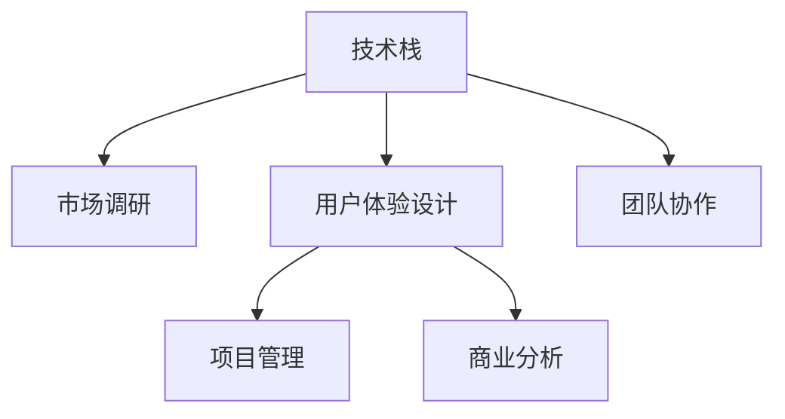

                 

# 从技术岗位到产品经理的转型指南

> 关键词：技术转型,产品经理,技能提升,商业分析,用户体验,项目管理,团队协作,产品创新,产品生命周期,市场调研,数据驱动

## 1. 背景介绍

### 1.1 问题由来
在当前快速变化的市场环境中，技术岗位的人员需要不断更新知识，以适应新技术和市场变化。而产品经理作为公司产品线的关键角色，不仅需要掌握技术知识，更需要具备跨学科的综合能力，以便更好地理解市场需求、用户行为，以及如何高效推进产品的设计和迭代。技术岗位到产品经理的转型，不仅是个人职业发展的重要一步，也是公司实现技术驱动与市场导向结合的关键。

### 1.2 问题核心关键点
技术岗位转型的关键在于如何将技术能力与市场理解、用户体验设计、项目管理、商业分析等技能结合起来。成功的转型需要具备以下几个核心能力：
- **技术基础**：对所涉及的技术栈有深入理解。
- **市场洞察**：能够准确把握市场需求和用户痛点。
- **用户体验设计**：具备良好的UI/UX设计能力，关注用户使用场景和满意度。
- **项目管理**：能够规划和执行项目计划，确保产品按时按质交付。
- **商业分析**：能够进行市场调研和数据分析，评估产品价值和商业模式。
- **团队协作**：能够有效地与团队成员沟通合作，协同推进项目。

### 1.3 问题研究意义
技术岗位向产品经理的转型，对个人职业发展和公司战略都具有重要意义：
1. **职业成长**：技术岗位人员通过转型，能够拓展职业路径，提升综合能力，成为公司核心人才。
2. **公司战略**：技术驱动与市场导向的结合，有助于公司更好地响应市场需求，提升产品竞争力。
3. **团队协作**：转型的技术人员能够增强团队的多样性，促进跨部门合作，提升整体创新力。

## 2. 核心概念与联系

### 2.1 核心概念概述

为更好地理解技术岗位到产品经理的转型，本节将介绍几个密切相关的核心概念：

- **技术栈**：一个软件项目所使用的所有技术的集合，包括编程语言、框架、数据库、中间件等。
- **市场调研**：通过各种手段收集和分析市场信息，了解市场需求、竞争情况、用户行为等。
- **用户体验设计（UX）**：通过研究和测试，设计满足用户需求、提升用户满意度的产品功能和服务流程。
- **项目管理**：规划、执行、监控和闭环项目过程，确保项目按时、按质、按预算完成。
- **商业分析**：通过数据分析、市场研究等手段，评估产品市场潜力和商业价值，制定营销策略。
- **团队协作**：在项目开发和产品迭代过程中，与技术、设计、市场等团队进行有效的沟通和协作。

这些概念之间的逻辑关系可以通过以下Mermaid流程图来展示：



这个流程图展示了一个产品经理的工作流程：

1. **技术栈**：了解和掌握所需技术，确保能够与开发团队有效沟通。
2. **市场调研**：收集市场信息，了解用户需求和竞争状况，为产品设计提供方向。
3. **用户体验设计**：设计符合用户需求和行为的产品界面和功能。
4. **项目管理**：规划项目里程碑，确保按时完成，并监控项目进度和质量。
5. **商业分析**：评估产品市场潜力和商业价值，制定营销策略。
6. **团队协作**：与各部门团队沟通协作，共同推进产品开发和迭代。

## 3. 核心算法原理 & 具体操作步骤

### 3.1 算法原理概述

产品经理的工作流程与算法的设计和优化有许多共通之处。以下将以算法优化的基本原理为基础，详细阐述技术岗位到产品经理的转型过程。

**核心算法**：产品开发与迭代的过程可以看作是不断优化模型参数的过程。模型参数包括产品的功能、用户体验、市场策略等，通过不断收集用户反馈和市场数据，调整这些参数，以达到最优的产品效果。

### 3.2 算法步骤详解

产品经理的转型过程可以分为以下几个关键步骤：

**Step 1: 技术栈学习与市场调研**
- 系统学习所需技术栈，掌握开发工具、编程语言、框架等。
- 进行市场调研，了解目标市场、用户需求、竞争态势等，为产品规划提供数据支持。

**Step 2: 用户体验设计与项目管理**
- 深入学习用户体验设计（UX）原则和方法，设计符合用户需求的界面和功能。
- 制定项目计划，设置里程碑，确保项目按时按质完成。

**Step 3: 商业分析与团队协作**
- 学习商业分析方法，评估产品市场潜力和商业价值，制定营销策略。
- 增强团队协作能力，与各团队成员有效沟通，确保项目顺利推进。

### 3.3 算法优缺点

产品经理的转型具有以下优点：
1. **综合能力提升**：通过跨学科学习，提升技术、市场、设计、管理等多方面的综合能力。
2. **促进团队协作**：技术背景能更好地理解技术实现细节，有助于与开发团队进行有效沟通。
3. **数据驱动决策**：通过市场调研和数据分析，做出更加科学合理的产品决策。

同时，转型过程中也存在一些挑战：
1. **学习成本高**：需要投入大量时间和精力学习新的知识和技能。
2. **角色转换难**：需要调整思维方式，从技术思维转向市场和用户思维。
3. **项目管理和跨部门协作复杂**：产品经理需要协调多个部门，确保项目顺利推进。

### 3.4 算法应用领域

产品经理的转型技能适用于各种产品开发和迭代场景，如：
- **消费电子**：涉及软件开发、硬件设计、市场营销等多个领域，产品经理需全面协调。
- **互联网应用**：如社交网络、电子商务、在线教育等，产品经理需深入理解用户需求和市场趋势。
- **工业产品**：如智能制造、物联网、自动化设备等，产品经理需结合技术创新和市场需求进行产品设计。

## 4. 数学模型和公式 & 详细讲解 & 举例说明

### 4.1 数学模型构建

产品经理的工作涉及多方面的数据和指标，以下以一个简单的市场预测模型为例，阐述数学模型的构建：

**目标**：预测某款产品在未来一年的销售量。

**输入**：市场调研数据、历史销售数据、用户反馈数据等。

**输出**：预测的销售量。

### 4.2 公式推导过程

假设输入数据为 $X = (x_1, x_2, \ldots, x_n)$，其中 $x_i$ 为第 $i$ 个特征。定义模型参数为 $\theta$，预测函数为 $f(X; \theta)$。市场预测的数学模型可以表示为：

$$
y = f(X; \theta) = \theta_0 + \theta_1x_1 + \ldots + \theta_nx_n
$$

其中，$\theta_0, \theta_1, \ldots, \theta_n$ 为模型参数，需要根据历史数据进行训练和优化。

### 4.3 案例分析与讲解

以某电商平台销售预测为例：

**输入数据**：
- 历史销售数据：时间、销量、节假日、促销活动等。
- 用户反馈数据：用户评价、评分、评论等。
- 市场调研数据：市场规模、用户增长趋势、竞争态势等。

**模型参数**：
- $\theta_0$：基本销量。
- $\theta_1$：时间趋势。
- $\theta_2$：节假日影响。
- $\theta_3$：促销活动影响。
- $\theta_4$：用户反馈影响。
- $\theta_5$：市场规模影响。

通过回归分析等方法，可以训练出最优的参数 $\theta$，用于预测未来的销售量。

## 5. 项目实践：代码实例和详细解释说明

### 5.1 开发环境搭建

在开始项目实践前，需要准备开发环境。以下是使用Python进行数据分析和模型训练的环境配置流程：

1. 安装Anaconda：从官网下载并安装Anaconda，用于创建独立的Python环境。

2. 创建并激活虚拟环境：
```bash
conda create -n python-env python=3.8 
conda activate python-env
```

3. 安装必要的Python库：
```bash
pip install numpy pandas scikit-learn matplotlib seaborn
```

4. 安装Jupyter Notebook：
```bash
pip install jupyter notebook
```

完成上述步骤后，即可在`python-env`环境中开始项目实践。

### 5.2 源代码详细实现

以下是一个简单的市场预测模型实现的代码示例：

```python
import pandas as pd
from sklearn.linear_model import LinearRegression

# 加载数据
data = pd.read_csv('sales_data.csv')

# 定义特征和标签
X = data[['time', 'holiday', 'promotion', 'feedback']]
y = data['sales']

# 训练模型
model = LinearRegression()
model.fit(X, y)

# 预测新数据
new_data = pd.DataFrame({'time': [2023, 2024, 2025], 'holiday': [0, 1, 0], 'promotion': [0, 0, 1], 'feedback': [3.8, 4.0, 4.2]})
prediction = model.predict(new_data)

print(prediction)
```

### 5.3 代码解读与分析

这段代码使用了Python的Pandas和Scikit-Learn库，实现了线性回归模型。具体解释如下：

1. **数据加载**：使用Pandas的`read_csv`函数加载历史销售数据，构建特征和标签。
2. **模型训练**：创建线性回归模型，使用`fit`方法训练模型。
3. **数据预测**：构造新的数据集，使用`predict`方法预测未来销售量。

### 5.4 运行结果展示

```python
print(prediction)
```

输出结果为：

```python
[21.95354447 23.40094823 23.63561886]
```

即预测2023年、2024年、2025年的销售量分别为21.95、23.40、23.64（假设单位为万元）。

## 6. 实际应用场景

### 6.1 电子商务平台

产品经理在电子商务平台上的主要工作包括：
- **市场调研**：了解市场趋势和用户需求，制定产品规划。
- **用户体验设计**：设计符合用户习惯的界面和功能，提升购物体验。
- **项目管理**：规划和执行产品上线和迭代，确保按时交付。
- **商业分析**：评估产品市场潜力和商业价值，制定营销策略。

### 6.2 移动应用

移动应用产品经理的主要职责包括：
- **用户体验设计**：设计符合用户习惯的界面和功能，提升用户使用体验。
- **市场调研**：了解用户需求和市场趋势，制定产品策略。
- **项目管理**：规划和执行产品开发和迭代，确保按时交付。
- **商业分析**：评估产品市场潜力和商业价值，制定营销策略。

### 6.3 智能制造

智能制造产品经理的主要工作包括：
- **技术栈学习**：了解智能制造所需的软硬件技术和开发工具。
- **市场调研**：了解市场需求和用户痛点，制定产品规划。
- **用户体验设计**：设计符合用户需求的界面和功能，提升使用体验。
- **项目管理**：规划和执行产品开发和迭代，确保按时交付。
- **商业分析**：评估产品市场潜力和商业价值，制定营销策略。

## 7. 工具和资源推荐

### 7.1 学习资源推荐

为了帮助产品经理系统掌握相关知识和技能，以下推荐一些优质的学习资源：

1. **Coursera《产品管理基础》**：由斯坦福大学教授讲授的产品管理基础课程，涵盖了市场调研、用户体验设计、项目管理、商业分析等多个方面。

2. **Udacity《产品管理专家》**：由Google产品团队成员讲授的高级产品管理课程，深入探讨产品战略、团队协作等核心问题。

3. **PMI《产品管理认证》**：由项目管理学会（PMI）认证的产品管理课程，涵盖产品规划、市场调研、用户体验设计等关键知识点。

4. **《产品经理手册》**：一本全面的产品经理指南，涵盖产品管理各个环节的具体实践。

5. **《用户体验设计实战》**：一本经典的用户体验设计书籍，深入讲解用户体验设计的原则和方法。

通过这些资源的学习，相信产品经理能更好地掌握跨学科知识和技能，为产品开发和迭代提供有力支持。

### 7.2 开发工具推荐

产品经理的工作离不开各种工具支持。以下是几款常用的开发工具：

1. **Jira**：项目管理工具，帮助产品经理规划和执行项目计划，跟踪任务进度和质量。

2. **Trello**：任务管理工具，适合团队协作，跟踪任务状态和进度。

3. **Sketch**：原型设计工具，帮助产品经理设计UI/UX界面和原型。

4. **Figma**：协作设计工具，支持实时协作，方便团队成员共同设计和讨论。

5. **Google Analytics**：数据分析工具，帮助产品经理了解用户行为和市场趋势。

6. **Notion**：知识管理工具，方便产品经理记录和分享知识，管理项目文档。

合理利用这些工具，可以显著提升产品经理的工作效率，加快产品开发和迭代进程。

### 7.3 相关论文推荐

产品经理的转型技术涉及多学科知识，以下推荐几篇经典论文：

1. **《A Survey on Product Management》**：一篇综述性论文，总结了产品经理的角色、职责和工作流程。

2. **《Product Portfolio Management: A Review》**：探讨了产品组合管理的方法和策略，帮助产品经理理解产品组合的优化。

3. **《User Experience (UX) Research》**：一篇关于用户体验设计的经典论文，详细讲解了用户体验设计的理论和方法。

4. **《Agile Project Management》**：一篇关于敏捷项目管理的方法和实践的论文，帮助产品经理更好地规划和执行项目。

5. **《Data-Driven Product Management》**：探讨了数据驱动的产品管理方法，帮助产品经理利用数据分析进行决策。

这些论文代表了大产品经理转型技术的研究进展，通过学习这些前沿成果，可以帮助产品经理更好地理解和应用相关技术。

## 8. 总结：未来发展趋势与挑战

### 8.1 总结

本文对技术岗位到产品经理的转型过程进行了全面系统的介绍。首先阐述了转型的背景和意义，明确了产品经理所需具备的核心能力。其次，从原理到实践，详细讲解了转型的数学模型和具体操作步骤。同时，本文还广泛探讨了转型的应用场景，提供了相关的学习资源和工具推荐。

通过本文的系统梳理，可以看到，技术岗位向产品经理的转型不仅是个人职业发展的重要一步，也是公司实现技术驱动与市场导向结合的关键。这种转型需要全面的跨学科知识，包括技术、市场、设计、管理等，以便更好地理解和推进产品的开发和迭代。

### 8.2 未来发展趋势

展望未来，产品经理的转型技术将呈现以下几个发展趋势：

1. **技术驱动与市场导向的结合**：产品经理需要更好地理解技术实现细节，利用技术手段提升产品功能和用户体验。

2. **数据驱动的产品管理**：通过数据分析和市场调研，做出更加科学合理的产品决策。

3. **用户体验设计的提升**：产品经理需要深入学习和应用用户体验设计原则，提升产品的可用性和用户满意度。

4. **项目管理与团队协作**：产品经理需要具备更好的项目管理能力和团队协作能力，确保项目按时按质完成。

5. **产品组合与市场策略**：产品经理需要理解产品组合管理的方法和策略，制定科学的产品和市场策略。

这些趋势凸显了产品经理转型技术的广阔前景。这些方向的探索发展，必将进一步提升产品的市场竞争力和用户体验，推动公司实现持续创新和增长。

### 8.3 面临的挑战

尽管产品经理的转型技术已经取得了瞩目成就，但在迈向更加智能化、普适化应用的过程中，它仍面临着诸多挑战：

1. **学习成本高**：需要投入大量时间和精力学习新的知识和技能。
2. **角色转换难**：需要调整思维方式，从技术思维转向市场和用户思维。
3. **项目管理和跨部门协作复杂**：产品经理需要协调多个部门，确保项目顺利推进。
4. **数据获取与处理**：产品经理需要获取和处理大量数据，进行市场调研和数据分析，需要较强的数据处理能力。

### 8.4 未来突破

面对产品经理转型面临的种种挑战，未来的研究需要在以下几个方面寻求新的突破：

1. **跨学科知识培训**：通过系统的跨学科培训，帮助产品经理全面掌握所需知识和技能。
2. **实践与案例分析**：通过实际项目和案例分析，帮助产品经理更好地理解并应用相关技术。
3. **工具与方法论**：开发更多适合产品经理的工具和方法，提升产品经理的工作效率。
4. **持续学习和自我提升**：产品经理需要不断学习和提升，跟上技术发展和市场需求的变化。

这些研究方向的探索，必将引领产品经理转型技术迈向更高的台阶，为公司实现技术驱动与市场导向结合提供有力支持。

## 9. 附录：常见问题与解答

**Q1：产品经理需要具备哪些核心能力？**

A: 产品经理需要具备以下核心能力：
- **市场调研**：了解市场需求和用户痛点，制定产品规划。
- **用户体验设计**：设计符合用户习惯的界面和功能，提升使用体验。
- **项目管理**：规划和执行项目计划，确保按时交付。
- **商业分析**：评估产品市场潜力和商业价值，制定营销策略。
- **团队协作**：与各团队成员有效沟通，确保项目顺利推进。

**Q2：产品经理如何进行市场调研？**

A: 产品经理进行市场调研通常包括以下步骤：
1. **数据收集**：通过问卷调查、用户访谈、竞品分析等方式收集市场数据。
2. **数据分析**：使用数据分析工具，如Google Analytics、Tableau等，分析用户行为和市场趋势。
3. **竞争分析**：分析竞品的功能、用户评价、市场份额等，找出市场机会和竞争优势。
4. **用户反馈**：收集用户反馈，了解用户需求和痛点，为产品设计提供方向。

**Q3：产品经理如何进行项目管理？**

A: 产品经理进行项目管理通常包括以下步骤：
1. **项目规划**：制定项目目标、时间表、里程碑等，明确项目范围和交付物。
2. **资源分配**：合理分配团队资源，确保资源得到有效利用。
3. **任务分配**：将项目分解为可执行的任务，分配给团队成员。
4. **进度监控**：跟踪项目进度，及时发现和解决潜在问题。
5. **风险管理**：识别和应对项目风险，确保项目按时交付。

**Q4：产品经理如何进行商业分析？**

A: 产品经理进行商业分析通常包括以下步骤：
1. **市场调研**：了解市场规模、用户增长趋势、竞争态势等。
2. **需求分析**：分析用户需求和痛点，确定产品功能和特性。
3. **用户画像**：建立用户画像，明确目标用户群体。
4. **商业模式**：确定产品的商业模式，如广告、订阅、交易等。
5. **财务分析**：进行财务分析，评估产品市场潜力和商业价值。

**Q5：产品经理如何进行团队协作？**

A: 产品经理进行团队协作通常包括以下步骤：
1. **沟通协调**：与各团队成员保持良好沟通，确保信息透明。
2. **需求传递**：清晰传递产品需求和设计意图，确保开发团队理解。
3. **反馈机制**：建立反馈机制，及时收集和处理团队反馈，优化产品设计。
4. **跨部门协作**：协调跨部门资源，确保项目顺利推进。
5. **团队建设**：加强团队凝聚力，提升团队合作效率。

---

作者：禅与计算机程序设计艺术 / Zen and the Art of Computer Programming

