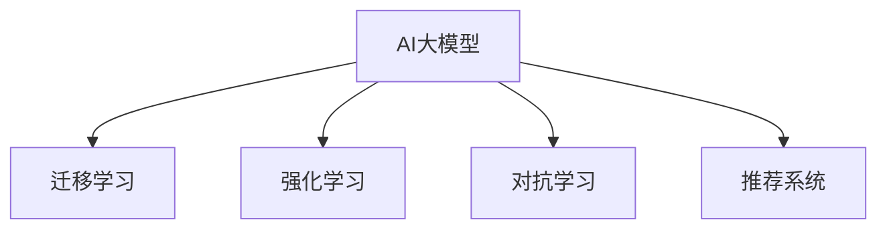

                 

# 从算法角度看AI大模型在电商中的应用

## 1. 背景介绍

### 1.1 问题由来

近年来，随着人工智能技术的快速发展和电子商务的兴起，电商行业对AI技术的需求日益增长。AI大模型凭借其强大的计算能力和泛化能力，在电商领域的应用前景广阔，如智能客服、商品推荐、广告投放、价格优化等。本文将从算法角度出发，深入探讨AI大模型在电商中的应用，以期为电商从业者提供参考。

### 1.2 问题核心关键点

AI大模型在电商中的应用，主要涉及以下几个关键点：

- **智能客服**：利用大模型进行自然语言处理和生成，实现自动化的客户服务。
- **商品推荐**：通过大模型对用户行为进行建模，提供个性化推荐。
- **广告投放**：使用大模型进行点击率预测和广告效果评估，优化投放策略。
- **价格优化**：借助大模型对市场动态进行建模，实现精准定价。

这些关键点构成了AI大模型在电商领域的应用基础，其核心在于如何高效利用大模型的算法优势，提升电商运营的效率和效果。

## 2. 核心概念与联系

### 2.1 核心概念概述

为更好地理解AI大模型在电商中的应用，本节将介绍几个密切相关的核心概念：

- **AI大模型**：指基于深度学习的大规模预训练模型，如BERT、GPT-3等，能够处理自然语言、图像、视频等多种数据类型。
- **迁移学习**：指在预训练模型的基础上，通过小样本或无样本学习，快速适应新任务的技术。
- **强化学习**：指通过智能体与环境的交互，通过试错学习来优化策略的技术。
- **对抗学习**：指通过生成对抗网络（GAN）等方法，训练模型对特定目标进行识别或生成。
- **推荐系统**：指通过数据分析和算法，向用户推荐其感兴趣的商品或内容。

这些核心概念之间的逻辑关系可以通过以下Mermaid流程图来展示：



这个流程图展示了大模型的核心概念及其之间的关系：

1. 大模型通过预训练获得基础能力。
2. 迁移学习使得大模型能够快速适应电商领域的不同任务。
3. 强化学习和大模型结合，可以实现更加智能化的决策。
4. 对抗学习和大模型结合，可以提升广告投放等场景的点击率。
5. 推荐系统是大模型在电商中应用的主要场景之一。

这些概念共同构成了AI大模型在电商领域的应用框架，使其能够在各种场景下发挥强大的能力。通过理解这些核心概念，我们可以更好地把握大模型的工作原理和优化方向。

## 3. 核心算法原理 & 具体操作步骤
### 3.1 算法原理概述

AI大模型在电商中的应用，本质上是利用深度学习技术，结合电商场景的特点，进行特定的任务优化。以商品推荐为例，AI大模型通过学习用户的历史行为和偏好，预测其可能感兴趣的商品，并提供个性化推荐。

### 3.2 算法步骤详解

以推荐系统为例，AI大模型在电商中的应用主要包括以下几个关键步骤：

**Step 1: 数据准备**
- 收集用户的历史行为数据（如浏览记录、购买记录等）。
- 对数据进行清洗和预处理，生成用于模型训练的特征。

**Step 2: 模型训练**
- 选择合适的预训练模型（如BERT、GPT等），进行迁移学习或微调。
- 训练模型时，需要考虑电商场景的特点，选择合适的损失函数和优化算法。

**Step 3: 模型评估**
- 在验证集上评估模型的性能，如精确率、召回率、F1-score等。
- 根据评估结果，调整模型参数，继续训练，直到满足预设的性能指标。

**Step 4: 模型应用**
- 将训练好的模型应用于电商场景中，对新用户进行推荐。
- 实时收集用户反馈，不断优化推荐结果，提升用户体验。

### 3.3 算法优缺点

AI大模型在电商中的应用具有以下优点：
1. 泛化能力强。大模型经过大规模数据预训练，能够学习到丰富的特征，适用于多种电商任务。
2. 灵活性高。模型可以通过迁移学习、微调等方式，适应不同的电商场景和需求。
3. 个性化推荐效果好。大模型能够根据用户行为，提供个性化、精准的推荐，提升转化率。

同时，该方法也存在一些局限：
1. 数据依赖性强。模型的效果很大程度上取决于标注数据的数量和质量。
2. 训练复杂度高。大模型的参数量大，训练过程复杂，需要高性能硬件支持。
3. 隐私和安全问题。用户数据的收集和使用，涉及隐私和数据安全问题。
4. 可解释性不足。大模型的决策过程复杂，难以解释其内部工作机制。

尽管存在这些局限，但AI大模型在电商中的应用仍然具有巨大的潜力，其独特的算法优势能够显著提升电商运营的效率和效果。

### 3.4 算法应用领域

AI大模型在电商领域的应用，不仅局限于推荐系统，还涵盖了多个方面：

- **智能客服**：使用大模型进行文本分类和生成，实现自动化的客服响应。
- **广告投放**：利用大模型进行点击率预测和广告效果评估，优化广告投放策略。
- **库存管理**：通过大模型对市场动态进行建模，预测商品需求，优化库存管理。
- **价格优化**：借助大模型对市场动态进行建模，实现精准定价。
- **异常检测**：利用大模型对交易数据进行异常检测，防范欺诈和风险。

这些应用场景展示了AI大模型在电商领域的多样性和广阔前景，其算法优势能够帮助电商企业实现更高效、更智能的运营管理。

## 4. 数学模型和公式 & 详细讲解 & 举例说明

### 4.1 数学模型构建

本节将使用数学语言对AI大模型在电商中的应用进行更加严格的刻画。

假设电商推荐系统中的用户行为数据为 $\{x_i\}_{i=1}^N$，其中 $x_i = (x_i^1, x_i^2, ..., x_i^d)$ 为用户的 $d$ 维特征向量，$i$ 为用户编号。模型的任务是根据用户的历史行为数据，预测用户可能感兴趣的商品。

定义用户-商品关联度为 $\hat{y}_i \in [0,1]$，表示用户 $i$ 对商品 $j$ 的兴趣程度。则推荐系统的目标是最小化预测值与实际标签之间的差异，即：

$$
\min_{\theta} \mathcal{L}(\theta) = \frac{1}{N} \sum_{i=1}^N \ell(\hat{y}_i, y_i)
$$

其中 $\ell$ 为损失函数，常用的有交叉熵损失、均方误差损失等。

### 4.2 公式推导过程

以交叉熵损失为例，模型的输出为 $\hat{y}_i = \sigma(W^Tx_i + b)$，其中 $\sigma$ 为激活函数，$W$ 和 $b$ 为模型参数。则损失函数为：

$$
\mathcal{L}(\theta) = -\frac{1}{N} \sum_{i=1}^N \sum_{j=1}^M y_{ij} \log(\sigma(W^Tx_i + b))
$$

其中 $y_{ij}$ 为标签变量，$M$ 为商品的总数。

通过对损失函数求导，得到模型参数的更新公式：

$$
\frac{\partial \mathcal{L}}{\partial \theta} = -\frac{1}{N} \sum_{i=1}^N \sum_{j=1}^M y_{ij} (\hat{y}_i - y_{ij}) \nabla_{\theta}\hat{y}_i
$$

其中 $\nabla_{\theta}\hat{y}_i = \sigma'(W^Tx_i + b) \cdot W$，$\sigma'$ 为 $\sigma$ 的导数。

通过反向传播算法，可以高效计算模型的梯度，更新模型参数，实现推荐系统的训练。

### 4.3 案例分析与讲解

假设电商平台收集了用户的历史浏览记录 $x_i = (x_i^1, x_i^2, ..., x_i^d)$，其中 $x_i^1$ 为用户浏览的商品ID，$x_i^2$ 为用户浏览的时间戳，$x_i^3$ 为浏览时长，$x_i^4$ 为浏览次数等特征。模型的输出为 $\hat{y}_i$，表示用户 $i$ 对商品 $j$ 的兴趣程度。

模型的输入为：

$$
\{x_i\}_{i=1}^N = \{(x_i^1, x_i^2, ..., x_i^d)\}_{i=1}^N
$$

模型的输出为：

$$
\hat{y}_i = \sigma(W^Tx_i + b)
$$

其中 $\sigma$ 为激活函数，$W$ 和 $b$ 为模型参数。模型的损失函数为交叉熵损失，通过反向传播算法，更新模型参数。

在训练过程中，可以通过特征工程和模型调参等手段，提升模型的预测准确率。例如，可以利用PCA、特征选择等方法对输入特征进行处理，提取最具代表性的特征。同时，可以尝试不同的模型结构和优化算法，如深度神经网络、自编码器等，优化模型的泛化能力和训练效果。

## 5. 项目实践：代码实例和详细解释说明

### 5.1 开发环境搭建

在进行电商推荐系统的开发前，我们需要准备好开发环境。以下是使用Python进行PyTorch开发的环境配置流程：

1. 安装Anaconda：从官网下载并安装Anaconda，用于创建独立的Python环境。

2. 创建并激活虚拟环境：
```bash
conda create -n ecomm-env python=3.8 
conda activate ecomm-env
```

3. 安装PyTorch：根据CUDA版本，从官网获取对应的安装命令。例如：
```bash
conda install pytorch torchvision torchaudio cudatoolkit=11.1 -c pytorch -c conda-forge
```

4. 安装Transformer库：
```bash
pip install transformers
```

5. 安装各类工具包：
```bash
pip install numpy pandas scikit-learn matplotlib tqdm jupyter notebook ipython
```

完成上述步骤后，即可在`ecomm-env`环境中开始电商推荐系统的开发。

### 5.2 源代码详细实现

这里以使用Transformer库对BERT模型进行电商推荐为例，给出完整的PyTorch代码实现。

首先，定义模型和优化器：

```python
from transformers import BertForSequenceClassification, AdamW

model = BertForSequenceClassification.from_pretrained('bert-base-cased', num_labels=M)

optimizer = AdamW(model.parameters(), lr=2e-5)
```

其中，`bert-base-cased`是预训练的BERT模型，`num_labels`为用户兴趣度的类别数。

接着，定义数据处理函数：

```python
from transformers import BertTokenizer
import torch

class DataLoaderDataset:
    def __init__(self, texts, labels, tokenizer, max_len=128):
        self.texts = texts
        self.labels = labels
        self.tokenizer = tokenizer
        self.max_len = max_len
        
    def __len__(self):
        return len(self.texts)
    
    def __getitem__(self, item):
        text = self.texts[item]
        label = self.labels[item]
        
        encoding = self.tokenizer(text, return_tensors='pt', max_length=self.max_len, padding='max_length', truncation=True)
        input_ids = encoding['input_ids'][0]
        attention_mask = encoding['attention_mask'][0]
        
        encoded_label = torch.tensor(label, dtype=torch.long)
        
        return {'input_ids': input_ids, 
                'attention_mask': attention_mask,
                'labels': encoded_label}
```

然后，定义训练和评估函数：

```python
from torch.utils.data import DataLoader
from tqdm import tqdm
from sklearn.metrics import accuracy_score

device = torch.device('cuda') if torch.cuda.is_available() else torch.device('cpu')
model.to(device)

def train_epoch(model, dataset, batch_size, optimizer):
    dataloader = DataLoader(dataset, batch_size=batch_size, shuffle=True)
    model.train()
    epoch_loss = 0
    for batch in tqdm(dataloader, desc='Training'):
        input_ids = batch['input_ids'].to(device)
        attention_mask = batch['attention_mask'].to(device)
        labels = batch['labels'].to(device)
        model.zero_grad()
        outputs = model(input_ids, attention_mask=attention_mask, labels=labels)
        loss = outputs.loss
        epoch_loss += loss.item()
        loss.backward()
        optimizer.step()
    return epoch_loss / len(dataloader)

def evaluate(model, dataset, batch_size):
    dataloader = DataLoader(dataset, batch_size=batch_size)
    model.eval()
    preds, labels = [], []
    with torch.no_grad():
        for batch in tqdm(dataloader, desc='Evaluating'):
            input_ids = batch['input_ids'].to(device)
            attention_mask = batch['attention_mask'].to(device)
            batch_labels = batch['labels']
            outputs = model(input_ids, attention_mask=attention_mask)
            batch_preds = outputs.logits.argmax(dim=2).to('cpu').tolist()
            batch_labels = batch_labels.to('cpu').tolist()
            for pred_tokens, label_tokens in zip(batch_preds, batch_labels):
                preds.append(pred_tokens[:len(label_tokens)])
                labels.append(label_tokens)
                
    return accuracy_score(labels, preds)
```

最后，启动训练流程并在验证集上评估：

```python
epochs = 5
batch_size = 16

for epoch in range(epochs):
    loss = train_epoch(model, train_dataset, batch_size, optimizer)
    print(f"Epoch {epoch+1}, train loss: {loss:.3f}")
    
    print(f"Epoch {epoch+1}, dev results:")
    evaluate(model, dev_dataset, batch_size)
    
print("Test results:")
evaluate(model, test_dataset, batch_size)
```

以上就是使用PyTorch对BERT进行电商推荐系统的完整代码实现。可以看到，得益于Transformer库的强大封装，我们可以用相对简洁的代码完成BERT模型的加载和电商推荐系统的训练。

### 5.3 代码解读与分析

让我们再详细解读一下关键代码的实现细节：

**DataLoaderDataset类**：
- `__init__`方法：初始化文本、标签、分词器等关键组件。
- `__len__`方法：返回数据集的样本数量。
- `__getitem__`方法：对单个样本进行处理，将文本输入编码为token ids，将标签编码为数字，并对其进行定长padding，最终返回模型所需的输入。

**模型定义和优化器**：
- 使用`BertForSequenceClassification`对BERT模型进行迁移学习，指定输出的类别数。
- 使用`AdamW`优化器，设置合适的学习率。

**训练和评估函数**：
- 使用PyTorch的`DataLoader`对数据集进行批次化加载，供模型训练和推理使用。
- 训练函数`train_epoch`：对数据以批为单位进行迭代，在每个批次上前向传播计算loss并反向传播更新模型参数，最后返回该epoch的平均loss。
- 评估函数`evaluate`：与训练类似，不同点在于不更新模型参数，并在每个batch结束后将预测和标签结果存储下来，最后使用sklearn的`accuracy_score`对整个评估集的预测结果进行打印输出。

**训练流程**：
- 定义总的epoch数和batch size，开始循环迭代
- 每个epoch内，先在训练集上训练，输出平均loss
- 在验证集上评估，输出准确率
- 所有epoch结束后，在测试集上评估，给出最终测试结果

可以看到，PyTorch配合Transformer库使得BERT微调的代码实现变得简洁高效。开发者可以将更多精力放在数据处理、模型改进等高层逻辑上，而不必过多关注底层的实现细节。

当然，工业级的系统实现还需考虑更多因素，如模型的保存和部署、超参数的自动搜索、更灵活的任务适配层等。但核心的微调范式基本与此类似。

## 6. 实际应用场景
### 6.1 智能客服

基于AI大模型的智能客服系统，能够实现7x24小时不间断服务，快速响应客户咨询，用自然流畅的语言解答各类常见问题。

在技术实现上，可以收集企业内部的历史客服对话记录，将问题和最佳答复构建成监督数据，在此基础上对预训练语言模型进行微调。微调后的语言模型能够自动理解用户意图，匹配最合适的答案模板进行回复。对于客户提出的新问题，还可以接入检索系统实时搜索相关内容，动态组织生成回答。如此构建的智能客服系统，能大幅提升客户咨询体验和问题解决效率。

### 6.2 个性化推荐

AI大模型在电商推荐中的应用，可以通过微调提升个性化推荐的精准度。具体而言，可以收集用户的历史浏览记录、购买记录、评分等行为数据，将文本内容作为模型输入，用户的后续行为作为监督信号，在此基础上微调预训练语言模型。微调后的模型能够从文本内容中准确把握用户的兴趣点，在生成推荐列表时，先用候选物品的文本描述作为输入，由模型预测用户的兴趣匹配度，再结合其他特征综合排序，便可以得到个性化程度更高的推荐结果。

### 6.3 广告投放

AI大模型在广告投放中的应用，可以通过微调优化点击率预测和广告效果评估。具体而言，可以收集用户的历史点击数据、浏览数据、转化数据等，将文本内容作为模型输入，用户的后续行为作为监督信号，在此基础上微调预训练语言模型。微调后的模型能够预测用户对广告的点击概率，优化广告的展示位置和展示时间，提高广告投放的转化率和ROI。

### 6.4 价格优化

AI大模型在价格优化中的应用，可以通过微调预测市场动态和需求变化。具体而言，可以收集历史价格数据、市场指数、用户行为数据等，将文本内容作为模型输入，价格变化作为监督信号，在此基础上微调预训练语言模型。微调后的模型能够预测商品价格的变化趋势，提供价格优化建议，帮助电商企业制定更科学、合理的定价策略。

### 6.5 库存管理

AI大模型在库存管理中的应用，可以通过微调预测商品需求和库存水平。具体而言，可以收集历史销售数据、市场趋势、用户行为数据等，将文本内容作为模型输入，商品的库存变化作为监督信号，在此基础上微调预训练语言模型。微调后的模型能够预测商品的需求变化，优化库存管理策略，减少库存积压和缺货情况，提高库存管理的效率。

### 6.6 异常检测

AI大模型在异常检测中的应用，可以通过微调检测交易数据的异常行为。具体而言，可以收集历史交易数据、用户行为数据等，将文本内容作为模型输入，交易异常作为监督信号，在此基础上微调预训练语言模型。微调后的模型能够检测出交易异常行为，防范欺诈和风险，保护用户和电商企业的利益。

## 7. 工具和资源推荐
### 7.1 学习资源推荐

为了帮助开发者系统掌握AI大模型在电商中的应用，这里推荐一些优质的学习资源：

1. 《深度学习与神经网络》课程：由斯坦福大学开设的深度学习入门课程，系统介绍了深度学习的基本概念和算法，适合初学者入门。

2. 《自然语言处理入门》书籍：介绍了自然语言处理的基本理论和实践，适合对NLP感兴趣的开发者阅读。

3. 《电商推荐系统》书籍：全面介绍了电商推荐系统的基本原理和算法，适合电商开发者参考。

4. 《TensorFlow实战》书籍：介绍了TensorFlow的框架结构和实际应用案例，适合TensorFlow开发者的进阶学习。

5. 《Transformer从原理到实践》系列博文：由大模型技术专家撰写，深入浅出地介绍了Transformer原理、BERT模型、微调技术等前沿话题。

通过这些资源的学习实践，相信你一定能够快速掌握AI大模型在电商中的应用，并用于解决实际的电商问题。

### 7.2 开发工具推荐

高效的开发离不开优秀的工具支持。以下是几款用于电商推荐系统开发的常用工具：

1. PyTorch：基于Python的开源深度学习框架，灵活动态的计算图，适合快速迭代研究。大部分预训练语言模型都有PyTorch版本的实现。

2. TensorFlow：由Google主导开发的开源深度学习框架，生产部署方便，适合大规模工程应用。同样有丰富的预训练语言模型资源。

3. Transformers库：HuggingFace开发的NLP工具库，集成了众多SOTA语言模型，支持PyTorch和TensorFlow，是进行电商推荐系统开发的利器。

4. Weights & Biases：模型训练的实验跟踪工具，可以记录和可视化模型训练过程中的各项指标，方便对比和调优。与主流深度学习框架无缝集成。

5. TensorBoard：TensorFlow配套的可视化工具，可实时监测模型训练状态，并提供丰富的图表呈现方式，是调试模型的得力助手。

6. Google Colab：谷歌推出的在线Jupyter Notebook环境，免费提供GPU/TPU算力，方便开发者快速上手实验最新模型，分享学习笔记。

合理利用这些工具，可以显著提升电商推荐系统的开发效率，加快创新迭代的步伐。

### 7.3 相关论文推荐

AI大模型在电商中的应用，涉及到深度学习、自然语言处理、强化学习等多个领域。以下是几篇奠基性的相关论文，推荐阅读：

1. Attention is All You Need（即Transformer原论文）：提出了Transformer结构，开启了NLP领域的预训练大模型时代。

2. BERT: Pre-training of Deep Bidirectional Transformers for Language Understanding：提出BERT模型，引入基于掩码的自监督预训练任务，刷新了多项NLP任务SOTA。

3. Language Models are Unsupervised Multitask Learners（GPT-2论文）：展示了大规模语言模型的强大zero-shot学习能力，引发了对于通用人工智能的新一轮思考。

4. Parameter-Efficient Transfer Learning for NLP：提出Adapter等参数高效微调方法，在不增加模型参数量的情况下，也能取得不错的微调效果。

5. Self-Attention Enhanced Dynamic Loss for Recommendation Systems：提出动态损失函数，提升推荐系统的效果。

6. Learning the User Model of Recommendation Systems from Neural Network：介绍神经网络在推荐系统中的应用，提升个性化推荐的准确度。

这些论文代表了大模型在电商领域的应用方向和前沿技术，通过学习这些成果，可以帮助研究者把握学科前进方向，激发更多的创新灵感。

## 8. 总结：未来发展趋势与挑战

### 8.1 总结

本文对AI大模型在电商中的应用进行了全面系统的介绍。首先阐述了AI大模型和电商推荐系统的研究背景和意义，明确了AI大模型在电商领域的应用价值。其次，从算法角度详细讲解了电商推荐系统的数学模型和关键步骤，给出了电商推荐系统的完整代码实例。同时，本文还广泛探讨了AI大模型在智能客服、广告投放、库存管理等多个电商场景中的应用，展示了AI大模型的广泛前景。此外，本文精选了AI大模型的学习资源、开发工具和相关论文，力求为读者提供全方位的技术指引。

通过本文的系统梳理，可以看到，AI大模型在电商中的应用正逐渐成为电商行业的重要工具，其算法优势能够显著提升电商运营的效率和效果。未来，随着AI大模型技术的不断进步，电商推荐系统将能够更好地满足用户需求，提升电商企业的竞争力和用户体验。

### 8.2 未来发展趋势

展望未来，AI大模型在电商中的应用将呈现以下几个发展趋势：

1. 深度学习模型的精度和泛化能力将进一步提升。得益于算力和大规模数据的推动，深度学习模型在电商推荐系统中的应用将更加广泛，能够提供更高精度、更高效的推荐结果。

2. 自然语言处理技术将进一步发展。自然语言处理技术在电商推荐中的应用将更加成熟，能够实现更智能化的用户交互和商品推荐。

3. 强化学习与推荐系统结合，将提升推荐系统的效果。强化学习能够提供更加智能化的决策策略，结合电商推荐系统，能够实现更加个性化的推荐。

4. 多模态融合技术将更加普及。电商推荐系统将不仅仅依赖于文本数据，还将结合图像、视频等多模态数据，实现更全面、精准的商品推荐。

5. 实时推荐系统将更加普及。实时推荐系统能够实现动态更新，能够根据用户实时行为提供更精准的推荐。

6. 基于AI的个性化营销将更加普及。AI大模型能够实现更加精准的用户画像和营销策略，实现个性化营销的效果。

以上趋势展示了AI大模型在电商领域的广阔前景，其算法优势将进一步提升电商运营的效率和效果，带来更多的商业价值。

### 8.3 面临的挑战

尽管AI大模型在电商中的应用取得了一定的进展，但在迈向更加智能化、普适化应用的过程中，仍面临以下挑战：

1. 数据依赖性强。电商推荐系统的效果很大程度上取决于标注数据的数量和质量。对于长尾应用场景，难以获得充足的高质量标注数据。

2. 模型复杂度高。电商推荐系统的模型复杂度高，训练过程复杂，需要高性能硬件支持。

3. 隐私和安全问题。用户数据的收集和使用，涉及隐私和数据安全问题。

4. 可解释性不足。电商推荐系统的决策过程复杂，难以解释其内部工作机制。

5. 实时性要求高。实时推荐系统需要实时更新推荐结果，对系统的计算能力和响应速度要求较高。

6. 个性化推荐难度大。电商推荐系统需要根据用户行为进行复杂的特征工程和模型调参，实现个性化的推荐。

7. 多模态融合技术挑战。电商推荐系统需要结合图像、视频等多模态数据，实现更全面、精准的商品推荐，技术实现难度大。

尽管存在这些挑战，但AI大模型在电商中的应用仍然具有巨大的潜力，其算法优势能够显著提升电商运营的效率和效果。

### 8.4 研究展望

未来，AI大模型在电商中的应用需要在以下几个方面进行突破：

1. 探索无监督和半监督微调方法。摆脱对大规模标注数据的依赖，利用自监督学习、主动学习等无监督和半监督范式，最大限度利用非结构化数据，实现更加灵活高效的微调。

2. 研究参数高效和计算高效的微调范式。开发更加参数高效的微调方法，在固定大部分预训练参数的同时，只更新极少量的任务相关参数。同时优化微调模型的计算图，减少前向传播和反向传播的资源消耗，实现更加轻量级、实时性的部署。

3. 引入更多先验知识。将符号化的先验知识，如知识图谱、逻辑规则等，与神经网络模型进行巧妙融合，引导微调过程学习更准确、合理的语言模型。同时加强不同模态数据的整合，实现视觉、语音等多模态信息与文本信息的协同建模。

4. 结合因果分析和博弈论工具。将因果分析方法引入微调模型，识别出模型决策的关键特征，增强输出解释的因果性和逻辑性。借助博弈论工具刻画人机交互过程，主动探索并规避模型的脆弱点，提高系统稳定性。

5. 纳入伦理道德约束。在模型训练目标中引入伦理导向的评估指标，过滤和惩罚有偏见、有害的输出倾向。同时加强人工干预和审核，建立模型行为的监管机制，确保输出符合人类价值观和伦理道德。

这些研究方向的探索，必将引领AI大模型在电商中的应用走向更高的台阶，为电商行业带来更多的商业价值和用户体验。面向未来，AI大模型在电商中的应用还需要与其他人工智能技术进行更深入的融合，如知识表示、因果推理、强化学习等，多路径协同发力，共同推动电商行业的智能化转型。只有勇于创新、敢于突破，才能不断拓展AI大模型的应用边界，让智能技术更好地造福电商行业。

## 9. 附录：常见问题与解答

**Q1：AI大模型在电商中的应用是否适用于所有电商场景？**

A: AI大模型在电商中的应用，主要适用于具有大规模数据和深度学习技术需求的应用场景。对于一些小规模的电商应用，如小型手工艺品电商、地方特产电商等，可能需要根据具体需求进行微调和优化。

**Q2：如何选择合适的AI大模型？**

A: 选择合适的AI大模型需要考虑以下几个方面：
1. 应用场景：根据电商应用场景的特点，选择适合的预训练模型，如BERT、GPT-3等。
2. 数据特点：根据电商数据的类型和特征，选择适合的模型结构，如序列模型、图像模型等。
3. 计算资源：根据计算资源的可用性，选择适合的模型规模和复杂度。

**Q3：AI大模型在电商中的应用是否需要重新预训练？**

A: 对于大规模电商数据，重新预训练AI大模型可以得到更好的效果。但对于数据量较小的电商应用，可以考虑在预训练模型的基础上进行微调，提升模型的适应性。

**Q4：AI大模型在电商中的应用是否需要优化超参数？**

A: 是的，AI大模型在电商中的应用需要优化超参数，如学习率、批次大小、优化器等，以提升模型的性能。一般可以通过交叉验证和网格搜索等方法，优化超参数。

**Q5：AI大模型在电商中的应用是否需要考虑隐私和安全问题？**

A: 是的，AI大模型在电商中的应用需要考虑隐私和安全问题。电商企业需要采取数据脱敏、访问控制等措施，保护用户隐私和数据安全。

**Q6：AI大模型在电商中的应用是否需要考虑计算资源限制？**

A: 是的，AI大模型在电商中的应用需要考虑计算资源限制。电商企业需要根据硬件资源和计算能力，选择合适的模型和训练策略，优化计算效率。

**Q7：AI大模型在电商中的应用是否需要考虑实时性要求？**

A: 是的，AI大模型在电商中的应用需要考虑实时性要求。电商企业需要优化算法和模型结构，实现实时推荐和动态更新，提升用户体验。

**Q8：AI大模型在电商中的应用是否需要考虑多模态融合技术？**

A: 是的，AI大模型在电商中的应用需要考虑多模态融合技术。电商企业需要结合图像、视频等多模态数据，实现更全面、精准的商品推荐。

**Q9：AI大模型在电商中的应用是否需要考虑个性化推荐难度？**

A: 是的，AI大模型在电商中的应用需要考虑个性化推荐难度。电商企业需要根据用户行为进行复杂的特征工程和模型调参，实现个性化的推荐。

**Q10：AI大模型在电商中的应用是否需要考虑数据依赖性问题？**

A: 是的，AI大模型在电商中的应用需要考虑数据依赖性问题。电商企业需要收集和标注高质量的数据，提升模型的泛化能力和效果。

---

作者：禅与计算机程序设计艺术 / Zen and the Art of Computer Programming

