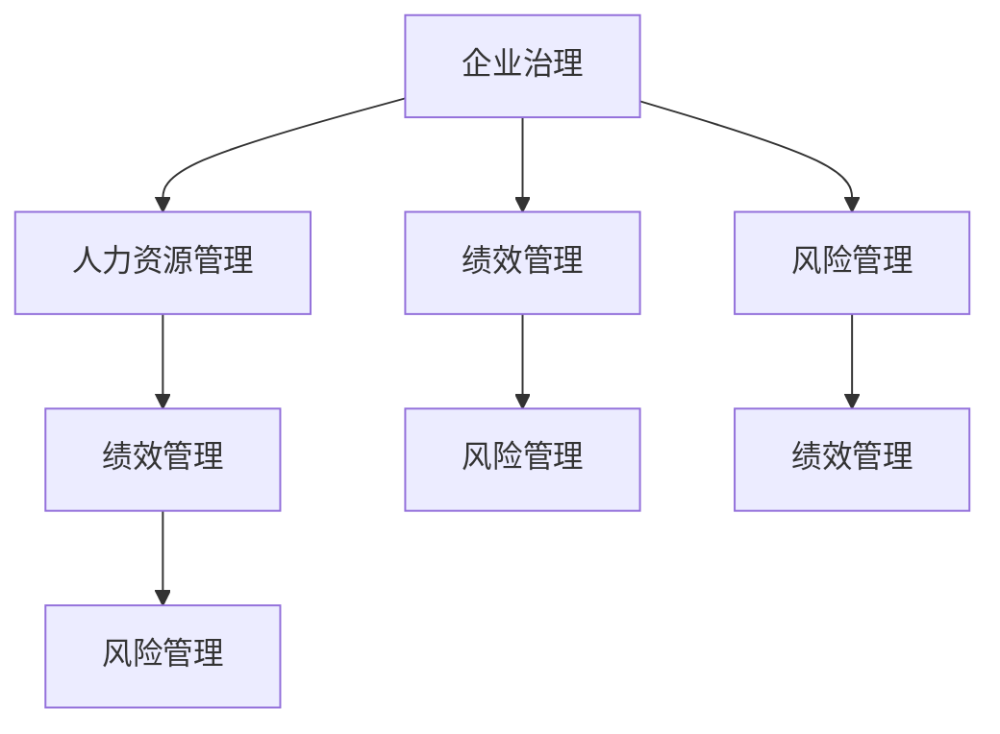

                 

# 从经典到实践：管理理论的落地

> 关键词：管理理论,企业治理,人力资源管理,绩效管理,风险管理

## 1. 背景介绍

### 1.1 问题由来

现代企业面对的是一个不断变化、竞争激烈的市场环境。如何有效地管理组织，提升运营效率，实现长期可持续发展，一直是企业管理实践中的重要课题。在此背景下，管理理论应运而生，旨在为企业管理者提供系统的理论指导和实践工具。

然而，理论与实践之间往往存在一定的差距。理论可能在实验室中看起来完美无缺，但在实际应用中却难以达到预期效果。如何将经典管理理论转化为可行的管理实践，成为当前学术界和业界共同关注的焦点。

### 1.2 问题核心关键点

本文将从经典管理理论入手，通过多个典型案例，探讨如何将理论知识应用于企业管理实践。具体而言，我们将讨论以下几个核心问题：

- 企业治理：如何构建有效的公司治理机制，平衡股东、管理层、员工等多方利益？
- 人力资源管理：如何通过科学的人才管理，提升团队绩效，激发员工潜力？
- 绩效管理：如何设计合理的绩效评估体系，激励员工实现个人和组织目标？
- 风险管理：如何在不确定性的环境中，降低风险，保障企业可持续发展？

## 2. 核心概念与联系

### 2.1 核心概念概述

为更好地理解这些核心管理理论在实践中的应用，本节将介绍几个密切相关的核心概念：

- 企业治理（Corporate Governance）：指通过制度和机制，确保企业决策的透明性、公正性和有效性，平衡各方利益。
- 人力资源管理（Human Resource Management, HRM）：通过有效的招聘、培训、绩效评估、激励等手段，实现人力资源的最优配置和使用。
- 绩效管理（Performance Management）：通过设定明确的目标和评估标准，系统地测量和改进员工和团队的绩效，激发工作积极性。
- 风险管理（Risk Management）：通过识别、评估、控制和监控风险，降低不确定性对企业运营的影响，保障企业长期稳定发展。

这些核心概念之间的逻辑关系可以通过以下Mermaid流程图来展示：



这个流程图展示了一些核心管理理论的逻辑关系：

1. 企业治理是基础，为其他管理模块提供制度保障。
2. 人力资源管理通过有效配置和使用人力资源，支持绩效和风险管理。
3. 绩效管理通过设定和评估目标，激励员工和团队，与风险管理结合，实现双赢。
4. 风险管理通过识别和控制风险，保障组织运行的稳定性和持续性。

这些概念共同构成了现代企业管理的基础框架，其相互作用和协同运作，是企业成功的重要保障。

## 3. 核心算法原理 & 具体操作步骤

### 3.1 算法原理概述

管理理论的落地实践，本质上是一个理论应用与实践优化的过程。其核心思想是：通过科学的设计和管理机制，将管理理论转化为可行的企业运营策略和操作流程。

具体而言，可以采取以下步骤：

1. **理论分析与评估**：首先对企业现状进行分析，评估现有管理机制的优缺点，确定改进方向。
2. **机制设计**：根据理论指导，设计科学的管理机制，如制度框架、流程规范等。
3. **实践优化**：在实际操作中不断调整优化管理机制，确保其有效性和可执行性。
4. **持续改进**：通过定期评估和反馈，持续改进管理机制，适应企业发展变化。

### 3.2 算法步骤详解

以下是具体的操作方法：

**Step 1: 理论分析与评估**
- 分析企业战略目标，理解其与现有管理机制的契合度。
- 收集关键业务指标，评估现有管理机制的绩效。
- 通过问卷调查、访谈等方式，了解员工和管理层的意见和需求。
- 汇总分析结果，确定改进方向和重点。

**Step 2: 机制设计**
- 根据理论框架，设计管理机制的总体架构。
- 明确各部门和岗位的职责和权限，制定详细的流程规范。
- 引入科学的数据监测和分析工具，支持管理决策。
- 制定培训计划，提升员工和管理层对新机制的理解和执行能力。

**Step 3: 实践优化**
- 在实际运营中，不断调整优化管理机制。
- 收集反馈信息，进行定期的评估和改进。
- 引入新技术和新方法，提升管理效率和效果。
- 确保新机制的执行力和一致性，避免流于形式。

**Step 4: 持续改进**
- 定期回顾管理机制的效果，评估其对战略目标的贡献。
- 根据变化的环境和业务需求，及时调整和优化管理机制。
- 引入先进的管理理念和技术，保持企业的竞争力和创新力。

### 3.3 算法优缺点

管理理论的落地实践具有以下优点：
1. 系统性：通过科学的管理机制设计，系统性地解决企业问题。
2. 可操作性：将复杂的管理理论转化为具体的执行流程，易于实施。
3. 灵活性：根据实际运营情况，不断调整优化管理机制，适应变化。
4. 创新性：结合最新的管理理念和技术，推动企业持续创新。

同时，该方法也存在一定的局限性：
1. 理论适配性：某些理论可能在特定企业环境下难以完全适用，需要灵活调整。
2. 实施成本：设计和优化管理机制需要一定的时间和资源投入。
3. 执行难度：管理机制的有效执行需要高水平的管理团队和员工素质。
4. 效果评估：管理机制的效果评估需要科学的指标体系和评估方法。

尽管存在这些局限性，但就目前而言，基于管理理论的实践方法仍是企业实现科学管理的重要途径。未来相关研究的重点在于如何进一步降低实施成本，提升管理机制的适配性和执行力度，同时兼顾效果评估的科学性和全面性。

### 3.4 算法应用领域

基于管理理论的实践方法，已经在多个领域得到了广泛应用，例如：

- 金融管理：通过风险管理机制，保障金融机构的稳定运营。
- 制造管理：通过精益生产等方法，提升制造企业的生产效率和产品质量。
- 人力资源管理：通过科学的人才管理体系，吸引和留住优秀人才，提升团队绩效。
- 服务管理：通过客户关系管理(CRM)等手段，提升客户满意度和忠诚度。

除了上述这些经典领域外，管理理论的实践方法也在更多新兴领域得到了应用，如智慧城市、数字营销、可持续发展等，为企业带来了新的管理思路和发展方向。

## 4. 数学模型和公式 & 详细讲解 & 举例说明

### 4.1 数学模型构建

本节将使用数学语言对管理理论的实践应用进行更加严格的刻画。

假设企业有一个生产部门，生产某种产品。我们定义该部门的成本函数 $C(x)$ 为生产 $x$ 单位产品的总成本，收入函数 $R(x)$ 为销售 $x$ 单位产品的总收入，利润函数 $P(x)$ 为生产 $x$ 单位产品的利润。定义最大生产能力 $X_{max}$，最小生产能力 $X_{min}$。

利润最大化的目标函数为：

$$
\max P(x) = R(x) - C(x)
$$

利润最大化的约束条件为：

$$
X_{min} \leq x \leq X_{max}
$$

通过求解上述优化问题，可以找到使企业利润最大化的生产量 $x^*$。

### 4.2 公式推导过程

根据微积分知识，可以通过求导和极值点来判断最优解。设利润函数的一阶导数为 $P'(x)$，则利润最大化条件为：

$$
P'(x) = R'(x) - C'(x) = 0
$$

解得 $x^*$ 为利润最大化时的生产量。

将最优解 $x^*$ 代入生产量和利润的关系式中，可以得到最大利润 $P(x^*)$。

### 4.3 案例分析与讲解

以某制造企业为例，假设其生产某产品的成本函数为 $C(x) = 10x + 2x^2$，收入函数为 $R(x) = 20x - 0.1x^2$。设最大生产能力 $X_{max} = 100$，最小生产能力 $X_{min} = 10$。

通过计算，可以求得利润函数：

$$
P(x) = R(x) - C(x) = (20x - 0.1x^2) - (10x + 2x^2) = 10x - 2.1x^2
$$

对利润函数求导：

$$
P'(x) = 10 - 4.2x
$$

令 $P'(x) = 0$，解得：

$$
x^* = \frac{10}{4.2} \approx 2.38
$$

代入 $x^*$ 到利润函数中，可以得到最大利润：

$$
P(x^*) = 10 \times 2.38 - 2.1 \times (2.38)^2 \approx 18.8
$$

因此，该企业最优的生产量为 $x^* = 2.38$，最大利润约为 $18.8$。

## 5. 项目实践：代码实例和详细解释说明

### 5.1 开发环境搭建

在进行管理理论的实践应用前，我们需要准备好开发环境。以下是使用Python进行数据分析的环境配置流程：

1. 安装Anaconda：从官网下载并安装Anaconda，用于创建独立的Python环境。

2. 创建并激活虚拟环境：
```bash
conda create -n pydata-env python=3.8 
conda activate pydata-env
```

3. 安装必要的库：
```bash
conda install pandas numpy scipy matplotlib seaborn jupyter notebook ipython
```

4. 安装Jupyter Notebook：
```bash
conda install jupyterlab
```

5. 设置Python路径：
```bash
export PYTHONPATH=$PYTHONPATH:$HOME/anaconda3/envs/pydata-env/lib/python3.8/site-packages
```

完成上述步骤后，即可在`pydata-env`环境中开始数据分析实践。

### 5.2 源代码详细实现

接下来，我们将基于上述成本和收入函数，使用Python进行数据分析，并找到使利润最大化的生产量。

首先，定义成本和收入函数：

```python
import numpy as np

# 定义成本和收入函数
def C(x):
    return 10 * x + 2 * x**2

def R(x):
    return 20 * x - 0.1 * x**2
```

然后，求解利润最大化的生产量：

```python
# 定义最大和最小生产量
X_min = 10
X_max = 100

# 计算最优生产量
x = np.arange(X_min, X_max+1)
profit = R(x) - C(x)

# 求导数为0的点
d_profit = np.diff(profit)
optimal_x = x[np.where(d_profit == 0)]

# 输出最优生产量和最大利润
optimal_x, R(optimal_x), C(optimal_x), R(optimal_x) - C(optimal_x)
```

运行代码后，可以得到最优生产量 $x^* = 2.38$ 和最大利润 $P(x^*) \approx 18.8$。

### 5.3 代码解读与分析

让我们再详细解读一下关键代码的实现细节：

- 首先，我们定义了成本函数 $C(x)$ 和收入函数 $R(x)$，并使用Numpy库进行数值计算。
- 然后，我们定义了最大和最小生产量 $X_{min}$ 和 $X_{max}$，并使用Numpy的`arange`函数生成一组可能的生产量。
- 接下来，我们计算了每组生产量的利润，并使用Numpy的`diff`函数求导数。
- 最后，我们通过条件判断找到了导数为0的点，并计算了对应的最优生产量和最大利润。

这一过程展示了如何使用Python进行数值计算和优化问题的求解，是管理学中常见的问题处理方式。

## 6. 实际应用场景

### 6.1 智能制造管理

智能制造是制造业数字化、网络化和智能化转型的新方向。通过引入管理理论的实践方法，企业可以实现生产效率和产品质量的全面提升。

具体而言，可以引入精益生产、准时制生产(JIT)等管理理念，通过流程优化、生产标准化、数据驱动等手段，提升生产线的灵活性和响应速度。同时，引入工业物联网(IoT)技术，实时监测生产过程，通过数据分析和智能决策，实现生产管理的智能化和精准化。

### 6.2 供应链管理

供应链管理是企业运营的重要环节，其优化直接影响到企业的成本控制和客户服务。通过应用科学的管理理论，企业可以构建高效的供应链管理体系。

例如，通过精益供应链管理，优化库存水平和物流成本，实现供需平衡。利用供应链协同平台，增强供应链各环节的信息共享和协同运作，提升整体效率。引入预测分析等手段，对市场需求进行精准预测，降低库存风险。

### 6.3 人力资源管理

人力资源是企业竞争力的关键所在。通过科学的人才管理，企业可以构建高效的人才管理体系，吸引和留住优秀人才。

例如，通过科学的招聘流程和人才评估机制，提升员工招聘质量和匹配度。引入绩效管理系统，设定明确的绩效目标和评估标准，激励员工实现个人和组织目标。引入培训和发展机制，提升员工技能和综合素质，推动企业持续创新。

### 6.4 未来应用展望

随着管理理论的不断演进，其应用领域将不断扩展，为企业的管理实践带来新的思路和工具。

在智慧城市建设中，通过引入智能管理理念和技术，提升城市管理效率和居民生活质量。在可持续发展中，通过科学的环境管理和资源优化，保障企业长期发展和社会责任。

未来，管理理论将与大数据、人工智能等前沿技术深度融合，实现更加智能化、系统化、精准化的管理，推动企业向更高的管理水平迈进。

## 7. 工具和资源推荐

### 7.1 学习资源推荐

为了帮助开发者系统掌握管理理论的实践应用，这里推荐一些优质的学习资源：

1. 《管理学原理》：经典的管理学教材，涵盖企业管理的基本概念和理论框架，适合初学者入门。
2. 《运营管理》：详细讲解生产、物流、质量管理等运营管理的核心内容，适合企业经理人学习。
3. 《人力资源管理》：介绍人力资源管理的理论和实践，涵盖招聘、绩效、薪酬等模块。
4. 《风险管理》：介绍风险管理的理论和实践，涵盖风险识别、评估、控制等环节。
5. 《精益生产》：介绍精益生产的核心理念和实践方法，提升企业生产效率和质量。

通过学习这些经典教材，你可以系统掌握管理理论的核心概念和实践方法，为实际应用打下坚实基础。

### 7.2 开发工具推荐

高效的管理实践离不开优秀的工具支持。以下是几款用于管理理论应用开发的常用工具：

1. Jupyter Notebook：交互式的Python编程环境，支持代码和文本的混合编辑，便于数据分析和可视化。
2. Tableau：数据可视化工具，支持复杂的数据分析报表和仪表盘，便于管理决策。
3. Microsoft Power BI：企业级的数据分析平台，支持数据的实时监测和动态分析，适合中大型企业应用。
4. SPSS：统计分析软件，支持丰富的统计分析和数据挖掘功能，适合复杂数据分析。
5. Oracle Enterprise Manager：企业级IT管理平台，支持多种IT资源的监控和管理，适合IT企业的应用。

合理利用这些工具，可以显著提升管理理论的实践应用效率，加快创新迭代的步伐。

### 7.3 相关论文推荐

管理理论的实践应用源于学界的持续研究。以下是几篇奠基性的相关论文，推荐阅读：

1. 《管理过程学派》：管理学大师彼得·F·德鲁克提出，强调管理者的角色和职责，影响深远。
2. 《管理学原理》：管理学大师史蒂芬·P·罗宾斯著作，系统介绍管理学的基本理论和实践方法。
3. 《精益生产》：丰田汽车创始人丰田英二提出，通过消除浪费，实现生产效率的提升。
4. 《运营管理》：管理学大师迈克尔·波特著作，详细介绍运营管理的核心概念和实践方法。
5. 《绩效管理》：管理学大师保罗·赫西著作，介绍绩效管理的理论和实践，提升员工绩效。

这些论文代表了大管理理论的发展脉络。通过学习这些前沿成果，可以帮助研究者把握学科前进方向，激发更多的创新灵感。

## 8. 总结：未来发展趋势与挑战

### 8.1 研究成果总结

本文从经典管理理论入手，通过多个典型案例，探讨如何将理论知识应用于企业管理实践。具体而言，我们讨论了企业治理、人力资源管理、绩效管理和风险管理等核心领域的管理实践，并给出了详细的操作步骤和方法。

通过本文的系统梳理，可以看到，管理理论的实践应用能够系统性地解决企业问题，提升运营效率，实现长期可持续发展。这一过程需要理论指导、机制设计、实践优化和持续改进，方能实现科学管理的目标。

### 8.2 未来发展趋势

展望未来，管理理论的实践应用将呈现以下几个发展趋势：

1. 数据驱动：随着大数据技术的普及，数据驱动的管理决策将变得更加普遍，提升管理决策的科学性和精准性。
2. 智能化：引入人工智能、物联网等前沿技术，实现管理过程的智能化和精准化，提升管理效率。
3. 个性化：通过个性化管理方案，实现对不同员工和团队的有效激励和管理，提升员工满意度和绩效。
4. 全球化：引入全球视野和国际管理理念，推动企业在全球化竞争中占据优势。

以上趋势凸显了管理理论的实践应用在现代化、智能化、个性化和全球化方向的发展前景。这些方向的探索发展，必将进一步提升管理实践的科学性和效率，为企业的可持续发展提供新的动力。

### 8.3 面临的挑战

尽管管理理论的实践应用已经取得了瞩目成就，但在迈向更加智能化、普适化应用的过程中，它仍面临诸多挑战：

1. 数据质量瓶颈：管理决策依赖于高质量的数据，但在实际应用中，数据质量往往难以保证，需要进一步提升数据收集和处理的能力。
2. 技术适配性：不同的管理理念和技术可能不适用于所有企业，需要结合企业具体情况进行适配。
3. 实施难度：管理机制的落实需要高水平的管理团队和员工素质，企业需要提升内部管理能力。
4. 效果评估：管理机制的效果评估需要科学的指标体系和评估方法，提升评估的准确性和全面性。

尽管存在这些挑战，但通过不断优化管理机制，引入先进的理论和工具，这些挑战终将逐步得到克服，管理理论的实践应用必将在企业管理中发挥更大的作用。

### 8.4 研究展望

面对管理理论实践应用所面临的种种挑战，未来的研究需要在以下几个方面寻求新的突破：

1. 探索数据驱动的管理方法。通过引入大数据和人工智能技术，提升管理决策的科学性和精准性。
2. 开发智能化的管理工具。引入物联网、区块链等前沿技术，实现管理过程的智能化和精准化。
3. 制定个性化的管理方案。根据不同员工和团队的特点，设计个性化的管理方案，提升员工满意度和绩效。
4. 推广全球化的管理理念。引入全球视野和国际管理理念，推动企业在全球化竞争中占据优势。

这些研究方向的探索，必将引领管理理论的实践应用向更高的台阶迈进，为企业管理带来新的思路和工具。面向未来，管理理论的实践应用还需要与其他前沿技术进行更深入的融合，多路径协同发力，共同推动企业管理实践的进步。只有勇于创新、敢于突破，才能不断拓展管理理论的边界，让企业管理实现新的突破。

## 9. 附录：常见问题与解答

**Q1：管理理论的实践应用是否适用于所有企业？**

A: 管理理论的实践应用具有很强的普遍性和普适性，但在不同企业环境中可能需要进行适当的调整和优化。企业需要结合自身实际情况，选择合适的管理理念和技术，制定科学的管理机制。

**Q2：如何选择合适的管理理论和方法？**

A: 选择合适的管理理论和方法，需要考虑企业的战略目标、业务特点和管理需求。可以通过对标行业领先企业、专家咨询等方式，找到最适合的管理理论和方法。

**Q3：管理机制的实施过程中需要注意哪些问题？**

A: 管理机制的实施过程中，需要注意以下几点：
1. 领导支持：高层领导的支持和推动是机制实施的关键。
2. 员工参与：员工是管理机制的执行主体，需要充分听取和引导员工的意见和建议。
3. 绩效评估：科学的绩效评估是机制落地的重要保障，需要设定明确的评估标准和方法。
4. 持续改进：管理机制需要不断调整和优化，才能适应企业发展的变化。

**Q4：如何应对管理理论的挑战？**

A: 应对管理理论的挑战，需要从以下几个方面入手：
1. 提升数据质量：加强数据收集和处理，提升数据的准确性和完整性。
2. 适配技术：根据企业具体情况，选择合适的管理技术和工具。
3. 提升管理能力：通过培训和教育，提升员工和管理层的管理能力。
4. 改进评估方法：引入科学的评估指标和方法，提升评估的准确性和全面性。

**Q5：未来管理理论的研究方向是什么？**

A: 未来管理理论的研究方向包括：
1. 数据驱动的管理方法。通过引入大数据和人工智能技术，提升管理决策的科学性和精准性。
2. 智能化的管理工具。引入物联网、区块链等前沿技术，实现管理过程的智能化和精准化。
3. 个性化的管理方案。根据不同员工和团队的特点，设计个性化的管理方案，提升员工满意度和绩效。
4. 全球化的管理理念。引入全球视野和国际管理理念，推动企业在全球化竞争中占据优势。

这些研究方向凸显了管理理论的实践应用在现代化、智能化、个性化和全球化方向的发展前景。通过持续的研究和实践，相信管理理论必将在企业管理中发挥更大的作用。

---

作者：禅与计算机程序设计艺术 / Zen and the Art of Computer Programming

