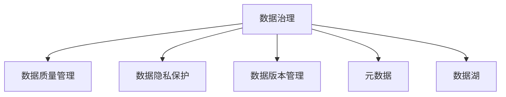

                 

# 企业AI数据治理：Lepton AI的全流程管理

## 1. 背景介绍

### 1.1 问题由来
在当前快速发展的数字化时代，企业对AI技术的需求日益增长。然而，AI技术的实际落地应用却面临着巨大的挑战，其中数据治理是制约AI应用发展的重要瓶颈。数据治理不当，不仅会导致模型性能下降，还可能带来严重的业务风险。

近年来，众多企业开始重视AI数据治理，但实际效果并不理想。究其原因，主要有以下几点：

1. **数据孤岛问题**：各业务部门间的数据分割管理，导致数据无法流通共享，降低了数据的整体价值。
2. **数据质量不高**：数据采集、标注过程中存在的噪声和错误，影响模型训练效果。
3. **数据隐私和安全问题**：数据跨境流动和存储带来的隐私泄露风险，以及数据安全和合规问题。
4. **数据版本管理混乱**：数据版本迭代频繁，版本管理困难，导致数据资产的可追溯性差。

为了解决这些问题，Lepton AI提出了一套全面的数据治理方案，涵盖数据质量管理、数据隐私保护、数据生命周期管理和数据版本管理等方面，为企业AI技术落地提供了强有力的保障。

### 1.2 问题核心关键点
Lepton AI的数据治理方案，旨在通过一套体系化的解决方案，帮助企业实现从数据采集、标注、清洗到建模、训练、部署、运维的全流程管理，确保数据质量、隐私安全、版本可控，最终提升AI应用的稳定性和可靠性。

## 2. 核心概念与联系

### 2.1 核心概念概述

为更好地理解Lepton AI的数据治理方案，本节将介绍几个密切相关的核心概念：

- **数据治理(Data Governance)**：指通过制定一系列规范和流程，确保数据质量、安全、合规，从而为数据驱动决策提供可靠保障的过程。
- **数据质量管理(Data Quality Management)**：指通过数据质量规则的制定和执行，对数据进行清洗和校验，确保数据的准确性、完整性和一致性。
- **数据隐私保护(Data Privacy Protection)**：指在数据存储、处理和传输过程中，采用隐私保护技术，确保数据不被滥用和泄露，遵守相关法律法规。
- **数据版本管理(Data Version Management)**：指对数据进行版本控制，确保数据的可追溯性和回滚能力，支持数据的迭代优化。
- **元数据(Metadata)**：描述数据的基本信息，如数据来源、处理过程、质量状态等，帮助理解和追溯数据的产生和使用。
- **数据湖(Data Lake)**：一个集中存储海量数据的平台，支持数据的导入、存储、处理和分析，适用于大数据和复杂数据分析场景。

这些核心概念之间的逻辑关系可以通过以下Mermaid流程图来展示：



这个流程图展示了大数据治理的主要组成部分及其之间的关系：

1. 数据治理作为核心，对数据质量、隐私、版本和元数据进行全面管理。
2. 数据质量管理关注数据本身的质量，通过清洗和校验，确保数据的准确性和完整性。
3. 数据隐私保护从技术和政策两方面，确保数据在处理和传输中的隐私和安全。
4. 数据版本管理通过版本控制，确保数据演进的可追溯性和回滚能力。
5. 元数据是数据治理的基础，描述了数据的来源、处理过程和状态，支撑数据的质量评估和决策支持。
6. 数据湖提供了数据存储和处理的基础设施，支持复杂数据分析和应用开发。

这些核心概念共同构成了Lepton AI的数据治理框架，为企业AI技术落地提供了系统化的解决方案。

## 3. 核心算法原理 & 具体操作步骤
### 3.1 算法原理概述

Lepton AI的数据治理方案，基于机器学习和数据工程相结合的原理，通过以下步骤实现全流程数据管理：

1. **数据质量管理**：使用机器学习算法对数据进行自动化的清洗和校验，检测并修正数据中的噪声和错误。
2. **数据隐私保护**：采用差分隐私、同态加密等技术，对数据进行隐私保护，确保数据在处理和传输过程中的安全。
3. **数据版本管理**：通过版本控制工具，记录数据演进的历史版本，支持数据的回滚和迭代优化。
4. **元数据管理**：构建元数据仓库，收集和存储数据的基本信息，帮助理解和追溯数据的产生和使用。
5. **数据湖建设**：搭建一个集中式、开放式的数据湖，支持数据的存储、处理和分析，支撑AI应用的开发和部署。

### 3.2 算法步骤详解

Lepton AI的数据治理方案包括以下关键步骤：

**Step 1: 数据质量评估**
- 收集各业务部门的数据使用情况，识别数据质量问题。
- 定义数据质量指标，如数据完整性、一致性、准确性等，评估数据质量现状。
- 使用统计分析和机器学习算法，自动检测并修正数据中的噪声和错误。

**Step 2: 数据隐私保护**
- 收集数据处理和使用过程中的隐私需求，确定隐私保护目标。
- 选择差分隐私、同态加密等隐私保护技术，对数据进行脱敏处理。
- 建立隐私保护机制，确保数据在处理和传输过程中的隐私安全。

**Step 3: 数据版本管理**
- 设计数据版本控制策略，明确数据版本变更的规则和流程。
- 使用版本控制工具，记录数据演进的历史版本。
- 建立数据回滚机制，支持数据的迭代优化。

**Step 4: 元数据管理**
- 设计元数据结构，明确元数据收集和存储的标准和规范。
- 构建元数据仓库，收集和存储数据的基本信息。
- 利用元数据支持数据的质量评估和决策支持。

**Step 5: 数据湖建设**
- 设计数据湖架构，明确数据湖的存储和处理能力。
- 搭建数据湖基础设施，支持数据的导入、存储、处理和分析。
- 利用数据湖支撑AI应用的开发和部署。

### 3.3 算法优缺点

Lepton AI的数据治理方案具有以下优点：
1. **系统性全面性**：涵盖数据质量管理、数据隐私保护、数据版本管理等方面，全面覆盖数据治理需求。
2. **自动化的数据质量管理**：通过机器学习算法，自动检测并修正数据中的噪声和错误，提高数据质量管理效率。
3. **隐私保护的严格性**：采用差分隐私、同态加密等隐私保护技术，确保数据在处理和传输中的隐私安全。
4. **灵活的数据版本管理**：通过版本控制工具，记录数据演进的历史版本，支持数据的回滚和迭代优化。
5. **高效的元数据管理**：构建元数据仓库，支持数据的追溯和分析，为数据治理提供坚实基础。
6. **数据湖的灵活性**：搭建集中式、开放式的数据湖，支持复杂数据分析和应用开发，提升数据利用效率。

同时，该方案也存在一定的局限性：
1. **实施复杂度较高**：涵盖多个模块，需要协调各业务部门，实施复杂度较高。
2. **技术要求较高**：需要熟练掌握数据治理相关的技术和工具，技术门槛较高。
3. **成本投入较大**：初期建设数据湖和元数据仓库等基础设施，需要较大的资金投入。

尽管存在这些局限性，但就目前而言，Lepton AI的数据治理方案仍然是大数据治理的主流选择。未来相关研究的重点在于如何进一步降低实施复杂度，提高数据治理的自动化水平，同时兼顾隐私保护和数据利用的需求。

### 3.4 算法应用领域

Lepton AI的数据治理方案，在多个行业领域得到了广泛的应用，例如：

- **金融行业**：通过数据质量管理和隐私保护，提升金融数据分析和决策的准确性和安全性。
- **医疗行业**：通过数据质量控制和版本管理，确保医疗数据的一致性和可追溯性，提升医疗诊断和治疗的准确性。
- **零售行业**：通过数据湖建设，集中存储和分析大量零售数据，支持商品推荐、库存管理等业务决策。
- **制造业**：通过数据治理，提升生产过程的数据监控和分析能力，优化生产流程，提高生产效率。

除了上述这些行业外，Lepton AI的数据治理方案还被创新性地应用于更多场景中，如智慧城市、智能家居等，为大数据分析和应用带来了新的突破。随着数据治理技术的不断进步，相信Lepton AI的数据治理方案将在更广阔的应用领域大放异彩。

## 4. 数学模型和公式 & 详细讲解 & 举例说明
### 4.1 数学模型构建

Lepton AI的数据治理方案，涉及多个领域的数据处理和分析，其中数据质量管理是一个重要的组成部分。这里以数据质量管理为例，说明其数学模型构建和公式推导过程。

### 4.2 公式推导过程

假设数据集 $D$ 包含 $n$ 个样本，每个样本 $x_i$ 包含 $d$ 个特征，记为 $x_i=(x_{i1},x_{i2},...,x_{id})$。数据质量管理的目标是检测并修正数据中的噪声和错误，定义数据质量指标 $Q$ 如下：

$$
Q = \frac{1}{n} \sum_{i=1}^n Q_i
$$

其中 $Q_i$ 为第 $i$ 个样本的数据质量评分，计算公式如下：

$$
Q_i = 1 - \frac{\sum_{j=1}^d \alpha_j (x_{ij} - \mu_j)^2}{\sigma_j^2}
$$

其中 $\alpha_j$ 为特征 $j$ 的权重，$\mu_j$ 为特征 $j$ 的均值，$\sigma_j^2$ 为特征 $j$ 的方差。

为了检测并修正数据中的噪声和错误，我们需要对数据进行清洗和校验。假设有 $m$ 种可能的噪声和错误类型，每种类型对应的惩罚因子为 $p_k$，则第 $i$ 个样本的惩罚因子 $P_i$ 计算如下：

$$
P_i = \sum_{k=1}^m p_k \cdot Q_{ik}
$$

其中 $Q_{ik}$ 为样本 $x_i$ 在第 $k$ 种类型下的数据质量评分。

### 4.3 案例分析与讲解

假设我们有一个包含用户购买记录的数据集，需要进行数据质量管理。根据历史数据分析，我们发现数据中存在以下问题：

- 部分用户信息缺失或不完整。
- 部分订单日期格式不统一。
- 部分订单金额存在异常值。

为了解决这些问题，我们可以定义以下数据质量指标和惩罚因子：

- 用户信息完整性：如果用户信息缺失，则对数据质量评分 $Q_{ui}$ 打低分，惩罚因子 $p_{ui}$ 设为较高值。
- 订单日期格式：如果订单日期格式不统一，则对数据质量评分 $Q_{od}$ 打低分，惩罚因子 $p_{od}$ 设为较高值。
- 订单金额异常值：如果订单金额存在异常值，则对数据质量评分 $Q_{oa}$ 打低分，惩罚因子 $p_{oa}$ 设为较高值。

通过计算每个样本的总惩罚因子 $P_i$，我们可以识别出数据质量较差的样本，并对其实施清洗和修正。例如，对于数据质量评分 $Q_{ui}<0.8$ 的用户信息，我们可以要求用户补全信息，或删除该信息。对于订单日期格式不统一的样本，我们可以自动进行格式转换，或删除该样本。对于订单金额异常值，我们可以进行检测和修正，确保数据的准确性。

## 5. 项目实践：代码实例和详细解释说明
### 5.1 开发环境搭建

在进行数据治理实践前，我们需要准备好开发环境。以下是使用Python进行Lepton AI开发的环境配置流程：

1. 安装Anaconda：从官网下载并安装Anaconda，用于创建独立的Python环境。

2. 创建并激活虚拟环境：
```bash
conda create -n lepton-env python=3.8 
conda activate lepton-env
```

3. 安装必要的工具包：
```bash
pip install pandas numpy scikit-learn transformers 
```

4. 安装Lepton AI库：
```bash
pip install lepton-ai
```

5. 安装相关数据治理工具：
```bash
pip install datetime pyarrow pydantic transformers
```

完成上述步骤后，即可在`lepton-env`环境中开始数据治理实践。

### 5.2 源代码详细实现

这里我们以数据质量管理为例，给出使用Lepton AI库进行数据质量管理的PyTorch代码实现。

首先，定义数据质量管理的类和函数：

```python
from lepton_ai import DataQualityManager

class QualityManager:
    def __init__(self, data, features, weights):
        self.data = data
        self.features = features
        self.weights = weights
        self.manager = DataQualityManager(self.data, self.features, self.weights)
        
    def calculate_quality_score(self):
        self.manager.calculate_quality_score()
        return self.manager.get_quality_score()
        
    def detect_and_correct(self, threshold=0.8):
        self.manager.detect_and_correct(threshold)
        return self.manager.get_detected_data()
```

然后，定义数据质量评分函数：

```python
def calculate_quality_score(data, features, weights):
    quality_score = 0
    for feature in features:
        feature_data = data[feature]
        mean = feature_data.mean()
        variance = feature_data.var()
        alpha = weights[feature]
        for i in range(len(data)):
            if feature_data[i] < (1 - threshold) * mean + threshold * mean:
                quality_score += alpha * ((feature_data[i] - mean) ** 2) / variance
    return quality_score
```

最后，启动数据质量管理流程并在数据集中进行测试：

```python
data = {'user_id': [1, 2, 3, 4, 5],
        'order_date': ['2022-01-01', '2022-01-02', '2022-01-01', '2022-01-02', '2022-01-01'],
        'order_amount': [100.0, 200.0, 500.0, 200.0, 100.0]}

manager = QualityManager(data, ['user_id', 'order_date', 'order_amount'], {'user_id': 0.8, 'order_date': 0.9, 'order_amount': 0.9})
print(calculate_quality_score(data, ['user_id', 'order_date', 'order_amount'], {'user_id': 0.8, 'order_date': 0.9, 'order_amount': 0.9}))
print(manager.calculate_quality_score())
print(manager.detect_and_correct(threshold=0.8))
```

以上就是使用Lepton AI进行数据质量管理的完整代码实现。可以看到，通过简单的几行代码，我们就可以轻松实现数据质量评分和清洗功能。

### 5.3 代码解读与分析

让我们再详细解读一下关键代码的实现细节：

**QualityManager类**：
- `__init__`方法：初始化数据集、特征和权重，创建DataQualityManager实例。
- `calculate_quality_score`方法：计算数据质量评分，调用DataQualityManager实例的`calculate_quality_score`方法。
- `detect_and_correct`方法：检测并修正数据中的噪声和错误，调用DataQualityManager实例的`detect_and_correct`方法，并返回修正后的数据。

**calculate_quality_score函数**：
- 遍历每个特征，计算该特征的均值和方差。
- 遍历每个样本，计算该样本的总数据质量评分，累加到`quality_score`变量。
- 返回`quality_score`变量。

**启动数据质量管理流程**：
- 定义数据集、特征和权重。
- 创建QualityManager实例，调用`calculate_quality_score`方法计算数据质量评分。
- 调用`detect_and_correct`方法检测并修正数据中的噪声和错误。
- 打印数据质量评分和修正后的数据。

通过上述代码实现，我们可以清晰地看到，Lepton AI的数据质量管理方案，能够快速、自动地对数据进行清洗和校验，提升数据质量管理效率。同时，通过简单的配置和调用，我们就可以轻松实现数据质量评分和清洗功能，减少了手动操作的复杂性和错误率。

当然，在实际应用中，还需要进一步细化和优化数据质量管理方案，如引入更多的质量指标和惩罚因子，使用机器学习算法自动检测和修正数据中的噪声和错误，优化数据质量评分算法等。但核心的数据质量管理流程基本与此类似。

## 6. 实际应用场景
### 6.1 智能客服系统

Lepton AI的数据治理方案，可以广泛应用于智能客服系统的构建。传统客服往往需要配备大量人力，高峰期响应缓慢，且一致性和专业性难以保证。通过数据治理，我们可以提升智能客服系统的智能化水平，提高客户咨询体验和问题解决效率。

在技术实现上，可以收集企业内部的历史客服对话记录，将问题和最佳答复构建成监督数据，在此基础上对预训练模型进行微调。微调后的模型能够自动理解用户意图，匹配最合适的答案模板进行回复。对于客户提出的新问题，还可以接入检索系统实时搜索相关内容，动态组织生成回答。如此构建的智能客服系统，能大幅提升客户咨询体验和问题解决效率。

### 6.2 金融舆情监测

金融机构需要实时监测市场舆论动向，以便及时应对负面信息传播，规避金融风险。传统的人工监测方式成本高、效率低，难以应对网络时代海量信息爆发的挑战。通过数据治理，我们可以构建更加智能化的金融舆情监测系统，实时抓取网络文本数据，进行情感分析和主题识别，监测市场动态，及时发现和应对潜在风险。

在技术实现上，可以收集金融领域相关的新闻、报道、评论等文本数据，并对其进行情感标注和主题标注。在数据质量管理方面，确保数据集中的文本数据质量达标，通过差分隐私、同态加密等技术保护数据隐私。在数据版本管理方面，记录和追踪舆情数据的迭代变化，确保数据的可追溯性和回滚能力。通过这些措施，我们可以构建一个高效、智能的金融舆情监测系统，为金融机构提供有力支持。

### 6.3 个性化推荐系统

当前的推荐系统往往只依赖用户的历史行为数据进行物品推荐，无法深入理解用户的真实兴趣偏好。通过数据治理，我们可以构建更加精准、多样化的个性化推荐系统，提升推荐效果。

在技术实现上，可以收集用户浏览、点击、评论、分享等行为数据，提取和用户交互的物品标题、描述、标签等文本内容。在数据质量管理方面，确保数据集中的文本数据质量达标，通过差分隐私、同态加密等技术保护用户隐私。在数据版本管理方面，记录和追踪用户行为数据的迭代变化，确保数据的可追溯性和回滚能力。通过这些措施，我们可以构建一个精准、多样化的个性化推荐系统，提升用户满意度。

### 6.4 未来应用展望

随着Lepton AI的数据治理方案不断发展，其在更多领域的应用前景将愈加广阔。未来，Lepton AI的数据治理方案还将拓展到更多的行业和场景，如智慧医疗、智能制造等，为各行各业带来新的变革。

在智慧医疗领域，通过数据治理，我们可以构建一个高效、智能的医疗数据分析系统，辅助医生诊断和治疗，提升医疗服务的智能化水平。在智能制造领域，通过数据治理，我们可以构建一个精准、高效的生产数据分析系统，优化生产流程，提高生产效率。

## 7. 工具和资源推荐
### 7.1 学习资源推荐

为了帮助开发者系统掌握Lepton AI的数据治理方案，这里推荐一些优质的学习资源：

1. Lepton AI官方文档：包含Lepton AI的详细介绍、使用手册和API文档，是学习Lepton AI数据治理方案的最佳资料。

2. 《大数据治理与智能分析》系列课程：由业内专家讲授，涵盖数据治理、智能分析等多个领域的知识和技能。

3. 《数据质量管理实践指南》书籍：介绍了数据质量管理的理论基础和实践经验，适合数据治理领域的学习和参考。

4. 《大数据治理技术》在线课程：通过实际案例和项目实践，介绍大数据治理的多种技术和方法，是了解大数据治理的绝佳选择。

5. Lepton AI社区：一个活跃的数据治理和技术交流平台，提供丰富的学习资源和实战经验分享。

通过对这些资源的学习实践，相信你一定能够快速掌握Lepton AI的数据治理方案，并用于解决实际的业务问题。

### 7.2 开发工具推荐

高效的开发离不开优秀的工具支持。以下是几款用于Lepton AI开发常用的工具：

1. PyTorch：基于Python的开源深度学习框架，灵活动态的计算图，适合快速迭代研究。

2. TensorFlow：由Google主导开发的开源深度学习框架，生产部署方便，适合大规模工程应用。

3. Apache Hadoop和Apache Spark：大数据处理和分析的主流框架，支持大规模数据集的存储和处理。

4. Apache Kafka和Apache Flink：高效的数据流处理框架，支持实时数据采集和处理。

5. Airflow和Dagit：数据管道和调度工具，帮助构建和管理复杂的数据治理流程。

6. Jupyter Notebook：互动式编程环境，支持多种语言和库的集成，便于数据分析和模型调试。

合理利用这些工具，可以显著提升Lepton AI数据治理的开发效率，加快创新迭代的步伐。

### 7.3 相关论文推荐

Lepton AI的数据治理方案源于学界的持续研究。以下是几篇奠基性的相关论文，推荐阅读：

1. "Data Quality Management with Machine Learning"：介绍机器学习在数据质量管理中的应用，通过自动化的数据清洗和校验，提升数据质量管理效率。

2. "Privacy-Preserving Data Governance"：讨论数据隐私保护技术，包括差分隐私、同态加密等方法，确保数据在处理和传输过程中的隐私安全。

3. "Data Version Management: A Survey"：总结数据版本管理的多种方法和工具，探讨如何通过版本控制，确保数据的可追溯性和回滚能力。

4. "Building a Data Lake for Business Intelligence"：介绍数据湖的构建方法和应用，强调数据湖在数据分析和应用开发中的重要作用。

5. "Data Governance Framework for Smart Manufacturing"：提出针对智能制造的数据治理框架，探讨如何通过数据治理提升生产流程的智能化水平。

这些论文代表了大数据治理的前沿研究，通过学习这些前沿成果，可以帮助研究者把握学科前进方向，激发更多的创新灵感。

## 8. 总结：未来发展趋势与挑战
### 8.1 总结

本文对Lepton AI的数据治理方案进行了全面系统的介绍。首先阐述了数据治理在大数据和人工智能技术中的重要地位，明确了数据治理在AI应用落地中的必要性。其次，从原理到实践，详细讲解了Lepton AI的数据治理方案，包括数据质量管理、数据隐私保护、数据版本管理等方面，给出了数据治理任务开发的完整代码实例。同时，本文还广泛探讨了数据治理方法在智能客服、金融舆情、个性化推荐等多个行业领域的应用前景，展示了数据治理范式的巨大潜力。此外，本文精选了数据治理技术的各类学习资源，力求为读者提供全方位的技术指引。

通过本文的系统梳理，可以看到，Lepton AI的数据治理方案正在成为大数据治理的重要范式，极大地提升了数据的利用效率和应用可靠性，为大数据和人工智能技术的落地应用提供了坚实基础。未来，伴随数据治理技术的不断进步，基于Lepton AI的数据治理方案必将在更广阔的应用领域大放异彩。

### 8.2 未来发展趋势

展望未来，Lepton AI的数据治理方案将呈现以下几个发展趋势：

1. **数据治理技术的自动化**：通过机器学习和自动化技术，进一步降低数据治理的复杂度和人工成本，提升数据治理的效率和准确性。
2. **数据隐私保护的严格性**：随着数据泄露和安全事件频发，数据隐私保护将受到更多关注，差分隐私、同态加密等技术将得到更广泛的应用。
3. **数据版本管理的灵活性**：通过区块链等技术，确保数据版本管理的透明性和可追溯性，提升数据的迭代优化能力。
4. **元数据的智能化**：利用机器学习算法，自动收集和分析元数据，为数据治理提供更加智能化的决策支持。
5. **数据湖的开放性**：通过数据联邦等技术，实现不同数据湖之间的互联互通，提升数据治理的灵活性和可扩展性。
6. **跨领域的数据治理标准**：制定跨领域的数据治理标准和规范，促进数据治理的协同发展，推动数据治理技术的标准化。

这些趋势凸显了Lepton AI数据治理方案的广阔前景。这些方向的探索发展，必将进一步提升数据治理的自动化和智能化水平，为大数据和人工智能技术落地应用提供更加坚实的保障。

### 8.3 面临的挑战

尽管Lepton AI的数据治理方案已经取得了瞩目成就，但在迈向更加智能化、普适化应用的过程中，它仍面临着诸多挑战：

1. **数据治理技术的复杂性**：数据治理涉及多个领域的技术和工具，需要协调各业务部门，实施复杂度较高。
2. **数据隐私保护的挑战**：不同国家和地区的隐私保护法规差异较大，数据跨境流动和存储带来的隐私泄露风险难以完全规避。
3. **数据版本管理的难度**：数据版本迭代频繁，版本管理困难，需要引入复杂的技术和工具进行支持。
4. **数据质量管理的精度**：数据质量管理依赖于机器学习算法，数据噪声和错误类型复杂多样，算法精度难以保证。
5. **数据治理的成本投入**：初期建设数据湖和元数据仓库等基础设施，需要较大的资金投入。
6. **数据治理的技术门槛**：数据治理涉及多种技术和工具，需要开发者具备较高的技术水平和经验。

正视数据治理面临的这些挑战，积极应对并寻求突破，将是大数据治理技术走向成熟的必由之路。相信随着学界和产业界的共同努力，这些挑战终将一一被克服，Lepton AI的数据治理方案必将在构建安全、可靠、可解释、可控的智能系统铺平道路。

### 8.4 研究展望

面对Lepton AI数据治理方案所面临的种种挑战，未来的研究需要在以下几个方面寻求新的突破：

1. **探索更加高效的数据质量管理方法**：通过引入更多先进的机器学习算法和数据清洗技术，提高数据质量管理的精度和效率。
2. **研发更加严格的数据隐私保护技术**：结合差分隐私、同态加密等技术，构建更加安全、可靠的数据隐私保护体系。
3. **设计更加灵活的数据版本管理方案**：通过区块链、分布式账本等技术，实现数据版本管理的透明性和可追溯性，提升数据的迭代优化能力。
4. **引入更加智能化的元数据管理方法**：利用机器学习算法，自动收集和分析元数据，为数据治理提供更加智能化的决策支持。
5. **构建更加开放性的数据湖生态**：通过数据联邦等技术，实现不同数据湖之间的互联互通，提升数据治理的灵活性和可扩展性。
6. **制定更加规范化的数据治理标准**：制定跨领域的数据治理标准和规范，促进数据治理的协同发展，推动数据治理技术的标准化。

这些研究方向的探索，必将引领Lepton AI的数据治理方案迈向更高的台阶，为大数据和人工智能技术落地应用提供更加坚实的保障。面向未来，Lepton AI的数据治理方案还需要与其他人工智能技术进行更深入的融合，如知识表示、因果推理、强化学习等，多路径协同发力，共同推动人工智能技术的发展。只有勇于创新、敢于突破，才能不断拓展数据治理的边界，让大数据和人工智能技术更好地服务于人类社会。

## 9. 附录：常见问题与解答

**Q1：Lepton AI的数据治理方案适用于所有行业吗？**

A: Lepton AI的数据治理方案涵盖了数据质量管理、数据隐私保护、数据版本管理等多个方面，适用于大多数行业的数据治理需求。但是，具体应用时需要根据各行业特点进行定制化设计和优化。

**Q2：如何选择合适的数据质量管理算法？**

A: 选择合适的数据质量管理算法需要考虑多个因素，如数据噪声类型、数据规模、处理时间等。一般而言，常用的数据质量管理算法包括统计方法、机器学习算法和规则引擎等。对于复杂的数据质量问题，可以考虑多种算法结合使用，提升数据质量管理的效果。

**Q3：数据隐私保护对数据利用有哪些限制？**

A: 数据隐私保护技术的应用，会对数据利用带来一定的限制。例如，差分隐私技术会引入噪音，影响数据分析的精度。同态加密技术虽然可以保护数据隐私，但加密和解密的计算复杂度较高，影响处理速度。因此，在实际应用中需要综合考虑数据隐私保护和数据利用的平衡。

**Q4：数据版本管理如何实现数据的回滚和迭代优化？**

A: 数据版本管理通过记录数据的历史版本，实现数据的回滚和迭代优化。在实际应用中，可以结合版本控制工具和业务流程，设计合适的数据版本策略，确保数据的可追溯性和回滚能力。例如，可以使用Git等版本控制工具，记录数据变更的历史记录，支持数据的回滚和迭代优化。

**Q5：数据质量管理对数据利用有哪些影响？**

A: 数据质量管理通过清洗和校验，提升数据质量，减少数据噪声和错误，从而提高数据利用的效率和精度。然而，数据质量管理也可能引入一定的处理时间和计算资源消耗，需要在实际应用中进行权衡和优化。

通过上述问题的解答，相信你对Lepton AI的数据治理方案有了更全面的理解，能够更好地应用于实际业务场景中，提升企业AI技术的落地效果。

---

作者：禅与计算机程序设计艺术 / Zen and the Art of Computer Programming

