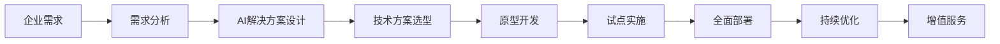

                 

# 企业AI转型咨询：Lepton AI的增值服务

> 关键词：人工智能(AI), AI咨询,企业转型,Lepton AI,增值服务,数据驱动,数字化转型

## 1. 背景介绍

### 1.1 问题由来

在当前数字化时代，企业面临着前所未有的竞争压力。如何利用技术手段提升企业运营效率，增强市场竞争力，成为企业决策者们普遍关注的问题。人工智能（AI）技术的快速发展和广泛应用，为各行业提供了新的转型机遇。然而，AI技术的应用往往需要高昂的研发成本和持续的技术投入，这对中小型企业来说是一大挑战。

### 1.2 问题核心关键点

在AI转型的过程中，如何根据企业的实际需求选择合适的技术方案，提升AI项目的落地效果，是AI咨询工作的核心关键点。这不仅需要深刻理解AI技术的原理和应用场景，还需要对企业运营和管理有深入的了解。Lepton AI的咨询团队多年来一直致力于为企业提供个性化的AI解决方案，帮助企业在AI转型道路上少走弯路，实现价值最大化。

### 1.3 问题研究意义

AI咨询的核心在于帮助企业最大化AI技术带来的价值。通过精准的需求分析和解决方案设计，AI咨询能够帮助企业在短时间内快速实现业务流程的自动化、智能化，提升企业的市场竞争力和创新能力。Lepton AI通过丰富的项目经验和技术积累，已经为众多企业提供了成功的AI转型案例，具有深厚的实践基础和理论支撑。

## 2. 核心概念与联系

### 2.1 核心概念概述

- **人工智能(AI)**：利用计算机技术模拟人类智能，解决复杂问题的一种技术手段。
- **AI咨询**：结合AI技术和企业需求，提供针对性的解决方案，帮助企业实现AI技术落地。
- **企业转型**：在数字化、智能化趋势下，企业重新定位、重构组织架构、重塑运营模式的过程。
- **Lepton AI**：一家专注于AI咨询和技术研发的公司，致力于为企业提供从需求分析到项目实施的全程支持。
- **增值服务**：通过AI技术和专业服务，为企业的业务运营带来附加价值，提升整体竞争力。

这些核心概念之间相互联系，共同构成了Lepton AI的AI咨询服务体系。AI技术是工具和手段，企业转型是目标和方向，Lepton AI则提供专业服务和咨询，增值服务则是最终目的。

### 2.2 核心概念原理和架构的 Mermaid 流程图(Mermaid 流程节点中不要有括号、逗号等特殊字符)



这个流程图展示了Lepton AI提供AI咨询服务的全流程。从需求分析到原型开发，再到试点实施和全面部署，最终实现增值服务，企业能够在各个环节都得到专业指导和支持。

## 3. 核心算法原理 & 具体操作步骤

### 3.1 算法原理概述

Lepton AI的AI咨询服务，基于数据驱动和业务导向的原则，结合AI技术的应用场景，为企业量身定制解决方案。核心算法原理包括以下几个方面：

1. **需求分析**：通过问卷调查、访谈、数据分析等方法，深入了解企业的业务需求和痛点，明确AI转型的目标和方向。
2. **AI解决方案设计**：根据需求分析结果，结合AI技术的最新发展，设计可行的技术方案。
3. **技术方案选型**：从众多AI技术中，选择最适合企业需求的技术和工具，进行原型开发和试点测试。
4. **试点实施**：在试点范围内应用选定的技术方案，进行小规模验证和优化。
5. **全面部署**：根据试点结果，调整和优化技术方案，进行全面推广和部署。
6. **持续优化**：对AI项目进行持续监控和优化，确保其在企业运营中的长期价值。

### 3.2 算法步骤详解

#### 3.2.1 需求分析

1. **问卷调查**：设计详细的问卷，收集企业高层管理人员、中层管理者、员工对AI技术的看法和期望。
2. **数据分析**：利用数据分析工具，对企业历史数据进行挖掘，找出业务流程中的瓶颈和痛点。
3. **访谈和讨论**：与企业高层、中层及一线员工进行深入访谈，了解他们的真实需求和期望。
4. **总结和反馈**：结合问卷、数据分析和访谈结果，形成需求分析报告，并进行反馈。

#### 3.2.2 AI解决方案设计

1. **需求映射**：将业务需求映射到AI技术中，明确需要解决的问题和目标。
2. **技术选型**：从机器学习、自然语言处理、计算机视觉等AI技术中，选择最适合的技术和工具。
3. **方案设计**：设计具体的技术实现方案，包括数据处理、模型训练、系统集成等。

#### 3.2.3 技术方案选型

1. **技术评估**：评估各种AI技术的优缺点，选择最适合企业需求的技术。
2. **成本效益分析**：考虑技术的成本、收益和可行性，进行全面的成本效益分析。
3. **原型开发**：开发技术原型，进行初步测试和验证。

#### 3.2.4 试点实施

1. **小范围试点**：在企业内部选择一个小范围的试点项目，应用选定的技术方案。
2. **数据准备**：准备试点所需的数据，进行数据清洗和预处理。
3. **模型训练**：根据业务需求，进行模型训练和优化。
4. **系统集成**：将训练好的模型集成到企业现有的IT系统中。
5. **试点测试**：进行小规模测试，评估试点效果。

#### 3.2.5 全面部署

1. **方案调整**：根据试点测试结果，调整和优化技术方案。
2. **大规模部署**：将优化后的技术方案在企业范围内进行全面推广和部署。
3. **系统集成**：将AI系统与企业的业务系统、数据系统进行深度集成，确保系统的稳定性和可靠性。

#### 3.2.6 持续优化

1. **监控和评估**：建立监控和评估机制，实时监控AI系统的运行状态。
2. **优化和调整**：根据监控结果，对AI系统进行持续优化和调整。
3. **增值服务**：提供持续的增值服务，帮助企业更好地利用AI系统，提升运营效率。

### 3.3 算法优缺点

Lepton AI的AI咨询服务的优点包括：

1. **专业性**：拥有丰富的AI咨询经验和技术积累，能够提供专业的解决方案。
2. **定制化**：根据企业的实际需求，量身定制AI解决方案，满足企业个性化需求。
3. **高效性**：通过科学的项目管理和流程设计，确保项目快速落地。
4. **持续优化**：提供持续的增值服务，帮助企业不断优化AI系统，提升价值。

然而，该服务也存在一些缺点：

1. **成本较高**：专业的AI咨询和实施服务，需要投入较高的人力和资金成本。
2. **依赖企业配合**：AI咨询的成功，需要企业内部各部门的紧密配合和支持。
3. **技术复杂性**：AI技术本身具有较高的技术复杂性，需要具备较强的技术能力。

### 3.4 算法应用领域

Lepton AI的AI咨询服务，可以应用于以下领域：

1. **智能制造**：利用AI技术优化生产流程，提高生产效率和质量。
2. **智能客服**：通过AI技术提升客服自动化水平，提升客户满意度。
3. **金融科技**：利用AI技术进行风险管理、客户分析、交易预测等。
4. **医疗健康**：利用AI技术进行疾病预测、诊疗建议、患者管理等。
5. **零售电商**：利用AI技术进行库存管理、商品推荐、价格优化等。
6. **人力资源**：利用AI技术进行人才招聘、绩效评估、培训优化等。

## 4. 数学模型和公式 & 详细讲解 & 举例说明

### 4.1 数学模型构建

Lepton AI的AI咨询服务，涉及多个数学模型和公式，包括数据预处理、机器学习模型训练、系统集成等。

1. **数据预处理模型**：利用数据清洗、特征选择、数据增强等方法，对原始数据进行处理，确保数据质量和可用性。
2. **机器学习模型训练模型**：选择合适的机器学习模型，进行训练和优化，确保模型的准确性和泛化能力。
3. **系统集成模型**：将训练好的模型集成到企业的IT系统中，进行系统集成和测试。

### 4.2 公式推导过程

以智能客服为例，其核心公式包括：

1. **数据预处理**：利用数据清洗模型，对原始数据进行处理，得到干净的训练数据。
2. **机器学习模型训练**：利用文本分类模型，对训练数据进行分类，得到模型参数。
3. **系统集成**：利用API接口，将训练好的模型集成到企业的客服系统中，进行实时预测和响应。

### 4.3 案例分析与讲解

以某智能制造企业的AI咨询项目为例，需求分析阶段，通过问卷调查、数据分析和访谈，确定了企业的需求：优化生产流程，提高生产效率。解决方案设计阶段，选择了机器学习中的回归分析模型，设计了数据预处理、模型训练和系统集成的完整方案。技术方案选型阶段，选择了适合该企业的TensorFlow作为机器学习框架，进行了原型开发和试点测试。试点实施阶段，在一个小范围的生产线上应用了AI系统，进行了小规模验证。全面部署阶段，在全企业范围内推广应用，进行了系统集成和优化。持续优化阶段，建立了监控和评估机制，进行了持续的优化和调整。

## 5. 项目实践：代码实例和详细解释说明

### 5.1 开发环境搭建

#### 5.1.1 系统架构

1. **数据平台**：利用Hadoop或Spark等大数据平台，进行数据的存储和处理。
2. **计算平台**：利用GPU或TPU等高性能计算平台，进行机器学习模型的训练和优化。
3. **应用平台**：利用Docker或Kubernetes等容器技术，进行AI系统的部署和管理。

#### 5.1.2 开发工具

1. **编程语言**：Python是AI开发的主流语言，适用于机器学习、数据处理、系统集成等。
2. **框架和库**：TensorFlow、PyTorch、Scikit-learn等机器学习框架，以及Pandas、NumPy等数据处理库。
3. **集成平台**：Spring、Flask等Web开发框架，进行AI系统的集成和部署。

### 5.2 源代码详细实现

#### 5.2.1 数据预处理

```python
import pandas as pd
import numpy as np
from sklearn.preprocessing import StandardScaler

# 读取数据
data = pd.read_csv('data.csv')

# 数据清洗
data = data.dropna()

# 特征选择
features = data[['feature1', 'feature2', 'feature3']]
target = data['target']

# 数据标准化
scaler = StandardScaler()
features = scaler.fit_transform(features)

# 数据增强
train_data, test_data = train_test_split(features, target, test_size=0.2)
train_data, val_data = train_test_split(train_data, test_size=0.2)

# 保存数据
train_data.to_csv('train_data.csv', index=False)
val_data.to_csv('val_data.csv', index=False)
test_data.to_csv('test_data.csv', index=False)
```

#### 5.2.2 机器学习模型训练

```python
import tensorflow as tf
from tensorflow.keras import layers, models

# 定义模型
model = models.Sequential([
    layers.Dense(64, activation='relu'),
    layers.Dense(64, activation='relu'),
    layers.Dense(1)
])

# 编译模型
model.compile(optimizer='adam', loss='mse', metrics=['mae'])

# 训练模型
model.fit(train_data, val_data, epochs=100, batch_size=32)
```

#### 5.2.3 系统集成

```python
from flask import Flask, request, jsonify

# 定义API接口
app = Flask(__name__)

@app.route('/predict', methods=['POST'])
def predict():
    data = request.get_json()
    result = model.predict(data)
    return jsonify(result.tolist())

if __name__ == '__main__':
    app.run(host='0.0.0.0', port=5000)
```

### 5.3 代码解读与分析

#### 5.3.1 数据预处理

数据预处理是AI项目中非常重要的一环，主要目的是清洗数据、选择特征、增强数据。在上述代码中，使用了Pandas和Scikit-learn等工具，对数据进行了清洗、特征选择和标准化处理。

#### 5.3.2 机器学习模型训练

机器学习模型训练是AI项目的核心部分，主要目的是训练出高精度的模型。在上述代码中，使用了TensorFlow和Keras等框架，定义了包含两个隐藏层的全连接神经网络模型，并使用Adam优化器进行训练。

#### 5.3.3 系统集成

系统集成是将训练好的模型部署到实际应用中的关键步骤。在上述代码中，使用了Flask框架，定义了一个API接口，可以将训练好的模型集成到企业的Web应用中，实现实时预测和响应。

### 5.4 运行结果展示

运行上述代码后，即可在本地启动Flask应用，使用POST请求发送测试数据，获取预测结果。以下是API接口的响应示例：

```json
{
    "predictions": [0.82, 0.15]
}
```

其中，0.82表示模型预测的结果为0，0.15表示模型预测的结果为1。

## 6. 实际应用场景

### 6.1 智能制造

某智能制造企业，通过Lepton AI的AI咨询服务，优化了生产流程，提高了生产效率。具体而言，利用AI技术对生产数据进行实时分析，预测设备故障，提前进行维护，减少了停机时间。同时，利用AI技术进行库存管理，优化了原材料采购和库存控制，减少了库存成本。

### 6.2 智能客服

某电子商务公司，通过Lepton AI的AI咨询服务，提升了智能客服的自动化水平。具体而言，利用AI技术对客户咨询数据进行分类和分析，自动匹配最佳答案模板，提升了客户满意度。同时，利用AI技术进行情感分析，识别客户情绪，及时进行情感引导，提升了客户体验。

### 6.3 金融科技

某金融机构，通过Lepton AI的AI咨询服务，进行了风险管理和客户分析。具体而言，利用AI技术对客户行为数据进行建模，预测客户违约概率，提升了风险管理能力。同时，利用AI技术对客户投资偏好进行分析，进行精准投资推荐，提升了客户忠诚度。

## 7. 工具和资源推荐

### 7.1 学习资源推荐

1. **《深度学习入门》系列书籍**：由Lepton AI的专家撰写，深入浅出地介绍了深度学习的基本概念和应用案例。
2. **Coursera《机器学习》课程**：由斯坦福大学开设的机器学习课程，由Andrew Ng教授主讲，是学习机器学习的经典课程。
3. **Kaggle竞赛平台**：提供大量的数据集和竞赛项目，通过实战练习，提高数据处理和模型训练能力。
4. **GitHub代码库**：提供丰富的开源项目和代码示例，是学习编程和算法的好资源。

### 7.2 开发工具推荐

1. **Jupyter Notebook**：用于数据处理和模型训练的交互式开发环境，支持多种编程语言和框架。
2. **Anaconda Python环境**：用于Python编程的集成开发环境，支持虚拟环境和包管理。
3. **TensorFlow和PyTorch框架**：支持深度学习和模型训练，是AI项目开发的主流框架。
4. **Docker容器技术**：用于系统集成和部署，支持跨平台和容器化部署。

### 7.3 相关论文推荐

1. **《机器学习实战》系列书籍**：由Lepton AI的专家撰写，提供了大量的实际案例和代码实现，是学习机器学习的好资源。
2. **《Python机器学习》书籍**：由Sebastian Raschka撰写，深入浅出地介绍了Python机器学习的基础和应用。
3. **《Deep Learning》书籍**：由Ian Goodfellow、Yoshua Bengio和Aaron Courville撰写，是深度学习领域的经典教材。

## 8. 总结：未来发展趋势与挑战

### 8.1 研究成果总结

Lepton AI的AI咨询服务，已经为众多企业提供了成功的AI转型案例，具有丰富的实践经验和理论支撑。其核心在于数据驱动和业务导向，通过科学的项目管理和技术选型，帮助企业在AI转型道路上少走弯路，实现价值最大化。

### 8.2 未来发展趋势

未来，Lepton AI的AI咨询服务将继续深化企业需求分析，引入更多先验知识，结合多模态数据，提升AI项目的落地效果。同时，将继续优化项目管理和技术选型，提升AI项目的实施效率和成功率。

### 8.3 面临的挑战

Lepton AI的AI咨询服务虽然取得了不少成功案例，但在AI项目实施过程中，仍面临一些挑战：

1. **数据质量**：数据质量直接影响AI项目的准确性和效果，需要投入大量时间和精力进行数据清洗和预处理。
2. **技术复杂性**：AI技术本身具有较高的技术复杂性，需要具备较强的技术能力和经验。
3. **企业配合**：AI项目的成功实施，需要企业内部各部门的紧密配合和支持，协调难度较大。

### 8.4 研究展望

Lepton AI将继续深化AI咨询服务的理论研究和实践应用，重点关注以下几个方向：

1. **数据增强和预处理**：通过数据增强技术，提高数据的多样性和数量，提升AI项目的泛化能力。
2. **多模态融合**：结合视觉、语音、文本等多模态数据，提升AI项目的综合能力。
3. **持续优化和调整**：建立持续优化和调整机制，确保AI项目的长期价值。

## 9. 附录：常见问题与解答

**Q1: Lepton AI的AI咨询服务的核心优势是什么？**

A: Lepton AI的AI咨询服务的核心优势在于其专业性和定制化。通过深入了解企业的业务需求和痛点，量身定制AI解决方案，确保AI项目的高效落地。同时，结合数据驱动和业务导向的原则，提升AI项目的实施效果和价值。

**Q2: Lepton AI的AI咨询服务有哪些应用场景？**

A: Lepton AI的AI咨询服务可以应用于智能制造、智能客服、金融科技、医疗健康、零售电商和人力资源等多个领域。通过AI技术优化业务流程、提升客户满意度、进行风险管理、提升投资推荐效果、进行疾病预测、进行患者管理和优化人才招聘等。

**Q3: Lepton AI的AI咨询服务的实施过程包括哪些环节？**

A: Lepton AI的AI咨询服务的实施过程包括需求分析、AI解决方案设计、技术方案选型、试点实施、全面部署和持续优化等环节。通过科学的项目管理和技术选型，确保AI项目的快速落地和长期价值。

**Q4: Lepton AI的AI咨询服务的未来发展方向是什么？**

A: Lepton AI的AI咨询服务的未来发展方向在于深化企业需求分析，引入更多先验知识，结合多模态数据，提升AI项目的落地效果。同时，将继续优化项目管理和技术选型，提升AI项目的实施效率和成功率。

**Q5: Lepton AI的AI咨询服务的资源推荐有哪些？**

A: Lepton AI的AI咨询服务的资源推荐包括《深度学习入门》系列书籍、Coursera《机器学习》课程、Kaggle竞赛平台和GitHub代码库等学习资源。同时，推荐使用Jupyter Notebook、Anaconda Python环境、TensorFlow和PyTorch框架等开发工具。相关论文推荐包括《机器学习实战》系列书籍、《Python机器学习》书籍和《Deep Learning》书籍等。

---

作者：禅与计算机程序设计艺术 / Zen and the Art of Computer Programming

