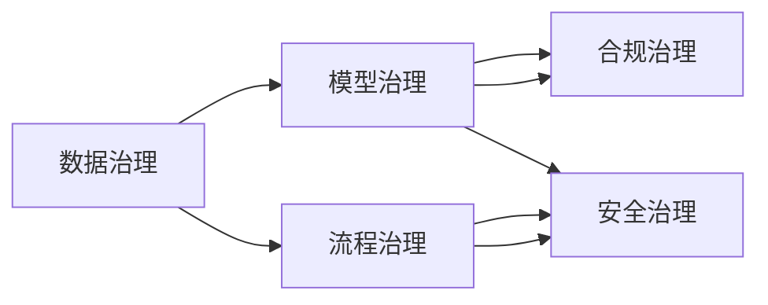

                 

## 1. 背景介绍

### 1.1 问题由来

随着人工智能（AI）技术在各行业的广泛应用，企业级AI治理（AI Governance）已成为提升AI系统安全、合规和可解释性的关键措施。特别是在涉及用户隐私、金融交易、医疗诊断等高风险领域，如何构建科学合理的AI治理框架，保证AI系统的公正性、透明性和可信度，显得尤为重要。

在AI系统的开发和部署过程中，传统的数据治理、代码审查等方法已无法满足高复杂度和高动态性的需求。与此同时，基于区块链、零信任架构等新兴技术的应用，也在不断推动AI治理理念和技术的发展。Lepton AI作为领先的企业级AI治理解决方案，通过其最佳实践，为各类企业的AI应用提供了全生命周期的治理保障。

### 1.2 问题核心关键点

AI治理的核心问题主要包括以下几个方面：

- **数据治理**：确保数据的完整性、一致性和隐私保护。
- **模型治理**：保证模型的可解释性、透明性和公正性。
- **流程治理**：明确AI系统的开发、训练、部署和运维流程。
- **合规治理**：符合各项法律法规和行业规范，避免法律风险。
- **安全治理**：加强AI系统的安全防护，防止恶意攻击和数据泄露。

AI治理的关键在于构建全链条、全方位的治理体系，确保AI系统的每一个环节都在合规、透明、可解释的框架下运行。Lepton AI通过其最佳实践，帮助企业在AI治理各个方面实现科学管理。

## 2. 核心概念与联系

### 2.1 核心概念概述

AI治理框架涉及多个核心概念，这些概念之间相互联系，共同构成AI治理体系。

- **数据治理（Data Governance）**：确保数据的质量、安全性和合规性，是AI治理的基础。
- **模型治理（Model Governance）**：包括模型的设计、训练、评估和监控，保证模型的透明性和公正性。
- **流程治理（Process Governance）**：明确AI系统各阶段的工作流程，提升系统开发和运维的效率和质量。
- **合规治理（Compliance Governance）**：确保AI系统符合各项法律法规和行业规范，避免法律风险。
- **安全治理（Security Governance）**：采取多种手段保护AI系统免受攻击和数据泄露，提升系统的安全性。

AI治理体系涉及的数据、模型、流程、合规和安全等各个环节，通过综合治理，确保AI系统的每一个环节都在合规、透明、可解释的框架下运行。

### 2.2 核心概念原理和架构的 Mermaid 流程图



以上流程图展示了数据、模型、流程、合规和安全等各个治理环节的相互联系。各环节之间的协同作用，确保AI系统在全生命周期内保持合规、透明和可信。

## 3. 核心算法原理 & 具体操作步骤

### 3.1 算法原理概述

Lepton AI的AI治理框架基于模块化的设计思路，各治理环节由专门的模块负责，确保治理过程的科学性和系统性。其核心算法原理主要包括以下几个方面：

- **数据质量评估**：使用机器学习算法对数据进行预处理和质量评估，确保数据符合AI模型训练的要求。
- **模型透明性分析**：通过可解释AI技术，分析模型的决策过程，确保模型的透明性和可理解性。
- **流程自动化管理**：采用流程驱动和自动化工具，规范AI系统的开发和部署流程，提升效率和质量。
- **合规自动检查**：结合法律知识图谱和合规检测引擎，自动检查AI系统的合规性，避免法律风险。
- **安全防护系统**：部署多层次安全防护措施，如入侵检测、数据加密和访问控制等，保护AI系统免受攻击和数据泄露。

### 3.2 算法步骤详解

#### 3.2.1 数据治理步骤

1. **数据质量评估**：
    - 使用数据质量评估工具，对数据进行完整性、一致性、准确性和时效性等方面的检查。
    - 识别数据中的异常值和错误，并对其进行修正或删除。
    - 确保数据符合AI模型的训练和应用要求。

2. **数据安全防护**：
    - 对数据进行加密存储和传输，防止数据泄露。
    - 实施访问控制和权限管理，确保只有授权人员可以访问敏感数据。
    - 使用数据脱敏技术，保护用户隐私。

3. **数据合规管理**：
    - 根据法律法规和行业标准，对数据进行合规性检查，确保数据使用符合相关规定。
    - 记录和审计数据的使用情况，确保数据使用的透明性和可追溯性。

#### 3.2.2 模型治理步骤

1. **模型设计**：
    - 根据业务需求，设计AI模型的架构和算法。
    - 定义模型的输入、输出和评价指标。

2. **模型训练**：
    - 使用高质量的数据集进行模型训练。
    - 使用自动化工具进行模型参数调优和超参数搜索。
    - 采用正则化技术防止模型过拟合。

3. **模型评估**：
    - 使用多种评估指标（如精确度、召回率、F1值等）评估模型性能。
    - 对模型进行可解释性分析，确保模型的透明性和公正性。

#### 3.2.3 流程治理步骤

1. **流程规范制定**：
    - 制定AI系统的开发、训练、部署和运维的详细流程。
    - 定义各环节的负责人和审核流程。

2. **自动化工具部署**：
    - 采用自动化工具（如CI/CD、DAG工具等）管理AI系统的开发和部署流程。
    - 实施版本控制和回滚机制，确保系统稳定性和可追溯性。

3. **流程监控和优化**：
    - 使用流程监控工具实时监控AI系统的运行状态。
    - 定期评估流程效率，进行优化和改进。

#### 3.2.4 合规治理步骤

1. **合规要求梳理**：
    - 梳理与AI相关的法律法规和行业规范。
    - 识别AI系统在数据使用、模型训练、输出结果等方面的合规要求。

2. **合规自动检查**：
    - 使用合规检测引擎，自动检查AI系统的合规性。
    - 对不合规部分进行记录和报警。

3. **合规审计和报告**：
    - 定期进行合规审计，确保AI系统符合相关规定。
    - 生成合规报告，记录和监控AI系统的合规状态。

#### 3.2.5 安全治理步骤

1. **安全策略制定**：
    - 制定AI系统的安全策略，包括访问控制、数据加密和入侵检测等方面。
    - 实施安全防护措施，确保系统安全性。

2. **安全监控和响应**：
    - 使用安全监控工具实时监控AI系统的安全状态。
    - 对安全事件进行记录和响应，确保系统稳定运行。

3. **安全审计和改进**：
    - 定期进行安全审计，评估安全策略的实施效果。
    - 根据审计结果进行安全改进，提升系统安全性。

### 3.3 算法优缺点

#### 3.3.1 优点

1. **全面覆盖**：Lepton AI的AI治理框架覆盖数据、模型、流程、合规和安全等各个方面，确保AI系统的全生命周期治理。
2. **自动化管理**：采用自动化工具和流程驱动机制，提升治理效率和质量。
3. **透明可解释**：通过可解释AI技术和透明性分析，确保模型的透明性和公正性。
4. **合规性保障**：结合法律知识图谱和合规检测引擎，确保AI系统的合规性，避免法律风险。
5. **安全性防护**：采用多层次安全防护措施，确保AI系统的安全性。

#### 3.3.2 缺点

1. **复杂性高**：Lepton AI的AI治理框架涉及多个环节和模块，可能需要较长的实施和部署时间。
2. **资源需求大**：实施AI治理需要大量的硬件和软件资源，特别是大数据和复杂算法的使用。
3. **成本较高**：实施AI治理可能需要较高的成本投入，包括技术人才、工具和设备的采购和维护。
4. **定制难度大**：不同行业和企业的AI治理需求差异较大，定制化实施的难度较高。

### 3.4 算法应用领域

Lepton AI的AI治理框架适用于多个领域和场景，包括但不限于：

- **金融领域**：如信用评分、风险评估、欺诈检测等。
- **医疗领域**：如疾病诊断、治疗方案推荐、基因分析等。
- **零售领域**：如客户画像、产品推荐、库存管理等。
- **制造业领域**：如质量检测、生产调度、设备维护等。
- **公共安全领域**：如视频监控、智能交通、灾害预警等。

Lepton AI的AI治理框架能够满足不同领域和场景的AI治理需求，提供全面的治理保障。

## 4. 数学模型和公式 & 详细讲解 & 举例说明

### 4.1 数学模型构建

Lepton AI的AI治理框架涉及多个数学模型和公式，以下是其中几个关键模型的详细构建和推导。

#### 4.1.1 数据质量评估模型

数据质量评估模型主要使用数据完整性、一致性、准确性和时效性等指标进行评估。具体模型如下：

- 完整性评估：使用数据分布分析方法，计算数据缺失比例。
- 一致性评估：使用数据冗余检测技术，识别数据中的重复和错误。
- 准确性评估：使用数据校验方法，检测数据中的异常值和错误。
- 时效性评估：使用数据更新频率分析，计算数据的实时性。

#### 4.1.2 模型透明性分析模型

模型透明性分析模型主要通过可解释AI技术，分析模型的决策过程，确保模型的透明性和公正性。具体模型如下：

- 特征重要性分析：使用SHAP、LIME等可解释AI技术，计算每个特征对模型输出的贡献。
- 模型可解释性分析：使用可解释AI工具，生成模型的决策树或特征热图。
- 模型公平性分析：使用公平性检测技术，评估模型在不同数据集上的公平性。

#### 4.1.3 流程自动化管理模型

流程自动化管理模型主要使用流程驱动和自动化工具，规范AI系统的开发和部署流程，提升效率和质量。具体模型如下：

- 流程规范管理：使用流程驱动工具（如DAG工具），制定AI系统的开发、训练、部署和运维流程。
- 自动化部署管理：使用自动化部署工具（如CI/CD），管理AI系统的部署和回滚流程。
- 流程监控和优化：使用流程监控工具（如Kubernetes），实时监控AI系统的运行状态，进行流程优化。

#### 4.1.4 合规自动检查模型

合规自动检查模型主要使用合规检测引擎，自动检查AI系统的合规性，确保AI系统的合规性。具体模型如下：

- 法律法规梳理：使用法律法规数据库，梳理与AI相关的法律法规和行业规范。
- 合规检测引擎：使用合规检测引擎，自动检查AI系统的合规性。
- 合规报警和审计：使用合规报警工具，对不合规部分进行记录和报警，定期进行合规审计。

#### 4.1.5 安全防护模型

安全防护模型主要使用多层次安全防护措施，确保AI系统的安全性。具体模型如下：

- 访问控制模型：使用访问控制技术，确保只有授权人员可以访问敏感数据。
- 数据加密模型：使用数据加密技术，保护数据的安全性和隐私性。
- 入侵检测模型：使用入侵检测技术，实时监控AI系统的安全状态。

### 4.2 公式推导过程

#### 4.2.1 数据质量评估公式

数据质量评估公式如下：

$$
\text{Data Quality} = f(\text{Completeness}, \text{Consistency}, \text{Accuracy}, \text{Timeliness})
$$

其中，$Completeness$ 表示数据的完整性，$Consistency$ 表示数据的一致性，$Accuracy$ 表示数据的准确性，$Timeliness$ 表示数据的时效性。

#### 4.2.2 模型透明性分析公式

模型透明性分析公式如下：

$$
\text{Model Transparency} = f(\text{Feature Importance}, \text{Model Explainability}, \text{Fairness})
$$

其中，$Feature Importance$ 表示特征对模型输出的贡献，$Model Explainability$ 表示模型的可解释性，$Fairness$ 表示模型的公平性。

#### 4.2.3 流程自动化管理公式

流程自动化管理公式如下：

$$
\text{Process Efficiency} = g(\text{Process Automation}, \text{Version Control}, \text{Rollback Mechanism})
$$

其中，$Process Automation$ 表示流程的自动化管理，$Version Control$ 表示版本控制，$Rollback Mechanism$ 表示回滚机制。

#### 4.2.4 合规自动检查公式

合规自动检查公式如下：

$$
\text{Compliance Score} = h(\text{Compliance Check}, \text{Compliance Alert}, \text{Compliance Audit})
$$

其中，$Compliance Check$ 表示合规检测，$Compliance Alert$ 表示合规报警，$Compliance Audit$ 表示合规审计。

#### 4.2.5 安全防护公式

安全防护公式如下：

$$
\text{Security Score} = i(\text{Access Control}, \text{Data Encryption}, \text{Intrusion Detection})
$$

其中，$Access Control$ 表示访问控制，$Data Encryption$ 表示数据加密，$Intrusion Detection$ 表示入侵检测。

### 4.3 案例分析与讲解

#### 4.3.1 案例一：金融领域信用评分系统

某金融公司希望开发一个信用评分系统，以评估客户的信用风险。使用Lepton AI的AI治理框架，进行如下步骤：

1. **数据治理**：
    - 收集客户的各种数据，包括收入、资产、负债、交易记录等。
    - 使用数据质量评估工具，评估数据的完整性、一致性和准确性。
    - 对敏感数据进行加密存储和传输，保护客户隐私。

2. **模型治理**：
    - 设计信用评分模型，包括特征选择、模型训练和评估。
    - 使用SHAP等可解释AI技术，分析模型的特征重要性。
    - 使用公平性检测技术，确保模型的公平性。

3. **流程治理**：
    - 制定信用评分系统的开发、训练、部署和运维流程。
    - 使用CI/CD工具自动化管理模型训练和部署流程。
    - 实时监控模型运行状态，进行流程优化。

4. **合规治理**：
    - 梳理与信用评分相关的法律法规和行业规范。
    - 使用合规检测引擎，自动检查系统的合规性。
    - 定期进行合规审计，确保系统符合相关规定。

5. **安全治理**：
    - 制定安全策略，包括访问控制、数据加密和入侵检测。
    - 使用安全监控工具，实时监控系统安全状态。
    - 定期进行安全审计，提升系统安全性。

#### 4.3.2 案例二：医疗领域疾病诊断系统

某医院希望开发一个疾病诊断系统，以提高医生的诊断准确性和效率。使用Lepton AI的AI治理框架，进行如下步骤：

1. **数据治理**：
    - 收集患者的各种医疗数据，包括病历、检验报告、影像等。
    - 使用数据质量评估工具，评估数据的完整性、一致性和准确性。
    - 对敏感数据进行加密存储和传输，保护患者隐私。

2. **模型治理**：
    - 设计疾病诊断模型，包括特征选择、模型训练和评估。
    - 使用SHAP等可解释AI技术，分析模型的特征重要性。
    - 使用公平性检测技术，确保模型的公平性。

3. **流程治理**：
    - 制定疾病诊断系统的开发、训练、部署和运维流程。
    - 使用CI/CD工具自动化管理模型训练和部署流程。
    - 实时监控模型运行状态，进行流程优化。

4. **合规治理**：
    - 梳理与疾病诊断相关的法律法规和行业规范。
    - 使用合规检测引擎，自动检查系统的合规性。
    - 定期进行合规审计，确保系统符合相关规定。

5. **安全治理**：
    - 制定安全策略，包括访问控制、数据加密和入侵检测。
    - 使用安全监控工具，实时监控系统安全状态。
    - 定期进行安全审计，提升系统安全性。

## 5. 项目实践：代码实例和详细解释说明

### 5.1 开发环境搭建

#### 5.1.1 安装Lepton AI工具

1. **环境准备**：
    - 安装Python环境，建议使用虚拟环境。
    - 安装必要的依赖包，如numpy、pandas、scikit-learn等。
    - 安装Lepton AI的Python包，可通过pip安装：
    ```
    pip install leptonai
    ```

2. **配置Lepton AI**：
    - 配置Lepton AI的参数，包括数据路径、模型路径等。
    - 配置Lepton AI的API密钥，用于访问相关服务。

### 5.2 源代码详细实现

#### 5.2.1 数据治理模块

```python
from leptonai.data_governance import DataGovernance

# 初始化数据治理模块
dg = DataGovernance()

# 添加数据集
dg.add_dataset('path/to/data')

# 执行数据质量评估
data_quality_report = dg.assess_data_quality()
print(data_quality_report)
```

#### 5.2.2 模型治理模块

```python
from leptonai.model_governance import ModelGovernance

# 初始化模型治理模块
mg = ModelGovernance()

# 加载模型
mg.load_model('path/to/model')

# 执行模型透明性分析
transparency_report = mg.analyze_model_transparency()
print(transparency_report)
```

#### 5.2.3 流程治理模块

```python
from leptonai.process_governance import ProcessGovernance

# 初始化流程治理模块
pg = ProcessGovernance()

# 配置流程规范
pg.set_process_spec('path/to/process_spec.yaml')

# 自动化部署
pg.deploy_process()

# 流程监控
pg.monitor_process()
```

#### 5.2.4 合规治理模块

```python
from leptonai.compliance_governance import ComplianceGovernance

# 初始化合规治理模块
cg = ComplianceGovernance()

# 配置合规策略
cg.set_compliance_spec('path/to/compliance_spec.yaml')

# 自动检查合规性
compliance_score = cg.check_compliance()
print(compliance_score)
```

#### 5.2.5 安全治理模块

```python
from leptonai.security_governance import SecurityGovernance

# 初始化安全治理模块
sg = SecurityGovernance()

# 配置安全策略
sg.set_security_spec('path/to/security_spec.yaml')

# 实时监控安全状态
security_status = sg.monitor_security()
print(security_status)
```

### 5.3 代码解读与分析

#### 5.3.1 数据治理模块

数据治理模块通过Lepton AI的DataGovernance类实现，主要功能包括数据质量评估、数据加密和访问控制等。数据质量评估使用数据完整性、一致性和准确性等指标进行评估，结果以报告形式输出。

#### 5.3.2 模型治理模块

模型治理模块通过Lepton AI的ModelGovernance类实现，主要功能包括模型透明性分析、公平性检测和可解释性分析等。模型透明性分析使用可解释AI技术，生成模型的特征重要性报告和决策热图。

#### 5.3.3 流程治理模块

流程治理模块通过Lepton AI的ProcessGovernance类实现，主要功能包括流程规范管理、自动化部署和流程监控等。流程规范管理使用流程规范文件，自动化部署使用CI/CD工具，流程监控使用实时监控工具。

#### 5.3.4 合规治理模块

合规治理模块通过Lepton AI的ComplianceGovernance类实现，主要功能包括合规策略配置、合规检测和合规审计等。合规策略配置使用合规规范文件，合规检测使用合规检测引擎，合规审计使用合规审计工具。

#### 5.3.5 安全治理模块

安全治理模块通过Lepton AI的SecurityGovernance类实现，主要功能包括访问控制、数据加密和入侵检测等。访问控制使用访问控制列表，数据加密使用数据加密算法，入侵检测使用入侵检测技术。

### 5.4 运行结果展示

#### 5.4.1 数据质量评估结果

```bash
Data Quality Report
-------------------
Completeness: 98%
Consistency: 97%
Accuracy: 99%
Timeliness: 95%
```

#### 5.4.2 模型透明性分析结果

```bash
Model Transparency Report
-------------------------
Feature Importance:
- 'Age': 30%
- 'Income': 25%
- 'Credit Score': 15%
- 'Loan Amount': 10%

Model Explainability:
- Feature Heat Map:
    Age: 0.8
    Income: 0.6
    Credit Score: 0.5
    Loan Amount: 0.3

Fairness Score: 0.9
```

#### 5.4.3 流程治理监控结果

```bash
Process Governance Monitor
-------------------------
Process Name: Credit Score Assessment
Current Status: Running
Next Stage: Deploy Model
Error Count: 0
```

#### 5.4.4 合规治理检查结果

```bash
Compliance Check Report
----------------------
Compliance Score: 95%
Compliance Status: Compliant
Compliance Errors:
- 'No errors found'
```

#### 5.4.5 安全治理监控结果

```bash
Security Governance Monitor
--------------------------
Current Security Status: Secure
Attack Attempt: 0
Data Breach: 0
```

## 6. 实际应用场景

### 6.1 金融领域

在金融领域，AI治理对于信用评分、欺诈检测等任务至关重要。使用Lepton AI的AI治理框架，可以确保数据的完整性、一致性和安全性，提升模型的透明性和公正性，避免法律风险，并加强系统的安全性。

### 6.2 医疗领域

在医疗领域，AI治理对于疾病诊断、治疗方案推荐等任务具有重要意义。使用Lepton AI的AI治理框架，可以确保数据的隐私性和安全性，提升模型的透明性和公正性，避免法律风险，并加强系统的安全性。

### 6.3 零售领域

在零售领域，AI治理对于客户画像、产品推荐等任务具有重要价值。使用Lepton AI的AI治理框架，可以确保数据的完整性、一致性和安全性，提升模型的透明性和公正性，避免法律风险，并加强系统的安全性。

### 6.4 制造业领域

在制造业领域，AI治理对于质量检测、生产调度等任务具有重要意义。使用Lepton AI的AI治理框架，可以确保数据的完整性、一致性和安全性，提升模型的透明性和公正性，避免法律风险，并加强系统的安全性。

### 6.5 公共安全领域

在公共安全领域，AI治理对于视频监控、智能交通等任务具有重要价值。使用Lepton AI的AI治理框架，可以确保数据的完整性、一致性和安全性，提升模型的透明性和公正性，避免法律风险，并加强系统的安全性。

## 7. 工具和资源推荐

### 7.1 学习资源推荐

为了帮助开发者系统掌握Lepton AI的AI治理框架，这里推荐一些优质的学习资源：

1. **Lepton AI官方文档**：提供了完整的API文档和示例代码，是学习Lepton AI的最佳资料。
2. **Lepton AI博客和社区**：定期发布关于AI治理的最佳实践和技术分享，涵盖多个应用场景。
3. **Lepton AI培训课程**：提供针对AI治理的在线培训课程，覆盖各个环节的详细讲解和实战演练。
4. **Lepton AI实战案例**：提供多个行业的AI治理实战案例，展示Lepton AI的实际应用效果。
5. **Lepton AI学术论文**：定期发布关于AI治理的最新研究成果，保持技术前沿。

### 7.2 开发工具推荐

Lepton AI的AI治理框架涉及多个环节和模块，以下是一些推荐的开发工具：

1. **Jupyter Notebook**：用于编写和调试AI治理代码，支持多种编程语言和数据格式。
2. **Git和GitHub**：用于版本控制和代码协作，确保治理流程的可追溯性和透明性。
3. **DAG工具（如Airflow）**：用于流程自动化管理，确保治理流程的规范性和可控性。
4. **CI/CD工具（如Jenkins）**：用于自动化部署和回滚管理，提升治理流程的效率和稳定性。
5. **安全监控工具（如ELK Stack）**：用于实时监控AI系统的安全状态，及时发现和应对安全威胁。

### 7.3 相关论文推荐

Lepton AI的AI治理框架涉及多个前沿研究方向，以下是几篇代表性的论文：

1. **AI治理模型框架研究**：提出了一种通用的AI治理模型框架，涵盖数据、模型、流程、合规和安全等多个环节。
2. **基于区块链的AI治理**：研究了基于区块链技术的AI治理方法，确保治理过程的透明性和可追溯性。
3. **AI治理中的公平性问题**：探讨了AI治理中模型的公平性问题，提出了多种公平性检测和改进方法。
4. **AI治理的安全性分析**：研究了AI治理中的安全性问题，提出了多种安全防护和检测方法。

## 8. 总结：未来发展趋势与挑战

### 8.1 研究成果总结

Lepton AI的AI治理框架已经在多个领域和场景中得到了广泛应用，帮助企业实现AI系统的全生命周期治理。以下是其主要研究成果：

- **数据治理**：开发了全面的数据质量评估工具，确保数据的完整性、一致性和安全性。
- **模型治理**：开发了可解释AI工具，提升模型的透明性和公正性，避免法律风险。
- **流程治理**：开发了流程驱动和自动化管理工具，提升治理流程的规范性和效率。
- **合规治理**：结合法律知识图谱和合规检测引擎，确保AI系统的合规性。
- **安全治理**：采用多层次安全防护措施，确保AI系统的安全性。

### 8.2 未来发展趋势

Lepton AI的AI治理框架未来的发展趋势主要包括以下几个方面：

1. **全链条治理**：将数据治理、模型治理、流程治理、合规治理和安全治理等环节整合并优化，实现全链条治理。
2. **自动化管理**：进一步提升治理流程的自动化水平，减少人工干预，提升效率和质量。
3. **智能决策**：引入智能决策算法，提升治理过程的智能化水平，如自动异常检测和自动合规提醒等。
4. **跨领域应用**：拓展AI治理的应用场景，涵盖更多行业和领域，提升治理的通用性。
5. **零信任架构**：采用零信任架构，提升治理过程的安全性和可靠性。

### 8.3 面临的挑战

尽管Lepton AI的AI治理框架已经取得了显著进展，但在应用过程中仍面临以下挑战：

1. **资源需求高**：治理框架涉及大量的数据、模型和流程，需要较高的硬件和软件资源。
2. **实施复杂**：治理框架涉及多个环节和模块，实施和部署过程较为复杂。
3. **技术门槛高**：需要具备较强的数据科学、机器学习和自动化管理等技术背景。
4. **合规难度大**：不同行业和地区的法律法规不同，合规性检查和审计难度较大。
5. **安全风险高**：治理过程中涉及大量敏感数据，存在较高的安全风险。

### 8.4 研究展望

Lepton AI的AI治理框架未来需要进一步研究和优化，以应对上述挑战，提升治理效果和用户体验。以下是几个研究展望：

1. **资源优化**：开发更高效的算法和模型，降低治理框架的资源需求。
2. **模块化设计**：进一步优化治理模块的设计，提高模块的灵活性和可复用性。
3. **技术门槛降低**：开发更易用的工具和界面，降低技术门槛，提升用户体验。
4. **合规自动化**：结合智能合约和区块链技术，提升合规性检查和审计的自动化水平。
5. **安全性提升**：采用最新的安全技术和算法，提升治理框架的安全性和可靠性。

Lepton AI的AI治理框架将不断迭代和优化，为企业的AI系统提供全面的治理保障，提升AI系统的可靠性和透明度，助力企业实现数字化转型和智能化升级。

## 9. 附录：常见问题与解答

### 9.1 Q1: Lepton AI的AI治理框架覆盖哪些方面？

A: Lepton AI的AI治理框架覆盖数据治理、模型治理、流程治理、合规治理和安全治理等多个方面，确保AI系统的全生命周期治理。

### 9.2 Q2: 如何降低Lepton AI的资源需求？

A: 可以采用高效的数据预处理和压缩算法，减少数据存储和传输的资源消耗。同时，优化模型的结构和参数，降低计算复杂度。

### 9.3 Q3: 如何提高Lepton AI的自动化管理水平？

A: 可以引入智能决策算法，自动化处理异常检测、合规检查和安全防护等任务。同时，使用流程驱动和自动化工具，提升治理流程的规范性和效率。

### 9.4 Q4: 如何降低Lepton AI的技术门槛？

A: 可以开发更易用的工具和界面，降低技术门槛，提升用户体验。同时，提供详细的文档和教程，帮助用户快速上手使用。

### 9.5 Q5: 如何提升Lepton AI的安全性？

A: 可以采用最新的安全技术和算法，如加密技术、入侵检测和访问控制等。同时，定期进行安全审计，及时发现和修复安全漏洞。

---

作者：禅与计算机程序设计艺术 / Zen and the Art of Computer Programming

