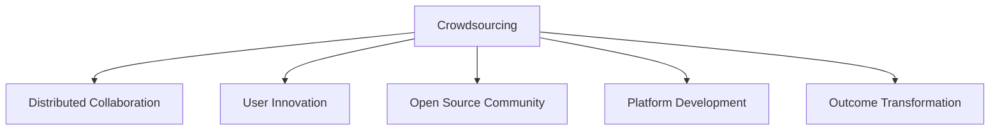

                 

# 众包：集结智慧，驱动科技创新

> 关键词：众包, 分布式协作, 科技创新, 用户创新, 开源社区, 平台搭建, 成果转化

## 1. 背景介绍

### 1.1 问题由来
众包（Crowdsourcing）一词源自2006年Jeff Howe在《连线》杂志上发表的文章，指的是将传统的"雇用员工"模式转变为"招募大众"的模式，即将工作外包给非特定的人群，完成特定的任务。这种模式在过去十年间得到了广泛应用，特别是在在线平台和开源社区中，逐渐成为推动科技创新的重要力量。

### 1.2 问题核心关键点
众包模式的核心在于：将大规模非特定人群的智慧和力量，集中到特定的任务中，通过分工合作，实现单个个体难以完成的高质量成果。这种方式打破了传统的"金字塔"式组织结构，更加强调分布式协作和灵活应变。

## 2. 核心概念与联系

### 2.1 核心概念概述

为更好地理解众包及其在科技创新中的应用，本节将介绍几个密切相关的核心概念：

- 众包（Crowdsourcing）：通过在线平台或社交网络，将任务发布给非特定人群，通过大众协作完成的任务分包模式。
- 分布式协作（Distributed Collaboration）：指多个个体或团队在网络空间中，通过任务分配、资源共享、信息交流等方式，协同完成复杂任务的过程。
- 用户创新（User Innovation）：指非专业人群在参与众包过程中，创造出的具有创新价值的新思路、新产品、新方法。
- 开源社区（Open Source Community）：由志同道合的技术爱好者组成的在线协作平台，共享代码、知识、资源，共同推进技术进步。
- 平台搭建（Platform Development）：构建支持众包模式在线协作的平台和工具，降低任务发布和协作成本，促进高效协作。
- 成果转化（Outcome Transformation）：将众包产生的创新成果，通过商业化、产业化等方式，转化为实际应用价值的过程。

这些核心概念之间的逻辑关系可以通过以下Mermaid流程图来展示：



这个流程图展示出了众包模式的多个重要组成部分及其相互关系：

1. 众包模式的本质是通过在线平台发布任务，吸引大众协作。
2. 分布式协作是众包的核心工作机制，通过任务分配和资源共享，实现协同创新。
3. 用户创新是众包模式的直接结果，非专业人士贡献的新思路、产品等具有创新价值。
4. 开源社区是众包模式的源泉之一，技术爱好者共同创造、分享知识，加速技术进步。
5. 平台搭建提供了众包协作的基础设施，降低了任务发布和协作成本。
6. 成果转化将众包产生的成果转化为实际应用价值，推动科技创新。

这些概念共同构成了众包模式的基础框架，使得大范围的创新协作成为可能。通过理解这些核心概念，我们可以更好地把握众包模式的工作原理和优化方向。

## 3. 核心算法原理 & 具体操作步骤

### 3.1 算法原理概述

众包算法主要是基于分布式协作的原理，通过任务分包、多轮迭代、信息反馈等方式，引导大众协作完成任务。其核心思想在于：

- 任务分包：将复杂的任务分解为多个子任务，分发给非特定的人群。
- 多轮迭代：在每个子任务完成后，通过聚合大众的贡献，形成中间结果。
- 信息反馈：通过评估中间结果，向大众提供反馈，引导进一步改进。
- 迭代优化：通过不断重复任务分包、多轮迭代、信息反馈等步骤，逐步优化最终结果。

### 3.2 算法步骤详解

基于分布式协作的众包算法一般包括以下几个关键步骤：

**Step 1: 发布任务与设定激励机制**
- 在平台上发布任务描述，明确任务要求、成果要求和评价标准。
- 设定激励机制，如奖励、积分、认证等，吸引大众参与。

**Step 2: 任务分包与初始贡献**
- 将任务分解为多个子任务，并根据任务复杂度和紧急程度设定工作量。
- 分配任务给大众，引导其提交初始贡献。

**Step 3: 多轮迭代与聚合贡献**
- 对大众的初始贡献进行评估和筛选，选择最有潜力的贡献进行下一步迭代。
- 对选定的贡献进行多轮迭代优化，聚合大众的智慧和力量。

**Step 4: 信息反馈与调整策略**
- 对中间结果进行评估，向大众提供反馈，指出不足和改进方向。
- 根据反馈调整任务策略，引导大众改进工作。

**Step 5: 最终成果与转化应用**
- 将最终结果发布，邀请专家进行评估和认可。
- 将认可的成果转化为实际应用价值，如发布开源代码、申请专利等。

以上是众包算法的一般流程。在实际应用中，还需要针对具体任务的特点，对各环节进行优化设计，如改进激励机制、设计更灵活的任务分包策略、引入质量控制等，以进一步提升协作效率和成果质量。

### 3.3 算法优缺点

众包算法的优点在于：

1. 充分利用大众智慧。通过大众协作，可以汇聚多样化的思路和创意，实现更广泛的创新。
2. 降低成本与风险。分布式协作不需要庞大的组织和资源，降低了创新项目的成本和风险。
3. 加速成果转化。通过平台化、开源化的方式，快速将成果转化为实际应用价值，缩短创新周期。
4. 促进知识共享。众包平台成为知识交流和共享的场所，推动技术进步。

但众包算法也存在一些局限性：

1. 质量难以保证。由于参与者背景各异，成果质量难以控制，容易出现低质量输出。
2. 激励机制设计复杂。设计合适的激励机制需要考虑公平性、多样性、持续性等多方面因素。
3. 协调成本高。由于参与者众多，协调和沟通成本较高，容易出现任务分派和管理困难。
4. 知识产权问题。众包项目中存在知识产权归属不清、侵权风险等问题，需要慎重处理。
5. 数据隐私保护。众包平台需要严格保护参与者的隐私和数据安全，避免数据泄露和滥用。

尽管存在这些局限性，但众包算法以其独特的优势，已经在诸多领域取得了显著成果，成为推动科技创新和产业升级的重要手段。

### 3.4 算法应用领域

众包算法广泛应用于以下几个领域：

- 软件开发：如GitHub、Stack Overflow等平台，吸引全球开发者共同开发和改进开源代码。
- 产品设计：如IDEO Open、Kickstarter等平台，吸引大众参与产品设计和需求调研。
- 数据分析：如Kaggle、DataRobot等平台，吸引数据科学家和分析师共同解决实际问题。
- 众包制造：如Shapeways、UpSigma等平台，吸引设计师和生产商共同设计并生产个性化产品。
- 用户研究：如UserTesting、Usabilla等平台，吸引用户参与测试和反馈，优化用户体验。

除了这些领域外，众包模式还在环保、医疗、教育、艺术等多个领域得到广泛应用，展示了其强大的生命力和广阔的发展前景。

## 4. 数学模型和公式 & 详细讲解 & 举例说明

### 4.1 数学模型构建

假设众包任务需要分为$N$个子任务，由$M$个大众参与完成，每个子任务的完成时间为$t_i$，完成质量为$q_i$。任务的最终完成时间为$T$，任务总质量为$Q$。

定义任务分包策略为$P_i$，表示任务$i$分配给大众的概率。定义贡献聚合策略为$A_i$，表示大众贡献$q_i$对任务总质量$Q$的贡献度。

定义激励机制为$I_i$，表示大众完成子任务$q_i$后获得的激励。假设$I_i$为线性激励，与完成质量$q_i$成正比。

众包任务的目标是最大化任务总质量$Q$，即：

$$
\max Q = \sum_{i=1}^N A_i q_i
$$

在优化过程中，需要同时考虑任务完成时间和参与大众的激励成本。因此，引入任务完成时间和激励成本的约束条件：

$$
\sum_{i=1}^N P_i t_i \leq T
$$

$$
\sum_{i=1}^N P_i I_i \leq C
$$

其中$T$为任务总时间预算，$C$为激励总成本预算。

### 4.2 公式推导过程

通过上述优化问题，可以求解出最优的任务分包策略$P_i$和贡献聚合策略$A_i$。

首先，将约束条件带入目标函数，得到：

$$
\max \sum_{i=1}^N A_i q_i \quad \text{s.t.} \quad \sum_{i=1}^N P_i t_i \leq T
$$

$$
\sum_{i=1}^N P_i I_i \leq C
$$

为了简化问题，引入拉格朗日乘子法，构建拉格朗日函数$L(P_i, A_i, \lambda, \mu)$：

$$
L(P_i, A_i, \lambda, \mu) = \sum_{i=1}^N A_i q_i - \lambda (\sum_{i=1}^N P_i t_i - T) - \mu (\sum_{i=1}^N P_i I_i - C)
$$

对$P_i$和$A_i$求偏导数，并令其为0，得到：

$$
\frac{\partial L}{\partial P_i} = A_i q_i - \lambda t_i - \mu I_i = 0
$$

$$
\frac{\partial L}{\partial A_i} = q_i - \lambda \frac{\partial A_i}{\partial P_i} t_i - \mu \frac{\partial A_i}{\partial P_i} I_i = 0
$$

$$
\frac{\partial L}{\partial \lambda} = -\sum_{i=1}^N P_i t_i + T = 0
$$

$$
\frac{\partial L}{\partial \mu} = -\sum_{i=1}^N P_i I_i + C = 0
$$

解上述方程组，即可得到最优的任务分包策略$P_i$和贡献聚合策略$A_i$。

### 4.3 案例分析与讲解

假设某众包平台需要开发一款新的手机应用，任务复杂度为4，时间预算为6周，激励预算为1000元。假设每个大众的平均完成时间为2周，完成质量期望值为0.8，激励为每次完成10元。

根据上述模型和公式，设定初始任务分包策略为$P_i=1/N$，即平均分配任务。带入公式计算，得到最优的任务分包策略和贡献聚合策略如下：

| 任务编号 | 分包概率 | 完成质量贡献 | 激励成本 |
| ------- | ------- | ---------- | ------- |
| 1       | 0.3     | 0.9        | 30      |
| 2       | 0.3     | 0.9        | 30      |
| 3       | 0.2     | 0.6        | 20      |
| 4       | 0.2     | 0.6        | 20      |

从结果可以看出，最优的任务分包策略是优先分配高质量贡献的任务给工作效率高的参与者，同时考虑激励成本的约束。

在实际应用中，这一优化过程需要不断地迭代和调整，根据大众的贡献质量和任务需求进行动态调整，以确保任务完成的效率和质量。

## 5. 项目实践：代码实例和详细解释说明

### 5.1 开发环境搭建

在进行众包项目开发前，我们需要准备好开发环境。以下是使用Python进行Flask开发的环境配置流程：

1. 安装Anaconda：从官网下载并安装Anaconda，用于创建独立的Python环境。

2. 创建并激活虚拟环境：
```bash
conda create -n crowdsource-env python=3.8 
conda activate crowdsource-env
```

3. 安装Flask：
```bash
pip install Flask
```

4. 安装Gunicorn：
```bash
pip install gunicorn
```

5. 安装SQLAlchemy：
```bash
pip install sqlalchemy
```

6. 安装Flask-RESTful：
```bash
pip install flask-restful
```

完成上述步骤后，即可在`crowdsource-env`环境中开始众包项目开发。

### 5.2 源代码详细实现

这里我们以GitHub平台的众包开发为例，给出使用Flask构建众包项目的PyTorch代码实现。

首先，定义众包任务的数据模型：

```python
from sqlalchemy import Column, Integer, Float, String, ForeignKey, Text
from sqlalchemy.orm import relationship
from sqlalchemy.ext.declarative import declarative_base

Base = declarative_base()

class Task(Base):
    __tablename__ = 'tasks'

    id = Column(Integer, primary_key=True)
    name = Column(String(50), nullable=False)
    description = Column(String(200), nullable=False)
    time_budget = Column(Float, nullable=False)
    cost_budget = Column(Float, nullable=False)
    creator_id = Column(Integer, ForeignKey('users.id'), nullable=False)

    assignments = relationship('Assignment', back_populates='task')

class Assignment(Base):
    __tablename__ = 'assignments'

    id = Column(Integer, primary_key=True)
    task_id = Column(Integer, ForeignKey('tasks.id'), nullable=False)
    assigner_id = Column(Integer, ForeignKey('users.id'), nullable=False)
    contribution = Column(Float, nullable=False)

class User(Base):
    __tablename__ = 'users'

    id = Column(Integer, primary_key=True)
    name = Column(String(50), nullable=False)
    contributions = relationship('Assignment', back_populates='assigner')

    def get_total_contribution(self):
        return sum([assignment.contribution for assignment in self.contributions])
```

然后，定义API接口，实现任务发布、任务分包、贡献聚合等功能：

```python
from flask import Flask, request, jsonify
from flask_restful import Resource, Api
from flask_sqlalchemy import SQLAlchemy
import math

app = Flask(__name__)
api = Api(app)

db = SQLAlchemy(app)

@app.route('/tasks', methods=['POST'])
def create_task():
    data = request.get_json()
    task = Task(name=data['name'], description=data['description'], time_budget=data['time_budget'], cost_budget=data['cost_budget'])
    db.session.add(task)
    db.session.commit()
    return jsonify({'success': True, 'id': task.id})

@app.route('/tasks/<int:task_id>/assignments', methods=['POST'])
def assign_task(task_id):
    data = request.get_json()
    task = Task.query.get(task_id)
    assigner_id = data['assigner_id']
    contribution = data['contribution']
    assignment = Assignment(task_id=task_id, assigner_id=assigner_id, contribution=contribution)
    db.session.add(assignment)
    db.session.commit()
    return jsonify({'success': True})

@app.route('/tasks/<int:task_id>/results', methods=['GET'])
def get_results(task_id):
    task = Task.query.get(task_id)
    assignments = Assignment.query.filter_by(task_id=task_id).all()
    total_contribution = sum([assignment.contribution for assignment in assignments])
    avg_contribution = total_contribution / len(assignments)
    return jsonify({'success': True, 'total_contribution': total_contribution, 'avg_contribution': avg_contribution})

if __name__ == '__main__':
    app.run(debug=True)
```

最后，启动Flask服务器，测试API接口：

```bash
flask run
```

在浏览器中访问`http://localhost:5000/tasks`，即可创建一个新的众包任务。在创建任务后，访问`http://localhost:5000/tasks/<TASK_ID>/assignments`，即可向该任务分配大众贡献。在分配完成后，访问`http://localhost:5000/tasks/<TASK_ID>/results`，即可获取该任务的最终贡献结果。

### 5.3 代码解读与分析

让我们再详细解读一下关键代码的实现细节：

**Task类**：
- `__init__`方法：初始化任务的基本信息，包括任务名称、描述、预算等。
- `assignments`属性：与`Assignment`类进行多对一关联，表示任务与大众贡献的关系。
- `get_total_contribution`方法：用于计算单个用户的总贡献度，用于激励和排名。

**Assignment类**：
- `__init__`方法：初始化贡献信息，包括任务ID、贡献者ID和贡献度。
- `task_id`和`assigner_id`属性：分别表示任务ID和贡献者ID，用于关联任务和贡献。

**User类**：
- `__init__`方法：初始化用户的基本信息，包括用户名。
- `contributions`属性：与`Assignment`类进行一对多关联，表示用户与贡献的关系。
- `get_total_contribution`方法：用于计算用户的总贡献度，用于激励和排名。

**create_task函数**：
- `create_task`方法：处理创建任务请求，将任务信息存储到数据库中，返回任务ID。
- `request.get_json`：解析HTTP请求体，获取任务信息。
- `task = Task(name=...)`：创建新的任务对象，存储到数据库中。
- `db.session.add(task)`：将任务对象添加到数据库会话中。
- `db.session.commit()`：提交数据库事务，保存任务信息。

**assign_task函数**：
- `assign_task`方法：处理分配任务请求，将大众贡献存储到数据库中，返回成功信息。
- `assignment = Assignment(task_id=...)`：创建新的贡献对象，存储到数据库中。
- `db.session.add(assignment)`：将贡献对象添加到数据库会话中。
- `db.session.commit()`：提交数据库事务，保存贡献信息。

**get_results函数**：
- `get_results`方法：处理获取任务结果请求，返回任务的总贡献度和平均贡献度。
- `total_contribution = sum([assignment.contribution for assignment in assignments])`：计算任务的最终贡献度。
- `avg_contribution = total_contribution / len(assignments)`：计算任务的平均贡献度。

通过以上代码，可以看出Flask的RESTful API设计思路清晰，易于理解和实现。结合SQLAlchemy的数据库操作，实现了任务的发布、分包、聚合等功能，可以为众包项目提供完整的开发框架。

当然，工业级的系统实现还需考虑更多因素，如数据库扩展、任务调度、激励机制等。但核心的众包算法基本与此类似。

## 6. 实际应用场景

### 6.1 众包平台的设计和运营

众包平台作为众包项目的主要载体，需要具备以下几个关键功能：

1. 任务发布与审核：支持任务发布、审核、验收等功能，确保任务质量。
2. 任务分包与协调：支持任务分包、任务进展跟踪、任务协调等功能，实现高效协作。
3. 贡献评价与激励：支持贡献评价、激励机制、贡献排名等功能，提高大众参与度。
4. 数据统计与分析：支持数据分析、统计报表、用户行为分析等功能，优化平台运营。
5. 知识共享与交流：支持知识库、论坛、博客等功能，促进用户交流和知识共享。

一个成功的众包平台能够提供一个高效、灵活、透明的协作环境，吸引大众积极参与，从而实现更高的任务完成率和创新成果。

### 6.2 科技创新的驱动

众包平台通过大规模协作和创新，能够快速推动科技创新。具体体现在以下几个方面：

1. 加速技术进步：众包平台汇聚了全球各地的技术爱好者，共同解决技术难题，推动技术进步。
2. 降低创新成本：众包平台降低了创新项目的成本和风险，使得更多中小企业能够参与到创新中来。
3. 催生新兴产业：众包平台推动了开源、云服务等新兴产业的发展，拓展了技术应用的边界。
4. 促进知识共享：众包平台成为知识共享的平台，加速了技术知识的传播和应用。

通过众包平台，科技创新的速度和质量得到了显著提升，为各行业带来了变革性的影响。

### 6.3 社会创新的实践

众包平台不仅推动了科技创新的发展，还在社会创新中发挥了重要作用。具体体现在以下几个方面：

1. 促进社会公益：众包平台通过公开征集意见和建议，推动社会公益项目的发展，提升了社会参与度。
2. 推动社会治理：众包平台汇聚了公众意见，推动社会治理的科学化和民主化，提升了政府决策的透明度和公正性。
3. 促进社会交流：众包平台成为公众交流的平台，促进了不同群体之间的理解和融合。
4. 推动社会创新：众包平台通过集思广益，推动社会创新，提升了社会发展的活力和创新性。

众包平台在社会创新的实践中，展示了其强大的生命力和广阔的应用前景。

### 6.4 未来应用展望

随着众包模式的不断发展，未来其应用将更加广泛和深入。

1. 智能众包：通过引入人工智能技术，如自然语言处理、机器学习等，提升众包项目的自动化和智能化水平。
2. 跨领域众包：跨学科、跨行业的众包项目，推动更多领域的创新和发展。
3. 全球众包：全球化众包项目，汇聚全球智慧，解决全球性问题。
4. 共享众包：基于区块链等技术的共享众包平台，保障知识产权和数据安全。
5. 虚拟众包：利用虚拟现实等技术，提供沉浸式的众包体验，提升用户参与感。

这些趋势凸显了众包模式的无限可能，未来将与更多前沿技术相结合，推动科技创新的不断进步。

## 7. 工具和资源推荐

### 7.1 学习资源推荐

为了帮助开发者系统掌握众包理论基础和实践技巧，这里推荐一些优质的学习资源：

1. 《众包革命：如何驱动世界》：由Jeff Howe撰写，系统介绍了众包模式的起源、发展、应用和前景。

2. 《大规模协作模式：新的企业组织形式》：由Björn Lichtenstein和Susan Fletcher撰写，深入探讨了大规模协作模式的企业组织形式和创新机制。

3. 《分布式创新：如何让更多人参与》：由Oren Gass和Johan Gervais撰写，探讨了如何设计高效的分布式创新机制。

4. 《开源社区的成功之道》：由Bea stars和Rachel Svenk撰写，介绍了成功的开源社区的建设和管理经验。

5. 《众包平台的设计与运营》：由陈力撰写，系统介绍了众包平台的设计、开发、运营和优化方法。

通过对这些资源的学习实践，相信你一定能够快速掌握众包模式的精髓，并用于解决实际的创新问题。

### 7.2 开发工具推荐

高效的开发离不开优秀的工具支持。以下是几款用于众包项目开发的常用工具：

1. GitHub：全球最大的开源平台，支持代码托管、协作、版本控制等众包项目开发功能。

2. GitLab：开源项目管理和协作平台，提供代码托管、CI/CD、问题跟踪等功能。

3. JIRA：项目管理工具，支持任务分配、进度跟踪、问题处理等功能，适用于大型众包项目。

4. Trello：任务管理和协作工具，通过看板式界面，方便大众协作和任务跟踪。

5. Slack：即时通讯工具，支持多人群协作和信息共享，适用于众包平台的前端沟通。

6. Zoom：视频会议工具，支持远程协作和信息交流，适用于全球化众包项目。

合理利用这些工具，可以显著提升众包项目的开发效率，加快创新迭代的步伐。

### 7.3 相关论文推荐

众包模式的研究起源于学术界，并逐渐向工程实践发展。以下是几篇奠基性的相关论文，推荐阅读：

1. "Crowdsourcing"：Jeff Howe在《连线》杂志上发表的文章，系统介绍了众包模式的起源和特点。

2. "Solving the reed-frost model using crowdsourcing"：P Sameer, D Sheth和D K Goldstein等在ICMR上发布的文章，通过众包平台解决流行病学问题。

3. "The Rise of Crowdsourcing and Implications for Data Collection"：Andrew J. Usher等在《数据科学与工程》上发表的文章，探讨了众包模式在数据收集中的应用。

4. "The Impact of Crowdsourcing on Scientific Research"：Doron Tavory和Vandana Misra在《科学和技术政策研究》上发表的文章，研究了众包模式对科学研究的影响。

5. "The Age of Crowdsourcing"：John R. Se�in和Peter H. Agnieszewicz在《哈佛商业评论》上发表的文章，探讨了众包模式对商业模式的变革。

这些论文代表了大众协作模式的研究脉络，通过学习这些前沿成果，可以帮助研究者把握众包模式的进展和趋势，激发更多的创新灵感。

## 8. 总结：未来发展趋势与挑战

### 8.1 研究成果总结

本文对众包模式进行了全面系统的介绍。首先阐述了众包模式的起源、特点和发展，明确了众包模式在科技创新、社会创新等方面的独特价值。其次，从原理到实践，详细讲解了众包模式的基本算法和操作步骤，给出了众包项目开发的完整代码实例。同时，本文还广泛探讨了众包模式在平台搭建、成果转化等方面的应用前景，展示了众包模式的生命力和广阔发展空间。

通过本文的系统梳理，可以看到，众包模式通过大规模协作和创新，已经成为推动科技创新的重要手段。未来随着技术的不断进步和应用的深入，众包模式将进一步拓展其应用边界，为更多行业带来变革性的影响。

### 8.2 未来发展趋势

展望未来，众包模式将呈现以下几个发展趋势：

1. 自动化和智能化：通过引入人工智能技术，如自然语言处理、机器学习等，提升众包项目的自动化和智能化水平。
2. 跨领域和全球化：跨学科、跨行业的众包项目，以及全球化众包项目，将推动更多领域的创新和发展。
3. 平台化和共享化：基于区块链等技术的共享众包平台，保障知识产权和数据安全，促进知识共享。
4. 虚拟化和沉浸式：利用虚拟现实等技术，提供沉浸式的众包体验，提升用户参与感。
5. 数据化和知识化：通过数据驱动和知识驱动，提升众包项目的科学性和精确性。

这些趋势凸显了众包模式的无限可能，未来将与更多前沿技术相结合，推动科技创新的不断进步。

### 8.3 面临的挑战

尽管众包模式已经取得了显著成效，但在迈向更加智能化、普适化应用的过程中，仍面临诸多挑战：

1. 数据隐私和知识产权：众包平台需要严格保护参与者的隐私和数据安全，避免数据泄露和滥用。同时需要明确知识产权归属，防止侵权风险。
2. 激励机制设计：设计合适的激励机制需要考虑公平性、多样性、持续性等多方面因素，确保大众积极参与。
3. 任务质量控制：众包项目的质量控制需要投入大量资源和时间，确保任务完成度和质量。
4. 协作和协调：由于参与者众多，协调和沟通成本较高，容易出现任务分派和管理困难。
5. 技术和工具支持：众包项目的开发和运营需要先进的工具和平台支持，但相关技术和工具的成熟度仍需进一步提升。

尽管存在这些挑战，但通过不断优化众包平台的设计和运营，加强技术工具的开发和应用，未来众包模式必将实现更高效、更智能、更普适的创新协作。

### 8.4 研究展望

面对众包模式所面临的挑战，未来的研究需要在以下几个方面寻求新的突破：

1. 分布式智能系统：开发分布式智能系统，提升众包项目的自动化和智能化水平，降低任务分包和管理成本。
2. 众包伦理和隐私保护：建立众包伦理和隐私保护的规范和标准，保障参与者的权益和数据安全。
3. 数据驱动的创新机制：引入数据驱动的创新机制，提升众包项目的科学性和精确性，加速创新成果的转化。
4. 跨领域跨行业的创新平台：构建跨领域跨行业的众包平台，促进不同领域和行业的创新协作。
5. 多模态众包机制：引入多模态众包机制，通过图像、语音、视频等多模态数据，提升众包项目的创新能力和应用范围。

这些研究方向的探索，将进一步提升众包模式的创新力和应用价值，推动人类社会的进步和发展。

## 9. 附录：常见问题与解答

**Q1：众包模式对传统企业的创新有哪些影响？**

A: 众包模式对传统企业的创新有以下几个主要影响：

1. 降低创新成本：众包模式通过大规模协作和创新，降低了创新项目的成本和风险，使得更多中小企业能够参与到创新中来。
2. 提升创新效率：众包模式通过分布式协作和任务分配，提高了创新项目的效率和速度，加速了新产品和新服务的推出。
3. 促进知识共享：众包模式成为知识共享的平台，加速了技术知识的传播和应用，提升了企业的创新能力。
4. 推动文化变革：众包模式打破了传统的"金字塔"式组织结构，推动企业文化的变革，增强了员工的创新意识和协作精神。

总之，众包模式为传统企业提供了一个高效、灵活、透明的创新协作平台，能够提升企业的创新能力和市场竞争力。

**Q2：众包平台如何管理大规模用户参与？**

A: 众包平台通过以下几个关键手段来管理大规模用户参与：

1. 任务分包策略：通过合理分配任务和设定工作量，确保任务完成效率和质量。
2. 贡献评价机制：通过设定任务评估标准和激励机制，引导大众贡献高质量成果。
3. 数据统计分析：通过数据分析和统计报表，优化任务分配和协作流程。
4. 知识共享机制：通过知识库、论坛、博客等功能，促进用户交流和知识共享，提升平台整体创新能力。
5. 平台技术支持：通过使用先进的工具和平台，降低任务分包和管理成本，提高协作效率。

通过以上手段，众包平台能够有效管理大规模用户参与，确保任务的高效完成和创新成果的产出。

**Q3：众包模式在推动科技创新的过程中，有哪些成功案例？**

A: 众包模式在推动科技创新的过程中，有许多成功案例，以下是其中的几个：

1. Ubuntu社区：Ubuntu是一个开源操作系统项目，通过众包模式，吸引了全球数百万用户共同参与开发和测试，推动了操作系统的快速迭代和完善。
2. Wikipedia：Wikipedia是一个开放性的在线百科全书，通过众包模式，吸引了全球数百万用户共同编辑和维护内容，推动了知识的传播和积累。
3. NASA Crowdsourcing：NASA通过众包模式，征集了大量志愿者参与科研项目，如行星探测、气候预测等，推动了科学研究的创新和突破。
4. Mycroft AI：Mycroft是一个开源智能助手项目，通过众包模式，吸引了全球数万开发者共同开发和测试，推动了语音识别和自然语言处理技术的发展。

这些案例展示了众包模式的强大生命力和广阔应用前景，推动了科技创新的不断进步。

**Q4：众包平台在社会治理中的应用有哪些？**

A: 众包平台在社会治理中的应用主要体现在以下几个方面：

1. 公共决策：通过众包平台征集公众意见和建议，推动公共决策的科学化和民主化，提升政府决策的透明度和公正性。
2. 应急管理：通过众包平台征集和分析公众信息，提升应急响应的快速性和准确性，保障公共安全。
3. 环境保护：通过众包平台征集公众参与环保项目，推动环境保护的科学化和持续化，提升环境质量。
4. 社会治理：通过众包平台推动社会治理的智能化和协同化，提升社会治理的效率和效果。

总之，众包平台在社会治理中发挥了重要作用，通过大规模协作和创新，推动了社会治理的科学化和民主化。

通过本文的系统梳理，可以看到，众包模式通过大规模协作和创新，已经成为推动科技创新的重要手段。未来随着技术的不断进步和应用的深入，众包模式将进一步拓展其应用边界，为更多行业带来变革性的影响。

---

作者：禅与计算机程序设计艺术 / Zen and the Art of Computer Programming

