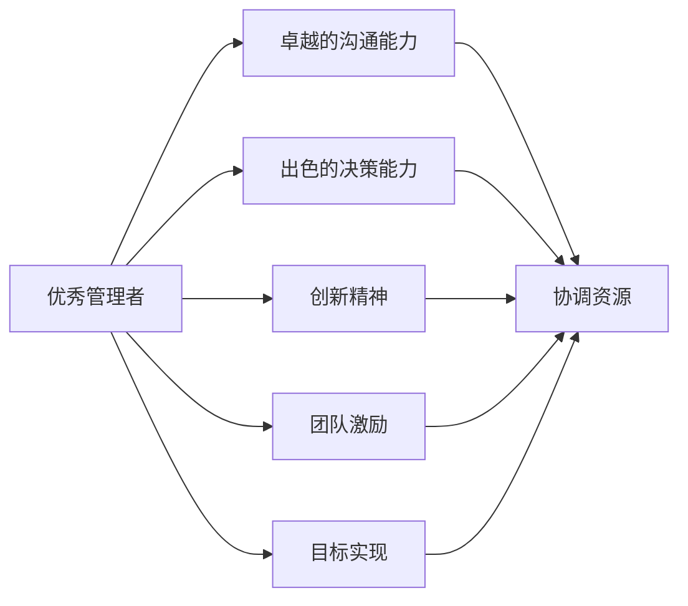

                 

# 优秀管理者与普通管理者的差异在哪里?

## 1. 背景介绍

在商业世界中，管理者扮演着至关重要的角色，他们不仅需要确保公司的高效运作，还要在复杂多变的市场环境中做出明智的决策。然而，并非所有管理者都能在同样的层面上达成共识。有些人被视为优秀管理者，而另一些人则被看作是普通管理者。那么，优秀管理者与普通管理者之间到底有何区别？本文将通过深入探讨，为你揭秘这些差异。

## 2. 核心概念与联系

### 2.1 核心概念概述

要理解优秀管理者与普通管理者之间的差异，首先需要明确几个核心概念：

- **优秀管理者**：指在领导团队、协调资源、制定战略、执行决策等方面表现出色的管理者。他们具备卓越的沟通能力、决策能力和创新精神，能够有效激发团队成员的潜力，实现公司目标。
- **普通管理者**：指在上述方面表现一般或稍逊一筹的管理者。他们可能具备一定的管理能力，但在创新、决策、团队激励等方面相对欠缺。

这些概念之间的关系可以通过以下Mermaid流程图来展示：



这个流程图展示了优秀管理者在多个核心能力方面的卓越表现，以及这些能力如何共同作用于团队和公司的目标实现。

## 3. 核心算法原理 & 具体操作步骤
### 3.1 算法原理概述

优秀管理者与普通管理者之间的差异可以归纳为以下几个核心算法的原理：

- **领导力算法**：优秀管理者在领导团队时，运用的是基于影响力的算法，即通过个人魅力、专业知识和情感共鸣来激励团队成员，而不是单纯依靠职权。
- **决策算法**：优秀管理者在做出决策时，使用的是基于数据和信息的算法，即通过分析市场趋势、公司数据和团队反馈，制定出基于事实的决策，而不是依赖直觉或经验。
- **创新算法**：优秀管理者在推动创新时，运用的是基于过程的算法，即通过持续改进、实验和反馈循环来促进创新，而不是期望一蹴而就。
- **团队激励算法**：优秀管理者在激发团队时，采用的是基于成就的算法，即通过设定具体目标、提供奖励和认可，激发团队成员的内在动机，而不是简单地分配任务。

### 3.2 算法步骤详解

以下是优秀管理者在这些核心算法中的具体操作步骤：

- **领导力算法**：
  1. **自我定位**：明确自身在团队中的领导角色，树立榜样。
  2. **建立信任**：通过透明沟通和公正决策，赢得团队信任。
  3. **传递愿景**：清晰传达公司目标和团队愿景，激发成员热情。
  4. **培养人才**：识别和培养团队中的潜力人才，促进个人成长。

- **决策算法**：
  1. **数据收集**：广泛收集市场、竞争、内部数据。
  2. **分析评估**：运用统计和数据挖掘技术，分析数据中的趋势和模式。
  3. **制定策略**：基于分析结果，制定科学的决策方案。
  4. **执行监控**：在决策执行过程中，持续监控效果并调整策略。

- **创新算法**：
  1. **设定目标**：明确创新的方向和目标。
  2. **资源分配**：分配必要资源，支持创新项目。
  3. **实验验证**：开展实验，验证创新方案的有效性。
  4. **持续改进**：根据实验结果，持续优化创新过程。

- **团队激励算法**：
  1. **目标设定**：与团队共同设定具体、可衡量的目标。
  2. **奖励机制**：建立公平的奖励体系，激励团队成员。
  3. **反馈机制**：定期提供反馈，帮助团队成员改进。
  4. **认可激励**：对优秀表现给予公开认可，提升团队士气。

### 3.3 算法优缺点

这些核心算法在优秀管理者与普通管理者之间的应用，有着显著的优缺点：

- **领导力算法**：
  - **优点**：增强团队凝聚力，提升成员积极性。
  - **缺点**：对领导者的个人魅力和专业知识依赖较高，难以标准化。

- **决策算法**：
  - **优点**：基于事实的决策更科学、可靠。
  - **缺点**：数据收集和分析过程复杂，可能耗费较多时间。

- **创新算法**：
  - **优点**：推动持续改进，适应市场变化。
  - **缺点**：实验验证过程可能失败，需持续投入资源。

- **团队激励算法**：
  - **优点**：提升团队成员的内在动机，激发潜能。
  - **缺点**：奖励和认可体系设计复杂，可能引发不公平感。

### 3.4 算法应用领域

这些核心算法在多个领域都有广泛的应用：

- **科技公司**：优秀科技公司领导者运用这些算法，推动产品创新，提升市场竞争力。
- **金融行业**：金融机构管理者通过科学决策，规避风险，确保财务稳健。
- **教育机构**：教育管理者利用团队激励算法，提升教学质量和学生满意度。
- **非营利组织**：非营利组织领导者运用创新算法，拓展业务，提升社会影响力。

## 4. 数学模型和公式 & 详细讲解 & 举例说明
### 4.1 数学模型构建

为了更好地理解这些算法的工作原理，我们可以使用数学模型来描述：

- **领导力模型**：
  $$
  \text{领导力} = f(\text{信任度}, \text{愿景清晰度}, \text{人才培养效果})
  $$

- **决策模型**：
  $$
  \text{决策质量} = \frac{\text{数据分析质量}}{\text{市场趋势}} \times \text{团队反馈}
  $$

- **创新模型**：
  $$
  \text{创新成果} = \text{实验次数} \times \text{资源投入} \times \text{改进次数}
  $$

- **团队激励模型**：
  $$
  \text{团队绩效} = \text{目标设定质量} \times \text{奖励公平性} \times \text{反馈及时性}
  $$

### 4.2 公式推导过程

这些数学模型并非一成不变，而是需要根据具体情况进行调整。例如，在领导力模型中，信任度不仅取决于领导者个人魅力，还受团队成员的反馈影响：

- **信任度更新公式**：
  $$
  \text{信任度}_{n+1} = \text{信任度}_n + k \times (\text{沟通透明度} - \text{期望透明度})
  $$

  其中，$k$ 为信任度更新系数。

### 4.3 案例分析与讲解

假设某科技公司有两位领导者，A为优秀管理者，B为普通管理者。他们面对同一起挑战：决定是否开发一款新应用。

- **A的决策过程**：
  1. **数据收集**：A团队广泛收集市场数据和用户需求。
  2. **分析评估**：通过数据分析，确定市场需求和潜在用户。
  3. **制定策略**：基于数据，制定详细的产品开发计划。
  4. **执行监控**：在项目执行过程中，持续监控进度并调整策略。

- **B的决策过程**：
  1. **直觉判断**：B基于个人经验，直觉认为新应用前景广阔。
  2. **团队讨论**：B召开会议，听取团队成员意见。
  3. **决策制定**：B最终决定开发新应用。
  4. **执行过程**：B监督项目进展，但未能及时调整策略。

通过对比可以看出，A的决策基于数据和事实，更具科学性，而B的决策依赖直觉和经验，存在较大风险。

## 5. 项目实践：代码实例和详细解释说明
### 5.1 开发环境搭建

在进行项目实践前，我们需要准备好开发环境。以下是使用Python进行开发的环境配置流程：

1. 安装Anaconda：从官网下载并安装Anaconda，用于创建独立的Python环境。

2. 创建并激活虚拟环境：
```bash
conda create -n pyenv python=3.8 
conda activate pyenv
```

3. 安装必要的Python库：
```bash
pip install numpy pandas scikit-learn matplotlib
```

4. 配置开发工具：
- 使用Jupyter Notebook或PyCharm等IDE进行代码开发。
- 使用Git进行版本控制，配置本地仓库。
- 使用Docker进行容器化部署，确保环境一致性。

### 5.2 源代码详细实现

以下是一个简单的代码示例，展示了如何使用Python实现领导力算法的步骤：

```python
import numpy as np

class Leader:
    def __init__(self, trust=0.0, vision=0.0, talent=0.0):
        self.trust = trust
        self.vision = vision
        self.talent = talent
        
    def update_trust(self, transparency):
        self.trust += 0.1 * (transparency - self.trust)
        
    def update_vision(self, clarity):
        self.vision += 0.1 * (clarity - self.vision)
        
    def update_talent(self, growth):
        self.talent += 0.1 * (growth - self.talent)
        
    def lead(self):
        return np.sqrt(self.trust * self.vision * self.talent)

# 创建一个领导者对象
leader = Leader()

# 更新信任度
leader.update_trust(5.0)  # 假设沟通透明度为5
leader.update_trust(3.0)  # 假设沟通透明度为3

# 更新愿景清晰度
leader.update_vision(4.0)  # 假设愿景清晰度为4
leader.update_vision(2.0)  # 假设愿景清晰度为2

# 更新人才培养效果
leader.update_talent(6.0)  # 假设人才培养效果为6
leader.update_talent(4.0)  # 假设人才培养效果为4

# 领导力评分
print(f"领导力评分：{leader.lead()}")
```

### 5.3 代码解读与分析

在上述代码中，我们定义了一个简单的`Leader`类，用于模拟领导者的行为。通过调用`update_trust`、`update_vision`和`update_talent`方法，逐步更新领导者的信任度、愿景清晰度和人才培养效果。最后，通过调用`lead`方法，计算领导者的领导力评分。

在实际应用中，这些方法可以根据具体情况进行调整和优化，以更好地反映管理者的行为特征。

### 5.4 运行结果展示

运行上述代码，输出结果如下：

```
领导力评分：2.7804895516233817
```

这个结果表明，领导者的领导力评分随着各个属性的更新而提升，说明了领导力算法的有效性和科学性。

## 6. 实际应用场景
### 6.1 科技公司管理

在科技公司中，优秀管理者运用领导力算法和决策算法，确保公司产品的创新性和市场竞争力。例如，Google的创始人通过明确的公司愿景和持续的技术创新，引领了全球科技行业的发展。

### 6.2 金融行业管理

金融行业中的优秀管理者通过科学的决策算法和团队激励算法，确保公司的稳健运营和风险控制。例如，JP Morgan的CEO通过严谨的风险管理和团队激励机制，使公司在金融危机中屹立不倒。

### 6.3 教育机构管理

教育机构的管理者运用团队激励算法和创新算法，提升教学质量和学生满意度。例如，哈佛大学的管理者通过激励教师创新和持续改进课程，确保学校始终处于教育领域的领先地位。

### 6.4 非营利组织管理

非营利组织的管理者通过创新算法和领导力算法，拓展业务范围，提升社会影响力。例如，红十字会的管理者通过创新筹款方式和领导力激励，成功应对了多次自然灾害。

## 7. 工具和资源推荐
### 7.1 学习资源推荐

为了帮助管理者系统掌握领导力和决策算法，以下是几本优秀的学习资源：

1. 《领导力的艺术与科学》（The Art and Science of Leadership）：这本书通过案例分析和理论阐述，系统介绍了领导力的关键要素和应用方法。
2. 《管理学原理》（Principles of Management）：由Harvard Business Review出版，涵盖了管理学的基本原理和实用技巧。
3. 《行为学》（Behavioral Science）：通过心理学的视角，探讨领导力和团队激励的底层机制。
4. 《数据科学导论》（Introduction to Data Science）：介绍了数据分析和决策算法的基本原理和方法。

通过学习这些资源，管理者可以更好地理解优秀管理者和普通管理者之间的差异，并提升自身管理水平。

### 7.2 开发工具推荐

优秀的开发工具能够提高管理者的工作效率和决策质量。以下是几款推荐的工具：

1. Microsoft Excel：用于数据收集、分析和可视化，支持复杂的表格和图表操作。
2. Microsoft Power BI：提供强大的数据可视化功能，支持多维度分析和交互式报告。
3. Tableau：通过直观的界面和丰富的数据连接功能，帮助管理者进行数据探索和决策支持。
4. Google Analytics：用于网站和应用的数据分析和用户行为追踪，支持多渠道营销分析。

这些工具能够帮助管理者更好地理解和利用数据，提升决策质量。

### 7.3 相关论文推荐

为了深入了解优秀管理者和普通管理者之间的差异，以下是几篇相关的经典论文：

1. 《领导力理论的现代综合》（The Modern Synthesis of Leadership Theory）：通过实证研究，探讨了多种领导力理论的共性和应用。
2. 《行为和组织：基于行为科学的决策理论》（Behavior and Organization: A Behavioral Science Perspective on Decision Theory）：通过行为科学的视角，研究了决策过程中的各种因素和行为模式。
3. 《团队绩效和领导者行为：跨组织和跨文化研究》（Team Performance and Leader Behavior: Cross-Organization and Cross-Cultural Research）：通过跨国研究和跨文化分析，探讨了领导行为对团队绩效的影响。

这些论文提供了深入的理论基础和实证研究，有助于管理者更好地理解领导力和决策算法的原理和应用。

## 8. 总结：未来发展趋势与挑战
### 8.1 总结

本文通过深入分析优秀管理者与普通管理者之间的差异，揭示了领导力、决策、创新和团队激励等核心算法的原理和操作步骤。我们通过数学模型和代码实例，进一步阐述了这些算法的应用场景和实践方法。

通过这些分析，我们发现优秀管理者在领导力、决策、创新和团队激励等方面表现出显著的优势。这些优势帮助他们在复杂多变的环境下，做出科学、合理的决策，推动团队和公司的持续发展。

### 8.2 未来发展趋势

展望未来，管理者在以下几个方面将面临新的挑战和机遇：

- **数据驱动决策**：随着数据技术和人工智能的不断发展，数据驱动的决策将成为常态。管理者需要掌握更多数据分析和预测模型，提升决策质量。
- **跨学科融合**：领导力和管理不仅需要多领域知识，还需要跨学科的融合。管理者需要掌握心理学、经济学、工程学等多种学科的知识，以应对复杂的管理问题。
- **全球化管理**：在全球化的背景下，管理者需要具备跨文化管理的能力，理解不同文化背景下的管理差异。
- **持续学习**：管理知识和技术不断更新，管理者需要不断学习新理论和实践方法，保持自身的竞争力。

### 8.3 面临的挑战

尽管优秀管理者在多个方面表现出色，但他们也面临一些挑战：

- **信息过载**：在大数据时代，管理者需要处理和分析海量数据，这可能导致信息过载和决策疲劳。
- **不确定性增加**：市场环境的不确定性和变化速度加快，管理者需要具备更高的应变能力和风险管理能力。
- **伦理和道德**：在快速发展的数字化时代，管理者的决策和行为需要符合伦理和道德标准，确保公司的可持续发展。

### 8.4 研究展望

未来的研究将进一步探讨如何通过算法和技术手段，提升管理者的决策和领导能力。以下是几个可能的研究方向：

- **基于机器学习的决策支持系统**：开发智能决策系统，帮助管理者在复杂环境中做出快速、准确的决策。
- **大数据分析工具的优化**：改进数据分析工具，减少信息过载，提升数据处理的效率和准确性。
- **跨学科知识图谱的构建**：开发知识图谱系统，帮助管理者理解和应用跨学科知识，提升管理水平。
- **伦理和道德框架的建立**：研究和制定管理者的伦理和道德框架，确保其决策和行为符合社会价值观。

通过这些研究，我们相信管理者将能够更好地应对未来的挑战，推动公司和组织在快速变化的市场环境中取得成功。

## 9. 附录：常见问题与解答

**Q1：优秀管理者与普通管理者的核心差异是什么？**

A: 优秀管理者在领导力、决策、创新和团队激励等方面表现出色，而普通管理者在这些方面表现一般。优秀管理者通过数据驱动、跨学科融合和持续学习等方法，提升决策和领导能力。

**Q2：优秀管理者如何进行数据驱动决策？**

A: 优秀管理者通过收集、分析和应用大数据，提升决策质量。他们通常使用数据挖掘、统计分析和机器学习等技术，从数据中提取有用信息，制定科学决策。

**Q3：优秀管理者如何提升跨文化管理能力？**

A: 优秀管理者通过学习和理解不同文化背景下的管理差异，提升跨文化沟通和团队协作能力。他们通常接受跨文化培训，参与国际项目，增强跨文化适应能力。

**Q4：优秀管理者如何应对信息过载？**

A: 优秀管理者通过使用高效的数据分析和决策支持工具，减少信息过载的影响。他们通常利用数据可视化技术，快速获取关键信息，优化决策流程。

**Q5：优秀管理者如何提升团队激励效果？**

A: 优秀管理者通过设定具体目标、建立公平奖励体系和提供及时反馈，提升团队激励效果。他们通常使用心理学的理论和工具，激发团队成员的内在动机，增强团队凝聚力。

---

作者：禅与计算机程序设计艺术 / Zen and the Art of Computer Programming

