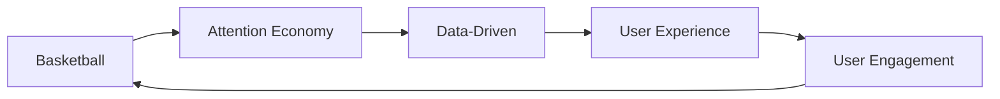

                 

# 体育产业在注意力经济中的新机遇

## 1. 背景介绍

在当今数字化、信息化的时代，注意力经济逐渐成为商业竞争的核心。体育产业作为兼具娱乐、竞技、社交和文化价值的行业，在这一大背景下，迎来了新的发展机遇。本文将探讨注意力经济对体育产业的影响，并分析其新的应用趋势。

## 2. 核心概念与联系

### 2.1 核心概念概述

在讨论体育产业在注意力经济中的新机遇之前，需要理解几个关键概念：

- **注意力经济**：指的是通过吸引和保持用户的注意力来创造商业价值的活动。这种经济形式依赖于互联网和数字媒体，让消费者在有限的时间资源中做出选择，并由此产生经济活动。

- **体育产业**：包括体育竞赛、体育健身、体育培训、体育传媒、体育衍生品等各个方面，旨在促进人的身心健康和社交互动，同时创造经济价值。

- **数据驱动**：指利用大数据和人工智能技术来分析和优化业务决策，提高体育产业运营效率和用户体验。

- **用户体验**：是消费者与体育产品和服务互动时的整体感受，影响着用户参与度和忠诚度。

- **NBA Battle Analytics**：篮球联赛中使用数据和技术来分析和优化球队和球员的表现。

### 2.2 核心概念联系

体育产业和注意力经济之间的联系在于，体育产业能够吸引大量的观众和粉丝，从而为注意力经济提供大量潜在的用户资源。通过数据驱动的方式，可以优化用户体验，提高用户的参与度和忠诚度，进一步提升体育产业的商业价值。

例如，NBA Battle Analytics就是将注意力经济的概念应用于体育领域，通过对比赛的实时数据进行分析，优化球队的战术和球员的表现，从而吸引和留住更多的观众。

以下是一个简单的Mermaid流程图，展示了这些概念之间的联系：



## 3. 核心算法原理 & 具体操作步骤

### 3.1 算法原理概述

在体育产业中，数据驱动和用户体验优化是两个关键的算法原理：

- **数据驱动**：通过收集和分析数据，如比赛表现、观众反馈、社交媒体互动等，来优化体育赛事和营销策略。

- **用户体验优化**：通过个性化推荐、实时互动、增强现实(AR)等方式，提升观众的参与度和满意度。

### 3.2 算法步骤详解

在实际应用中，数据驱动和用户体验优化的算法步骤可以概括为：

1. **数据收集**：通过传感器、社交媒体、电视收视率等途径，收集相关数据。

2. **数据处理**：使用数据清洗、特征提取等技术，将原始数据转化为可用于分析的形式。

3. **数据分析**：利用机器学习、深度学习等算法，对数据进行模式识别和趋势预测。

4. **策略优化**：基于分析结果，优化赛事安排、观众互动方式、营销活动等。

5. **反馈循环**：持续收集用户反馈，进一步调整和优化算法模型。

### 3.3 算法优缺点

数据驱动和用户体验优化算法的主要优点包括：

- **提高效率**：通过数据驱动，可以快速识别问题和改进方向，优化运营效率。

- **增强互动性**：通过用户体验优化，可以增加用户参与度和满意度。

- **个性化服务**：利用数据分析，提供个性化的赛事体验和推荐。

但这些算法也存在一些缺点：

- **数据隐私**：数据收集和分析可能涉及用户隐私问题，需要谨慎处理。

- **数据质量**：数据质量直接影响分析结果，需要保证数据来源和处理过程的准确性。

- **算法复杂性**：高级算法模型需要复杂的计算资源和技术支持。

### 3.4 算法应用领域

数据驱动和用户体验优化算法广泛应用于以下体育产业领域：

- **赛事管理**：通过分析比赛数据，优化比赛安排和战术策略。

- **观众互动**：利用社交媒体、AR等技术，增强观众的现场体验和参与感。

- **营销推广**：基于用户行为分析，精准推送广告和促销信息。

- **场地管理**：优化场地设施和布局，提升观众观赛体验。

## 4. 数学模型和公式 & 详细讲解 & 举例说明

### 4.1 数学模型构建

数据驱动和用户体验优化的数学模型构建主要包括以下几个方面：

- **数据表示**：将数据转化为向量或矩阵形式，用于模型训练。

- **特征提取**：从原始数据中提取有用的特征，如球员的得分、助攻、抢断等。

- **模型选择**：选择合适的机器学习或深度学习模型，如随机森林、神经网络等。

### 4.2 公式推导过程

以NBA Battle Analytics为例，其数学模型可以简单表示为：

$$
\text{Predicted Performance} = \text{Model}(\text{Historical Data}, \text{Current Data}, \text{Contextual Features})
$$

其中，$\text{Model}$表示预测模型，$\text{Historical Data}$表示历史数据，$\text{Current Data}$表示当前数据，$\text{Contextual Features}$表示上下文特征。

具体公式推导过程如下：

1. **历史数据建模**：通过收集球员的历史比赛数据，构建球员表现模型。

2. **实时数据预测**：利用球员在当前比赛中的实时数据，预测其表现。

3. **上下文特征融合**：考虑比赛场地、对手强弱等因素，对预测结果进行调整。

### 4.3 案例分析与讲解

以NBA的某场比赛为例，通过数据分析，可以预测哪些球员可能表现出色，哪些球员可能需要更多的关注和指导。例如，通过分析球员的传球、投篮、防守等数据，预测他们在即将到来的比赛中可能的表现，从而优化球队战术。

## 5. 项目实践：代码实例和详细解释说明

### 5.1 开发环境搭建

为了实现上述数据分析和预测，需要搭建一个数据驱动和用户体验优化的开发环境。以下是一些关键步骤：

1. **环境配置**：安装Python、R、SQL等数据处理和分析工具。

2. **数据准备**：收集比赛数据、观众反馈、社交媒体互动等数据，并清洗整理。

3. **数据存储**：使用MySQL、Hadoop等数据库存储数据，确保数据的可靠性和安全性。

4. **模型训练**：使用机器学习或深度学习框架，如TensorFlow、PyTorch等，训练预测模型。

### 5.2 源代码详细实现

以下是一个简单的Python代码示例，用于训练一个NBA球员表现预测模型：

```python
import pandas as pd
from sklearn.ensemble import RandomForestRegressor
from sklearn.model_selection import train_test_split

# 加载数据
data = pd.read_csv('nba_data.csv')

# 数据清洗和特征提取
features = ['age', 'position', 'height', 'weight']
target = 'performance'
X = data[features]
y = data[target]

# 数据划分
X_train, X_test, y_train, y_test = train_test_split(X, y, test_size=0.2, random_state=42)

# 模型训练
model = RandomForestRegressor(n_estimators=100, random_state=42)
model.fit(X_train, y_train)

# 模型评估
score = model.score(X_test, y_test)
print(f"模型评估得分: {score:.2f}")
```

### 5.3 代码解读与分析

该代码实现了使用随机森林模型训练球员表现预测的流程：

1. **数据加载**：从CSV文件中加载NBA球员数据。

2. **数据清洗**：选择球员的年龄、位置、身高、体重等特征，以及表现目标。

3. **数据划分**：将数据划分为训练集和测试集，以评估模型的泛化能力。

4. **模型训练**：使用随机森林模型对训练集进行训练，生成预测模型。

5. **模型评估**：在测试集上评估模型的准确度，输出评估得分。

### 5.4 运行结果展示

通过运行上述代码，可以得到模型的评估得分。例如，假设模型的评估得分为0.85，说明模型在测试集上的表现较为理想。

## 6. 实际应用场景

### 6.1 赛事管理

通过数据驱动和用户体验优化，可以优化赛事安排和战术策略，提高比赛的观赏性和竞争力。例如，通过分析观众的互动数据，优化比赛场次和时间，吸引更多观众观看。

### 6.2 观众互动

利用AR技术，可以增强观众的现场体验。例如，观众可以通过AR眼镜，看到球员的详细数据和分析，增加参与感和互动性。

### 6.3 营销推广

通过大数据分析，可以精准推送广告和促销信息。例如，基于用户行为数据，向喜欢某支球队的观众推送相关商品和活动信息，提升转化率。

### 6.4 场地管理

优化场地设施和布局，提升观众观赛体验。例如，通过数据分析，调整观众座位安排，优化观赛视野。

## 7. 工具和资源推荐

### 7.1 学习资源推荐

为了掌握数据驱动和用户体验优化的技术，以下是一些推荐的资源：

1. **《Python数据分析实战》**：详细介绍Python在数据分析和数据可视化中的应用。

2. **《机器学习实战》**：通过实例讲解机器学习算法在体育产业中的应用。

3. **Kaggle**：提供大量数据集和竞赛，帮助学习者实践和提升数据处理和分析能力。

4. **Coursera**：提供数据科学和机器学习相关的在线课程，涵盖从入门到进阶的内容。

### 7.2 开发工具推荐

以下是一些推荐的开发工具：

1. **Jupyter Notebook**：支持Python、R等语言，用于数据处理和模型训练。

2. **TensorBoard**：用于可视化模型训练过程，帮助调试和优化算法。

3. **GitHub**：提供代码托管和版本控制，方便协作开发。

4. **Scikit-learn**：提供常用的机器学习算法库，支持快速开发数据驱动的模型。

### 7.3 相关论文推荐

以下是一些相关论文，帮助深入理解数据驱动和用户体验优化的算法：

1. **《Data Mining for Sports Analytics》**：探讨数据挖掘技术在体育产业中的应用。

2. **《User Experience Optimization in Sports》**：分析用户体验在体育产业中的影响和优化方法。

3. **《NBA Battle Analytics》**：介绍NBA中使用数据和技术优化球队表现的方法。

4. **《Attention in Attention: A Novel Framework for Large-scale Sports Data Analysis》**：提出一种基于注意力机制的体育数据分析框架。

## 8. 总结：未来发展趋势与挑战

### 8.1 研究成果总结

数据驱动和用户体验优化在体育产业中的应用，已经展示了其强大的潜力和实际效果。通过优化赛事管理、观众互动、营销推广等环节，提高了体育产业的运营效率和用户满意度。

### 8.2 未来发展趋势

未来，数据驱动和用户体验优化将进一步融合，结合物联网、5G等新技术，提供更加智能和个性化的体育体验。例如，通过增强现实和虚拟现实技术，创造沉浸式的观赛体验。

### 8.3 面临的挑战

尽管数据驱动和用户体验优化取得了不少进展，但仍面临一些挑战：

- **数据隐私和安全**：如何在保护用户隐私的前提下，收集和使用数据。

- **数据质量和准确性**：如何保证数据来源和处理过程的准确性。

- **计算资源限制**：高级算法模型需要大量的计算资源。

### 8.4 研究展望

未来的研究应在以下几个方面进行：

- **数据隐私保护**：开发隐私保护技术，确保数据使用合规。

- **实时数据处理**：提高数据处理和分析的速度，实现实时决策。

- **跨领域融合**：将体育与其他行业结合，如医疗、旅游等，拓展应用场景。

- **智能辅助决策**：利用人工智能技术，提供智能辅助决策支持。

通过不断探索和创新，数据驱动和用户体验优化必将在体育产业中发挥更大的作用，带来新的发展机遇。

## 9. 附录：常见问题与解答

### Q1: 如何确保数据隐私？

A: 数据隐私保护可以通过以下措施实现：

1. **数据匿名化**：对个人数据进行匿名化处理，去除或模糊化个人身份信息。

2. **访问控制**：限制数据的访问权限，确保只有授权人员才能访问和使用数据。

3. **加密技术**：对数据进行加密处理，防止数据泄露。

4. **合规性审查**：定期审查数据处理流程，确保符合相关法律法规。

### Q2: 如何处理数据质量问题？

A: 数据质量问题可以通过以下方式解决：

1. **数据清洗**：通过数据清洗，去除噪声和异常值。

2. **数据校验**：使用校验规则和算法，确保数据的准确性和完整性。

3. **数据补全**：通过插值、回归等技术，填补缺失的数据。

4. **数据质量评估**：定期评估数据质量，识别和解决数据问题。

### Q3: 如何优化计算资源使用？

A: 优化计算资源使用可以通过以下方式实现：

1. **算法优化**：优化算法模型，减少计算复杂度。

2. **分布式计算**：使用分布式计算框架，如Spark，提高数据处理速度。

3. **模型压缩**：压缩模型参数，减少内存占用。

4. **硬件加速**：使用GPU、TPU等硬件加速设备，提高计算效率。

通过不断优化数据驱动和用户体验优化算法，可以更好地应用于体育产业，提升运营效率和用户体验，创造更多的商业价值。

---

作者：禅与计算机程序设计艺术 / Zen and the Art of Computer Programming

