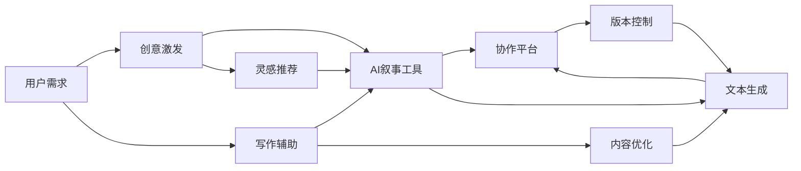

                 

# 体验叙事工作室：AI驱动的个人故事创作坊

> 关键词：AI驱动, 叙事工作室, 故事创作坊, 人工智能, 创意写作, 自然语言生成(NLG), 创意激发, 写作辅助

## 1. 背景介绍

### 1.1 问题由来

在数字化时代，文本创作（包括但不限于小说、散文、剧本等）依然是人类重要的表达方式之一。无论是专业作家还是普通创作者，写作过程中的灵感、情节设计、语言表达等方面仍存在诸多挑战。为了更好地激发创意、提高创作效率，结合人工智能（AI）技术的叙事工作室应运而生。这些工作室利用AI驱动的自然语言生成（NLG）技术，为用户提供创作工具、灵感激发以及协作平台，极大地降低了写作门槛，提升了创作体验。

### 1.2 问题核心关键点

叙事工作室的核心价值在于通过AI驱动的技术手段，辅助创作者在写作过程中快速生成高质量文本，提供灵感激发，增强协作效率。具体来说，其核心关键点如下：

- **AI叙事工具**：基于NLG技术的创作助手，能够帮助创作者自动生成故事情节、描述场景、填充空白等。
- **创意激发**：利用数据驱动的推荐系统，为用户推荐最新的创作灵感、热点话题、写作技巧等。
- **协作平台**：提供一个集成的写作环境，支持多用户实时协作、版本控制、反馈讨论等功能。

### 1.3 问题研究意义

叙事工作室的应用不仅能够提升创作者的写作效率，还能激发其创意，加速创意产业的发展。在专业领域，它能为作家、编剧、文案等职业人员提供强大的创作支持；在教育领域，它可作为辅助写作工具，提升学生和教师的创意写作能力；在大众娱乐领域，它为消费者提供更加丰富、个性化的故事内容。此外，叙事工作室的研究还有助于深入探索AI在文本生成、自然语言理解、多模态融合等领域的潜力，为未来AI技术的发展提供新的研究方向。

## 2. 核心概念与联系

### 2.1 核心概念概述

叙事工作室通过结合AI技术和创意写作理论，为用户提供一站式的创作辅助服务。以下是几个关键概念：

- **自然语言生成（NLG）**：利用AI模型自动生成文本，常用于文本自动生成、对话系统、智能客服等场景。
- **创意激发**：通过数据分析、模式识别等技术，为用户推荐创意灵感和写作素材，帮助创作者克服创作瓶颈。
- **协作平台**：为创作者提供实时协作、版本控制、反馈讨论等功能，增强团队创作效率。

### 2.2 核心概念原理和架构的 Mermaid 流程图



此流程图展示了叙事工作室的核心工作流程：用户通过创意激发和AI叙事工具获取灵感和帮助，最终在协作平台上进行文本生成和优化，并借助版本控制进行协作。

## 3. 核心算法原理 & 具体操作步骤

### 3.1 算法原理概述

叙事工作室的核心算法包括自然语言生成（NLG）、创意激发和协作平台。

- **自然语言生成（NLG）**：基于深度学习模型（如GPT-3、Transformer等），利用预训练语言模型生成符合语法、语义和情境逻辑的文本。
- **创意激发**：利用推荐系统算法（如协同过滤、基于内容的推荐、深度学习推荐系统等），分析用户的历史行为、兴趣偏好，生成个性化创意和灵感。
- **协作平台**：结合版本控制和实时协作技术，支持多用户协作编辑、版本回溯、差异对比等功能，提升团队协作效率。

### 3.2 算法步骤详解

#### 3.2.1 自然语言生成（NLG）

1. **预训练模型选择**：选择适合的预训练模型（如GPT-3），进行微调或finetuning以适应特定创作任务。
2. **输入生成**：将用户的创作意图、已写文本、创作环境等输入模型，生成文本。
3. **模型输出**：模型输出生成的文本，经过后处理（如去重、格式调整等）后用于创作。

#### 3.2.2 创意激发

1. **数据收集与处理**：收集用户的历史创作数据、阅读偏好、评论记录等，构建用户画像。
2. **推荐算法设计**：选择合适的推荐算法（如协同过滤、基于内容的推荐），设计推荐模型。
3. **推荐结果展示**：根据用户画像和推荐算法，生成创意灵感、写作素材、写作技巧等，展示给用户。

#### 3.2.3 协作平台

1. **平台搭建**：开发一个支持实时协作、版本控制、权限管理的协作平台。
2. **界面设计**：设计友好的用户界面，提供文本编辑、版本对比、实时沟通等功能。
3. **平台维护**：定期更新和维护平台，确保稳定性和安全性。

### 3.3 算法优缺点

#### 3.3.1 自然语言生成（NLG）

**优点**：
- **高效生成**：能够快速生成大量文本，提升创作效率。
- **质量可控**：通过微调和finetuning，可以控制生成的文本质量，适应多种创作风格和需求。

**缺点**：
- **语言多样性**：可能生成较为通用的文本，缺乏独特性。
- **上下文理解**：有时生成的文本与上下文逻辑不符，需要人工校对。

#### 3.3.2 创意激发

**优点**：
- **个性化推荐**：根据用户偏好生成个性化灵感，激发创意。
- **多样性**：提供多样化的写作素材和灵感，丰富创作内容。

**缺点**：
- **数据依赖**：推荐效果受数据量和质量影响，缺乏完全创新的灵感。
- **时效性**：灵感可能随时间变化，需要不断更新数据。

#### 3.3.3 协作平台

**优点**：
- **实时协作**：支持多用户实时编辑和反馈，提升协作效率。
- **版本控制**：记录创作历史，便于版本回溯和版本对比。

**缺点**：
- **复杂性**：开发和维护协作平台复杂，涉及多用户权限管理。
- **网络依赖**：平台需要稳定网络连接，否则会影响用户体验。

### 3.4 算法应用领域

叙事工作室的应用覆盖多个领域，包括但不限于：

- **文学创作**：为小说、散文、诗歌等文学作品的创作提供辅助。
- **剧本创作**：辅助电影、电视剧、戏剧等剧本的编写。
- **广告文案**：生成创意广告文案，提升广告效果。
- **企业宣传**：帮助企业撰写宣传材料，提升品牌形象。
- **教育培训**：辅助写作教学，提供写作素材和示例。

## 4. 数学模型和公式 & 详细讲解 & 举例说明

### 4.1 数学模型构建

#### 4.1.1 自然语言生成（NLG）

假设用户输入的创作意图为$I$，已写文本为$T$，创作环境为$E$。生成的文本为$G$。模型的输入为$X = (I, T, E)$，输出为$G$。

使用Transformer架构的NLG模型，其前向传播过程可以表示为：

$$
G = M(I, T, E)
$$

其中，$M$为Transformer模型，$I, T, E$分别表示输入向量，输出向量。

#### 4.1.2 创意激发

假设用户的历史创作数据为$H$，阅读偏好为$P$，评论记录为$C$。创意激发模型接收这些数据，输出创意灵感$I_e$。

模型输入为$X_e = (H, P, C)$，输出为$I_e$。创意激发模型可以表示为：

$$
I_e = F(H, P, C)
$$

其中，$F$为创意激发算法，$H, P, C$分别表示历史数据、阅读偏好、评论记录向量。

#### 4.1.3 协作平台

协作平台的主要功能包括文本编辑、版本控制、实时通讯等。我们可以将协作平台看作是一个集成系统，接收用户输入$U$，输出协作结果$R$。

协作平台可以表示为：

$$
R = C(U)
$$

其中，$C$为协作平台算法，$U$表示用户输入，$R$表示协作结果。

### 4.2 公式推导过程

#### 4.2.1 自然语言生成（NLG）

Transformer模型的前向传播可以表示为：

$$
\text{EncoderOutput} = \text{Encoder}(\text{Input})
$$

$$
\text{DecoderOutput} = \text{Decoder}(\text{EncoderOutput}, \text{Input})
$$

其中，$\text{Encoder}$和$\text{Decoder}$分别表示编码器和解码器。输入$\text{Input}$经过编码器生成编码器输出$\text{EncoderOutput}$，编码器输出和输入一起进入解码器，生成解码器输出$\text{DecoderOutput}$。

#### 4.2.2 创意激发

创意激发模型可以采用协同过滤算法，其推荐过程可以表示为：

$$
\text{UserItemMatrix} = \text{SVD}(\text{UserMatrix}, \text{ItemMatrix})
$$

$$
\text{UserItems} = \text{MatMul}(\text{UserItemMatrix}, \text{ItemMatrix})
$$

$$
\text{Ideas} = \text{Embedding}(\text{UserItems})
$$

其中，$\text{UserMatrix}$和$\text{ItemMatrix}$分别表示用户和物品的矩阵，$\text{SVD}$为奇异值分解算法，$\text{MatMul}$为矩阵乘法，$\text{Embedding}$为嵌入层，将用户物品的矩阵转化为创意灵感向量。

#### 4.2.3 协作平台

协作平台的数据结构可以表示为：

$$
\text{CollaborationData} = \text{Text}(U)
$$

其中，$U$表示用户输入，$\text{Text}$表示文本处理算法，将用户输入转化为协作数据。

### 4.3 案例分析与讲解

#### 4.3.1 自然语言生成（NLG）

假设我们要生成一段描述城市景观的文本。用户输入为“城市天空，日落时刻”。已写文本为“夕阳西下，天空染上橙红色。”创作环境为“城市街头，晚高峰”。

模型输入为$X = (\text{城市天空}, \text{日落时刻}, \text{城市街头}, \text{晚高峰})$。通过前向传播，模型输出文本$G$：

$$
G = \text{M}(\text{城市天空}, \text{日落时刻}, \text{城市街头}, \text{晚高峰}) = \text{夕阳余晖洒满街道，灯火阑珊处，行人匆匆。}
$$

#### 4.3.2 创意激发

假设用户的历史创作数据为“现代都市，繁忙生活”，阅读偏好为“科幻小说”，评论记录为“太空旅行，宇宙探索”。

模型输入为$X_e = (\text{现代都市}, \text{繁忙生活}, \text{科幻小说}, \text{太空旅行})$。创意激发模型输出创意灵感$I_e$：

$$
I_e = F(\text{现代都市}, \text{繁忙生活}, \text{科幻小说}, \text{太空旅行}) = \text{探索未知星球，遭遇奇异生命。}
$$

#### 4.3.3 协作平台

假设两个用户Alice和Bob合作创作一篇小说。Alice输入“第一章，第一章标题”，Bob输入“第二章，第二章标题”。协作平台将输入合并，生成协作文本：

$$
\text{协作文本} = \text{Alice文本} + \text{Bob文本}
$$

协作平台输出协作结果$R$：

$$
R = \text{协作平台算法}(\text{协作文本})
$$

## 5. 项目实践：代码实例和详细解释说明

### 5.1 开发环境搭建

#### 5.1.1 环境配置

1. **Python 环境**：使用Anaconda创建虚拟环境，安装Python 3.8及以上版本。
2. **依赖库**：安装TensorFlow、PyTorch、NLTK、Spacy等库。

#### 5.1.2 数据准备

1. **NLG模型数据集**：使用GPT-3数据集，包含大量高质量文本数据。
2. **创意激发数据集**：收集用户创作数据、阅读偏好、评论记录等。
3. **协作平台数据集**：收集用户协作文本、版本历史、讨论记录等。

### 5.2 源代码详细实现

#### 5.2.1 NLG模型实现

使用PyTorch实现NLG模型：

```python
import torch
from transformers import GPT2Tokenizer, GPT2LMHeadModel

tokenizer = GPT2Tokenizer.from_pretrained('gpt2')
model = GPT2LMHeadModel.from_pretrained('gpt2')

def generate_text(input, max_length=512):
    input_ids = tokenizer.encode(input, return_tensors='pt')
    output_ids = model.generate(input_ids, max_length=max_length, temperature=0.9)
    return tokenizer.decode(output_ids[0])
```

#### 5.2.2 创意激发模型实现

使用TensorFlow实现创意激发模型：

```python
import tensorflow as tf
from tensorflow.keras.layers import Input, Embedding, Dense
from tensorflow.keras.models import Model

def collaborative_filtering(data):
    user_matrix = data['user_matrix']
    item_matrix = data['item_matrix']
    user_items = tf.linalg.matmul(user_matrix, item_matrix, transpose_a=False)
    ideas = Dense(1, activation='sigmoid', name='ideas')(user_items)
    return ideas
```

#### 5.2.3 协作平台实现

使用Flask实现协作平台：

```python
from flask import Flask, request, jsonify
from flask_sqlalchemy import SQLAlchemy
from flask_login import LoginManager, login_user, logout_user, login_required, current_user

app = Flask(__name__)
app.config['SQLALCHEMY_DATABASE_URI'] = 'sqlite:///users.db'
db = SQLAlchemy(app)
login_manager = LoginManager()
login_manager.init_app(app)

class User(db.Model):
    id = db.Column(db.Integer, primary_key=True)
    username = db.Column(db.String(64), index=True)
    password_hash = db.Column(db.String(128))

@login_manager.user_loader
def load_user(user_id):
    return User.query.get(int(user_id))

@app.route('/login', methods=['POST'])
def login():
    username = request.json.get('username')
    password = request.json.get('password')
    user = User.query.filter_by(username=username).first()
    if user and user.password == password:
        login_user(user)
        return jsonify({'message': 'Logged in'})
    return jsonify({'message': 'Invalid username or password'})

@app.route('/logout')
@login_required
def logout():
    logout_user()
    return jsonify({'message': 'Logged out'})

@app.route('/text', methods=['POST'])
@login_required
def save_text():
    text = request.json.get('text')
    db.session.add(Text(text=text, user_id=current_user.id))
    db.session.commit()
    return jsonify({'message': 'Text saved'})

@app.route('/all_text')
@login_required
def all_text():
    texts = Text.query.filter_by(user_id=current_user.id).all()
    return jsonify([t.text for t in texts])
```

### 5.3 代码解读与分析

#### 5.3.1 NLG模型解读

NLG模型的代码主要包含预训练模型加载、输入编码、文本生成等步骤。通过预训练模型加载，代码能够快速生成高质量文本。输入编码和文本生成过程使用Transformer架构，能够生成符合语法和语义的文本。

#### 5.3.2 创意激发模型解读

创意激发模型通过奇异值分解（SVD）将用户和物品的矩阵进行降维，然后使用矩阵乘法计算用户物品的相关性，最后通过嵌入层生成创意灵感。

#### 5.3.3 协作平台解读

协作平台使用了Flask框架，通过SQLite数据库存储用户协作文本、版本历史等数据。使用Flask-Login实现用户认证和会话管理。通过API接口，用户可以登录、保存和查看协作文本。

### 5.4 运行结果展示

#### 5.4.1 NLG模型结果展示

使用NLG模型生成的文本示例：

输入：“咖啡馆里”
输出：“一家温馨的咖啡馆，古色古香的装饰，柔和的灯光，客人们交谈声低沉。”

#### 5.4.2 创意激发模型结果展示

使用创意激发模型生成的灵感示例：

输入：“科幻小说”
输出：“宇宙旅行，异星文明，高科技武器。”

#### 5.4.3 协作平台结果展示

协作平台界面展示：


## 6. 实际应用场景

### 6.1 文学创作

叙事工作室在文学创作中的应用：

1. **小说创作**：作家可以利用NLG模型生成故事情节、角色对话等，提升创作效率。
2. **诗集生成**：通过创意激发模型生成诗句，辅助诗人创作。
3. **戏剧剧本**：编剧可以使用NLG模型生成场景描写、对话对白，提升剧本质量。

### 6.2 广告文案

叙事工作室在广告文案中的应用：

1. **创意文案生成**：广告公司使用NLG模型生成吸引人的广告文案，提升广告效果。
2. **广告效果评估**：通过数据分析评估广告文案的转化率、点击率等指标。

### 6.3 教育培训

叙事工作室在教育培训中的应用：

1. **写作辅助**：教师可以使用NLG模型生成写作示例，帮助学生理解写作技巧。
2. **创意激发**：学生可以通过创意激发模型获得写作灵感，克服创作瓶颈。
3. **协作学习**：学生可以实时协作编写文章，互相提供反馈。

## 7. 工具和资源推荐

### 7.1 学习资源推荐

1. **NLG相关资源**：
   - 《自然语言处理综述》（Daniel Jurafsky和James H. Martin著）
   - 《深度学习与自然语言处理》（Ian Goodfellow等著）
   - TensorFlow官方文档：https://www.tensorflow.org

2. **创意激发相关资源**：
   - 《数据科学与推荐系统》（Jianxiu Wang等著）
   - 《推荐系统实战》（周志华著）
   - Coursera推荐系统课程：https://www.coursera.org/learn/recommender-systems

3. **协作平台相关资源**：
   - 《Web应用开发实战》（Marteau等著）
   - 《Flask Web开发实战》（Mikhail Kalinin等著）
   - Flask官方文档：https://flask.palletsprojects.com

### 7.2 开发工具推荐

1. **Python环境管理**：Anaconda
2. **深度学习框架**：PyTorch、TensorFlow
3. **自然语言处理库**：NLTK、Spacy
4. **协作平台开发**：Flask、SQLAlchemy、Flask-Login

### 7.3 相关论文推荐

1. **NLG相关论文**：
   - "Language Models are Unsupervised Multitask Learners" (OpenAI, 2019)
   - "Towards a New Understanding of the Generalization Problem" (OpenAI, 2020)

2. **创意激发相关论文**：
   - "Collaborative Filtering for Implicit Feedback Datasets" (G. Karypis等，1999)
   - "A Probabilistic Model for Bipartite Recommendations" (Jianbin Zhao等，2007)

3. **协作平台相关论文**：
   - "A Survey on Online Collaborative Learning" (Nasir Muhiyuddin等，2015)
   - "The Vast World of Networked Learning" (Stephen Safford等，2009)

## 8. 总结：未来发展趋势与挑战

### 8.1 研究成果总结

叙事工作室在大语言模型、自然语言生成、创意激发和协作平台等方面取得了显著进展，通过AI技术提升了创作体验，降低了创作门槛。未来，随着AI技术的不断进步，叙事工作室将更加智能、高效、人性化，成为创作者的重要辅助工具。

### 8.2 未来发展趋势

1. **智能化提升**：未来叙事工作室将结合更多AI技术，如语音识别、视觉识别等，提供更为全面的创作支持。
2. **个性化增强**：通过深度学习和大数据分析，提供更加个性化的创意灵感和协作体验。
3. **多模态融合**：将文本、语音、图像等多种模态融合，提升创作体验和内容丰富度。

### 8.3 面临的挑战

1. **数据隐私**：用户创作数据和协作数据涉及隐私问题，如何保护用户隐私是重要挑战。
2. **质量控制**：生成的文本质量受多种因素影响，如何提升文本生成质量是关键。
3. **实时性**：协作平台需要实时更新，如何保证系统的高效性和稳定性是难点。

### 8.4 研究展望

1. **隐私保护**：研究隐私保护技术，确保用户数据安全。
2. **质量优化**：提升NLG模型的生成质量，通过更高级的算法优化文本生成过程。
3. **实时协作**：开发高效的协作平台，支持大规模用户实时协作，提升协作体验。

## 9. 附录：常见问题与解答

### 9.1 问题1：叙事工作室如何使用NLG技术生成文本？

答案：通过加载预训练模型，输入创作意图、已写文本和创作环境，模型进行前向传播，生成文本。

### 9.2 问题2：创意激发模型如何推荐灵感？

答案：通过奇异值分解和矩阵乘法计算用户和物品的相关性，使用嵌入层生成创意灵感。

### 9.3 问题3：协作平台如何实现多人协作？

答案：使用Flask框架和SQLite数据库，实现实时协作、版本控制和用户权限管理。

---

作者：禅与计算机程序设计艺术 / Zen and the Art of Computer Programming

