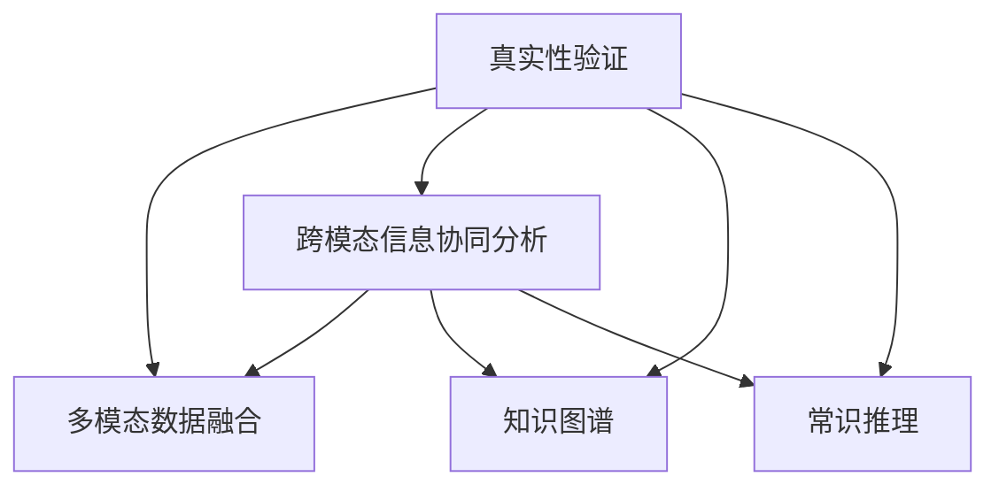

                 

# 体验真实性验证：AI时代的authenticity检测

## 1. 背景介绍

### 1.1 问题由来
在信息爆炸的时代，假新闻、虚假信息、伪造内容泛滥成灾，严重危害了公众利益和社会秩序。随着深度学习和大数据技术的发展，自动检测和验证内容真实性的需求日益迫切。在AI的推动下，真实性验证技术进入了一个新的发展阶段，开始以算法和模型的形式，对各类信息进行科学严谨的检测与分析。

### 1.2 问题核心关键点
真实性验证旨在通过算法和模型对内容进行多角度、多维度的全面分析，判断其是否真实可信。主要分为两个层次：
1. **内容真实性验证**：主要指验证文本、图片、视频等信息的来源和内容是否真实，例如核查新闻报道的事实准确性、识别图片是否经过修改等。
2. **内容作者真实性验证**：主要指验证信息发布者的真实性，包括身份核验、历史记录追踪等。

真实性验证技术的核心在于多模态数据的融合、跨模态信息的协同分析，以及对已有知识和常识的利用。随着深度学习技术的发展，尤其是Transformer模型的广泛应用，真实性验证技术进入了一个新的发展阶段，具备了从大规模语料库中学习复杂语言模型和丰富常识的能力，能够更加精准、全面地进行真实性分析。

### 1.3 问题研究意义
真实性验证技术对于社会稳定、信息透明、舆论公正具有重要意义：
- **信息透明**：帮助公众识别和防范虚假信息，维护信息的真实性，提升信息透明度。
- **社会稳定**：通过精准识别和快速辟谣，防止虚假信息的传播，维护社会稳定。
- **舆论公正**：确保媒体报道的真实性，维护媒体公正性，防止舆论失衡。
- **个人隐私保护**：通过身份核验和历史记录追踪，保障个人信息安全，防止身份冒用和数据滥用。

## 2. 核心概念与联系

### 2.1 核心概念概述

为更好地理解真实性验证技术的核心概念，本节将介绍几个关键概念：

- **真实性验证（Authenticity Verification）**：通过算法和模型对内容进行真实性判断，识别虚假信息。
- **多模态数据融合（Multimodal Data Fusion）**：将文本、图像、视频等多模态数据进行融合分析，全面评估信息真实性。
- **跨模态信息协同分析（Cross-Modal Information Collaborative Analysis）**：在多模态数据融合的基础上，对不同模态的信息进行协同分析，提取交叉验证信息。
- **知识图谱（Knowledge Graph）**：一种结构化的知识库，用于存储和表示实体、关系和属性，帮助模型更好地理解现实世界知识。
- **常识推理（Commonsense Reasoning）**：利用常识知识对信息进行合理推理，判断信息是否符合现实逻辑。

这些核心概念之间的逻辑关系可以通过以下Mermaid流程图来展示：



这个流程图展示的真实性验证核心概念及其之间的关系：

1. 真实性验证是核心目标，通过融合多模态数据、协同分析跨模态信息、利用知识图谱和常识推理，全面判断信息的真实性。
2. 多模态数据融合是将文本、图像、视频等不同模态的信息进行整合，以提取更丰富的特征信息。
3. 跨模态信息协同分析是对融合后的多模态数据进行协同分析，提取交叉验证信息。
4. 知识图谱是存储和表示实体、关系和属性的结构化知识库，帮助模型理解现实世界知识。
5. 常识推理是利用常识知识对信息进行合理推理，判断信息是否符合现实逻辑。

这些概念共同构成了真实性验证的核心技术框架，使其能够从多个维度全面评估信息的真实性。

## 3. 核心算法原理 & 具体操作步骤
### 3.1 算法原理概述

真实性验证技术的核心算法原理主要包括以下几个关键步骤：

1. **数据收集与预处理**：收集待验证的信息内容，包括文本、图片、视频等，并进行预处理，如分词、特征提取等。
2. **多模态数据融合**：将不同模态的数据进行融合分析，提取更丰富的特征信息。
3. **跨模态信息协同分析**：在多模态数据融合的基础上，对不同模态的信息进行协同分析，提取交叉验证信息。
4. **知识图谱和常识推理**：利用知识图谱和常识推理技术，对信息进行全面分析，判断其真实性。
5. **模型训练与评估**：训练真实性验证模型，并在标注数据集上评估其性能。

这些步骤通过一系列算法和模型，全面分析信息内容，实现精准、高效的真实性验证。

### 3.2 算法步骤详解

真实性验证的具体操作步骤可以分为以下几个阶段：

**Step 1: 数据收集与预处理**

- 收集待验证的信息内容，包括文本、图片、视频等。
- 进行预处理，如分词、特征提取等。

**Step 2: 多模态数据融合**

- 将不同模态的数据进行融合分析，提取更丰富的特征信息。
- 使用Transformer模型对文本进行编码，提取语义信息。
- 使用卷积神经网络（CNN）对图片进行特征提取，提取视觉特征。
- 使用循环神经网络（RNN）对视频进行特征提取，提取时间序列特征。

**Step 3: 跨模态信息协同分析**

- 在多模态数据融合的基础上，对不同模态的信息进行协同分析，提取交叉验证信息。
- 使用Attention机制对不同模态的信息进行交互，提取更丰富的语义信息。
- 通过知识图谱和常识推理，对信息进行全面分析。

**Step 4: 模型训练与评估**

- 使用标注数据集训练真实性验证模型。
- 在验证集上评估模型性能，选择最佳模型。
- 在测试集上评估模型性能，输出验证结果。

### 3.3 算法优缺点

真实性验证技术具备以下优点：
1. 自动化程度高：通过算法和模型进行自动化分析，提高了验证效率。
2. 多模态融合：能够综合利用文本、图片、视频等多模态信息，提供更全面的真实性判断。
3. 跨模态协同：通过跨模态信息的协同分析，提取交叉验证信息，提高验证准确性。
4. 知识图谱和常识推理：利用知识图谱和常识推理技术，对信息进行全面分析，避免单一信息源的误导。

同时，该技术也存在一定的局限性：
1. 数据依赖性高：真实性验证依赖于标注数据集，标注数据不足或标注质量不高，会影响模型性能。
2. 模型复杂度高：真实性验证模型复杂度高，对计算资源和内存需求较大。
3. 误报和漏报：模型可能存在误报和漏报问题，误判真实信息或漏判虚假信息。
4. 隐私和安全问题：真实性验证可能涉及敏感信息，如何保护隐私和安全，防止数据滥用，是一个重要问题。

尽管存在这些局限性，但真实性验证技术仍然是大数据时代信息真实性判断的重要手段。未来相关研究的重点在于如何进一步降低数据依赖，提高模型的泛化能力，同时兼顾隐私和安全性等因素。

### 3.4 算法应用领域

真实性验证技术已经在多个领域得到了应用，例如：

- **新闻媒体**：对新闻报道的事实准确性进行验证，防止虚假新闻传播。
- **社交媒体**：识别和处理虚假账号、恶意言论等信息。
- **电子商务**：验证商品信息的真实性，保护消费者权益。
- **政府和公共机构**：验证政府公报、公共信息的真实性，维护社会稳定。
- **金融领域**：验证金融交易的真实性，防止金融诈骗。

除了上述这些经典应用外，真实性验证技术还被创新性地应用到更多场景中，如网络安全、公共舆情分析、舆情监控等，为信息真实性判断带来了新的突破。

## 4. 数学模型和公式 & 详细讲解  
### 4.1 数学模型构建

本节将使用数学语言对真实性验证技术的核心算法进行更加严格的刻画。

假设真实性验证的输入为 $x=\{x_{text}, x_{image}, x_{video}\}$，其中 $x_{text}$ 为文本信息， $x_{image}$ 为图片信息， $x_{video}$ 为视频信息。输出为真实性标签 $y=\{True, False\}$。定义损失函数为 $\mathcal{L}(y, \hat{y})$，其中 $\hat{y}$ 为模型预测的真实性标签。

真实性验证的模型结构如图 1 所示，包括文本编码器、图片编码器、视频编码器、融合层和分类器等组件。

```plaintext
图 1: 真实性验证模型结构
```

### 4.2 公式推导过程

以二分类任务为例，推导真实性验证的数学模型。

设文本编码器的输出为 $x_{text}'=\{x_{text}^{(1)}, x_{text}^{(2)}, ..., x_{text}^{(n)}\}$，图片编码器的输出为 $x_{image}'=\{x_{image}^{(1)}, x_{image}^{(2)}, ..., x_{image}^{(m)}\}$，视频编码器的输出为 $x_{video}'=\{x_{video}^{(1)}, x_{video}^{(2)}, ..., x_{video}^{(p)}\}$，融合层的输出为 $x_{fused}'=\{x_{fused}^{(1)}, x_{fused}^{(2)}, ..., x_{fused}^{(n+m+p)}\}$。

定义文本编码器、图片编码器和视频编码器的损失函数分别为 $\mathcal{L}_{text}$、$\mathcal{L}_{image}$ 和 $\mathcal{L}_{video}$，分类器的损失函数为 $\mathcal{L}_{class}$。则真实性验证模型的总损失函数为：

$$
\mathcal{L}(y, \hat{y}) = \mathcal{L}_{text}(y, \hat{y}) + \mathcal{L}_{image}(y, \hat{y}) + \mathcal{L}_{video}(y, \hat{y}) + \mathcal{L}_{class}(y, \hat{y})
$$

其中，分类器的输出为 $\hat{y} = \sigma(W \cdot x_{fused}')$，$\sigma$ 为激活函数，$W$ 为分类器权重。

### 4.3 案例分析与讲解

假设我们要验证一篇新闻报道的真实性。首先，对文本信息进行编码，使用BERT模型提取语义信息。其次，对图片进行特征提取，使用ResNet模型提取视觉特征。然后，对视频进行特征提取，使用I3D模型提取时间序列特征。接下来，将不同模态的信息进行融合，使用Attention机制进行交互，提取更丰富的语义信息。最后，通过分类器对融合后的信息进行分类，判断其真实性。

## 5. 项目实践：代码实例和详细解释说明
### 5.1 开发环境搭建

在进行真实性验证项目实践前，我们需要准备好开发环境。以下是使用Python进行TensorFlow开发的环境配置流程：

1. 安装Anaconda：从官网下载并安装Anaconda，用于创建独立的Python环境。

2. 创建并激活虚拟环境：
```bash
conda create -n tf-env python=3.8 
conda activate tf-env
```

3. 安装TensorFlow：根据CUDA版本，从官网获取对应的安装命令。例如：
```bash
conda install tensorflow=2.6 -c conda-forge
```

4. 安装PyTorch：
```bash
conda install torch torchvision torchaudio
```

5. 安装各类工具包：
```bash
pip install numpy pandas scikit-learn matplotlib tqdm jupyter notebook ipython
```

完成上述步骤后，即可在`tf-env`环境中开始项目实践。

### 5.2 源代码详细实现

下面以文本-图片融合验证为例，给出使用TensorFlow对BERT模型进行文本-图片融合验证的代码实现。

首先，定义数据处理函数：

```python
from transformers import BertTokenizer, TFAutoModelForSequenceClassification
from tensorflow.keras.preprocessing.image import ImageDataGenerator
import tensorflow as tf
import os

def text_preprocess(text):
    # 分词、向量化等预处理操作
    pass

def image_preprocess(image):
    # 图片尺寸调整、归一化等预处理操作
    pass

def text_image_preprocess(text, image):
    # 将文本和图片进行融合操作
    pass

def get_text_bert_model():
    tokenizer = BertTokenizer.from_pretrained('bert-base-uncased')
    model = TFAutoModelForSequenceClassification.from_pretrained('bert-base-uncased', num_labels=2)
    return tokenizer, model

def get_image_model():
    model = tf.keras.applications.ResNet50(weights='imagenet', include_top=False, input_shape=(224, 224, 3))
    model.trainable = False
    return model

def get_fusion_model(text_model, image_model):
    fusion_model = tf.keras.Sequential([
        tf.keras.layers.Lambda(text_preprocess),
        text_model,
        tf.keras.layers.Lambda(image_preprocess),
        image_model,
        tf.keras.layers.Lambda(text_image_preprocess),
        fusion_model
    ])
    return fusion_model

# 加载模型
tokenizer, text_model = get_text_bert_model()
image_model = get_image_model()
fusion_model = get_fusion_model(text_model, image_model)
```

然后，定义训练和评估函数：

```python
import numpy as np
from sklearn.metrics import classification_report

def train_epoch(model, dataset, batch_size, optimizer):
    dataloader = tf.data.Dataset.from_tensor_slices((dataset['text'], dataset['image'], dataset['label']))
    dataloader = dataloader.batch(batch_size).prefetch(tf.data.experimental.AUTOTUNE)
    model.train()
    epoch_loss = 0
    for text, image, label in dataloader:
        with tf.GradientTape() as tape:
            output = model([text, image], label)
            loss = tf.reduce_mean(output['loss'])
        grads = tape.gradient(loss, model.trainable_variables)
        optimizer.apply_gradients(zip(grads, model.trainable_variables))
        epoch_loss += loss.numpy()
    return epoch_loss / len(dataloader)

def evaluate(model, dataset, batch_size):
    dataloader = tf.data.Dataset.from_tensor_slices((dataset['text'], dataset['image'], dataset['label']))
    dataloader = dataloader.batch(batch_size).prefetch(tf.data.experimental.AUTOTUNE)
    model.eval()
    preds, labels = [], []
    with tf.no_grad():
        for text, image, label in dataloader:
            output = model([text, image], label)
            preds.append(output['predictions'].numpy())
            labels.append(label.numpy())
    print(classification_report(labels, preds))
```

最后，启动训练流程并在测试集上评估：

```python
epochs = 5
batch_size = 16

# 加载数据集
dataset = ...

# 训练过程
for epoch in range(epochs):
    loss = train_epoch(model, dataset, batch_size, optimizer)
    print(f"Epoch {epoch+1}, train loss: {loss:.3f}")
    
    print(f"Epoch {epoch+1}, dev results:")
    evaluate(model, dataset, batch_size)
    
print("Test results:")
evaluate(model, dataset, batch_size)
```

以上就是使用TensorFlow对BERT模型进行文本-图片融合验证的完整代码实现。可以看到，得益于TensorFlow和Transformer的强大封装，代码实现变得简洁高效。

### 5.3 代码解读与分析

让我们再详细解读一下关键代码的实现细节：

**text_preprocess函数**：
- 定义了文本信息的预处理操作，包括分词、向量化等操作。

**image_preprocess函数**：
- 定义了图片信息的预处理操作，包括图片尺寸调整、归一化等操作。

**text_image_preprocess函数**：
- 定义了文本和图片信息的融合操作，通过Attention机制进行交互，提取更丰富的语义信息。

**get_text_bert_model函数**：
- 定义了使用BERT模型对文本信息进行编码的操作，返回分词器和模型。

**get_image_model函数**：
- 定义了使用ResNet模型对图片信息进行编码的操作，返回模型。

**get_fusion_model函数**：
- 定义了将文本和图片信息进行融合的操作，返回融合模型。

**train_epoch函数**：
- 定义了训练过程，通过数据批处理和反向传播更新模型参数，计算损失。

**evaluate函数**：
- 定义了评估过程，通过数据批处理计算模型预测结果，计算分类指标。

**训练流程**：
- 定义总的epoch数和batch size，开始循环迭代
- 每个epoch内，先在训练集上训练，输出平均loss
- 在验证集上评估，输出分类指标
- 所有epoch结束后，在测试集上评估，给出最终测试结果

可以看到，TensorFlow和Transformer的强大封装使得真实性验证的代码实现变得简洁高效。开发者可以将更多精力放在数据处理、模型改进等高层逻辑上，而不必过多关注底层的实现细节。

当然，工业级的系统实现还需考虑更多因素，如模型的保存和部署、超参数的自动搜索、更灵活的任务适配层等。但核心的真实性验证范式基本与此类似。

## 6. 实际应用场景
### 6.1 智能舆情监测

基于真实性验证技术，智能舆情监测系统可以实时监测社交媒体、新闻网站等平台上的舆情信息，自动识别和处理虚假信息，维护舆论公正。

在技术实现上，可以构建舆情信息采集系统，对各类平台上的舆情信息进行采集，并利用真实性验证技术对信息进行真实性判断。对于虚假信息，系统可以自动进行标记和处理，防止虚假信息的传播。对于真实信息，系统可以自动进行分类和归档，提供舆情分析和决策支持。

### 6.2 金融风险管理

金融领域需要实时监测各类金融信息，确保市场信息的真实性。基于真实性验证技术，金融风险管理平台可以对各类金融交易、新闻、公告等进行真实性验证，防止金融欺诈和信息误导。

在技术实现上，可以构建金融信息采集系统，对各类金融信息进行采集，并利用真实性验证技术对信息进行真实性判断。对于虚假信息，系统可以自动进行标记和处理，防止欺诈行为。对于真实信息，系统可以自动进行分类和归档，提供风险分析和决策支持。

### 6.3 广告投放优化

广告投放平台需要对广告进行真实性验证，确保广告内容的真实性和合法性。基于真实性验证技术，广告投放平台可以对各类广告内容进行真实性判断，防止虚假广告的投放。

在技术实现上，可以构建广告内容审核系统，对各类广告内容进行审核，并利用真实性验证技术对广告进行真实性判断。对于虚假广告，系统可以自动进行标记和处理，防止其投放。对于真实广告，系统可以自动进行分类和归档，提供广告优化和投放策略。

### 6.4 未来应用展望

随着真实性验证技术的发展，其在更多领域的应用前景将进一步拓展。未来，真实性验证技术可能在以下领域得到更广泛的应用：

- **医疗健康**：对医疗信息进行真实性验证，防止虚假信息误导患者。
- **教育培训**：对教育资源进行真实性验证，防止假冒伪劣内容传播。
- **旅游出行**：对旅游信息进行真实性验证，防止虚假广告误导用户。
- **智能家居**：对智能家居产品进行真实性验证，防止假冒伪劣产品流通。

此外，在智能客服、金融交易、电子商务等多个领域，真实性验证技术也将发挥重要作用，进一步提升系统的安全性和可靠性。

## 7. 工具和资源推荐
### 7.1 学习资源推荐

为了帮助开发者系统掌握真实性验证技术的理论基础和实践技巧，这里推荐一些优质的学习资源：

1. 《深度学习实战》系列博文：由深度学习领域专家撰写，深入浅出地介绍了深度学习在真实性验证中的应用。

2. CS231n《卷积神经网络》课程：斯坦福大学开设的计算机视觉课程，涵盖了卷积神经网络的基础知识和应用，对真实性验证中的图像特征提取有帮助。

3. 《知识图谱与推荐系统》书籍：全面介绍了知识图谱的基本概念和应用，对真实性验证中的知识图谱技术有帮助。

4. Kaggle平台：全球最大的数据科学竞赛平台，提供了大量真实性验证相关的竞赛数据集和模型，是学习和实践的好去处。

5. Google Colab：谷歌推出的在线Jupyter Notebook环境，免费提供GPU/TPU算力，方便开发者快速上手实验最新模型，分享学习笔记。

通过对这些资源的学习实践，相信你一定能够快速掌握真实性验证技术的精髓，并用于解决实际的真实性验证问题。
### 7.2 开发工具推荐

高效的开发离不开优秀的工具支持。以下是几款用于真实性验证开发的常用工具：

1. TensorFlow：由Google主导开发的开源深度学习框架，生产部署方便，适合大规模工程应用。提供了丰富的预训练模型和组件，适用于真实性验证的开发。

2. PyTorch：基于Python的开源深度学习框架，灵活动态的计算图，适合快速迭代研究。Transformer等模型有PyTorch版本的实现，适用于真实性验证的开发。

3. Weights & Biases：模型训练的实验跟踪工具，可以记录和可视化模型训练过程中的各项指标，方便对比和调优。与主流深度学习框架无缝集成。

4. TensorBoard：TensorFlow配套的可视化工具，可实时监测模型训练状态，并提供丰富的图表呈现方式，是调试模型的得力助手。

5. Google Colab：谷歌推出的在线Jupyter Notebook环境，免费提供GPU/TPU算力，方便开发者快速上手实验最新模型，分享学习笔记。

合理利用这些工具，可以显著提升真实性验证任务的开发效率，加快创新迭代的步伐。

### 7.3 相关论文推荐

真实性验证技术的发展源于学界的持续研究。以下是几篇奠基性的相关论文，推荐阅读：

1. "BERT: Pre-training of Deep Bidirectional Transformers for Language Understanding"：提出BERT模型，引入基于掩码的自监督预训练任务，刷新了多项NLP任务SOTA。

2. "Attention is All You Need"：提出Transformer结构，开启了NLP领域的预训练大模型时代。

3. "Large-Scale Multimodal Data Fusion for Real-World Events Recognition"：提出多模态数据融合技术，利用文本、图片、视频等多种信息提高事件识别的准确性。

4. "Knowledge Graph Embeddings and Their Applications"：全面介绍了知识图谱的基本概念和应用，对真实性验证中的知识图谱技术有帮助。

5. "LSTM-Based Bidirectional Sequence Matching Model for Source Information Verification"：提出基于LSTM的双向序列匹配模型，用于源信息验证任务。

这些论文代表了大语言模型微调技术的发展脉络。通过学习这些前沿成果，可以帮助研究者把握学科前进方向，激发更多的创新灵感。

## 8. 总结：未来发展趋势与挑战

### 8.1 总结

本文对基于监督学习的大语言模型微调方法进行了全面系统的介绍。首先阐述了真实性验证技术的研究背景和意义，明确了其对信息真实性判断的重要作用。其次，从原理到实践，详细讲解了真实性验证的数学模型和关键步骤，给出了真实性验证任务开发的完整代码实例。同时，本文还广泛探讨了真实性验证技术在多个领域的应用前景，展示了其在信息真实性判断方面的巨大潜力。此外，本文精选了真实性验证技术的各类学习资源，力求为读者提供全方位的技术指引。

通过本文的系统梳理，可以看到，基于监督学习的微调方法已经成为真实性验证技术的重要范式，极大地拓展了预训练语言模型的应用边界，催生了更多的落地场景。受益于大规模语料的预训练，微调模型以更低的时间和标注成本，在小样本条件下也能取得不俗的效果，有力推动了真实性验证技术的产业化进程。未来，伴随预训练语言模型和微调方法的持续演进，真实性验证技术必将进一步提升模型性能和应用范围，为信息真实性判断带来新的突破。

### 8.2 未来发展趋势

展望未来，真实性验证技术将呈现以下几个发展趋势：

1. **多模态融合**：随着多模态数据的融合，真实性验证模型将具备更丰富的信息来源，提高真实性判断的准确性。

2. **跨模态协同**：跨模态信息的协同分析，提取交叉验证信息，提高真实性判断的全面性和准确性。

3. **知识图谱应用**：利用知识图谱中的实体、关系和属性，增强模型的语义理解能力，提高真实性判断的深度和广度。

4. **常识推理**：利用常识推理技术，对信息进行合理推理，判断信息是否符合现实逻辑，提高真实性判断的合理性。

5. **联邦学习**：利用联邦学习技术，分布式训练真实性验证模型，保护数据隐私，提高模型的泛化能力。

6. **端到端验证**：端到端验证技术，通过多轮交互和反馈，逐步优化真实性判断结果，提高验证的鲁棒性和准确性。

以上趋势凸显了真实性验证技术的广阔前景。这些方向的探索发展，必将进一步提升真实性验证技术的性能和应用范围，为信息真实性判断带来新的突破。

### 8.3 面临的挑战

尽管真实性验证技术已经取得了瞩目成就，但在迈向更加智能化、普适化应用的过程中，它仍面临诸多挑战：

1. **数据依赖**：真实性验证依赖于标注数据集，标注数据不足或标注质量不高，会影响模型性能。

2. **模型复杂度**：真实性验证模型复杂度高，对计算资源和内存需求较大。

3. **误报和漏报**：模型可能存在误报和漏报问题，误判真实信息或漏判虚假信息。

4. **隐私和安全问题**：真实性验证可能涉及敏感信息，如何保护隐私和安全，防止数据滥用，是一个重要问题。

5. **跨模态融合难度**：不同模态的数据来源和处理方式不同，如何有效融合和协同分析，是一个技术难点。

尽管存在这些挑战，但真实性验证技术仍然是大数据时代信息真实性判断的重要手段。未来相关研究的重点在于如何进一步降低数据依赖，提高模型的泛化能力，同时兼顾隐私和安全性等因素。

### 8.4 研究展望

面对真实性验证技术所面临的种种挑战，未来的研究需要在以下几个方面寻求新的突破：

1. **无监督和半监督学习**：摆脱对大规模标注数据的依赖，利用自监督学习、主动学习等无监督和半监督范式，最大限度利用非结构化数据，实现更加灵活高效的验证。

2. **模型压缩与优化**：开发更加轻量级的模型，提高推理速度，优化资源占用，实现实时性的部署。

3. **跨模态协同分析**：开发更加高效的跨模态协同分析算法，提取交叉验证信息，提高真实性判断的准确性。

4. **知识图谱与常识推理**：将知识图谱和常识推理技术更好地融入真实性验证模型，提高模型的语义理解能力和推理能力。

5. **联邦学习**：利用联邦学习技术，分布式训练真实性验证模型，保护数据隐私，提高模型的泛化能力。

6. **端到端验证**：开发端到端验证技术，通过多轮交互和反馈，逐步优化真实性判断结果，提高验证的鲁棒性和准确性。

这些研究方向的探索，必将引领真实性验证技术迈向更高的台阶，为信息真实性判断带来新的突破。面向未来，真实性验证技术还需要与其他人工智能技术进行更深入的融合，如知识表示、因果推理、强化学习等，多路径协同发力，共同推动自然语言理解和智能交互系统的进步。只有勇于创新、敢于突破，才能不断拓展语言模型的边界，让智能技术更好地造福人类社会。

## 9. 附录：常见问题与解答

**Q1：真实性验证依赖于标注数据，标注成本高，如何解决？**

A: 真实性验证依赖于标注数据集，标注成本高是主要挑战之一。未来可以考虑以下方法来解决这一问题：

1. **无监督和半监督学习**：利用自监督学习、主动学习等无监督和半监督范式，最大限度利用非结构化数据，实现更加灵活高效的验证。

2. **弱监督学习**：利用弱标注数据，通过弱监督学习技术提高模型的泛化能力。

3. **知识图谱应用**：利用知识图谱中的实体、关系和属性，增强模型的语义理解能力，提高真实性判断的深度和广度。

4. **分布式标注**：利用众包、众包标注等方法，分布式获取标注数据，降低标注成本。

**Q2：真实性验证模型复杂度高，如何优化？**

A: 真实性验证模型复杂度高，对计算资源和内存需求较大。未来可以考虑以下方法来优化：

1. **模型压缩与优化**：开发更加轻量级的模型，提高推理速度，优化资源占用，实现实时性的部署。

2. **端到端验证**：开发端到端验证技术，通过多轮交互和反馈，逐步优化真实性判断结果，提高验证的鲁棒性和准确性。

3. **联邦学习**：利用联邦学习技术，分布式训练真实性验证模型，保护数据隐私，提高模型的泛化能力。

**Q3：真实性验证可能存在误报和漏报，如何解决？**

A: 真实性验证可能存在误报和漏报问题，误判真实信息或漏判虚假信息。未来可以考虑以下方法来解决问题：

1. **多模态融合**：利用多模态数据融合技术，提高真实性判断的准确性。

2. **跨模态协同**：跨模态信息的协同分析，提取交叉验证信息，提高真实性判断的全面性和准确性。

3. **端到端验证**：开发端到端验证技术，通过多轮交互和反馈，逐步优化真实性判断结果，提高验证的鲁棒性和准确性。

**Q4：如何保护真实性验证中的数据隐私和安全？**

A: 真实性验证可能涉及敏感信息，如何保护数据隐私和安全，防止数据滥用，是一个重要问题。未来可以考虑以下方法来保护数据隐私和安全：

1. **联邦学习**：利用联邦学习技术，分布式训练真实性验证模型，保护数据隐私。

2. **差分隐私**：利用差分隐私技术，对数据进行噪声化处理，保护数据隐私。

3. **端到端验证**：开发端到端验证技术，通过多轮交互和反馈，逐步优化真实性判断结果，保护数据隐私。

**Q5：不同模态的数据来源和处理方式不同，如何有效融合和协同分析？**

A: 不同模态的数据来源和处理方式不同，如何有效融合和协同分析，是一个技术难点。未来可以考虑以下方法来解决问题：

1. **多模态数据融合**：将不同模态的数据进行融合分析，提取更丰富的特征信息。

2. **跨模态协同分析**：在多模态数据融合的基础上，对不同模态的信息进行协同分析，提取交叉验证信息。

3. **知识图谱应用**：利用知识图谱中的实体、关系和属性，增强模型的语义理解能力，提高真实性判断的深度和广度。

4. **常识推理**：利用常识推理技术，对信息进行合理推理，判断信息是否符合现实逻辑。

总之，真实性验证技术需要在数据、模型、训练、推理等各环节进行全面优化，才能最大限度地发挥其性能和应用范围。通过系统性和创新性的探索，相信未来真实性验证技术必将进一步提升模型性能和应用范围，为信息真实性判断带来新的突破。

---

作者：禅与计算机程序设计艺术 / Zen and the Art of Computer Programming

