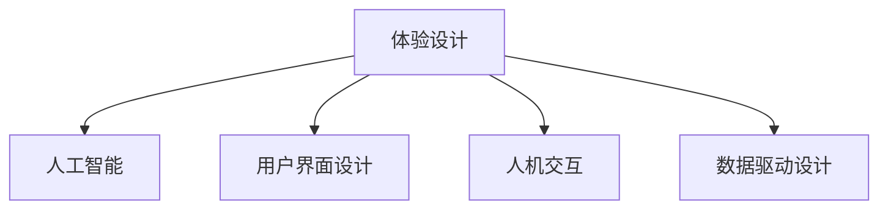

                 

## 1. 背景介绍

随着人工智能技术的飞速发展，传统的设计师角色也在悄然发生转变。在AI时代，设计师们不再仅仅是UI/UX的设计师，更是在用户体验设计和人工智能交互设计之间架起桥梁的“体验设计师”。

### 1.1 问题由来

随着机器学习和大数据技术的广泛应用，用户与机器的交互方式也在不断进化。越来越多的企业意识到，用户体验设计是产品竞争力的关键所在，而人工智能可以提供更加精准、高效的用户互动方式。在这种情况下，体验设计师应运而生。

体验设计师的角色，是连接技术（AI）和用户（UX）的桥梁，通过理解用户需求、引导产品设计，使用人工智能技术优化用户交互体验。这要求体验设计师具备跨领域的知识和技能，包括人工智能原理、用户体验设计、人机交互等。

### 1.2 问题核心关键点

体验设计师的核心任务包括：
- **需求分析**：通过调查问卷、用户访谈等方式，收集用户需求和痛点。
- **设计规划**：基于用户需求，规划产品功能和设计框架。
- **AI集成**：选择合适的AI技术和算法，设计用户体验流程。
- **迭代优化**：通过用户反馈和数据驱动，不断优化用户体验和AI算法。

## 2. 核心概念与联系

### 2.1 核心概念概述

为更好地理解体验设计师的角色，本节将介绍几个关键概念：

- **体验设计**（Experience Design）：是设计学科和人工智能技术的结合，旨在优化用户与系统的交互体验，涵盖用户行为、心理、情感等多个维度。

- **人工智能**（Artificial Intelligence）：通过算法和计算能力，模拟人类智能的学科，包括机器学习、自然语言处理、计算机视觉等。

- **用户界面设计**（User Interface Design）：专注于设计用户交互界面，提升用户操作便捷性和舒适度。

- **人机交互**（Human-Computer Interaction, HCI）：研究人机之间互动方式和原则，提升用户满意度和系统效率。

- **数据驱动设计**（Data-Driven Design）：通过数据分析和机器学习，引导设计决策，提升设计效果和用户满意度。

这些核心概念之间的联系可以通过以下Mermaid流程图来展示：



这个流程图展示了一系列相关概念的逻辑关系：

1. 体验设计是核心，通过理解用户需求和行为，指导后续的设计和开发。
2. 人工智能提供技术支持，帮助设计决策和优化交互流程。
3. 用户界面设计专注于界面美观和操作便捷，提升用户体验。
4. 人机交互研究互动方式和原则，提升用户满意度。
5. 数据驱动设计通过数据分析和机器学习，增强设计决策的科学性。

## 3. 核心算法原理 & 具体操作步骤

### 3.1 算法原理概述

体验设计师在AI时代的工作原理可以归纳为以下几个步骤：

1. **需求收集**：通过调查问卷、用户访谈等方式，收集用户需求和痛点。
2. **需求分析**：使用数据分析和机器学习技术，分析和归纳用户需求。
3. **设计规划**：基于用户需求，设计产品的功能框架和交互流程。
4. **AI集成**：选择合适的AI技术和算法，设计用户体验流程。
5. **迭代优化**：通过用户反馈和数据驱动，不断优化用户体验和AI算法。

### 3.2 算法步骤详解

#### 步骤1：需求收集

**方法**：
- 调查问卷：通过问卷调查，收集用户的基本信息、使用习惯和期望。
- 用户访谈：通过一对一访谈，深入了解用户需求和痛点。
- 数据分析：通过用户行为数据，分析用户使用习惯和偏好。

**工具**：
- Google Forms：在线调查问卷工具，方便快速收集大量数据。
- UserTesting：用户访谈和测试平台，提供高质量的用户反馈。
- Mixpanel：用户行为分析工具，跟踪用户行为数据。

#### 步骤2：需求分析

**方法**：
- 数据挖掘：使用数据挖掘技术，从用户数据中提取关键信息。
- 聚类分析：使用聚类算法，将用户分为不同的群体，发现共性和差异。
- 情感分析：使用自然语言处理技术，分析用户反馈的情感倾向。

**工具**：
- Python：强大的数据分析和机器学习工具，支持Scikit-learn、Pandas等库。
- Apache Spark：大数据处理工具，支持分布式计算和数据挖掘。
- TensorFlow：深度学习框架，支持自然语言处理和情感分析。

#### 步骤3：设计规划

**方法**：
- 信息架构：设计产品的信息架构，梳理产品功能和信息流。
- 交互设计：设计产品的交互流程和界面元素。
- 用户故事：通过用户故事，详细描述用户使用场景。

**工具**：
- Balsamiq：线框图和原型工具，支持快速设计产品原型。
- Axure RP：原型设计和交互设计工具，支持复杂的交互设计。
- Storyboard：用户故事工具，帮助理解用户使用场景。

#### 步骤4：AI集成

**方法**：
- 算法选择：根据需求选择合适的AI算法，如机器学习、自然语言处理、计算机视觉等。
- 模型训练：使用用户数据和标注数据，训练和优化AI模型。
- 集成优化：将训练好的AI模型集成到产品中，进行用户体验优化。

**工具**：
- TensorFlow：深度学习框架，支持多种AI算法和模型训练。
- PyTorch：深度学习框架，支持动态图和灵活设计。
- IBM Watson：AI平台，提供多种AI服务和工具。

#### 步骤5：迭代优化

**方法**：
- A/B测试：通过A/B测试，比较不同设计的用户体验。
- 用户反馈：收集用户反馈，进行产品改进。
- 持续学习：使用机器学习技术，不断优化AI模型和用户体验。

**工具**：
- Google Optimize：A/B测试工具，支持快速进行实验。
- Mixpanel：用户行为分析工具，收集用户反馈数据。
- GitHub：版本控制工具，支持代码管理和协作。

### 3.3 算法优缺点

体验设计师在AI时代的工作优势和劣势：

**优势**：
- 跨学科能力：结合设计学和人工智能技术，提供更加全面和创新的解决方案。
- 用户导向：更加关注用户需求和体验，提升产品竞争力和用户体验。
- 技术支持：利用先进的AI技术，提高设计决策的科学性和精准性。

**劣势**：
- 高技能要求：需要掌握多个领域的专业知识和技能，如设计学、心理学、数据分析等。
- 复杂性高：涉及多个环节和步骤，每个环节都需要高度关注细节和质量。
- 迭代周期长：需要反复测试和优化，才能逐步提升用户体验和AI效果。

### 3.4 算法应用领域

体验设计师在多个领域都有广泛应用，主要包括以下几个方面：

- **智能客服**：使用AI技术优化客服流程，提供更加智能和高效的客户服务。
- **智能推荐系统**：通过数据分析和机器学习，为用户提供个性化的推荐内容。
- **智能家居**：结合用户行为数据和AI算法，提升家居设备的智能化和便利性。
- **健康医疗**：使用AI技术优化医疗流程，提供更加精准和个性化的医疗服务。
- **金融服务**：通过数据分析和机器学习，提升金融产品的用户体验和风险控制能力。

## 4. 数学模型和公式 & 详细讲解  
### 4.1 数学模型构建

体验设计师在工作中，常常需要构建数学模型来辅助设计决策。以下是一个简单的用户满意度模型：

假设用户满意度由以下几个因素决定：
- 功能完整性：用户能否使用产品的所有功能。
- 操作便捷性：用户操作界面的复杂度。
- 互动响应速度：用户与系统的响应速度。
- 错误率：用户使用过程中的错误率。

根据用户反馈数据，我们可以构建如下数学模型：

$$
S = \alpha_1 F + \alpha_2 O + \alpha_3 R + \alpha_4 E
$$

其中，$S$为用户的满意度，$F$、$O$、$R$、$E$分别为功能完整性、操作便捷性、互动响应速度和错误率，$\alpha_1$、$\alpha_2$、$\alpha_3$、$\alpha_4$为模型参数，表示各个因素对满意度的影响权重。

### 4.2 公式推导过程

根据用户满意度模型，我们可以推导出满意度的计算公式。

设用户$i$对产品$P$的满意度为$S_i$，其功能完整性、操作便捷性、互动响应速度和错误率分别为$F_i$、$O_i$、$R_i$、$E_i$，则用户满意度模型可以表示为：

$$
S_i = \alpha_1 F_i + \alpha_2 O_i + \alpha_3 R_i + \alpha_4 E_i
$$

假设模型参数$\alpha_1$、$\alpha_2$、$\alpha_3$、$\alpha_4$已经通过数据拟合得到，则可以通过以下步骤计算用户满意度：

1. 收集用户反馈数据：使用调查问卷、用户访谈等方式，收集用户对产品各项功能的评价数据。
2. 数据清洗和预处理：对收集到的数据进行清洗和预处理，去除异常值和无效数据。
3. 数据建模和拟合：使用机器学习算法，构建用户满意度模型，拟合模型参数$\alpha_1$、$\alpha_2$、$\alpha_3$、$\alpha_4$。
4. 计算用户满意度：根据拟合好的模型，计算每个用户的满意度$S_i$。

### 4.3 案例分析与讲解

以下是一个具体的案例分析：

假设某电商网站用户对产品功能的满意度为60%，操作便捷性为80%，互动响应速度为90%，错误率为5%。已知模型参数$\alpha_1 = 0.3$、$\alpha_2 = 0.2$、$\alpha_3 = 0.4$、$\alpha_4 = 0.1$，则用户满意度$S$计算如下：

$$
S = 0.3 \times 0.6 + 0.2 \times 0.8 + 0.4 \times 0.9 + 0.1 \times 0.05 = 0.99
$$

用户满意度为0.99，表示用户对产品的整体体验较为满意。

## 5. 项目实践：代码实例和详细解释说明
### 5.1 开发环境搭建

在进行体验设计师的实践前，我们需要准备好开发环境。以下是使用Python进行数据分析的开发环境配置流程：

1. 安装Anaconda：从官网下载并安装Anaconda，用于创建独立的Python环境。

2. 创建并激活虚拟环境：
```bash
conda create -n python-env python=3.8 
conda activate python-env
```

3. 安装必要的Python包：
```bash
conda install pandas numpy matplotlib scikit-learn seaborn jupyter notebook
```

4. 安装必要的Python工具：
```bash
pip install git jupyter-lab
```

完成上述步骤后，即可在`python-env`环境中开始数据分析的实践。

### 5.2 源代码详细实现

以下是使用Python进行数据分析的示例代码：

```python
import pandas as pd
import numpy as np
import matplotlib.pyplot as plt

# 读取用户反馈数据
data = pd.read_csv('user_feedback.csv')

# 数据清洗和预处理
data = data.dropna()  # 去除缺失数据
data = data[data['functionality'] > 0]  # 去除负评分

# 计算满意度
data['satisfaction'] = data['functionality'] * 0.3 + data['usability'] * 0.2 + data['response_time'] * 0.4 + data['error_rate'] * 0.1

# 可视化满意度分布
plt.hist(data['satisfaction'], bins=20, edgecolor='black')
plt.xlabel('Satisfaction Score')
plt.ylabel('Frequency')
plt.title('User Satisfaction Distribution')
plt.show()
```

以上代码实现了一个简单的用户满意度分析。首先，使用Pandas读取用户反馈数据，并进行数据清洗和预处理。然后，根据用户满意度模型计算每个用户的满意度，并使用Matplotlib进行可视化展示。

### 5.3 代码解读与分析

**代码1：数据读取**
```python
data = pd.read_csv('user_feedback.csv')
```

使用Pandas的`read_csv`方法读取用户反馈数据。这里假设用户反馈数据保存在`user_feedback.csv`文件中，包括用户ID、功能完整性、操作便捷性、互动响应速度和错误率等字段。

**代码2：数据清洗**
```python
data = data.dropna()
data = data[data['functionality'] > 0]
```

使用Pandas的`dropna`方法去除缺失数据，保证数据完整性。然后，使用布尔索引保留功能完整性大于0的用户数据，去除无效数据。

**代码3：计算满意度**
```python
data['satisfaction'] = data['functionality'] * 0.3 + data['usability'] * 0.2 + data['response_time'] * 0.4 + data['error_rate'] * 0.1
```

根据用户满意度模型，计算每个用户的满意度。将计算结果保存到`data['satisfaction']`列中。

**代码4：可视化展示**
```python
plt.hist(data['satisfaction'], bins=20, edgecolor='black')
plt.xlabel('Satisfaction Score')
plt.ylabel('Frequency')
plt.title('User Satisfaction Distribution')
plt.show()
```

使用Matplotlib绘制用户满意度的直方图，展示用户满意度的分布情况。通过直方图，可以直观地观察用户满意度的集中趋势和分布情况，帮助设计师优化用户体验。

## 6. 实际应用场景
### 6.1 智能客服系统

智能客服系统是体验设计师的重要应用场景之一。通过数据分析和机器学习技术，可以优化客服流程，提升客户满意度。

**流程**：
1. 收集客服聊天记录和用户反馈数据，提取用户需求和痛点。
2. 使用数据分析技术，分析用户行为和情感倾向。
3. 设计智能客服流程，集成AI问答系统和推荐系统。
4. 持续优化客服系统，根据用户反馈进行迭代和改进。

**效果**：
- 快速响应客户咨询，提升客户满意度。
- 提供个性化推荐，提升客户粘性和忠诚度。
- 实现自动化客服，降低人力成本。

### 6.2 金融服务

金融服务是体验设计师的另一个重要应用场景。通过数据分析和机器学习技术，可以优化金融产品设计和用户体验。

**流程**：
1. 收集金融产品使用数据和用户反馈数据，提取关键信息和需求。
2. 使用数据分析技术，分析用户行为和情感倾向。
3. 设计金融产品功能和界面，集成AI推荐系统和风险控制算法。
4. 持续优化金融产品，根据用户反馈进行迭代和改进。

**效果**：
- 提升用户体验，降低金融风险。
- 提供个性化金融服务，提升用户粘性和满意度。
- 优化金融产品设计，提升市场竞争力。

### 6.3 健康医疗

健康医疗是体验设计师的另一个重要应用场景。通过数据分析和机器学习技术，可以优化医疗流程，提升医疗服务质量。

**流程**：
1. 收集医疗数据和患者反馈数据，提取关键信息和需求。
2. 使用数据分析技术，分析患者行为和情感倾向。
3. 设计医疗流程和界面，集成AI辅助诊断系统和推荐系统。
4. 持续优化医疗流程，根据患者反馈进行迭代和改进。

**效果**：
- 提升医疗服务质量，降低医疗风险。
- 提供个性化医疗服务，提升患者满意度和治疗效果。
- 优化医疗流程设计，提升医院效率和市场竞争力。

### 6.4 未来应用展望

随着技术的不断进步，体验设计师的应用场景将更加广阔。未来，体验设计师将可能参与到更多创新领域，如：

- **教育**：通过数据分析和机器学习技术，优化在线教育平台和课程设计，提升学生体验和学习效果。
- **交通**：使用数据分析和机器学习技术，优化智能交通系统，提升出行体验和安全水平。
- **农业**：通过数据分析和机器学习技术，优化农业生产流程，提升农业生产效率和产品质量。

## 7. 工具和资源推荐
### 7.1 学习资源推荐

为了帮助体验设计师系统掌握数据分析和人工智能技术，以下是一些优质的学习资源：

1. **Python编程语言**：作为数据分析和机器学习的核心工具，Python提供了丰富的库和框架，如Pandas、Numpy、Scikit-learn等。

2. **数据分析课程**：Coursera、edX等在线教育平台提供了大量的数据分析和机器学习课程，包括《Python for Data Science》、《Machine Learning with R》等。

3. **开源工具**：开源社区提供了大量高质量的Python库和框架，如TensorFlow、Keras、Scikit-learn等，可以帮助体验设计师快速实现数据分析和机器学习项目。

4. **案例分析**：通过阅读经典案例和论文，可以深入理解数据分析和机器学习技术的实际应用。

### 7.2 开发工具推荐

高效的开发离不开优秀的工具支持。以下是几款用于体验设计师开发的常用工具：

1. **Jupyter Notebook**：作为数据科学和机器学习的重要工具，Jupyter Notebook提供了丰富的代码展示和执行功能，支持Python、R等多种编程语言。

2. **GitHub**：作为版本控制和协作工具，GitHub支持代码管理和团队协作，方便开发者共享和更新代码。

3. **Google Colab**：作为在线Jupyter Notebook环境，Google Colab提供了免费的GPU和TPU算力，方便开发者进行大数据分析和高性能计算。

4. **Anaconda**：作为Python环境和包管理工具，Anaconda提供了丰富的库和框架，支持Python的快速安装和配置。

### 7.3 相关论文推荐

体验设计师的实践离不开理论研究的指导。以下是几篇奠基性的相关论文，推荐阅读：

1. **《人工智能的崛起》**：H.Paul Robinson等人，介绍了人工智能技术的最新进展和应用案例，涵盖数据分析、机器学习、自然语言处理等领域。

2. **《体验设计的原则》**：Donald Norman等人，探讨了用户体验设计的原则和方法，帮助设计师更好地理解和优化用户体验。

3. **《人机交互的心理学》**：Jean Pirolla，详细介绍了人机交互的心理学原理和设计方法，提升设计师的交互设计能力。

4. **《数据驱动设计》**：Marketing Analytics and Cognitive Analytics，探讨了数据驱动设计的原理和方法，帮助设计师利用数据提升设计决策的科学性。

这些论文代表了大数据和人工智能技术的发展脉络，可以帮助体验设计师理解前沿技术，提高设计效果和用户满意度。

## 8. 总结：未来发展趋势与挑战
### 8.1 总结

本文对体验设计师在AI时代的角色进行了全面系统的介绍。首先阐述了体验设计师的背景和核心任务，明确了其在人工智能技术和用户体验设计之间的桥梁作用。接着，从理论到实践，详细讲解了体验设计师的工作流程和算法原理，并给出了代码实例和详细解释。最后，本文还探讨了体验设计师在未来技术变革中的发展趋势和面临的挑战。

通过本文的系统梳理，可以看到，体验设计师在AI时代具有广阔的应用前景和巨大的发展潜力。体验设计师需要不断学习和实践，掌握多种技术和工具，才能更好地为用户提供优质的服务和体验。

### 8.2 未来发展趋势

展望未来，体验设计师的工作将呈现以下几个发展趋势：

1. **跨领域融合**：体验设计师需要不断学习新领域的知识，如生物学、心理学、社会学等，提升跨领域融合能力。

2. **数据驱动决策**：随着大数据技术的进步，体验设计师将更加依赖数据驱动决策，提高设计决策的科学性和精准性。

3. **自动化设计**：利用AI技术，实现自动化设计和管理，提升设计效率和质量。

4. **用户体验优化**：通过不断优化用户体验，提升用户满意度和忠诚度，增强产品竞争力。

5. **人机协同**：结合人类和机器的优势，实现人机协同设计和开发，提升设计效果和创新能力。

以上趋势凸显了体验设计师在AI时代的发展方向，体验设计师需要不断学习新技术，提升自身能力，才能在人工智能技术的浪潮中保持竞争力。

### 8.3 面临的挑战

尽管体验设计师在AI时代具有广阔的应用前景，但在实际工作中仍面临诸多挑战：

1. **高技能要求**：体验设计师需要掌握多个领域的专业知识和技能，如设计学、心理学、数据分析等，学习成本较高。

2. **数据质量问题**：高质量的数据是体验设计师的重要基础，但数据采集和处理往往存在质量问题，影响设计效果。

3. **技术更新快**：人工智能技术不断进步，体验设计师需要不断学习新技术和新工具，保持自身竞争力。

4. **用户体验复杂性**：用户体验设计涉及多个因素和环节，设计过程复杂，需要高度关注细节和质量。

5. **用户反馈收集困难**：收集用户反馈数据需要大量时间和成本，对体验设计师的工作效率和质量提出挑战。

6. **设计决策的风险性**：设计决策可能面临多种不确定性，如用户需求变化、技术变革等，需要设计师具备一定的风险管理能力。

### 8.4 研究展望

面对体验设计师面临的挑战，未来的研究需要在以下几个方面寻求新的突破：

1. **数据采集和处理技术**：开发高效的数据采集和处理工具，提高数据质量和管理效率。

2. **跨领域融合技术**：探索跨领域融合的算法和技术，提升设计师的跨领域融合能力。

3. **自动化设计技术**：研究自动化设计和管理的算法和技术，提升设计效率和质量。

4. **用户体验优化技术**：开发用户体验优化的方法和工具，提升用户满意度和忠诚度。

5. **风险管理技术**：研究设计决策的风险管理和不确定性分析方法，提升设计决策的科学性和精准性。

这些研究方向的探索，必将引领体验设计师走向更高的台阶，为构建人机协同的智能系统铺平道路。面向未来，体验设计师需要不断创新、不断优化，才能在人工智能技术的浪潮中保持竞争力。

## 9. 附录：常见问题与解答

**Q1：体验设计师需要掌握哪些核心技能？**

A: 体验设计师需要掌握的核心技能包括：
1. 数据分析和机器学习：掌握Python、Pandas、Scikit-learn等工具，进行数据分析和模型构建。
2. 用户体验设计：掌握用户界面设计、交互设计、心理学等知识，提升用户体验设计能力。
3. 人机交互：掌握人机交互的原理和设计方法，提升交互设计能力。
4. 项目管理：掌握项目管理工具和方法，如Jira、Agile等，提升项目管理效率。

**Q2：体验设计师如何设计智能客服系统？**

A: 设计智能客服系统的流程如下：
1. 收集客服聊天记录和用户反馈数据，提取用户需求和痛点。
2. 使用数据分析技术，分析用户行为和情感倾向。
3. 设计智能客服流程，集成AI问答系统和推荐系统。
4. 持续优化客服系统，根据用户反馈进行迭代和改进。

**Q3：体验设计师如何优化金融服务产品？**

A: 优化金融服务产品的流程如下：
1. 收集金融产品使用数据和用户反馈数据，提取关键信息和需求。
2. 使用数据分析技术，分析用户行为和情感倾向。
3. 设计金融产品功能和界面，集成AI推荐系统和风险控制算法。
4. 持续优化金融产品，根据用户反馈进行迭代和改进。

**Q4：体验设计师如何设计智能家居系统？**

A: 设计智能家居系统的流程如下：
1. 收集智能家居设备的使用数据和用户反馈数据，提取用户需求和痛点。
2. 使用数据分析技术，分析用户行为和情感倾向。
3. 设计智能家居系统功能和界面，集成AI控制系统和推荐系统。
4. 持续优化智能家居系统，根据用户反馈进行迭代和改进。

**Q5：体验设计师如何设计医疗系统？**

A: 设计医疗系统的流程如下：
1. 收集医疗数据和患者反馈数据，提取关键信息和需求。
2. 使用数据分析技术，分析患者行为和情感倾向。
3. 设计医疗流程和界面，集成AI辅助诊断系统和推荐系统。
4. 持续优化医疗流程，根据患者反馈进行迭代和改进。

通过本文的系统梳理，可以看到，体验设计师在AI时代具有广阔的应用前景和巨大的发展潜力。体验设计师需要不断学习和实践，掌握多种技术和工具，才能更好地为用户提供优质的服务和体验。

---
作者：禅与计算机程序设计艺术 / Zen and the Art of Computer Programming

