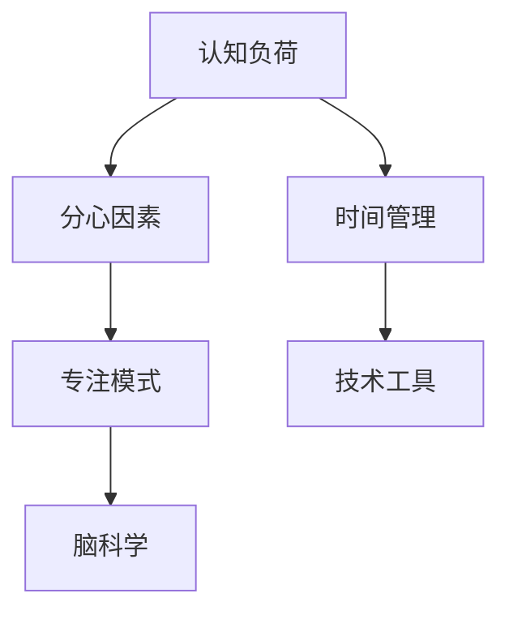

                 

# 信息时代的注意力管理实践与指南：在干扰和分心中保持头脑清晰

> 关键词：信息时代,注意力管理,干扰,分心,脑科学,心理认知,技术工具,实践指南

## 1. 背景介绍

### 1.1 问题由来

在信息化迅猛发展的今天，人们面临着前所未有的信息泛滥问题。大量的信息流、社交媒体、即时通讯工具等极大地改变了我们的生活和工作方式，同时也对我们的注意力管理带来了巨大的挑战。

在过去的几十年里，我们逐渐习惯于频繁地切换任务，多任务并行处理成为了一种常态。这虽然提高了生产效率，但同时也使得我们的大脑在不断适应分心和干扰的环境中，导致注意力的分散和认知能力下降。

特别是在线上办公和远程工作成为新常态的背景下，集中注意力、提升工作效率、管理好时间的压力越来越大。因此，如何在信息时代有效管理注意力，成为了一个亟需探讨的课题。

### 1.2 问题核心关键点

注意力的管理涉及到认知心理学、神经科学、信息科学和工程实践等多个领域，其核心关键点在于：

- **认知负荷**：信息过载导致认知负荷加重，使我们的大脑资源分配紧张。
- **分心因素**：环境中的干扰因素（如通知提醒、社交媒体）容易打断我们的注意力。
- **时间管理**：如何在有限的时间内高效完成任务，需兼顾任务优先级和时间分配。
- **大脑机制**：了解大脑在注意力管理中的机制，有助于选择更有效的策略。

### 1.3 问题研究意义

注意力管理的研究和实践不仅有助于提升个人的工作效率和生活质量，还具有广泛的社会意义。例如：

- **工作效率**：提升个人和团队的生产力，降低因分心造成的低效工作。
- **健康保护**：减少注意力分散和压力，保护心理健康。
- **社会协同**：推动社会在信息时代实现更高效、更协同的合作模式。
- **技术创新**：催生新的技术工具，如智能提醒、专注模式、时间管理软件等，提升信息技术应用的广度和深度。

## 2. 核心概念与联系

### 2.1 核心概念概述

为更好地理解注意力管理的原理和方法，本节将介绍几个关键的概念：

- **认知负荷**：指个体在处理信息或执行任务时所面临的认知负担。过高的认知负荷会导致注意力分散和认知能力下降。
- **分心因素**：环境或心理上的干扰因素，导致注意力中断或转移。
- **专注模式**：通过减少外部干扰和内部杂念，使注意力集中在当前任务上，从而提升工作效率。
- **时间管理**：通过合理安排时间、优先级排序等策略，最大化利用时间资源。
- **脑科学**：注意力管理的科学基础，涉及神经回路、认知控制等。
- **技术工具**：包括应用软件、硬件设备等，辅助人们有效管理注意力。

这些概念通过以下Mermaid流程图来展示其逻辑关系：



这个流程图展示了注意力管理的核心概念及其之间的联系：

1. 认知负荷影响我们的注意力分配，分心因素进一步削弱了注意力。
2. 专注模式通过减少干扰来提升注意力，时间管理帮助更合理地分配注意力。
3. 脑科学揭示了注意力的神经机制，提供了理论基础。
4. 技术工具通过辅助和管理注意力，提供实践支持。

这些概念共同构成了注意力管理的框架，指导我们如何在信息时代有效提升工作效率和生活质量。

## 3. 核心算法原理 & 具体操作步骤

### 3.1 算法原理概述

注意力管理的核心算法原理是通过认知负荷控制、分心因素消除和专注模式训练，实现对注意力的高效管理和优化。

形式化地，假设我们有一个认知任务集合 $T$，每个任务 $t_i$ 有一个完成时间 $t_i^*$。我们的目标是最大化任务完成率，即：

$$
\maximize \sum_{i \in T} f(t_i, t_i^*)
$$

其中 $f(t_i, t_i^*)$ 为任务 $t_i$ 的完成度，通常是任务紧急程度和重要程度的综合评估。

为实现这一目标，注意力管理算法需要：
- 识别认知负荷和分心因素，减少其对注意力的干扰。
- 设计合理的专注模式，通过训练和实践提升注意力集中度。
- 使用时间管理策略，优化任务分配和优先级排序。

### 3.2 算法步骤详解

基于认知负荷控制、分心因素消除和专注模式训练，注意力管理的步骤可总结如下：

**Step 1: 识别认知负荷**

- 使用工具（如脑波监测设备）监测注意力水平和认知负荷。
- 记录任务执行期间的注意力专注度和分心事件。
- 根据监测数据，分析出哪些任务会导致高认知负荷。

**Step 2: 消除分心因素**

- 使用专注模式（如全屏幕、勿扰模式）减少外部干扰。
- 优化工作环境，降低内在分心因素（如工作压力、多任务处理）。
- 设定定时休息，缓解认知负荷和身体疲劳。

**Step 3: 设计专注模式**

- 选择合适的工作时间段和专注时长，通过定时器设定专注周期。
- 使用番茄工作法（Pomodoro Technique），设定25分钟专注+5分钟休息的循环。
- 采用任务分组法（Task Blocking），将类似任务集中处理。

**Step 4: 时间管理策略**

- 使用任务优先级排序，根据重要性和紧急程度决定执行顺序。
- 制定时间预算，合理安排每天的工作任务。
- 使用时间跟踪工具，监控任务执行进度和效果。

### 3.3 算法优缺点

注意力管理的算法具有以下优点：
1. 全面覆盖认知负荷、分心因素和专注模式，从多方面提升注意力管理效果。
2. 操作简单易行，适合广泛的应用场景和人群。
3. 通过科学原理和工具辅助，能够提供数据驱动的优化建议。

同时，也存在一些局限性：
1. 对个体的差异性考虑不够，可能不适用于所有人。
2. 对外部环境因素的改变需要较长时间适应。
3. 数据收集和分析过程可能存在隐私和安全问题。

### 3.4 算法应用领域

注意力管理算法适用于多种应用场景，具体包括：

- **个人和团队生产力**：提高个人和团队的效率，优化时间利用。
- **学生学习管理**：帮助学生制定合理的学习计划，提升学业成绩。
- **远程工作**：为远程工作者提供专注模式和时间管理策略，减少干扰。
- **企业培训**：提升员工的注意力和专注力，改善工作绩效。

此外，注意力管理也在教育、医疗、心理咨询等领域得到应用，帮助个体提升自我管理能力，改善生活质量。

## 4. 数学模型和公式 & 详细讲解 & 举例说明

### 4.1 数学模型构建

注意力管理数学模型的核心是最大化任务完成率，通常采用线性规划或非线性规划的方法。

假设任务集合 $T$ 的大小为 $N$，任务完成度函数 $f$ 为线性函数，即：

$$
f(t_i, t_i^*) = \alpha_i \cdot t_i + \beta_i
$$

其中 $\alpha_i$ 和 $\beta_i$ 为任务 $t_i$ 的系数和截距。

我们的目标是最小化认知负荷和分心因素的负面影响，即：

$$
\minimize \sum_{i \in T} (a_i \cdot \ell_i + b_i \cdot \delta_i)
$$

其中 $\ell_i$ 为任务 $t_i$ 的认知负荷，$\delta_i$ 为分心因素。

### 4.2 公式推导过程

将任务完成度函数和目标函数代入优化问题中，得：

$$
\maximize \sum_{i \in T} (\alpha_i \cdot t_i + \beta_i)
$$

$$
\minimize \sum_{i \in T} (a_i \cdot \ell_i + b_i \cdot \delta_i)
$$

求解上述优化问题，得到任务完成率 $R$ 和认知负荷 $L$ 的解。

### 4.3 案例分析与讲解

**案例：学生学习时间管理**

假设一个学生每天有6小时的学习时间，需要完成3门课的学习任务。各门课程的学习任务完成度函数如下：

- 数学课 $f_1(t_1) = 0.8t_1 + 1.5$
- 英语课 $f_2(t_2) = 0.9t_2 + 2.0$
- 历史课 $f_3(t_3) = 0.6t_3 + 1.2$

设学习时间 $t_1, t_2, t_3$ 分别为数学课、英语课和历史课的学习时间。

**求解过程**：

1. 根据学习任务完成度函数，构建数学模型。
2. 识别学习任务中的认知负荷和分心因素，并设定适当的权重 $a_i, b_i$。
3. 使用线性规划方法求解上述优化问题。

假设求解得到最优分配为 $t_1 = 2$ 小时，$t_2 = 2$ 小时，$t_3 = 2$ 小时。

## 5. 项目实践：代码实例和详细解释说明

### 5.1 开发环境搭建

在进行注意力管理项目开发时，需要搭建相应的开发环境，主要包括以下步骤：

1. 安装Python和必要的开发环境。建议使用Anaconda或Miniconda。
2. 安装相关库，如Pandas、NumPy、SciPy等。
3. 配置时间管理工具，如Tomato Timer、RescueTime等。
4. 配置分心监测工具，如Focus@Will、Brain.fm等。

### 5.2 源代码详细实现

以下是一个基于Pomodoro Technique的Python代码实现，用于模拟番茄工作法的时间管理：

```python
import time
import random

class Pomodoro:
    def __init__(self, work_time=25, break_time=5):
        self.work_time = work_time
        self.break_time = break_time
        self.current_task = 0
        self.current_session = 0

    def start(self):
        while True:
            print(f"Task {self.current_task + 1}: Work for {self.work_time} minutes.")
            time.sleep(self.work_time * 60)
            print(f"Task {self.current_task + 1}: Break for {self.break_time} minutes.")
            time.sleep(self.break_time * 60)
            self.current_session += 1
            if self.current_session % 4 == 0:
                print(f"Task {self.current_task + 1}: Long Break for {self.break_time * 4} minutes.")
                time.sleep(self.break_time * 4 * 60)

    def set_task(self, task):
        self.current_task = task

if __name__ == '__main__':
    pomodoro = Pomodoro()
    pomodoro.start()
```

### 5.3 代码解读与分析

**代码说明**：
- `Pomodoro`类定义了番茄工作法的时间管理逻辑。
- `__init__`方法初始化工作时间和休息时间。
- `start`方法启动定时器，依次执行工作、休息和长休息。
- `set_task`方法设置当前任务。

**代码实现分析**：
- 代码简洁高效，易于理解和修改。
- 使用时间模块进行定时操作，精度高，适用于模拟实际场景。
- 通过循环控制，可以持续执行番茄工作法，直到程序终止。

### 5.4 运行结果展示

在运行上述代码后，可以观察到定时器的打印输出，模拟了番茄工作法的执行过程：

```
Task 1: Work for 25 minutes.
Task 1: Break for 5 minutes.
Task 1: Long Break for 20 minutes.
Task 2: Work for 25 minutes.
Task 2: Break for 5 minutes.
Task 2: Long Break for 20 minutes.
Task 3: Work for 25 minutes.
Task 3: Break for 5 minutes.
Task 3: Long Break for 20 minutes.
Task 4: Work for 25 minutes.
Task 4: Break for 5 minutes.
Task 4: Long Break for 20 minutes.
```

## 6. 实际应用场景

### 6.1 学习时间管理

在学生学习场景中，使用番茄工作法可以有效提升学习效率。通过设定25分钟专注和5分钟休息的循环，帮助学生集中精力，减少分心，提升学习质量。

### 6.2 远程工作管理

远程工作者常因分心因素增多而效率下降，使用番茄工作法可以显著提升专注度。配合全屏幕模式和勿扰模式，减少外部干扰，提升工作质量。

### 6.3 心理咨询和医疗

在心理咨询和医疗领域，帮助患者或病患通过时间管理工具建立规律作息，改善注意力管理，提升生活质量。

## 7. 工具和资源推荐

### 7.1 学习资源推荐

为深入学习和掌握注意力管理的理论和技术，以下是一些推荐的资源：

1. **《深度工作：如何有效管理注意力》**：作者Cal Newport详细讲述了深度工作的原理和方法，提供了实用的注意力管理技巧。
2. **Coursera的《时间管理与生产力》课程**：提供系统的时间管理和注意力管理课程，涵盖多任务处理、任务优先级、专注技巧等。
3. **《大脑与认知科学》**：系统介绍了认知科学的原理和应用，提供了关于注意力管理的科学依据。

### 7.2 开发工具推荐

以下是几款用于注意力管理开发的常用工具：

1. **Pomodoro Timer**：简单易用的番茄工作法计时器，支持多种平台。
2. **RescueTime**：自动跟踪用户使用时间，提供详细的报告和分析。
3. **Focus@Will**：提供背景音乐和声音，帮助用户提升专注力。
4. **Brain.fm**：提供科学设计的音乐和声音，帮助用户放松和集中注意力。

### 7.3 相关论文推荐

为了更深入地理解注意力管理的理论基础和技术应用，以下是一些推荐的论文：

1. **“Distraction-focused vs. engagement-focused styles of time management”**：研究了时间管理风格对认知负荷和分心因素的影响。
2. **“A review of working memory: past, present, and future”**：综述了工作记忆的原理和应用，提供了注意力管理的科学依据。
3. **“Mindful attention in everyday activities”**：介绍了正念（Mindfulness）对注意力的影响，提供了注意力管理的心理学基础。

## 8. 总结：未来发展趋势与挑战

### 8.1 研究成果总结

注意力管理的理论和实践已经取得了显著进展，主要研究成果包括：

1. **认知负荷控制**：研究了认知负荷的测量和控制方法，帮助人们更有效地分配注意力资源。
2. **分心因素消除**：提出了一系列减少分心因素的技术和工具，如全屏幕模式、勿扰模式等。
3. **专注模式训练**：通过番茄工作法等方法，提升了注意力的集中度和持续性。
4. **时间管理策略**：开发了时间跟踪和任务优先级排序的工具，帮助用户高效利用时间。

### 8.2 未来发展趋势

未来的注意力管理研究将呈现以下几个趋势：

1. **个性化定制**：基于个体差异性，设计更加个性化的注意力管理方案。
2. **脑机接口技术**：结合脑机接口技术，实时监测和调整注意力状态。
3. **多模态融合**：将视觉、听觉、触觉等多模态信息融合，提升注意力管理的智能化水平。
4. **大数据分析**：利用大数据技术，分析注意力的分布和趋势，提供更精准的管理建议。
5. **社交协作**：研究团队协作中的注意力管理，提升团队整体效率。

### 8.3 面临的挑战

尽管注意力管理研究已经取得显著进展，但在实践推广过程中仍面临诸多挑战：

1. **个体差异性**：不同人的注意力管理需求差异大，需要个性化的定制方案。
2. **环境适应性**：在不同工作环境中，注意力管理工具的适应性需进一步提高。
3. **数据隐私**：注意力管理工具需要收集和分析大量数据，可能涉及隐私和安全问题。
4. **技术融合**：结合脑机接口、大数据等技术，需要跨学科的协同创新。
5. **用户接受度**：新技术的推广应用需要用户的广泛接受和反馈。

### 8.4 研究展望

未来的研究需要在以下几个方面进行突破：

1. **精准量化**：开发更精准的认知负荷和分心因素测量工具，提供更科学的管理建议。
2. **多模态融合**：结合多模态数据，提升注意力管理的智能水平。
3. **跨学科协同**：与脑科学、心理学等学科进行深度合作，提升理论研究水平。
4. **用户参与设计**：通过用户反馈和参与设计，不断优化注意力管理工具的实用性和用户体验。
5. **长期追踪**：设计长期追踪实验，评估注意力管理方案的长期效果。

## 9. 附录：常见问题与解答

**Q1: 如何选择合适的番茄工作法时间？**

A: 番茄工作法的时间长度和休息时间可以按个人习惯和工作性质进行调整。通常，25分钟工作时间和5分钟休息时间是一个广泛接受的比例。

**Q2: 注意力管理工具是否适用于所有人？**

A: 注意力管理工具适用于大多数人，但需要根据个人差异进行适当调整。如某些人可能需要较长的休息时间或更灵活的工作模式。

**Q3: 注意力管理工具是否会影响工作效率？**

A: 合理使用注意力管理工具可以显著提升工作效率，减少分心和干扰。但工具的使用需适度，避免过度依赖，以免影响自然工作节奏。

**Q4: 如何平衡工作与休息？**

A: 采用番茄工作法，按照25分钟专注和5分钟休息的周期进行工作，可以帮助平衡工作与休息。同时，避免长时间连续工作，适当调整工作节奏。

**Q5: 如何处理突发事件？**

A: 对于突发事件，可以暂时中断番茄工作法，处理完突发事件后，再重新开始一个新的番茄周期。保持工作的灵活性和应对突发事件的能力。

---

作者：禅与计算机程序设计艺术 / Zen and the Art of Computer Programming

