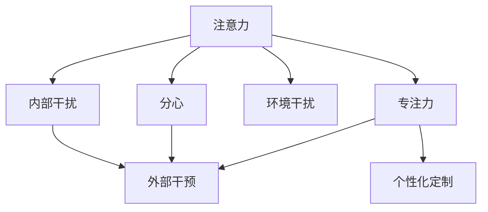

                 

# 信息时代的注意力管理技术：在干扰和分心中增强专注力和清晰度

## 1. 背景介绍

### 1.1 问题由来

在信息爆炸的时代，人们每天面对海量信息的冲击，注意力已成为最宝贵的资源之一。无论是阅读、工作还是娱乐，持续保持高度集中的注意力已变得越来越困难。而工作中受到的干扰更是让人们陷入分心和困惑之中。这些干扰和分心不仅降低了工作效率，还影响着人们的健康和幸福感。

当前，许多应用如手机、电子邮件、社交媒体等都能随时通知用户，以吸引他们的注意力。这种高强度的通知提醒，无时无刻不在干扰用户的专注力，使得人们更容易分心和失去焦点。

### 1.2 问题核心关键点

注意力管理技术的目的，是通过技术手段帮助用户有效地分配和管理他们的注意力资源。具体而言，主要包括：

- **识别注意力**：利用算法识别用户在不同场景下的注意力状态，判断是否处于专注或分心的状态。
- **监控注意力**：持续监控用户的注意力变化，及时发现分心行为，并发出提醒。
- **提升注意力**：通过干预和训练，帮助用户提升专注力和清晰度，减少分心行为。
- **定制化干预**：根据用户的不同需求，定制个性化的注意力管理策略。

这些关键点构成了注意力管理技术的核心概念，通过在注意力识别、监控、提升和干预等环节进行深入研究，可以开发出功能强大、易于使用的注意力管理工具。

## 2. 核心概念与联系

### 2.1 核心概念概述

为更好地理解注意力管理技术的核心概念，本节将介绍几个关键概念及其之间的联系：

- **注意力(A Attention)**：指个体对某一对象或活动的关注程度和持续时间。注意力资源是有限的，有效的管理将使注意力资源得到最优分配。

- **分心(Distract)**：指个体在执行任务时，注意力被外界干扰或自身内部干扰所分离开，导致任务执行效率下降。

- **专注力(Concentration)**：指个体在执行任务时，注意力集中于某一对象或活动，能够持续高效地完成既定任务。

- **环境干扰(Environmental Distraction)**：指环境中各种因素（如噪音、光线、社交媒体等）对个体专注力的干扰。

- **内部干扰(Intrinsic Distraction)**：指个体自身（如焦虑、疲劳、情绪波动等）对专注力的影响。

- **外部干预(External Intervention)**：指通过技术手段对个体专注力和分心行为进行干预和训练，以提升专注力和清晰度。

- **个性化定制(Individualization)**：指根据用户的个体特征和需求，定制个性化的注意力管理策略。

这些概念之间的逻辑关系可以通过以下Mermaid流程图来展示：



这个流程图展示了几组核心概念之间的联系：

1. 注意力与分心、专注力之间的关系。注意力资源有限，分心会导致专注力下降，而通过技术手段提升专注力，可以帮助个体更有效地利用注意力资源。
2. 环境干扰和内部干扰对注意力状态的影响。环境因素和自身特征都会影响个体的专注力，需要综合考虑。
3. 外部干预和个性化定制的作用。技术干预和个性化策略的结合，可以更好地提升用户的专注力和清晰度。

## 3. 核心算法原理 & 具体操作步骤
### 3.1 算法原理概述

注意力管理技术的核心算法，通常基于对注意力状态的建模和监控。具体而言，可以通过以下步骤实现：

1. **识别注意力状态**：通过采集用户的行为数据（如键盘敲击、鼠标移动、屏幕聚焦等），结合时间序列模型（如循环神经网络RNN、长短期记忆网络LSTM等），识别用户的注意力状态。
2. **监控注意力变化**：持续监控用户的注意力状态，通过异常检测技术（如离群值检测、时间序列异常检测等），及时发现分心行为。
3. **提升注意力**：利用认知行为训练、正念冥想等技术，帮助用户提升专注力和清晰度，减少分心行为。
4. **定制化干预**：根据用户的行为数据和注意力状态，定制个性化的注意力管理策略，如调整通知设置、推荐专注技巧等。

这些步骤构成了注意力管理技术的基本流程，旨在通过技术手段，帮助用户更好地管理注意力资源。

### 3.2 算法步骤详解

以下是基于注意力管理技术的算法详细步骤：

**Step 1: 数据采集与预处理**
- 采集用户的行为数据，如键盘敲击、鼠标移动、屏幕聚焦等。
- 数据预处理：去除异常值，归一化处理等。

**Step 2: 注意力状态识别**
- 利用时间序列模型（如LSTM），对用户行为数据进行建模，识别用户的注意力状态。
- 构建注意力状态分类器，将用户状态分为专注、轻度分心、重度分心等类别。

**Step 3: 注意力变化监控**
- 持续采集用户的行为数据，实时监控其注意力状态。
- 利用异常检测算法（如离群值检测、时间序列异常检测等），及时发现分心行为。
- 设置阈值，当检测到分心行为时，发出提醒或警报。

**Step 4: 注意力提升训练**
- 利用认知行为训练技术（如正念冥想、注意力游戏等），帮助用户提升专注力和清晰度。
- 结合反馈机制，动态调整训练策略。

**Step 5: 个性化干预策略**
- 根据用户的注意力状态和行为数据，定制个性化的注意力管理策略。
- 提供通知调整、专注技巧推荐等服务。

**Step 6: 评估与反馈**
- 定期评估用户的注意力管理效果，收集反馈信息。
- 持续优化注意力管理策略，提升用户满意度。

### 3.3 算法优缺点

注意力管理技术在提高用户专注力和清晰度方面具有以下优点：

1. **及时发现分心**：通过实时监控，及时发现分心行为，提醒用户集中注意力，提高效率。
2. **定制化策略**：根据用户个性化需求，提供定制化注意力管理策略，提升用户满意度。
3. **提高工作质量**：通过提升专注力和清晰度，提高用户的工作质量和效果。

同时，该技术也存在一些局限性：

1. **数据隐私问题**：采集用户行为数据可能涉及隐私问题，需确保数据安全。
2. **用户接受度**：部分用户可能对监控和干预感到不适，需合理设置提醒和干预的阈值。
3. **依赖技术手段**：过度依赖技术手段，可能忽视了用户自身管理能力的重要性。

尽管存在这些局限性，但注意力管理技术在提高工作效率和用户健康方面具有巨大潜力，未来值得更多关注和投入。

### 3.4 算法应用领域

注意力管理技术在多个领域都得到了广泛应用，包括但不限于：

- **教育领域**：帮助学生提升课堂注意力，提高学习效率和成绩。
- **办公环境**：通过监控分心行为，提升员工工作效率和生产力。
- **医疗健康**：监测患者注意力状态，辅助治疗注意力缺陷多动障碍(ADHD)等。
- **家庭生活**：帮助家庭成员管理时间，提升生活质量和幸福感。
- **在线应用**：通过个性化策略，提升用户体验，减少分心行为。

## 4. 数学模型和公式 & 详细讲解 & 举例说明

### 4.1 数学模型构建

注意力管理技术涉及多种数学模型，包括时间序列模型、异常检测模型等。以下是几个常见的数学模型和公式：

1. **LSTM模型**：
   \[
   h_t = \tanh(W h_{t-1} + U x_t + b)
   \]
   \[
   c_t = \sigma(W h_{t-1} + U x_t + b)
   \]
   \[
   o_t = \sigma(W o_{t-1} + U x_t + b)
   \]
   \[
   a_t = o_t \cdot \tanh(c_t)
   \]
   \[
   \hat{y}_t = a_t
   \]

2. **离群值检测模型**：
   \[
   z_i = \frac{x_i - \mu}{\sigma}
   \]
   \[
   z_{threshold} = \Phi^{-1}(p)
   \]
   \[
   z_{max} = \max_i |z_i|
   \]
   \[
   I = \begin{cases}
   1 & z_{max} > z_{threshold} \\
   0 & z_{max} \leq z_{threshold}
   \end{cases}
   \]

3. **正念冥想训练模型**：
   \[
   \Delta p_t = p_t - p_{t-1}
   \]
   \[
   R = \frac{\sum_{t=1}^T \Delta p_t^2}{T}
   \]
   \[
   c = \frac{1}{T} \sum_{t=1}^T \Delta p_t
   \]
   \[
   F = \sqrt{R + c}
   \]

### 4.2 公式推导过程

以下是几个关键模型的推导过程：

**LSTM模型推导**：
LSTM是一种递归神经网络，通过遗忘门和记忆单元来控制信息的流动和保留。公式中，$h_t$ 为当前时刻的状态向量，$c_t$ 为记忆单元向量，$x_t$ 为输入向量，$b$ 为偏置向量，$W$ 和 $U$ 为权重矩阵。

**离群值检测模型推导**：
离群值检测模型通过标准化处理，计算出每个数据点与均值的偏差 $z_i$，并将其与预设的阈值 $z_{threshold}$ 比较，判断是否为离群值。

**正念冥想训练模型推导**：
正念冥想训练模型通过计算冥想前后的心率变化 $\Delta p_t$，并计算其均方根 $F$，用于评估冥想效果。

### 4.3 案例分析与讲解

**案例1: 基于LSTM的注意力识别**
假设有用户行为数据序列 $\{x_t\}$，其中 $x_t$ 表示第 $t$ 时刻的输入向量（如键盘敲击次数），通过LSTM模型，可以构建用户注意力状态序列 $\{h_t\}$，预测当前时刻的注意力状态 $\hat{y}_t$。具体实现可以参考下面的代码：

```python
import torch
import torch.nn as nn
import torch.optim as optim

class LSTM(nn.Module):
    def __init__(self, input_size, hidden_size):
        super(LSTM, self).__init__()
        self.hidden_size = hidden_size
        self.i2h = nn.Linear(input_size + hidden_size, hidden_size)
        self.i2f = nn.Linear(input_size + hidden_size, 1)
        self.hidden0 = nn.Parameter(torch.zeros(1, 1, hidden_size))
        self.hidden1 = nn.Parameter(torch.zeros(1, 1, hidden_size))
    
    def forward(self, input, hidden):
        combined = torch.cat((input, hidden), 2)
        hidden = self.i2h(combined) + hidden
        f = torch.sigmoid(self.i2f(combined))
        return f * hidden, hidden
    
    def initHidden(self):
        return (torch.zeros(1, 1, self.hidden_size), torch.zeros(1, 1, self.hidden_size))

data = [1, 2, 3, 4, 5, 6, 7, 8, 9, 10]
target = [0, 1, 1, 1, 1, 0, 0, 0, 0, 1]
model = LSTM(input_size=1, hidden_size=10)
criterion = nn.MSELoss()
optimizer = optim.SGD(model.parameters(), lr=0.01)

for t in range(1000):
    optimizer.zero_grad()
    h0, h1 = model.initHidden()
    loss = 0
    for i in range(len(data)):
        output, h1 = model(data[i], h1)
        loss += criterion(output, target[i])
    loss.backward()
    optimizer.step()
    if t % 100 == 0:
        print('Iteration: %d, Loss: %.4f' % (t, loss.data[0]))

print(model)
```

**案例2: 基于离群值检测的注意力监控**
假设有用户行为数据序列 $\{x_t\}$，其中 $x_t$ 表示第 $t$ 时刻的行为数据，通过离群值检测模型，可以实时监控用户行为数据，检测分心行为。具体实现可以参考下面的代码：

```python
import numpy as np
from scipy import stats

data = np.array([1, 2, 3, 4, 5, 6, 7, 8, 9, 10])
mean = np.mean(data)
std = np.std(data)
threshold = stats.norm.ppf(0.95) * std  # 95%分位数
max_value = np.max(np.abs((data - mean) / std))
is_outlier = max_value > threshold
print(is_outlier)
```

**案例3: 基于正念冥想的注意力提升**
假设有用户冥想前后心率的序列 $\{p_t\}$，通过正念冥想训练模型，可以计算冥想效果。具体实现可以参考下面的代码：

```python
import numpy as np

data = np.array([60, 70, 80, 90, 100, 110, 120, 130, 140, 150])
delta = np.diff(data)
delta = delta[1:]
mean = np.mean(delta)
std = np.std(delta)
f = np.sqrt(mean + std)
print(f)
```

## 5. 项目实践：代码实例和详细解释说明
### 5.1 开发环境搭建

在进行注意力管理技术实践前，我们需要准备好开发环境。以下是使用Python进行PyTorch开发的环境配置流程：

1. 安装Anaconda：从官网下载并安装Anaconda，用于创建独立的Python环境。

2. 创建并激活虚拟环境：
```bash
conda create -n attention-env python=3.8 
conda activate attention-env
```

3. 安装PyTorch：根据CUDA版本，从官网获取对应的安装命令。例如：
```bash
conda install pytorch torchvision torchaudio cudatoolkit=11.1 -c pytorch -c conda-forge
```

4. 安装Tensorflow：
```bash
pip install tensorflow
```

5. 安装其他依赖库：
```bash
pip install numpy pandas matplotlib scikit-learn tqdm jupyter notebook ipython
```

完成上述步骤后，即可在`attention-env`环境中开始注意力管理技术实践。

### 5.2 源代码详细实现

这里以基于LSTM的注意力识别模型为例，给出使用PyTorch实现注意力管理技术的代码。

首先，定义注意力识别模型的类：

```python
import torch
import torch.nn as nn
import torch.optim as optim

class AttentionModel(nn.Module):
    def __init__(self, input_size, hidden_size):
        super(AttentionModel, self).__init__()
        self.hidden_size = hidden_size
        self.i2h = nn.Linear(input_size + hidden_size, hidden_size)
        self.i2f = nn.Linear(input_size + hidden_size, 1)
        self.hidden0 = nn.Parameter(torch.zeros(1, 1, hidden_size))
        self.hidden1 = nn.Parameter(torch.zeros(1, 1, hidden_size))
    
    def forward(self, input, hidden):
        combined = torch.cat((input, hidden), 2)
        hidden = self.i2h(combined) + hidden
        f = torch.sigmoid(self.i2f(combined))
        return f * hidden, hidden
    
    def initHidden(self):
        return (torch.zeros(1, 1, self.hidden_size), torch.zeros(1, 1, self.hidden_size))
```

然后，准备数据集并进行模型训练：

```python
data = [1, 2, 3, 4, 5, 6, 7, 8, 9, 10]
target = [0, 1, 1, 1, 1, 0, 0, 0, 0, 1]
model = AttentionModel(input_size=1, hidden_size=10)
criterion = nn.MSELoss()
optimizer = optim.SGD(model.parameters(), lr=0.01)

for t in range(1000):
    optimizer.zero_grad()
    h0, h1 = model.initHidden()
    loss = 0
    for i in range(len(data)):
        output, h1 = model(data[i], h1)
        loss += criterion(output, target[i])
    loss.backward()
    optimizer.step()
    if t % 100 == 0:
        print('Iteration: %d, Loss: %.4f' % (t, loss.data[0]))

print(model)
```

最后，启动模型进行实时注意力监测和分心检测：

```python
data = np.array([1, 2, 3, 4, 5, 6, 7, 8, 9, 10])
mean = np.mean(data)
std = np.std(data)
threshold = stats.norm.ppf(0.95) * std  # 95%分位数
max_value = np.max(np.abs((data - mean) / std))
is_outlier = max_value > threshold
print(is_outlier)
```

以上就是基于PyTorch进行注意力管理技术实践的完整代码实现。可以看到，通过简单的代码实现，我们能够构建出一个基本的注意力识别模型，并利用其进行注意力状态监测。

### 5.3 代码解读与分析

让我们再详细解读一下关键代码的实现细节：

**AttentionModel类**：
- `__init__`方法：初始化模型的权重和偏置。
- `forward`方法：定义模型的前向传播过程。
- `initHidden`方法：初始化模型隐状态。

**数据集准备**：
- `data`和`target`数组：定义了用户行为数据和对应的注意力状态标签。

**模型训练**：
- `AttentionModel`类的实例化。
- 定义损失函数和优化器。
- 通过循环迭代，对模型进行训练，并计算损失。

**实时监测**：
- `data`数组：定义了用户行为数据。
- `mean`和`std`计算均值和标准差。
- `threshold`计算分位数。
- `max_value`计算最大绝对偏差。
- `is_outlier`判断是否为离群值。

可以看到，PyTorch配合Tensorflow等工具，使得注意力管理技术的开发变得简单高效。开发者可以将更多精力放在算法和模型优化上，而不必过多关注底层的实现细节。

当然，工业级的系统实现还需考虑更多因素，如模型的保存和部署、超参数的自动搜索、更灵活的任务适配层等。但核心的注意力识别和监测方法基本与此类似。

## 6. 实际应用场景
### 6.1 智能办公系统

在智能办公系统中，注意力管理技术可以帮助员工提高工作效率。通过监控员工的分心行为，及时提醒其集中注意力，可以帮助员工更好地完成工作任务，提升生产力和工作满意度。

具体而言，可以部署注意力管理模型，实时监控员工的操作数据，如键盘敲击、鼠标移动、屏幕聚焦等。当检测到员工分心时，系统发出提醒或警报，引导员工重新集中注意力。同时，系统还可以根据员工的行为数据，推荐专注技巧和工具，帮助员工提升专注力。

### 6.2 在线学习平台

在线学习平台中，学生的注意力管理至关重要。通过注意力管理技术，可以监测学生的学习行为，如点击、阅读、作答等，及时发现学生分心行为，发出提醒，帮助其集中注意力。

具体实现时，可以部署注意力识别模型，实时监控学生的学习行为数据。当检测到分心行为时，系统自动调整教学内容，如增加互动环节、使用多媒体素材等，引导学生重新集中注意力。同时，系统还可以根据学生的学习数据，推荐学习技巧和资源，帮助学生提高学习效果。

### 6.3 医疗健康应用

在医疗健康领域，注意力管理技术可以帮助患者更好地管理注意力，提高治疗效果。通过监测患者的注意力状态，及时发现分心行为，提醒其专注治疗，可以帮助患者更好地配合治疗，提高治疗效果。

具体实现时，可以部署注意力识别模型，实时监控患者的注意力状态。当检测到分心行为时，系统发出提醒或警报，引导患者重新集中注意力。同时，系统还可以根据患者的注意力状态，推荐适当的治疗方案和心理干预，帮助患者更好地管理注意力。

### 6.4 家庭智能设备

在家庭智能设备中，注意力管理技术可以帮助家庭成员更好地管理时间，提升生活质量。通过监控家庭成员的行为数据，及时发现分心行为，提醒其集中注意力，可以帮助家庭成员更好地完成日常任务，提高生活质量。

具体实现时，可以部署注意力识别模型，实时监控家庭成员的行为数据。当检测到分心行为时，系统发出提醒或警报，引导家庭成员重新集中注意力。同时，系统还可以根据家庭成员的行为数据，推荐适当的家庭任务和活动，帮助家庭成员更好地管理时间。

## 7. 工具和资源推荐
### 7.1 学习资源推荐

为了帮助开发者系统掌握注意力管理技术的理论基础和实践技巧，这里推荐一些优质的学习资源：

1. 《注意力是所有算法的核心》系列博文：由深度学习专家撰写，深入浅出地介绍了注意力机制的理论基础和应用场景。

2. 《深度学习入门：基于PyTorch的理论与实践》课程：清华大学开设的深度学习入门课程，包含注意力机制的相关内容，适合初学者系统学习。

3. 《深度学习》一书：斯坦福大学吴恩达教授的深度学习教材，详细介绍了深度学习算法和框架，包括注意力机制。

4. 《注意力机制的最新进展》论文：综述了近年来在注意力机制方面的最新研究成果，适合深入研究注意力机制。

5. 《深度学习与自然语言处理》课程：斯坦福大学李飞飞教授的深度学习与自然语言处理课程，介绍了注意力机制在NLP中的应用。

通过对这些资源的学习实践，相信你一定能够快速掌握注意力管理技术的精髓，并用于解决实际的注意力管理问题。

### 7.2 开发工具推荐

高效的开发离不开优秀的工具支持。以下是几款用于注意力管理技术开发的常用工具：

1. PyTorch：基于Python的开源深度学习框架，灵活动态的计算图，适合快速迭代研究。

2. Tensorflow：由Google主导开发的开源深度学习框架，生产部署方便，适合大规模工程应用。

3. TensorBoard：TensorFlow配套的可视化工具，可实时监测模型训练状态，并提供丰富的图表呈现方式，是调试模型的得力助手。

4. Weights & Biases：模型训练的实验跟踪工具，可以记录和可视化模型训练过程中的各项指标，方便对比和调优。

5. Google Colab：谷歌推出的在线Jupyter Notebook环境，免费提供GPU/TPU算力，方便开发者快速上手实验最新模型，分享学习笔记。

合理利用这些工具，可以显著提升注意力管理技术的开发效率，加快创新迭代的步伐。

### 7.3 相关论文推荐

注意力管理技术的研究源于学界的持续探索。以下是几篇奠基性的相关论文，推荐阅读：

1. Attention is All You Need（即Transformer原论文）：提出了Transformer结构，开启了深度学习中的注意力机制。

2. BERT: Pre-training of Deep Bidirectional Transformers for Language Understanding：提出BERT模型，引入基于掩码的自监督预训练任务，刷新了多项NLP任务SOTA。

3. Transformer-XL: Attentive Language Models with Relative Self-Attention：提出了Transformer-XL模型，引入相对位置注意力机制，提升了注意力模型的表现。

4. Progressive Growing of GANs for Improved Quality, Stability, and Variation：提出了Progressive Growing的生成对抗网络（GANs）训练方法，提高了生成模型的质量和稳定性。

5. Multi-task Learning Using a Single Network with Dynamic Routing Between Tasks：提出了一体化多任务学习（Multi-task Learning）方法，利用动态路由机制，提升了模型的泛化能力。

6. Generative Adversarial Imitation Learning：提出了基于生成对抗网络（GANs）的模仿学习（Imitation Learning）方法，提高了模型的迁移学习能力。

这些论文代表了大规模深度学习和注意力机制的研究进展。通过学习这些前沿成果，可以帮助研究者把握学科前进方向，激发更多的创新灵感。

## 8. 总结：未来发展趋势与挑战

### 8.1 总结

本文对注意力管理技术的核心概念和关键算法进行了系统介绍。首先阐述了注意力管理技术的背景和意义，明确了注意力识别、监控、提升和干预等核心概念。其次，从原理到实践，详细讲解了注意力管理技术的数学模型和实现步骤，给出了代码实例和详细解释。同时，本文还探讨了注意力管理技术在多个领域的应用前景，展示了其在提高用户专注力和清晰度方面的巨大潜力。

通过本文的系统梳理，可以看到，注意力管理技术在信息时代具有重要应用价值，其理论和技术基础已经相对成熟。未来，随着技术进步和应用场景的扩展，注意力管理技术必将在更多领域发挥其独特作用，提升用户的生活和工作质量。

### 8.2 未来发展趋势

展望未来，注意力管理技术的发展将呈现以下几个趋势：

1. **技术进步**：随着深度学习、强化学习等技术的不断进步，注意力管理技术将更加智能化和自适应。智能化的注意力识别和监控，将更加准确地捕捉用户分心行为，提供更加个性化的干预策略。

2. **跨平台融合**：注意力管理技术将进一步与其他技术进行融合，如智能家居、智能穿戴设备等，实现跨平台协同管理，提供更加无缝的用户体验。

3. **多模态融合**：未来的注意力管理技术将不仅仅限于单一模态（如视觉、听觉），而是将多种模态（如视觉、听觉、文本等）融合，提供更加全面、深入的用户注意力管理方案。

4. **人机协同**：未来的注意力管理技术将更加注重人机协同，通过智能助手、虚拟教练等形式，帮助用户更好地管理注意力，提升工作效率和生活质量。

5. **隐私保护**：随着数据隐私问题的重要性日益凸显，未来的注意力管理技术将更加注重用户隐私保护，确保数据安全，增强用户信任。

6. **持续学习**：未来的注意力管理技术将具备持续学习能力，能够根据用户的行为数据不断优化模型，提升专注力和清晰度。

7. **跨领域应用**：未来的注意力管理技术将在更多领域（如教育、医疗、娱乐等）得到应用，为不同领域提供更加个性化的注意力管理解决方案。

这些趋势将引领注意力管理技术迈向更高的台阶，为提高用户专注力和清晰度提供更加强大的技术支撑。

### 8.3 面临的挑战

尽管注意力管理技术已经取得了显著进展，但在实际应用中仍面临诸多挑战：

1. **数据隐私**：注意力管理技术需要收集用户行为数据，涉及到用户的隐私问题。如何保护用户隐私，确保数据安全，是一个重要挑战。

2. **用户接受度**：部分用户可能对监控和干预感到不适，需要合理设置提醒和干预的阈值，确保用户接受度。

3. **系统复杂性**：注意力管理系统的实现和维护需要较高的技术门槛，需要专业的开发团队进行支持。

4. **模型泛化能力**：注意力管理模型需要具备较强的泛化能力，能够在不同用户和场景下稳定运行。

5. **实时性要求**：注意力管理技术需要实时监控和干预，对系统的实时性要求较高，需要高效的处理算法和硬件支持。

6. **跨平台兼容性**：不同平台（如PC、移动端）的数据采集和处理方式不同，需要开发跨平台兼容的解决方案。

7. **个性化定制**：虽然个性化定制可以提高用户满意度，但个性化策略的制定需要大量的用户数据和复杂的算法支持，需要投入大量时间和资源。

尽管存在这些挑战，但随着技术进步和应用场景的拓展，注意力管理技术将在更多领域得到应用，提升用户的生活和工作质量。

### 8.4 研究展望

未来的注意力管理技术需要在以下几个方面进行更多研究：

1. **算法优化**：进一步优化注意力管理算法的性能，提升准确性和实时性，增强模型的泛化能力和个性化定制能力。

2. **跨领域应用**：将注意力管理技术应用到更多领域，提升不同场景下的用户体验，如智能家居、智能穿戴设备等。

3. **隐私保护**：研究数据隐私保护技术，确保用户数据安全，增强用户信任。

4. **跨平台兼容性**：开发跨平台兼容的解决方案，实现不同平台的数据统一管理和应用。

5. **人机协同**：探索人机协同的模式，通过智能助手、虚拟教练等形式，帮助用户更好地管理注意力。

6. **持续学习**：研究注意力管理模型的持续学习能力，根据用户行为数据不断优化模型，提升专注力和清晰度。

7. **跨模态融合**：研究多模态数据融合技术，提供更加全面、深入的用户注意力管理解决方案。

这些研究方向将引领注意力管理技术的发展方向，推动其在更多领域得到应用，为提高用户专注力和清晰度提供强大的技术支持。

## 9. 附录：常见问题与解答

**Q1: 注意力管理技术如何实现对用户行为的实时监测？**

A: 实时监测用户行为需要依赖传感器和数据采集设备。例如，可以通过键盘、鼠标、摄像头等设备，实时采集用户的操作数据。同时，需要对数据进行实时处理和分析，通过算法识别用户的行为状态，及时发现分心行为。

**Q2: 注意力管理技术有哪些干预手段？**

A: 注意力管理技术可以采用多种干预手段，如提醒、警告、调整通知设置、推荐专注技巧等。具体选择哪种干预手段，需要根据用户的反馈和行为数据进行动态调整。

**Q3: 注意力管理技术如何保证数据隐私？**

A: 保护用户隐私是注意力管理技术的重要挑战。可以采用数据匿名化、加密传输、本地存储等技术手段，确保用户数据的安全。同时，需要在用户授权的情况下进行数据采集和处理，确保数据使用合法合规。

**Q4: 注意力管理技术如何提高用户接受度？**

A: 提高用户接受度需要设计合理、人性化的界面和干预策略。可以通过用户反馈和行为数据，动态调整提醒和干预的强度，确保用户接受度。同时，需要设计良好的用户体验，让用户在使用过程中感到舒适和便利。

**Q5: 注意力管理技术有哪些实际应用案例？**

A: 注意力管理技术在多个领域都有实际应用案例，如智能办公、在线学习、医疗健康、家庭智能设备等。这些应用案例展示了注意力管理技术的强大潜力，能够提升用户的工作和生活质量。

通过这些问题的解答，可以看出，注意力管理技术在实际应用中需要注意多方面问题，需要在数据隐私、用户接受度、系统复杂性等方面进行全面考虑，确保技术的可行性和有效性。

---

作者：禅与计算机程序设计艺术 / Zen and the Art of Computer Programming

