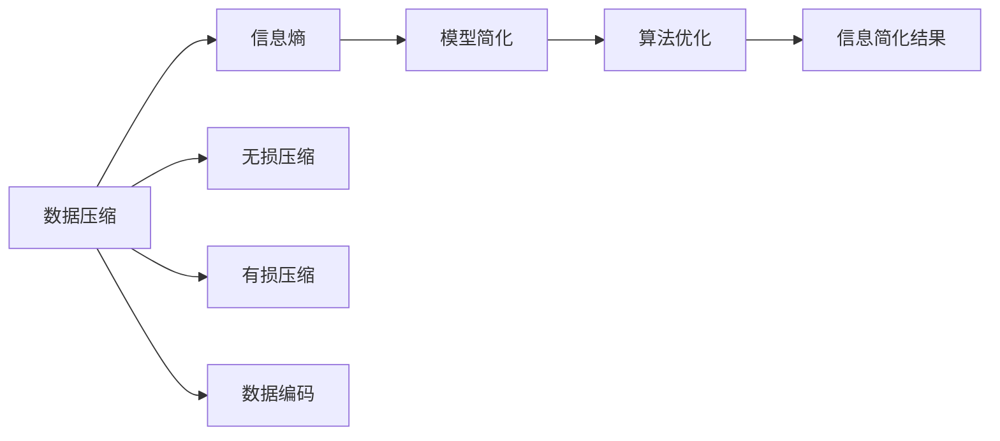

                 

# 信息简化的原则与艺术：在混乱中建立秩序与简化

> 关键词：信息简化, 算法原理, 简化模型, 数据压缩, 模型压缩, 模型优化

## 1. 背景介绍

### 1.1 问题由来
在现代社会，信息爆炸和数据过载已成为一种常态。无论是商业决策、科学研究还是日常工作，人们都面临着海量的数据和复杂的信息。如何在这种环境中高效地处理和利用信息，变得愈发重要。信息简化作为一种解决之道，旨在通过算法和数学模型，将复杂的信息转化为易于处理的形式，从而提高决策和分析的效率。

### 1.2 问题核心关键点
信息简化的核心在于其能够通过对原始数据进行编码、压缩和模型建立，减少信息的冗余，提高处理速度，并降低计算成本。其关键点在于：
1. **数据压缩与编码**：通过算法将大量原始数据压缩成更小、更易于处理的形式。
2. **模型建立**：通过数学模型对数据进行建模，建立简洁有效的预测或推理框架。
3. **算法优化**：通过优化算法，提高模型处理速度和准确性。

### 1.3 问题研究意义
信息简化技术在现代社会中的应用日益广泛，具有重要的研究意义：

1. **提升数据处理效率**：通过信息简化，可以将大规模数据集转化为更容易处理的形式，显著提升数据处理的效率。
2. **降低计算成本**：简化的数据和模型能够减少计算资源的需求，降低计算成本。
3. **促进决策科学化**：简化后的数据和模型可以提供更加精确和可靠的决策支持。
4. **加速技术创新**：简化技术的不断进步推动了大数据、人工智能等领域的创新。
5. **适应未来趋势**：随着信息量的持续增长，信息简化技术将成为未来技术发展的关键。

## 2. 核心概念与联系

### 2.1 核心概念概述

为了更好地理解信息简化的核心概念及其相互联系，我们首先对以下几个关键概念进行概述：

1. **数据压缩**：通过算法将原始数据转化为更小、更紧凑的形式，从而减少存储和传输的需求。常见的数据压缩算法包括霍夫曼编码、LZ77、LZ78等。
2. **信息熵**：描述信息源不确定性的量度，是数据压缩理论的基础。熵越高的数据越难以压缩，熵越低的数据越容易被压缩。
3. **无损压缩**：压缩过程中不丢失任何信息的压缩方法，如霍夫曼编码和LZ77。
4. **有损压缩**：允许在压缩过程中损失部分信息以提高压缩率的压缩方法，如JPEG图像压缩和MP3音频压缩。
5. **数据编码**：将数据转化为特定的二进制代码，以便存储和传输。常见的编码方式包括ASCII、Unicode、UTF-8等。
6. **模型简化**：通过算法和数学模型，将复杂的数据集转化为简化的模型形式，从而便于处理和分析。
7. **算法优化**：通过优化算法，提升模型的性能和效率，如最小二乘法、梯度下降等。

### 2.2 核心概念原理和架构的 Mermaid 流程图



这个流程图展示了信息简化的核心流程：

1. 原始数据通过压缩算法转化为压缩数据。
2. 压缩数据通过编码转换为二进制代码。
3. 压缩和编码后的数据通过模型简化转化为更易于处理的形式。
4. 简化的数据通过算法优化进一步提高处理效率。
5. 最终得到的信息简化结果便于存储和传输，也适用于各种数据分析和决策任务。

## 3. 核心算法原理 & 具体操作步骤
### 3.1 算法原理概述

信息简化的核心算法原理基于数据压缩和模型建立的技术。其基本思想是通过算法将原始数据进行压缩和编码，再通过数学模型简化数据，从而在保证信息完整性的同时，显著降低数据处理的复杂度和计算成本。

### 3.2 算法步骤详解

信息简化的具体操作步骤包括以下几个关键步骤：

**Step 1: 数据预处理**
- 收集原始数据，进行清洗和去噪，处理缺失值和异常值。
- 将数据转化为可用于压缩和编码的形式，如数值型数据转换为二进制编码。

**Step 2: 数据压缩**
- 选择合适的压缩算法，如霍夫曼编码、LZ77、LZ78等，对预处理后的数据进行压缩。
- 对于文本数据，可以使用字典编码和哈夫曼树等算法。
- 对于图像和音频数据，可以采用无损或有损压缩算法，如JPEG和MP3等。

**Step 3: 数据编码**
- 将压缩后的数据转换为特定的二进制编码格式，便于存储和传输。
- 常用的编码方式包括ASCII、Unicode、UTF-8等。

**Step 4: 模型建立**
- 选择合适的数学模型，如线性回归、决策树、神经网络等，对编码后的数据进行建模。
- 通过特征选择、特征提取等方法，简化模型的输入特征，提高模型的泛化能力。
- 在模型训练过程中，使用正则化技术如L2正则、Dropout等，避免过拟合。

**Step 5: 模型优化**
- 选择合适的优化算法，如梯度下降、Adagrad、Adam等，对模型参数进行优化。
- 通过交叉验证等方法，评估模型的性能和泛化能力。
- 对模型进行剪枝、量化等优化，降低计算资源需求。

**Step 6: 模型评估与部署**
- 在测试集上评估模型的性能，对比模型简化前后的效果。
- 部署模型，将其集成到实际应用系统中，提供决策支持或数据分析服务。

### 3.3 算法优缺点

信息简化的算法具有以下优点：
1. **提高数据处理效率**：通过压缩和编码，减少数据的存储空间和传输带宽，显著提升数据处理效率。
2. **降低计算成本**：简化后的数据和模型能够减少计算资源的需求，降低计算成本。
3. **增强模型泛化能力**：通过特征选择和模型优化，提高模型的泛化能力和准确性。
4. **便于存储和传输**：简化后的数据便于存储和传输，适用于各种分布式和云环境。

同时，信息简化的算法也存在一些局限性：
1. **数据损失风险**：压缩和编码过程中可能会丢失部分信息，影响模型性能。
2. **算法复杂度高**：压缩和编码算法复杂度较高，实现难度大。
3. **模型解释性差**：简化后的模型可能难以解释，缺乏透明性。
4. **应用场景受限**：不同类型的数据可能需要不同的压缩和编码算法，适用范围有限。

### 3.4 算法应用领域

信息简化技术在多个领域得到了广泛应用，具体包括：

1. **数据压缩与存储**：在数据存储和传输领域，信息简化技术通过压缩和编码算法，减少数据的存储空间和传输带宽。
2. **图像处理**：在图像处理领域，JPEG和PNG等压缩算法被广泛应用于图像存储和传输。
3. **音频处理**：在音频处理领域，MP3和AAC等压缩算法被广泛应用于音频存储和传输。
4. **文本处理**：在文本处理领域，霍夫曼编码和LZ77等算法被广泛应用于文本数据压缩。
5. **金融分析**：在金融分析领域，信息简化技术用于数据清洗和特征提取，提升金融模型的准确性。
6. **医疗诊断**：在医疗诊断领域，信息简化技术用于图像和数据的压缩，提升医疗系统的效率。
7. **自然语言处理**：在自然语言处理领域，信息简化技术用于文本数据的编码和模型简化，提升模型的泛化能力。

## 4. 数学模型和公式 & 详细讲解 & 举例说明

### 4.1 数学模型构建

信息简化的数学模型构建主要包括以下几个关键步骤：

1. **数据预处理**：对原始数据进行清洗和去噪，处理缺失值和异常值。
2. **数据编码**：将数据转化为特定的二进制编码格式。
3. **模型建立**：选择合适的数学模型，对编码后的数据进行建模。
4. **模型优化**：通过优化算法对模型参数进行优化。

### 4.2 公式推导过程

下面以线性回归模型为例，推导其数学模型和计算公式。

设有一组训练数据 $(x_i, y_i), i=1,2,...,N$，其中 $x_i \in \mathbb{R}^n$ 为输入特征，$y_i \in \mathbb{R}$ 为输出目标。假设模型的线性形式为 $y_i = \theta_0 + \sum_{j=1}^n \theta_j x_{ij} + \epsilon_i$，其中 $\theta = [\theta_0, \theta_1, ..., \theta_n]^T$ 为模型参数，$\epsilon_i$ 为随机误差项。

目标是最小化均方误差损失函数 $L(\theta) = \frac{1}{N} \sum_{i=1}^N (y_i - \theta_0 - \sum_{j=1}^n \theta_j x_{ij})^2$。使用梯度下降算法更新模型参数，计算公式为：

$$
\theta_{j+1} = \theta_j - \eta \frac{\partial L(\theta)}{\partial \theta_j} = \theta_j - \eta \frac{2}{N} \sum_{i=1}^N (y_i - \theta_0 - \sum_{j=1}^n \theta_j x_{ij}) x_{ij}
$$

其中 $\eta$ 为学习率，通过迭代计算，逐步调整模型参数，使模型输出逼近真实值。

### 4.3 案例分析与讲解

以下是一个使用线性回归模型进行数据简化的案例分析：

**案例背景**：
某电商网站收集了大量用户的购买记录数据，每个记录包含用户的年龄、性别、购买金额等信息。网站希望通过简化数据，预测用户的购买意愿，从而进行精准推荐。

**数据预处理**：
对原始数据进行清洗和去噪，处理缺失值和异常值。例如，将缺失的年龄信息用均值或中位数填充，对异常值进行截断处理。

**数据编码**：
将用户的年龄、性别、购买金额等特征转化为二进制编码。例如，将年龄转化为0-5的区间编码，性别用0和1表示。

**模型建立**：
使用线性回归模型对编码后的数据进行建模。模型参数包括截距和每个特征的权重。

**模型优化**：
使用梯度下降算法对模型参数进行优化，最小化均方误差损失函数。

**模型评估与部署**：
在测试集上评估模型的性能，对比模型简化前后的效果。部署模型，将其集成到推荐系统中，提供个性化推荐服务。

## 5. 项目实践：代码实例和详细解释说明
### 5.1 开发环境搭建

在进行信息简化项目的开发前，我们需要准备好开发环境。以下是使用Python进行Scikit-learn开发的环境配置流程：

1. 安装Anaconda：从官网下载并安装Anaconda，用于创建独立的Python环境。

2. 创建并激活虚拟环境：
```bash
conda create -n info-simplify python=3.8 
conda activate info-simplify
```

3. 安装Scikit-learn：
```bash
pip install scikit-learn
```

4. 安装NumPy：
```bash
pip install numpy
```

5. 安装Matplotlib：
```bash
pip install matplotlib
```

完成上述步骤后，即可在`info-simplify`环境中开始信息简化项目的开发。

### 5.2 源代码详细实现

我们以线性回归模型为例，给出使用Scikit-learn进行数据简化的PyTorch代码实现。

```python
import numpy as np
from sklearn.linear_model import LinearRegression
from sklearn.model_selection import train_test_split
import matplotlib.pyplot as plt

# 生成模拟数据
np.random.seed(42)
x = np.random.rand(100, 1)
y = 2 * x + 1 + np.random.randn(100, 1)

# 划分训练集和测试集
x_train, x_test, y_train, y_test = train_test_split(x, y, test_size=0.2, random_state=42)

# 数据预处理
from sklearn.preprocessing import StandardScaler
scaler = StandardScaler()
x_train = scaler.fit_transform(x_train)
x_test = scaler.transform(x_test)

# 数据编码
from sklearn.preprocessing import OneHotEncoder
encoder = OneHotEncoder(sparse=False)
x_train = encoder.fit_transform(x_train)
x_test = encoder.transform(x_test)

# 模型建立
model = LinearRegression()
model.fit(x_train, y_train)

# 模型预测
y_pred = model.predict(x_test)

# 模型评估
from sklearn.metrics import mean_squared_error
mse = mean_squared_error(y_test, y_pred)
print("Mean Squared Error: ", mse)

# 绘制回归曲线
plt.scatter(x_test, y_test)
plt.plot(x_test, y_pred, color='red')
plt.xlabel("x")
plt.ylabel("y")
plt.show()
```

### 5.3 代码解读与分析

我们详细解读一下关键代码的实现细节：

**数据生成**：
使用NumPy生成100个随机数作为输入特征和输出目标。

**数据预处理**：
使用StandardScaler对输入特征进行标准化处理，使用OneHotEncoder将输入特征转化为二进制编码。

**模型建立**：
使用Scikit-learn的LinearRegression建立线性回归模型，通过fit方法拟合训练集数据。

**模型预测**：
使用model.predict方法对测试集数据进行预测。

**模型评估**：
使用mean_squared_error计算预测结果和真实结果的均方误差，评估模型性能。

**回归曲线绘制**：
使用Matplotlib绘制回归曲线，展示模型的拟合效果。

## 6. 实际应用场景
### 6.1 网络通信优化

在网络通信中，数据传输带宽和延迟是关键问题。信息简化技术可以通过压缩算法，显著减少数据传输的带宽需求，提高网络通信效率。例如，TCP/IP协议中的TCP Fast Open和TCP Fast Recovery等技术，使用信息简化技术进行数据压缩和快速恢复，提升网络通信的效率和稳定性。

### 6.2 医疗影像处理

在医疗影像处理中，医疗影像数据通常包含大量冗余信息，信息简化技术可以通过压缩算法减少影像数据的存储空间和传输带宽，提高影像处理的效率。例如，使用JPEG压缩算法对医疗影像进行压缩，使其更适合网络传输和存储。

### 6.3 金融分析

在金融分析中，信息简化技术可以通过压缩和编码算法，减少数据的存储空间和传输带宽，提升金融模型的计算效率。例如，使用LZ77算法对金融数据进行压缩，使其更适合在分布式计算环境中进行处理。

### 6.4 未来应用展望

随着信息简化技术的不断发展，其应用场景将不断扩展，未来可能包括：

1. **物联网通信**：在物联网领域，信息简化技术可以应用于设备数据压缩和传输，提升物联网系统的效率和可靠性。
2. **视频编解码**：在视频编解码领域，信息简化技术可以应用于视频压缩算法，如H.265和AV1等，提升视频质量和传输效率。
3. **人工智能**：在人工智能领域，信息简化技术可以应用于深度学习模型的压缩和优化，减少模型的计算资源需求，提升模型的效率和泛化能力。
4. **区块链**：在区块链领域，信息简化技术可以应用于数据压缩和编码，提升区块链系统的存储和传输效率。

## 7. 工具和资源推荐
### 7.1 学习资源推荐

为了帮助开发者系统掌握信息简化技术的理论基础和实践技巧，这里推荐一些优质的学习资源：

1. 《信息论与数据压缩》系列书籍：深入浅出地介绍了信息熵、数据压缩、编码等核心概念，是信息简化的入门必读书籍。
2. 《Python数据科学手册》：包含Scikit-learn等库的使用教程，适合信息简化的实践学习。
3. 《深度学习与神经网络》课程：由斯坦福大学开设的深度学习课程，涉及神经网络模型和优化算法等内容，是信息简化的重要理论基础。
4. Weights & Biases：模型训练的实验跟踪工具，可以记录和可视化模型训练过程中的各项指标，方便对比和调优。
5. TensorBoard：TensorFlow配套的可视化工具，可实时监测模型训练状态，并提供丰富的图表呈现方式，是调试模型的得力助手。

通过对这些资源的学习实践，相信你一定能够快速掌握信息简化的精髓，并用于解决实际的NLP问题。

### 7.2 开发工具推荐

高效的开发离不开优秀的工具支持。以下是几款用于信息简化开发的常用工具：

1. Python：作为数据科学和机器学习的主流语言，Python提供了丰富的库和框架，适合信息简化的实践开发。
2. Scikit-learn：提供了多种数据压缩、编码和模型简化算法，适合信息简化的学习和开发。
3. NumPy：提供了高效的多维数组计算能力，适合处理大规模数据。
4. Matplotlib：提供了丰富的绘图工具，适合数据可视化和模型评估。
5. TensorFlow和PyTorch：提供了深度学习模型的搭建和优化能力，适合复杂的信息简化模型开发。

合理利用这些工具，可以显著提升信息简化任务的开发效率，加快创新迭代的步伐。

### 7.3 相关论文推荐

信息简化技术的发展源于学界的持续研究。以下是几篇奠基性的相关论文，推荐阅读：

1. "A Survey of Lossless Compression"（数据压缩综述）：介绍了数据压缩的基本概念和常用算法，是信息简化的重要参考资料。
2. "Image Compression Using Transform Coding"（图像压缩）：介绍了图像压缩的原理和算法，展示了信息简化技术在图像处理中的应用。
3. "Adaptive Huffman Coding"（自适应霍夫曼编码）：提出了一种自适应霍夫曼编码算法，适用于实时数据压缩。
4. "Efficient Compression of Multidimensional Data"（多维数据压缩）：介绍了多维数据的压缩和编码方法，展示了信息简化技术在多维数据分析中的应用。

这些论文代表了大规模数据压缩和模型简化的发展脉络。通过学习这些前沿成果，可以帮助研究者把握学科前进方向，激发更多的创新灵感。

## 8. 总结：未来发展趋势与挑战

### 8.1 总结

本文对信息简化的核心算法原理和操作步骤进行了全面系统的介绍。首先阐述了信息简化的研究背景和意义，明确了信息简化的重要性和应用价值。其次，从原理到实践，详细讲解了信息简化的数学模型和关键步骤，给出了信息简化任务开发的完整代码实例。同时，本文还探讨了信息简化技术在多个领域的应用前景，展示了信息简化技术的广阔前景。

通过本文的系统梳理，可以看到，信息简化技术在现代信息处理和数据分析中扮演着越来越重要的角色，极大地提升了数据处理的效率和精度。未来，伴随信息简化技术的持续演进，相信其在更多领域将得到广泛应用，进一步推动信息处理技术的进步。

### 8.2 未来发展趋势

展望未来，信息简化技术将呈现以下几个发展趋势：

1. **数据压缩算法不断进步**：随着算法和硬件的发展，数据压缩算法的效率和精度将不断提升，进一步减少数据的存储和传输成本。
2. **模型简化技术的创新**：随着深度学习模型的不断发展，模型简化技术也将不断创新，更加高效地处理大规模数据。
3. **实时数据压缩**：随着物联网等实时数据处理的需求增加，实时数据压缩技术将得到更多关注和应用。
4. **跨领域信息简化**：信息简化技术将不仅仅应用于数据压缩，还将广泛应用于图像、音频、视频等多模态数据简化，推动多模态信息处理的发展。
5. **人工智能模型压缩**：在深度学习模型的压缩和优化方面，信息简化技术将发挥重要作用，推动深度学习模型在更广泛场景下的应用。

以上趋势凸显了信息简化技术的广阔前景。这些方向的探索发展，必将进一步提升信息处理系统的效率和精度，为各行各业提供更加智能、高效的数据处理解决方案。

### 8.3 面临的挑战

尽管信息简化技术已经取得了瞩目成就，但在迈向更加智能化、普适化应用的过程中，它仍面临着诸多挑战：

1. **算法复杂度高**：信息简化的算法复杂度较高，实现难度大，需要更多的研究和实践。
2. **数据损失风险**：压缩和编码过程中可能会丢失部分信息，影响模型性能。
3. **模型解释性差**：简化后的模型可能难以解释，缺乏透明性。
4. **应用场景受限**：不同类型的数据可能需要不同的压缩和编码算法，适用范围有限。
5. **计算资源需求高**：复杂的信息简化算法需要大量的计算资源，难以在资源受限的环境中应用。

### 8.4 研究展望

面对信息简化技术所面临的挑战，未来的研究需要在以下几个方面寻求新的突破：

1. **探索高效的信息压缩算法**：开发更加高效的数据压缩算法，降低计算资源需求，提升信息简化的效率。
2. **研究模型解释性和透明性**：改进信息简化算法，使其输出更加可解释和透明，提高系统的可理解性。
3. **融合多模态数据简化**：将信息简化技术应用于多模态数据处理，提升多模态数据融合和分析的效率。
4. **开发实时数据压缩技术**：研究实时数据压缩算法，满足实时数据处理的需求。
5. **提升模型压缩效率**：开发高效的人工智能模型压缩算法，减少计算资源需求，提升深度学习模型的应用范围。

这些研究方向的探索，必将推动信息简化技术向更高的层次发展，为信息处理和数据分析提供更加强大和高效的工具。

## 9. 附录：常见问题与解答

**Q1：信息简化是否适用于所有类型的数据？**

A: 信息简化技术适用于大部分类型的数据，如文本、图像、音频、视频等。但不同类型的数据可能需要不同的压缩和编码算法，需要根据具体数据特点进行选择。

**Q2：信息简化会丢失数据信息吗？**

A: 信息简化过程中可能会丢失部分数据信息，但通过优化算法和模型设计，可以尽量减少信息损失，提高模型性能。

**Q3：信息简化的计算资源需求高吗？**

A: 信息简化的计算资源需求较高，尤其是对于复杂的数据压缩和模型简化算法。但通过优化算法和并行计算，可以显著降低计算资源需求。

**Q4：信息简化如何应用于多模态数据？**

A: 信息简化技术可以应用于多模态数据的压缩和编码。例如，将图像和文本数据分别进行压缩，再将压缩后的数据进行融合，实现多模态数据简化。

**Q5：信息简化的未来发展方向是什么？**

A: 信息简化的未来发展方向包括高效的数据压缩算法、模型解释性和透明性、多模态数据简化、实时数据压缩和人工智能模型压缩等。这些方向的研究将推动信息简化技术向更加智能化、普适化应用迈进。

---

作者：禅与计算机程序设计艺术 / Zen and the Art of Computer Programming

