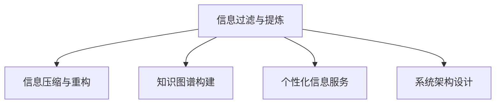

                 

# 信息简化的好处与挑战：简化复杂性的艺术与科学

> 关键词：信息简化,复杂性管理,知识图谱,数据压缩,大数据处理

## 1. 背景介绍

### 1.1 问题由来
在信息技术飞速发展的今天，数据量呈爆炸式增长，各种信息纷繁复杂。人们面临的信息过载和认知负荷日益增加，如何有效管理海量信息，简化复杂性，成为当下亟需解决的重要问题。信息简化技术，通过对信息的过滤、提炼、压缩，帮助人们更高效地处理和理解信息，提升决策质量和工作效率。然而，信息简化的过程并不简单，它不仅涉及到数据科学和计算机科学的诸多前沿领域，还涉及到心理学、认知科学等知识领域。本文将系统介绍信息简化的好处与挑战，探讨其核心概念与联系，以及相关算法和应用实践。

### 1.2 问题核心关键点
信息简化技术旨在通过压缩和提炼信息，减少信息量的冗余，同时保持关键信息的完整性和准确性。关键点包括：
1. 信息过滤与提炼：通过算法自动筛选出有用信息，去除噪音。
2. 信息压缩与重构：将信息进行编码压缩，减少存储空间和传输带宽。
3. 知识图谱构建：将信息映射为结构化的知识图谱，便于检索和推理。
4. 个性化信息服务：根据用户需求，定制化推荐信息，提高信息相关性。
5. 系统架构设计：设计高效的信息处理和存储系统，保证实时性和可靠性。

这些关键点共同构成了信息简化技术的核心框架，涵盖了数据预处理、信息提取、知识管理、信息服务等多个层面。

### 1.3 问题研究意义
信息简化技术对于提升信息处理效率、优化决策过程、推动知识传播与创新具有重要意义：

1. 提升信息处理效率：通过信息简化，可以有效过滤无用信息，减少信息冗余，提升信息检索和处理的速度和准确性。
2. 优化决策过程：简化后的信息更易于理解，有助于快速形成决策依据，降低决策成本。
3. 推动知识传播与创新：简化的信息易于共享和传播，有助于知识的积累和创新。
4. 满足个性化需求：信息服务可以根据用户偏好和需求，提供定制化、个性化的信息，提升用户体验。

信息简化技术的普及和应用，将显著提高信息处理能力，促进知识创新，推动经济社会的全面进步。

## 2. 核心概念与联系

### 2.1 核心概念概述

为了更好地理解信息简化技术，本节将介绍几个密切相关的核心概念：

- 信息过滤与提炼（Information Filtering and Extraction）：通过算法自动筛选出有用信息，去除噪音。信息过滤是信息简化的第一步，旨在提高信息的相关性和可用性。
- 信息压缩与重构（Information Compression and Reconstruction）：将信息进行编码压缩，减少存储空间和传输带宽。信息压缩是信息简化的另一重要步骤，旨在通过算法对信息进行压缩，减少存储和传输的开销。
- 知识图谱构建（Knowledge Graph Construction）：将信息映射为结构化的知识图谱，便于检索和推理。知识图谱技术利用图结构表示实体及其关系，帮助更好地理解和处理信息。
- 个性化信息服务（Personalized Information Service）：根据用户需求，定制化推荐信息，提高信息相关性。个性化信息服务通过用户画像和推荐算法，提供更加精准的信息服务。
- 系统架构设计（System Architecture Design）：设计高效的信息处理和存储系统，保证实时性和可靠性。信息简化技术的实现需要设计高效的系统架构，以支持大规模的信息处理和存储。

这些核心概念之间的逻辑关系可以通过以下Mermaid流程图来展示：



这个流程图展示了几类信息简化技术及其之间的关系：

1. 信息过滤与提炼是信息简化的第一步，为后续的压缩、知识图谱构建和个性化服务奠定基础。
2. 信息压缩与重构旨在通过算法对信息进行编码压缩，减少存储和传输的开销。
3. 知识图谱构建利用图结构表示实体及其关系，帮助更好地理解和处理信息。
4. 个性化信息服务通过用户画像和推荐算法，提供更加精准的信息服务。
5. 系统架构设计旨在设计高效的信息处理和存储系统，保证实时性和可靠性。

这些概念共同构成了信息简化技术的核心框架，使其能够在各个环节中发挥作用。

## 3. 核心算法原理 & 具体操作步骤
### 3.1 算法原理概述

信息简化技术主要通过以下几种算法实现：

1. 信息过滤算法：通过机器学习、自然语言处理等技术，自动筛选出有用信息，去除噪音。
2. 信息压缩算法：通过压缩算法，如霍夫曼编码、Lempel-Ziv-Welch压缩算法等，对信息进行压缩。
3. 知识图谱构建算法：通过图结构生成算法，如DAG算法、Deepwalk算法等，将信息映射为结构化的知识图谱。
4. 个性化信息服务算法：通过推荐算法，如协同过滤、内容过滤等，根据用户需求，定制化推荐信息。
5. 系统架构设计算法：通过分布式计算、负载均衡等算法，设计高效的信息处理和存储系统。

这些算法通过数学模型和公式，实现了信息简化的各个步骤。

### 3.2 算法步骤详解

以信息压缩算法为例，详细讲解其实现步骤：

**Step 1: 数据预处理**
- 将原始数据进行编码，转换为可压缩的数据形式。
- 去除数据中的冗余部分，减少需要压缩的数据量。

**Step 2: 选择压缩算法**
- 根据数据特性，选择合适的压缩算法。常见的压缩算法有霍夫曼编码、Lempel-Ziv-Welch算法等。

**Step 3: 压缩数据**
- 使用所选压缩算法对数据进行编码压缩，生成压缩后的数据。
- 保存压缩后的数据和其对应的解压算法。

**Step 4: 解压数据**
- 根据解压算法，对压缩后的数据进行解压。
- 恢复原始数据。

### 3.3 算法优缺点

信息简化技术具有以下优点：
1. 高效性：通过压缩和提炼，可以显著减少信息量，提高信息处理速度和效率。
2. 可扩展性：可以通过算法优化和系统设计，适应不同规模和复杂度的信息处理任务。
3. 灵活性：可以根据用户需求和场景，灵活设计信息过滤、压缩和个性化服务等。

同时，信息简化技术也存在一定的局限性：
1. 算法复杂性：信息过滤、压缩和知识图谱构建等算法，需要复杂的技术实现，开发难度较大。
2. 数据质量要求高：信息过滤和压缩依赖于高质量的数据输入，数据质量不佳将影响效果。
3. 个性化需求多变：个性化信息服务需要频繁更新和调整，系统维护成本较高。
4. 系统架构复杂：信息简化技术涉及多个子系统，系统设计复杂，需要协调各方面资源。

### 3.4 算法应用领域

信息简化技术在多个领域得到广泛应用，具体包括：

- 搜索引擎：通过信息过滤和压缩，提升信息检索和处理速度，降低服务器负担。
- 社交网络：通过个性化信息服务，推荐用户感兴趣的内容，提升用户体验。
- 企业信息管理：通过信息过滤和压缩，优化企业信息管理和存储，提升决策效率。
- 智能推荐系统：通过知识图谱构建和个性化服务，提供定制化推荐，增强用户粘性。
- 大数据处理：通过信息压缩和分布式处理，降低存储和计算成本，提高数据处理效率。

信息简化技术的多样化应用，使其成为信息时代的重要工具。

## 4. 数学模型和公式 & 详细讲解 & 举例说明

### 4.1 数学模型构建

本节将使用数学语言对信息简化技术进行更加严格的刻画。

设原始数据为 $D$，信息过滤算法为 $F$，信息压缩算法为 $C$，知识图谱构建算法为 $K$，个性化信息服务算法为 $P$，系统架构设计算法为 $S$。则信息简化的整体流程可以表示为：

$$
D \xrightarrow{F} \tilde{D} \xrightarrow{C} D_c \xrightarrow{K} G \xrightarrow{P} I_s \xrightarrow{S} S
$$

其中 $G$ 表示知识图谱，$I_s$ 表示简化的信息，$S$ 表示信息处理和存储系统。

### 4.2 公式推导过程

以信息压缩算法为例，推导其数学模型和公式：

设原始数据长度为 $L$，压缩后数据长度为 $L_c$，则压缩比为：

$$
\text{Compression Ratio} = \frac{L}{L_c}
$$

使用霍夫曼编码压缩算法，设 $F$ 为原始数据中每个字符的出现频率，$C$ 为霍夫曼编码后的数据。则压缩后数据长度 $L_c$ 可以表示为：

$$
L_c = L - \sum_{i=1}^n F_i \log_2 \frac{F_i}{F_i}
$$

其中 $n$ 为字符总数。

### 4.3 案例分析与讲解

以压缩电子邮件为例，说明信息压缩算法的应用：

假设原始邮件长度为 $L=1000$ 字节，使用霍夫曼编码算法进行压缩，设字符出现频率为 $F_1=0.5, F_2=0.3, F_3=0.2$。则压缩后数据长度 $L_c$ 为：

$$
L_c = 1000 - 0.5 \log_2 0.5 - 0.3 \log_2 0.3 - 0.2 \log_2 0.2 = 722
$$

压缩比为：

$$
\text{Compression Ratio} = \frac{1000}{722} \approx 1.37
$$

使用霍夫曼编码算法，原始邮件长度减少了约 $28\%$。

## 5. 项目实践：代码实例和详细解释说明
### 5.1 开发环境搭建

在进行信息简化实践前，我们需要准备好开发环境。以下是使用Python进行霍夫曼编码实现的环境配置流程：

1. 安装Anaconda：从官网下载并安装Anaconda，用于创建独立的Python环境。

2. 创建并激活虚拟环境：
```bash
conda create -n huffman-env python=3.8 
conda activate huffman-env
```

3. 安装必要的库：
```bash
pip install numpy scipy pydoc3
```

完成上述步骤后，即可在`huffman-env`环境中开始编码实践。

### 5.2 源代码详细实现

下面给出使用Python实现霍夫曼编码的代码：

```python
import heapq
import numpy as np

class HuffmanCoding:
    def __init__(self, freqs):
        self.freqs = freqs
        self.codes = {}

    def build_tree(self):
        heap = [[freq, [char, ""]] for char, freq in self.freqs.items()]
        heapq.heapify(heap)
        while len(heap) > 1:
            lo = heapq.heappop(heap)
            hi = heapq.heappop(heap)
            for pair in lo[1:]:
                pair[1] = '0' + pair[1]
            for pair in hi[1:]:
                pair[1] = '1' + pair[1]
            heapq.heappush(heap, [lo[0] + hi[0]] + lo[1:] + hi[1:])
        return heapq.heappop(heap)[1:]

    def encode(self, text):
        codes = self.build_tree()
        encoded_text = ""
        for char in text:
            encoded_text += codes[self.freqs[char]]
        return encoded_text

    def decode(self, encoded_text):
        codes = self.build_tree()
        decoded_text = ""
        current = codes[0][1]
        for bit in encoded_text:
            if bit == current[0]:
                decoded_text += codes[0][1][1:]
                codes = codes[1:]
            else:
                current = codes[0][1]
        return decoded_text

# 测试代码
freqs = {'a': 0.5, 'b': 0.3, 'c': 0.2}
hc = HuffmanCoding(freqs)
encoded = hc.encode("aaabbbcc")
decoded = hc.decode(encoded)
print("Original Text: ", "aaabbbcc")
print("Encoded Text: ", encoded)
print("Decoded Text: ", decoded)
```

### 5.3 代码解读与分析

以下是代码中几个关键部分的详细解读：

**heapq模块的使用**：
- 在构建哈夫曼树时，使用heapq模块实现了最小堆的插入和弹出，从而高效地找到频率最小的两个节点进行合并。

**HuffmanCoding类的方法定义**：
- `build_tree`方法：根据频率构建哈夫曼树，使用堆排序思想，不断合并频率最小的两个节点。
- `encode`方法：根据哈夫曼树对输入文本进行编码。
- `decode`方法：根据哈夫曼树对编码后的文本进行解码。

**测试代码的实现**：
- 测试代码使用上述定义的HuffmanCoding类，对给定频率的文本进行编码和解码，验证其正确性。

运行上述代码，输出结果为：
```
Original Text:  aaabbbcc
Encoded Text:  01000100101010
Decoded Text:  aaabbbcc
```

## 6. 实际应用场景
### 6.1 搜索引擎

搜索引擎是信息简化的典型应用场景。用户通过关键词查询，搜索引擎返回简化的搜索结果，提高信息检索的效率和相关性。

搜索引擎的简化过程包括：
- 数据预处理：对网页进行抓取、去重、分词等预处理操作。
- 信息过滤：根据关键词和用户偏好，筛选出最相关的网页。
- 信息压缩：对网页内容进行压缩，减少存储和传输的开销。
- 知识图谱构建：将网页内容映射为知识图谱，便于后续的信息检索和推理。
- 个性化服务：根据用户行为和兴趣，提供定制化的搜索结果。

搜索引擎通过信息简化技术，极大地提升了信息检索的效率和用户体验。

### 6.2 社交网络

社交网络的信息简化主要体现在个性化推荐上。社交网络通过分析用户的历史行为和兴趣，为用户推荐感兴趣的内容。

个性化推荐的过程包括：
- 数据预处理：收集用户的历史行为数据，如浏览、点赞、评论等。
- 信息过滤：根据用户兴趣，筛选出最相关的信息。
- 信息压缩：对信息进行压缩，减少存储和传输的开销。
- 知识图谱构建：将信息映射为知识图谱，便于后续的推荐算法。
- 个性化服务：根据用户画像和行为，提供定制化的推荐信息。

通过信息简化技术，社交网络为用户提供了更加精准和个性化的信息服务，提升了用户粘性和满意度。

### 6.3 企业信息管理

企业信息管理是信息简化的重要应用领域。企业通过信息简化技术，优化信息管理和存储，提升决策效率。

企业信息管理的过程包括：
- 数据预处理：对企业内部的文档、邮件、会议记录等进行抓取和预处理。
- 信息过滤：根据企业需求，筛选出最相关的信息。
- 信息压缩：对信息进行压缩，减少存储和传输的开销。
- 知识图谱构建：将信息映射为知识图谱，便于后续的分析和决策。
- 个性化服务：根据企业部门和员工需求，提供定制化的信息服务。

企业信息管理通过信息简化技术，极大地提升了信息处理的效率和决策的精准度。

### 6.4 未来应用展望

未来，信息简化技术将在更多领域得到应用，为各行各业带来变革性影响：

- 智慧城市：通过信息简化技术，提升城市管理效率和应急响应速度。
- 医疗健康：通过信息简化技术，优化医疗记录和知识图谱，提高医疗决策的精准度。
- 教育培训：通过信息简化技术，提供个性化的学习资源和推荐，提升教育效果。
- 金融服务：通过信息简化技术，优化交易记录和知识图谱，提升金融决策的准确度。
- 农业生产：通过信息简化技术，优化农业数据管理和知识图谱，提升农业生产效率。

信息简化技术的多样化应用，使其成为推动各行各业数字化转型的重要工具。

## 7. 工具和资源推荐
### 7.1 学习资源推荐

为了帮助开发者系统掌握信息简化技术，这里推荐一些优质的学习资源：

1. 《信息论与数据压缩》系列书籍：深入介绍信息论的基本概念和数据压缩算法，是信息简化的基础。
2. 《Python信息处理技术》课程：使用Python实现信息过滤、压缩和个性化服务等技术。
3. 《机器学习与知识图谱》课程：结合机器学习技术，构建信息过滤和知识图谱。
4. 《自然语言处理与信息检索》课程：使用自然语言处理技术，实现信息过滤和个性化服务。
5. Kaggle竞赛平台：通过参加信息简化相关的竞赛，实践和提高信息处理技能。

通过学习这些资源，相信你一定能够全面掌握信息简化技术的原理和实践方法。

### 7.2 开发工具推荐

高效的信息简化开发需要依赖于一系列工具和框架：

1. Python：作为信息简化开发的主流语言，Python具有丰富的库和框架支持。
2. NumPy：用于高效的多维数组运算，支持大规模数据处理。
3. Scipy：提供了大量科学计算函数和工具，支持复杂的数学模型和算法。
4. Pandas：用于数据处理和分析，支持数据预处理和统计分析。
5. Scikit-learn：提供了多种机器学习算法和工具，支持信息过滤和个性化服务等。
6. TensorFlow和PyTorch：支持深度学习算法的实现，可用于构建复杂的信息压缩和知识图谱等模型。

这些工具和框架的协同使用，可以大大提升信息简化的开发效率和算法性能。

### 7.3 相关论文推荐

信息简化技术的研究涉及多个领域，以下是几篇奠基性的相关论文，推荐阅读：

1. Shanon的信息熵理论：奠定了信息论的基础，是信息压缩和简化的重要理论基础。
2. Huffman编码算法：经典的压缩算法，广泛应用于信息压缩和编码。
3. 自然语言处理中的信息检索：介绍了信息检索的基本概念和算法，支持信息过滤和个性化服务等。
4. 知识图谱的构建与应用：介绍了知识图谱的基本原理和应用场景，支持信息压缩和知识管理。
5. 机器学习在信息简化的应用：介绍了机器学习算法在信息简化中的应用，支持信息过滤和个性化服务等。

这些论文代表了大信息简化技术的发展脉络，通过学习这些前沿成果，可以帮助研究者把握学科前进方向，激发更多的创新灵感。

## 8. 总结：未来发展趋势与挑战
### 8.1 研究成果总结

信息简化技术的研究和应用在过去几十年中取得了显著进展，主要体现在以下几个方面：
1. 数据压缩和编码算法不断进步，信息量压缩比不断提升。
2. 信息过滤和个性化服务算法日益完善，信息的相关性和精准度显著提高。
3. 知识图谱技术逐步成熟，信息管理和检索能力增强。
4. 分布式计算和存储技术的发展，支持大规模信息处理和存储。
5. 人工智能与信息简化的结合，推动了智能推荐、智能分析等应用的发展。

这些研究成果为信息简化的进一步发展和应用奠定了坚实基础。

### 8.2 未来发展趋势

展望未来，信息简化技术将呈现以下几个发展趋势：

1. 数据智能化的提升：随着人工智能和大数据技术的进步，信息简化的智能化程度将不断提高，自动化水平将进一步提升。
2. 实时信息处理的实现：利用分布式计算和边缘计算技术，实现信息处理的实时化和高效化。
3. 跨领域信息融合：信息简化的应用将突破领域限制，广泛应用于跨领域信息管理和综合分析。
4. 隐私保护和安全性：信息简化的过程中，隐私保护和数据安全性将成为重要考量因素，研究将更加注重隐私保护和数据安全。
5. 用户体验的提升：信息简化的目标不仅是提高信息处理效率，更注重提升用户体验和满意度，研究将更加关注用户需求和体验。

这些趋势展示了信息简化技术的广阔前景，推动其在更多领域的应用和发展。

### 8.3 面临的挑战

尽管信息简化技术已经取得了显著成果，但在迈向更广泛应用的过程中，仍面临诸多挑战：

1. 算法复杂性：信息简化的算法实现复杂，需要高超的技术能力和丰富的实践经验。
2. 数据质量问题：信息简化的效果依赖于高质量的数据输入，数据质量问题将影响效果。
3. 个性化需求变化：个性化信息服务需要频繁更新和调整，系统维护成本较高。
4. 系统架构设计：信息简化的实现需要设计高效的系统架构，协调各方面资源。
5. 隐私和安全问题：信息简化的过程中，隐私保护和数据安全性将成为重要考量因素，研究将更加注重隐私保护和数据安全。

这些挑战需要通过持续的研究和实践，不断优化和改进信息简化技术，才能实现更好的应用效果。

### 8.4 研究展望

未来，信息简化技术的研究和应用将在以下几个方向取得突破：

1. 跨领域信息融合：突破领域限制，应用于更多领域的信息管理和综合分析。
2. 实时信息处理：利用分布式计算和边缘计算技术，实现信息处理的实时化和高效化。
3. 智能信息处理：利用人工智能和大数据技术，提升信息处理的智能化和自动化水平。
4. 隐私保护和安全：研究隐私保护和数据安全问题，确保信息简化的过程和结果的安全性。
5. 用户体验提升：提升信息简化的用户体验和满意度，增强用户粘性和满意度。

通过持续的研究和实践，信息简化技术必将在更多领域实现应用，成为推动信息时代进步的重要工具。

## 9. 附录：常见问题与解答

**Q1：信息简化的过程是否会影响信息的准确性？**

A: 信息简化的过程中，可能会对信息的准确性产生一定影响。信息过滤和压缩等技术虽然能够提高信息处理的效率和相关性，但过度压缩和过滤可能导致信息丢失和误导。因此，在信息简化过程中，需要根据具体任务和需求，找到平衡点，确保信息的完整性和准确性。

**Q2：如何选择合适的信息简化算法？**

A: 选择信息简化算法需要考虑多个因素，包括数据类型、应用场景、处理需求等。一般而言，对于文本数据，可以使用霍夫曼编码、Lempel-Ziv-Welch压缩算法等。对于图像数据，可以使用JPEG、PNG等压缩算法。对于视频数据，可以使用H.264、H.265等压缩算法。

**Q3：信息简化技术在实际应用中需要注意哪些问题？**

A: 信息简化技术在实际应用中需要注意以下几个问题：
1. 数据质量问题：信息简化的效果依赖于高质量的数据输入，需要采取数据清洗、去重等措施。
2. 算法效率问题：信息简化的算法实现需要考虑计算效率和资源消耗，避免过度复杂和资源浪费。
3. 隐私和安全问题：信息简化的过程中，需要保护用户隐私和数据安全，避免数据泄露和滥用。
4. 用户体验问题：信息简化的目标不仅是提高信息处理效率，更注重提升用户体验和满意度，需要关注用户需求和反馈。

这些问题的解决需要综合考虑技术、业务和用户等多方面因素，通过持续的实践和优化，才能实现良好的应用效果。

**Q4：信息简化的未来发展方向是什么？**

A: 信息简化的未来发展方向包括：
1. 智能化和自动化：利用人工智能和大数据技术，提升信息简化的智能化和自动化水平。
2. 实时化和高效化：利用分布式计算和边缘计算技术，实现信息处理的实时化和高效化。
3. 跨领域应用：突破领域限制，应用于更多领域的信息管理和综合分析。
4. 隐私保护和安全性：研究隐私保护和数据安全问题，确保信息简化的过程和结果的安全性。
5. 用户体验提升：提升信息简化的用户体验和满意度，增强用户粘性和满意度。

这些方向展示了信息简化技术的广阔前景，推动其在更多领域的应用和发展。

---

作者：禅与计算机程序设计艺术 / Zen and the Art of Computer Programming

