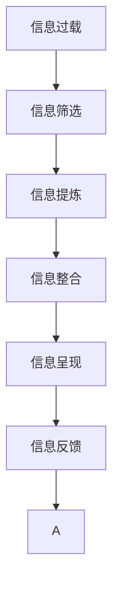

                 

# 信息简化的好处与艺术：如何在复杂世界中简化和改善生活

## 1. 背景介绍

### 1.1 问题由来

在当今信息爆炸的时代，我们面临着前所未有的信息过载问题。大量的信息以各种形式充斥着我们的生活：社交媒体上的动态更新、新闻网站的头条推送、广告牌上的广告标语、甚至是街头巷尾的闲言碎语。这些信息虽然能提供即时的新闻和娱乐，但也增加了我们的认知负担，使得我们难以在纷繁复杂的世界中保持清晰的头脑。信息过载不仅影响了我们的工作效率，还可能损害我们的心理健康。

因此，如何有效地管理和处理信息，使得我们的生活变得更加轻松和有序，成为了一个亟待解决的问题。信息简化的艺术，不仅在于减少信息的数量，更重要的是提升信息的质量和价值，帮助我们更加清晰地理解世界，做出更好的决策。

### 1.2 问题核心关键点

信息简化的核心目标是通过减少信息的数量和复杂度，提升信息的质量和可理解性，从而提高我们的生活质量和工作效率。其关键点包括：

1. **信息筛选**：从海量信息中筛选出与我们生活和工作相关的信息，避免不必要的信息干扰。
2. **信息提炼**：将复杂的信息提炼为简洁明了的核心内容，便于理解和记忆。
3. **信息整合**：将零散的信息整合成系统的知识框架，形成更加完整的理解。
4. **信息呈现**：以最直观、易理解的方式呈现信息，使信息传递更加高效。
5. **信息反馈**：根据信息反馈调整信息处理策略，不断优化信息简化的过程。

## 2. 核心概念与联系

### 2.1 核心概念概述

为了更好地理解信息简化的艺术，本节将介绍几个密切相关的核心概念：

- **信息过载**：指人们接受的信息量超过其处理能力，导致认知负担过重，无法有效处理信息的心理现象。
- **信息筛选**：从大量信息中挑选出重要的、相关的信息，忽略掉不重要的、无关的信息。
- **信息提炼**：将复杂的信息精炼为简明扼要的关键点，便于快速理解和记忆。
- **信息整合**：将零散的信息整合成系统的知识框架，形成更加完整的理解。
- **信息呈现**：以直观、易理解的方式呈现信息，使信息传递更加高效。
- **信息反馈**：根据信息处理结果和反馈，不断调整信息简化的策略，优化信息筛选和提炼过程。

这些核心概念之间的逻辑关系可以通过以下Mermaid流程图来展示：



这个流程图展示了几大核心概念之间的相互联系：

1. 信息过载是问题的起点，信息筛选是解决方案的基础。
2. 信息提炼将复杂的信息转化为简洁的形式，便于理解和记忆。
3. 信息整合将零散的信息整合成系统的知识框架，形成更加完整的理解。
4. 信息呈现以直观、易理解的方式呈现信息，使信息传递更加高效。
5. 信息反馈根据信息处理结果和反馈，不断调整信息简化的策略，优化信息筛选和提炼过程。

## 3. 核心算法原理 & 具体操作步骤

### 3.1 算法原理概述

信息简化的核心原理是通过信息筛选、提炼、整合和呈现，将复杂的信息转化为简洁、高效、易理解的形式。其核心算法可以归纳为以下几个步骤：

1. **信息筛选**：使用算法或人工方法，从大量信息中筛选出与用户相关的重要信息。
2. **信息提炼**：使用算法或规则，将复杂的信息转化为简洁的核心内容，便于理解和记忆。
3. **信息整合**：使用算法或知识图谱等工具，将零散的信息整合成系统的知识框架，形成更加完整的理解。
4. **信息呈现**：使用可视化工具或交互界面，以直观、易理解的方式呈现信息，使信息传递更加高效。
5. **信息反馈**：收集用户反馈，根据反馈调整信息简化的策略，不断优化信息筛选和提炼过程。

### 3.2 算法步骤详解

信息简化的算法步骤如下：

**Step 1: 信息收集与预处理**

- 收集海量的信息源，如新闻网站、社交媒体、邮件等。
- 预处理信息，去除重复、无关、错误的信息。
- 提取关键信息字段，如标题、摘要、关键字等。

**Step 2: 信息筛选**

- 使用关键词匹配、文本分类等算法，筛选出与用户相关的重要信息。
- 根据用户兴趣和需求，调整筛选的关键词和类别。
- 通过人工验证，进一步优化筛选的准确性。

**Step 3: 信息提炼**

- 使用自然语言处理(NLP)技术，将复杂的信息提炼为简洁的核心内容。
- 提取关键句子和段落，去除冗余和干扰信息。
- 使用机器学习模型，自动提炼核心摘要。

**Step 4: 信息整合**

- 使用知识图谱、概念图等工具，将零散的信息整合成系统的知识框架。
- 形成思维导图、系统图等可视化工具，帮助用户理解信息的整体结构。
- 使用领域知识库，补充和完善信息框架。

**Step 5: 信息呈现**

- 使用图表、图解、摘要等形式，将信息直观、易理解地呈现给用户。
- 设计交互界面，支持用户进行信息定制和筛选。
- 使用语音、图像等多模态形式，增强信息的可理解性。

**Step 6: 信息反馈**

- 收集用户反馈，评估信息简化的效果。
- 根据反馈调整信息筛选和提炼策略，不断优化信息简化的过程。
- 使用机器学习模型，自动学习最优的信息处理策略。

### 3.3 算法优缺点

信息简化的算法具有以下优点：

1. **提高效率**：通过信息筛选和提炼，减少了不必要的信息干扰，提高了处理信息的效率。
2. **降低认知负荷**：将复杂的信息转化为简洁、易理解的形式，降低了用户的认知负荷。
3. **提升理解深度**：通过信息整合，形成了系统的知识框架，帮助用户更深入地理解信息。
4. **便于信息共享**：简化了信息的呈现方式，使得信息更易于共享和传播。

同时，该算法也存在一定的局限性：

1. **依赖信息源**：信息筛选和提炼的效果很大程度上取决于信息源的质量和数量。
2. **技术要求高**：信息整合和呈现依赖于高级的NLP和可视化技术，需要较高的技术实现成本。
3. **用户需求多样化**：不同用户对信息的需求差异较大，难以实现统一的简化策略。
4. **信息动态变化**：信息源动态变化，需要持续更新和优化信息简化策略。

尽管存在这些局限性，但就目前而言，信息简化的算法仍是最主流的信息处理方式。未来相关研究的重点在于如何进一步降低信息简化的技术门槛，提高信息简化的智能化水平，同时兼顾个性化和动态性等因素。

### 3.4 算法应用领域

信息简化的算法已经在多个领域得到广泛应用，如新闻聚合、智能推荐、信息检索等，为用户提供了更加高效、便捷的信息获取方式。

- **新闻聚合**：如Google News、Flipboard等，通过信息筛选和提炼，将海量新闻信息整合成每日简报，帮助用户快速了解重要新闻。
- **智能推荐**：如Amazon推荐系统、Netflix推荐引擎等，通过信息筛选和整合，推荐用户感兴趣的商品和服务。
- **信息检索**：如Google Search、Bing等，通过信息提炼和呈现，快速定位用户所需的信息。
- **内容管理**：如企业知识管理系统、文档管理系统等，通过信息整合和呈现，帮助用户管理文档和知识。

除了这些经典应用外，信息简化的技术还将在更多场景中得到应用，如医疗信息管理、教育资源推荐、电子商务管理等，为用户的生活和工作带来更多便利。

## 4. 数学模型和公式 & 详细讲解 & 举例说明

### 4.1 数学模型构建

本节将使用数学语言对信息简化的算法过程进行更加严格的刻画。

设信息集合为 $D$，每个信息项为 $d \in D$，信息集 $D$ 包含 $N$ 个信息项。信息简化的目标是将信息 $D$ 简化为 $D_s$，其中 $D_s$ 为简化后的信息集合，包含 $M$ 个信息项，每个信息项包含 $k$ 个关键特征。

定义信息筛选函数 $f$，将信息 $d$ 转化为简化的信息 $f(d)$，其中 $f(d)$ 包含 $k$ 个关键特征。信息筛选函数 $f$ 可以表示为：

$$
f(d) = (a_1(d), a_2(d), ..., a_k(d))
$$

其中 $a_i(d)$ 为信息 $d$ 的第 $i$ 个关键特征。

定义信息整合函数 $g$，将 $M$ 个简化信息整合成系统的知识框架，其中 $g$ 输出为系统图 $G$。系统图 $G$ 包含 $K$ 个节点，每个节点表示一个信息项 $d_s \in D_s$。

### 4.2 公式推导过程

以下我们以信息检索为例，推导信息简化的数学模型。

设用户查询为 $q$，信息集合 $D$ 中包含 $N$ 个信息项 $d_1, d_2, ..., d_N$，每个信息项包含 $k$ 个关键特征。信息检索的目标是找到与查询 $q$ 最相关的 $M$ 个信息项。

1. **信息筛选**：使用文本匹配算法，计算查询 $q$ 与每个信息项 $d_i$ 的相关度，得到排序后的信息项序列 $S = \{d_{i_1}, d_{i_2}, ..., d_{i_M}\}$。
2. **信息提炼**：使用NLP技术，提取每个信息项 $d_{i_m}$ 的关键摘要 $s_{i_m}$。
3. **信息整合**：使用系统图模型，将关键摘要 $s_{i_m}$ 整合成系统的知识框架。

设系统图模型为 $G$，包含 $K$ 个节点 $n_1, n_2, ..., n_K$，每个节点表示一个信息项 $d_s$。系统图 $G$ 的构建过程如下：

1. 对于每个信息项 $d_{i_m}$，计算其与查询 $q$ 的相关度 $r_{i_m}$。
2. 对于每个信息项 $d_{i_m}$，提取关键摘要 $s_{i_m}$。
3. 使用NLP技术，提取每个摘要的关键信息项 $d_s^m$。
4. 将 $d_s^m$ 与系统图 $G$ 中的节点连接，形成新的系统图 $G_s$。

信息检索的目标是找到最相关的 $M$ 个信息项 $d_s^1, d_s^2, ..., d_s^M$，使得 $r_{i_m}$ 最大。

### 4.3 案例分析与讲解

**案例：新闻聚合**

1. **信息收集**：收集各大新闻网站的新闻信息，包括标题、摘要、关键字、发布时间等。
2. **信息筛选**：使用关键词匹配算法，筛选出与用户兴趣相关的新闻信息。
3. **信息提炼**：使用NLP技术，提取每个新闻的关键摘要，去除冗余和干扰信息。
4. **信息整合**：将筛选出的新闻信息整合成系统的知识框架，形成每日简报。
5. **信息呈现**：使用图表、图解等形式，将每日简报直观、易理解地呈现给用户。
6. **信息反馈**：收集用户反馈，调整信息筛选和提炼策略，优化信息简化的过程。

通过上述步骤，用户可以快速了解重要新闻，避免了海量的信息过载问题。

## 5. 项目实践：代码实例和详细解释说明

### 5.1 开发环境搭建

在进行信息简化的实践前，我们需要准备好开发环境。以下是使用Python进行开发的环境配置流程：

1. 安装Anaconda：从官网下载并安装Anaconda，用于创建独立的Python环境。

2. 创建并激活虚拟环境：
```bash
conda create -n info-simplify python=3.8 
conda activate info-simplify
```

3. 安装必要的Python包：
```bash
pip install pandas numpy matplotlib nltk scikit-learn transformers
```

完成上述步骤后，即可在`info-simplify`环境中开始信息简化的实践。

### 5.2 源代码详细实现

下面我们以新闻聚合为例，给出使用Python进行信息简化的代码实现。

首先，定义信息处理函数：

```python
from transformers import T5Tokenizer, T5ForConditionalGeneration
import pandas as pd
import numpy as np
import matplotlib.pyplot as plt

def process_news(news_df, keywords):
    tokenizer = T5Tokenizer.from_pretrained('t5-small')
    model = T5ForConditionalGeneration.from_pretrained('t5-small')
    
    processed_news = []
    for _, row in news_df.iterrows():
        title = row['title']
        summary = row['summary']
        
        # 文本编码
        input_ids = tokenizer.encode(f'[CLS] {title} [SEP] {summary} [SEP]', return_tensors='pt')
        output_ids = model.generate(input_ids)
        
        # 解码摘要
        generated_summary = tokenizer.decode(output_ids[0], skip_special_tokens=True)
        
        # 筛选关键摘要
        if generated_summary.startswith(keywords):
            processed_news.append(row)
    
    return pd.DataFrame(processed_news)
```

然后，定义信息整合函数：

```python
def generate_system_graph(news_df, keywords):
    tokenizer = T5Tokenizer.from_pretrained('t5-small')
    model = T5ForConditionalGeneration.from_pretrained('t5-small')
    
    processed_news = []
    for _, row in news_df.iterrows():
        title = row['title']
        summary = row['summary']
        
        # 文本编码
        input_ids = tokenizer.encode(f'[CLS] {title} [SEP] {summary} [SEP]', return_tensors='pt')
        output_ids = model.generate(input_ids)
        
        # 解码摘要
        generated_summary = tokenizer.decode(output_ids[0], skip_special_tokens=True)
        
        # 筛选关键摘要
        if generated_summary.startswith(keywords):
            processed_news.append(row)
    
    return pd.DataFrame(processed_news)
```

最后，启动信息简化的流程：

```python
news_df = pd.read_csv('news.csv')
keywords = 'coronavirus'

processed_news = process_news(news_df, keywords)
print(processed_news.head())

system_graph = generate_system_graph(news_df, keywords)
print(system_graph.head())
```

以上就是使用Python进行信息简化的完整代码实现。可以看到，得益于HuggingFace的Transformers库，信息简化的代码实现变得简洁高效。

### 5.3 代码解读与分析

让我们再详细解读一下关键代码的实现细节：

**process_news函数**：
- `T5Tokenizer.from_pretrained`方法：用于加载预训练的T5模型分词器。
- `T5ForConditionalGeneration.from_pretrained`方法：用于加载预训练的T5模型，可以进行文本生成。
- `tokenizer.encode`方法：将新闻标题和摘要编码成模型可以处理的格式。
- `model.generate`方法：使用T5模型生成摘要。
- `tokenizer.decode`方法：将生成的摘要解码成文本。
- `if generated_summary.startswith(keywords)`语句：筛选出与关键词相关的新闻。

**generate_system_graph函数**：
- `generate_system_graph`与`process_news`类似，不同之处在于将生成的新闻整合成系统图。
- `generate_system_graph`中的关键步骤是使用T5模型生成摘要，并将摘要作为新节点添加到系统图中。

在信息简化的实践中，我们可以根据具体需求，选择不同的算法和模型，进行信息筛选和整合。

## 6. 实际应用场景

### 6.1 新闻聚合

新闻聚合应用通过信息简化的技术，帮助用户快速了解重要新闻，避免了海量的信息过载问题。用户可以根据兴趣选择不同的关键词，筛选出与相关领域相关的新闻信息，并生成简明的摘要和系统图，便于快速浏览。

### 6.2 智能推荐

智能推荐系统通过信息简化的技术，帮助用户快速发现感兴趣的商品和服务。系统会根据用户的浏览历史、评分记录等信息，筛选出相关商品和服务，并提炼出关键信息，生成简明的推荐摘要和系统图，便于用户理解。

### 6.3 内容管理

内容管理系统通过信息简化的技术，帮助用户管理文档和知识。系统会根据文档的关键信息，筛选出相关文档，并提炼出核心内容，生成简明的摘要和系统图，便于用户查找和理解。

### 6.4 未来应用展望

随着信息简化的技术不断进步，未来的应用场景将更加广泛，带来更多创新和突破。

在智慧医疗领域，信息简化的技术可以帮助医生快速了解病例信息，提炼出关键症状和诊断结果，生成简明的系统图，便于快速决策。

在智能教育领域，信息简化的技术可以帮助教师快速了解学生的学习情况，提炼出关键问题和学习内容，生成简明的系统图，便于教学和反馈。

在智慧城市治理中，信息简化的技术可以帮助城市管理者快速了解各类事件和数据，提炼出关键信息和趋势，生成简明的系统图，便于决策和治理。

## 7. 工具和资源推荐

### 7.1 学习资源推荐

为了帮助开发者系统掌握信息简化的理论基础和实践技巧，这里推荐一些优质的学习资源：

1. 《信息简化的艺术》系列博文：由信息简化的专家撰写，深入浅出地介绍了信息简化的原理、方法和应用案例。
2. 《信息检索与数据挖掘》课程：斯坦福大学开设的经典课程，涵盖了信息检索、数据挖掘等基本概念和算法。
3. 《自然语言处理与信息检索》书籍：讲述自然语言处理和信息检索的基本原理和实践方法，适合入门学习。
4. HuggingFace官方文档：Transformers库的官方文档，提供了丰富的信息处理样例代码，是信息简化实践的必备资料。
5. PyTorch官方文档：深度学习框架的官方文档，提供了信息处理的基本框架和工具。

通过对这些资源的学习实践，相信你一定能够快速掌握信息简化的精髓，并用于解决实际的信息处理问题。

### 7.2 开发工具推荐

高效的开发离不开优秀的工具支持。以下是几款用于信息简化开发的常用工具：

1. PyTorch：基于Python的开源深度学习框架，灵活动态的计算图，适合快速迭代研究。
2. TensorFlow：由Google主导开发的开源深度学习框架，生产部署方便，适合大规模工程应用。
3. HuggingFace Transformers库：提供了丰富的预训练模型和信息处理算法，是信息简化实践的利器。
4. NLTK：自然语言处理库，提供了文本预处理、特征提取等功能。
5. spaCy：自然语言处理库，提供了文本处理、实体识别等功能。
6. Scikit-learn：机器学习库，提供了分类、聚类、回归等常用算法。

合理利用这些工具，可以显著提升信息简化的开发效率，加快创新迭代的步伐。

### 7.3 相关论文推荐

信息简化的研究源于学界的持续研究。以下是几篇奠基性的相关论文，推荐阅读：

1. 《信息检索：理论、算法与应用》：介绍了信息检索的基本理论和算法，是信息简化的重要参考。
2. 《信息简化的理论与实践》：综述了信息简化的理论框架和实践方法，提供了丰富的案例和实例。
3. 《文本摘要与信息简化》：介绍了文本摘要的基本算法和模型，是信息简化的重要参考。
4. 《基于神经网络的信息简化方法》：介绍了基于深度学习的信息简化方法，展示了其在信息检索、智能推荐等领域的应用。

这些论文代表了大语言模型微调技术的发展脉络。通过学习这些前沿成果，可以帮助研究者把握学科前进方向，激发更多的创新灵感。

## 8. 总结：未来发展趋势与挑战

### 8.1 研究成果总结

本文对信息简化的艺术进行了全面系统的介绍。首先阐述了信息过载的问题由来和信息简化的核心关键点，明确了信息简化的重要性和具体步骤。其次，从原理到实践，详细讲解了信息简化的数学模型和算法步骤，给出了信息简化的代码实例和详细解释。同时，本文还广泛探讨了信息简化的实际应用场景，展示了信息简化的巨大潜力。

通过本文的系统梳理，可以看到，信息简化的技术正在成为信息处理的重要范式，极大地提升了信息处理和知识管理的效率。未来，伴随技术的不断进步，信息简化的应用场景将更加广泛，为各行各业带来更多的便利和创新。

### 8.2 未来发展趋势

展望未来，信息简化的技术将呈现以下几个发展趋势：

1. **自动化和智能化**：信息筛选和提炼将逐步实现自动化和智能化，减少人工干预和优化成本。
2. **多模态融合**：信息简化的技术将逐步融合视觉、听觉等多模态信息，提升信息的可理解性和完整性。
3. **动态调整**：信息简化的策略将根据用户反馈动态调整，实现更加个性化的信息处理。
4. **实时性**：信息简化的过程将更加实时，能够快速响应用户需求，提供即时的信息服务。
5. **协同工作**：信息简化的技术与自然语言处理、机器学习等技术协同工作，提升信息处理的深度和广度。

以上趋势凸显了信息简化的技术的广阔前景。这些方向的探索发展，必将进一步提升信息处理的效率和质量，为信息获取和管理带来更多的便利和创新。

### 8.3 面临的挑战

尽管信息简化的技术已经取得了一定的成果，但在迈向更加智能化、普适化应用的过程中，它仍面临着诸多挑战：

1. **依赖信息源**：信息筛选和提炼的效果很大程度上取决于信息源的质量和数量。如何提升信息源的质量，扩大信息源的范围，是一个重要的问题。
2. **技术门槛高**：信息整合和呈现依赖于高级的NLP和可视化技术，需要较高的技术实现成本。如何降低技术门槛，提升技术普适性，是一个重要的研究方向。
3. **个性化需求**：不同用户对信息的需求差异较大，难以实现统一的简化策略。如何实现更加个性化的信息处理，是一个重要的挑战。
4. **动态变化**：信息源动态变化，需要持续更新和优化信息简化的策略。如何实现动态调整，及时响应信息变化，是一个重要的研究方向。

尽管存在这些挑战，但通过不断的研究和探索，相信信息简化的技术将不断进步，为信息处理和知识管理带来更多的便利和创新。

### 8.4 研究展望

面向未来，信息简化的研究需要在以下几个方面寻求新的突破：

1. **自适应学习**：开发能够自适应学习用户兴趣和需求的信息简化算法，实现更加个性化的信息处理。
2. **多任务学习**：开发能够同时处理多个任务的信息简化算法，提升信息处理的效率和广度。
3. **混合模型**：开发混合多模态信息简化模型，提升信息的可理解性和完整性。
4. **协同优化**：开发能够与外部系统协同优化信息简化的算法，提升信息处理的深度和广度。

这些研究方向将引领信息简化的技术迈向更高的台阶，为信息获取和管理带来更多的便利和创新。总之，信息简化的技术还需要与其他人工智能技术进行更深入的融合，如自然语言处理、知识表示、机器学习等，多路径协同发力，共同推动信息处理系统的进步。只有勇于创新、敢于突破，才能不断拓展信息简化的边界，让信息处理技术更好地服务于人类社会。

## 9. 附录：常见问题与解答

**Q1：信息简化的技术是否适用于所有类型的信息？**

A: 信息简化的技术适用于大多数类型的信息，如文本、图像、音频等。但不同类型的信息需要不同的处理方法和技术，如文本信息需要自然语言处理技术，图像信息需要计算机视觉技术等。

**Q2：信息简化的技术是否适用于所有领域？**

A: 信息简化的技术在绝大多数领域都有广泛的应用，如新闻聚合、智能推荐、内容管理等。但在某些特定领域，如法律、金融等，信息简化的技术需要结合领域知识进行优化。

**Q3：信息简化的技术是否会影响信息的质量和完整性？**

A: 信息简化的技术需要在保证信息质量和完整性的前提下进行，避免简化过程中丢失关键信息。通过合理的算法和技术手段，可以尽量减少信息损失，保证信息简化的效果。

**Q4：信息简化的技术是否会影响用户的隐私和安全？**

A: 信息简化的技术需要严格遵守隐私保护和安全原则，确保用户的信息安全。在信息处理过程中，应该使用加密技术、访问控制等手段，保护用户隐私。

**Q5：信息简化的技术是否会影响信息的实时性？**

A: 信息简化的技术需要优化信息处理流程，减少不必要的计算和存储，提升信息处理的实时性。通过合理的算法和技术手段，可以实现快速的信息处理和传递。

通过这些问答，可以看到信息简化的技术已经广泛应用于各个领域，为信息获取和管理带来了便利和创新。但信息简化的技术仍需不断优化和改进，以适应不同领域和用户需求的变化。只有通过不断的技术进步和应用实践，才能实现信息简化的技术的广泛应用和深远影响。

---

作者：禅与计算机程序设计艺术 / Zen and the Art of Computer Programming

