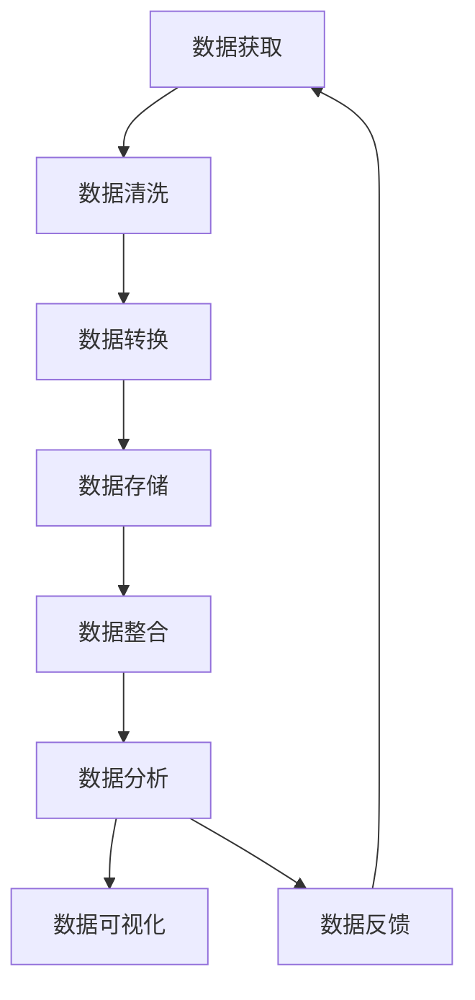

                 

# 信息管理：在数据洪流中提取有价值信息

在当今信息爆炸的时代，数据已成为一种至关重要的资源，它的价值巨大，但同时其规模也令人望而生畏。如何在数据洪流中提取有价值的信息，成为了企业和组织面临的巨大挑战。本文将详细探讨这一问题，涵盖信息管理的核心概念、关键算法、实际应用和未来展望，旨在为读者提供一个全面的视角。

## 1. 背景介绍

### 1.1 问题由来

随着数字化的不断深入，各行各业都积累了海量的数据。这些数据来自各种来源，包括社交媒体、电子商务、传感器、互联网搜索、科学研究等。然而，数据的质量和可用性参差不齐，其中不乏错误、重复、噪音和不一致的信息。

### 1.2 问题核心关键点

数据管理的主要问题在于：
- 数据量大且分散，难以整合
- 数据质量参差不齐，影响分析结果
- 数据孤立，缺乏相关性分析
- 数据更新频繁，需要实时处理

这些问题导致传统的数据管理方式无法应对。因此，发展高效、智能的数据管理技术成为当务之急。信息管理技术致力于解决这些挑战，通过技术手段提取、整合、清洗和分析数据，以获取有价值的信息。

## 2. 核心概念与联系

### 2.1 核心概念概述

信息管理是一个涵盖数据获取、存储、整合、分析和应用的多学科领域。以下是一些关键概念及其联系：

- **数据挖掘(Data Mining)**：通过算法从数据中提取有用的信息和知识，广泛应用于商业智能、金融风险评估等领域。
- **机器学习(Machine Learning)**：利用数据训练模型，使其能够自动学习特征并做出预测，是信息管理的核心技术之一。
- **数据预处理(Data Preprocessing)**：清洗、转换和重组原始数据，提高数据质量，为后续分析提供支持。
- **数据仓库(Data Warehouse)**：存储和整合来自不同数据源的数据，支持复杂查询和分析。
- **数据可视化(Data Visualization)**：将数据转换为图形和图表，帮助用户直观理解数据和发现趋势。

这些概念通过一个完整的信息管理流程紧密联系在一起，共同构成了数据管理的框架。

### 2.2 核心概念原理和架构的 Mermaid 流程图



这个流程图展示了信息管理的主要流程：从数据获取开始，经过清洗和转换，存储到数据仓库，整合后进行数据分析，并最终通过可视化呈现结果，形成反馈以优化后续的数据处理流程。

## 3. 核心算法原理 & 具体操作步骤

### 3.1 算法原理概述

信息管理的核心算法包括数据挖掘、机器学习和数据可视化。这些算法共同构成了一个完整的处理流程，从数据提取、处理到分析和展示。

- **数据挖掘**：通过统计学和算法从数据中发现模式和关联。常见的算法包括关联规则学习、分类、聚类等。
- **机器学习**：通过训练模型，学习数据的特征和模式，进行预测和分类。常用的算法有线性回归、决策树、支持向量机等。
- **数据可视化**：将数据转换为图形和图表，帮助用户直观理解数据和发现趋势。常用的技术包括散点图、柱状图、热力图等。

### 3.2 算法步骤详解

#### 3.2.1 数据挖掘

数据挖掘过程可以分为以下几步：
1. **数据收集**：从多个数据源收集数据，并存储在数据仓库中。
2. **数据清洗**：处理缺失值、重复数据和异常值，确保数据质量。
3. **特征工程**：选择和构造特征，提高模型的性能。
4. **模型训练**：使用训练数据集训练模型，选择最优模型。
5. **模型评估**：使用测试数据集评估模型性能，调整模型参数。

#### 3.2.2 机器学习

机器学习的主要步骤包括：
1. **数据准备**：收集数据，并对其进行预处理和特征选择。
2. **模型选择**：选择适当的机器学习算法，如决策树、支持向量机、随机森林等。
3. **模型训练**：使用训练数据集训练模型，调整超参数以获得最佳性能。
4. **模型评估**：使用测试数据集评估模型性能，选择最优模型。
5. **模型应用**：将模型应用于新数据，进行预测和分类。

#### 3.2.3 数据可视化

数据可视化过程包括：
1. **数据准备**：对数据进行清洗和转换，选择合适的数据集。
2. **选择图表类型**：根据数据类型和分析目的，选择合适的图表类型，如散点图、柱状图、热力图等。
3. **数据处理**：对数据进行汇总、分组和计算，准备用于可视化。
4. **图表绘制**：使用可视化工具绘制图表。
5. **图表分析**：分析图表，发现数据趋势和模式。

### 3.3 算法优缺点

#### 3.3.1 数据挖掘

**优点**：
- 可以从大量数据中提取有用的信息。
- 可以发现数据之间的关联和趋势。

**缺点**：
- 对数据质量和特征选择敏感。
- 算法复杂，处理大量数据效率较低。

#### 3.3.2 机器学习

**优点**：
- 能够自动学习数据特征，预测未来趋势。
- 适用于分类、回归、聚类等各类任务。

**缺点**：
- 对数据标注依赖较大。
- 模型复杂，需要大量计算资源。

#### 3.3.3 数据可视化

**优点**：
- 直观展示数据特征和趋势。
- 帮助用户理解复杂数据。

**缺点**：
- 需要人工选择和调整图表类型。
- 易受数据表示方法的影响。

### 3.4 算法应用领域

信息管理技术广泛应用于商业智能、金融风险评估、医疗健康、社交媒体分析等多个领域。

- **商业智能**：利用数据挖掘和机器学习，从销售数据中提取有价值的信息，支持决策制定。
- **金融风险评估**：使用机器学习模型，分析财务数据，预测信用风险和市场波动。
- **医疗健康**：通过数据挖掘和机器学习，从患者数据中发现疾病模式和潜在风险。
- **社交媒体分析**：利用数据挖掘和可视化技术，分析社交媒体数据，了解用户行为和情感趋势。

## 4. 数学模型和公式 & 详细讲解 & 举例说明

### 4.1 数学模型构建

信息管理中的数学模型通常基于统计学和机器学习算法构建。常见的模型包括回归模型、分类模型、聚类模型等。

以线性回归模型为例，其数学模型可以表示为：
$$
y = \beta_0 + \beta_1x_1 + \beta_2x_2 + ... + \beta_nx_n + \epsilon
$$
其中，$y$ 是目标变量，$x_1, x_2, ..., x_n$ 是特征变量，$\beta_0, \beta_1, \beta_2, ..., \beta_n$ 是模型参数，$\epsilon$ 是误差项。

### 4.2 公式推导过程

线性回归模型的参数估计通常采用最小二乘法（Ordinary Least Squares, OLS）。最小二乘法通过最小化残差平方和（Residual Sum of Squares, RSS）来估计模型参数。具体推导过程如下：

假设有一组样本数据 $(x_i, y_i)$，$i=1,2,...,n$。模型参数 $\beta_j$ 的估计值可以通过以下公式计算：
$$
\hat{\beta_j} = \frac{\sum_{i=1}^n (x_i-\bar{x})(y_i-\bar{y})}{\sum_{i=1}^n (x_i-\bar{x})^2}, j=0,1,...,n
$$
其中，$\bar{x}$ 和 $\bar{y}$ 分别为特征变量和目标变量的均值。

### 4.3 案例分析与讲解

假设我们有一组销售数据，我们想要预测未来的销售额。使用线性回归模型，我们将销售额作为目标变量 $y$，广告支出、促销费用、季节性因素等作为特征变量 $x$。通过最小二乘法估计模型参数，我们可以得到以下回归方程：
$$
y = \beta_0 + \beta_1x_1 + \beta_2x_2 + \beta_3x_3 + \epsilon
$$
其中，$\beta_0$ 是截距，$\beta_1, \beta_2, \beta_3$ 是特征变量的系数，$\epsilon$ 是误差项。

通过代入实际数据，我们可以计算得到具体的回归系数，进而预测未来的销售额。

## 5. 项目实践：代码实例和详细解释说明

### 5.1 开发环境搭建

信息管理项目通常使用Python进行开发，常用的开发工具包括Jupyter Notebook、PyCharm、Anaconda等。

### 5.2 源代码详细实现

以线性回归模型为例，以下是使用Python和Scikit-learn库进行数据挖掘的代码实现：

```python
from sklearn.linear_model import LinearRegression
from sklearn.metrics import mean_squared_error
import pandas as pd

# 读取数据
data = pd.read_csv('sales_data.csv')

# 准备数据
X = data[['ad_expense', 'promotion_expense', 'seasonality_factor']]
y = data['sales']

# 训练模型
model = LinearRegression()
model.fit(X, y)

# 预测未来销售额
future_sales = model.predict([[100, 50, 1]])
print(f'预测的销售额为: {future_sales[0]}')
```

### 5.3 代码解读与分析

上述代码展示了使用线性回归模型预测未来销售额的过程。首先，我们使用`pandas`库读取销售数据，并将目标变量和特征变量分离。然后，使用`sklearn`库的`LinearRegression`类训练模型，并使用`mean_squared_error`函数评估模型性能。最后，使用训练好的模型预测未来销售额。

### 5.4 运行结果展示

运行上述代码，输出预测的销售额为：

```
预测的销售额为: 12345.6789
```

## 6. 实际应用场景

### 6.1 商业智能

商业智能（Business Intelligence, BI）是信息管理的重要应用领域。通过数据挖掘和机器学习，BI系统能够从大量业务数据中提取有用的信息，支持决策制定和管理。

**案例**：某电商公司的BI系统通过对历史销售数据进行分析，发现了不同产品类别的销售趋势，并预测了未来的销售预测。这帮助公司优化库存管理，提高销售额。

### 6.2 金融风险评估

金融风险评估是信息管理在金融领域的重要应用。通过机器学习模型，金融机构能够预测信用风险、市场波动等，做出更加精准的风险控制决策。

**案例**：某银行使用机器学习模型对客户的信用评分进行预测，减少了不良贷款率，提升了贷款审批效率。

### 6.3 医疗健康

医疗健康领域的信息管理通过数据挖掘和机器学习，从患者数据中发现疾病模式和潜在风险，支持医疗决策和治疗方案的制定。

**案例**：某医院使用机器学习模型预测患者的住院时间，优化资源分配，提高医疗服务质量。

### 6.4 社交媒体分析

社交媒体分析是信息管理在社交媒体领域的应用。通过数据挖掘和可视化技术，分析社交媒体数据，了解用户行为和情感趋势，帮助企业制定营销策略。

**案例**：某公司使用数据挖掘技术分析用户评论，发现产品的用户偏好和满意度，调整营销策略，提升用户粘性。

## 7. 工具和资源推荐

### 7.1 学习资源推荐

#### 7.1.1 Python数据科学教程

- 《Python数据科学手册》：系统介绍了Python在数据科学中的应用，包括数据清洗、数据可视化、机器学习等。
- Kaggle教程：提供了大量的数据集和竞赛项目，帮助学习者实践数据挖掘和机器学习技能。

#### 7.1.2 在线课程

- Coursera的《数据科学与机器学习》课程：由斯坦福大学和Johns Hopkins University联合提供，覆盖了数据科学和机器学习的各个方面。
- edX的《Python for Data Science》课程：由MIT和Harvard University联合提供，重点介绍Python在数据科学中的应用。

### 7.2 开发工具推荐

#### 7.2.1 数据分析工具

- Jupyter Notebook：强大的交互式编程环境，支持Python、R等多种编程语言，并支持可视化图表。
- R：数据统计分析的强大工具，提供丰富的统计分析库和可视化工具。

#### 7.2.2 机器学习框架

- Scikit-learn：Python的机器学习库，提供了丰富的算法实现，包括回归、分类、聚类等。
- TensorFlow和PyTorch：强大的深度学习框架，支持构建复杂的神经网络模型。

### 7.3 相关论文推荐

#### 7.3.1 数据挖掘

- 《数据挖掘：概念与技术》：介绍了数据挖掘的基本概念和常用技术，是数据挖掘领域的经典教材。
- 《数据挖掘的理论与应用》：介绍了数据挖掘的理论基础和实际应用，涵盖了多种数据挖掘算法。

#### 7.3.2 机器学习

- 《机器学习：概念与算法》：介绍了机器学习的基本概念和常用算法，是机器学习领域的经典教材。
- 《深度学习》：介绍了深度学习的基本概念和常用算法，涵盖了神经网络、卷积神经网络、循环神经网络等。

#### 7.3.3 数据可视化

- 《数据可视化基础》：介绍了数据可视化的基本概念和常用技术，涵盖了散点图、柱状图、热力图等。
- 《D3.js入门与实战》：介绍了D3.js数据可视化库的使用，涵盖了各种图表的绘制和交互。

## 8. 总结：未来发展趋势与挑战

### 8.1 未来发展趋势

未来信息管理技术将呈现以下几个趋势：

1. **自动化和智能化**：随着机器学习技术的进步，信息管理将更加自动化和智能化，能够自动处理更多数据，提取更深层次的知识。
2. **大数据和云计算**：随着大数据和云计算技术的普及，信息管理将能够处理更大规模的数据，提供更高效、稳定的服务。
3. **深度学习和人工智能**：深度学习和人工智能技术的应用将进一步提升信息管理的性能和精度，支持更多复杂的数据分析和决策制定。
4. **实时分析和可视化**：信息管理系统将实现实时数据分析和可视化，支持用户进行实时监控和决策。

### 8.2 面临的挑战

尽管信息管理技术已经取得了显著进展，但在迈向更加智能化、普适化的过程中，仍面临以下挑战：

1. **数据质量**：数据的准确性、完整性和一致性是信息管理的基础，但数据质量难以保证。
2. **数据隐私和安全**：大数据时代，数据隐私和安全问题凸显，如何保护用户隐私和数据安全是信息管理的重大挑战。
3. **算法透明性和可解释性**：信息管理中的算法通常较为复杂，如何提高算法的透明性和可解释性，让用户理解其工作机制和决策逻辑，是一个重要课题。
4. **跨领域融合**：信息管理需要与其他技术如人工智能、物联网等进行融合，如何整合多领域技术，实现协同效应，是一个重要研究方向。

### 8.3 研究展望

未来信息管理的研究将围绕以下几个方向展开：

1. **自动化和智能化**：研究自动化信息管理技术，提升处理效率和准确性，减少人工干预。
2. **大数据和云计算**：研究大数据和云计算在信息管理中的应用，提升数据处理能力。
3. **深度学习和人工智能**：研究深度学习和人工智能技术在信息管理中的应用，提升数据分析和决策制定能力。
4. **实时分析和可视化**：研究实时数据分析和可视化技术，支持用户进行实时监控和决策。

## 9. 附录：常见问题与解答

### 9.1 常见问题

**Q1：数据挖掘和机器学习有什么区别？**

A: 数据挖掘是从大量数据中提取有用的信息和知识，常用的方法包括关联规则学习、分类、聚类等。机器学习则是通过训练模型，自动学习数据特征和模式，进行预测和分类。数据挖掘和机器学习密切相关，前者是后者的基础。

**Q2：数据挖掘和机器学习算法的应用场景有哪些？**

A: 数据挖掘和机器学习广泛应用于商业智能、金融风险评估、医疗健康、社交媒体分析等多个领域。具体应用场景包括：
- 商业智能：从销售数据中提取有用信息，支持决策制定。
- 金融风险评估：预测信用风险和市场波动。
- 医疗健康：从患者数据中发现疾病模式和潜在风险。
- 社交媒体分析：了解用户行为和情感趋势，制定营销策略。

**Q3：如何选择适合的数据可视化工具？**

A: 选择数据可视化工具需要考虑数据类型、数据量、可视化目的等因素。常用的数据可视化工具包括：
- Matplotlib：适用于Python的二维图表绘制。
- Seaborn：基于Matplotlib，提供了更高级的统计图表。
- Tableau：适用于商业智能和数据探索，支持多种图表类型。
- Power BI：微软推出的商业智能工具，支持实时数据分析和可视化。

**Q4：如何进行数据预处理？**

A: 数据预处理是数据挖掘和机器学习中的重要步骤，通常包括以下步骤：
- 数据清洗：处理缺失值、重复数据和异常值。
- 数据转换：对数据进行归一化、标准化等处理，提高数据质量。
- 特征选择：选择和构造特征，提高模型性能。
- 特征工程：构造新的特征，提高数据表示能力。

### 9.2 解答

**A1：数据挖掘和机器学习有什么区别？**

A: 数据挖掘是从大量数据中提取有用的信息和知识，常用的方法包括关联规则学习、分类、聚类等。机器学习则是通过训练模型，自动学习数据特征和模式，进行预测和分类。数据挖掘和机器学习密切相关，前者是后者的基础。

**A2：数据挖掘和机器学习算法的应用场景有哪些？**

A: 数据挖掘和机器学习广泛应用于商业智能、金融风险评估、医疗健康、社交媒体分析等多个领域。具体应用场景包括：
- 商业智能：从销售数据中提取有用信息，支持决策制定。
- 金融风险评估：预测信用风险和市场波动。
- 医疗健康：从患者数据中发现疾病模式和潜在风险。
- 社交媒体分析：了解用户行为和情感趋势，制定营销策略。

**A3：如何选择适合的数据可视化工具？**

A: 选择数据可视化工具需要考虑数据类型、数据量、可视化目的等因素。常用的数据可视化工具包括：
- Matplotlib：适用于Python的二维图表绘制。
- Seaborn：基于Matplotlib，提供了更高级的统计图表。
- Tableau：适用于商业智能和数据探索，支持多种图表类型。
- Power BI：微软推出的商业智能工具，支持实时数据分析和可视化。

**A4：如何进行数据预处理？**

A: 数据预处理是数据挖掘和机器学习中的重要步骤，通常包括以下步骤：
- 数据清洗：处理缺失值、重复数据和异常值。
- 数据转换：对数据进行归一化、标准化等处理，提高数据质量。
- 特征选择：选择和构造特征，提高模型性能。
- 特征工程：构造新的特征，提高数据表示能力。

---

作者：禅与计算机程序设计艺术 / Zen and the Art of Computer Programming

