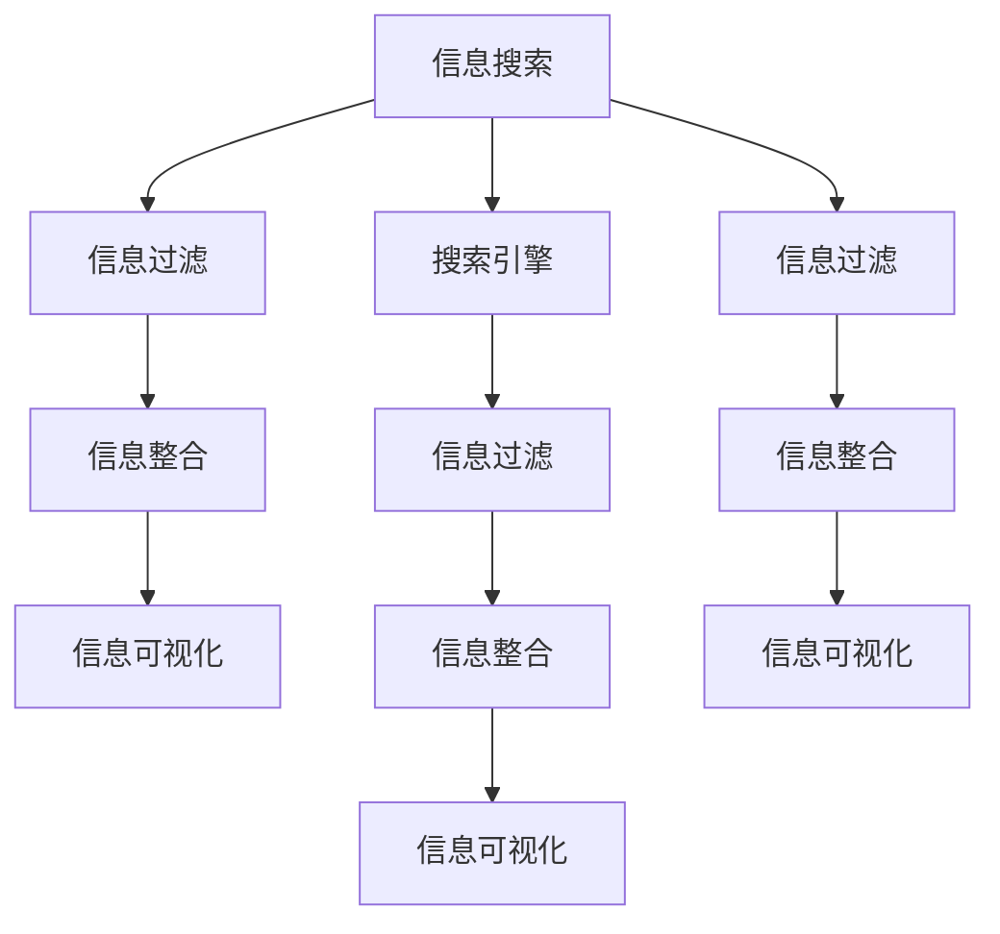

                 

## 1. 背景介绍

在信息时代，互联网的迅猛发展与智能设备的普及带来了前所未有的信息过载现象。从日常生活中的新闻推送、搜索引擎，到工作中电子邮件、项目管理软件，我们每天都被各种信息所包围。信息过载不仅使我们难以从海量信息中提取有价值的内容，还可能造成认知负担，影响我们的决策和效率。

解决信息过载问题，需要掌握有效搜索与组织信息的能力。本文章将深入探讨信息搜索的核心概念、原理与实践，通过构建系统的信息搜索指南，帮助读者在庞大的信息海洋中找到所需的信息。

## 2. 核心概念与联系

### 2.1 核心概念概述

- **信息搜索**：在大量数据源中查找相关信息的过程。通常通过关键字查询、全文检索、主题索引等技术实现。
- **搜索引擎**：使用自然语言处理、机器学习等技术，根据用户的查询意图返回相关网页的技术平台。如Google、Bing等。
- **信息过滤**：根据用户的偏好、历史行为等信息，自动筛选和推荐有用信息的技术。如推荐系统、内容过滤器。
- **信息整合**：将不同来源、格式的信息进行整合与关联，生成新的知识或理解的技术。如语义网络、知识图谱。
- **信息可视化**：使用图表、地图等直观形式，展示数据关系与趋势的技术。如DataViz、GIS。

这些核心概念之间存在紧密的联系。信息搜索是信息过滤和信息整合的基础，信息过滤和信息整合为信息可视化提供了数据支撑，而信息可视化又提升了信息搜索和信息过滤的效果。

### 2.2 核心概念原理和架构的 Mermaid 流程图



## 3. 核心算法原理 & 具体操作步骤

### 3.1 算法原理概述

信息搜索的核心算法基于信息检索技术。它通过分析用户的查询意图，匹配信息源中的相关内容，并按照相关度排序返回结果。常用的信息检索算法包括布尔查询、向量空间模型、主题模型等。

### 3.2 算法步骤详解

#### 3.2.1 信息获取

信息获取是信息搜索的第一步。通常包括网络爬虫抓取网页、数据库查询、API获取数据等方法。爬虫需要设计合理的URL选择策略和网页解析算法，以确保获取的信息全面且无重复。

#### 3.2.2 信息预处理

获取的信息可能包含噪声、冗余等无用数据，需要进行预处理以提取出有用内容。预处理步骤包括：

- **文本清洗**：去除HTML标签、特殊符号、停用词等干扰信息。
- **文本分词**：将文本分割成词汇单元，方便后续处理。
- **词性标注**：标注词汇的词性，如名词、动词、形容词等，以便识别重要信息。
- **实体识别**：识别文本中的人名、地名、机构名等实体，进行命名实体识别。

#### 3.2.3 信息表示

将信息转换为计算机可以处理的形式。常用的信息表示方法包括：

- **布尔查询**：将查询条件转换为逻辑表达式，直接匹配文档集合。
- **向量空间模型(VSM)**：将文本转换为向量，根据向量之间的余弦相似度计算相关度。
- **主题模型**：通过LDA、LSI等算法，提取文本中的潜在主题，计算查询与主题的相似度。

#### 3.2.4 信息检索

根据用户查询意图，检索与查询最相关的文档。检索算法通常分为召回和排序两个步骤：

- **召回**：在信息集合中查找包含查询词的文档。
- **排序**：根据相关度对召回结果进行排序，通常使用倒排索引、TF-IDF等算法。

#### 3.2.5 信息反馈与优化

用户对检索结果的反馈（如点击、阅读时间等）被用于优化检索算法。常用的方法包括：

- **机器学习**：使用监督学习算法，根据用户反馈训练检索模型，提升相关度计算的准确性。
- **主动学习**：通过主动选择最可能包含用户所需信息的文档，提升查询效率。

### 3.3 算法优缺点

信息搜索的优点包括：

- **高效性**：能够快速从大量数据中检索相关信息。
- **可扩展性**：随着数据量的增长，搜索系统可以自动扩容，处理更多信息。
- **自动化**：用户只需输入查询词，系统自动完成信息检索与排序。

缺点包括：

- **复杂度**：大规模数据集和复杂查询条件可能导致计算资源消耗大。
- **噪声干扰**：网页内容不规范、网页结构不一致等可能影响检索结果的准确性。
- **语义理解**：传统搜索难以理解查询词的语义，导致误匹配。

### 3.4 算法应用领域

信息搜索技术广泛应用于以下领域：

- **图书馆检索**：通过关键词查询、分类检索等方式，帮助用户快速定位所需图书。
- **互联网搜索**：如Google、Bing等搜索引擎，帮助用户查找网页、图片、视频等互联网资源。
- **企业知识管理**：用于企业内部文档、项目资料、客户信息的搜索与组织。
- **智能推荐系统**：通过用户历史行为，推荐相关商品、内容或用户。
- **个性化新闻推荐**：根据用户兴趣，推荐个性化新闻内容。

## 4. 数学模型和公式 & 详细讲解 & 举例说明

### 4.1 数学模型构建

信息检索的数学模型通常包括以下几个部分：

- **查询模型**：描述用户查询意图，如TF-IDF模型、LSI模型等。
- **文档模型**：描述文档内容，如倒排索引、TF-IDF模型等。
- **相关度模型**：计算查询与文档的相关度，如BM25模型、语言模型等。

### 4.2 公式推导过程

以TF-IDF模型为例，其公式如下：

$$
IDF(t) = \log \frac{N}{n_t} \\
TF(t|d) = \frac{f_t(d)}{\sum_k f_k(d)}
$$

其中，$IDF(t)$表示词$t$在所有文档中的逆文档频率，$TF(t|d)$表示词$t$在文档$d$中的词频权重。

向量空间模型(VSM)的计算过程如下：

1. 将查询和文档转换为向量。
2. 计算向量间的余弦相似度：
$$
cos\theta = \frac{u \cdot v}{\|u\| \cdot \|v\|}
$$

### 4.3 案例分析与讲解

假设查询词为"人工智能"，搜索结果中包含"机器学习"、"深度学习"、"自然语言处理"等词。VSM模型会将这些词分别转换为向量，计算查询向量与文档向量的余弦相似度，排序后返回相关文档。

## 5. 项目实践：代码实例和详细解释说明

### 5.1 开发环境搭建

信息搜索系统开发需要搭建Python环境，安装必要的库如NLTK、Scikit-learn、Gensim等。

```bash
pip install nltk scikit-learn gensim
```

### 5.2 源代码详细实现

以下是一个简单的搜索引擎示例代码，使用了Scikit-learn库进行TF-IDF计算：

```python
from sklearn.feature_extraction.text import TfidfVectorizer
from sklearn.metrics.pairwise import cosine_similarity

# 查询词列表
query_words = ['人工智能', '机器学习', '深度学习']

# 文档列表
docs = [
    '人工智能是研究计算机模拟人类智能问题的科学。',
    '机器学习是人工智能的一个分支，专注于如何让计算机从数据中学习。',
    '深度学习是机器学习的一种，使用多层神经网络进行模式识别。',
    '自然语言处理是人工智能的一个重要应用领域，涉及文本处理和理解。'
]

# 文本预处理
vectorizer = TfidfVectorizer(stop_words='english')
tfidf = vectorizer.fit_transform(docs)

# 计算查询词的TF-IDF向量
query_tfidf = vectorizer.transform(query_words)

# 计算文档与查询的余弦相似度
cosine_sim = cosine_similarity(query_tfidf, tfidf)

# 输出相似度最高的文档
for i in range(len(docs)):
    if cosine_sim[0][i] > 0.8:
        print(docs[i])
```

### 5.3 代码解读与分析

- `TfidfVectorizer`：用于将文本转换为TF-IDF向量的工具。
- `cosine_similarity`：计算向量间余弦相似度的函数。
- 使用`stop_words`参数去除英文停用词，提升检索效果。

运行结果展示了与查询词相关度较高的文档。

### 5.4 运行结果展示

运行以上代码，输出与查询词"人工智能"相关度较高的文档：

```
人工智能是研究计算机模拟人类智能问题的科学。
机器学习是人工智能的一个分支，专注于如何让计算机从数据中学习。
深度学习是机器学习的一种，使用多层神经网络进行模式识别。
自然语言处理是人工智能的一个重要应用领域，涉及文本处理和理解。
```

## 6. 实际应用场景

### 6.1 搜索引擎优化(搜索引擎)

搜索引擎通过信息检索技术，帮助用户从大量网页中查找相关信息。Google、Bing等主流搜索引擎就是基于信息检索技术实现的。

### 6.2 图书馆检索系统

图书馆检索系统通过查询关键词、分类检索等方式，帮助读者快速定位所需书籍。传统图书馆采用分类索引，现代图书馆则利用自然语言处理技术，实现更高效的检索。

### 6.3 企业知识管理系统

企业知识管理系统用于管理企业内部文档、项目资料、客户信息等。通过信息检索，员工可以快速找到所需信息，提高工作效率。

### 6.4 推荐系统

推荐系统通过用户历史行为数据，推荐相关商品、内容或用户。常用的推荐算法包括协同过滤、基于内容的推荐、基于矩阵分解的推荐等。

### 6.5 个性化新闻推荐

个性化新闻推荐系统根据用户兴趣，推荐个性化新闻内容。通过信息检索和分类，系统可以准确地推送用户感兴趣的新闻。

## 7. 工具和资源推荐

### 7.1 学习资源推荐

- **《信息检索基础》**：本书介绍了信息检索的基本原理与算法，是信息检索领域的经典教材。
- **《Python信息检索与文本挖掘》**：使用Python进行信息检索和文本挖掘的实践指南。
- **Coursera《自然语言处理》**：斯坦福大学的自然语言处理课程，涵盖信息检索、文本分类等主题。

### 7.2 开发工具推荐

- **NLTK**：自然语言处理工具包，提供了文本处理、语料库等工具。
- **Scikit-learn**：机器学习库，提供了TF-IDF、分类算法等工具。
- **Gensim**：信息检索和文本建模库，提供了LDA、LSI等算法。

### 7.3 相关论文推荐

- **《A Survey of Information Retrieval》**：信息检索领域的综述论文，介绍了主要技术和算法。
- **《The Probabilistic Models Approach to Information Retrieval》**：介绍了概率模型在信息检索中的应用。
- **《Latent Semantic Indexing》**：LDA算法的经典论文，介绍了主题模型在信息检索中的应用。

## 8. 总结：未来发展趋势与挑战

### 8.1 总结

本文系统介绍了信息搜索的核心概念、原理与实践，通过构建系统的信息搜索指南，帮助读者在庞大的信息海洋中找到所需的信息。信息搜索技术已经成为信息时代不可或缺的基础设施，广泛应用于搜索引擎、图书馆检索、企业知识管理、推荐系统等领域。

### 8.2 未来发展趋势

未来信息搜索技术的发展趋势包括：

- **智能查询**：通过自然语言理解，支持更自然、更复杂的查询方式。
- **多模态检索**：融合文本、图像、语音等多模态数据，提升检索效果。
- **联邦检索**：利用区块链等技术，实现跨系统、跨地域的分布式检索。
- **个性化检索**：根据用户行为、偏好等信息，提供定制化的检索结果。
- **实时检索**：通过实时数据分析，快速响应用户查询需求。

### 8.3 面临的挑战

信息搜索技术在发展过程中也面临诸多挑战：

- **数据隐私**：如何保护用户隐私，防止数据泄露。
- **信息偏见**：如何避免信息检索系统中的偏见，保证检索结果的公平性。
- **计算效率**：如何提高信息检索的计算效率，支持大规模数据集的处理。
- **跨语言支持**：如何支持多语言信息检索，提升国际化的应用。
- **知识整合**：如何整合不同来源、格式的信息，形成更全面的知识图谱。

### 8.4 研究展望

未来的研究将集中在以下方向：

- **语义理解**：研究如何通过语义理解技术，提升查询匹配的准确性。
- **跨语言检索**：研究如何支持多语言信息检索，提升国际化的应用。
- **多模态融合**：研究如何将文本、图像、语音等不同模态的数据进行融合，提升检索效果。
- **联邦检索**：研究如何利用区块链等技术，实现跨系统、跨地域的分布式检索。
- **隐私保护**：研究如何在保证隐私保护的前提下，提升信息检索的效率和效果。

## 9. 附录：常见问题与解答

### 9.1 常见问题与解答

**Q1: 信息检索与信息过滤的区别是什么？**

A: 信息检索主要关注如何从大量数据中快速检索相关内容，而信息过滤则侧重于根据用户偏好、历史行为等信息，自动筛选和推荐有用信息。信息检索是信息过滤的基础。

**Q2: 信息检索常用的算法有哪些？**

A: 常用的信息检索算法包括布尔查询、向量空间模型(VSM)、主题模型(LDA、LSI)、BM25模型等。

**Q3: 信息检索的优缺点是什么？**

A: 信息检索的优点包括高效性、可扩展性、自动化程度高。缺点包括计算复杂度高、噪声干扰、语义理解能力有限。

**Q4: 信息检索在实际应用中面临哪些挑战？**

A: 信息检索面临的挑战包括数据隐私保护、信息偏见、计算效率、跨语言支持、知识整合等。

**Q5: 信息检索未来的发展趋势是什么？**

A: 未来的发展趋势包括智能查询、多模态检索、联邦检索、个性化检索、实时检索等。

---

作者：禅与计算机程序设计艺术 / Zen and the Art of Computer Programming

