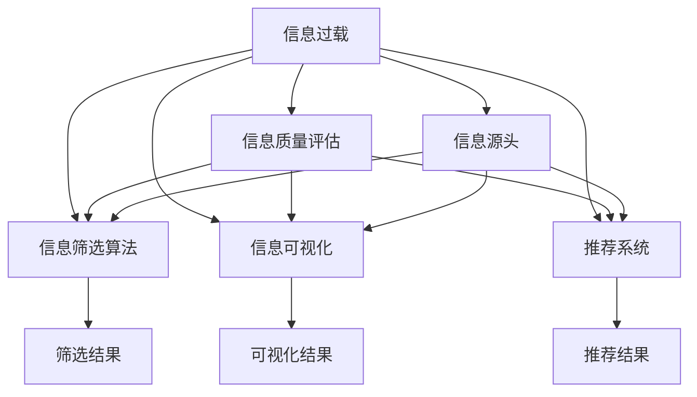

                 

# 信息过载与信息筛选指南：在信息洪流中找到有价值和相关的信息

## 1. 背景介绍

### 1.1 问题由来
随着互联网技术的飞速发展，信息以爆炸性速度增长，从新闻、社交媒体、电子邮件到专业论坛，人们每天接收的信息量呈指数级增长。然而，这些信息的质量却参差不齐，有时甚至存在大量误导性、虚假性的内容。在如此庞大的信息海洋中，如何在其中快速筛选出有价值和相关的信息，成为现代社会的一大挑战。

### 1.2 问题核心关键点
当前，信息筛选的主要难题在于：

- **信息过载**：信息数量剧增，人类接收和处理信息的能力有限。
- **内容质量参差不齐**：在海量信息中，真正高质量和有价值的内容占比不高。
- **信息获取效率低**：缺乏高效的信息筛选工具和方法，导致寻找有用信息耗时费力。

### 1.3 问题研究意义
准确高效的信息筛选能力，对于个人、企业和组织至关重要。其意义在于：

- **提升决策效率**：有效筛选信息，帮助决策者快速做出高质量决策。
- **节省时间和精力**：在信息海洋中，筛选有价值的内容，减少信息噪音干扰。
- **增强信息素养**：提高用户对信息的辨识和理解能力，提升整体的信息素养水平。

## 2. 核心概念与联系

### 2.1 核心概念概述

为更好地理解信息筛选的原理和方法，本节将介绍几个关键概念：

- **信息过载**：指信息量远超人们处理能力的现状，导致难以对所有信息进行有效筛选和处理。
- **信息质量评估**：通过一套客观标准，对信息内容进行评价，区分高质量和低质量信息。
- **信息筛选算法**：利用算法和技术手段，对信息进行自动或半自动筛选，帮助用户快速找到有价值的内容。
- **信息可视化**：通过图表、热力图等可视化手段，对信息进行直观展示，帮助用户快速识别重点内容。
- **推荐系统**：使用机器学习技术，根据用户的历史行为和偏好，推荐相关且有趣的信息，提升信息检索效率。

这些核心概念之间的逻辑关系可以通过以下Mermaid流程图来展示：



这个流程图展示了大规模信息筛选的基本流程和相关概念的关系：

1. 信息过载是问题起点，需要通过信息质量评估和筛选算法进行处理。
2. 信息可视化作为辅助手段，帮助用户直观理解信息。
3. 推荐系统利用用户偏好，提升信息检索效率。
4. 信息筛选结果和可视化结果，共同服务于最终的信息使用者。

## 3. 核心算法原理 & 具体操作步骤
### 3.1 算法原理概述

信息筛选算法主要通过统计学、机器学习等手段，对信息内容进行自动或半自动筛选，帮助用户快速找到有价值的信息。其核心思想是：通过构建一个或多个评估模型，对信息内容进行综合评价，区分高质量和低质量信息。常见的信息筛选算法包括：

- **内容质量评估**：通过自然语言处理(NLP)等技术，对文本内容进行情感、主题、语言风格等维度评价。
- **用户行为分析**：利用协同过滤、推荐算法等，分析用户的历史行为，预测用户兴趣，推荐相关内容。
- **信息可视化**：使用热力图、词云、情感分析等手段，对信息进行可视化展示，帮助用户快速识别重点内容。

### 3.2 算法步骤详解

典型的信息筛选算法通常包括以下几个步骤：

**Step 1: 数据预处理**
- 对信息内容进行文本清洗，去除噪音和无用信息。
- 进行词向量表示，将文本转化为数值形式，供后续计算使用。

**Step 2: 特征提取**
- 利用NLP技术，提取信息内容的关键词、主题、情感等特征。
- 分析用户历史行为，提取用户兴趣、偏好等信息。

**Step 3: 模型训练**
- 根据信息质量和用户行为，构建分类、回归、聚类等评估模型。
- 使用训练数据集，对模型进行训练，得到评分或标签。

**Step 4: 信息筛选**
- 对新信息进行特征提取，输入到训练好的模型中，计算得分或分类。
- 根据评分或分类结果，对信息进行排序或过滤。

**Step 5: 结果呈现**
- 利用信息可视化技术，将筛选结果以图表、热力图等形式展示。
- 利用推荐系统，对筛选结果进行进一步排序和推荐，提供个性化信息。

### 3.3 算法优缺点

信息筛选算法具有以下优点：

1. **自动化程度高**：通过构建评估模型，能够快速筛选大量信息，降低人工劳动量。
2. **效率高**：算法能够自动化处理信息，提升信息检索效率，帮助用户快速找到有价值内容。
3. **个性化推荐**：利用用户行为和兴趣分析，提供个性化信息推荐，提升用户满意度。
4. **可扩展性强**：通过不断优化算法和模型，提升信息筛选的准确性和效率。

同时，该算法也存在一些局限性：

1. **数据质量依赖度高**：算法效果取决于数据的质量和完整性。
2. **模型的鲁棒性不足**：在数据分布变化较大时，模型性能可能下降。
3. **算法复杂度较高**：复杂的算法模型，可能需要较高的计算资源和时间。
4. **隐私和安全问题**：算法在处理信息时，可能会涉及用户隐私数据的保护问题。

尽管存在这些局限性，信息筛选算法仍是当前信息时代处理海量信息的主要手段。未来，相关研究将更多关注如何提高算法效率和准确性，提升用户隐私保护，进一步优化信息筛选效果。

### 3.4 算法应用领域

信息筛选算法在众多领域中得到了广泛应用，例如：

- **新闻推荐**：根据用户兴趣，推荐相关新闻内容。
- **社交媒体信息筛选**：通过情感分析、关键词提取等手段，筛选出有价值的信息。
- **广告推荐**：利用用户行为分析，推荐个性化的广告内容。
- **研究文献筛选**：对海量的学术论文进行主题和引用分析，筛选出有参考价值的文献。
- **商品推荐**：通过用户购买行为和评价分析，推荐相关商品。

除了上述这些常见场景外，信息筛选算法还被创新性地应用于更多领域，如智能客服、金融数据分析、健康信息管理等，为各行各业提供了高效的信息处理手段。

## 4. 数学模型和公式 & 详细讲解  
### 4.1 数学模型构建

本节将使用数学语言对信息筛选的算法流程进行严格刻画。

设信息内容集合为 $X$，用户兴趣向量为 $u \in \mathbb{R}^d$，信息内容向量表示为 $x_i \in \mathbb{R}^d$，其中 $i \in \{1, 2, \ldots, |X|\}$。假设信息质量和用户行为之间的关系为 $f(x_i, u)$，模型的目标是通过训练数据集 $\mathcal{D}=\{(x_i, y_i)\}_{i=1}^N$，找到最优模型参数 $\theta^*$，使得 $f(x_i, u)$ 能够准确反映用户对信息内容的偏好。

其中 $y_i \in \{0, 1\}$ 表示信息内容 $x_i$ 是否满足用户需求，即 $y_i=1$ 表示 $x_i$ 对用户有价值，$y_i=0$ 表示 $x_i$ 对用户无价值。则模型的优化目标为：

$$
\theta^* = \mathop{\arg\min}_{\theta} \sum_{i=1}^N \ell(f(x_i, u), y_i)
$$

其中 $\ell$ 为损失函数，常用的有均方误差、交叉熵等。

### 4.2 公式推导过程

以基于用户行为分析的协同过滤算法为例，假设用户 $u$ 对信息内容 $x_i$ 的兴趣表示为 $x_i$ 的特征向量 $f(x_i)$ 与用户兴趣向量 $u$ 的内积：

$$
\hat{y}_i = u \cdot f(x_i)
$$

则均方误差损失函数为：

$$
\ell(\hat{y}_i, y_i) = (\hat{y}_i - y_i)^2
$$

从而得到协同过滤模型的优化目标为：

$$
\theta^* = \mathop{\arg\min}_{\theta} \sum_{i=1}^N (\hat{y}_i - y_i)^2
$$

通过梯度下降等优化算法，求解上述最优化问题，得到最优参数 $\theta^*$。

## 5. 项目实践：代码实例和详细解释说明
### 5.1 开发环境搭建

在进行信息筛选算法开发前，我们需要准备好开发环境。以下是使用Python进行Scikit-learn开发的环境配置流程：

1. 安装Anaconda：从官网下载并安装Anaconda，用于创建独立的Python环境。

2. 创建并激活虚拟环境：
```bash
conda create -n myenv python=3.8 
conda activate myenv
```

3. 安装Scikit-learn：
```bash
conda install scikit-learn
```

4. 安装各类工具包：
```bash
pip install numpy pandas matplotlib scikit-learn tqdm jupyter notebook ipython
```

完成上述步骤后，即可在`myenv`环境中开始信息筛选算法开发。

### 5.2 源代码详细实现

下面以基于用户行为分析的协同过滤算法为例，给出使用Scikit-learn进行信息筛选的Python代码实现。

首先，定义数据预处理和特征提取函数：

```python
from sklearn.feature_extraction.text import TfidfVectorizer
from sklearn.decomposition import TruncatedSVD

def preprocess_data(data):
    # 文本清洗，去除停用词和特殊字符
    processed_data = data.apply(lambda x: re.sub('[^\w\s]', '', x))
    return processed_data

def extract_features(data, n_features=100):
    vectorizer = TfidfVectorizer(stop_words='english', max_features=n_features)
    features = vectorizer.fit_transform(data)
    return features
```

然后，定义模型训练和评估函数：

```python
from sklearn.linear_model import Ridge
from sklearn.metrics import mean_squared_error

def train_model(features, labels):
    model = Ridge(alpha=0.01, solver='lbfgs')
    model.fit(features, labels)
    return model

def evaluate_model(model, features, labels):
    mse = mean_squared_error(labels, model.predict(features))
    print(f"Mean Squared Error: {mse:.3f}")
```

最后，启动训练流程并在测试集上评估：

```python
# 加载数据集
data = pd.read_csv('data.csv')
labels = data['label']  # 假设标签列名为label

# 预处理数据
processed_data = preprocess_data(data['content'])

# 提取特征
features = extract_features(processed_data)

# 划分训练集和测试集
train_features, test_features = features[:int(0.8*features.shape[0]), :], features[int(0.8*features.shape[0]):, :]
train_labels, test_labels = labels[:int(0.8*labels.shape[0]), :], labels[int(0.8*labels.shape[0]):, :]

# 训练模型
model = train_model(train_features, train_labels)

# 评估模型
evaluate_model(model, test_features, test_labels)

# 信息筛选
# 假设将模型应用于信息内容的筛选
info_content = 'This is a sample content.'
features_new = extract_features(info_content)
predictions = model.predict(features_new)
if predictions[0] > threshold:
    print('This content is relevant.')
```

以上就是使用Scikit-learn对信息筛选进行开发的全文代码实现。可以看到，得益于Scikit-learn库的强大封装，我们可以用相对简洁的代码实现协同过滤算法的开发。

### 5.3 代码解读与分析

让我们再详细解读一下关键代码的实现细节：

**preprocess_data函数**：
- 使用正则表达式去除文本中的停用词和特殊字符，清洗文本数据。

**extract_features函数**：
- 使用TF-IDF算法将文本数据转化为词向量表示，提取信息内容的关键词和主题。
- 使用TruncatedSVD算法对词向量进行降维，保留部分最具有代表性的特征。

**train_model函数**：
- 定义Ridge回归模型，用于评估用户对信息内容的兴趣程度。
- 通过梯度下降法对模型进行训练，找到最优参数。

**evaluate_model函数**：
- 在测试集上评估模型预测的均方误差，评估模型效果。

**信息筛选流程**：
- 对于新信息内容，进行特征提取，输入到训练好的模型中，计算兴趣得分。
- 根据设定阈值，判断信息内容是否对用户有价值，进而决定是否进行推荐。

## 6. 实际应用场景
### 6.1 智能推荐系统

基于用户行为分析的信息筛选算法，可以广泛应用于智能推荐系统的构建。传统的推荐系统主要依赖用户的历史行为数据进行物品推荐，难以捕捉到用户的隐式兴趣和潜在需求。通过信息筛选算法，可以更好地理解和挖掘用户的兴趣点，从而提供更加个性化和精准的推荐。

在技术实现上，可以收集用户浏览、点击、评价等行为数据，提取和用户交互的物品标题、描述、标签等文本内容。将文本内容作为模型输入，用户的后续行为作为监督信号，在此基础上训练模型。训练后的模型能够从文本内容中准确把握用户的兴趣点，生成推荐列表。

### 6.2 新闻聚合平台

新闻聚合平台面临着海量信息的筛选挑战，用户需要快速找到有价值的新闻内容。信息筛选算法可以通过对新闻内容进行情感、主题、语言风格等维度评价，区分高质量和低质量信息，帮助用户快速识别重点内容。

在技术实现上，可以收集用户的历史浏览记录，提取新闻标题和摘要作为特征，利用信息筛选算法对新闻进行评分。同时，可以结合推荐算法，对用户兴趣进行预测，推荐相关新闻内容。如此构建的新闻聚合平台，能够显著提升用户的信息获取效率。

### 6.3 社交媒体信息管理

社交媒体平台每天生成大量信息，如何高效管理这些信息，提取有价值的内容，是平台运营的关键问题。信息筛选算法可以通过对用户评论、帖子内容进行情感分析、关键词提取等手段，筛选出有价值的信息。同时，可以结合用户行为分析，预测用户兴趣，推荐相关内容，提升信息管理效率。

## 7. 工具和资源推荐
### 7.1 学习资源推荐

为了帮助开发者系统掌握信息筛选的理论基础和实践技巧，这里推荐一些优质的学习资源：

1. 《Python机器学习》系列书籍：由知名数据科学家Sebastian Raschka撰写，全面介绍了机器学习算法和Scikit-learn库的使用。

2. CS229《机器学习》课程：斯坦福大学开设的机器学习明星课程，内容涵盖分类、回归、聚类等多个主题，有Lecture视频和配套作业。

3. 《推荐系统实战》书籍：详细介绍了推荐系统的理论和实现，结合实际案例，帮助你快速上手推荐系统开发。

4. Kaggle：数据科学和机器学习竞赛平台，提供大量公开数据集和竞赛任务，是学习信息筛选算法的绝佳实践场所。

5. HuggingFace官方文档：包含丰富的机器学习模型和库，是进行信息筛选算法开发的必备资料。

通过对这些资源的学习实践，相信你一定能够快速掌握信息筛选算法的精髓，并用于解决实际的信息筛选问题。

### 7.2 开发工具推荐

高效的开发离不开优秀的工具支持。以下是几款用于信息筛选算法开发的常用工具：

1. Python：作为数据科学和机器学习的主流编程语言，Python具备丰富的第三方库和工具，是进行信息筛选算法开发的不二之选。

2. Scikit-learn：基于Python的机器学习库，提供了大量的预处理、特征提取和模型训练工具，是信息筛选算法的标准库。

3. TensorFlow：由Google主导开发的深度学习框架，生产部署方便，适合大规模工程应用。

4. Jupyter Notebook：交互式编程环境，支持多种编程语言，适合快速迭代实验和撰写技术文档。

5. PyCharm：强大的Python IDE，具备代码补全、调试、版本控制等工具，提升开发效率。

合理利用这些工具，可以显著提升信息筛选算法的开发效率，加快创新迭代的步伐。

### 7.3 相关论文推荐

信息筛选算法的发展得益于学界的持续研究。以下是几篇奠基性的相关论文，推荐阅读：

1. The Bell-Kac-Tsirelson Theorem: What to Do with It (Revisited)：提出协同过滤算法的基本思想，是推荐系统的理论基础。

2. Learning with Kernels: Support Vector Machines, Regularization, Optimization, and Beyond：详细介绍了支持向量机算法，是信息筛选算法的核心技术之一。

3. A Matrix Factorization Approach to Recommender System：提出基于矩阵分解的推荐算法，是推荐系统的经典方法。

4. A Theory of Linear and Generalized Linear Models：介绍了线性回归和广义线性模型，是信息筛选算法的重要工具。

5. Information Retrieval Theory: Introduction：全面介绍了信息检索理论，是信息筛选算法的理论基础。

这些论文代表了大信息筛选技术的发展脉络。通过学习这些前沿成果，可以帮助研究者把握学科前进方向，激发更多的创新灵感。

## 8. 总结：未来发展趋势与挑战
### 8.1 总结

本文对信息筛选算法进行了全面系统的介绍。首先阐述了信息过载和信息筛选的重要性，明确了信息筛选在提升信息获取效率、优化用户体验方面的关键作用。其次，从原理到实践，详细讲解了信息筛选算法的数学模型和操作步骤，给出了信息筛选任务开发的完整代码实例。同时，本文还探讨了信息筛选算法在智能推荐、新闻聚合、社交媒体信息管理等多个领域的应用前景，展示了信息筛选算法的广泛应用潜力。此外，本文精选了信息筛选算法的各类学习资源，力求为读者提供全方位的技术指引。

通过本文的系统梳理，可以看到，信息筛选算法在信息时代扮演着越来越重要的角色。通过构建高效的信息筛选模型，可以有效解决信息过载问题，提升信息获取效率和用户体验。未来，伴随技术的不断进步和应用场景的拓展，信息筛选算法必将在信息处理和智能化服务中发挥更大作用。

### 8.2 未来发展趋势

展望未来，信息筛选算法将呈现以下几个发展趋势：

1. **自动化和智能化程度提升**：随着深度学习和人工智能技术的不断发展，信息筛选算法将更加自动化和智能化，能够更好地理解和处理复杂的信息内容。

2. **跨模态信息融合**：未来，信息筛选算法将不仅仅是处理文本信息，还将扩展到图像、视频、语音等多模态数据的处理和融合。

3. **实时性和交互性增强**：信息筛选算法将更加注重实时性和交互性，能够动态调整模型参数，适应用户行为变化。

4. **隐私保护和安全性提升**：信息筛选算法将更加注重用户隐私保护，采用匿名化、加密等技术手段，保障用户数据安全。

5. **多领域应用的拓展**：信息筛选算法将在更多领域得到应用，如金融分析、医疗诊断、环境监测等，为各行各业提供高效的信息处理手段。

6. **跨学科融合**：信息筛选算法将与自然语言处理、认知科学、心理学等学科进行深入融合，提升算法的智能化水平。

以上趋势凸显了信息筛选算法的广阔前景。这些方向的探索发展，必将进一步提升信息筛选的效果和应用范围，为信息时代的信息处理和智能化服务提供有力支持。

### 8.3 面临的挑战

尽管信息筛选算法已经取得了显著进展，但在迈向更加智能化、普适化应用的过程中，它仍面临诸多挑战：

1. **数据质量和多样性**：信息筛选算法依赖高质量和多样化的数据，获取数据成本较高，且数据质量参差不齐。

2. **算法的复杂性和效率**：复杂的信息筛选算法可能需要高计算资源和时间，如何在保证效果的同时提高算法效率，仍是重要问题。

3. **隐私和安全问题**：算法在处理信息时，可能会涉及用户隐私数据的保护问题，如何平衡隐私保护和信息筛选效果，是重要课题。

4. **算法的鲁棒性和泛化能力**：算法在处理不同领域和任务时，可能会出现泛化能力不足的问题，如何提升算法的鲁棒性和泛化能力，是研究方向之一。

5. **跨模态信息融合的挑战**：多模态信息融合是信息筛选算法的难点之一，如何将不同模态的信息有机结合，仍需进一步研究。

6. **系统的可扩展性和鲁棒性**：在处理大规模信息时，系统需要具备高可扩展性和鲁棒性，避免因系统故障导致的信息筛选失败。

7. **算法的公平性和偏见问题**：信息筛选算法可能会学习到数据中的偏见，如何消除偏见，提升算法的公平性，仍需深入研究。

正视信息筛选面临的这些挑战，积极应对并寻求突破，将使信息筛选算法走向成熟。相信随着技术的不断进步和应用场景的拓展，信息筛选算法必将在信息处理和智能化服务中发挥更大作用。

### 8.4 研究展望

面向未来，信息筛选算法的研究方向应集中在以下几个方面：

1. **深度学习和人工智能的结合**：利用深度学习技术，提升信息筛选算法的智能化水平，处理更复杂的信息内容。

2. **跨模态信息的融合**：研究如何将不同模态的信息有机结合，提升信息筛选的准确性和全面性。

3. **隐私保护和安全性**：研究如何在保证信息筛选效果的同时，保障用户隐私数据的安全。

4. **公平性和偏见消除**：研究如何消除算法中的偏见，提升算法的公平性和泛化能力。

5. **实时性和交互性**：研究如何提升信息筛选算法的实时性和交互性，适应动态变化的用户需求。

6. **系统的可扩展性和鲁棒性**：研究如何构建高可扩展性和鲁棒性的信息筛选系统，保障系统稳定运行。

通过这些研究方向的研究，必将推动信息筛选算法向更加智能化、普适化方向发展，为信息时代的信息处理和智能化服务提供更有力的支持。

## 9. 附录：常见问题与解答
**Q1：信息筛选算法是否适用于所有信息类型？**

A: 信息筛选算法主要适用于文本信息，但对于其他类型的信息（如图像、音频、视频等），可以通过转换和特征提取，应用到信息筛选算法中。例如，可以通过图像分类、视频摘要等技术，将图像、视频等转换为文本信息，再应用信息筛选算法进行处理。

**Q2：信息筛选算法如何处理多模态信息？**

A: 信息筛选算法在处理多模态信息时，可以采用以下方法：
1. 特征融合：将不同模态的信息进行特征融合，构建综合特征向量。
2. 跨模态模型：使用跨模态模型，将不同模态的信息进行协同建模。
3. 多任务学习：将信息筛选任务分解为多个子任务，每个子任务对应一种模态的信息。
4. 多层次学习：对不同层次的信息进行筛选，综合不同层次的筛选结果。

**Q3：信息筛选算法在实际应用中面临哪些问题？**

A: 信息筛选算法在实际应用中面临以下问题：
1. 数据质量问题：数据质量和多样性对信息筛选效果有很大影响。
2. 算法复杂度和效率问题：复杂算法可能需要大量计算资源和时间。
3. 隐私和安全问题：算法在处理信息时，涉及用户隐私数据的保护问题。
4. 算法的鲁棒性和泛化能力问题：算法在处理不同领域和任务时，可能会出现泛化能力不足的问题。
5. 跨模态信息融合问题：将不同模态的信息有机结合，提升信息筛选的准确性和全面性。

这些问题是信息筛选算法在实际应用中需要面对的主要挑战，需要进一步研究和技术改进。

**Q4：信息筛选算法的应用场景有哪些？**

A: 信息筛选算法在众多领域中得到了广泛应用，例如：
1. 智能推荐系统：根据用户历史行为，推荐相关物品。
2. 新闻聚合平台：对大量新闻进行情感分析、关键词提取等，筛选出有价值的新闻。
3. 社交媒体信息管理：筛选出有价值的内容，推荐相关内容。
4. 搜索引擎：对用户查询进行关键词提取和主题分析，提升搜索结果的相关性。
5. 金融数据分析：对金融市场数据进行情感分析、主题分析，筛选出有价值的信息。

除了上述这些常见场景外，信息筛选算法还被创新性地应用于更多领域，如医疗信息管理、环境监测、工业生产等，为各行各业提供高效的信息处理手段。

---

作者：禅与计算机程序设计艺术 / Zen and the Art of Computer Programming

