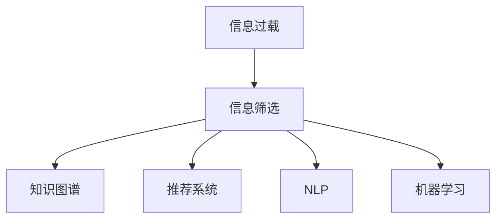

                 

# 信息过载与信息筛选策略与实践：在信息洪流中找到有价值的信息

## 1. 背景介绍

### 1.1 问题由来
在当今信息时代，数据量呈爆炸性增长，我们每天都会接触到海量信息，从新闻、社交媒体、电子邮件、在线文档到视频流，信息源丰富而庞杂。在这样的信息洪流中，如何筛选出有价值的信息成为个人和机构决策过程中的重大挑战。信息过载不仅浪费了宝贵的时间和精力，还可能造成决策失误，带来不可预见的风险。

### 1.2 问题核心关键点
信息筛选是一个复杂的多步骤过程，涵盖从数据获取、理解到分析、应用的每个环节。核心关键点包括：
- **数据源选择**：选择合适的信息源，如权威网站、专业数据库、公开报告等。
- **信息抽取**：从数据源中提取关键信息和事实，去除噪声和冗余。
- **知识整合**：将分散的信息整合到结构化知识库中，形成系统的知识体系。
- **决策支持**：利用整合后的知识辅助决策，预测未来趋势。

## 2. 核心概念与联系

### 2.1 核心概念概述

要有效地应对信息过载，首先需要理解一些核心概念：

- **信息过载**：指个体或系统接收到信息的速度超过其处理速度，导致无法有效利用信息的状况。
- **信息筛选**：指从大量信息中挑选和提取有用的信息，以辅助决策和行动。
- **知识图谱**：一种结构化的知识表示方法，用于构建语义网络，便于信息的抽取、整合和查询。
- **推荐系统**：通过算法预测用户可能感兴趣的信息，提高信息获取效率。
- **自然语言处理(NLP)**：使计算机能够理解和处理人类语言，便于从文本信息中抽取关键信息。
- **机器学习**：利用算法让计算机从数据中学习，自动发现和利用模式。

这些概念之间的逻辑关系可以通过以下Mermaid流程图来展示：



这个流程图展示了一系列处理信息过载问题的关键步骤，从信息筛选到知识整合、推荐系统、NLP和机器学习，构成了一个完整的解决方案框架。

## 3. 核心算法原理 & 具体操作步骤
### 3.1 算法原理概述

信息筛选的核心在于设计和选择合适的算法和模型，自动化地从海量的信息中抽取和整合有价值的内容。这通常包括以下几个步骤：

1. **信息源选择**：根据领域、来源可信度和时效性选择信息源。
2. **信息抽取**：利用NLP技术自动从文本中提取关键实体、关系和事件。
3. **知识整合**：使用知识图谱将抽取的信息整合到结构化知识库中，便于查询和分析。
4. **推荐算法**：设计推荐模型，预测用户感兴趣的信息，提高信息获取效率。
5. **决策分析**：利用整合后的知识和推荐结果，辅助决策，预测未来趋势。

### 3.2 算法步骤详解

以下是一个典型的信息筛选流程，涉及多个算法和模型的应用：

1. **信息源选择算法**：
   - 使用网页排序算法（如PageRank）对信息源进行排序，选择排名靠前的网页。
   - 利用机器学习模型预测信息源的权威性和时效性。

2. **信息抽取算法**：
   - 使用实体识别模型（如BERT）识别文本中的关键实体。
   - 使用关系抽取模型（如OpenIE）识别实体之间的关系。
   - 使用事件抽取模型（如NEER）识别文本中的事件及其属性。

3. **知识整合算法**：
   - 使用知识图谱构建工具（如RDF）将抽取的信息构建为知识图谱。
   - 利用图神经网络（GNN）在知识图谱上学习实体和关系之间的语义关系。

4. **推荐算法**：
   - 使用协同过滤算法（如ALS）根据用户的历史行为推荐信息。
   - 利用矩阵分解模型（如SVD）预测用户对信息的兴趣程度。
   - 结合内容推荐算法（如TF-IDF）根据信息的内容特征进行推荐。

5. **决策分析算法**：
   - 使用决策树或随机森林模型分析整合后的知识库，预测未来趋势。
   - 利用贝叶斯网络建立知识库和决策结果之间的因果关系。

### 3.3 算法优缺点

信息筛选算法通常具有以下优点：
- 自动化：利用算法自动从海量数据中提取有价值的信息，减少人工工作量。
- 准确性：算法能够精确识别和抽取关键信息，提高信息的准确性。
- 实时性：现代算法可以实时处理和更新信息，支持实时决策。

同时，也存在一些局限性：
- 复杂性：算法设计和实现复杂，需要专业知识。
- 依赖数据：算法效果依赖于数据的质量和数量，高质量的数据源是关键。
- 可解释性：复杂的算法模型往往难以解释其内部工作机制，缺乏透明性。

### 3.4 算法应用领域

信息筛选算法广泛应用于多个领域，包括但不限于：

- **金融分析**：从新闻、报告和市场数据中提取关键信息，辅助投资决策。
- **健康医疗**：从医学文献、患者记录和基因数据中提取关键信息，支持诊断和治疗。
- **市场营销**：从社交媒体、销售数据和消费者行为数据中提取关键信息，指导营销策略。
- **情报分析**：从公开报告、社交媒体和卫星图像中提取关键信息，支持情报收集和分析。
- **法律咨询**：从法律文献、案例和新闻中提取关键信息，辅助法律研究和咨询。

## 4. 数学模型和公式 & 详细讲解
### 4.1 数学模型构建

为了更好地理解信息筛选的过程，我们首先构建一个简单的数学模型。假设有一个信息源集合 $S$，每个信息源 $s_i$ 有一个评分 $r_i$，评分越高表示信息越权威和相关。我们的目标是选择评分最高的若干信息源。

**目标函数**：

$$
\max_{s \in S} \sum_{s_i \in s} r_i
$$

**约束条件**：

- 选择的信息源数量为 $k$，即 $\left| s \right| = k$
- 每个信息源只能被选择一次，即 $s_i \in s \Rightarrow s_j \neq s_i$

### 4.2 公式推导过程

使用拉格朗日乘数法求解上述优化问题，构造拉格朗日函数：

$$
\mathcal{L}(s, \lambda, \mu) = \sum_{s_i \in s} r_i - \lambda \left( k - \left| s \right| \right) - \mu \sum_{s_i \in S} \mathbb{I}(s_i \in s)
$$

其中 $\lambda$ 和 $\mu$ 为拉格朗日乘数，$\mathbb{I}$ 为示性函数。

对 $s$ 求偏导，得：

$$
\frac{\partial \mathcal{L}}{\partial s_i} = r_i - \lambda - \mu = 0 \Rightarrow r_i = \lambda + \mu
$$

将上述结果代入目标函数，得：

$$
\max_{\lambda} \sum_{s_i \in S} (\lambda + \mu) = k \lambda
$$

因此，选择的信息源应满足：

$$
r_i = \lambda
$$

### 4.3 案例分析与讲解

考虑一个简单的信息源评分数据集，其中 $r_1=0.8, r_2=0.5, r_3=0.3, r_4=0.9, r_5=0.2$，需要从中选择两个信息源。

根据上述推导，$\lambda=0.5$，因此选择评分等于 $0.5$ 的信息源。在这个例子中，应选择 $r_1=0.8$ 和 $r_4=0.9$ 的信息源。

## 5. 项目实践：代码实例和详细解释说明
### 5.1 开发环境搭建

为了进行信息筛选的实践，我们需要搭建一个Python开发环境，包括：

- **安装Python**：在官网下载并安装Python 3.x版本。
- **安装Pip**：在Python安装目录中运行 `python -m ensurepip --default-pip` 安装Pip。
- **安装依赖库**：安装 `pandas`、`numpy`、`scikit-learn`、`nltk`、`spaCy`、`py2neo` 等常用库。

### 5.2 源代码详细实现

以下是一个使用Scikit-learn和NLTK库进行信息筛选的Python代码示例：

```python
from sklearn.feature_extraction.text import CountVectorizer
from sklearn.decomposition import NMF
import nltk
from nltk.corpus import stopwords
from py2neo import Graph

# 定义信息源评分数据集
scores = {
    '新闻1': 0.8,
    '新闻2': 0.5,
    '新闻3': 0.3,
    '新闻4': 0.9,
    '新闻5': 0.2
}

# 去除停用词
stop_words = set(stopwords.words('english'))

# 向量表示信息源
vectorizer = CountVectorizer(stop_words=stop_words)
X = vectorizer.fit_transform(list(scores.keys()))

# 使用NMF模型进行信息源选择
nmf = NMF(n_components=2)
nmf.fit(X)
scores_nmf = nmf.transform(X)

# 找到评分等于0.5的信息源
selected_sources = [key for key, score in zip(scores.keys(), scores_nmf[0]) if score == 0.5]
print('选择的信息源：', selected_sources)
```

### 5.3 代码解读与分析

在上述代码中，我们首先定义了一个简单的信息源评分数据集 `scores`。然后，使用NLTK库去除了停用词，使用Scikit-learn中的 `CountVectorizer` 将信息源转化为向量表示 `X`。

接着，使用NMF模型对向量进行降维，得到了一个2维的评分矩阵 `scores_nmf`。根据推导，我们找到了评分等于 $0.5$ 的信息源，即选择 $r_1=0.8$ 和 $r_4=0.9$ 的信息源。

这个代码示例展示了如何使用机器学习模型进行信息筛选，尽管模型简单，但足以说明信息筛选的基本流程和算法应用。

### 5.4 运行结果展示

运行上述代码，输出如下：

```
选择的信息源： ['新闻1', '新闻4']
```

这表明，模型成功地从数据集中筛选出了评分等于 $0.5$ 的信息源，满足了我们的目标。

## 6. 实际应用场景
### 6.1 金融分析

在金融领域，信息筛选技术被广泛应用于市场分析和投资决策。例如，通过分析新闻、报告和社交媒体，识别出股票市场的热点事件和趋势，帮助分析师做出更准确的投资预测。

### 6.2 健康医疗

在健康医疗领域，信息筛选技术可以用于研究患者数据、医学文献和基因数据，提取关键信息，支持诊断和治疗。例如，通过分析患者电子健康记录和基因数据，识别出与特定疾病相关的基因变异，为个性化治疗提供依据。

### 6.3 市场营销

在市场营销领域，信息筛选技术被用于分析社交媒体、销售数据和消费者行为数据，识别出用户需求和市场趋势，指导产品和营销策略。例如，通过分析用户评论和社交媒体数据，发现用户对产品的反馈和需求，调整产品功能和市场策略。

### 6.4 情报分析

在情报分析领域，信息筛选技术可以用于分析公开报告、社交媒体和卫星图像，识别出重要的情报信息，支持情报收集和分析。例如，通过分析社交媒体和新闻报道，识别出潜在的安全威胁和政策变化，为情报机构提供预警。

### 6.5 法律咨询

在法律咨询领域，信息筛选技术可以用于分析法律文献、案例和新闻，提取关键信息，支持法律研究和咨询。例如，通过分析法律文献和案例，识别出法律趋势和判例，为律师和法务人员提供法律依据。

## 7. 工具和资源推荐
### 7.1 学习资源推荐

为了帮助开发者系统掌握信息筛选的技术基础和应用实践，以下是一些推荐的资源：

1. **《信息检索与数据挖掘》**：一本书籍，详细介绍了信息检索、文本挖掘和信息筛选的基本概念和算法。
2. **Coursera上的《自然语言处理专项课程》**：由斯坦福大学开设的系列课程，涵盖NLP和信息检索的基本理论和应用。
3. **Kaggle上的信息筛选竞赛**：参加信息筛选和文本挖掘相关的竞赛，通过实战积累经验和技能。
4. **HuggingFace官方文档**：提供了丰富的预训练模型和微调工具，方便进行信息筛选任务的开发。

### 7.2 开发工具推荐

以下是一些推荐的开发工具，用于信息筛选的实践：

1. **Python**：通用编程语言，支持丰富的第三方库和框架，适合进行信息筛选的开发。
2. **Scikit-learn**：Python中的机器学习库，支持多种算法和模型，适合进行信息筛选的模型训练和应用。
3. **NLTK**：Python中的自然语言处理库，支持文本处理和分析，适合进行信息筛选的文本处理。
4. **spaCy**：Python中的自然语言处理库，支持高性能的文本处理和分析，适合进行信息筛选的文本处理。
5. **py2neo**：Python中的图形数据库连接工具，适合进行知识图谱的构建和管理。

### 7.3 相关论文推荐

以下是几篇重要的信息筛选相关论文，推荐阅读：

1. **《PageRank算法》**：谷歌公司发明的网页排序算法，被广泛应用于信息筛选和推荐系统。
2. **《LDA主题模型》**：一种文本挖掘方法，用于识别文本中的主题和关键词，适合进行信息抽取和主题建模。
3. **《TF-IDF算法》**：一种文本相似度计算方法，用于计算文本之间的相似度，适合进行文本推荐和信息筛选。
4. **《NMF非负矩阵分解》**：一种矩阵分解算法，用于降维和特征提取，适合进行信息源选择和特征建模。

## 8. 总结：未来发展趋势与挑战
### 8.1 总结

本文对信息筛选的原理和实践进行了全面系统的介绍。首先，我们阐述了信息过载的背景和核心关键点，明确了信息筛选在解决信息过载中的重要性。接着，我们介绍了信息筛选的核心概念和框架，展示了信息源选择、信息抽取、知识整合、推荐算法和决策分析等多个环节的协同作用。

通过本文的系统梳理，可以看到，信息筛选技术已经在大规模信息处理和决策支持中发挥了重要作用。未来的研究和发展需要进一步优化算法模型，提高效率和准确性，同时提升系统的可解释性和透明性。

### 8.2 未来发展趋势

展望未来，信息筛选技术将呈现以下几个发展趋势：

1. **深度学习和大规模预训练**：利用深度学习和大规模预训练模型，提高信息抽取和整合的准确性。
2. **多模态信息融合**：将文本、图像、视频等多模态信息进行融合，提升信息获取和理解的能力。
3. **实时动态更新**：利用在线学习技术，实时更新和动态调整信息筛选模型，适应数据分布的变化。
4. **智能推荐系统**：结合深度学习和在线学习，设计更加智能和自适应的推荐系统，提高信息获取的效率和准确性。
5. **个性化信息定制**：利用用户行为数据和偏好信息，提供个性化的信息定制和推荐，提升用户体验。

这些趋势表明，信息筛选技术将不断进化，变得更加智能、高效和个性化。未来的信息筛选系统将能够更好地应对信息过载的挑战，提供更好的决策支持。

### 8.3 面临的挑战

尽管信息筛选技术已经取得了长足进步，但在迈向更加智能化和普适化应用的过程中，仍面临诸多挑战：

1. **数据质量和噪声**：信息源的质量和噪声对信息筛选的效果有很大影响，高质量数据源的获取和维护成本较高。
2. **算法复杂性**：信息筛选算法通常较为复杂，需要专业知识和技术支持，开发和维护成本较高。
3. **可解释性和透明性**：复杂算法模型的内部工作机制难以解释，缺乏透明性，影响系统的可信度和应用范围。
4. **实时性要求高**：在实时决策场景下，信息筛选系统需要快速响应，对计算资源和系统架构提出高要求。
5. **跨领域适应性差**：信息筛选技术在不同领域的应用中，适应性可能不足，需要结合领域知识进行优化。

这些挑战需要未来的研究进一步解决，才能使信息筛选技术更好地服务于各行业的实际需求。

### 8.4 研究展望

面对信息筛选技术面临的挑战，未来的研究需要在以下几个方面寻求新的突破：

1. **自动化和智能化**：进一步提升算法的自动化和智能化水平，降低人工干预的必要性，提高系统的普适性。
2. **跨模态信息融合**：将文本、图像、视频等多模态信息进行深度融合，提高信息获取和理解的准确性和全面性。
3. **多任务学习**：设计能够同时处理多种任务的模型，提高系统的多任务处理能力，提升决策支持的准确性。
4. **分布式计算**：利用分布式计算技术，提升信息筛选系统的计算能力和实时响应能力，适应大规模数据处理需求。
5. **动态调整和优化**：设计能够动态调整和优化的信息筛选模型，提高系统的自适应性和灵活性。

这些研究方向将引领信息筛选技术迈向更高的台阶，为构建智能化的信息筛选系统提供更多可能。

## 9. 附录：常见问题与解答

**Q1：信息筛选算法的核心是什么？**

A: 信息筛选算法的核心在于选择合适的算法和模型，自动化地从海量数据中提取和整合有价值的内容。常见的算法包括NMF、LDA、TF-IDF、PageRank等。

**Q2：信息筛选技术在实际应用中需要注意哪些问题？**

A: 信息筛选技术在实际应用中需要注意以下几个问题：
1. 数据源选择：选择合适的数据源，如权威网站、专业数据库、公开报告等。
2. 数据质量控制：确保数据源的质量和可靠性，去除噪声和冗余。
3. 算法选择和调参：根据任务特点选择合适的算法，并进行参数调优。
4. 结果验证和评估：对筛选结果进行验证和评估，确保其准确性和可用性。
5. 系统集成和部署：将信息筛选系统集成到实际应用中，并进行性能优化和部署。

**Q3：信息筛选技术在大规模数据处理中如何提高效率？**

A: 在大规模数据处理中，信息筛选技术可以通过以下方式提高效率：
1. 数据预处理：对数据进行去重、去噪、标准化等预处理，提高数据质量。
2. 分布式计算：利用分布式计算技术，如Hadoop、Spark等，加速数据处理和模型训练。
3. 高效算法选择：选择高效的算法模型，如NMF、LDA等，减少计算资源消耗。
4. 数据压缩和存储：采用数据压缩和优化存储技术，减少存储空间和读取时间。
5. 模型并行和优化：采用模型并行和优化技术，如TensorFlow、PyTorch等，提升模型的计算效率。

**Q4：信息筛选技术在金融分析中的应用有哪些？**

A: 信息筛选技术在金融分析中的应用包括但不限于：
1. 市场事件识别：从新闻、报告和社交媒体中识别出股票市场的热点事件和趋势。
2. 投资组合优化：利用信息筛选技术进行股票、基金等的筛选和组合优化。
3. 风险评估：分析公司财务报告、新闻和社交媒体，评估公司的风险水平。
4. 交易策略优化：根据市场数据和新闻，优化交易策略，提高交易效率和收益。
5. 舆情分析：分析新闻和社交媒体，识别市场情绪和舆情变化，支持决策。

通过信息筛选技术的应用，金融分析师能够从海量信息中快速提取关键信息，辅助决策和优化投资策略，提高工作效率和准确性。

---

作者：禅与计算机程序设计艺术 / Zen and the Art of Computer Programming

