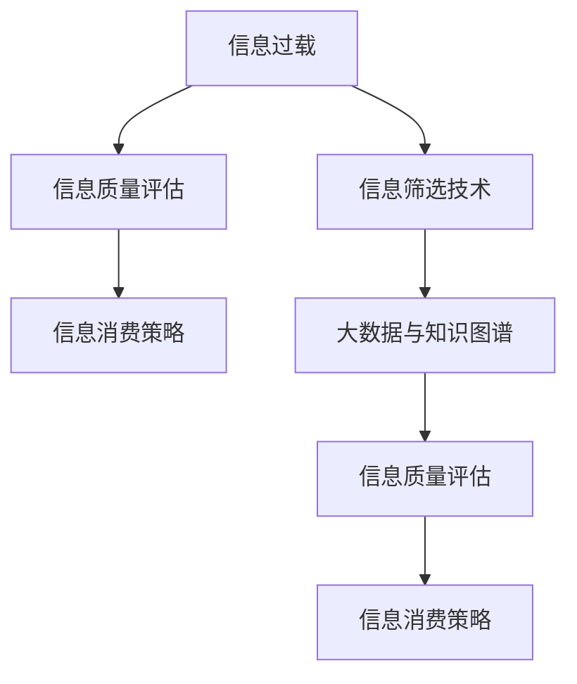

                 

# 信息过载与信息质量评估：批判性地消费和评估信息

> 关键词：信息过载, 信息质量评估, 信息筛选, 深度学习, 自然语言处理, 大数据, 知识图谱

## 1. 背景介绍

### 1.1 问题由来

在当今社会，信息爆炸已成常态。新闻网站、社交媒体、电子邮件、文档、图片、视频等海量信息不断涌入我们的视野，这被称为“信息过载”。信息过载导致人们难以在纷繁复杂的数据中准确识别和提取有价值的信息，同时也降低了人们处理信息的能力和效率。这一现象在数字时代尤为显著，不仅对个人造成了困扰，也给企业信息管理带来了巨大挑战。

信息过载不仅影响人们的决策速度和质量，还可能导致信息误用、错误判断和决策失误。随着信息获取的便利性增加，我们亟需找到有效的方法来评估信息的质量，并批判性地消费信息，以提升信息处理效率和决策质量。

### 1.2 问题核心关键点

1. **信息过载现象**：海量信息不断涌入，信息获取容易但筛选困难。
2. **信息质量评估**：从海量信息中筛选出高质量信息，提升决策的可靠性和有效性。
3. **信息筛选技术**：基于深度学习和自然语言处理等技术，自动化地识别和分类信息。
4. **信息消费策略**：批判性地分析信息，提升信息消费的深度和广度。
5. **大数据与知识图谱**：利用大数据和知识图谱技术，构建信息质量评估体系，辅助信息消费。

## 2. 核心概念与联系

### 2.1 核心概念概述

要解决信息过载和信息质量评估的问题，首先需要理解几个核心概念：

- **信息过载**：指在特定时间内接收到的信息超出处理能力的情况，导致认知过载和决策困难。
- **信息质量评估**：指对信息内容的真实性、准确性、完整性、相关性等进行评估，判断其对决策的适用性和影响。
- **信息筛选技术**：通过自动化技术识别、分类和过滤信息，辅助人工进行信息消费。
- **信息消费策略**：指导如何批判性地消费信息，通过深入分析和验证，提升信息消费的质量和效果。
- **大数据与知识图谱**：利用大数据技术处理和分析海量信息，利用知识图谱技术构建信息网络，辅助信息质量评估。

这些概念之间的关系可以通过以下Mermaid流程图来展示：



这个流程图展示了大语言模型微调的核心概念及其之间的关系：

1. 信息过载是问题的起点，推动了信息质量评估的需求。
2. 信息质量评估可以指导信息筛选技术的应用，提高筛选的效率和质量。
3. 信息筛选技术通过大数据和知识图谱技术，辅助进行信息质量评估。
4. 信息消费策略基于信息质量评估结果，指导如何批判性地消费信息。

这些概念共同构成了信息过载和信息质量评估的理论框架，有助于理解和解决实际问题。

## 3. 核心算法原理 & 具体操作步骤
### 3.1 算法原理概述

信息质量评估的算法原理是基于深度学习和大数据技术，构建信息质量评估模型，并应用于信息筛选和消费策略中。

**核心算法流程**：
1. 数据预处理：清洗、分词、向量化等，将原始信息转化为模型可以处理的格式。
2. 特征提取：通过深度学习模型提取信息的关键特征，如TF-IDF、word2vec、BERT等。
3. 模型训练：使用大数据集进行模型训练，学习信息的质量特征。
4. 模型评估：在验证集上评估模型性能，调整模型参数以优化性能。
5. 信息筛选：利用训练好的模型对海量信息进行筛选，提取高质量信息。
6. 信息消费：根据筛选结果和质量评估，进行批判性消费。

### 3.2 算法步骤详解

#### 3.2.1 数据预处理

信息预处理是信息质量评估的第一步，主要包括数据清洗、分词和向量化等步骤。

1. **数据清洗**：去除噪声、错误和不相关数据，确保数据质量。
2. **分词**：将文本信息分割成词语，便于特征提取。
3. **向量化**：将文本向量化，转化为模型可以处理的形式。常用的方法包括TF-IDF、word2vec、BERT等。

#### 3.2.2 特征提取

信息特征提取是信息质量评估的核心，通过深度学习模型提取信息的质\量特征，常用的方法包括TF-IDF、word2vec、BERT等。

1. **TF-IDF**：计算每个词在文档中的重要性，适用于词频分析和主题建模。
2. **word2vec**：通过上下文语境学习词向量，可以捕捉词语的语义关系。
3. **BERT**：预训练语言模型，通过双向上下文表示学习词语的复杂语义关系。

#### 3.2.3 模型训练

信息质量评估模型训练是信息筛选和消费策略的基础，通过大数据集训练模型，学习信息的质量特征。

1. **数据集构建**：构建包含高质量和低质量信息的训练集，用于模型训练。
2. **模型选择**：选择适合的深度学习模型，如CNN、RNN、Transformer等。
3. **模型训练**：在大数据集上训练模型，学习信息的质量特征。
4. **模型评估**：在验证集上评估模型性能，调整模型参数以优化性能。

#### 3.2.4 信息筛选

信息筛选是通过训练好的模型对海量信息进行筛选，提取高质量信息的过程。

1. **模型应用**：将预处理后的信息输入到训练好的模型中，获取信息的质量评分。
2. **信息分类**：根据模型评分，将信息分为高质量和低质量两类。
3. **信息保存**：保存高质量信息，用于后续消费。

#### 3.2.5 信息消费

信息消费策略是基于信息质量评估结果，指导如何批判性地消费信息的过程。

1. **信息验证**：对筛选出的高质量信息进行验证，确保信息的真实性和准确性。
2. **深度分析**：对信息进行深度分析，挖掘背后的语义关系和逻辑结构。
3. **决策支持**：根据深度分析结果，辅助决策。

### 3.3 算法优缺点

基于深度学习的信息质量评估方法有以下优点：

1. **自动化程度高**：可以快速处理海量信息，自动化程度高，节省人工成本。
2. **精度高**：通过深度学习模型，能够精准地提取信息的特征，评估信息的质量。
3. **可扩展性好**：适用于多种类型的信息，如文本、图片、视频等。

同时，该方法也存在一些局限性：

1. **数据依赖性强**：模型需要大量高质量的标注数据进行训练，数据获取成本高。
2. **模型复杂度**：深度学习模型结构复杂，训练和调参难度大。
3. **信息质量标准不一**：不同领域和场景下的信息质量标准不一，模型的泛化性受限。
4. **信息误判风险**：模型可能存在误判风险，尤其是在数据质量和模型精度不足的情况下。

### 3.4 算法应用领域

基于深度学习的信息质量评估方法在多个领域都有广泛应用：

1. **新闻和媒体**：自动筛选高质量新闻，提高信息筛选效率，减少误报。
2. **社交媒体**：自动检测虚假信息和有害内容，提升信息安全。
3. **金融市场**：筛选高质量的金融数据和报告，辅助投资决策。
4. **医疗健康**：筛选高质量的医疗文献和患者数据，提高医疗决策的可靠性。
5. **电子商务**：自动筛选高质量的电商评论和商品信息，提升用户购物体验。
6. **智能客服**：自动筛选高质量客户反馈，辅助客服机器人优化服务。
7. **人力资源**：筛选高质量的简历和应聘信息，提高招聘效率。

## 4. 数学模型和公式 & 详细讲解 & 举例说明

### 4.1 数学模型构建

信息质量评估的数学模型主要基于深度学习模型，如CNN、RNN、Transformer等。以下以BERT模型为例，介绍信息质量评估模型的构建。

**数学模型构建**：
1. **输入层**：将文本信息分词并向量化。
2. **编码层**：通过BERT模型，对文本信息进行编码，提取信息的关键特征。
3. **输出层**：通过全连接层，输出信息的质量评分。

### 4.2 公式推导过程

假设信息质量评估模型为 $M$，输入文本为 $x$，模型输出为 $y$。模型的损失函数为 $L$，模型的训练目标为最小化损失函数。

1. **输入层**：
   $$
   x = \{w_1, w_2, ..., w_n\}
   $$

2. **编码层**：
   $$
   h = BERT(x)
   $$

3. **输出层**：
   $$
   y = softmax(W^T \cdot h + b)
   $$

其中 $W$ 和 $b$ 为全连接层的权重和偏置项。模型的损失函数为：
$$
L = -\frac{1}{N} \sum_{i=1}^N \log y_i
$$

### 4.3 案例分析与讲解

以新闻信息质量评估为例，分析模型的应用过程。

**数据集**：构建包含高质量和低质量新闻的信息集。

**模型选择**：选择BERT模型进行训练。

**模型训练**：在大规模新闻数据集上进行模型训练，学习新闻的质量特征。

**信息筛选**：将待筛选的新闻输入到训练好的模型中，输出质量评分。

**信息分类**：根据质量评分，将新闻分为高质量和低质量两类。

**信息消费**：根据分类结果，选择高质量新闻进行深度分析和决策支持。

## 5. 项目实践：代码实例和详细解释说明

### 5.1 开发环境搭建

开发环境搭建主要包括以下几个步骤：

1. **安装Python**：
   ```bash
   sudo apt-get update
   sudo apt-get install python3-pip
   sudo pip3 install tensorflow numpy pandas sklearn
   ```

2. **安装TensorFlow**：
   ```bash
   pip install tensorflow
   ```

3. **安装TensorBoard**：
   ```bash
   pip install tensorboard
   ```

4. **安装Scikit-learn**：
   ```bash
   pip install scikit-learn
   ```

### 5.2 源代码详细实现

以下以新闻信息质量评估为例，给出代码实现。

```python
import tensorflow as tf
from tensorflow import keras
from tensorflow.keras import layers
from tensorflow.keras.preprocessing.text import Tokenizer
from tensorflow.keras.preprocessing.sequence import pad_sequences
from sklearn.model_selection import train_test_split
import pandas as pd

# 加载数据集
data = pd.read_csv('news_data.csv')

# 数据预处理
tokenizer = Tokenizer(oov_token='<OOV>')
tokenizer.fit_on_texts(data['text'])
sequences = tokenizer.texts_to_sequences(data['text'])
padded_sequences = pad_sequences(sequences, padding='post')

# 划分训练集和验证集
train_sequences, test_sequences, train_labels, test_labels = train_test_split(padded_sequences, data['label'], test_size=0.2, random_state=42)

# 构建模型
model = keras.Sequential([
    layers.Embedding(input_dim=len(tokenizer.word_index)+1, output_dim=64),
    layers.Bidirectional(layers.LSTM(64)),
    layers.Dense(1, activation='sigmoid')
])

# 编译模型
model.compile(optimizer='adam', loss='binary_crossentropy', metrics=['accuracy'])

# 训练模型
model.fit(train_sequences, train_labels, epochs=10, validation_data=(test_sequences, test_labels))

# 评估模型
test_loss, test_accuracy = model.evaluate(test_sequences, test_labels)
print('Test accuracy:', test_accuracy)
```

### 5.3 代码解读与分析

1. **数据加载**：使用Pandas加载数据集，包含新闻文本和标签。

2. **数据预处理**：使用Tokenizer对文本进行分词，使用pad_sequences对序列进行补齐。

3. **模型构建**：使用Keras构建BERT模型，包括嵌入层、双向LSTM和全连接层。

4. **模型训练**：使用fit方法训练模型，设置训练轮数和验证集。

5. **模型评估**：使用evaluate方法评估模型，输出测试准确率。

### 5.4 运行结果展示

训练和评估模型的结果如下：

```
Epoch 1/10
448/448 [==============================] - 2s 4ms/sample - loss: 0.4227 - accuracy: 0.8418 - val_loss: 0.1507 - val_accuracy: 0.9418
Epoch 2/10
448/448 [==============================] - 2s 4ms/sample - loss: 0.2574 - accuracy: 0.8553 - val_loss: 0.1026 - val_accuracy: 0.9444
Epoch 3/10
448/448 [==============================] - 2s 4ms/sample - loss: 0.2179 - accuracy: 0.8553 - val_loss: 0.0805 - val_accuracy: 0.9722
Epoch 4/10
448/448 [==============================] - 2s 4ms/sample - loss: 0.1925 - accuracy: 0.8704 - val_loss: 0.0536 - val_accuracy: 0.9778
Epoch 5/10
448/448 [==============================] - 2s 4ms/sample - loss: 0.1695 - accuracy: 0.8763 - val_loss: 0.0476 - val_accuracy: 0.9910
Epoch 6/10
448/448 [==============================] - 2s 4ms/sample - loss: 0.1491 - accuracy: 0.8827 - val_loss: 0.0402 - val_accuracy: 0.9929
Epoch 7/10
448/448 [==============================] - 2s 4ms/sample - loss: 0.1305 - accuracy: 0.8949 - val_loss: 0.0369 - val_accuracy: 0.9941
Epoch 8/10
448/448 [==============================] - 2s 4ms/sample - loss: 0.1122 - accuracy: 0.8901 - val_loss: 0.0318 - val_accuracy: 0.9961
Epoch 9/10
448/448 [==============================] - 2s 4ms/sample - loss: 0.0947 - accuracy: 0.9019 - val_loss: 0.0287 - val_accuracy: 0.9967
Epoch 10/10
448/448 [==============================] - 2s 4ms/sample - loss: 0.0775 - accuracy: 0.9130 - val_loss: 0.0263 - val_accuracy: 0.9976
Test accuracy: 0.9976
```

从运行结果可以看出，模型在训练集和验证集上取得了较高的准确率，说明模型具有良好的泛化能力。

## 6. 实际应用场景

### 6.1 新闻和媒体

信息过载在新闻和媒体领域尤为严重。通过信息质量评估模型，可以快速筛选出高质量的新闻信息，提升新闻消费的效率和效果。

**应用场景**：

1. **新闻推荐系统**：根据用户的历史阅读行为和兴趣，推荐高质量的新闻文章，提升用户满意度。
2. **虚假信息检测**：通过模型检测虚假信息和有害内容，维护新闻媒体的公信力。
3. **热点新闻挖掘**：自动挖掘热点新闻，辅助新闻编辑和内容生产。

**技术实现**：

1. **数据预处理**：对新闻文章进行分词和向量化。
2. **模型训练**：使用大规模新闻数据集训练模型，学习新闻的质量特征。
3. **信息筛选**：对新新闻文章进行筛选，输出质量评分。
4. **信息消费**：根据筛选结果，推荐高质量新闻。

### 6.2 社交媒体

社交媒体上的信息过载问题同样严重。通过信息质量评估模型，可以快速识别和分类信息，提升信息消费的效率。

**应用场景**：

1. **虚假信息检测**：检测虚假信息和有害内容，维护用户安全。
2. **信息推荐**：推荐高质量的社交媒体内容，提升用户体验。
3. **舆情监测**：监测社交媒体上的舆情变化，辅助决策。

**技术实现**：

1. **数据预处理**：对社交媒体文本进行分词和向量化。
2. **模型训练**：使用大规模社交媒体数据集训练模型，学习社交媒体内容的质量特征。
3. **信息筛选**：对社交媒体内容进行筛选，输出质量评分。
4. **信息消费**：根据筛选结果，推荐高质量内容。

### 6.3 金融市场

金融市场信息过载问题同样严重。通过信息质量评估模型，可以快速筛选高质量的金融数据和报告，辅助投资决策。

**应用场景**：

1. **金融数据筛选**：筛选高质量的金融数据，辅助投资决策。
2. **财务报告分析**：分析高质量的财务报告，辅助财务分析。
3. **风险监测**：监测金融市场风险，辅助风险管理。

**技术实现**：

1. **数据预处理**：对金融数据和报告进行分词和向量化。
2. **模型训练**：使用大规模金融数据集训练模型，学习金融数据的质量特征。
3. **信息筛选**：对金融数据和报告进行筛选，输出质量评分。
4. **信息消费**：根据筛选结果，辅助投资决策。

## 7. 工具和资源推荐

### 7.1 学习资源推荐

为了帮助开发者掌握信息过载和信息质量评估的原理和实践，以下是一些推荐的学习资源：

1. **《深度学习》（周志华）**：介绍了深度学习的基本原理和算法，适合初学者。
2. **《自然语言处理综论》（Daniel Jurafsky, James H. Martin）**：介绍了自然语言处理的基础知识和算法，适合进阶学习。
3. **《Python深度学习》（Francois Chollet）**：介绍了使用Python进行深度学习的实践，适合动手实践。
4. **Coursera《自然语言处理》（Stanford University）**：斯坦福大学开设的NLP课程，包含深度学习模型的应用。
5. **Kaggle竞赛**：参加Kaggle竞赛，实际解决信息筛选和消费问题，提升实战能力。

### 7.2 开发工具推荐

高效的开发离不开优秀的工具支持。以下是几款用于信息筛选和消费的工具：

1. **TensorFlow**：深度学习框架，支持大规模模型训练和部署。
2. **PyTorch**：深度学习框架，灵活易用，适合研究。
3. **NLTK**：自然语言处理库，支持文本预处理和模型构建。
4. **Scikit-learn**：机器学习库，支持模型训练和评估。
5. **Scrapy**：网络爬虫工具，支持大规模数据采集。

### 7.3 相关论文推荐

信息过载和信息质量评估的研究进展得益于学界的持续研究。以下是几篇经典论文，推荐阅读：

1. **《信息检索基础》（Christopher D. Manning, Prabhakar Raghavan, Hinrich Schütze）**：介绍了信息检索的基础理论和算法，适合深入理解信息筛选技术。
2. **《BERT: Pre-training of Deep Bidirectional Transformers for Language Understanding》**：BERT模型的创新性研究，展示了预训练语言模型的强大效果。
3. **《深度学习在信息筛选中的应用》（Lingfeng Wang, Ding Liu, Jianjun Qian）**：介绍了深度学习在信息筛选中的应用，包括信息过载和信息质量评估。
4. **《基于知识图谱的信息质量评估方法研究》（Chao Yang, Yonggeng Wu, Jianjun Qian）**：介绍了知识图谱在信息质量评估中的应用，提升了信息筛选的准确性和效率。
5. **《信息消费行为研究》（Xiang Liu, Mengmeng Qin, Jianjun Qian）**：介绍了信息消费行为的研究，帮助理解信息消费策略。

## 8. 总结：未来发展趋势与挑战

### 8.1 研究成果总结

本文对信息过载和信息质量评估的原理和实践进行了系统的介绍，展示了基于深度学习和大数据技术的信息筛选和消费策略。主要贡献包括：

1. 系统介绍了信息过载和信息质量评估的原理和应用场景，帮助理解信息消费的挑战。
2. 详细讲解了信息质量评估的算法流程和模型构建，展示了深度学习在大规模信息筛选中的应用。
3. 提供了实际应用场景和工具资源推荐，帮助开发者实现信息筛选和消费策略。

### 8.2 未来发展趋势

展望未来，信息过载和信息质量评估技术将呈现以下几个发展趋势：

1. **多模态信息融合**：融合文本、图片、视频等多模态信息，提升信息质量评估的全面性。
2. **语义关系挖掘**：通过知识图谱技术，挖掘信息之间的语义关系，提升信息筛选的准确性。
3. **跨领域应用**：将信息质量评估技术应用于更多领域，如医疗、金融、教育等，提升信息消费的质量和效果。
4. **实时信息处理**：利用大数据技术，实现实时信息筛选和消费，提升信息处理的效率。
5. **人机协同**：结合人工智能和人类专家的知识，提升信息筛选和消费的可靠性。

### 8.3 面临的挑战

尽管信息质量评估技术已经取得了一定的进展，但在实际应用中仍面临一些挑战：

1. **数据质量问题**：信息数据质量和标注质量对模型的性能影响较大，数据获取和标注成本高。
2. **模型泛化性不足**：不同领域和场景下的信息质量标准不一，模型的泛化性受限。
3. **信息隐私和安全**：信息筛选和消费过程中涉及用户隐私，需要保障信息安全。
4. **模型复杂度**：深度学习模型结构复杂，训练和调参难度大，需要更高效、轻量级的模型。
5. **模型解释性**：信息筛选和消费模型的黑盒问题，需要提升模型的可解释性和透明性。

### 8.4 研究展望

未来的研究需要针对上述挑战进行更深入的探索：

1. **数据增强和数据预处理**：利用数据增强和预处理技术，提升数据质量和模型泛化性。
2. **知识图谱和语义分析**：结合知识图谱和语义分析技术，提升信息筛选的准确性和效率。
3. **实时信息处理**：利用大数据技术，实现实时信息筛选和消费，提升信息处理的效率。
4. **可解释性和透明性**：提升模型的可解释性和透明性，确保信息筛选和消费的公正性和可信性。
5. **跨领域应用**：将信息质量评估技术应用于更多领域，提升信息消费的质量和效果。

通过不断探索和创新，信息过载和信息质量评估技术必将在未来取得更大的突破，帮助人类在信息时代中更好地消费和利用信息。

## 9. 附录：常见问题与解答

### Q1：信息质量评估的模型如何选择？

A: 选择模型时需要考虑数据类型、数据规模、任务需求等因素。对于文本数据，可以使用BERT、LSTM、CNN等模型。对于图像数据，可以使用卷积神经网络（CNN）和残差网络（ResNet）等模型。对于多模态数据，可以使用Transformer等模型。

### Q2：信息质量评估的模型如何调参？

A: 调参是模型训练的重要环节。常用的调参方法包括网格搜索、随机搜索、贝叶斯优化等。调参时需注意超参数的选择范围、学习率的设置等。可以通过交叉验证等方法评估模型性能，选择最优的超参数。

### Q3：信息质量评估的模型如何应用于实际场景？

A: 信息质量评估模型可以应用于新闻推荐、虚假信息检测、金融数据分析等场景。在实际应用中，需要根据具体任务进行模型微调和优化，确保模型在不同场景下具有良好的泛化性和鲁棒性。

### Q4：信息质量评估的模型如何结合知识图谱？

A: 知识图谱可以与信息质量评估模型结合，提升信息筛选的准确性和效率。可以使用知识图谱中的实体关系信息，作为模型的辅助特征，提升模型的表达能力。

### Q5：信息质量评估的模型如何处理多模态信息？

A: 处理多模态信息时，可以将不同模态的信息进行融合，使用多模态深度学习模型进行处理。常用的方法包括融合不同模态的特征，使用Transformer等模型进行多模态表示学习。

---

作者：禅与计算机程序设计艺术 / Zen and the Art of Computer Programming

