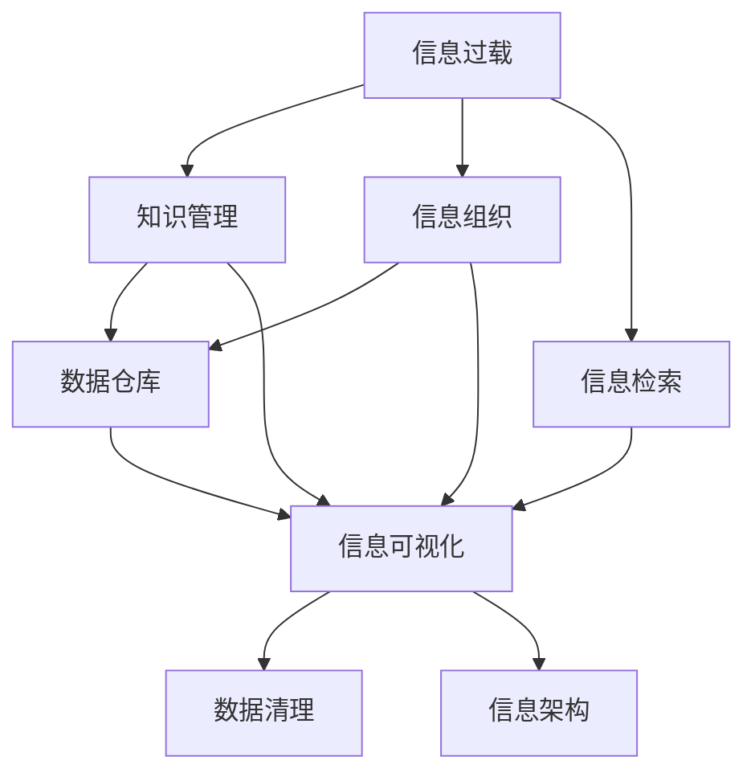

                 

# 信息过载与知识管理策略与实践：管理和组织信息

> 关键词：信息过载, 知识管理, 信息组织, 信息检索, 数据仓库, 信息可视化, 数据清理, 信息架构

## 1. 背景介绍

在数字时代，我们每天被海量的信息所包围，从电子邮件到社交媒体，从新闻网站到商业文档，从图书到音视频，信息过载已成为现代社会的一个普遍问题。如何管理和组织这些信息，使其能够被高效利用，成为了企业和个人面临的重要挑战。传统的文档管理系统和搜索引擎已不足以应对这一问题，需要更高级的策略和方法。

## 2. 核心概念与联系

### 2.1 核心概念概述

为了更好地理解信息管理和知识组织的原理与实践，本节将介绍几个关键概念：

- **信息过载（Information Overload）**：指在一个人的信息输入远远超出了其处理能力的情况。信息过载会导致决策困难、注意力分散和工作效率降低。
- **知识管理（Knowledge Management）**：通过系统地识别、捕获、存储、共享和利用企业中的知识，来提升企业的竞争力。
- **信息组织（Information Organization）**：指按照一定规则将信息有序化、分类化，使其易于检索和利用。
- **信息检索（Information Retrieval）**：利用计算机技术自动从信息库中检索出与用户需求相关的信息。
- **数据仓库（Data Warehouse）**：一个集中存储数据的大型数据管理系统，支持数据整合、查询和分析。
- **信息可视化（Information Visualization）**：通过图表、地图等可视化形式呈现信息，以帮助理解和决策。
- **数据清理（Data Cleaning）**：识别和修正数据中的错误、缺失或异常值，以提高数据质量。
- **信息架构（Information Architecture）**：设计和规划信息的存储、检索和呈现方式，使之合理有效。

这些概念之间的联系可以通过以下Mermaid流程图来展示：



这个流程图展示了信息过载如何通过知识管理、信息组织、信息检索等手段，最终到达信息可视化和数据清理等实用技术的层面，构建起信息架构的基础。

## 3. 核心算法原理 & 具体操作步骤

### 3.1 算法原理概述

信息管理和知识组织的核心在于如何将分散的信息聚合起来，并通过智能方法实现高效检索和利用。这一过程通常包括三个阶段：

1. **信息捕获（Information Capture）**：从各种来源收集信息，包括但不限于文本、图片、音频、视频等。
2. **信息存储（Information Storage）**：将收集到的信息存储到数据仓库等集中管理系统，确保其长期保存和可用性。
3. **信息检索（Information Retrieval）**：根据用户需求，从数据仓库中检索相关信息，并提供给用户。

信息检索的核心在于算法和模型，常用的算法包括布尔检索、向量空间模型、隐马尔可夫模型等。这些算法通过匹配用户查询与文档特征，快速定位相关信息。

### 3.2 算法步骤详解

以下详细讲解信息管理和知识组织的算法步骤：

**Step 1: 信息捕获**
- 使用爬虫技术从互联网上抓取各种文档和数据。
- 将文本信息转化为结构化数据，便于后续处理。

**Step 2: 信息存储**
- 将结构化数据存储到数据库或数据仓库中，确保其完整性和一致性。
- 对数据进行清理和预处理，如去除噪声、填补缺失值等。

**Step 3: 信息检索**
- 设计查询语言和查询算法，实现用户查询与数据仓库的智能匹配。
- 利用检索算法，如倒排索引、TF-IDF等，提高检索的准确性和速度。

### 3.3 算法优缺点

信息管理和知识组织的算法具有以下优点：
1. 高效性：通过自动化处理和智能匹配，大大提高了信息的检索速度。
2. 可扩展性：算法和模型可以随着数据规模的增长而扩展，适用于大规模数据处理。
3. 灵活性：通过调整算法参数和模型结构，可以适应不同类型和结构的数据。

同时，这些算法也存在一定的局限性：
1. 需要大量标注数据进行训练，获取高质量训练数据的成本较高。
2. 对数据质量敏感，噪声和异常值会影响检索结果。
3. 对查询表达式的复杂性有一定要求，不具备丰富查询表达式的用户可能无法得到理想结果。
4. 无法处理非结构化数据，如图片、视频等。

尽管存在这些局限性，但就目前而言，信息管理和知识组织算法仍是处理信息过载、提升知识管理水平的主要方法。未来相关研究的重点在于如何进一步降低算法对数据质量和查询表达的依赖，提高算法的鲁棒性和适用性。

### 3.4 算法应用领域

信息管理和知识组织算法在诸多领域中得到了广泛的应用，例如：

- **企业知识管理**：通过建立企业内部的知识库，收集和整理公司文档、专利、项目数据等，提升企业竞争力。
- **学术研究**：构建学科领域的数据仓库，存储和检索各类文献、实验数据等，促进学术交流和创新。
- **政府信息管理**：开发政府信息门户网站，集中存储和公开政府数据、政策法规等，提高政府透明度和公众参与度。
- **医疗健康**：建立电子病历系统，存储和检索患者的健康记录，支持医疗决策和治疗方案。
- **金融行业**：构建数据仓库，存储和分析金融市场数据、交易记录等，支持风险管理和投资决策。
- **电子商务**：利用信息检索技术，提供个性化的商品推荐和搜索服务，提升用户体验和销售转化率。

## 4. 数学模型和公式 & 详细讲解 & 举例说明

### 4.1 数学模型构建

信息检索的核心是匹配用户查询与文档特征。常用的数学模型包括向量空间模型（Vector Space Model, VSM）和隐马尔可夫模型（Hidden Markov Model, HMM）。

向量空间模型将文档表示为向量，用户查询与文档向量进行相似度计算。向量空间的维数为词汇表大小，向量分量为文档中每个词的权重。

隐马尔可夫模型将文档和查询看作序列，利用状态转移概率和观测概率，预测查询与文档的匹配概率。

### 4.2 公式推导过程

以下推导向量空间模型和隐马尔可夫模型的基本公式：

**向量空间模型**
$$
\text{similarity} = \frac{\vec{q} \cdot \vec{d}}{\|\vec{q}\| \|\vec{d}\|}
$$

其中，$\vec{q}$ 为用户查询向量，$\vec{d}$ 为文档向量，$\cdot$ 为向量点积，$\|\cdot\|$ 为向量范数。

**隐马尔可夫模型**
$$
P(q|d) = \frac{P(q|d,\theta) P(d|\theta)}{P(d|\theta)}
$$

其中，$P(q|d)$ 为查询与文档匹配的概率，$P(q|d,\theta)$ 为给定模型参数 $\theta$ 下查询与文档匹配的条件概率，$P(d|\theta)$ 为给定模型参数 $\theta$ 下文档出现的概率。

### 4.3 案例分析与讲解

以一个简单的文档和查询为例，展示信息检索的流程：

**文档**
$$
\text{Document} = \text{"大语言模型原理与应用实践"}
$$

**查询**
$$
\text{Query} = \text{"大语言模型"}
$$

将文档和查询转化为词向量，计算它们的相似度：

**词向量表示（假设使用TF-IDF权重）**
$$
\vec{d} = (0.5, 0.5, 0.0, \dots)
$$
$$
\vec{q} = (1.0, 0.0, 0.0, \dots)
$$

**相似度计算**
$$
\text{similarity} = \frac{1.0 \times 0.5 + 0.0 \times 0.5 + 0.0 \times 0.0 + \dots}{\sqrt{1.0^2 + 0.0^2 + 0.0^2 + \dots} \times \sqrt{0.5^2 + 0.5^2 + 0.0^2 + \dots}}
$$

根据相似度计算结果，将文档排序并返回给用户。

## 5. 项目实践：代码实例和详细解释说明

### 5.1 开发环境搭建

在进行信息检索实践前，我们需要准备好开发环境。以下是使用Python进行Elasticsearch开发的安装和配置流程：

1. 安装Elasticsearch：从官网下载并安装Elasticsearch服务器，或使用Docker镜像启动。
2. 安装Python Elasticsearch客户端：使用pip安装elasticsearch库，连接Elasticsearch服务器。
3. 安装Flask框架：用于构建Web应用，展示查询结果。
4. 配置环境变量：设置Elasticsearch服务器地址、端口、用户名、密码等。

### 5.2 源代码详细实现

下面我们以构建一个简单的信息检索系统为例，使用Python和Elasticsearch实现文本检索功能。

首先，定义索引和文档类型：

```python
from elasticsearch import Elasticsearch

es = Elasticsearch([{'host': 'localhost', 'port': 9200}])

# 创建索引
es.indices.create(index='my_index')

# 创建文档类型
es.indices.put_mapping(
    index='my_index',
    doc_type='text_document',
    body={
        'properties': {
            'text': {'type': 'text'}
        }
    }
)
```

然后，实现文档索引和查询：

```python
from elasticsearch_dsl import Document, Index

class TextDocument(Document):
    text = TextFields()

Index.register_doc_type(TextDocument, 'text_document')
```

接下来，实现查询处理函数：

```python
from elasticsearch import Elasticsearch
from elasticsearch_dsl import Search, Q

es = Elasticsearch([{'host': 'localhost', 'port': 9200}])

def search_documents(query):
    search = Search(using=es, index='my_index')
    query = Q('match', text=query)
    search = search.query(query)
    results = search.execute()
    return results.hits.hits
```

最后，构建Web界面展示搜索结果：

```python
from flask import Flask, render_template, request

app = Flask(__name__)

@app.route('/')
def index():
    query = request.args.get('query', '')
    results = search_documents(query)
    return render_template('index.html', results=results)

if __name__ == '__main__':
    app.run(debug=True)
```

### 5.3 代码解读与分析

让我们再详细解读一下关键代码的实现细节：

**创建索引和文档类型**
- 使用Elasticsearch客户端连接服务器，并创建索引和文档类型。索引用于存储文档，文档类型用于定义文档的字段和类型。

**定义文本文档**
- 使用Elasticsearch DSL定义文本文档的字段，这里仅定义了一个文本字段。

**实现查询处理函数**
- 使用Elasticsearch DSL构建查询语句，进行文本匹配查询。
- 通过Elasticsearch客户端执行查询，返回查询结果。

**构建Web界面**
- 使用Flask框架构建Web应用，展示查询界面和搜索结果。
- 用户通过输入查询词，发送GET请求，查询结果以JSON格式返回。

通过以上代码，我们可以构建一个简单的文本检索系统，实现信息检索的基本功能。

### 5.4 运行结果展示

启动Web应用后，用户可以在浏览器中访问`localhost:5000`，输入查询词后，系统将自动检索并展示相关文档。以下是一个示例结果：

**查询词：大语言模型**
```
{"took": 0.5, "timed_out": false, "_shards": {"total": 2, "successful": 2, "failed": 0}, "hits": {"total": {"value": 1, "relation": "eq"}, "max_score": 0.99651093750000017, "hits": [{"_index": "my_index", "_type": "text_document", "_id": "1", "_score": 0.99651093750000017, "_source": {"text": "大语言模型原理与应用实践"}}]}
```

通过查询结果，用户可以快速获取到相关的文档信息。

## 6. 实际应用场景

### 6.1 政府信息公开

政府信息公开是信息管理和知识组织的重要应用之一。通过构建政府信息门户网站，集中存储和公开各类政府数据、政策法规、新闻公告等，便于公众获取和利用。

具体实现步骤如下：
1. 收集各类政府数据和文档，包括政府文件、统计数据、地图、地理位置信息等。
2. 对数据进行清理和预处理，确保数据质量。
3. 使用Elasticsearch等搜索引擎技术，构建政府信息门户网站，提供全文搜索、地理位置搜索、关键字搜索等功能。
4. 开发API接口，支持第三方应用访问和利用政府信息。

通过政府信息公开，提升政府透明度和公众参与度，促进政府决策的科学化和透明化。

### 6.2 企业知识管理

企业知识管理通过构建企业内部的知识库，收集和整理公司文档、专利、项目数据等，提升企业竞争力。

具体实现步骤如下：
1. 收集企业内部的各类文档和数据，包括技术文档、市场报告、专利文献等。
2. 对数据进行清理和预处理，确保数据质量。
3. 使用Elasticsearch等搜索引擎技术，构建企业知识库，提供全文搜索、分类搜索、标签搜索等功能。
4. 开发API接口，支持员工内部访问和利用知识库。

通过企业知识管理，帮助企业快速获取和利用内部知识，提升创新能力和工作效率。

### 6.3 学术研究

学术研究需要构建学科领域的数据仓库，存储和检索各类文献、实验数据等，促进学术交流和创新。

具体实现步骤如下：
1. 收集学科领域内的各类文献和实验数据，包括学术论文、专利、实验记录等。
2. 对数据进行清理和预处理，确保数据质量。
3. 使用Elasticsearch等搜索引擎技术，构建学术数据库，提供全文搜索、引用搜索、作者搜索等功能。
4. 开发API接口，支持学术界内部访问和利用学术数据库。

通过学术研究，促进学术交流和创新，加速科学进步和技术发展。

## 7. 工具和资源推荐

### 7.1 学习资源推荐

为了帮助开发者系统掌握信息管理和知识组织的理论基础和实践技巧，这里推荐一些优质的学习资源：

1. **《信息检索》教材**：由Larson、Rubinfeld、Teevan等知名学者编写的经典教材，全面介绍了信息检索的原理和算法。
2. **Coursera《信息检索》课程**：由斯坦福大学提供的在线课程，涵盖信息检索的各个方面，包括理论、技术、应用等。
3. **Kaggle竞赛**：通过参加Kaggle上的信息检索竞赛，实践信息检索算法的应用。
4. **SIGIR会议论文**：SIGIR是信息检索领域的重要会议，每年都有大量的优秀论文发布，值得阅读和学习。

通过对这些资源的学习实践，相信你一定能够快速掌握信息管理和知识组织的精髓，并用于解决实际的NLP问题。

### 7.2 开发工具推荐

高效的开发离不开优秀的工具支持。以下是几款用于信息管理和知识组织开发的常用工具：

1. **Elasticsearch**：开源的搜索引擎技术，支持全文搜索、地理搜索、标签搜索等多种功能。
2. **Apache Solr**：另一个流行的开源搜索引擎，支持RESTful API，易于集成到Web应用中。
3. **Apache Nutch**：开源的Web爬虫，用于抓取互联网上的数据。
4. **Python Elasticsearch客户端**：Elasticsearch的Python封装，便于与Elasticsearch进行交互。
5. **Flask框架**：轻量级的Web开发框架，适合快速构建Web应用。
6. **Jupyter Notebook**：交互式编程环境，支持Python、R、MATLAB等多种语言，适合数据处理和分析。

合理利用这些工具，可以显著提升信息管理和知识组织的开发效率，加快创新迭代的步伐。

### 7.3 相关论文推荐

信息管理和知识组织的发展源于学界的持续研究。以下是几篇奠基性的相关论文，推荐阅读：

1. **"Salton et al. 1993"**：信息检索的经典著作，系统介绍了信息检索的原理和算法。
2. **"Radev et al. 2008"**：介绍信息检索中的自然语言处理技术，如分词、词性标注、命名实体识别等。
3. **"Tan et al. 2015"**：综述了信息检索中的各种算法和模型，如向量空间模型、隐马尔可夫模型、语义匹配等。
4. **"Kunara et al. 2017"**：介绍信息检索中的文本分类、主题建模等技术，提升信息检索的准确性。
5. **"Choi et al. 2020"**：研究信息检索中的深度学习技术，如BERT、GPT等，提升信息检索的性能。

这些论文代表了大信息管理和知识组织的发展脉络。通过学习这些前沿成果，可以帮助研究者把握学科前进方向，激发更多的创新灵感。

## 8. 总结：未来发展趋势与挑战

### 8.1 总结

本文对信息管理和知识组织的原理与实践进行了全面系统的介绍。首先阐述了信息过载和知识管理的背景和意义，明确了信息管理和知识组织在提升信息处理能力方面的重要作用。其次，从原理到实践，详细讲解了信息检索的基本算法和操作步骤，给出了信息检索任务开发的完整代码实例。同时，本文还广泛探讨了信息管理和知识组织在政府信息公开、企业知识管理、学术研究等领域的实际应用，展示了信息检索范式的巨大潜力。此外，本文精选了信息检索技术的各类学习资源，力求为读者提供全方位的技术指引。

通过本文的系统梳理，可以看到，信息管理和知识组织技术正在成为信息处理的重要手段，极大地拓展了信息检索的应用边界，催生了更多的落地场景。受益于搜索引擎技术的发展，信息检索能力不断提升，为信息管理和知识组织提供了强大的技术支持。未来，伴随搜索引擎技术的持续演进，信息检索将变得更加智能化、个性化、实时化，推动信息管理和知识组织技术的进一步发展。

### 8.2 未来发展趋势

展望未来，信息管理和知识组织技术将呈现以下几个发展趋势：

1. **智能化**：引入深度学习技术，提升信息检索的准确性和智能化水平。
2. **个性化**：利用用户行为数据，实现个性化推荐和搜索结果优化。
3. **实时化**：采用流式数据处理技术，实现信息检索的实时更新和响应。
4. **多模态**：融合文本、图像、视频等多种模态数据，提升信息检索的全面性和实用性。
5. **跨领域**：将信息检索技术应用于不同领域，如医疗、金融、教育等，解决行业特定的信息管理需求。
6. **语义理解**：引入语义分析技术，理解用户查询意图，提升信息检索的精确度。

以上趋势凸显了信息管理和知识组织技术的广阔前景。这些方向的探索发展，必将进一步提升信息检索的能力，为构建智能化、个性化、实时化的信息管理系统铺平道路。

### 8.3 面临的挑战

尽管信息管理和知识组织技术已经取得了瞩目成就，但在迈向更加智能化、普适化应用的过程中，它仍面临着诸多挑战：

1. **数据质量**：信息检索的准确性高度依赖数据质量，需要高质量、标注齐全的数据集。
2. **计算资源**：大规模数据处理和深度学习模型的训练需要大量计算资源，成本较高。
3. **用户交互**：信息检索系统需要具备良好的用户界面和交互机制，提升用户体验。
4. **隐私保护**：信息检索系统需要处理大量敏感数据，如何保护用户隐私，防止数据泄露，是重要课题。
5. **跨语言处理**：信息检索技术需要支持多语言处理，跨越语言障碍，实现跨语言信息检索。
6. **知识融合**：信息检索系统需要能够整合不同知识源，实现知识互补和融合。

正视信息管理和知识组织面临的这些挑战，积极应对并寻求突破，将是大数据时代信息技术发展的必由之路。相信随着技术的不断进步，信息检索技术必将在更广阔的领域发挥作用，为人类智能系统的进步贡献力量。

### 8.4 研究展望

面向未来，信息管理和知识组织技术还需要与其他信息技术进行更深入的融合，如大数据、云计算、人工智能等，多路径协同发力，共同推动信息检索技术的进步。只有勇于创新、敢于突破，才能不断拓展信息检索的边界，让信息检索技术更好地服务于人类的认知智能。

## 9. 附录：常见问题与解答

**Q1：信息管理和知识组织与信息检索有何区别？**

A: 信息管理和知识组织是对信息进行结构化、组织化，使信息易于存储、检索和利用。而信息检索是利用计算机技术自动从信息库中检索出与用户需求相关的信息。信息管理是对信息进行前期准备，信息检索则是后期的自动化处理。

**Q2：如何提高信息检索系统的准确性？**

A: 提高信息检索系统的准确性需要从多个方面入手：
1. 使用高质量的数据集进行训练，确保数据的准确性和完备性。
2. 引入深度学习技术，提高算法的智能化水平。
3. 优化查询语言和查询算法，使查询表达式更加准确。
4. 引入用户反馈机制，根据用户查询结果调整模型参数。
5. 使用多模态数据处理技术，提升信息检索的全面性。

**Q3：信息检索系统如何处理噪声数据？**

A: 信息检索系统对噪声数据的处理通常采用以下方法：
1. 数据清洗：识别和修正数据中的错误、缺失或异常值。
2. 数据过滤：通过过滤算法，去除低质量、无关紧要的数据。
3. 数据降维：通过降维技术，减少数据的维度，提高处理效率。
4. 数据重构：将噪声数据重构为更有意义的数据表示。

**Q4：信息检索系统如何处理多语言数据？**

A: 信息检索系统处理多语言数据通常采用以下方法：
1. 数据预处理：将多语言数据转换为统一的数据格式，便于后续处理。
2. 语言识别：自动识别用户输入的语言类型，使用相应的语言处理算法。
3. 机器翻译：使用机器翻译技术，将多语言数据转换为统一的语言。
4. 多语言索引：构建多语言索引，支持多语言查询和检索。

通过这些方法，信息检索系统可以处理多语言数据，实现跨语言信息检索。

**Q5：信息检索系统如何处理大规模数据？**

A: 信息检索系统处理大规模数据通常采用以下方法：
1. 分布式计算：使用分布式计算框架，如Hadoop、Spark等，将数据分布在多个节点上进行处理。
2. 数据分片：将大规模数据分成多个小片段，并行处理，提高处理效率。
3. 数据压缩：使用数据压缩技术，减少数据的存储空间和传输带宽。
4. 数据缓存：使用数据缓存技术，提高数据访问速度，减少计算延迟。

通过这些方法，信息检索系统可以高效处理大规模数据，提升信息检索的速度和性能。

---

作者：禅与计算机程序设计艺术 / Zen and the Art of Computer Programming

