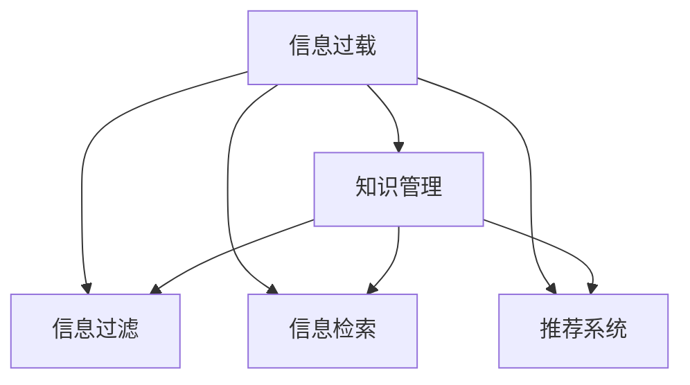

                 

## 1. 背景介绍

在数字化时代，信息的海量化和复杂化已成为一个普遍现象，即所谓的“信息过载”。人们每天面临大量的文档、新闻、电子邮件、社交媒体信息等，难以高效处理和利用这些信息。与此同时，随着互联网和社交媒体的普及，信息获取渠道愈加丰富，加速了信息过载问题。

**1.1 问题由来**

信息过载在现代信息时代是一个日益严重的挑战。互联网和智能手机的普及使得信息无处不在，同时也使得人们难以专注于重要的信息。信息过载可能导致人们无法及时识别关键信息，从而影响决策和判断。为了应对这一挑战，我们需要有效的知识管理策略，帮助人们高效组织和检索信息。

**1.2 问题核心关键点**

信息过载的核心问题在于信息的海量化和复杂化，以及人们获取信息的能力不足。解决这一问题的关键在于开发有效的信息组织和检索技术，帮助用户快速定位和理解关键信息。主要的技术手段包括信息过滤、索引、搜索引擎、推荐系统等。

## 2. 核心概念与联系

### 2.1 核心概念概述

为更好地理解信息过载及其解决策略，本节将介绍几个密切相关的核心概念：

- **信息过载(Information Overload)**：指的是用户面临的信息量超出了其处理能力，无法及时处理和利用信息的情况。
- **知识管理(Knowledge Management)**：通过合理规划和组织信息，帮助用户更好地存储、检索和应用知识。
- **信息过滤(Information Filtering)**：通过对信息进行筛选和分类，帮助用户快速识别关键信息。
- **信息检索(Information Retrieval)**：通过搜索算法和技术，帮助用户快速找到所需的信息。
- **推荐系统(Recommender Systems)**：通过分析用户行为，为用户推荐可能感兴趣的信息。

这些核心概念之间的逻辑关系可以通过以下Mermaid流程图来展示：



这个流程图展示了大语言模型的核心概念及其之间的关系：

1. 信息过载问题需要通过知识管理、信息过滤、信息检索和推荐系统等多维策略来共同解决。
2. 知识管理策略帮助组织和应用知识，是解决信息过载的基础。
3. 信息过滤和信息检索技术从信息的海量数据中提取关键信息。
4. 推荐系统通过用户行为分析，提供个性化的信息推荐。

这些核心概念共同构成了信息过载解决策略的技术框架，帮助用户高效地组织和检索信息。

## 3. 核心算法原理 & 具体操作步骤

### 3.1 算法原理概述

信息过载的解决主要依赖于信息组织、检索和推荐技术。这些技术可以采用以下算法原理：

- **信息过滤算法**：通过分类和筛选，帮助用户快速识别重要信息。常见算法包括朴素贝叶斯、支持向量机、决策树等。
- **信息检索算法**：通过建立索引，在数据库中快速检索信息。常见算法包括布尔检索、向量空间模型等。
- **推荐系统算法**：通过分析用户历史行为和偏好，预测用户可能感兴趣的信息。常见算法包括协同过滤、基于内容的推荐等。

这些算法在解决信息过载问题时，通常需要处理海量数据和复杂的计算过程，因此需要高效的技术和工具支持。

### 3.2 算法步骤详解

以信息过滤算法为例，详细讲解其实现步骤：

**Step 1: 数据收集**
- 从不同渠道收集用户感兴趣的文档、文章、网页等文本信息。
- 建立文档的元数据，包括关键词、发布时间、作者、来源等。

**Step 2: 数据预处理**
- 去除文本中的停用词、噪声信息。
- 对文本进行分词、词性标注、命名实体识别等处理。
- 使用TF-IDF、词向量等方法将文本转化为数值形式。

**Step 3: 训练分类器**
- 选择合适的分类算法，如朴素贝叶斯、支持向量机等。
- 划分训练集和测试集，使用训练集训练分类器。
- 在测试集上评估分类器的性能。

**Step 4: 信息过滤**
- 使用训练好的分类器对新信息进行分类。
- 将分类结果显示给用户，帮助其识别重要信息。

### 3.3 算法优缺点

信息过滤算法的主要优点在于能够帮助用户快速识别重要信息，减少信息过载。其缺点在于需要大量的标注数据进行训练，且分类效果受到标注质量和数量影响较大。

信息检索算法的主要优点在于能够快速检索大量文本信息，满足用户对信息的检索需求。其缺点在于检索效果受索引质量的影响较大，且在处理文本语义时存在一定的局限性。

推荐系统算法的优点在于能够根据用户历史行为和偏好，提供个性化的信息推荐，提升用户体验。其缺点在于需要大规模用户数据进行训练，且推荐效果受到用户数据偏差和多样性的影响。

### 3.4 算法应用领域

信息过载解决策略主要应用于以下领域：

- **新闻和媒体**：通过信息过滤和信息检索技术，帮助用户快速获取重要新闻和信息。
- **电子商务**：通过推荐系统算法，为用户提供个性化的商品推荐。
- **社交媒体**：通过信息过滤和推荐系统，帮助用户过滤无用信息，发现有用的内容。
- **企业内部知识管理**：通过知识管理策略，帮助企业组织和应用知识，提升员工工作效率。

这些应用领域展示了信息过载解决策略的广泛性和实用性。

## 4. 数学模型和公式 & 详细讲解 & 举例说明

### 4.1 数学模型构建

信息过滤算法通常采用朴素贝叶斯模型进行构建。假设文本集合 $D$ 包含 $m$ 个文档 $d_i$，每个文档有 $n$ 个词 $w_{i,j}$，则文本的向量表示可以表示为 $d = [w_{1,1}, w_{1,2}, \ldots, w_{m,n}]$。朴素贝叶斯模型通过计算文本 $d$ 属于类别 $c$ 的概率 $P(c|d)$ 来分类文本，其公式如下：

$$
P(c|d) = \frac{P(c)P(d|c)}{P(d)}
$$

其中，$P(c)$ 是类别 $c$ 的概率，$P(d|c)$ 是文本 $d$ 在类别 $c$ 下的概率，$P(d)$ 是文本 $d$ 的总概率。

### 4.2 公式推导过程

朴素贝叶斯模型基于贝叶斯定理，通过计算文本属于每个类别的概率，选择概率最大的类别作为文本的分类结果。具体推导过程如下：

设类别 $c$ 的先验概率为 $P(c)$，文本 $d$ 在类别 $c$ 下的条件概率为 $P(d|c)$，则文本 $d$ 属于类别 $c$ 的概率为：

$$
P(c|d) = \frac{P(c)P(d|c)}{P(d)}
$$

其中，$P(d)$ 可以用文本中所有词出现的概率之和表示：

$$
P(d) = \prod_{j=1}^n P(w_{m,j})
$$

代入公式得到：

$$
P(c|d) = \frac{P(c)\prod_{j=1}^n P(w_{m,j}|c)}{\prod_{j=1}^n P(w_{m,j})}
$$

进一步简化为：

$$
P(c|d) = \frac{P(c)\prod_{j=1}^n \frac{P(w_{m,j}|c)}{P(w_{m,j})}}{\prod_{j=1}^n P(w_{m,j})}
$$

由于 $P(c)$ 和 $P(d)$ 是已知常数，因此信息过滤模型的关键在于计算 $P(w_{m,j}|c)$。在实践中，通常使用词袋模型或TF-IDF模型来估计这个条件概率。

### 4.3 案例分析与讲解

以一个简单的新闻分类任务为例，展示信息过滤算法的应用过程：

假设有一个包含政治、经济和体育三个类别的新闻数据集，每个新闻包含多个词。使用朴素贝叶斯模型进行分类时，首先需要对每个类别和词进行概率估计：

- 对于政治类别，假设样本总数为 $N_{pol}$，其中包含政治类新闻 $n_{pol}$ 篇，政治类新闻中出现词 $w_i$ 的频率为 $f_{pol,i}$。则政治类新闻中出现词 $w_i$ 的概率为：

$$
P(w_i|pol) = \frac{f_{pol,i}}{n_{pol}}
$$

- 对于经济类别，假设样本总数为 $N_{eco}$，其中包含经济类新闻 $n_{eco}$ 篇，经济类新闻中出现词 $w_i$ 的频率为 $f_{eco,i}$。则经济类新闻中出现词 $w_i$ 的概率为：

$$
P(w_i|eco) = \frac{f_{eco,i}}{n_{eco}}
$$

- 对于体育类别，假设样本总数为 $N_{spt}$，其中包含体育类新闻 $n_{spt}$ 篇，体育类新闻中出现词 $w_i$ 的频率为 $f_{spt,i}$。则体育类新闻中出现词 $w_i$ 的概率为：

$$
P(w_i|spt) = \frac{f_{spt,i}}{n_{spt}}
$$

在得到每个词在每个类别下的概率后，假设待分类的新闻 $d$ 包含词 $w_1, w_2, \ldots, w_n$，则该新闻属于政治、经济和体育三个类别的概率分别为：

- 政治类概率：

$$
P(pol|d) = \frac{P(pol)\prod_{i=1}^n P(w_i|pol)}{\prod_{i=1}^n P(w_i)}
$$

- 经济类概率：

$$
P(eco|d) = \frac{P(eco)\prod_{i=1}^n P(w_i|eco)}{\prod_{i=1}^n P(w_i)}
$$

- 体育类概率：

$$
P(spt|d) = \frac{P(spt)\prod_{i=1}^n P(w_i|spt)}{\prod_{i=1}^n P(w_i)}
$$

最终选择概率最大的类别作为新闻的分类结果。

## 5. 项目实践：代码实例和详细解释说明

### 5.1 开发环境搭建

在进行信息过滤实践前，我们需要准备好开发环境。以下是使用Python进行Scikit-learn开发的环境配置流程：

1. 安装Anaconda：从官网下载并安装Anaconda，用于创建独立的Python环境。

2. 创建并激活虚拟环境：
```bash
conda create -n infofilter-env python=3.8 
conda activate infofilter-env
```

3. 安装Scikit-learn：
```bash
conda install scikit-learn
```

4. 安装其他工具包：
```bash
pip install numpy pandas matplotlib seaborn tqdm joblib
```

完成上述步骤后，即可在`infofilter-env`环境中开始信息过滤实践。

### 5.2 源代码详细实现

下面我们以朴素贝叶斯分类器为例，给出使用Scikit-learn进行信息过滤的Python代码实现。

首先，定义朴素贝叶斯分类器：

```python
from sklearn.naive_bayes import MultinomialNB

# 定义训练集和测试集
train_X = [...]  # 训练集特征矩阵
train_y = [...]  # 训练集标签向量

# 创建朴素贝叶斯分类器
clf = MultinomialNB()

# 训练分类器
clf.fit(train_X, train_y)
```

然后，定义测试集并进行分类：

```python
# 定义测试集
test_X = [...]  # 测试集特征矩阵

# 进行分类
y_pred = clf.predict(test_X)
```

最后，评估分类器的性能：

```python
from sklearn.metrics import accuracy_score

# 定义测试集标签向量
test_y = [...]

# 计算准确率
accuracy = accuracy_score(test_y, y_pred)
print(f"Accuracy: {accuracy}")
```

以上就是使用Scikit-learn对朴素贝叶斯分类器进行信息过滤的完整代码实现。可以看到，Scikit-learn封装了常用的分类算法，使得代码实现变得简洁高效。

### 5.3 代码解读与分析

让我们再详细解读一下关键代码的实现细节：

**MultinomialNB类**：
- 定义了一个朴素贝叶斯分类器，使用多项式概率模型进行文本分类。

**训练集和测试集定义**：
- `train_X`和`train_y`是训练集特征矩阵和标签向量，`test_X`是测试集特征矩阵。

**分类器训练**：
- 使用`clf.fit`方法训练朴素贝叶斯分类器。
- `clf.predict`方法用于对新样本进行分类。

**性能评估**：
- 使用`accuracy_score`方法计算分类器的准确率。

可以看到，Scikit-learn提供了强大的分类算法封装和工具支持，使得信息过滤的实现变得简单高效。

当然，工业级的系统实现还需考虑更多因素，如模型的保存和部署、超参数的自动搜索、更灵活的任务适配层等。但核心的信息过滤范式基本与此类似。

## 6. 实际应用场景

### 6.1 智能推荐系统

智能推荐系统是信息过载解决策略的重要应用领域。通过分析用户的浏览历史、评分和交互行为，智能推荐系统能够为用户推荐可能感兴趣的商品、电影、新闻等。推荐系统通常采用协同过滤、基于内容的推荐等算法进行实现。

在技术实现上，推荐系统通常采用以下步骤：

1. 收集用户行为数据：记录用户浏览、点击、评分、收藏等行为。
2. 构建用户画像：对用户行为数据进行分析和建模，形成用户画像。
3. 推荐模型训练：选择合适的推荐算法，对用户画像和物品特征进行训练。
4. 实时推荐：在用户查看页面时，根据用户画像和物品特征实时计算推荐结果。

推荐系统已经成为电商、社交媒体、内容平台等行业的标配，极大地提升了用户体验和满意度。

### 6.2 新闻聚合

新闻聚合系统通过收集并整理大量新闻信息，帮助用户快速获取重要新闻和信息。信息过滤和信息检索技术在新闻聚合中应用广泛。

在技术实现上，新闻聚合系统通常采用以下步骤：

1. 新闻爬取：使用爬虫程序自动抓取新闻网站的新闻内容。
2. 文本预处理：对抓取的新闻进行文本清洗、分词、去除停用词等处理。
3. 分类与检索：使用信息过滤和信息检索技术，对新闻进行分类和检索。
4. 展示与推送：根据用户的兴趣和偏好，展示和推送相关新闻。

新闻聚合系统已经成为新闻行业的标配，极大地提升了新闻媒体的传播效率和用户获取信息的便利性。

### 6.3 企业知识管理

企业知识管理是信息过载解决策略的重要应用领域。通过合理规划和组织信息，帮助企业更好地存储、检索和应用知识。

在技术实现上，企业知识管理系统通常采用以下步骤：

1. 知识收集：收集企业的内部文档、邮件、报告等知识资源。
2. 知识存储：使用数据库和搜索引擎等工具，对知识资源进行存储和索引。
3. 知识检索：使用信息检索技术，帮助用户快速检索所需知识。
4. 知识应用：通过推荐系统和协作工具，帮助用户更好地应用知识。

企业知识管理系统的应用，可以大大提升企业的知识共享和应用效率，帮助企业更好地应对市场竞争和创新挑战。

### 6.4 未来应用展望

随着技术的不断进步，信息过载解决策略将在更多领域得到应用，为各行各业带来变革性影响。

在智慧医疗领域，通过信息过滤和信息检索技术，可以提升医生的诊疗效率和患者的满意程度。在智慧教育领域，通过个性化推荐和知识管理，可以提升教学效果和学习体验。在智慧城市治理中，通过实时信息和知识管理，可以提高城市管理的智能化水平，构建更安全、高效的未来城市。

此外，在企业生产、社会治理、文娱传媒等众多领域，信息过载解决策略也将不断涌现，为传统行业数字化转型升级提供新的技术路径。

## 7. 工具和资源推荐

### 7.1 学习资源推荐

为了帮助开发者系统掌握信息过载解决策略的理论基础和实践技巧，这里推荐一些优质的学习资源：

1. 《推荐系统实践》：由大模型技术专家撰写，深入浅出地介绍了推荐系统的原理、算法和应用。

2. 《信息检索基础》课程：由斯坦福大学开设的NLP明星课程，涵盖信息检索的基础概念和经典模型。

3. 《知识管理与信息检索》书籍：系统介绍了知识管理与信息检索的原理、技术和应用。

4. 《自然语言处理综述》：系统介绍了自然语言处理的基础概念、技术和应用，包括信息过滤和信息检索。

5. Weights & Biases：模型训练的实验跟踪工具，可以记录和可视化模型训练过程中的各项指标，方便对比和调优。

通过对这些资源的学习实践，相信你一定能够快速掌握信息过载解决策略的精髓，并用于解决实际的NLP问题。

### 7.2 开发工具推荐

高效的开发离不开优秀的工具支持。以下是几款用于信息过滤和推荐系统开发的常用工具：

1. Scikit-learn：基于Python的开源机器学习库，封装了多种机器学习算法，包括朴素贝叶斯、支持向量机等。

2. TensorFlow：由Google主导开发的开源深度学习框架，生产部署方便，适合大规模工程应用。

3. Apache Spark：用于分布式数据处理的开源框架，支持大规模数据处理和机器学习算法。

4. Elasticsearch：基于Lucene的分布式搜索引擎，支持文本索引和检索。

5. Kibana：Elasticsearch的可视化工具，可实时监测和展示搜索数据。

6. TensorBoard：TensorFlow配套的可视化工具，可实时监测模型训练状态，并提供丰富的图表呈现方式。

合理利用这些工具，可以显著提升信息过滤和推荐系统的开发效率，加快创新迭代的步伐。

### 7.3 相关论文推荐

信息过载解决策略的发展源于学界的持续研究。以下是几篇奠基性的相关论文，推荐阅读：

1. A Probabilistic Interpretation of Contrastive Divergence and Other Algorithms：提出了一种基于对比学习的概率模型，用于提升推荐系统的效果。

2. A Neural Probabilistic Language Model：提出了基于神经网络的语言模型，用于文本分类和信息过滤。

3. A Survey of Recommender Systems：系统介绍了推荐系统的各种算法和应用，为推荐系统开发提供了全面的参考。

4. Information Retrieval：介绍了信息检索的原理、算法和技术，是信息检索领域的重要参考书。

这些论文代表了大语言模型微调技术的发展脉络。通过学习这些前沿成果，可以帮助研究者把握学科前进方向，激发更多的创新灵感。

## 8. 总结：未来发展趋势与挑战

### 8.1 总结

本文对信息过载及其解决策略进行了全面系统的介绍。首先阐述了信息过载问题的由来和核心关键点，明确了信息过滤、信息检索和推荐系统在解决信息过载问题中的重要作用。其次，从原理到实践，详细讲解了信息过滤算法的数学原理和操作步骤，给出了信息过滤任务开发的完整代码实例。同时，本文还广泛探讨了信息过载解决策略在智能推荐、新闻聚合、企业知识管理等多个领域的应用前景，展示了信息过载解决策略的广泛性和实用性。此外，本文精选了信息过滤技术的各类学习资源，力求为读者提供全方位的技术指引。

通过本文的系统梳理，可以看到，信息过滤技术是解决信息过载问题的有效手段，极大地提升了用户的信息处理能力。未来，伴随技术的发展，信息过滤算法将更加智能化和个性化，进一步提升用户体验。

### 8.2 未来发展趋势

展望未来，信息过滤技术将呈现以下几个发展趋势：

1. 深度学习的应用：深度学习技术在大规模数据上的表现优于传统机器学习算法，未来信息过滤算法将更加依赖深度学习技术。

2. 个性化推荐：信息过滤技术将更加注重个性化推荐，根据用户的兴趣和行为动态调整推荐结果。

3. 实时信息过滤：随着大数据技术的发展，实时信息过滤技术将更加成熟，能够实时监测和过滤新信息。

4. 多模态信息融合：信息过滤技术将更加注重多模态信息的融合，如文本、图像、音频等，提升信息处理的全面性和准确性。

5. 跨领域知识迁移：信息过滤技术将更加注重跨领域知识迁移，提升对不同领域信息的理解和处理能力。

以上趋势凸显了信息过滤技术的广阔前景。这些方向的探索发展，必将进一步提升信息处理的效果和用户满意度，为各行各业带来新的技术突破。

### 8.3 面临的挑战

尽管信息过滤技术已经取得了一定成果，但在迈向更加智能化、普适化应用的过程中，它仍面临诸多挑战：

1. 数据质量瓶颈：信息过滤的效果很大程度上取决于数据质量，低质量的数据可能导致分类效果不佳。如何获取高质量的数据，是信息过滤技术面临的重要问题。

2. 算法复杂度较高：深度学习算法通常需要大量的计算资源和时间，如何在保证效果的同时，降低算法复杂度，是一个重要研究方向。

3. 模型泛化性不足：信息过滤模型在不同领域和数据集上的泛化能力有限，需要进一步提升模型的泛化能力。

4. 隐私和安全问题：信息过滤技术涉及大量的用户隐私数据，如何保障数据隐私和安全，是一个重要挑战。

5. 实时性要求高：实时信息过滤技术需要快速响应和处理海量信息，对系统性能和资源调度提出了高要求。

6. 跨领域应用难度大：信息过滤技术在不同领域的应用难度较大，需要结合领域特点进行优化。

正视信息过滤技术面临的这些挑战，积极应对并寻求突破，将是大语言模型微调技术走向成熟的必由之路。相信随着学界和产业界的共同努力，这些挑战终将一一被克服，信息过滤技术必将在构建人机协同的智能时代中扮演越来越重要的角色。

### 8.4 研究展望

面对信息过滤技术所面临的挑战，未来的研究需要在以下几个方面寻求新的突破：

1. 探索无监督和半监督信息过滤方法。摆脱对大规模标注数据的依赖，利用自监督学习、主动学习等无监督和半监督范式，最大限度利用非结构化数据，实现更加灵活高效的信息过滤。

2. 研究高效的信息过滤算法。开发更加高效的信息过滤算法，如基于分布式计算的深度学习算法、基于图神经网络的推荐系统等，在保证效果的同时，降低算法复杂度。

3. 融合因果和对比学习范式。通过引入因果推断和对比学习思想，增强信息过滤模型建立稳定因果关系的能力，学习更加普适、鲁棒的信息表示。

4. 引入更多先验知识。将符号化的先验知识，如知识图谱、逻辑规则等，与神经网络模型进行巧妙融合，引导信息过滤过程学习更准确、合理的语言模型。

5. 结合因果分析和博弈论工具。将因果分析方法引入信息过滤模型，识别出模型决策的关键特征，增强输出解释的因果性和逻辑性。借助博弈论工具刻画人机交互过程，主动探索并规避模型的脆弱点，提高系统稳定性。

6. 纳入伦理道德约束。在信息过滤模型训练目标中引入伦理导向的评估指标，过滤和惩罚有偏见、有害的输出倾向。同时加强人工干预和审核，建立模型行为的监管机制，确保输出符合人类价值观和伦理道德。

这些研究方向的探索，必将引领信息过滤技术迈向更高的台阶，为构建安全、可靠、可解释、可控的智能系统铺平道路。面向未来，信息过滤技术还需要与其他人工智能技术进行更深入的融合，如知识表示、因果推理、强化学习等，多路径协同发力，共同推动自然语言理解和智能交互系统的进步。只有勇于创新、敢于突破，才能不断拓展信息过滤的边界，让智能技术更好地造福人类社会。

## 9. 附录：常见问题与解答

**Q1：信息过滤算法的精度和召回率如何权衡？**

A: 信息过滤算法的精度和召回率通常是一对矛盾的指标。精度指的是分类结果的正确性，召回率指的是真正正例的覆盖率。

在实际应用中，我们需要根据具体情况选择适当的权衡策略。例如，在某些领域（如医疗），错误分类可能会导致严重后果，因此我们需要更高的精度。在其他领域（如电子商务），漏掉一些有价值的商品可能会导致用户流失，因此我们需要更高的召回率。

**Q2：信息过滤算法如何避免数据偏差？**

A: 信息过滤算法的数据偏差问题主要体现在以下几个方面：

1. 数据不平衡：某些类别的样本数量过少，导致算法在处理这些类别时效果不佳。

2. 数据噪声：训练数据中包含大量噪声，可能导致算法过拟合。

3. 数据样本偏差：训练数据偏向某一特定用户或行为，导致算法泛化能力不足。

为了解决这些问题，我们需要：

1. 数据增强：通过数据扩充和增强技术，提升训练数据的样本数量和多样性。

2. 数据清洗：对训练数据进行去噪和清洗，提升数据质量。

3. 数据均衡：使用过采样和欠采样等方法，提升各类别的样本数量，平衡数据分布。

4. 数据选择：根据领域特点和应用场景，选择合适的数据源和数据集，避免数据样本偏差。

通过以上方法，可以有效避免信息过滤算法的数据偏差问题，提升算法的泛化能力和性能。

**Q3：信息过滤算法如何进行实时处理？**

A: 信息过滤算法的实时处理主要依赖于以下技术：

1. 分布式计算：使用分布式计算框架，如Apache Spark，对大规模数据进行并行处理，提升处理速度。

2. 数据流处理：使用流处理框架，如Apache Kafka、Apache Flink，对实时数据进行高效处理。

3. 缓存机制：使用缓存技术，如Redis，对高频访问的数据进行缓存，提升访问速度。

4. 增量学习：使用增量学习算法，对新数据进行增量更新，避免重新训练模型。

通过以上方法，可以实现信息过滤算法的实时处理，满足用户对实时信息的需求。

**Q4：推荐系统如何处理用户冷启动问题？**

A: 推荐系统中的用户冷启动问题指的是新用户没有足够的历史行为数据，导致推荐效果不佳。

为了解决这个问题，我们可以采用以下方法：

1. 基于内容的推荐：使用物品的特征属性，对新用户进行推荐。例如，对于音乐推荐系统，可以使用歌曲的流派、风格等属性进行推荐。

2. 协同过滤：使用其他用户的偏好进行推荐。例如，对于电商推荐系统，可以使用用户的兴趣标签进行推荐。

3. 结合深度学习：使用深度学习算法，对新用户进行推荐。例如，使用深度神经网络对用户特征和物品特征进行编码，预测用户偏好。

4. 用户画像构建：根据用户的兴趣和行为，构建用户画像，提升推荐效果。例如，对于社交媒体推荐系统，可以使用用户的历史互动数据构建用户画像。

通过以上方法，可以有效解决推荐系统中的用户冷启动问题，提升推荐效果。

**Q5：如何提高信息过滤算法的鲁棒性？**

A: 信息过滤算法的鲁棒性指的是算法在面对不同数据分布和噪声的情况下，仍然能够保持稳定的性能。

为了提高信息过滤算法的鲁棒性，我们可以采用以下方法：

1. 数据预处理：对数据进行去噪和清洗，提升数据质量。

2. 模型正则化：使用L2正则、Dropout等方法，避免过拟合。

3. 多模型融合：使用多个模型进行集成，提升模型的鲁棒性。

4. 对抗训练：引入对抗样本，提高模型的鲁棒性。

5. 多模态融合：结合文本、图像、音频等多模态信息，提升模型的鲁棒性。

6. 在线学习：使用在线学习算法，对新数据进行实时更新，提升模型的适应性。

通过以上方法，可以有效提高信息过滤算法的鲁棒性，提升其在不同数据分布和噪声下的性能。

---

作者：禅与计算机程序设计艺术 / Zen and the Art of Computer Programming

