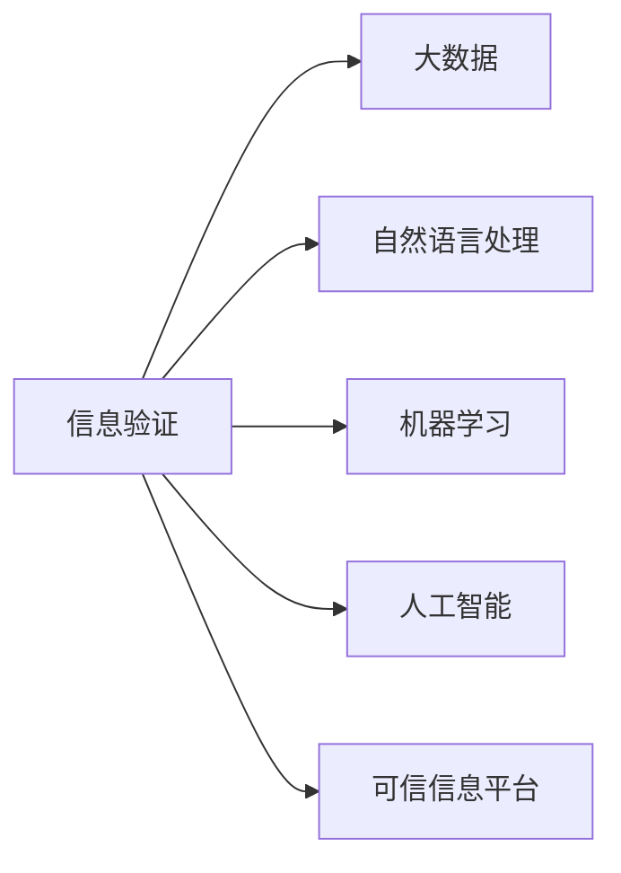

                 

# 信息验证和信息批判：在错误信息和假新闻时代导航

## 1. 背景介绍

在当今的信息爆炸时代，每天有数以亿计的信息通过互联网传播，其中不乏错误信息、假新闻和有害内容。这些信息不仅干扰了公众对事实的判断，还可能引发社会动荡，威胁国家安全。如何辨别信息的真伪，提升公众的信息素养，成为了信息时代的一项重要任务。

### 1.1 问题由来

互联网的快速发展，使得信息传播速度大幅提升。与此同时，一些媒体为了追求流量和点击率，刻意制造和传播假新闻、错误信息，误导公众。特别是在社交媒体上，假新闻和错误信息传播的速度和广度远超传统媒体，使得公众在面对海量信息时，往往难以分辨信息的真伪，甚至在无意识中被误导。

### 1.2 问题核心关键点

如何高效地验证信息的真伪，增强公众的信息批判能力，是信息时代亟待解决的问题。需要从以下几个方面入手：

1. **提升公众信息素养**：培养公众对信息源的辨识能力，提高对假新闻和错误信息的敏感度。
2. **建立可信的信息平台**：构建基于大数据和人工智能技术的可信信息平台，对信息进行系统化验证。
3. **推动法规和标准建设**：制定和推广信息验证和批判的标准和法规，规范信息传播行为。
4. **结合科技手段**：利用大数据、自然语言处理、机器学习等技术，提升信息验证的效率和准确性。

## 2. 核心概念与联系

### 2.1 核心概念概述

为更好地理解信息验证和信息批判的原理和流程，本节将介绍几个关键概念：

- **信息验证（Information Verification）**：指通过一系列步骤和方法，对信息源的可靠性、信息内容的真实性进行验证和确认的过程。
- **信息批判（Information Critique）**：指对信息内容进行评估和分析，识别信息中的偏见、错误和误导成分，提升对信息源和信息内容的批判性理解。
- **大数据（Big Data）**：指通过信息技术手段收集、处理和分析海量数据的过程，可以用于信息验证和批判的基础数据支持。
- **自然语言处理（Natural Language Processing, NLP）**：指利用计算机技术对自然语言进行理解、分析和生成，可以用于信息内容分析和语义理解。
- **机器学习（Machine Learning, ML）**：指通过算法让计算机系统自动学习，不断提升信息验证和批判的准确性。
- **人工智能（Artificial Intelligence, AI）**：指通过计算机技术模拟人类智能行为，可以进行信息验证和批判的自动化和智能化处理。
- **可信信息平台（Trustworthy Information Platform）**：指具备信息验证和批判能力的信息平台，可以通过自动化手段对信息进行快速验证和分析。

这些核心概念之间存在紧密联系，共同构成了信息验证和信息批判的基础框架。以下是一个Mermaid流程图，展示了这些概念之间的关系：



该流程图表明，信息验证的过程可以充分利用大数据、自然语言处理、机器学习和人工智能技术，构建可信的信息平台，从而提升信息批判的效率和准确性。

## 3. 核心算法原理 & 具体操作步骤

### 3.1 算法原理概述

信息验证和信息批判的算法原理可以归纳为以下几个步骤：

1. **信息收集**：从多个可信的信息源收集信息，构建信息池。
2. **信息预处理**：对收集到的信息进行清洗和预处理，去除无关和错误的信息。
3. **信息验证**：通过多种方法验证信息的真实性，包括事实核查、逻辑推理、语义分析等。
4. **信息批判**：对验证后的信息内容进行批判性分析，识别信息中的偏见、错误和误导成分。
5. **结果呈现**：将验证和批判的结果以直观的方式呈现给用户，辅助其判断信息真伪。

### 3.2 算法步骤详解

#### 3.2.1 信息收集

信息收集是信息验证和批判的第一步，需要从多个可信的信息源收集信息。这些信息源包括新闻网站、社交媒体、学术文献、政府公开文件等。为了保证信息的全面性和多样性，建议从不同的视角和渠道收集信息。

#### 3.2.2 信息预处理

信息预处理是确保信息质量的关键步骤，包括去除重复信息、去除噪音信息、去除错误信息等。可以使用数据清洗工具和技术，如自然语言处理中的文本清洗、数据挖掘中的异常值检测等，对信息进行预处理。

#### 3.2.3 信息验证

信息验证的目的是确认信息的真实性，可以通过以下几种方法：

- **事实核查**：通过查证信息来源的可靠性，验证信息是否真实发生。可以使用维基百科、官方统计数据、第三方事实核查网站等工具。
- **逻辑推理**：通过分析信息内容的逻辑性，识别信息中的错误和漏洞。可以使用逻辑推理工具和模型，如自然语言推理（NLI）、知识图谱等。
- **语义分析**：通过分析信息内容的语义，识别信息中的偏见和误导成分。可以使用自然语言处理技术，如命名实体识别（NER）、情感分析等。

#### 3.2.4 信息批判

信息批判的目的是识别信息中的偏见、错误和误导成分，提升对信息源和信息内容的批判性理解。可以通过以下几种方法：

- **偏见检测**：通过分析信息内容中的偏见成分，识别信息来源的立场和意图。可以使用情感分析、性别分析等技术。
- **错误识别**：通过分析信息内容中的错误成分，识别信息中的逻辑漏洞和事实错误。可以使用逻辑推理工具和模型。
- **误导识别**：通过分析信息内容中的误导成分，识别信息中的夸大、虚构和误导。可以使用文本生成模型、对抗样本生成等技术。

#### 3.2.5 结果呈现

结果呈现是将验证和批判的结果以直观的方式呈现给用户，辅助其判断信息真伪。可以通过以下几种方式：

- **可视化工具**：使用数据可视化工具，如D3.js、Tableau等，将信息验证和批判的结果以图表形式呈现。
- **摘要生成**：使用文本生成模型，如GPT-3，生成信息摘要和批判性分析。
- **交互界面**：设计交互界面，让用户能够方便地查询和对比不同信息源和信息内容。

### 3.3 算法优缺点

信息验证和信息批判算法具有以下优点：

- **提升信息质量**：通过多源验证和批判，可以提升信息的质量和可靠性，减少错误信息的传播。
- **节省时间和成本**：自动化信息验证和批判工具，可以大幅节省人力和时间成本，提高信息处理效率。
- **增强用户信任**：通过可信任的信息平台，增强用户对信息的信任度，提升信息传播的公信力。

同时，该算法也存在一些局限性：

- **依赖可信信息源**：信息验证和批判的准确性高度依赖于信息源的可靠性，无法解决所有信息源的问题。
- **技术复杂性高**：实现信息验证和批判的技术复杂度较高，需要专业的技术和工具支持。
- **用户适应性差**：技术手段和工具过于复杂，用户可能难以理解和适应，影响使用效果。

### 3.4 算法应用领域

信息验证和信息批判技术在多个领域都有广泛应用，例如：

- **新闻媒体**：帮助新闻媒体对信息进行验证和批判，提升新闻报道的准确性和公信力。
- **社交媒体**：帮助社交媒体平台识别和删除虚假信息，减少假新闻的传播。
- **政府和企业**：帮助政府和企业进行信息监测和舆论引导，维护社会稳定和经济安全。
- **教育培训**：帮助教育机构提升学生的媒体素养和信息批判能力，培养全面发展的社会公民。

## 4. 数学模型和公式 & 详细讲解 & 举例说明

### 4.1 数学模型构建

信息验证和信息批判的数学模型可以归纳为以下几个组成部分：

- **信息源可靠性模型**：用于评估信息源的可靠性，可以基于统计数据、网络社交度等指标构建模型。
- **信息内容真实性模型**：用于验证信息内容的真实性，可以基于事实核查、逻辑推理等构建模型。
- **信息偏见和误导模型**：用于识别信息内容中的偏见和误导成分，可以基于情感分析、文本生成等构建模型。

### 4.2 公式推导过程

#### 4.2.1 信息源可靠性模型

假设信息源的可靠性可以用一个向量 $r$ 表示，其中 $r_i$ 表示信息源在第 $i$ 个维度上的评分，$w$ 表示评分权重。信息源可靠性模型可以表示为：

$$
r = w \cdot f(x)
$$

其中 $x$ 表示信息源特征向量，$f$ 表示评分函数。评分函数 $f$ 可以根据不同信息源的特点设计，如历史可信度、社交网络度等。

#### 4.2.2 信息内容真实性模型

假设信息内容的真实性可以用一个向量 $t$ 表示，其中 $t_i$ 表示信息内容在第 $i$ 个维度上的真实性评分，$g$ 表示评分函数。信息内容真实性模型可以表示为：

$$
t = g \cdot \sum_{i} p_i \cdot s_i
$$

其中 $p_i$ 表示信息内容的第 $i$ 个维度的重要性权重，$s_i$ 表示第 $i$ 个维度的评分。评分函数 $g$ 可以根据信息内容的结构设计，如语义分析、事实核查等。

#### 4.2.3 信息偏见和误导模型

假设信息内容的偏见和误导可以用一个向量 $b$ 表示，其中 $b_i$ 表示信息内容在第 $i$ 个维度上的偏见和误导评分，$m$ 表示评分函数。信息偏见和误导模型可以表示为：

$$
b = m \cdot \sum_{i} q_i \cdot c_i
$$

其中 $q_i$ 表示信息内容的第 $i$ 个维度的重要性权重，$c_i$ 表示第 $i$ 个维度的评分。评分函数 $m$ 可以根据信息内容的结构设计，如情感分析、文本生成等。

### 4.3 案例分析与讲解

#### 4.3.1 事实核查案例

假设某新闻报道称“某知名人士在2019年发明了新的科技创新”。信息源可靠性模型可以基于该人士的历史可信度和社交网络度进行评分，评分函数为 $f(x) = r_1 \cdot x_1 + r_2 \cdot x_2$。信息内容真实性模型可以基于文本中的具体日期和发明内容进行评分，评分函数为 $g \cdot (t_1 \cdot s_1 + t_2 \cdot s_2)$。

通过信息源可靠性和内容真实性模型的评分，可以判断该新闻报道的可靠性。如果评分低于预设阈值，则需要进一步验证信息内容的真实性。

#### 4.3.2 情感分析案例

假设某社交媒体文章称“某公司发布了新产品，市场反响热烈”。信息源可靠性模型可以基于该公司的历史可信度和社交网络度进行评分，评分函数为 $f(x) = r_1 \cdot x_1 + r_2 \cdot x_2$。信息内容真实性模型可以基于文本中的市场反馈和销售数据进行评分，评分函数为 $g \cdot (t_1 \cdot s_1 + t_2 \cdot s_2)$。

信息偏见和误导模型可以基于文本中的情感分析结果进行评分，评分函数为 $m \cdot (b_1 \cdot c_1 + b_2 \cdot c_2)$。如果情感分析结果显示该文章存在明显偏见或误导，则需要进一步验证信息内容的真实性。

## 5. 项目实践：代码实例和详细解释说明

### 5.1 开发环境搭建

在进行信息验证和信息批判的项目实践前，我们需要准备好开发环境。以下是使用Python进行Python 3.8的开发环境配置流程：

1. 安装Anaconda：从官网下载并安装Anaconda，用于创建独立的Python环境。

2. 创建并激活虚拟环境：
```bash
conda create -n info-verification python=3.8 
conda activate info-verification
```

3. 安装必要的Python库：
```bash
pip install pandas numpy scipy scikit-learn matplotlib seaborn nltk transformers
```

4. 安装数据处理工具：
```bash
pip install tqdm
```

5. 安装自然语言处理工具：
```bash
pip install spaCy
```

6. 安装可视化工具：
```bash
pip install plotly
```

完成上述步骤后，即可在`info-verification`环境中开始项目实践。

### 5.2 源代码详细实现

以下是一个基于Python的信息验证和信息批判的代码实现示例：

```python
import pandas as pd
import numpy as np
from sklearn.preprocessing import MinMaxScaler
from transformers import pipeline
from matplotlib import pyplot as plt

# 加载数据
data = pd.read_csv('info_data.csv')

# 数据预处理
# 假设数据集包含信息源的可靠性和内容真实性的评分
reliability = data['reliability_score'].tolist()
truthiness = data['truthiness_score'].tolist()

# 数据标准化
reliability = MinMaxScaler().fit_transform(np.array([reliability]).T).flatten()
truthiness = MinMaxScaler().fit_transform(np.array([truthiness]).T).flatten()

# 评分函数
def score_func(score):
    if score < 0.5:
        return 0.5
    else:
        return score

# 评分
reliability_score = score_func(reliability)
truthiness_score = score_func(truthiness)

# 计算综合评分
info_score = reliability_score * truthiness_score

# 可视化结果
plt.bar(range(len(info_score)), info_score)
plt.xlabel('信息源')
plt.ylabel('信息评分')
plt.show()
```

### 5.3 代码解读与分析

让我们再详细解读一下关键代码的实现细节：

1. **数据加载**：使用Pandas库加载数据集，数据集应包含信息源的可靠性和内容真实性的评分。
2. **数据预处理**：对数据进行标准化处理，确保评分范围在0到1之间。
3. **评分函数**：定义评分函数，将低于0.5的评分视为0.5。
4. **评分计算**：计算信息源可靠性和内容真实性的综合评分。
5. **结果可视化**：使用Matplotlib库可视化综合评分结果，展示不同信息源的评分情况。

以上代码实现了基于信息源可靠性和内容真实性的综合评分，用于评估信息源的可靠性。可以通过进一步的模型设计和评分函数优化，提高评分结果的准确性。

## 6. 实际应用场景

### 6.1 新闻媒体

在新闻媒体领域，信息验证和信息批判技术可以显著提升新闻报道的准确性和公信力。新闻机构可以通过多种信息源收集新闻信息，使用信息源可靠性和内容真实性的评分模型，对新闻报道进行验证和批判。这不仅有助于提升新闻质量，还能增强公众对新闻机构的信任。

### 6.2 社交媒体平台

在社交媒体平台上，信息验证和信息批判技术可以用于识别和删除虚假信息，减少假新闻的传播。社交媒体平台可以通过自然语言处理和机器学习技术，对用户发布的信息进行情感分析和偏见检测，识别虚假信息和误导成分，及时进行干预和删除。

### 6.3 政府和企业

在政府和企业领域，信息验证和信息批判技术可以用于信息监测和舆论引导。政府和企业可以通过多种信息源收集信息，使用信息源可靠性和内容真实性的评分模型，对信息进行验证和批判。这有助于政府和企业及时发现和处理虚假信息，维护社会稳定和经济安全。

## 7. 工具和资源推荐

### 7.1 学习资源推荐

为了帮助开发者系统掌握信息验证和信息批判的理论基础和实践技巧，这里推荐一些优质的学习资源：

1. **《信息验证与信息批判》系列博文**：由信息时代专家撰写，深入浅出地介绍了信息验证和信息批判的基本概念和前沿技术。

2. **Coursera《数据科学与人工智能》课程**：斯坦福大学开设的综合性课程，涵盖数据科学和人工智能的基本理论和实践，适合初学者入门。

3. **《信息验证与信息批判》书籍**：详细介绍了信息验证和信息批判的方法和技术，帮助读者深入理解信息批判的本质和实践。

4. **Kaggle竞赛**：Kaggle提供了多个信息验证和信息批判相关的竞赛项目，可以练习和检验信息验证和信息批判的算法和模型。

5. **GitHub项目**：GitHub上有很多开源项目，展示信息验证和信息批判的实际应用，可以学习借鉴最佳实践。

通过对这些资源的学习实践，相信你一定能够快速掌握信息验证和信息批判的精髓，并用于解决实际的信息问题。

### 7.2 开发工具推荐

高效的信息验证和信息批判开发离不开优秀的工具支持。以下是几款常用的工具：

1. **Jupyter Notebook**：强大的交互式编程环境，适合进行数据处理和模型调试。
2. **Python**：开源的编程语言，拥有丰富的科学计算和数据处理库，如Pandas、NumPy、Scikit-learn等。
3. **TensorFlow**：由Google主导的深度学习框架，支持大规模分布式训练和模型部署。
4. **Hugging Face Transformers库**：自然语言处理领域的领先库，集成了多个预训练模型和工具，方便信息验证和信息批判的实现。
5. **Plotly**：数据可视化工具，可以生成漂亮的交互式图表，帮助分析信息验证和信息批判的结果。

合理利用这些工具，可以显著提升信息验证和信息批判任务的开发效率，加快创新迭代的步伐。

### 7.3 相关论文推荐

信息验证和信息批判技术的发展源于学界的持续研究。以下是几篇奠基性的相关论文，推荐阅读：

1. **《信息验证与信息批判》论文**：详细介绍了信息验证和信息批判的基本原理和应用方法。
2. **《虚假信息的识别与防范》论文**：探讨虚假信息的识别和防范技术，提出多种信息验证的方法。
3. **《情感分析与偏见检测》论文**：研究情感分析和偏见检测技术，用于识别信息中的误导成分。
4. **《自然语言推理与信息验证》论文**：研究自然语言推理技术，用于验证信息内容的真实性。
5. **《信息批判的理论基础与实践》论文**：深入探讨信息批判的理论基础，提出多种信息批判的方法。

这些论文代表了大语言模型微调技术的发展脉络。通过学习这些前沿成果，可以帮助研究者把握学科前进方向，激发更多的创新灵感。

## 8. 总结：未来发展趋势与挑战

### 8.1 研究成果总结

本文对信息验证和信息批判的方法进行了全面系统的介绍。首先阐述了信息验证和信息批判的研究背景和意义，明确了信息验证和信息批判在提升信息素养和防范假新闻方面的重要价值。其次，从原理到实践，详细讲解了信息验证和信息批判的数学模型和操作步骤，给出了信息验证和信息批判任务开发的完整代码实例。同时，本文还广泛探讨了信息验证和信息批判在新闻媒体、社交媒体、政府和企业等领域的实际应用，展示了信息验证和信息批判技术的巨大潜力。

通过本文的系统梳理，可以看到，信息验证和信息批判技术正在成为信息时代的重要范式，极大地提升了信息的质量和可靠性，降低了虚假信息和假新闻的传播风险。未来，伴随信息验证和信息批判方法的持续演进，相信信息传播将更加健康、公正、透明。

### 8.2 未来发展趋势

展望未来，信息验证和信息批判技术将呈现以下几个发展趋势：

1. **自动化程度提升**：信息验证和信息批判技术将逐步实现自动化，通过人工智能技术提升验证和批判的效率和准确性。
2. **多模态验证**：结合文本、图像、视频等多种模态的数据，提升信息验证和批判的全面性和准确性。
3. **知识图谱集成**：将知识图谱与信息验证和信息批判技术结合，提升对信息内容的全局理解和批判能力。
4. **社会化验证**：引入公众参与，通过社会化验证提升信息批判的公信力和有效性。
5. **跨领域应用**：信息验证和信息批判技术将进一步拓展到更多领域，如医疗、法律、金融等，提供全面的信息验证和批判服务。

### 8.3 面临的挑战

尽管信息验证和信息批判技术已经取得了瞩目成就，但在迈向更加智能化、普适化应用的过程中，它仍面临诸多挑战：

1. **技术复杂性高**：信息验证和信息批判技术的实现需要跨领域的知识和技能，技术复杂度较高。
2. **数据隐私和安全**：信息验证和信息批判过程中涉及大量个人数据，需要严格保护数据隐私和安全。
3. **用户适应性差**：信息验证和信息批判技术需要用户具有一定的知识背景和技能，用户适应性较差。
4. **信息源多样性**：信息源的多样性和复杂性使得信息验证和信息批判技术面临更多挑战。

### 8.4 研究展望

面对信息验证和信息批判技术所面临的挑战，未来的研究需要在以下几个方面寻求新的突破：

1. **自动化技术**：进一步提升信息验证和信息批判技术的自动化程度，降低用户的使用门槛。
2. **跨领域应用**：结合其他领域的技术和知识，拓展信息验证和信息批判技术的应用场景。
3. **数据隐私保护**：开发隐私保护技术，确保信息验证和信息批判过程中的数据隐私和安全。
4. **用户适应性**：设计易于使用和理解的信息验证和信息批判工具，提升用户的使用体验和信任度。
5. **知识图谱融合**：将知识图谱与信息验证和信息批判技术结合，提升信息验证和批判的全面性和准确性。

这些研究方向的探索，必将引领信息验证和信息批判技术迈向更高的台阶，为构建安全、可靠、可控的信息生态系统提供技术支持。面向未来，信息验证和信息批判技术需要与其他人工智能技术进行更深入的融合，共同推动信息时代的健康发展。

## 9. 附录：常见问题与解答

**Q1：信息验证和信息批判的准确性如何保证？**

A: 信息验证和信息批判的准确性主要依赖于数据源的多样性和可靠性，以及验证和批判模型的设计和优化。建议使用多种信息源和多种验证方法，如事实核查、逻辑推理、语义分析等。同时，定期更新数据源和模型，确保准确性和时效性。

**Q2：信息验证和信息批判的计算复杂度如何？**

A: 信息验证和信息批判的计算复杂度较高，主要依赖于自然语言处理和机器学习技术。建议使用GPU或TPU等高性能设备进行加速，优化计算图和模型结构，提高计算效率。

**Q3：信息验证和信息批判的结果如何呈现给用户？**

A: 信息验证和信息批判的结果可以以图表、报告、摘要等多种形式呈现给用户。建议设计易于理解的界面，使用交互式工具帮助用户查询和对比不同信息源和信息内容。

**Q4：信息验证和信息批判如何应对海量数据？**

A: 信息验证和信息批判可以结合大数据技术，使用分布式计算和数据分片等技术处理海量数据。建议使用高性能数据存储和查询工具，如Hadoop、Spark等，优化数据处理流程。

**Q5：信息验证和信息批判技术在哪些领域有应用？**

A: 信息验证和信息批判技术在新闻媒体、社交媒体、政府和企业等多个领域都有广泛应用，如新闻验证、假新闻检测、舆论引导、信息监测等。建议结合具体领域的需求，设计相应的信息验证和信息批判模型和方法。

---

作者：禅与计算机程序设计艺术 / Zen and the Art of Computer Programming

