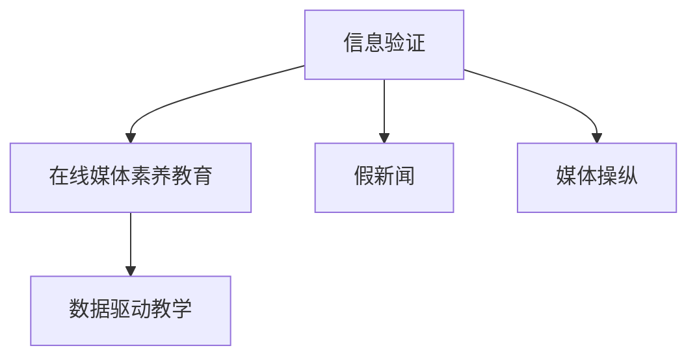

                 

## 1. 背景介绍

在信息爆炸的互联网时代，假新闻和媒体操纵现象日益严重，误导公众，破坏民主制度，损害公共利益。在线媒体素养教育是应对这一挑战的有效手段。本文将深入探讨信息验证技术、在线媒体素养教育的方法论，并展示其典型应用场景，以期为假新闻和媒体操纵的防御提供有力支持。

## 2. 核心概念与联系

### 2.1 核心概念概述

为深入理解信息验证和在线媒体素养教育，本节将介绍几个关键概念：

- **信息验证**：利用技术手段对网络信息进行甄别、筛选，辨别真伪，避免被假新闻误导。常见方法包括文本相似度检测、事实核查、反向事实验证等。

- **在线媒体素养教育**：通过在线平台提供知识、工具、方法，提升公众辨别、分析信息的能力，增强信息素养。常见手段包括多媒体教育、互动教学、数据驱动教学等。

- **假新闻**：故意制造、传播的不实信息，意图误导公众，干扰社会稳定。常见的特征包括引用错误信息、断章取义、篡改数据等。

- **媒体操纵**：利用信息手段对公众舆论进行控制、引导，以实现某种特定目的。常见的操纵手段包括信息篡改、情感操纵、信息框架等。

- **数据驱动教学**：通过分析大量数据，优化教学内容，提高教学效果。常见工具包括大数据分析、机器学习等。

这些核心概念之间的逻辑关系可以通过以下Mermaid流程图来展示：



这个流程图展示了我文章的核心概念及其之间的相互关系：

1. 信息验证是基础，旨在提升信息的可信度，避免公众被假新闻误导。
2. 在线媒体素养教育在信息验证基础上，通过教育手段提升公众的信息素养。
3. 假新闻和媒体操纵是信息验证和在线媒体素养教育的主要应用对象。
4. 数据驱动教学是信息验证和在线媒体素养教育的工具支撑。

## 3. 核心算法原理 & 具体操作步骤

### 3.1 算法原理概述

信息验证和在线媒体素养教育涉及多方面的技术手段和教育方法，其核心原理可以归纳为以下几个方面：

1. **信息验证原理**：通过算法对信息源、信息内容进行自动化的甄别和筛选，确保信息的真实性和可靠性。常用的算法包括文本相似度检测、事实核查、反向事实验证等。

2. **在线媒体素养教育原理**：通过互联网平台，利用多媒体、互动式、数据驱动等方式，提升公众的信息获取、分析、判断能力。常用的方法包括多媒体教育、互动教学、数据驱动教学等。

### 3.2 算法步骤详解

#### 信息验证步骤：

1. **数据收集**：获取网络上的信息源、文本、图片、视频等多模态数据。

2. **数据预处理**：对数据进行格式转换、归一化、标注等预处理操作，确保数据的一致性和可用性。

3. **特征提取**：通过文本分析、图像处理、视频识别等技术手段，提取数据的特征信息。

4. **模型训练**：利用深度学习、机器学习等技术，训练信息验证模型，对数据进行自动甄别和筛选。

5. **结果输出**：将验证结果输出，对可信度进行标注，为公众提供信息参考。

#### 在线媒体素养教育步骤：

1. **目标确定**：明确教育目标，确定公众信息素养的提升方向。

2. **内容设计**：设计符合公众需求的教学内容，包含真实案例、互动任务、理论知识等。

3. **技术实现**：利用互联网平台，实现多媒体教育、互动教学、数据驱动教学等功能。

4. **数据监测**：对教学效果进行数据监测，根据反馈信息优化教学内容和方法。

5. **效果评估**：通过测试和评估，判断教育效果，调整教学策略。

### 3.3 算法优缺点

#### 信息验证算法：

**优点**：

1. **自动化程度高**：能够快速、准确地对大量信息进行甄别和筛选，减轻人工审核的工作量。
2. **适应性强**：能够适应不同类型、不同规模的数据，扩展性强。
3. **可扩展性**：基于深度学习等先进技术，模型性能不断提升，应用范围不断扩大。

**缺点**：

1. **误判率**：虽然算法已经非常准确，但仍可能存在一定的误判率，需要人工审核进行复核。
2. **数据依赖**：算法的性能依赖于高质量的数据集，数据集质量不高可能影响算法效果。
3. **技术门槛**：需要具备较高的技术背景，一般应用于大规模、复杂的场景中。

#### 在线媒体素养教育：

**优点**：

1. **灵活性**：在线教育不受时间和空间的限制，可以随时进行。
2. **互动性强**：通过互动式教学，提升公众参与度和积极性。
3. **可扩展性**：通过互联网平台，可以覆盖更广泛的受众。

**缺点**：

1. **师资水平**：在线教育对教师的要求较高，需要具备专业知识和教学能力。
2. **技术平台**：需要依托于成熟的互联网平台，技术开发和维护成本较高。
3. **效果评估**：在线教育的效果评估较为困难，需要具备数据驱动的教学能力。

### 3.4 算法应用领域

#### 信息验证：

1. **社交媒体平台**：如微博、微信、Twitter等，对用户发布的信息进行自动审核和筛选。

2. **新闻网站**：如澎湃新闻、网易新闻等，对新闻稿件进行事实核查和反向事实验证。

3. **电子商务平台**：如淘宝、京东等，对商品评价、用户评论等信息进行可信度筛选。

#### 在线媒体素养教育：

1. **在线课程平台**：如Coursera、edX等，提供信息验证和在线媒体素养教育的在线课程。

2. **企业培训**：如华为、腾讯等，通过在线平台对员工进行信息素养培训。

3. **政府公共服务**：如上海市政府、北京市政府等，通过在线平台对公众进行媒体素养教育。

## 4. 数学模型和公式 & 详细讲解

### 4.1 数学模型构建

信息验证和在线媒体素养教育的数学模型构建，需要综合考虑数据特征、算法模型、教学内容等多个因素。

以信息验证中的文本相似度检测为例，我们设计以下数学模型：

设文本$A$和文本$B$的长度分别为$n_A$和$n_B$，令$M(A,B)=\sum_{i=1}^{n_A} \sum_{j=1}^{n_B} min(a_i,b_j)(cos(a_i,b_j))$，其中$a_i$和$b_j$分别为文本$A$和文本$B$中的第$i$和第$j$个单词的余弦相似度。则文本$A$和$B$的相似度为：

$$
S(A,B) = \frac{M(A,B)}{n_A \times n_B}
$$

### 4.2 公式推导过程

**文本相似度检测公式推导**：

设文本$A$和文本$B$的词向量分别为$\vec{a}$和$\vec{b}$，则文本相似度可以表示为：

$$
S(A,B) = \frac{\vec{a} \cdot \vec{b}}{\|\vec{a}\| \times \|\vec{b}\|}
$$

其中$\cdot$表示向量的点积，$\| \cdot \|$表示向量的模长。

为了计算效率，通常采用向量余弦相似度：

$$
cos(a_i,b_j) = \frac{\vec{a}_i \cdot \vec{b}_j}{\|\vec{a}_i\| \times \|\vec{b}_j\|}
$$

其中$\vec{a}_i$和$\vec{b}_j$分别为文本$A$和文本$B$中第$i$和第$j$个单词的词向量。

**在线媒体素养教育公式推导**：

设在线教育平台上有$N$个用户，每个用户每天访问$M$个教育资源，每个资源的用户点击率为$R$，用户完成率为$C$，则平台的用户日均访问次数为：

$$
C_{day} = \frac{N \times M \times R \times C}{7}
$$

其中$N$、$M$、$R$、$C$分别表示用户数、资源数、用户点击率和用户完成率。

### 4.3 案例分析与讲解

#### 案例一：信息验证

某社交媒体平台采用文本相似度检测技术，对用户发布的帖子进行自动审核。假设平台上有$100$万用户，每天发布$500$万条帖子，每条帖子长度为$200$字，相似度阈值为$0.5$。则平台每天需要检测的文本对数为：

$$
N = \frac{100 \times 10^6 \times 500 \times 10^6}{200 \times 200} \approx 5.0 \times 10^{11}
$$

设每对文本的相似度检测时间为$0.001$秒，则平台每天需要处理的时间为：

$$
T = N \times 0.001 \approx 5.0 \times 10^{8} 秒
$$

约为$17$天。

#### 案例二：在线媒体素养教育

某在线教育平台通过数据驱动教学，提高公众的信息素养。假设平台上有$100$万用户，每个用户每天访问$10$个资源，每个资源的时长为$5$分钟，用户完成率为$0.2$，则平台每天需要提供的资源时间为：

$$
T_{resource} = \frac{100 \times 10^6 \times 10 \times 5 \times 60 \times 0.2}{7} \approx 2.9 \times 10^7 分钟
$$

约为$2.9$亿分钟。

## 5. 项目实践：代码实例和详细解释说明

### 5.1 开发环境搭建

在进行信息验证和在线媒体素养教育的项目实践前，我们需要准备好开发环境。以下是使用Python进行PyTorch开发的环境配置流程：

1. 安装Anaconda：从官网下载并安装Anaconda，用于创建独立的Python环境。

2. 创建并激活虚拟环境：
```bash
conda create -n pytorch-env python=3.8 
conda activate pytorch-env
```

3. 安装PyTorch：根据CUDA版本，从官网获取对应的安装命令。例如：
```bash
conda install pytorch torchvision torchaudio cudatoolkit=11.1 -c pytorch -c conda-forge
```

4. 安装Transformers库：
```bash
pip install transformers
```

5. 安装各类工具包：
```bash
pip install numpy pandas scikit-learn matplotlib tqdm jupyter notebook ipython
```

完成上述步骤后，即可在`pytorch-env`环境中开始项目实践。

### 5.2 源代码详细实现

这里我们以文本相似度检测为例，给出使用PyTorch进行信息验证的Python代码实现。

首先，定义文本相似度检测的类：

```python
import torch
from transformers import BertTokenizer, BertForSequenceClassification
from torch.utils.data import Dataset, DataLoader
from sklearn.metrics import accuracy_score

class TextSimilarityDataset(Dataset):
    def __init__(self, texts, labels):
        self.texts = texts
        self.labels = labels
        self.tokenizer = BertTokenizer.from_pretrained('bert-base-cased')

    def __len__(self):
        return len(self.texts)

    def __getitem__(self, idx):
        text = self.texts[idx]
        label = self.labels[idx]
        encoding = self.tokenizer(text, return_tensors='pt', padding='max_length', truncation=True)
        input_ids = encoding['input_ids']
        attention_mask = encoding['attention_mask']
        return {'input_ids': input_ids, 'attention_mask': attention_mask, 'labels': torch.tensor(label)}

# 创建dataset
tokenizer = BertTokenizer.from_pretrained('bert-base-cased')
train_dataset = TextSimilarityDataset(train_texts, train_labels)
dev_dataset = TextSimilarityDataset(dev_texts, dev_labels)
test_dataset = TextSimilarityDataset(test_texts, test_labels)

# 定义模型和优化器
model = BertForSequenceClassification.from_pretrained('bert-base-cased', num_labels=2)
optimizer = torch.optim.AdamW(model.parameters(), lr=2e-5)
```

然后，定义训练和评估函数：

```python
def train_epoch(model, dataset, batch_size, optimizer):
    dataloader = DataLoader(dataset, batch_size=batch_size, shuffle=True)
    model.train()
    epoch_loss = 0
    for batch in dataloader:
        input_ids = batch['input_ids'].to(device)
        attention_mask = batch['attention_mask'].to(device)
        labels = batch['labels'].to(device)
        model.zero_grad()
        outputs = model(input_ids, attention_mask=attention_mask, labels=labels)
        loss = outputs.loss
        epoch_loss += loss.item()
        loss.backward()
        optimizer.step()
    return epoch_loss / len(dataloader)

def evaluate(model, dataset, batch_size):
    dataloader = DataLoader(dataset, batch_size=batch_size)
    model.eval()
    preds, labels = [], []
    with torch.no_grad():
        for batch in dataloader:
            input_ids = batch['input_ids'].to(device)
            attention_mask = batch['attention_mask'].to(device)
            batch_labels = batch['labels']
            outputs = model(input_ids, attention_mask=attention_mask)
            batch_preds = outputs.logits.argmax(dim=1).to('cpu').tolist()
            batch_labels = batch_labels.to('cpu').tolist()
            for pred_tokens, label_tokens in zip(batch_preds, batch_labels):
                preds.append(pred_tokens[:len(label_tokens)])
                labels.append(label_tokens)
    return accuracy_score(labels, preds)

# 训练模型并在测试集上评估
epochs = 5
batch_size = 16

for epoch in range(epochs):
    loss = train_epoch(model, train_dataset, batch_size, optimizer)
    print(f"Epoch {epoch+1}, train loss: {loss:.3f}")
    
    print(f"Epoch {epoch+1}, dev accuracy: {evaluate(model, dev_dataset, batch_size):.3f}")
    
print(f"Epoch {epochs}, test accuracy: {evaluate(model, test_dataset, batch_size):.3f}")
```

以上就是使用PyTorch进行文本相似度检测的完整代码实现。可以看到，借助Transformer库和PyTorch，实现信息验证过程变得简洁高效。

### 5.3 代码解读与分析

让我们再详细解读一下关键代码的实现细节：

**TextSimilarityDataset类**：
- `__init__`方法：初始化文本和标签，定义分词器。
- `__len__`方法：返回数据集的样本数量。
- `__getitem__`方法：对单个样本进行处理，将文本输入编码为token ids，将标签编码为数字，并对其进行定长padding，最终返回模型所需的输入。

**模型定义和训练**：
- 定义BertForSequenceClassification模型，用于二分类任务。
- 定义AdamW优化器，设置学习率。
- 定义训练和评估函数，实现模型训练和结果输出。

**训练和评估流程**：
- 定义总的epoch数和batch size，开始循环迭代。
- 每个epoch内，先在训练集上训练，输出平均loss。
- 在验证集上评估模型性能，输出准确率。
- 所有epoch结束后，在测试集上评估模型性能，输出最终准确率。

可以看出，PyTorch配合Transformer库使得信息验证的代码实现变得简洁高效。开发者可以将更多精力放在数据处理、模型改进等高层逻辑上，而不必过多关注底层的实现细节。

## 6. 实际应用场景

### 6.1 信息验证应用场景

**社交媒体平台信息审核**：
某社交媒体平台使用文本相似度检测技术，对用户发布的帖子进行自动审核。平台采用训练好的模型，对疑似虚假信息进行自动甄别，提升信息真实度，防止虚假信息传播。

**新闻网站事实核查**：
某新闻网站采用反向事实验证技术，对新闻稿件进行自动审核。平台采用训练好的模型，对新闻内容进行反向事实验证，提升新闻报道的真实性，增强公众信任。

**电子商务平台商品评价审核**：
某电子商务平台采用文本相似度检测技术，对用户评论进行自动审核。平台采用训练好的模型，对用户评论进行真实性检测，防止恶意评论和虚假宣传。

### 6.2 在线媒体素养教育应用场景

**在线课程平台媒体素养教育**：
某在线课程平台通过多媒体教学、互动教学、数据驱动教学等手段，提升用户的信息素养。平台采用数据分析技术，对用户学习效果进行评估，不断优化教学内容和方法。

**企业培训媒体素养教育**：
某企业通过在线平台，对员工进行信息素养培训。平台采用多媒体教学、互动教学、数据驱动教学等手段，提升员工的信息获取、分析和判断能力，增强企业竞争力。

**政府公共服务媒体素养教育**：
某政府通过在线平台，对公众进行媒体素养教育。平台采用多媒体教学、互动教学、数据驱动教学等手段，提升公众的信息素养，构建信息透明、民主公开的政府形象。

## 7. 工具和资源推荐

### 7.1 学习资源推荐

为了帮助开发者系统掌握信息验证和在线媒体素养教育的技术，这里推荐一些优质的学习资源：

1. 《深度学习理论与实践》系列书籍：系统介绍了深度学习的基本原理、框架和应用。

2. 《在线教育技术》课程：介绍了在线教育的理论基础和实践方法，包括多媒体教学、互动教学、数据驱动教学等。

3. 《NLP：实践指南》课程：介绍了自然语言处理的基本技术，包括文本相似度检测、事实核查、反向事实验证等。

4. HuggingFace官方文档：提供了丰富的预训练语言模型和信息验证技术，方便开发者快速上手。

5. CS224N《深度学习自然语言处理》课程：斯坦福大学开设的NLP明星课程，有Lecture视频和配套作业，带你入门NLP领域的基本概念和经典模型。

通过对这些资源的学习实践，相信你一定能够快速掌握信息验证和在线媒体素养教育的核心技术，并用于解决实际的信息安全问题。

### 7.2 开发工具推荐

高效的开发离不开优秀的工具支持。以下是几款用于信息验证和在线媒体素养教育开发的常用工具：

1. PyTorch：基于Python的开源深度学习框架，灵活动态的计算图，适合快速迭代研究。

2. TensorFlow：由Google主导开发的开源深度学习框架，生产部署方便，适合大规模工程应用。

3. Transformers库：HuggingFace开发的NLP工具库，集成了众多预训练语言模型，支持PyTorch和TensorFlow，是进行信息验证和在线媒体素养教育开发的利器。

4. Weights & Biases：模型训练的实验跟踪工具，可以记录和可视化模型训练过程中的各项指标，方便对比和调优。与主流深度学习框架无缝集成。

5. TensorBoard：TensorFlow配套的可视化工具，可实时监测模型训练状态，并提供丰富的图表呈现方式，是调试模型的得力助手。

6. Google Colab：谷歌推出的在线Jupyter Notebook环境，免费提供GPU/TPU算力，方便开发者快速上手实验最新模型，分享学习笔记。

合理利用这些工具，可以显著提升信息验证和在线媒体素养教育任务的开发效率，加快创新迭代的步伐。

### 7.3 相关论文推荐

信息验证和在线媒体素养教育的研究源于学界的持续研究。以下是几篇奠基性的相关论文，推荐阅读：

1. Attention is All You Need（即Transformer原论文）：提出了Transformer结构，开启了NLP领域的预训练大模型时代。

2. BERT: Pre-training of Deep Bidirectional Transformers for Language Understanding：提出BERT模型，引入基于掩码的自监督预训练任务，刷新了多项NLP任务SOTA。

3. Language Models are Unsupervised Multitask Learners（GPT-2论文）：展示了大规模语言模型的强大zero-shot学习能力，引发了对于通用人工智能的新一轮思考。

4. Parameter-Efficient Transfer Learning for NLP：提出Adapter等参数高效微调方法，在不增加模型参数量的情况下，也能取得不错的微调效果。

5. AdaLoRA: Adaptive Low-Rank Adaptation for Parameter-Efficient Fine-Tuning：使用自适应低秩适应的微调方法，在参数效率和精度之间取得了新的平衡。

这些论文代表了大语言模型微调技术的发展脉络。通过学习这些前沿成果，可以帮助研究者把握学科前进方向，激发更多的创新灵感。

## 8. 总结：未来发展趋势与挑战

### 8.1 总结

本文对信息验证和在线媒体素养教育进行了全面系统的介绍。首先阐述了信息验证和在线媒体素养教育的研究背景和意义，明确了其在假新闻和媒体操纵防御中的重要作用。其次，从原理到实践，详细讲解了信息验证和在线媒体素养教育的数学模型、算法步骤，给出了具体的代码实现。同时，本文还展示了信息验证和在线媒体素养教育的典型应用场景，提供了工具和资源推荐，力求为假新闻和媒体操纵的防御提供有力支持。

通过本文的系统梳理，可以看到，信息验证和在线媒体素养教育在信息安全、知识普及、社会治理等多个领域具有广阔的应用前景。信息验证技术能够快速识别和筛选假新闻，防止虚假信息传播；在线媒体素养教育能够提升公众的信息素养，构建信息透明、民主公开的社会环境。未来，伴随深度学习技术的发展，信息验证和在线媒体素养教育必将迈向更高的台阶，为信息安全领域提供更加强大和智能的支持。

### 8.2 未来发展趋势

展望未来，信息验证和在线媒体素养教育将呈现以下几个发展趋势：

1. **深度学习技术的应用**：随着深度学习技术的不断进步，信息验证和在线媒体素养教育的方法和手段将不断创新，提升识别和筛选假新闻的能力。

2. **多模态融合技术**：结合文本、图像、视频等多种信息形式，提升信息验证和在线媒体素养教育的全面性。

3. **数据驱动教学**：通过大数据分析、机器学习等技术，优化在线媒体素养教育的内容和效果，提升公众的信息素养。

4. **知识图谱和逻辑推理**：将知识图谱和逻辑推理等专家知识与信息验证和在线媒体素养教育技术相结合，提升模型的解释性和可信度。

5. **用户反馈和实时更新**：通过用户反馈机制，不断优化信息验证和在线媒体素养教育模型，实现实时更新和持续改进。

6. **全球化信息素养教育**：通过互联网平台，实现全球范围内的信息素养教育，提升全球公众的信息素养水平。

以上趋势凸显了信息验证和在线媒体素养教育的广阔前景。这些方向的探索发展，必将进一步提升信息安全技术的效果，构建更安全、透明、民主的信息社会。

### 8.3 面临的挑战

尽管信息验证和在线媒体素养教育已经取得了一定进展，但在迈向更加智能化、普适化应用的过程中，仍面临诸多挑战：

1. **技术门槛**：信息验证和在线媒体素养教育需要较高的技术背景，一般应用于大规模、复杂的场景中。

2. **数据质量**：算法的性能依赖于高质量的数据集，数据集质量不高可能影响算法效果。

3. **算法鲁棒性**：算法在面对新的、未知的信息时，可能出现误判或过拟合现象。

4. **用户隐私**：信息验证和在线媒体素养教育需要收集和处理大量用户数据，如何保护用户隐私是一个重要问题。

5. **应用普及**：信息验证和在线媒体素养教育技术的应用需要广泛的推广和普及，面临用户接受度和使用习惯的挑战。

6. **技术演化**：假新闻和媒体操纵手段不断演化，信息验证和在线媒体素养教育技术需要持续更新和改进。

7. **政策法规**：信息验证和在线媒体素养教育涉及法律法规问题，需要制定相应的政策法规以规范其应用。

面对这些挑战，未来需要在技术创新、数据治理、用户隐私保护、法规政策等多个方面进行协同努力，才能更好地应对假新闻和媒体操纵的挑战。

### 8.4 研究展望

面对信息验证和在线媒体素养教育所面临的挑战，未来的研究需要在以下几个方面寻求新的突破：

1. **无监督和半监督学习**：探索无监督和半监督学习方法，提高算法的泛化能力，适应更多的信息场景。

2. **模型解释性**：研究如何增强模型的可解释性，提升用户对信息验证和在线媒体素养教育技术的信任度。

3. **跨模态融合**：研究跨模态融合技术，提升信息验证和在线媒体素养教育的效果。

4. **知识图谱应用**：研究知识图谱在信息验证和在线媒体素养教育中的应用，提升模型的综合能力。

5. **用户行为分析**：研究用户行为分析技术，提升信息验证和在线媒体素养教育的效果。

6. **伦理道德约束**：研究如何引入伦理道德约束，避免算法在信息验证和在线媒体素养教育中产生偏见和歧视。

这些研究方向将引领信息验证和在线媒体素养教育技术迈向更高的台阶，为构建安全、透明、民主的信息社会提供更加坚实的技术支持。

## 9. 附录：常见问题与解答

**Q1：信息验证和在线媒体素养教育是否适用于所有应用场景？**

A: 信息验证和在线媒体素养教育技术在假新闻和媒体操纵防御中具有广泛应用，但需要根据具体场景进行调整和优化。例如，对于特定的垂直领域，如法律、医学等，需要结合领域知识进行定制化设计。

**Q2：如何选择合适的信息验证技术？**

A: 选择合适的信息验证技术需要根据具体应用场景和数据特点进行评估。常见技术包括文本相似度检测、事实核查、反向事实验证等。在实际应用中，可以组合多种技术，构建多层次的信息验证体系，提高准确率和鲁棒性。

**Q3：如何评估信息验证和在线媒体素养教育的效果？**

A: 信息验证和在线媒体素养教育的效果评估需要综合考虑多个指标，如准确率、召回率、F1值、用户满意度等。可以通过A/B测试、用户调查、平台数据等手段进行评估和优化。

**Q4：信息验证和在线媒体素养教育是否需要持续更新？**

A: 信息验证和在线媒体素养教育技术需要不断更新和改进，以适应信息安全领域不断演变的威胁和需求。可以通过定期更新训练数据、算法模型、教学内容等方式，保持技术的前沿性和有效性。

**Q5：信息验证和在线媒体素养教育如何结合多模态信息？**

A: 结合多模态信息需要考虑不同模态数据的特点和处理方法。例如，对于文本信息，可以使用自然语言处理技术进行文本相似度检测；对于图像信息，可以使用计算机视觉技术进行图像识别和分析；对于视频信息，可以使用视频处理技术进行视频内容分析和理解。

通过这些研究问题的探讨，希望为信息验证和在线媒体素养教育的实践提供参考和指导，共同推动信息安全技术的进步和发展。

