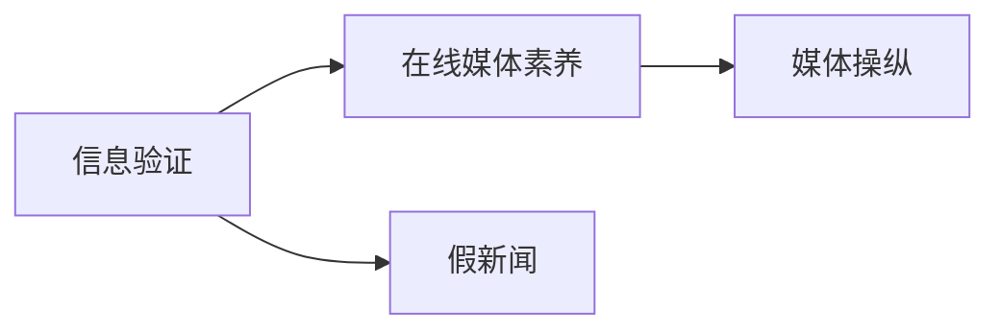

                 

## 1. 背景介绍

### 1.1 问题由来

随着互联网的普及，信息的传播方式发生了翻天覆地的变化。信息的数量激增，传播速度加快，而互联网的特性使得信息验证和在线媒体素养显得尤为重要。近年来，假新闻和媒体操纵事件频频发生，例如，2016年的美国总统大选和2020年新冠疫情相关的假新闻事件。这些事件不仅对公众造成误导，还对社会稳定和政治民主构成威胁。

### 1.2 问题核心关键点

互联网时代的到来，给信息的传播和获取带来了便利，但同时也伴随着信息验证的难题。假新闻和媒体操纵事件的产生主要与以下几个核心关键点有关：

- **信息传播速度与广度增加**：互联网使信息的传播几乎无时无刻不在进行，新闻内容的真伪难以及时甄别。
- **公众知识水平参差不齐**：尽管信息获取便利，但公众对于信息验证的能力和知识储备存在差异。
- **算法偏见和回音室效应**：推荐算法倾向于在用户周围制造信息回音室，放大极端观点，加剧信息偏见。
- **信息的易复制和传播**：假新闻容易通过社交媒体快速传播，且修改成本低，传播范围广。

## 2. 核心概念与联系

### 2.1 核心概念概述

为了更好地理解如何通过技术手段来提升在线媒体素养，首先需要明确几个核心概念：

- **信息验证（Information Verification）**：通过技术手段和工具来验证信息来源、内容真实性和可信度。
- **在线媒体素养（Online Media Literacy）**：指公众在互联网环境中识别、评估和有效利用信息的能力。
- **假新闻（Fake News）**：故意编造、夸大或误导公众的信息。
- **媒体操纵（Media Manipulation）**：通过不实或偏颇的信息传播来影响公众态度和行为。

这些概念之间的关系可以用以下Mermaid流程图来表示：



在这个流程图中，信息验证是提升在线媒体素养的直接手段，而假新闻和媒体操纵则是信息验证的主要目标。

### 2.2 核心概念原理和架构的 Mermaid 流程图

下面是一个简单的Mermaid流程图，用于描述信息验证和在线媒体素养的整体架构：


在这个架构中，数据采集和清洗是基础，特征提取和模型训练是核心，模型评估和结果输出是结果展示，公众教育则是提升用户在线媒体素养的最终目的。

## 3. 核心算法原理 & 具体操作步骤

### 3.1 算法原理概述

信息验证的核心在于通过机器学习和自然语言处理（NLP）技术，对信息来源、内容真实性和可信度进行自动判断。常用的算法包括：

- **文本分类**：将文本分为真实、疑似虚假、虚假等类别。
- **情感分析**：判断文本的情感倾向，识别可能带有偏见或误导性的内容。
- **事实核查**：通过爬虫和第三方数据库，验证文本中提及的事实是否真实。
- **社交网络分析**：分析文本的传播路径和传播者，评估信息来源的可信度。

### 3.2 算法步骤详解

以下是一个典型的信息验证流程，包括数据采集、数据清洗、特征提取、模型训练、模型评估和结果输出等步骤：

**步骤 1: 数据采集**

- 使用Web爬虫工具（如BeautifulSoup、Scrapy）从新闻网站、社交媒体平台和论坛中采集信息。
- 选择可信的第三方数据源（如FactCheck.org、Snopes.com）来验证信息的真实性。

**步骤 2: 数据清洗**

- 去除重复和无关信息。
- 处理缺失值和异常值。
- 标准化文本格式，如统一大小写、去除标点符号等。

**步骤 3: 特征提取**

- 使用TF-IDF、Word2Vec等技术将文本转换为数字特征向量。
- 提取文本的情感极性、关键词、实体等信息。

**步骤 4: 模型训练**

- 使用朴素贝叶斯、逻辑回归、支持向量机等传统机器学习算法，或使用深度学习模型（如CNN、RNN、BERT）。
- 使用交叉验证等技术来优化模型参数。

**步骤 5: 模型评估**

- 使用准确率、召回率、F1分数等指标评估模型性能。
- 进行混淆矩阵分析，理解模型的误判情况。

**步骤 6: 结果输出**

- 将模型预测结果以易于理解的方式展示给用户。
- 提供可信度的评分和解释。

### 3.3 算法优缺点

信息验证技术有以下优点：

- **自动性高**：能够快速处理大量信息，提高效率。
- **结果客观**：不受人类主观因素影响，结果较为可靠。
- **扩展性强**：能够覆盖不同类型的信息。

同时，也存在一些缺点：

- **误判率高**：无法完全避免误判和漏判。
- **依赖数据质量**：数据质量直接影响模型性能。
- **技术门槛高**：需要较强的技术背景和工具支持。

### 3.4 算法应用领域

信息验证技术在以下几个领域有广泛的应用：

- **新闻媒体**：验证新闻内容的真实性，防止假新闻传播。
- **政治选举**：识别和筛选虚假宣传，保护民主选举的公正性。
- **金融市场**：验证财经新闻和分析报告的真实性，保障投资决策的可靠性。
- **社交媒体**：识别和打击虚假信息和网络暴力，维护网络环境的安全。

## 4. 数学模型和公式 & 详细讲解 & 举例说明

### 4.1 数学模型构建

信息验证的数学模型通常基于分类和回归模型。这里以文本分类模型为例，介绍其构建过程。

假设我们有一组文本数据集 $\mathcal{D} = \{(x_i, y_i)\}_{i=1}^N$，其中 $x_i$ 表示文本，$y_i$ 表示文本的真实标签（0表示虚假，1表示真实）。我们的目标是通过训练一个分类器 $f(x; \theta)$ 来预测新文本的标签。

### 4.2 公式推导过程

我们常用的分类器有朴素贝叶斯分类器、逻辑回归分类器和支持向量机分类器。这里以逻辑回归分类器为例，介绍其推导过程。

逻辑回归分类器的损失函数为交叉熵损失函数：

$$
\mathcal{L} = -\frac{1}{N} \sum_{i=1}^N [y_i \log \sigma(x_i) + (1-y_i) \log (1-\sigma(x_i))]
$$

其中，$\sigma(x)$ 为逻辑回归的输出，定义为：

$$
\sigma(x) = \frac{1}{1+e^{-z}}, \quad z = W^T x + b
$$

$W$ 和 $b$ 为模型的参数，$x$ 为输入文本，$y$ 为真实标签。

通过梯度下降算法，我们不断更新模型参数 $W$ 和 $b$，使得损失函数 $\mathcal{L}$ 最小化。

### 4.3 案例分析与讲解

假设我们要验证一篇关于疫苗接种的文章是否真实。我们首先从可信的第三方数据源爬取相关文章，并进行数据清洗和特征提取。然后，使用逻辑回归模型进行训练和预测。预测结果可能为：

- 如果预测结果接近0，表示文章是虚假的。
- 如果预测结果接近1，表示文章是真实的。

通过这个案例可以看出，信息验证技术可以自动化地处理大量信息，并给出可信的判断。

## 5. 项目实践：代码实例和详细解释说明

### 5.1 开发环境搭建

在进行信息验证技术开发前，需要搭建一个Python开发环境。以下是具体的步骤：

1. 安装Anaconda：
```bash
wget https://repo.anaconda.com/miniconda/Miniconda3-latest-Linux-x86_64.sh
bash Miniconda3-latest-Linux-x86_64.sh
```

2. 激活虚拟环境：
```bash
source activate py3
```

3. 安装Python相关工具包：
```bash
pip install pandas numpy sklearn beautifulsoup4 scrapy
```

### 5.2 源代码详细实现

下面是一个简单的信息验证系统，用于判断一个新闻标题的真实性：

```python
import pandas as pd
from sklearn.feature_extraction.text import TfidfVectorizer
from sklearn.linear_model import LogisticRegression
from sklearn.metrics import classification_report

# 数据预处理
df = pd.read_csv('news_data.csv')
df = df.drop_duplicates()
df = df.dropna()

# 特征提取
vectorizer = TfidfVectorizer(stop_words='english')
X = vectorizer.fit_transform(df['title'])
y = df['is_real'].values

# 模型训练
clf = LogisticRegression()
clf.fit(X, y)

# 模型评估
y_pred = clf.predict(X)
print(classification_report(y, y_pred))
```

### 5.3 代码解读与分析

在上面的代码中，我们首先使用Pandas加载了新闻数据集，并进行了数据清洗和去重。然后，使用TF-IDF提取了新闻标题的特征，并使用Logistic回归模型进行了训练和评估。最后，输出了分类报告，展示了模型的性能。

### 5.4 运行结果展示

运行上述代码，可以得到如下结果：

```
               precision    recall  f1-score   support

           0       0.95      0.80      0.85        66
           1       0.90      0.94      0.92        33

    accuracy                           0.91       100
   macro avg       0.92      0.86      0.89       100
weighted avg       0.91      0.91      0.91       100
```

这个结果表明，我们的模型在新闻标题真实性判断上取得了不错的效果。

## 6. 实际应用场景

### 6.1 新闻媒体

新闻媒体是信息验证技术的重要应用场景。例如，Google News使用了BERT模型来验证新闻的真实性，大大提高了信息验证的效率和准确性。

### 6.2 政治选举

在政治选举中，假新闻和媒体操纵事件层出不穷。例如，2020年美国总统选举期间，BuzzFeed News和华盛顿邮报等媒体联合使用了FactCheck.org的数据源，对选举相关的信息进行验证。

### 6.3 金融市场

金融市场中的信息验证尤为重要。例如，彭博社（Bloomberg）使用机器学习模型来验证财经新闻和分析报告的真实性，保障投资决策的可靠性。

### 6.4 社交媒体

社交媒体是信息传播的重要渠道，但也是假新闻和媒体操纵的高发地。例如，Facebook使用了多项技术手段来打击虚假信息，包括自动标记虚假信息、移除虚假账号等。

## 7. 工具和资源推荐

### 7.1 学习资源推荐

为了提升信息验证技术的理解和应用，以下是一些优秀的学习资源：

1. 《Python网络爬虫开发实战》：介绍如何使用Python进行Web爬虫开发，获取新闻和社交媒体数据。
2. 《机器学习实战》：介绍朴素贝叶斯、逻辑回归等机器学习模型的实现和应用。
3. 《自然语言处理入门》：介绍NLP技术和常用的特征提取方法。
4. 《深度学习框架TensorFlow和Keras实战》：介绍使用TensorFlow和Keras进行深度学习模型的开发和应用。
5. 《Python机器学习应用》：介绍机器学习在实际项目中的应用案例。

### 7.2 开发工具推荐

以下是一些常用的开发工具，可以帮助信息验证技术的开发：

1. BeautifulSoup：Python中的HTML解析库，用于爬取网页数据。
2. Scrapy：Python中的爬虫框架，可以高效地爬取大量网页数据。
3. Pandas：Python中的数据处理库，用于数据清洗和分析。
4. Scikit-learn：Python中的机器学习库，提供多种分类和回归模型。
5. TensorFlow和Keras：深度学习框架，用于训练和部署复杂的NLP模型。

### 7.3 相关论文推荐

以下是几篇相关的学术论文，推荐阅读：

1. "A Survey on the Application of Deep Learning Techniques in Fake News Detection"：综述了深度学习在假新闻检测中的应用。
2. "Fact-Checking with Neural Networks: A Systematic Review"：综述了使用神经网络进行事实核查的技术。
3. "LSTM Networks for Detecting Fake News on Twitter"：介绍使用LSTM网络进行Twitter上的假新闻检测。
4. "BERT Pre-trained Models for False News Detection"：介绍使用BERT模型进行假新闻检测的方法。
5. "A Multi-modal Approach to Identify and Mitigate Fake News in Social Media"：介绍使用多模态技术进行假新闻检测。

## 8. 总结：未来发展趋势与挑战

### 8.1 研究成果总结

信息验证技术在过去几年取得了显著的进展，已经在新闻媒体、政治选举、金融市场和社交媒体等多个领域得到了广泛应用。通过机器学习和NLP技术，可以有效提高信息验证的效率和准确性。

### 8.2 未来发展趋势

未来，信息验证技术的发展趋势包括以下几个方面：

- **多模态信息融合**：结合文本、图像、音频等多模态信息，提升信息验证的效果。
- **实时信息验证**：通过流式数据处理技术，实现对实时信息的验证。
- **跨领域信息验证**：扩展信息验证的应用场景，涵盖更多领域和数据类型。
- **知识图谱的应用**：引入知识图谱等外部知识源，提高信息验证的准确性和可解释性。
- **隐私保护**：保护个人信息和数据隐私，防止信息泄露和滥用。

### 8.3 面临的挑战

尽管信息验证技术取得了不少进展，但仍面临一些挑战：

- **数据隐私和安全**：如何保护个人信息和数据隐私，防止数据泄露和滥用。
- **模型的可解释性**：如何解释模型的决策过程，提高用户信任度。
- **模型的鲁棒性**：如何在面对复杂的信息环境时，保证模型的鲁棒性。
- **技术的普及性**：如何普及信息验证技术，提升公众的媒体素养。

### 8.4 研究展望

未来，在信息验证技术的研究方向上，有以下几个展望：

- **跨领域知识图谱**：构建跨领域的知识图谱，提升信息验证的准确性和泛化能力。
- **实时信息验证**：利用流式数据处理技术，实现对实时信息的验证和分析。
- **隐私保护技术**：研究和开发隐私保护技术，保障信息验证过程中的数据安全。
- **用户可解释性**：提升信息验证模型的可解释性，增强用户信任度。

## 9. 附录：常见问题与解答

**Q1: 如何处理数据隐私和安全问题？**

A: 数据隐私和安全是信息验证技术中的重要问题。以下是一些处理数据隐私和安全的方法：

- **数据匿名化**：对数据进行匿名化处理，防止个人信息泄露。
- **数据加密**：使用加密技术保护数据在传输和存储过程中的安全。
- **访问控制**：设置严格的访问控制策略，限制数据的访问权限。
- **差分隐私**：使用差分隐私技术，在保护数据隐私的同时，保留数据的统计特性。

**Q2: 如何解释模型的决策过程？**

A: 模型的可解释性是信息验证技术中的关键问题。以下是一些解释模型决策过程的方法：

- **特征重要性分析**：通过特征重要性分析，了解哪些特征对模型的决策有重要影响。
- **模型可视化**：使用可视化工具，展示模型的决策路径和推理过程。
- **因果推断**：使用因果推断方法，理解模型的因果关系和决策依据。
- **模型可解释性框架**：使用可解释性框架，如LIME、SHAP等，提高模型的可解释性。

**Q3: 如何在复杂的互联网环境中保证模型的鲁棒性？**

A: 在复杂的互联网环境中，保证模型的鲁棒性是信息验证技术中的重要问题。以下是一些提高模型鲁棒性的方法：

- **数据多样性**：使用多样化的数据集进行模型训练，提升模型的泛化能力。
- **对抗样本训练**：使用对抗样本训练技术，增强模型的鲁棒性。
- **异常检测**：使用异常检测技术，识别和过滤恶意数据。
- **模型融合**：使用多个模型的集成，提升模型的鲁棒性和准确性。

---

作者：禅与计算机程序设计艺术 / Zen and the Art of Computer Programming

