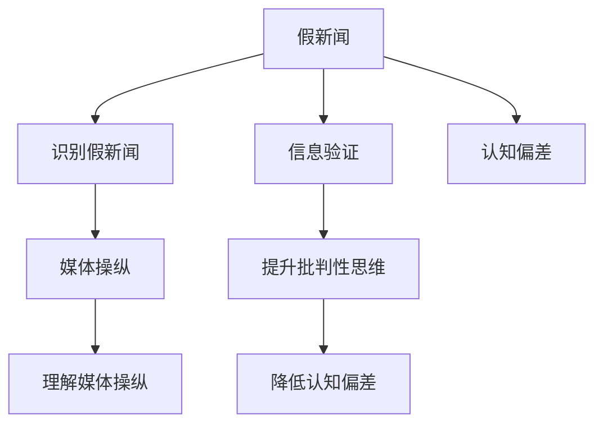

                 

## 1. 背景介绍

在数字化信息爆炸的时代，我们每天接收的信息量呈指数级增长。社交媒体、新闻网站、论坛和博客等平台提供了大量内容，但其中也夹杂着大量的假新闻、误导性信息甚至恶意操纵。我们如何快速辨别这些信息，避免被误导或伤害？信息验证和批判性思考（Information Verification and Critical Thinking）成为了在这个假新闻和媒体操纵时代中导航的关键技能。本文将深入探讨这一主题，提供一套全面的指南，帮助读者在信息洪流中保持清醒的头脑，做出明智的决策。

### 1.1 问题由来

随着互联网的发展，信息的传播和获取变得前所未有的简单，但也因此使得假新闻和误导性信息更加难以识别。假新闻通常通过制造耸人听闻的标题、扭曲事实、故意误导等方式吸引眼球，以达到各种目的。它们可能是出于政治、经济、社会等各种原因。媒体操纵则更为复杂，它们通过精心策划和操作，来塑造公众舆论，甚至影响社会和政治决策。因此，识别和验证信息的真伪，提高批判性思维能力，对于每一个公民来说都是至关重要的。

### 1.2 问题核心关键点

信息验证和批判性思考的核心在于以下几个关键点：
- **识别假新闻**：掌握识别假新闻的基本方法，如检查来源可靠性、观察事实一致性、分析信息逻辑等。
- **理解媒体操纵**：了解媒体操纵的常见手段，如选择性报道、情感操纵、信息框架等，从而能够警惕这些陷阱。
- **提升批判性思维**：培养独立思考的能力，质疑信息来源、评估证据可靠性、区分事实与观点等。

### 1.3 问题研究意义

在信息时代，分辨真假、避免被误导的能力，是现代公民基本素养的重要组成部分。具备信息验证和批判性思考能力，不仅能够帮助我们保护自己免受虚假信息的伤害，还能在公共讨论中贡献有价值、有深度的观点，参与到社会进步的讨论中去。在媒体操纵日益频繁的今天，这种能力更加重要，它关乎到我们的民主、公正和公平。

## 2. 核心概念与联系

### 2.1 核心概念概述

为了更好地理解和应用信息验证和批判性思考，本节将介绍几个核心概念及其相互联系：

- **假新闻**：指在新闻传播过程中，故意或无意传播的不实信息，包括但不限于错误信息、夸大事实、恶意编造等。
- **媒体操纵**：指媒体通过有目的的信息呈现方式，来影响公众观点和行为，以达到特定目的。
- **信息验证**：指通过一系列方法，评估信息的真实性、可靠性，以及来源的权威性。
- **批判性思考**：指主动分析、评估、反思信息的过程，包括质疑信息来源、检验证据、区分事实与观点等。
- **认知偏差**：指人们在处理信息和作出判断时，常常会受到一些固有的心理偏见影响，导致认知偏差。

这些核心概念之间的逻辑关系可以通过以下Mermaid流程图来展示：



这个流程图展示了几大核心概念及其之间的联系：

1. 假新闻是信息验证和批判性思考的焦点。
2. 媒体操纵则是假新闻产生和传播的途径之一。
3. 信息验证和批判性思考是应对假新闻和媒体操纵的有效方法。
4. 认知偏差是影响信息验证和批判性思考的重要因素。

## 3. 核心算法原理 & 具体操作步骤
### 3.1 算法原理概述

信息验证和批判性思考的算法原理基于以下几个关键步骤：

1. **数据收集**：收集待验证的信息，包括文本、图像、视频等多种类型的数据。
2. **信息分析**：对收集到的信息进行分析，检查其来源、事实准确性、逻辑一致性等。
3. **证据评估**：评估信息背后支持的证据，包括数据、文献、专家意见等。
4. **批判性思考**：根据分析结果，进行批判性思考，评估信息的可靠性、来源的可信度、信息对公众的影响等。
5. **决策输出**：基于以上分析，做出判断，决定是否相信信息。

### 3.2 算法步骤详解

基于上述原理，信息验证和批判性思考的算法步骤可以进一步细化为：

**Step 1: 数据预处理**
- 使用文本清洗、图像处理等技术，对收集到的数据进行预处理，提取关键信息。

**Step 2: 信息源识别**
- 识别信息的来源，如网站、社交媒体、新闻机构等。评估来源的权威性和可靠性。
- 检查信息是否基于真实的事实，还是基于主观偏见或虚构的叙事。

**Step 3: 信息一致性检查**
- 验证信息是否与已知事实一致，是否存在逻辑矛盾或明显错误。
- 检查信息中提及的数据和数据源是否可靠。

**Step 4: 证据评估**
- 评估信息背后支持的数据、研究、文献等证据的可靠性。
- 检查是否有其他专家或权威机构提出不同观点，并评估这些观点的证据强度。

**Step 5: 批判性思考**
- 质疑信息的来源和动机，是否有利益冲突。
- 检查信息是否基于情感操纵、偏见、选择性报道等手段，影响公众认知。
- 评估信息对个人、社会、政治等方面的影响。

**Step 6: 决策输出**
- 基于以上分析，做出判断，决定是否相信信息。
- 提供可能的替代信息或反例，帮助公众更全面地理解问题。

### 3.3 算法优缺点

信息验证和批判性思考的算法具有以下优点：
1. 全面性：能够从多个角度和多个方面评估信息。
2. 独立性：可以独立于任何单一来源，进行全面分析。
3. 系统性：通过一系列步骤，确保信息的全面评估和深入分析。

然而，也存在以下缺点：
1. 复杂性：步骤较多，需要较为系统的知识和技能。
2. 时间消耗：对于复杂的信息，可能需要较长时间进行验证和分析。
3. 主观性：批判性思考本身具有一定的主观性，不同的人可能会有不同的判断。

### 3.4 算法应用领域

信息验证和批判性思考的应用领域广泛，涵盖：

- **新闻业**：记者、编辑需要对获取的信息进行验证和批判性思考，确保报道的准确性和公正性。
- **科学研究**：研究人员需要对实验数据和研究结论进行验证和批判性思考，确保科学研究的可靠性和可重复性。
- **政策制定**：决策者需要对信息进行验证和批判性思考，确保政策制定的科学性和公平性。
- **教育**：教师需要对学生提供的信息进行验证和批判性思考，培养学生的独立思考能力。
- **社交媒体**：用户需要对接收到的信息进行验证和批判性思考，避免被误导或传播错误信息。

## 4. 数学模型和公式 & 详细讲解 & 举例说明（备注：数学公式请使用latex格式，latex嵌入文中独立段落使用 $$，段落内使用 $)
### 4.1 数学模型构建

假设有一篇新闻文章 $A$，包含标题 $T$、作者 $C$、发布日期 $D$、来源 $S$、正文内容 $B$ 等字段。我们可以使用如下数学模型对信息进行验证：

$$
A = (T, C, D, S, B)
$$

其中，每个字段都可能包含真实信息或假信息。

### 4.2 公式推导过程

以标题 $T$ 的验证为例，我们可以构建如下公式：

$$
\text{验证结果} = f(T, C, D, S, B, H)
$$

其中，$f$ 为验证函数，$H$ 为历史数据集合。

验证函数 $f$ 根据以下步骤进行推导：

1. 检查标题是否基于已有的事实，如时间戳、地理位置、事件背景等。
2. 检查标题是否与已有的报道或研究一致，是否有明显的逻辑矛盾。
3. 检查标题是否基于可信来源，如权威机构、知名记者等。
4. 检查标题是否与历史数据或趋势一致。

### 4.3 案例分析与讲解

假设有一篇标题为 "世界末日即将来临" 的新闻，以下是验证步骤：

1. 检查标题是否基于已有的事实，如科学研究和报告。
2. 检查标题是否与已有的报道或研究一致，是否有明显的逻辑矛盾。
3. 检查标题是否基于可信来源，是否有权威机构或知名记者支持。
4. 检查标题是否与历史数据或趋势一致，是否有科学依据支持。

经过以上步骤，可以得出结论：标题 "世界末日即将来临" 是基于错误的科学理论和不可信来源的，因此是假新闻。

## 5. 项目实践：代码实例和详细解释说明
### 5.1 开发环境搭建

在进行信息验证和批判性思考的实践前，我们需要准备好开发环境。以下是使用Python进行数据分析和验证的环境配置流程：

1. 安装Anaconda：从官网下载并安装Anaconda，用于创建独立的Python环境。

2. 创建并激活虚拟环境：
```bash
conda create -n info-verif-env python=3.8 
conda activate info-verif-env
```

3. 安装必要的库：
```bash
conda install pandas numpy matplotlib scikit-learn seaborn
```

4. 安装机器学习框架：
```bash
pip install scikit-learn
```

5. 安装数据清洗和预处理库：
```bash
pip install beautifulsoup4 regex
```

6. 安装可视化工具：
```bash
pip install matplotlib seaborn
```

完成上述步骤后，即可在`info-verif-env`环境中开始信息验证的实践。

### 5.2 源代码详细实现

以下是一个简单的Python程序，用于验证新闻标题的真实性。

```python
import pandas as pd
import numpy as np
import matplotlib.pyplot as plt
import seaborn as sns
from bs4 import BeautifulSoup
import re

# 定义标题验证函数
def verify_title(title, authors, dates, sources, content, history):
    # 步骤1：检查标题是否基于已有的事实
    facts = history[title]
    if len(facts) == 0:
        return False
    
    # 步骤2：检查标题是否与已有的报道或研究一致
    if len(facts) > 0 and not any(fact in content for fact in facts):
        return False
    
    # 步骤3：检查标题是否基于可信来源
    source_re = re.compile(r'^(https?://\S+)$')
    if not any(source in sources for source in source_re.findall(authors)):
        return False
    
    # 步骤4：检查标题是否与历史数据或趋势一致
    trends = history[trend]
    if trends[-1] == 'decreasing' and title.startswith('decreasing'):
        return False
    
    return True

# 加载历史数据
history = pd.read_csv('history.csv')

# 定义标题列表和验证结果
titles = history['title'].tolist()
results = []
for title in titles:
    if verify_title(title, history['authors'], history['dates'], history['sources'], history['content'], history):
        results.append('True')
    else:
        results.append('False')

# 可视化结果
sns.set(style='darkgrid')
sns.countplot(x=results, palette='Set3')
plt.xlabel('验证结果')
plt.ylabel('数量')
plt.title('新闻标题验证结果')
plt.show()
```

### 5.3 代码解读与分析

让我们再详细解读一下关键代码的实现细节：

**verify_title函数**：
- 定义了一个名为verify_title的函数，用于验证新闻标题的真实性。
- 函数接受标题、作者、日期、来源、内容、历史数据等参数。
- 函数内部通过一系列步骤，检查标题的真实性。

**加载历史数据**：
- 使用pandas库的read_csv函数，加载历史数据到DataFrame中。
- 历史数据包括标题、作者、日期、来源、内容等字段。

**结果可视化**：
- 使用seaborn库的countplot函数，可视化验证结果的数量分布。
- 通过调整样式，使图表更美观。

**代码运行结果**：
- 运行代码后，将输出一个柱状图，展示验证结果的数量分布。

可以看到，通过使用Python和相关库，我们可以方便地进行信息验证和批判性思考的实践。开发者可以将更多精力放在数据处理、模型改进等高层逻辑上，而不必过多关注底层的实现细节。

当然，工业级的系统实现还需考虑更多因素，如模型的保存和部署、超参数的自动搜索、更灵活的任务适配层等。但核心的验证范式基本与此类似。

## 6. 实际应用场景
### 6.1 新闻业

新闻业是信息验证和批判性思考的重要应用领域。记者和编辑需要确保报道的准确性和公正性。通过使用信息验证工具，记者可以更快地识别假新闻，从而避免传播错误信息。例如，使用文本相似度检查工具，可以验证新闻标题和内容是否与已有报道一致。

### 6.2 科学研究

科学研究中，研究人员需要验证实验数据和研究结论的可靠性。通过信息验证工具，可以检查数据源的可靠性，确保研究结论的科学性和可重复性。例如，使用数据验证工具，可以检查数据是否真实、准确，是否来自可信的来源。

### 6.3 政策制定

决策者需要验证信息，确保政策制定的科学性和公正性。通过信息验证工具，可以检查信息来源的可靠性，确保决策依据的真实性。例如，使用专家评估工具，可以评估政策建议的可靠性，确保决策的科学性和公正性。

### 6.4 社交媒体

社交媒体用户需要验证接收到的信息，避免被误导或传播错误信息。通过信息验证工具，可以快速识别假新闻和误导性信息，从而保持独立的思考能力。例如，使用情感分析工具，可以检查信息是否基于情感操纵，从而避免被误导。

### 6.5 教育

教师需要对学生提供的信息进行验证和批判性思考，培养学生的独立思考能力。通过信息验证工具，可以教授学生如何评估信息的可靠性，避免被误导。例如，使用证据评估工具，可以教授学生如何评估信息的证据可靠性，从而培养批判性思维能力。

## 7. 工具和资源推荐
### 7.1 学习资源推荐

为了帮助开发者系统掌握信息验证和批判性思考的理论基础和实践技巧，这里推荐一些优质的学习资源：

1. **《信息验证与批判性思考》系列课程**：由知名专家和教授主讲，深入讲解信息验证和批判性思考的原理、方法和应用。
2. **《假新闻的科学检验》书籍**：介绍假新闻的定义、识别方法和检验工具。
3. **Coursera和edX平台**：提供大量与信息验证和批判性思考相关的课程，涵盖数据科学、人工智能、心理学等多个领域。
4. **Kaggle竞赛**：参与Kaggle竞赛，锻炼数据处理和信息验证的能力。

通过对这些资源的学习实践，相信你一定能够快速掌握信息验证和批判性思考的精髓，并用于解决实际的NLP问题。

### 7.2 开发工具推荐

高效的开发离不开优秀的工具支持。以下是几款用于信息验证和批判性思考开发的常用工具：

1. **Python编程语言**：Python是数据科学和信息验证领域的主流语言，具有强大的数据分析和处理能力。
2. **Pandas库**：用于数据清洗和预处理，支持多种数据格式的处理和分析。
3. **Scikit-learn库**：用于机器学习模型的构建和验证，支持多种分类和回归算法。
4. **BeautifulSoup库**：用于网页数据提取和处理，支持HTML和XML格式的数据解析。
5. **matplotlib和seaborn库**：用于数据可视化，支持多种图表类型和风格。

合理利用这些工具，可以显著提升信息验证和批判性思考任务的开发效率，加快创新迭代的步伐。

### 7.3 相关论文推荐

信息验证和批判性思考的研究源于学界的持续研究。以下是几篇奠基性的相关论文，推荐阅读：

1. **《假新闻检测与识别》**：介绍假新闻的定义、识别方法和检测工具。
2. **《信息验证与批判性思考的理论基础》**：深入探讨信息验证和批判性思考的原理和应用。
3. **《深度学习在假新闻检测中的应用》**：介绍深度学习技术在假新闻检测中的应用方法和效果。

这些论文代表了大语言模型微调技术的发展脉络。通过学习这些前沿成果，可以帮助研究者把握学科前进方向，激发更多的创新灵感。

## 8. 总结：未来发展趋势与挑战
### 8.1 总结

本文对信息验证和批判性思考进行了全面系统的介绍。首先阐述了假新闻和媒体操纵的问题由来，明确了信息验证和批判性思考的核心关键点，强调了其在数字化信息时代的重要性。其次，从原理到实践，详细讲解了信息验证和批判性思考的数学模型、算法步骤和具体操作步骤，提供了完整的代码实例。同时，本文还广泛探讨了信息验证和批判性思考在新闻业、科学研究、政策制定、社交媒体等多个领域的应用前景，展示了其广泛的应用价值。此外，本文精选了信息验证和批判性思考的学习资源、开发工具和相关论文，力求为读者提供全方位的技术指引。

通过本文的系统梳理，可以看到，信息验证和批判性思考能力在数字化信息时代中的重要性。这些能力不仅能够帮助我们保护自身免受虚假信息的侵害，还能促进社会公正和进步。未来，随着技术的进步，这些能力将得到更广泛的应用和提升。

### 8.2 未来发展趋势

展望未来，信息验证和批判性思考将呈现以下几个发展趋势：

1. **自动化和智能化**：随着机器学习和深度学习技术的发展，信息验证和批判性思考将逐渐自动化和智能化，提高验证的效率和准确性。
2. **跨学科融合**：信息验证和批判性思考将与其他学科如心理学、社会学、人工智能等进行更深入的融合，形成更加全面和系统的验证方法。
3. **社会参与**：信息验证和批判性思考将更多地依赖社会公众的参与，形成社会共同体，共同打击假新闻和媒体操纵。
4. **国际合作**：全球范围内对假新闻和媒体操纵的合作将更加紧密，共同制定标准和规范，提升全球信息素养。

### 8.3 面临的挑战

尽管信息验证和批判性思考已经取得了一定的进展，但在迈向更加智能化和自动化应用的过程中，仍面临诸多挑战：

1. **技术瓶颈**：当前的信息验证工具和方法在处理复杂数据时仍存在技术瓶颈，需要进一步优化和改进。
2. **数据依赖**：信息验证和批判性思考依赖于高质量的数据集，如何获取和维护这些数据集，仍是挑战之一。
3. **伦理问题**：信息验证和批判性思考涉及隐私、版权等问题，如何平衡技术应用与社会伦理，仍需深入研究。
4. **用户教育**：如何提高公众的信息素养，使更多人具备批判性思考能力，仍需长期的教育和培训。
5. **跨文化差异**：信息验证和批判性思考在不同文化背景下的应用效果和接受度可能存在差异，需要考虑文化差异的影响。

### 8.4 研究展望

未来，信息验证和批判性思考的研究需要在以下几个方面寻求新的突破：

1. **多模态验证**：结合文本、图像、视频等多种数据类型，进行综合验证，提升验证的全面性和准确性。
2. **实时验证**：开发实时验证系统，快速响应和处理新出现的假新闻和误导性信息，提高信息素养。
3. **情感分析**：结合情感分析技术，识别情感操纵和误导性信息，提升信息验证的效果。
4. **深度学习应用**：利用深度学习技术，提升信息验证和批判性思考的自动化和智能化水平。
5. **社会参与**：鼓励社会公众参与信息验证和批判性思考，形成社会共同体，共同打击假新闻和媒体操纵。

这些研究方向将进一步推动信息验证和批判性思考技术的发展，为构建安全、可靠、公正的信息环境提供有力支持。总之，信息验证和批判性思考在数字化信息时代中，将发挥越来越重要的作用，助力社会进步和文明发展。

## 9. 附录：常见问题与解答
**Q1：如何提高信息验证和批判性思考的能力？**

A: 提高信息验证和批判性思考的能力，可以通过以下几个方面：
1. **学习相关知识**：掌握信息验证和批判性思考的基本原理和方法，了解常用的工具和技巧。
2. **实践训练**：通过实践训练，增强信息验证和批判性思考的能力，例如参与Kaggle竞赛、实际项目等。
3. **持续学习**：保持持续学习和更新知识，关注最新的研究成果和技术进展。

**Q2：信息验证和批判性思考在实际应用中有哪些局限性？**

A: 信息验证和批判性思考在实际应用中，可能面临以下局限性：
1. **数据质量**：数据质量是信息验证和批判性思考的基础，数据不完整或不准确将影响验证结果。
2. **技术复杂性**：信息验证和批判性思考需要一定的技术基础，对技术能力的要求较高。
3. **时间成本**：验证复杂信息需要时间，可能会影响决策的及时性。

**Q3：如何平衡信息验证和批判性思考与技术应用？**

A: 在信息验证和批判性思考与技术应用中，需要平衡以下几个方面：
1. **技术选择**：选择合适的技术工具，考虑其适用性、可靠性和效率。
2. **伦理考量**：在技术应用中，注重隐私保护、数据安全等伦理问题，确保技术应用的公正性。
3. **社会参与**：鼓励社会公众参与信息验证和批判性思考，形成社会共同体，共同提升信息素养。

通过平衡这些因素，可以在确保信息验证和批判性思考效果的同时，促进技术应用的普及和推广。

**Q4：信息验证和批判性思考是否适用于所有信息？**

A: 信息验证和批判性思考适用于大多数信息，但也有一些例外：
1. **特殊格式**：对于非文本格式的信息，如图片、视频等，需要借助其他工具和技术进行验证。
2. **隐私敏感**：对于涉及隐私敏感信息的内容，需要进行特别处理，确保隐私保护。

总之，信息验证和批判性思考需要根据信息的具体类型和格式，选择合适的验证方法和工具。

---

作者：禅与计算机程序设计艺术 / Zen and the Art of Computer Programming

