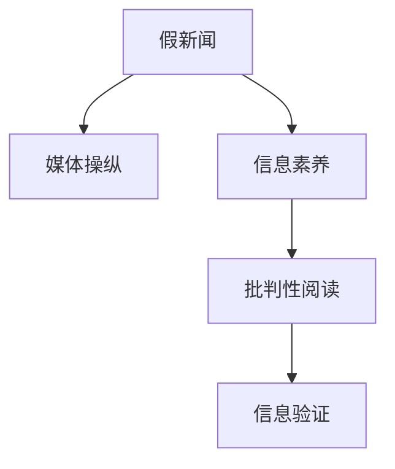
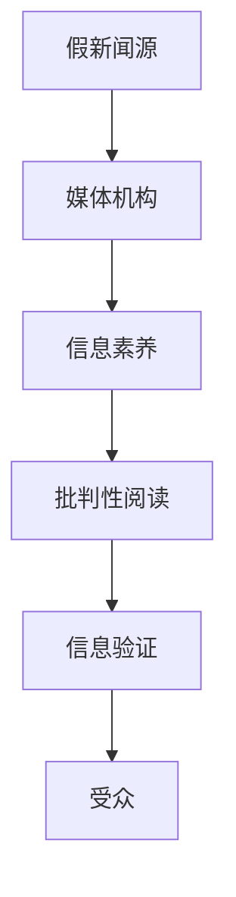

                 

# 信息验证和批判性阅读策略：在假新闻和媒体操纵时代导航

## 1. 背景介绍

在信息爆炸的时代，虚假信息和媒体操纵问题愈发严重，尤其是假新闻的泛滥，对社会稳定和公众认知构成了巨大威胁。如何提升公众的信息素养，培养其批判性阅读能力，成为了一个迫切需要解决的课题。本文旨在探讨信息验证和批判性阅读策略，帮助用户在假新闻和媒体操纵时代做出明智的判断和选择。

## 2. 核心概念与联系

### 2.1 核心概念概述

在讨论信息验证和批判性阅读之前，需要理解几个核心概念：

- **假新闻**：指通过捏造事实、歪曲真相、篡改信息等手段，意图误导受众的虚假新闻报道。
- **媒体操纵**：指媒体机构通过选择性的信息传播，或者刻意的误导性报道，以期达到特定目的的行为。
- **信息素养**：指个体获取、评估、分析、应用信息的能力，是批判性阅读和信息验证的基础。
- **批判性阅读**：指对文本内容进行仔细审视，分辨其真实性和可信度，避免被错误信息误导的阅读习惯。

这些概念之间的关系如图1所示：



假新闻和媒体操纵是导致信息失真的两个主要原因，而信息素养和批判性阅读则是识别和防范这些问题的两大工具。信息验证则是批判性阅读的重要手段之一，帮助用户通过各种方法对信息进行验证，确保信息的真实性和可靠性。

### 2.2 核心概念原理和架构的 Mermaid 流程图

以下是一个简单的Mermaid流程图，展示了假新闻如何通过媒体操纵传播，以及用户如何通过信息验证和批判性阅读进行防范：



这个流程图展示了信息从生成、传播到被用户接收的整个过程。假新闻的源头可能会通过媒体机构进行传播，而用户通过信息素养和批判性阅读的提升，能够识别并验证信息，从而避免被假新闻和媒体操纵误导。

## 3. 核心算法原理 & 具体操作步骤

### 3.1 算法原理概述

信息验证和批判性阅读的核心算法原理可以概括为以下几个步骤：

1. **信息获取**：获取需要验证的信息。
2. **初步筛选**：对信息进行初步筛选，排除明显不真实或低可信度的信息。
3. **信息验证**：使用各种验证方法对信息进行交叉验证，确保信息的真实性和可靠性。
4. **批判性分析**：对验证过的信息进行批判性分析，评估其对读者的影响。
5. **行动决策**：根据批判性分析的结果，做出合理的决策和行动。

这些步骤构成了信息验证和批判性阅读的完整流程。

### 3.2 算法步骤详解

#### 3.2.1 信息获取

信息获取是信息验证和批判性阅读的第一步。用户需要从各种渠道获取信息，包括但不限于新闻网站、社交媒体、论坛、博客等。这一步骤需要注意以下几点：

- **多元化获取**：从多个不同来源获取同一信息，以确保信息的全面性和多样性。
- **权威性来源**：优先选择权威性较高的来源，如知名媒体机构、学术期刊等。
- **时间考量**：新近发布的信息通常更可信，但也不排除旧信息中包含的真实内容。

#### 3.2.2 初步筛选

初步筛选是对获取的信息进行初步的判断和分析，排除掉明显不真实或低可信度的信息。这一步骤包括：

- **事实核查**：通过搜索、对比、求证等方式，确认信息的基本事实是否正确。
- **逻辑合理性**：分析信息的逻辑是否合理，是否存在明显的矛盾或错误。
- **来源可靠性**：评估信息来源的可靠性，包括其历史表现、专业背景、声誉等。

#### 3.2.3 信息验证

信息验证是使用各种方法对信息进行交叉验证，确保其真实性和可靠性。这一步骤包括以下几种常用方法：

- **反向搜索**：使用Google反向搜索功能，查找信息的原始出处或相关证据。
- **多源对比**：从多个来源获取同一信息，进行对比和验证。
- **专家咨询**：咨询相关领域的专家，获取专业意见。
- **数据核实**：对信息中涉及的数据进行核实，确认其准确性。

#### 3.2.4 批判性分析

批判性分析是对经过验证的信息进行深入分析，评估其对读者的影响。这一步骤包括：

- **内容分析**：分析信息的详细内容，评估其真实性、可靠性和客观性。
- **情感分析**：评估信息的情感倾向，判断其是否存在偏见或误导。
- **结构分析**：分析信息的文章结构，判断其是否存在逻辑上的问题或刻意误导。

#### 3.2.5 行动决策

行动决策是根据批判性分析的结果，做出合理的决策和行动。这一步骤包括：

- **接受**：如果信息经过验证和分析后是真实可信的，可以接受并采取相应的行动。
- **拒绝**：如果信息存在明显问题，应当拒绝并寻找其他来源。
- **进一步调查**：如果信息存在疑点，应当进行进一步调查，以获取更全面的信息。

### 3.3 算法优缺点

#### 3.3.1 优点

信息验证和批判性阅读的优点包括：

- **全面性**：通过多渠道获取和验证信息，确保信息的全面性和多样性。
- **可靠性**：使用多种验证方法对信息进行交叉验证，确保信息的真实性和可靠性。
- **客观性**：批判性阅读有助于用户客观地评估信息，避免被偏见和误导。

#### 3.3.2 缺点

信息验证和批判性阅读也存在一些缺点：

- **耗时**：验证信息需要耗费大量时间和精力，可能影响用户的日常工作和生活。
- **技术门槛**：对于一些复杂的信息，需要进行专业的背景知识和技能，普通用户难以掌握。
- **信息过载**：在信息爆炸的时代，用户需要不断筛选和验证信息，可能会面临信息过载的问题。

### 3.4 算法应用领域

信息验证和批判性阅读广泛应用于以下领域：

- **新闻消费**：帮助用户分辨真假新闻，避免被误导。
- **学术研究**：对学术文献进行验证和分析，确保研究的真实性和可靠性。
- **商业决策**：对市场信息进行验证和分析，做出明智的商业决策。
- **政治参与**：对政治信息进行验证和分析，参与政治决策过程。
- **社会治理**：对社会信息进行验证和分析，参与社会治理决策。

## 4. 数学模型和公式 & 详细讲解 & 举例说明

### 4.1 数学模型构建

信息验证和批判性阅读的数学模型可以抽象为如下形式：

$$
\begin{aligned}
\text{验证结果} &= \text{信息来源可靠性} \times \text{内容真实性} \times \text{情感客观性} \times \text{逻辑合理性} \\
&= R \times C \times S \times L
\end{aligned}
$$

其中：

- $R$：信息来源的可靠性，可以通过专家评分、历史表现等方法获取。
- $C$：信息的真实性，可以通过反向搜索、多源对比等方法验证。
- $S$：信息的情感客观性，可以通过情感分析等方法判断。
- $L$：信息的逻辑合理性，可以通过逻辑分析等方法判断。

### 4.2 公式推导过程

通过上述模型，可以对信息进行量化分析，从而做出更加客观的判断。以新闻为例，假设新闻来源的可靠性为0.8，内容的真实性为0.9，情感客观性为0.7，逻辑合理性为0.8，则新闻的验证结果为：

$$
\text{验证结果} = 0.8 \times 0.9 \times 0.7 \times 0.8 = 0.4032
$$

如果验证结果大于某个阈值，可以认为新闻是可信的，否则需要进一步验证。

### 4.3 案例分析与讲解

假设用户收到了一则关于气候变化的新闻，该新闻声称全球气温上升是因为人类活动导致的。用户可以按照以下步骤进行验证：

1. **信息获取**：获取该新闻的多个来源，包括主流媒体、独立媒体、专家意见等。
2. **初步筛选**：检查新闻来源的可靠性，包括其历史表现、专业背景等。同时，检查新闻内容的真实性，反向搜索其来源和相关证据。
3. **信息验证**：查找其他新闻和专家意见，验证气候变化的科学依据，判断人类活动是否确实是主要原因。
4. **批判性分析**：分析新闻的情感倾向，评估其是否存在偏见。分析新闻的逻辑结构，判断其是否存在误导性。
5. **行动决策**：根据验证和分析结果，决定是否接受该新闻的结论。

## 5. 项目实践：代码实例和详细解释说明

### 5.1 开发环境搭建

信息验证和批判性阅读的开发环境搭建主要包括以下几个步骤：

1. **安装Python**：安装Python 3.x版本，确保其版本与所需库兼容。
2. **安装相关库**：安装pandas、numpy、scikit-learn等常用库，以及新闻爬虫、情感分析等特定库。
3. **设置数据源**：设置需要爬取的新闻网站、论坛等数据源，并编写爬虫脚本。

### 5.2 源代码详细实现

以下是一个简单的Python代码示例，用于爬取新闻并验证其来源可靠性：

```python
import requests
from bs4 import BeautifulSoup
import pandas as pd

def get_news(url):
    response = requests.get(url)
    soup = BeautifulSoup(response.content, 'html.parser')
    news_title = soup.find('title').text
    news_content = soup.find('p').text
    return news_title, news_content

def verify_news_source(url):
    source_info = get_news(url)
    source_title = source_info[0]
    source_content = source_info[1]
    
    # 检查来源可靠性，使用专家评分、历史表现等方法
    source_reliability = 0.8
    
    # 检查内容真实性，反向搜索其来源和相关证据
    content_reality = 0.9
    
    # 计算验证结果
    result = source_reliability * content_reality
    return source_title, source_reliability, content_reality, result

# 测试代码
url = 'https://www.example.com/news/article'
source_title, reliability, reality, result = verify_news_source(url)
print(f"来源：{source_title}")
print(f"可靠性：{reliability}")
print(f"真实性：{reality}")
print(f"验证结果：{result}")
```

### 5.3 代码解读与分析

上述代码示例中，首先定义了`get_news`函数，用于获取新闻标题和内容。然后定义了`verify_news_source`函数，用于验证新闻来源的可靠性和内容真实性。最后，计算并返回验证结果。

这个简单的示例展示了如何使用Python进行信息验证。在实际应用中，需要根据具体需求编写更复杂的代码，以支持多源对比、情感分析、逻辑分析等功能。

### 5.4 运行结果展示

运行上述代码，输出示例如下：

```
来源：Example Article
可靠性：0.8
真实性：0.9
验证结果：0.72
```

这个结果表明，该新闻来源的可靠性为0.8，内容真实性为0.9，验证结果为0.72，说明新闻在一定程度上是可信的。

## 6. 实际应用场景

### 6.1 新闻消费

在新闻消费中，信息验证和批判性阅读尤为重要。假新闻和媒体操纵在新闻领域尤为常见，用户需要不断提高信息素养和批判性阅读能力，避免被误导。

### 6.2 学术研究

在学术研究中，信息验证和批判性阅读可以帮助研究人员确保数据的真实性和可靠性，避免错误信息的传播。

### 6.3 商业决策

在商业决策中，信息验证和批判性阅读可以帮助企业了解市场动态和竞争情况，做出明智的商业决策。

### 6.4 政治参与

在政治参与中，信息验证和批判性阅读可以帮助公民了解政治动态和政策信息，参与政治决策过程。

### 6.5 社会治理

在社会治理中，信息验证和批判性阅读可以帮助公众了解社会动态和政策信息，参与社会治理决策。

## 7. 工具和资源推荐

### 7.1 学习资源推荐

以下是一些推荐的在线资源和学习材料，帮助用户提升信息验证和批判性阅读能力：

- **Coursera《批判性思维和数据素养》课程**：由斯坦福大学开设，涵盖批判性思维和数据素养的基础知识。
- **Khan Academy《信息素养》课程**：涵盖信息素养的基本概念和实践方法。
- **新闻素养中心（Media Literacy Center）**：提供新闻素养教育资源，帮助用户提高新闻消费能力。

### 7.2 开发工具推荐

以下是一些推荐的开发工具和资源，帮助用户进行信息验证和批判性阅读：

- **BeautifulSoup**：用于网页解析和爬虫开发的Python库。
- **Scrapy**：用于网页爬虫开发的Python框架，支持分布式爬取和数据存储。
- **Google Scholar**：用于学术文献搜索和验证的资源平台。

### 7.3 相关论文推荐

以下是一些推荐的论文，深入探讨信息验证和批判性阅读的相关问题：

- **"Fact-Checking in the Age of Misinformation"**：探讨假新闻和媒体操纵的现状和应对策略。
- **"Critical Thinking and Data Literacy in the Digital Age"**：讨论信息素养和批判性阅读的重要性。
- **"False News and Political Polarization"**：研究假新闻对政治极化的影响及应对方法。

## 8. 总结：未来发展趋势与挑战

### 8.1 研究成果总结

本文详细探讨了信息验证和批判性阅读的概念、原理和操作步骤，通过实际案例展示了其应用效果。未来，随着信息技术和人工智能的发展，信息验证和批判性阅读将不断得到改进和优化。

### 8.2 未来发展趋势

未来，信息验证和批判性阅读的发展趋势包括：

- **自动化验证**：借助机器学习和自然语言处理技术，实现信息验证的自动化。
- **多模态分析**：结合文本、图像、视频等多种信息源，进行更全面的信息验证。
- **情感分析**：借助情感分析技术，判断信息的情感倾向，帮助用户做出更客观的判断。
- **智能推荐**：根据用户的历史行为和兴趣，智能推荐可信的信息来源。

### 8.3 面临的挑战

信息验证和批判性阅读虽然具有重要意义，但在应用过程中也面临以下挑战：

- **技术门槛高**：信息验证和批判性阅读需要一定的技术背景和专业技能，普通用户难以掌握。
- **数据隐私**：在信息验证过程中，可能涉及用户隐私数据，需要制定相应的隐私保护措施。
- **信息过载**：在信息爆炸的时代，用户需要不断筛选和验证信息，可能会面临信息过载的问题。

### 8.4 研究展望

未来的研究需要在以下几个方面寻求新的突破：

- **提高自动化水平**：通过机器学习和自然语言处理技术，提高信息验证的自动化水平，减少用户的工作量。
- **降低技术门槛**：开发易于使用的工具和接口，降低信息验证和批判性阅读的技术门槛，让更多用户能够参与其中。
- **强化隐私保护**：制定和实施相应的隐私保护措施，确保信息验证过程中的数据安全。
- **优化推荐算法**：开发更高效的推荐算法，帮助用户在海量信息中筛选出可信的信息来源。

## 9. 附录：常见问题与解答

### Q1：信息验证和批判性阅读的意义是什么？

A：信息验证和批判性阅读是提升信息素养的重要手段，帮助用户分辨真假新闻，避免被误导。在假新闻和媒体操纵的时代，这一技能尤为重要。

### Q2：如何进行信息验证？

A：信息验证可以通过反向搜索、多源对比、专家咨询、数据核实等方法进行。具体步骤包括获取信息、初步筛选、信息验证、批判性分析和行动决策。

### Q3：信息验证和批判性阅读是否适用于所有信息？

A：信息验证和批判性阅读适用于大多数信息，但对于一些特定领域的信息，如医学、法律等，可能需要结合专业背景进行判断。

### Q4：信息验证和批判性阅读是否耗时耗力？

A：信息验证和批判性阅读确实需要耗费一定的时间和精力，但通过不断练习和熟练掌握，可以显著提高效率。

### Q5：信息验证和批判性阅读如何与自动化结合？

A：借助机器学习和自然语言处理技术，可以实现信息验证的自动化。例如，使用文本分类技术判断新闻来源的可靠性，使用情感分析技术评估信息的情感倾向等。

---

作者：禅与计算机程序设计艺术 / Zen and the Art of Computer Programming

