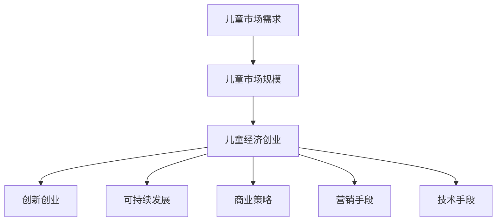

                 

## 1. 背景介绍

儿童市场是一个潜力巨大的市场，随着全球人口增长和消费水平的提升，儿童经济已成为各国经济发展的重要引擎之一。据统计，全球儿童市场规模预计将在未来十年内增长到超过数万亿美元。然而，尽管儿童市场有着巨大的商业机会，但传统经济活动却未能充分挖掘这一潜力。

儿童经济创业的兴起，为这一市场注入了新的活力。利用科技创新和互联网思维，企业家们正在开发出一系列新产品、新服务，以满足儿童及其家庭日益多样化的需求。本博客将深入探讨儿童市场的多样性，并分析如何通过创业活动，解锁这一市场的无限可能。

## 2. 核心概念与联系

### 2.1 核心概念概述

在儿童经济创业中，以下几个核心概念扮演着关键角色：

- **儿童经济创业**：利用科技手段和商业模式，针对儿童及其家庭提供产品或服务，以实现商业盈利和价值最大化。
- **儿童市场需求**：包括儿童的生理需求、教育需求、娱乐需求等，以及家长对相关产品或服务的期待。
- **儿童市场规模**：指全球范围内与儿童相关的商品和服务市场总价值。
- **创新创业**：通过新颖的商业模式、技术手段或产品设计，创造新的商业机会和价值。
- **可持续发展**：确保儿童经济创业活动对环境、社会和经济的影响最小化，同时对儿童成长有益。

这些概念通过特定的商业模式、技术手段和市场策略相互作用，形成了儿童经济创业的完整生态系统。

### 2.2 核心概念原理和架构的 Mermaid 流程图



## 3. 核心算法原理 & 具体操作步骤

### 3.1 算法原理概述

儿童经济创业涉及多个领域和学科，包括心理学、社会学、市场营销、技术创新等。本文将从市场分析、商业模式设计和产品开发三个角度，探讨儿童经济创业的核心算法原理。

### 3.2 算法步骤详解

**市场分析**

1. **数据收集与分析**：通过在线调查、社交媒体分析、消费者行为数据等方式，收集与儿童及其家庭相关的数据。
2. **需求识别**：使用数据分析工具识别儿童及其家庭的需求模式和偏好。
3. **机会识别**：通过市场细分和竞争对手分析，发现潜在的商业机会。

**商业模式设计**

1. **价值主张**：明确产品或服务如何满足儿童及其家庭的需求，并创造价值。
2. **盈利模式**：制定合理的定价策略和收入来源，确保可持续发展。
3. **渠道策略**：确定产品或服务的销售渠道和分销方式。

**产品开发**

1. **用户体验设计**：确保产品或服务的设计符合儿童的认知和行为特点。
2. **技术实现**：利用最新的技术手段，如人工智能、大数据、区块链等，提升产品或服务的效率和质量。
3. **测试与迭代**：通过用户反馈和市场测试，不断优化产品或服务。

### 3.3 算法优缺点

**优点**

- 数据驱动：通过数据收集和分析，可以精准地识别市场机会，指导产品或服务的开发。
- 多学科融合：结合心理学、社会学、市场营销和技术创新，提升产品或服务的竞争力。
- 快速迭代：通过持续的用户反馈和市场测试，不断优化产品或服务，适应市场需求变化。

**缺点**

- 数据获取难度大：儿童及其家庭的数据往往较为敏感，获取难度较大。
- 创新风险高：新技术和新商业模式的应用，存在较高的失败风险。
- 市场竞争激烈：儿童市场吸引众多大型企业和创业公司，竞争激烈。

### 3.4 算法应用领域

儿童经济创业的应用领域广泛，包括但不限于以下几个方面：

- **儿童教育**：开发教育应用、在线课程、教育游戏等，帮助儿童提升学习效果。
- **儿童健康**：提供健康监测、营养指导、儿童药品等，促进儿童身心健康。
- **儿童娱乐**：推出儿童动漫、儿童视频、玩具等，丰富儿童的娱乐生活。
- **儿童安全**：开发智能穿戴设备、儿童定位系统等，保障儿童的安全。

## 4. 数学模型和公式 & 详细讲解 & 举例说明

### 4.1 数学模型构建

本节将构建一个简单的数学模型，用于分析儿童市场的潜在收益和风险。假设市场上有 $N$ 个潜在的儿童用户，每个用户每年对相关产品或服务的消费额为 $C$。令 $P$ 为产品或服务的市场渗透率，$C_{avg}$ 为每个用户的平均消费额。

市场总消费额 $T$ 可以表示为：
$$
T = P \times N \times C_{avg}
$$

### 4.2 公式推导过程

为了估算市场规模和潜在收益，我们需要定义以下变量：

- $P$：产品或服务的市场渗透率，通常需要通过市场调研和竞争分析来确定。
- $N$：潜在儿童用户的数量，可以通过人口统计数据和家庭结构模型来估算。
- $C_{avg}$：每个用户的平均消费额，可以通过历史数据和用户调研来估算。

### 4.3 案例分析与讲解

以儿童智能穿戴设备市场为例，假设市场渗透率为 $P=20\%$，儿童用户数量为 $N=1000$ 万，每个用户的平均消费额为 $C_{avg}=500$ 元/年。则市场总消费额 $T$ 为：
$$
T = 0.2 \times 1000 \times 10^6 \times 500 = 10^{10} \text{ 元/年}
$$

这意味着儿童智能穿戴设备市场具有巨大的商业潜力，但同时也面临着市场竞争、技术更新换代等挑战。

## 5. 项目实践：代码实例和详细解释说明

### 5.1 开发环境搭建

本节将介绍使用Python和Flask框架搭建一个儿童市场分析应用的开发环境。

1. 安装Python和Flask：
```bash
pip install flask
```

2. 创建项目目录和文件结构：
```bash
mkdir children_market_analysis
cd children_market_analysis
```

3. 创建Flask应用程序：
```python
from flask import Flask, request, jsonify

app = Flask(__name__)

@app.route('/analyze', methods=['POST'])
def analyze():
    data = request.get_json()
    # 处理用户输入数据
    # 计算市场总消费额等指标
    # 返回分析结果
    return jsonify({'result': '分析结果'})
```

### 5.2 源代码详细实现

```python
from flask import Flask, request, jsonify
import pandas as pd

app = Flask(__name__)

@app.route('/analyze', methods=['POST'])
def analyze():
    data = request.get_json()
    
    # 读取数据集
    df = pd.read_csv('children_market_data.csv')
    
    # 数据预处理
    # ...
    
    # 计算市场总消费额等指标
    total_consumption = df['P'] * df['N'] * df['C_avg']
    
    # 分析结果
    result = {
        'total_consumption': total_consumption,
        'market_penetration': df['P'],
        'number_of_users': df['N'],
        'average_consumption': df['C_avg']
    }
    
    return jsonify(result)

if __name__ == '__main__':
    app.run(debug=True)
```

### 5.3 代码解读与分析

本代码段实现了Flask应用程序的创建和API接口的定义。当用户通过POST请求发送数据时，应用程序将计算市场总消费额等指标，并返回分析结果。

**关键代码解读**：

- `request.get_json()`：从用户请求中获取JSON格式的数据。
- `pd.read_csv('children_market_data.csv')`：读取包含市场数据的数据集。
- `df['P'] * df['N'] * df['C_avg']`：计算市场总消费额。
- `jsonify(result)`：将分析结果以JSON格式返回。

## 6. 实际应用场景

### 6.1 智能穿戴设备

智能穿戴设备是儿童经济创业中颇具前景的领域之一。通过智能手表、智能眼镜等设备，家长可以实时监测孩子的健康状况、位置信息、社交互动等。这些设备不仅满足了儿童及其家庭对健康和安全的需求，还为设备制造商和应用程序开发者带来了新的商业机会。

### 6.2 儿童在线教育

在线教育领域正经历着前所未有的发展。通过互联网技术，家长可以为儿童提供丰富的学习资源和互动体验，如在线课程、教育游戏等。在线教育平台不仅有助于提升儿童的学习效果，也为教育企业提供了新的收入来源。

### 6.3 儿童社交平台

随着互联网普及和儿童信息化水平提升，儿童社交平台逐渐成为热点。这些平台为儿童提供了一个安全、互动的社交空间，促进儿童的社交发展和心理健康。同时，平台运营商可以提供广告、付费内容等增值服务，实现商业变现。

### 6.4 未来应用展望

未来，儿童经济创业将更加注重数据驱动、技术创新和社会责任。随着人工智能、大数据等技术的不断发展，儿童经济创业活动将变得更加智能化、个性化。此外，儿童市场的可持续发展将成为重要考量，更多企业将注重儿童健康、环境保护和社会责任，实现商业价值与社会价值的双赢。

## 7. 工具和资源推荐

### 7.1 学习资源推荐

- **《儿童市场分析与策略》**：一本深入分析儿童市场特点和需求的书籍，适合从事儿童经济创业的企业家和市场分析师阅读。
- **Coursera《儿童市场研究与开发》课程**：通过线上课程，学习儿童市场的研究方法和市场开发技巧。
- **Kaggle《儿童市场数据集》**：提供丰富的儿童市场数据集，用于实践和分析。

### 7.2 开发工具推荐

- **Flask**：轻量级的Web框架，适合快速搭建和开发儿童市场分析应用。
- **Jupyter Notebook**：用于数据处理和模型开发的交互式环境，支持Python和其他科学计算语言。
- **TensorFlow和PyTorch**：强大的深度学习框架，可用于儿童市场的机器学习和数据分析。

### 7.3 相关论文推荐

- **《儿童市场分析与预测方法》**：讨论了儿童市场的研究方法，包括数据分析、市场细分等。
- **《儿童在线教育平台的用户行为分析》**：分析了儿童在线教育平台的用户行为数据，探讨了提升用户满意度和留存率的策略。

## 8. 总结：未来发展趋势与挑战

### 8.1 研究成果总结

本文从市场分析、商业模式设计和产品开发三个方面，详细探讨了儿童经济创业的核心算法原理和具体操作步骤。通过案例分析，展示了儿童市场的巨大潜力和挑战。

### 8.2 未来发展趋势

1. **数据驱动**：随着数据采集和处理技术的进步，儿童市场分析将更加精准和高效。
2. **技术创新**：人工智能、大数据、区块链等新兴技术的应用，将推动儿童经济创业向智能化、个性化方向发展。
3. **社会责任**：更多企业将注重儿童的健康、教育和可持续发展，实现商业价值与社会价值的平衡。

### 8.3 面临的挑战

1. **数据隐私和安全**：儿童及其家庭数据敏感，如何确保数据隐私和安全是一个重要挑战。
2. **技术壁垒**：新技术和新商业模式的应用，需要克服较高的技术壁垒。
3. **市场竞争**：儿童市场竞争激烈，如何在竞争中脱颖而出是一个挑战。

### 8.4 研究展望

未来，儿童经济创业将更加注重多学科融合、技术创新和社会责任。通过不断的技术进步和市场探索，儿童经济创业将为儿童及其家庭带来更多实惠和便利，推动儿童市场的繁荣发展。

## 9. 附录：常见问题与解答

**Q1：儿童市场的潜在收益和风险如何评估？**

A: 评估儿童市场的潜在收益和风险，需要考虑以下几个因素：
- 儿童市场的规模和增长潜力。
- 用户对产品或服务的需求和满意度。
- 竞争格局和市场份额。
- 技术创新和成本控制能力。

**Q2：儿童经济创业如何确保数据隐私和安全？**

A: 确保儿童经济创业的数据隐私和安全，需要采取以下措施：
- 数据匿名化处理，避免个人身份信息泄露。
- 加密传输和存储数据，防止数据被非法访问或篡改。
- 建立严格的数据访问权限控制，确保只有授权人员可以访问敏感数据。

**Q3：儿童市场的未来发展趋势有哪些？**

A: 儿童市场的未来发展趋势包括：
- 数据驱动的个性化服务。
- 技术创新带来的产品多样化。
- 社会责任和可持续发展的重视。

通过不断的研究和创新，儿童经济创业必将在未来迎来更加广阔的发展空间。

---

作者：禅与计算机程序设计艺术 / Zen and the Art of Computer Programming

