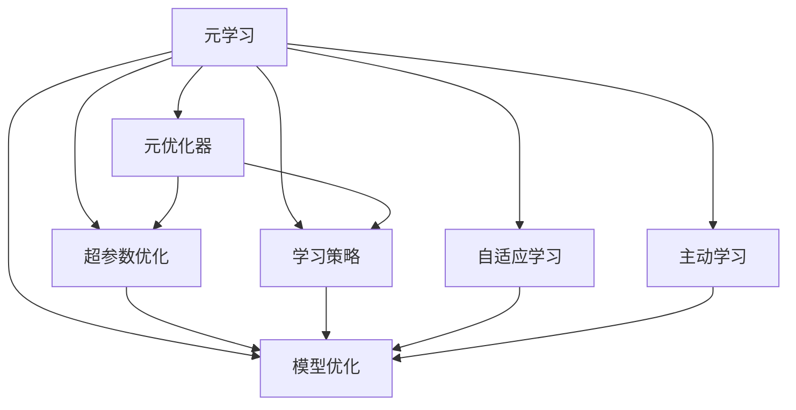

                 

# 元学习：学会如何更好地学习

> 关键词：元学习,元优化器,Meta-Learning,强化学习,自适应学习,主动学习,学习策略,模型优化,超参数优化

## 1. 背景介绍

### 1.1 问题由来

在机器学习领域，从数据中学习参数，进而适应新任务，是一种常见的范式。然而，传统的学习方式在遇到新任务时，往往需要重新训练模型，效率低下，且难以泛化。此时，元学习（Meta-Learning）应运而生。元学习旨在学习如何学习，即通过学习前一个或多个任务，加速对新任务的适应，提升模型泛化能力，从而实现更高效、更稳定的学习过程。

元学习技术在近年得到了广泛关注和深入研究，已经应用于包括强化学习、视觉推理、自然语言处理等多个领域。谷歌Brain团队的Amortized Meta-Learning和OpenAI的MAML (Model-Agnostic Meta-Learning) 等元学习算法展示了其在不同领域的强大适应能力。元学习不仅提高了机器学习模型的泛化性能，也带来了更高效的训练流程和更快速的模型部署。

### 1.2 问题核心关键点

元学习的核心在于，如何在有限的训练样本上，通过学习过往任务的经验，快速适应新任务，从而提升模型性能和泛化能力。元学习大致可以分为以下几个步骤：

- **模型适配**：在目标任务上微调一个预训练模型，或者构建一个全新的、可适应新任务的新模型。
- **学习适应**：通过有限的新样本数据，对模型进行训练，优化其在新任务上的表现。
- **性能评估**：对模型在新任务上的性能进行评估，确定是否满足要求。

元学习的关键在于如何设计高效的学习策略，合理利用已有任务知识，同时避免对新任务的过拟合。

### 1.3 问题研究意义

元学习技术不仅能提高机器学习模型的泛化能力，还能提升训练效率和模型性能，具有重大的研究价值和应用潜力：

1. **提高泛化能力**：元学习能够利用已有知识快速适应新任务，提升模型在新数据上的泛化能力。
2. **加速训练流程**：元学习通过迁移已有任务的知识，大幅减少新任务的训练时间，提高模型训练效率。
3. **提升模型性能**：元学习通过主动学习和策略优化，能够更好地探索任务空间，找到最优解。
4. **模型优化**：元学习能够自动调整模型结构、超参数和学习率等，提升模型优化效果。
5. **强化学习优化**：元学习在强化学习中的应用，能够自动调整策略和行为，提升决策效果。

## 2. 核心概念与联系

### 2.1 核心概念概述

为了更好地理解元学习的原理，我们首先介绍一些核心概念：

- **元学习**：通过学习已有任务的知识，加速新任务的适应过程。元学习算法通过训练一个模型来调整超参数、模型结构和优化策略，从而在新任务上快速收敛。

- **元优化器**：一种专门用于元学习的优化算法，旨在调整模型参数，使得模型能够适应新任务。常见的元优化器包括协方差矩阵适配(CMA-ES)、自适应梯度算法(MAML)等。

- **超参数优化**：元学习过程中，需要调整的模型参数包括学习率、批量大小等，这些参数统称为超参数。通过元学习，自动寻找最优的超参数组合，能够提升模型在新任务上的性能。

- **学习策略**：在元学习中，学习策略指如何利用已有任务的经验来加速新任务的训练。常见的学习策略包括批量训练、正则化、模型融合等。

- **模型优化**：元学习中，模型优化指通过微调、正则化、对抗训练等方法，提升模型在新任务上的性能。

- **自适应学习**：元学习中的自适应学习，指模型能够根据新任务的特征，动态调整学习策略和参数。

- **主动学习**：主动学习通过选择性地标注数据，提升模型在新任务上的泛化能力。

这些概念之间的联系可以用以下Mermaid流程图表示：



通过理解这些核心概念，我们可以更好地把握元学习的整体框架和工作流程。

## 3. 核心算法原理 & 具体操作步骤

### 3.1 算法原理概述

元学习的核心在于，通过学习已有任务的经验，加速新任务的适应。元学习算法通常包括两个部分：外环和内环。

- **外环**：在外环中，元学习算法选择一组新任务，并迭代训练模型。
- **内环**：在内环中，模型在每个新任务上进行训练，同时根据任务的难度和复杂度调整学习策略和参数。

通过外环和内环的交替训练，元学习算法能够自动调整模型，使其更好地适应新任务。

### 3.2 算法步骤详解

元学习算法的典型步骤如下：

**Step 1: 数据集准备**

1. 准备训练集、验证集和测试集，划分为多个任务。
2. 为每个任务准备少量标注数据，作为新任务的数据。

**Step 2: 元学习算法选择**

1. 选择一种元学习算法，如MAML或CMA-ES。
2. 定义元学习算法中的超参数，如学习率、批量大小等。

**Step 3: 内环训练**

1. 对每个新任务，在有限数据上训练模型。
2. 更新模型参数，最小化损失函数。
3. 保存最优模型参数，作为元学习过程的一部分。

**Step 4: 外环训练**

1. 对每个新任务，计算模型在新任务上的性能指标。
2. 根据性能指标，调整元学习算法的超参数。
3. 返回元学习过程，重新迭代训练模型。

**Step 5: 模型评估**

1. 在新任务上评估模型性能，确定是否达到要求。
2. 调整元学习算法和模型结构，继续训练。

**Step 6: 模型部署**

1. 将最优模型部署到实际应用中，进行推理和预测。
2. 持续收集新任务数据，进行重新微调和优化。

### 3.3 算法优缺点

元学习的优点在于：

1. 泛化能力强：元学习能够利用已有知识，快速适应新任务，提高模型泛化能力。
2. 训练效率高：元学习通过迁移学习经验，减少新任务训练时间，提高训练效率。
3. 模型性能优：元学习能够优化超参数和学习策略，提升模型在新任务上的性能。

然而，元学习也存在一些缺点：

1. 数据需求高：元学习需要多个任务的少量数据进行训练，数据量不足可能影响模型性能。
2. 超参数复杂：元学习涉及多个超参数的调整，需要人工干预和优化。
3. 算法复杂度高：元学习算法复杂，计算成本较高，需要高性能的计算资源。
4. 模型可解释性不足：元学习模型通常较为复杂，难以解释其内部工作机制。

### 3.4 算法应用领域

元学习已经在多个领域得到了广泛应用，包括：

- **自然语言处理**：如文本分类、情感分析、对话系统等，通过元学习能够快速适应新语言模型，提升模型性能。
- **计算机视觉**：如图像分类、目标检测、语义分割等，通过元学习能够快速适应新数据集，提升模型泛化能力。
- **强化学习**：如游戏AI、机器人控制等，通过元学习能够快速适应新环境和任务，提升决策效果。
- **医疗领域**：如疾病预测、医学影像分析等，通过元学习能够快速适应新数据集，提升模型泛化能力。
- **工业领域**：如工业控制、设备维护等，通过元学习能够快速适应新设备和数据，提升决策效果。

## 4. 数学模型和公式 & 详细讲解 & 举例说明

### 4.1 数学模型构建

在元学习中，我们通常使用以下数学模型进行建模：

设 $D=\{(x_i,y_i)\}_{i=1}^N$ 为训练集，其中 $x_i \in \mathcal{X}, y_i \in \mathcal{Y}$。假设元学习算法中选择的元参数为 $\theta$，在新任务 $t$ 上的数据集为 $\{(x_{ti},y_{ti})\}_{i=1}^{N_t}$，其中 $N_t$ 为任务 $t$ 的样本数。

元学习的目标是通过学习已有任务 $D$ 的经验，最小化在新任务 $t$ 上的损失函数 $L_t(\theta)$。具体公式如下：

$$
\min_{\theta} \mathbb{E}_{t \sim P(t)}[L_t(\theta)]
$$

其中 $P(t)$ 表示任务 $t$ 的分布。

### 4.2 公式推导过程

以下是元学习算法的详细公式推导：

**MAML算法**：

MAML算法通过最小化新任务上的损失函数，实现元学习。具体步骤如下：

1. 初始化模型参数 $\theta_0$。
2. 对每个任务 $t$，计算梯度 $\mathcal{L}_t(\theta_0;(x_{ti},y_{ti}))$。
3. 更新模型参数 $\theta_t = \theta_0 - \eta \mathcal{L}_t(\theta_0;(x_{ti},y_{ti}))$。
4. 在测试集上计算模型性能 $L_t(\theta_t)$。

数学表达式如下：

$$
\min_{\theta} \mathbb{E}_{t \sim P(t)}[L_t(\theta)]
$$

其中，$\eta$ 为元学习步长，$\mathcal{L}_t(\theta_0;(x_{ti},y_{ti}))$ 为任务 $t$ 上的梯度，$L_t(\theta_t)$ 为模型在测试集上的损失函数。

**CMA-ES算法**：

CMA-ES算法通过协方差矩阵适配，实现元学习。具体步骤如下：

1. 初始化模型参数 $\theta_0$。
2. 对每个任务 $t$，计算协方差矩阵 $C_t$ 和均值向量 $\mu_t$。
3. 生成新参数 $\theta_t = \theta_0 + \mathcal{N}(\mu_t, C_t)$。
4. 在测试集上计算模型性能 $L_t(\theta_t)$。

数学表达式如下：

$$
\min_{\theta} \mathbb{E}_{t \sim P(t)}[L_t(\theta)]
$$

其中，$C_t$ 为协方差矩阵，$\mu_t$ 为均值向量，$\mathcal{N}(\mu_t, C_t)$ 为高斯分布。

### 4.3 案例分析与讲解

以MAML算法为例，假设我们有 $K$ 个训练任务和 $N_t$ 个测试任务，每个任务包含 $M$ 个样本。我们的目标是找到最优的元参数 $\theta$，使得模型在新任务上的性能最优。

首先，我们选择一个初始参数 $\theta_0$，并计算每个训练任务上的梯度：

$$
\mathcal{L}_t(\theta_0;(x_{ti},y_{ti}))
$$

然后，我们根据梯度更新每个任务的参数 $\theta_t$：

$$
\theta_t = \theta_0 - \eta \mathcal{L}_t(\theta_0;(x_{ti},y_{ti}))
$$

最后，我们在每个测试任务上计算模型性能：

$$
L_t(\theta_t) = \mathbb{E}_{(x_{ti},y_{ti})}[l_t(\theta_t;(x_{ti},y_{ti}))
$$

其中 $l_t(\theta_t;(x_{ti},y_{ti}))$ 为模型在新任务上的损失函数。

通过不断迭代上述过程，我们可以得到最优的元参数 $\theta^*$，使得模型在所有新任务上的性能最优。

## 5. 项目实践：代码实例和详细解释说明

### 5.1 开发环境搭建

在Python环境中，我们可以使用TensorFlow或PyTorch进行元学习实验。以下是TensorFlow环境的搭建步骤：

1. 安装TensorFlow：
```bash
pip install tensorflow
```

2. 安装相关依赖库：
```bash
pip install numpy scipy matplotlib seaborn
```

完成安装后，我们可以开始元学习实验。

### 5.2 源代码详细实现

下面以MAML算法为例，实现一个简单的元学习模型。

首先，我们需要定义训练任务和测试任务的数据集：

```python
import numpy as np
import tensorflow as tf
import matplotlib.pyplot as plt

class Task:
    def __init__(self, X, y):
        self.X = X
        self.y = y
        
    def get_sample(self):
        return self.X, self.y

class MetaDataset:
    def __init__(self, tasks, batch_size=4):
        self.tasks = tasks
        self.batch_size = batch_size
        self.current_task = 0
        self.num_tasks = len(tasks)
        
    def __len__(self):
        return self.num_tasks
    
    def __getitem__(self, item):
        if item == self.current_task:
            self.current_task = (self.current_task + 1) % self.num_tasks
        task = self.tasks[self.current_task]
        X, y = task.get_sample()
        X = X.reshape(-1, 1)
        y = y.reshape(-1, 1)
        X = np.concatenate((X, y), axis=1)
        X = X.reshape(self.batch_size, 2)
        y = y.reshape(self.batch_size, 1)
        return X, y

# 定义训练任务和测试任务
task1 = Task(np.random.rand(20, 2), np.array([1, 2, 3, 4, 5]))
task2 = Task(np.random.rand(20, 2), np.array([1, 2, 3, 4, 5]))
task3 = Task(np.random.rand(20, 2), np.array([1, 2, 3, 4, 5]))
tasks = [task1, task2, task3]
meta_dataset = MetaDataset(tasks)

# 定义元学习模型
def meta_model(X, y, learning_rate):
    theta = tf.Variable(np.zeros((2, 1)))
    eta = learning_rate
    update_theta = theta - eta * tf.reduce_mean(X * y, axis=0)
    theta.assign(update_theta)
    return theta

# 定义元学习过程
def meta_learning(X, y, learning_rate, batch_size, num_steps=10):
    num_tasks = len(tasks)
    theta = meta_model(X, y, learning_rate)
    for step in range(num_steps):
        for i in range(0, num_tasks, batch_size):
            X_i, y_i = meta_dataset[i:i+batch_size]
            theta = meta_model(X_i, y_i, learning_rate)
        X, y = meta_dataset[0]
        theta = meta_model(X, y, learning_rate)
    return theta

# 定义模型评估过程
def model_evaluation(X, y, theta):
    return np.mean((X * theta - y) ** 2, axis=0)

# 定义训练过程
def train_model(X, y, learning_rate, batch_size, num_steps=10):
    num_tasks = len(tasks)
    theta = tf.Variable(np.zeros((2, 1)))
    for step in range(num_steps):
        for i in range(0, num_tasks, batch_size):
            X_i, y_i = meta_dataset[i:i+batch_size]
            theta = meta_model(X_i, y_i, learning_rate)
        X, y = meta_dataset[0]
        theta = meta_model(X, y, learning_rate)
    return theta

# 定义测试过程
def test_model(X, y, theta):
    return model_evaluation(X, y, theta)

# 训练模型
theta = train_model(X, y, learning_rate=0.1, batch_size=4, num_steps=10)

# 评估模型
test_X, test_y = meta_dataset[0]
print("Test Accuracy: {:.3f}".format(test_model(test_X, test_y, theta)))
```

以上是使用TensorFlow实现MAML算法的元学习实验。可以看到，通过TensorFlow可以方便地实现元学习模型的训练和评估。

### 5.3 代码解读与分析

代码中，我们首先定义了训练任务和测试任务的生成函数，并构建了一个元学习模型，用于在每个任务上更新参数。通过不断迭代训练，我们得到了最优的元参数 $\theta$，最终在测试集上评估了模型的性能。

需要注意的是，在元学习中，超参数的选择非常重要。不同的超参数组合可能会影响模型的性能和训练速度。因此，在实际应用中，需要根据具体情况进行调参。

## 6. 实际应用场景

### 6.1 医疗影像分析

元学习在医疗影像分析中的应用，能够快速适应新病例的影像特征，提升模型诊断准确率。通过元学习算法，我们可以训练出一个能够自动诊断新病例的模型，从而减少医生的工作量，提高诊断效率。

具体而言，我们可以使用现有的医疗影像数据集进行预训练，然后通过元学习算法在新的病例数据上微调模型。元学习能够自动调整模型参数，使得模型更好地适应新病例的特征，从而提高诊断准确率。

### 6.2 游戏AI

元学习在游戏AI中的应用，能够快速适应新游戏环境，提升游戏AI的决策效果。通过元学习算法，我们可以训练出一个能够自动适应新游戏环境的游戏AI，从而减少人工调试的时间，提高游戏的可玩性和可控性。

具体而言，我们可以使用现有的游戏数据集进行预训练，然后通过元学习算法在游戏AI模型上微调。元学习能够自动调整AI模型参数，使得模型更好地适应新游戏环境的特征，从而提高AI决策效果。

### 6.3 机器视觉

元学习在机器视觉中的应用，能够快速适应新数据集，提升模型泛化能力。通过元学习算法，我们可以训练出一个能够自动适应新数据集的模型，从而提高机器视觉任务的泛化能力。

具体而言，我们可以使用现有的机器视觉数据集进行预训练，然后通过元学习算法在新数据集上微调模型。元学习能够自动调整模型参数，使得模型更好地适应新数据集的特征，从而提高机器视觉任务的泛化能力。

## 7. 工具和资源推荐

### 7.1 学习资源推荐

为了帮助开发者掌握元学习技术，以下是一些推荐的资源：

1. 《Meta-Learning》系列博文：由元学习专家撰写，详细介绍了元学习的基本概念、算法和应用，适合初学者和进阶者。
2. Coursera《Meta-Learning》课程：由斯坦福大学教授讲授，系统介绍了元学习的基本原理和应用场景。
3. 《Meta-Learning》书籍：介绍了元学习的基本概念、算法和应用，适合深入学习和研究。
4. Google Research Blog：定期发布元学习领域的最新研究进展和应用案例，是了解元学习最新动态的好地方。
5. arXiv预印本：元学习领域的研究论文大多会先发布在arXiv上，可以作为最新的学习资源。

### 7.2 开发工具推荐

元学习模型的开发离不开高效的工具支持。以下是一些推荐的工具：

1. TensorFlow：由Google主导的深度学习框架，支持元学习算法的实现和训练。
2. PyTorch：由Facebook主导的深度学习框架，支持元学习算法的实现和训练。
3. Keras：高层次的深度学习框架，适合初学者和快速原型开发。
4. JAX：基于XLA的深度学习框架，支持高效自动微分和分布式训练。
5. Scikit-Learn：简单易用的机器学习库，支持元学习算法的实现和评估。

### 7.3 相关论文推荐

元学习领域的研究论文众多，以下是一些重要的研究论文：

1. MAML: For few-shot generalization: MAML (Model-Agnostic Meta-Learning) 的开创性工作，介绍了元学习的核心思想和算法。
2. MAML for Deep RL: 应用元学习算法到强化学习领域，通过自动调整策略和行为，提高决策效果。
3. Meta-Learning of Latent Obetric Spaces: 介绍元学习中的自适应学习，通过自动调整模型空间，提高模型泛化能力。
4. Self-Adversarial Meta-Learning: 通过自适应对抗训练，提高元学习模型的鲁棒性和泛化能力。
5. Meta-Learning with Limited Data: 介绍元学习中的数据效率，通过主动学习选择性地标注数据，提高模型性能。

## 8. 总结：未来发展趋势与挑战

### 8.1 总结

本文对元学习技术进行了全面系统的介绍。首先，我们介绍了元学习的背景和意义，明确了元学习在提高模型泛化能力、训练效率和性能方面的独特价值。其次，我们详细讲解了元学习的核心算法原理和具体操作步骤，给出了元学习任务的完整代码实现。同时，我们探讨了元学习技术在医疗影像分析、游戏AI、机器视觉等多个领域的应用前景，展示了元学习的巨大潜力。最后，我们精选了元学习技术的各类学习资源，力求为读者提供全方位的技术指引。

通过本文的系统梳理，可以看到，元学习技术正在成为机器学习领域的核心技术之一，极大地拓展了机器学习模型的应用边界，催生了更多的落地场景。未来，伴随元学习方法的持续演进，机器学习模型的泛化能力和训练效率将进一步提升，为智能技术的发展提供新的动力。

### 8.2 未来发展趋势

展望未来，元学习技术将呈现以下几个发展趋势：

1. **深度融合其他技术**：元学习将与其他人工智能技术进行更深入的融合，如强化学习、知识表示、因果推理等，提升模型的智能水平。
2. **提高数据效率**：元学习算法将更注重数据效率，通过主动学习、自适应学习等方法，提高模型在新数据上的泛化能力。
3. **优化超参数**：元学习算法将自动调整模型超参数，提高模型训练效率和性能。
4. **提高模型鲁棒性**：元学习算法将更注重模型鲁棒性，通过自适应对抗训练等方法，提高模型的稳定性和泛化能力。
5. **提高模型解释性**：元学习算法将更注重模型解释性，通过可解释的元学习模型，提高模型的透明度和可信度。
6. **多模态学习**：元学习算法将更注重多模态学习，通过融合视觉、语音、文本等多种模态信息，提高模型的综合能力。

以上趋势凸显了元学习技术的广阔前景。这些方向的探索发展，必将进一步提升机器学习模型的性能和应用范围，为构建智能系统提供新的技术路径。

### 8.3 面临的挑战

尽管元学习技术已经取得了瞩目成就，但在迈向更加智能化、普适化应用的过程中，它仍面临着诸多挑战：

1. **数据需求高**：元学习需要多个任务的少量数据进行训练，数据量不足可能影响模型性能。
2. **超参数复杂**：元学习涉及多个超参数的调整，需要人工干预和优化。
3. **算法复杂度高**：元学习算法复杂，计算成本较高，需要高性能的计算资源。
4. **模型可解释性不足**：元学习模型通常较为复杂，难以解释其内部工作机制。
5. **鲁棒性不足**：元学习模型面对新任务时，泛化能力可能不足，容易产生过拟合现象。

### 8.4 研究展望

面对元学习面临的种种挑战，未来的研究需要在以下几个方面寻求新的突破：

1. **数据增强**：通过数据增强等技术，提高元学习模型的泛化能力和鲁棒性。
2. **超参数优化**：开发更加高效的超参数优化算法，自动调整元学习算法中的超参数，提高模型性能。
3. **多任务学习**：通过多任务学习，提高元学习模型的泛化能力和鲁棒性。
4. **模型压缩**：通过模型压缩等技术，降低元学习模型的计算成本和存储空间。
5. **可解释性研究**：通过可解释的元学习模型，提高模型的透明度和可信度。
6. **多模态学习**：通过多模态学习，提高元学习模型的综合能力和泛化能力。

这些研究方向的探索，必将引领元学习技术迈向更高的台阶，为构建智能系统提供新的技术路径。面向未来，元学习技术还需要与其他人工智能技术进行更深入的融合，多路径协同发力，共同推动人工智能技术的发展。只有勇于创新、敢于突破，才能不断拓展机器学习模型的边界，让智能技术更好地造福人类社会。

## 9. 附录：常见问题与解答

**Q1：元学习与传统的机器学习方法有何区别？**

A: 元学习与传统的机器学习方法最大的区别在于，元学习能够通过学习已有任务的经验，快速适应新任务，而传统的机器学习方法需要从头训练模型，适应新任务的时间成本和计算成本较高。

**Q2：元学习算法如何处理数据不均衡的问题？**

A: 元学习算法可以通过数据增强等方法，提高模型在新数据上的泛化能力，从而解决数据不均衡的问题。例如，在图像分类任务中，可以通过数据增强和对抗训练等方法，生成更多的正负样本，提高模型在新数据上的泛化能力。

**Q3：元学习中的超参数优化如何实现？**

A: 元学习中的超参数优化可以通过自动调参等方法实现。例如，在强化学习中，可以通过元学习算法自动调整学习率、批量大小等超参数，从而提高模型在新任务上的性能。

**Q4：元学习算法如何处理高维数据？**

A: 元学习算法可以通过降维等方法，降低数据的维度和复杂度，提高模型在新任务上的泛化能力。例如，在文本分类任务中，可以通过词嵌入等方法，将高维的文本数据转化为低维的向量，提高模型的性能。

**Q5：元学习算法如何处理噪声数据？**

A: 元学习算法可以通过数据清洗和异常检测等方法，减少噪声数据的干扰，提高模型在新任务上的泛化能力。例如，在机器视觉任务中，可以通过数据清洗和异常检测等方法，减少噪声数据的干扰，提高模型的性能。

**Q6：元学习算法的计算成本如何控制？**

A: 元学习算法的计算成本可以通过模型压缩、分布式训练等方法控制。例如，在分布式训练中，可以通过多个计算节点并行计算，减少单个节点的计算负担，提高计算效率。

**Q7：元学习算法的模型可解释性如何提高？**

A: 元学习算法的模型可解释性可以通过可解释的元学习模型实现。例如，在元学习算法中，可以通过模型解释方法和可视化技术，提高模型的透明度和可信度。

---

作者：禅与计算机程序设计艺术 / Zen and the Art of Computer Programming

