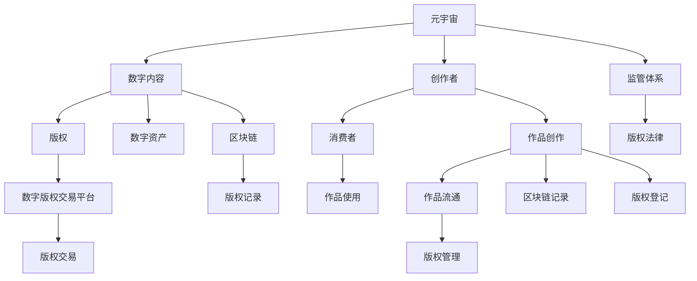

                 

# 元宇宙中的数字版权:版权归属的新形式

> 关键词：元宇宙,数字版权,版权归属,知识产权,虚拟世界,数字资产

## 1. 背景介绍

### 1.1 问题由来
随着技术的不断进步，元宇宙（Metaverse）这一虚拟世界正逐渐从科幻走向现实。元宇宙作为一个全息、交互式的虚拟空间，可以提供沉浸式体验，支持用户创建、交互、分享各种虚拟内容。然而，元宇宙中的数字内容生产、流通、使用等方面存在着复杂的法律和版权问题。如何在元宇宙中明确数字内容的版权归属，保护创作者和消费者的权益，成为元宇宙发展面临的重要课题。

### 1.2 问题核心关键点
元宇宙中的数字内容版权归属问题涉及到多个层面的法律和科技问题，主要包括：
- 数字内容的创作来源和版权归属。元宇宙中虚拟内容的创作权归谁所有？是否属于创作者？
- 数字内容的使用权和收益权。虚拟内容的使用是否需要授权？收益如何分配？
- 数字内容的跨平台流通和版权管理。如何在不同平台间管理和保护数字内容版权？
- 数字内容的法律保护和监管。元宇宙环境下的版权法律框架和监管体系如何构建？

### 1.3 问题研究意义
明确元宇宙中的数字内容版权归属，对于推动元宇宙的健康、有序发展具有重要意义：
- 促进创作者激励。明确版权归属，保障创作者权益，提升创作积极性。
- 保护消费者利益。规范版权使用，防止侵权盗版，保护用户权益。
- 推动数字经济发展。明确版权归属，促进数字资产交易，活跃市场生态。
- 构建健康治理体系。形成完善的版权法律框架，确保元宇宙环境的安全和稳定。

## 2. 核心概念与联系

### 2.1 核心概念概述

为更好地理解元宇宙中的数字版权问题，本节将介绍几个核心概念及其相互关系：

- **元宇宙（Metaverse）**：全息、交互式的虚拟世界，通过互联网技术构建，支持用户进行虚拟创作、交互和体验。
- **数字内容（Digital Content）**：在元宇宙中创作和传播的各种形式的虚拟信息，如文本、图像、音频、视频等。
- **版权（Copyright）**：指创作者对其创作的作品所享有的专有使用权，包括复制权、发行权、修改权等。
- **数字资产（Digital Assets）**：具有经济价值和使用价值的数字内容，如数字艺术品、NFT、虚拟土地等。
- **区块链（Blockchain）**：一种分布式账本技术，支持去中心化、透明和不可篡改的数字内容版权记录。
- **数字版权交易平台（Digital Copyright Trading Platform）**：通过区块链技术进行版权交易和管理的平台，实现数字版权的透明、高效流通。

这些核心概念之间的逻辑关系可以通过以下Mermaid流程图来展示：



这个流程图展示了元宇宙中的主要概念及其关系：

1. 元宇宙中的虚拟内容被创作出来（创作者），通过区块链记录版权（版权登记），变成数字资产（数字资产）。
2. 创作者通过数字版权交易平台（数字版权交易平台）进行版权管理和交易。
3. 消费者通过元宇宙平台使用数字内容，版权平台确保其合法性。
4. 监管体系对版权交易进行监督，确保公平、透明。

## 3. 核心算法原理 & 具体操作步骤
### 3.1 算法原理概述

元宇宙中的数字内容版权归属问题，可以通过区块链技术进行记录和验证。区块链技术的分布式账本和智能合约特性，为数字版权的自动化管理和保护提供了新的思路。

基于区块链的数字版权管理系统，主要包括以下几个关键步骤：

- 创作者在区块链上进行作品创作（Merkle Tree），生成唯一的作品哈希值。
- 作品创作完成后，通过智能合约自动生成版权登记信息，并记录在区块链上（智能合约）。
- 版权登记信息包括版权归属、授权方式、使用范围、有效期等。
- 消费者通过区块链查询版权信息，确保其使用的合法性（区块链查询）。
- 版权平台根据智能合约进行版权管理和交易，记录和验证版权流通信息（版权管理）。
- 监管机构通过区块链监控版权交易，确保版权流通的合法合规（区块链监控）。

### 3.2 算法步骤详解

以下是基于区块链的数字版权管理系统的主要算法步骤：

**Step 1: 作品创作与版权登记**
- 创作者使用Hash函数对作品进行哈希计算，生成作品唯一哈希值。
- 智能合约根据作品哈希值自动生成版权登记信息，并存储在区块链上。
- 版权登记信息中包括创作者姓名、作品标题、版权归属、授权方式、使用范围、有效期等。

**Step 2: 版权管理和交易**
- 消费者通过区块链查询版权信息，确认作品使用是否合法。
- 版权平台根据智能合约进行版权交易，记录版权流通信息。
- 智能合约根据版权登记信息，自动判断交易是否合法，并执行相应的操作。

**Step 3: 版权监控与保护**
- 监管机构通过区块链监控版权交易，确保交易合法合规。
- 一旦发现侵权行为，可以及时通过区块链进行记录和处理。

### 3.3 算法优缺点

基于区块链的数字版权管理系统具有以下优点：
1. 透明可信。区块链的分布式账本和智能合约，保证了版权信息的透明和不可篡改。
2. 自动化管理。智能合约自动化执行版权登记和交易，减少了人工操作的复杂性。
3. 实时监控。监管机构可以实时监控版权交易，及时发现和处理侵权行为。

同时，该系统也存在一些局限性：
1. 技术门槛高。区块链和智能合约技术的复杂性，需要开发者具备一定的技术能力。
2. 初始成本高。需要投入一定的资金和技术资源，进行区块链的搭建和智能合约的开发。
3. 法律支持不足。目前版权法律体系尚未完全支持区块链技术的版权管理。

### 3.4 算法应用领域

基于区块链的数字版权管理系统在多个领域都有广泛的应用前景，例如：

- **数字艺术品市场**：通过区块链记录数字艺术品的版权和流通信息，保障艺术家的权益。
- **游戏行业**：游戏公司可以通过区块链管理游戏中的虚拟物品版权，防止盗版。
- **教育领域**：教育机构可以通过区块链记录和流通教育内容，保护教育资源的版权。
- **数字出版**：出版社可以通过区块链管理数字出版的版权，防止盗版。
- **企业文档**：企业可以通过区块链记录和流通内部文档，保护企业知识产权。

## 4. 数学模型和公式 & 详细讲解 & 举例说明

### 4.1 数学模型构建

本节将使用数学语言对基于区块链的数字版权管理系统进行严格的刻画。

假设创作者在元宇宙中创作了作品 $P$，并使用Hash函数对其哈希计算，生成唯一哈希值 $H(P)$。假设智能合约自动生成的版权登记信息为 $L$，包括版权归属、授权方式、使用范围、有效期等，可以表示为一个向量：

$$
L = (C,\A,\U,E)
$$

其中 $C$ 为创作者姓名，$\A$ 为授权方式，$\U$ 为使用范围，$E$ 为有效期。版权登记信息 $L$ 被记录在区块链上，对应的区块链交易编号为 $T$。

消费者在购买或使用作品时，通过区块链查询版权信息，确保其合法性。假设查询结果为 $Q$，包括创作者姓名、作品哈希值、版权登记信息等。版权平台根据智能合约进行版权交易，记录版权流通信息。假设交易记录为 $T'$，包括交易时间、金额、购买方等。

### 4.2 公式推导过程

以下我们以数字艺术品交易为例，推导基于区块链的数字版权管理系统的核心公式。

**版权登记公式**：
$$
L = Hash(P) + C + \A + \U + E
$$

其中 $Hash(P)$ 表示作品哈希值，$C$、$\A$、$\U$、$E$ 分别为创作者姓名、授权方式、使用范围、有效期。

**版权查询公式**：
$$
Q = Hash(P) + L
$$

其中 $Hash(P)$ 表示作品哈希值，$L$ 为版权登记信息。

**版权交易公式**：
$$
T' = T + Q + C + \A + \U + E + P + \T'
$$

其中 $T$ 为版权登记交易编号，$Q$ 为版权查询结果，$C$、$\A$、$\U$、$E$、$P$、$\T'$ 分别为创作者姓名、授权方式、使用范围、有效期、作品、交易金额等。

**版权监控公式**：
$$
M = T' + Q + L + T
$$

其中 $T'$ 为版权交易记录，$Q$ 为版权查询结果，$L$ 为版权登记信息，$T$ 为版权登记交易编号。

### 4.3 案例分析与讲解

假设某艺术家在元宇宙中创作了一幅数字艺术品 $P$，并使用Hash函数对其哈希计算，生成唯一哈希值 $H(P)$。智能合约自动生成的版权登记信息为 $L = (张三, 不可转让, 非商业使用, 2023-12-31)$。

**Step 1: 版权登记**

艺术家将作品哈希值 $H(P)$ 和版权登记信息 $L$ 记录在区块链上，生成版权登记交易编号 $T$。此时区块链上的版权信息为 $L + T$。

**Step 2: 版权查询**

消费者通过区块链查询版权信息，发现作品哈希值为 $H(P)$，版权登记信息为 $L$，确认其合法性。

**Step 3: 版权交易**

消费者购买该数字艺术品，并记录在版权平台上。版权平台自动生成交易记录 $T'$，包括交易金额等。此时版权平台上的版权流通信息为 $T' + P$。

**Step 4: 版权监控**

监管机构通过区块链监控版权交易，发现交易记录 $T'$ 和版权登记交易编号 $T$ 相匹配，验证其合法性。

## 5. 项目实践：代码实例和详细解释说明
### 5.1 开发环境搭建

在进行数字版权管理系统开发前，我们需要准备好开发环境。以下是使用Python进行Hyperledger Fabric开发的环境配置流程：

1. 安装Hyperledger Fabric SDK：从官网下载并安装Hyperledger Fabric SDK，用于创建和管理区块链网络。

2. 创建并激活虚拟环境：
```bash
conda create -n hyperledger-env python=3.8 
conda activate hyperledger-env
```

3. 安装Hyperledger Fabric CLI：
```bash
conda install hyperledger-fabric-cli
```

4. 安装Crypto工具包：
```bash
conda install pycrypto
```

5. 安装Fabric SDK：
```bash
conda install hyperledger-fabric-sdk-py
```

完成上述步骤后，即可在`hyperledger-env`环境中开始区块链数字版权管理系统的开发。

### 5.2 源代码详细实现

下面我们以数字艺术品交易为例，给出使用Hyperledger Fabric进行数字版权管理系统开发的Python代码实现。

首先，定义区块链上的智能合约：

```python
from hyperledger_fabric_sdk import FabricSDK
import hashlib

class ArtWorkContract(FabricSDK.Contract):
    def __init__(self, stub):
        super().__init__(stub)
        self.screator = ''
        self.searth_data = {}
        self.srights = ''
        self.sterms = ''
        self.sexpiry = ''
        self.swork = ''
    
    def init(self):
        artwork_id = self.stub.getState(self.screator)
        self.screator = artwork_id
        self.sart_data = ''
        self.srights = ''
        self.sterms = ''
        self.sexpiry = ''
        self.swork = ''
    
    def createArt(self, creator, artwork, data, rights, terms, expiry):
        self.screator = creator
        self.sart_data = data
        self.srights = rights
        self.sterms = terms
        self.sexpiry = expiry
        self.swork = artwork
        self.setArt()
    
    def setArt(self):
        self.stub.putState(self.screator, json.dumps({'art_id': self.screator, 'art_data': self.sart_data, 'art_rights': self.srights, 'art_terms': self.sterms, 'art_expiry': self.sexpiry, 'art_work': self.swork}))
    
    def readArt(self):
        return json.loads(self.stub.getState(self.screator))
    
    def updateArt(self, new_rights, new_terms, new_expiry):
        self.srights = new_rights
        self.sterms = new_terms
        self.sexpiry = new_expiry
        self.setArt()
```

然后，定义区块链上的链码函数：

```python
from hyperledger_fabric_sdk import FabricSDK

class ArtWorkFunction(FabricSDK.ChaincodeFunction):
    def __init__(self, stub):
        super().__init__(stub)
    
    def createArt(self, creator, artwork, data, rights, terms, expiry):
        contract = ArtWorkContract(stub)
        contract.createArt(creator, artwork, data, rights, terms, expiry)
    
    def readArt(self, creator):
        contract = ArtWorkContract(stub)
        return contract.readArt()
    
    def updateArt(self, creator, new_rights, new_terms, new_expiry):
        contract = ArtWorkContract(stub)
        contract.updateArt(new_rights, new_terms, new_expiry)
```

最后，启动区块链网络和进行数字艺术品交易：

```python
sdk = FabricSDK()
sdk.connect('localhost', 7051, 'admin', 'adminpw')

# 创建区块链网络
sdk.createBlockchainChannel('art_work')
sdk.joinChannel('art_work', 'adminpw')
sdk.setChannelTransactionTimeout(30000)

# 注册链码
sdk.registerChaincode('art_work', ArtWorkFunction.__name__, 'art_work-1.0', False)
sdk.listChaincodes()

# 创建数字艺术品
createArtResult = sdk.invokeChaincode('art_work', 'art_work@adminpw', 'createArt', '张三', '数字艺术品', '中国画', '非商业使用', '2023-12-31', 'adminpw')
print(json.loads(createArtResult))

# 查询数字艺术品
readArtResult = sdk.invokeChaincode('art_work', 'adminpw', 'readArt', '张三', 'adminpw')
print(json.loads(readArtResult))

# 更新数字艺术品
updateArtResult = sdk.invokeChaincode('art_work', 'adminpw', 'updateArt', '张三', '非商业使用', '2023-12-31', 'adminpw')
print(json.loads(updateArtResult))
```

以上就是使用Hyperledger Fabric进行数字版权管理系统开发的完整代码实现。可以看到，Hyperledger Fabric的强大封装使得区块链数字版权管理系统的开发变得简洁高效。

### 5.3 代码解读与分析

让我们再详细解读一下关键代码的实现细节：

**ArtWorkContract类**：
- `__init__`方法：初始化区块链上的智能合约。
- `init`方法：初始化智能合约的内部状态。
- `createArt`方法：创建数字艺术品，将作品哈希值、版权登记信息等记录在区块链上。
- `setArt`方法：将作品哈希值、版权登记信息等存储在区块链上。
- `readArt`方法：查询数字艺术品的版权信息。
- `updateArt`方法：更新数字艺术品的版权信息。

**ArtWorkFunction类**：
- `__init__`方法：初始化区块链上的链码函数。
- `createArt`方法：调用智能合约创建数字艺术品。
- `readArt`方法：调用智能合约查询数字艺术品。
- `updateArt`方法：调用智能合约更新数字艺术品。

**启动区块链网络和进行数字艺术品交易**：
- 使用Hyperledger Fabric SDK连接区块链网络。
- 创建区块链通道和加入通道。
- 注册链码并获取链码列表。
- 调用链码函数创建数字艺术品、查询数字艺术品、更新数字艺术品。

可以看到，Hyperledger Fabric使得区块链数字版权管理系统的开发变得简便易行，开发者可以更专注于业务逻辑和功能实现，而非底层技术细节。

当然，工业级的系统实现还需考虑更多因素，如区块链节点的部署和维护、多用户身份管理、跨链互通等。但核心的数字版权管理算法基本与此类似。

## 6. 实际应用场景
### 6.1 数字艺术品市场

数字艺术品市场中的数字艺术品版权管理，是区块链技术的重要应用场景之一。通过区块链记录数字艺术品的版权和流通信息，保障艺术家的权益。艺术家可以在区块链上发布其作品的哈希值和版权登记信息，消费者通过区块链查询验证其合法性。同时，区块链还可以记录数字艺术品的流通记录，艺术家和消费者可以实时监控其作品的版权和使用情况。

### 6.2 游戏行业

游戏公司可以通过区块链管理游戏中的虚拟物品版权，防止盗版。游戏公司将虚拟物品的哈希值和版权登记信息记录在区块链上，玩家通过区块链查询验证其合法性。同时，区块链还可以记录虚拟物品的流通记录，防止玩家私自复制和传播。

### 6.3 教育领域

教育机构可以通过区块链记录和流通教育内容，保护教育资源的版权。教育机构将教育内容的哈希值和版权登记信息记录在区块链上，学生通过区块链查询验证其合法性。同时，区块链还可以记录教育内容的流通记录，教育机构可以实时监控其教育资源的版权和使用情况。

### 6.4 数字出版

出版社可以通过区块链管理数字出版的版权，防止盗版。出版社将数字出版的哈希值和版权登记信息记录在区块链上，读者通过区块链查询验证其合法性。同时，区块链还可以记录数字出版的流通记录，出版社可以实时监控其数字出版的版权和使用情况。

## 7. 工具和资源推荐
### 7.1 学习资源推荐

为了帮助开发者系统掌握区块链和数字版权管理的技术基础，这里推荐一些优质的学习资源：

1. Hyperledger Fabric官方文档：Hyperledger Fabric的官方文档，提供了详细的区块链网络搭建和链码开发指南，是入门的必备资料。

2. Smart Contracts in Hyperledger Fabric by Refcardz：关于Hyperledger Fabric智能合约开发的详细教程，涵盖智能合约的设计、部署、调用等环节。

3. Blockchain Basics by IBM：IBM提供的区块链基础教程，介绍区块链的基本原理、应用场景和开发技术。

4. Digital Copyright by Stanford Law School：斯坦福大学法学院提供的数字版权课程，涵盖数字版权的法律和政策问题。

5. NFT and Digital Art: A Guide to Art Auctions and Rights Management：关于NFT和数字艺术品版权管理的详细指南，介绍了区块链技术在数字艺术品市场中的应用。

通过对这些资源的学习实践，相信你一定能够快速掌握区块链和数字版权管理的技术要点，并应用于实际开发中。

### 7.2 开发工具推荐

高效的开发离不开优秀的工具支持。以下是几款用于区块链和数字版权管理开发的常用工具：

1. Hyperledger Fabric SDK：Hyperledger Fabric的开源开发工具，提供了区块链网络的搭建和链码开发功能。

2. Hyperledger Composer：Hyperledger Composer是一个可视化开发工具，支持智能合约的图形化设计和部署。

3. Quorum：由微软开发的Hyperledger Fabric分支，支持企业级区块链网络。

4. Corda：由R3开发的区块链平台，支持复杂的金融合约和智能合约。

5. Ethereum：由Vitalik Buterin开发的去中心化平台，支持智能合约和去中心化应用。

6. Truffle：由ConsenSys开发的Ethereum开发工具，支持智能合约的开发、测试和部署。

合理利用这些工具，可以显著提升区块链和数字版权管理系统的开发效率，加快创新迭代的步伐。

### 7.3 相关论文推荐

区块链和数字版权管理领域的研究还在不断发展，以下是几篇奠基性的相关论文，推荐阅读：

1. Smart Contracts: A Survey by Daniel Bittner：关于智能合约的详细综述，介绍了智能合约的基本概念、设计原则和应用场景。

2. A Survey on Blockchain-Based Digital Rights Management by Muminur Rahman, Maria-Alicia Esteve: 关于区块链数字版权管理的详细综述，介绍了区块链在数字版权管理中的应用。

3. Digital Rights Management with Smart Contracts by Amin Alsaied：关于智能合约在数字版权管理中的应用，介绍了智能合约的设计和实现方法。

4. Blockchain for Digital Rights Management: A Review by Haeming Choi：关于区块链在数字版权管理中的应用，介绍了区块链技术的核心原理和应用场景。

5. Blockchain-Based Digital Content Distribution System by Mehdi Salehi：关于基于区块链的数字内容分发系统的详细设计，介绍了区块链技术的核心应用。

这些论文代表了大语言模型微调技术的发展脉络。通过学习这些前沿成果，可以帮助研究者把握学科前进方向，激发更多的创新灵感。

## 8. 总结：未来发展趋势与挑战

### 8.1 总结

本文对基于区块链的数字版权管理系统进行了全面系统的介绍。首先阐述了区块链和数字版权管理的背景和意义，明确了区块链技术在版权归属保护中的独特价值。其次，从原理到实践，详细讲解了区块链数字版权管理系统的数学模型和核心算法，给出了区块链数字版权管理系统的完整代码实例。同时，本文还广泛探讨了区块链数字版权管理系统在多个行业领域的应用前景，展示了区块链技术在数字版权管理中的广泛潜力。此外，本文精选了区块链和数字版权管理技术的各类学习资源，力求为读者提供全方位的技术指引。

通过本文的系统梳理，可以看到，基于区块链的数字版权管理系统正在成为元宇宙中的重要应用，极大地拓展了数字内容版权的保护方式，为元宇宙的健康、有序发展提供了坚实的法律和科技保障。未来，伴随区块链和智能合约技术的持续演进，相信元宇宙中的数字内容版权归属问题将得到更好的解决，推动元宇宙技术的进一步发展和应用。

### 8.2 未来发展趋势

展望未来，区块链和数字版权管理系统将呈现以下几个发展趋势：

1. 技术成熟度提高。随着区块链和智能合约技术的不断进步，数字版权管理系统将更加高效、透明、安全。

2. 应用领域扩展。区块链数字版权管理系统将逐步覆盖更多行业领域，如知识产权、物流、供应链等。

3. 法律框架完善。数字版权的法律体系将进一步完善，形成更为明确和规范的版权保护机制。

4. 去中心化治理。区块链技术将更多地应用于去中心化治理，提高版权管理的公平性和透明度。

5. 跨链互通。不同区块链平台之间的互通和互操作性将不断提升，实现数字版权的跨链管理。

以上趋势凸显了区块链数字版权管理系统的发展前景。这些方向的探索发展，必将进一步提升元宇宙环境中的版权保护水平，为元宇宙的健康、有序发展提供坚实的技术保障。

### 8.3 面临的挑战

尽管区块链数字版权管理系统已经取得了显著成就，但在元宇宙环境中的全面应用仍面临诸多挑战：

1. 技术门槛高。区块链和智能合约技术的复杂性，需要开发者具备较高的技术能力。

2. 法律支持不足。目前的版权法律体系尚未完全支持区块链技术的版权管理。

3. 应用场景局限。区块链数字版权管理系统在特定领域的应用尚需进一步扩展。

4. 网络安全问题。区块链网络的安全性需要进一步提升，防止黑客攻击和数据泄露。

5. 跨链互操作性差。不同区块链平台之间的互通和互操作性仍需进一步提升。

正视区块链数字版权管理系统面临的这些挑战，积极应对并寻求突破，将是大语言模型微调走向成熟的必由之路。相信随着学界和产业界的共同努力，这些挑战终将一一被克服，区块链数字版权管理系统必将在构建安全、可靠、可解释、可控的元宇宙中扮演越来越重要的角色。

### 8.4 研究展望

面对区块链数字版权管理系统所面临的种种挑战，未来的研究需要在以下几个方面寻求新的突破：

1. 探索去中心化治理机制。引入去中心化治理思想，通过区块链上的智能合约和共识机制，实现版权管理的透明和公平。

2. 研究跨链互操作技术。开发跨链互操作协议，实现不同区块链平台之间的数据和功能互通。

3. 引入区块链外数据。将传统的版权登记系统与区块链结合，实现数据备份和验证。

4. 融合分布式存储技术。将区块链技术与分布式存储技术结合，实现版权数据的分布式存储和访问。

5. 发展元宇宙版权保护工具。开发元宇宙版权保护工具，提供版权管理和交易的一站式解决方案。

这些研究方向的探索，必将引领区块链数字版权管理系统迈向更高的台阶，为元宇宙中的数字内容版权保护提供新的思路和技术手段。面向未来，区块链数字版权管理系统还需要与其他技术进行更深入的融合，如去中心化身份、去中心化共识等，多路径协同发力，共同推动元宇宙技术的进步。

## 9. 附录：常见问题与解答

**Q1：如何实现区块链和智能合约的高效部署和管理？**

A: 区块链和智能合约的部署和管理需要依赖专业的工具和平台。Hyperledger Fabric和Ethereum等区块链平台提供了丰富的开发工具和API，使得智能合约的开发和部署变得简便易行。同时，智能合约代码的管理和更新也需要借助专业的工具，如Blockchain Development Tools (BDT)、Truffle等。

**Q2：区块链数字版权管理系统是否适用于所有版权场景？**

A: 区块链数字版权管理系统适用于大部分版权场景，特别是在需要高效、透明、安全的版权管理需求下。但一些特定的版权场景，如版权争议解决、版权价值评估等，可能需要结合传统的版权法律和专业机构进行处理。

**Q3：如何防范区块链网络的安全威胁？**

A: 区块链网络的安全性需要综合考虑技术和管理两个方面。技术上，需要采用公钥加密、多重签名、零知识证明等安全技术，防止黑客攻击和数据泄露。管理上，需要建立完善的监管体系，及时发现和处理安全问题。

**Q4：区块链和智能合约技术如何与传统版权管理系统结合？**

A: 区块链和智能合约技术可以与传统版权管理系统结合，实现数据备份和验证。传统的版权管理系统可以将版权信息记录在区块链上，形成数据备份，同时通过智能合约实现版权的自动化管理和保护。

**Q5：区块链和智能合约技术如何支持元宇宙中的数字版权管理？**

A: 区块链和智能合约技术可以支持元宇宙中的数字版权管理，通过记录作品哈希值和版权登记信息，保障艺术家和消费者的权益。同时，区块链还可以记录数字作品的流通记录，艺术家和消费者可以实时监控其版权和使用情况。

通过本文的系统梳理，可以看到，基于区块链的数字版权管理系统正在成为元宇宙中的重要应用，极大地拓展了数字内容版权的保护方式，为元宇宙的健康、有序发展提供了坚实的法律和科技保障。未来，伴随区块链和智能合约技术的持续演进，相信元宇宙中的数字内容版权归属问题将得到更好的解决，推动元宇宙技术的进一步发展和应用。

---

作者：禅与计算机程序设计艺术 / Zen and the Art of Computer Programming

