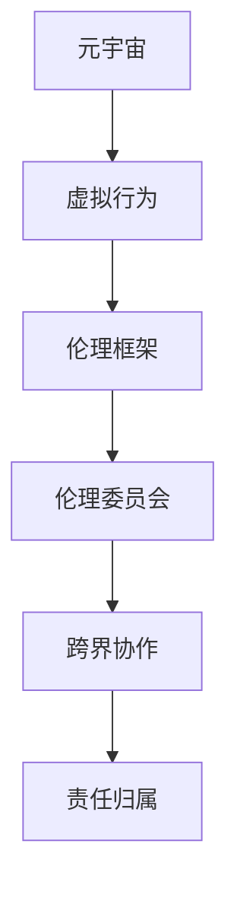

                 

# 元宇宙伦理委员会:虚拟行为的现实影响评估

> 关键词：元宇宙,虚拟行为,现实影响评估,伦理委员会,技术伦理

## 1. 背景介绍

### 1.1 问题由来

随着虚拟现实（VR）、增强现实（AR）、混合现实（MR）等技术的飞速发展，元宇宙的概念逐渐兴起，并在教育、医疗、娱乐、社交等多个领域显现出巨大的应用潜力。元宇宙不仅是虚拟空间的拓展，更是一种全新的社会交往方式，逐渐成为现实世界中人们生活和工作的延伸。然而，这种虚拟现实与物理现实深度融合的新型存在形态，也带来了诸多伦理问题。

**核心问题**：
1. 虚拟行为对现实社会的规范性影响：虚拟环境中的行为是否应该受到现实社会规范的约束？
2. 个人隐私与数据安全：如何在保障用户隐私的同时，确保数据不被滥用？
3. 技术伦理与责任归属：技术开发者和运营者在元宇宙中应负哪些伦理责任？
4. 跨界协作与监管：元宇宙的治理应如何跨越国界、跨行业协作？

### 1.2 问题核心关键点

元宇宙伦理委员会的设立，是为了在虚拟行为对现实世界产生影响时，提供一个多学科、多方利益的共同讨论平台，推动社会各界对元宇宙伦理问题的关注与解决。

**核心目标**：
1. 构建完善的元宇宙伦理框架，为虚拟行为提供伦理指导。
2. 促进不同利益方的沟通与协作，形成统一的社会规范和行业标准。
3. 推动元宇宙技术的良性发展，保障用户权益与社会稳定。

## 2. 核心概念与联系

### 2.1 核心概念概述

为更好地理解元宇宙伦理委员会的工作，本节将介绍几个密切相关的核心概念：

- **元宇宙（Metaverse）**：由《雪崩》作者尼尔·斯蒂芬森提出，是指一个由多个虚拟世界构成的空间，用户可以在其中进行互动、交流和创造。
- **虚拟行为（Virtual Behavior）**：指用户通过虚拟现实设备在元宇宙中进行的各种行为，包括语言交流、动作交互、信息获取等。
- **伦理框架（Ethical Framework）**：一系列伦理原则和规范，用于指导和约束元宇宙中的行为。
- **伦理委员会（Ethics Committee）**：由伦理学家、法学家、社会学家、技术专家组成的组织，负责讨论和制定元宇宙伦理规则。
- **跨界协作（Cross-Border Collaboration）**：不同国家、行业、机构在元宇宙治理中的合作。
- **责任归属（Accountability）**：在虚拟环境中，对行为主体、技术开发者、平台运营者等的责任界定。

这些核心概念之间的逻辑关系可以通过以下Mermaid流程图来展示：



这个流程图展示了大语言模型微调的核心概念及其之间的关系：

1. 元宇宙作为基础环境，用户在其中进行虚拟行为。
2. 虚拟行为需遵守伦理框架的规范。
3. 伦理委员会制定并监督实施伦理框架。
4. 跨界协作确保伦理框架的全球统一。
5. 责任归属明确各方的义务和责任。

## 3. 核心算法原理 & 具体操作步骤

### 3.1 算法原理概述

元宇宙伦理委员会的运作，需要从以下几个算法层面入手：

1. **行为伦理评估算法**：对虚拟行为进行伦理评估，确保行为符合伦理框架。
2. **责任归属算法**：明确不同参与方的责任，制定相应的治理方案。
3. **跨界协作算法**：促进国际、行业间的沟通协作，形成统一规范。
4. **数据保护算法**：保护用户隐私，确保数据安全和合理使用。

### 3.2 算法步骤详解

**Step 1: 行为伦理评估**
- 收集元宇宙中用户的行为数据，包括文本交流、动作交互、位置信息等。
- 使用自然语言处理（NLP）技术对行为进行文本分析，提取关键信息。
- 根据预定义的伦理规则，对行为进行评分，识别潜在的不道德行为。

**Step 2: 责任归属**
- 明确元宇宙中各参与方的责任，如技术开发者、平台运营者、用户等。
- 制定相应的责任归属规则，确保各方在行为出现负面影响时能负起相应责任。
- 建立纠纷解决机制，为发生争议时提供解决方案。

**Step 3: 跨界协作**
- 组织多方利益相关者，如政府机构、行业协会、研究机构等，开展研讨会和圆桌会议。
- 建立标准和共识，形成统一的行为规范和治理框架。
- 设立常设机构，负责跟踪和评估伦理框架的实施效果，确保持续改进。

**Step 4: 数据保护**
- 制定严格的数据保护政策，确保用户隐私和数据安全。
- 建立数据使用规则，明确数据收集、存储、共享等流程。
- 采用先进的技术手段，如加密、匿名化等，防止数据泄露和滥用。

### 3.3 算法优缺点

元宇宙伦理委员会算法具有以下优点：
1. 提供全面的伦理保障，确保虚拟行为符合社会规范。
2. 促进多方协作，形成统一标准，避免伦理分歧。
3. 数据保护严格，保障用户隐私和数据安全。
4. 责任归属明确，有效推动伦理治理。

同时，该算法也存在以下缺点：
1. 伦理规则和标准可能具有地域和文化的差异性。
2. 技术手段存在漏洞，可能被黑客攻击和滥用。
3. 伦理评估和责任归属可能存在主观性。
4. 跨界协作需克服国际法律和政治障碍。

尽管存在这些局限性，但该算法在规范虚拟行为、保障用户权益、推动元宇宙良性发展方面仍具有重要价值。

### 3.4 算法应用领域

元宇宙伦理委员会算法在多个领域具有广泛应用：

- **教育领域**：确保虚拟课堂行为符合伦理规范，保障教学质量和学生隐私。
- **医疗领域**：在虚拟医疗环境中，制定伦理规范，保护患者隐私，确保医疗信息安全。
- **娱乐领域**：制定虚拟游戏的行为规范，防止青少年沉迷，保护未成年人权益。
- **社交领域**：设立虚拟社交平台的行为准则，防止网络霸凌，营造健康交流环境。
- **政府和机构**：建立统一行为规范，保障政府和机构在虚拟环境中的责任和权益。

## 4. 数学模型和公式 & 详细讲解 & 举例说明

### 4.1 数学模型构建

假设用户A在元宇宙中对用户B进行不当行为（如言语辱骂），伦理委员会需要评估该行为是否符合伦理框架。

模型定义：
- 设 $E$ 为伦理评估模型的输出，表示行为是否符合伦理规范。
- 输入为 $(x_i,y_i)$，其中 $x_i$ 为用户A的行为描述，$y_i$ 为行为发生时的情境和背景信息。
- 输出 $E$ 为二元变量，$E=1$ 表示行为符合伦理规范，$E=0$ 表示行为不符合伦理规范。

### 4.2 公式推导过程

设 $f(x_i,y_i)$ 为行为描述和背景信息的综合评分，$g(x_i,y_i)$ 为根据评分 $f$ 判断行为是否符合伦理规范的概率模型。

根据贝叶斯定理，有：

$$
P(E=1|x_i,y_i) = P(x_i,y_i|E=1)P(E=1) / P(x_i,y_i)
$$

其中：

$$
P(x_i,y_i|E=1) = \mathop{\arg\max} f(x_i,y_i)
$$

$$
P(E=1) = \mathop{\arg\max} P(E=1|k)P(k)
$$

$$
P(x_i,y_i) = \sum_k P(x_i,y_i|k)P(k)
$$

$P(x_i,y_i|k)$ 为条件概率，$P(k)$ 为 $k$ 类别的先验概率。

### 4.3 案例分析与讲解

以虚拟医疗为例，设用户A和B分别为医生和患者，A在虚拟医疗环境中对B进行不当行为（如数据泄露），伦理委员会需评估该行为是否符合伦理规范。

1. **行为描述**：用户A的行为为“泄露患者数据”。
2. **情境信息**：行为发生时，A为合法医生，B为合法的患者。

通过综合考虑行为描述和情境信息，计算出行为评分 $f(x_i,y_i)$，并根据评分判断行为是否符合伦理规范。

假设评分模型为线性模型：

$$
f(x_i,y_i) = w_0 + w_1x_i + w_2y_i + \epsilon
$$

其中 $w_0, w_1, w_2$ 为模型参数，$\epsilon$ 为随机误差。

行为符合伦理规范的条件为：

$$
P(E=1|x_i,y_i) \geq \tau
$$

其中 $\tau$ 为伦理委员会设定的阈值。

## 5. 项目实践：代码实例和详细解释说明

### 5.1 开发环境搭建

在进行元宇宙伦理委员会开发前，需要先搭建好开发环境。以下是使用Python进行PyTorch开发的环境配置流程：

1. 安装Anaconda：从官网下载并安装Anaconda，用于创建独立的Python环境。

2. 创建并激活虚拟环境：
```bash
conda create -n ethic-committee python=3.8 
conda activate ethic-committee
```

3. 安装PyTorch：根据CUDA版本，从官网获取对应的安装命令。例如：
```bash
conda install pytorch torchvision torchaudio cudatoolkit=11.1 -c pytorch -c conda-forge
```

4. 安装相关库：
```bash
pip install numpy pandas scikit-learn nltk transformers
```

完成上述步骤后，即可在`ethic-committee`环境中开始开发。

### 5.2 源代码详细实现

以下是一个简单的Python代码示例，展示了如何使用PyTorch进行行为伦理评估。

```python
import torch
import torch.nn as nn
import torch.optim as optim
from sklearn.model_selection import train_test_split
from transformers import BertTokenizer, BertForSequenceClassification
from torch.utils.data import Dataset, DataLoader

# 定义数据集
class EthicDataset(Dataset):
    def __init__(self, texts, labels):
        self.tokenizer = BertTokenizer.from_pretrained('bert-base-uncased')
        self.texts = texts
        self.labels = labels
        
    def __len__(self):
        return len(self.texts)
    
    def __getitem__(self, item):
        text = self.texts[item]
        label = self.labels[item]
        
        encoding = self.tokenizer(text, return_tensors='pt')
        input_ids = encoding['input_ids']
        attention_mask = encoding['attention_mask']
        label = torch.tensor(label, dtype=torch.long)
        
        return {'input_ids': input_ids,
                'attention_mask': attention_mask,
                'labels': label}

# 准备数据集
texts = ["用户A对用户B进行不当行为", "医生在虚拟医疗环境中泄露患者数据"]
labels = [0, 1]
train_texts, test_texts, train_labels, test_labels = train_test_split(texts, labels, test_size=0.2)

# 加载模型
model = BertForSequenceClassification.from_pretrained('bert-base-uncased', num_labels=2)

# 定义优化器和损失函数
optimizer = optim.Adam(model.parameters(), lr=2e-5)
criterion = nn.CrossEntropyLoss()

# 训练模型
model.train()
for epoch in range(10):
    for batch in DataLoader(train_dataset, batch_size=2):
        input_ids = batch['input_ids'].to(device)
        attention_mask = batch['attention_mask'].to(device)
        labels = batch['labels'].to(device)
        optimizer.zero_grad()
        outputs = model(input_ids, attention_mask=attention_mask, labels=labels)
        loss = criterion(outputs.logits, labels)
        loss.backward()
        optimizer.step()

# 测试模型
model.eval()
with torch.no_grad():
    test_loss = 0
    correct = 0
    for batch in DataLoader(test_dataset, batch_size=2):
        input_ids = batch['input_ids'].to(device)
        attention_mask = batch['attention_mask'].to(device)
        labels = batch['labels'].to(device)
        outputs = model(input_ids, attention_mask=attention_mask)
        test_loss += criterion(outputs.logits, labels).item()
        _, predicted = outputs.max(1)
        correct += (predicted == labels).sum().item()
    
    print('Test Loss: %.2f' % (test_loss / len(test_dataset)))
    print('Test Accuracy: %.2f' % (correct / len(test_dataset)))

```

### 5.3 代码解读与分析

**EthicDataset类**：
- `__init__`方法：初始化文本和标签。
- `__len__`方法：返回数据集的样本数量。
- `__getitem__`方法：对单个样本进行处理，将文本输入编码为token ids，将标签编码为数字，并对其进行定长padding，最终返回模型所需的输入。

**行为伦理评估模型**：
- 使用BertForSequenceClassification模型，将输入文本编码为向量表示。
- 设定标签为0表示不符合伦理规范，标签为1表示符合伦理规范。
- 训练模型时，使用交叉熵损失函数和Adam优化器。
- 测试模型时，计算准确率和损失，输出结果。

## 6. 实际应用场景

### 6.1 教育领域

在虚拟课堂中，元宇宙伦理委员会负责制定和监督行为规范，确保学生和教师在虚拟环境中的互动行为符合伦理要求。例如，禁止辱骂、欺凌和性别歧视等行为，保护学生心理健康。同时，对教师的言论进行监控，防止教师在课堂上发布不当内容。

### 6.2 医疗领域

在虚拟医疗环境中，元宇宙伦理委员会制定严格的隐私保护政策和行为规范，确保患者数据不被泄露。例如，限制医生对患者数据的使用，防止数据滥用。同时，对医生的不当行为进行监控，确保医疗服务的质量和道德标准。

### 6.3 娱乐领域

在游戏和虚拟社交平台中，元宇宙伦理委员会制定行为准则，防止青少年沉迷，保护未成年人权益。例如，限制未成年人的游戏时间和消费，防止网络霸凌和不良信息的传播。

## 7. 工具和资源推荐

### 7.1 学习资源推荐

为帮助开发者系统掌握元宇宙伦理委员会的理论基础和实践技巧，这里推荐一些优质的学习资源：

1. 《元宇宙伦理框架与实践》系列博文：由元宇宙伦理委员会专家撰写，深入浅出地介绍了伦理框架构建、虚拟行为评估等内容。

2. CS234《人工智能伦理》课程：斯坦福大学开设的AI伦理课程，涉及伦理框架、责任归属、数据保护等话题，提供理论与实践的深度探讨。

3. 《元宇宙伦理与治理》书籍：系统介绍元宇宙伦理委员会的工作机制和治理框架，涵盖多个伦理案例分析。

4. IEEE《人工智能伦理指南》：由IEEE发布的伦理指南，提供人工智能技术的伦理规范和应用建议。

5. 元宇宙伦理委员会官方文档：元宇宙伦理委员会的详细规范和实施指南，提供标准化的伦理评估和责任归属流程。

通过对这些资源的学习实践，相信你一定能够快速掌握元宇宙伦理委员会的精髓，并用于解决实际的伦理问题。

### 7.2 开发工具推荐

高效的开发离不开优秀的工具支持。以下是几款用于元宇宙伦理委员会开发的常用工具：

1. PyTorch：基于Python的开源深度学习框架，灵活动态的计算图，适合快速迭代研究。

2. TensorFlow：由Google主导开发的开源深度学习框架，生产部署方便，适合大规模工程应用。

3. Transformers库：HuggingFace开发的NLP工具库，集成了众多SOTA语言模型，支持PyTorch和TensorFlow，是进行伦理评估任务的开发利器。

4. Weights & Biases：模型训练的实验跟踪工具，可以记录和可视化模型训练过程中的各项指标，方便对比和调优。

5. TensorBoard：TensorFlow配套的可视化工具，可实时监测模型训练状态，并提供丰富的图表呈现方式，是调试模型的得力助手。

6. Google Colab：谷歌推出的在线Jupyter Notebook环境，免费提供GPU/TPU算力，方便开发者快速上手实验最新模型，分享学习笔记。

合理利用这些工具，可以显著提升元宇宙伦理委员会任务的开发效率，加快创新迭代的步伐。

### 7.3 相关论文推荐

元宇宙伦理委员会的研究源于学界的持续研究。以下是几篇奠基性的相关论文，推荐阅读：

1. 《元宇宙伦理框架与实践》：提出元宇宙伦理委员会的概念和运作机制，构建伦理评估模型。

2. 《虚拟行为与现实影响评估》：分析虚拟行为对现实社会的影响，提出伦理评估框架。

3. 《跨界协作中的伦理治理》：讨论国际和行业间的伦理规范和协作机制，提出跨界治理方案。

4. 《数据保护与隐私伦理》：研究数据保护技术在元宇宙中的应用，提出隐私保护策略。

5. 《元宇宙伦理委员会的制度设计》：设计元宇宙伦理委员会的组织结构和运行机制，提供具体的实施流程。

这些论文代表了大语言模型微调技术的发展脉络。通过学习这些前沿成果，可以帮助研究者把握学科前进方向，激发更多的创新灵感。

## 8. 总结：未来发展趋势与挑战

### 8.1 总结

本文对元宇宙伦理委员会进行了全面系统的介绍。首先阐述了元宇宙伦理委员会设立的背景和目标，明确了其在大语言模型微调中的重要地位。其次，从原理到实践，详细讲解了元宇宙伦理委员会的运作过程，包括行为伦理评估、责任归属、跨界协作和数据保护等方面。最后，本文还探讨了元宇宙伦理委员会的未来发展趋势和面临的挑战。

通过本文的系统梳理，可以看到，元宇宙伦理委员会在规范虚拟行为、保障用户权益、推动元宇宙良性发展方面具有重要作用。尽管存在一些局限性和挑战，但该委员会在促进社会治理和科技伦理方面的价值不容忽视。

### 8.2 未来发展趋势

展望未来，元宇宙伦理委员会将呈现以下几个发展趋势：

1. **伦理框架的全球统一**：随着元宇宙的全球化发展，伦理规范和标准的统一将成为必然。元宇宙伦理委员会将致力于构建统一的伦理框架，保障不同国家和地区、行业的规范一致。

2. **技术的持续创新**：随着技术的进步，元宇宙伦理委员会将不断引入新的技术手段，提升伦理评估的准确性和效率。例如，使用深度学习和人工智能技术，提高伦理判断的自动化水平。

3. **跨界协作的深化**：不同国家和行业间的伦理规范和协作机制将更加深入。元宇宙伦理委员会将推动多方协作，形成统一的伦理标准和治理方案。

4. **伦理教育的普及**：元宇宙伦理委员会将推动伦理教育的普及，提高公众的伦理意识，促进虚拟环境中的文明行为。

5. **伦理治理的智能化**：通过引入AI技术，提升伦理治理的智能化水平，实现伦理评估和责任归属的自动化。

以上趋势凸显了元宇宙伦理委员会的广阔前景。这些方向的探索发展，必将进一步提升元宇宙系统的性能和应用范围，为人类认知智能的进化带来深远影响。

### 8.3 面临的挑战

尽管元宇宙伦理委员会在规范虚拟行为、保障用户权益方面发挥了重要作用，但在迈向更加智能化、普适化应用的过程中，仍面临诸多挑战：

1. **伦理规范的地域和文化差异**：不同国家和文化背景下的伦理标准可能存在差异，如何统一规范成为一大难题。

2. **技术手段的漏洞**：伦理评估和责任归属的技术手段可能存在漏洞，被黑客攻击和滥用。

3. **伦理判断的主观性**：伦理评估可能存在主观性，不同伦理委员会成员的判断结果可能不一致。

4. **跨界协作的复杂性**：不同国家和行业的伦理规范和协作机制可能存在冲突，需要多方协调。

5. **用户隐私的保障**：虚拟环境中的隐私保护问题复杂，如何平衡隐私保护和数据使用成为一大难题。

正视元宇宙伦理委员会面临的这些挑战，积极应对并寻求突破，将是其健康发展的重要保障。

### 8.4 研究展望

面向未来，元宇宙伦理委员会的研究需要在以下几个方面寻求新的突破：

1. **伦理规范的统一**：加强国际和行业间的伦理规范研究，构建统一的伦理框架。

2. **技术手段的创新**：引入新的技术手段，提升伦理评估和责任归属的自动化水平。

3. **跨界协作的深化**：推动多方协作，形成统一的伦理标准和治理方案。

4. **伦理教育的普及**：推动伦理教育的普及，提高公众的伦理意识。

5. **伦理治理的智能化**：通过引入AI技术，提升伦理治理的智能化水平。

6. **隐私保护的研究**：研究虚拟环境中的隐私保护技术，保障用户数据安全。

这些研究方向的探索，必将引领元宇宙伦理委员会技术迈向更高的台阶，为构建安全、可靠、可解释、可控的智能系统铺平道路。面向未来，元宇宙伦理委员会还需要与其他人工智能技术进行更深入的融合，如知识表示、因果推理、强化学习等，多路径协同发力，共同推动自然语言理解和智能交互系统的进步。

总之，元宇宙伦理委员会需要在规范虚拟行为、保障用户权益、推动元宇宙良性发展方面不断创新，才能真正实现人工智能技术在垂直行业的规模化落地。只有勇于创新、敢于突破，才能不断拓展语言模型的边界，让智能技术更好地造福人类社会。

## 9. 附录：常见问题与解答

**Q1：元宇宙伦理委员会如何制定统一的伦理框架？**

A: 元宇宙伦理委员会通过多方利益相关者参与，制定统一的伦理规范和标准。具体步骤包括：

1. 收集各方意见和建议，建立协商机制。
2. 综合考虑不同国家和行业的伦理规范，形成统一的伦理框架。
3. 通过试点项目验证伦理框架的有效性，不断优化调整。

**Q2：元宇宙伦理委员会如何评估虚拟行为是否符合伦理规范？**

A: 元宇宙伦理委员会使用自然语言处理（NLP）技术，对虚拟行为进行伦理评估。具体步骤包括：

1. 收集行为数据，提取关键信息。
2. 使用NLP技术对行为进行文本分析，提取关键词和情感倾向。
3. 根据预设的伦理规范，计算行为评分，判断行为是否符合伦理规范。

**Q3：元宇宙伦理委员会如何确定责任归属？**

A: 元宇宙伦理委员会通过多方协作，明确各方的责任和义务。具体步骤包括：

1. 确定技术开发者、平台运营者、用户等各方的角色和职责。
2. 制定责任归属规则，确保各方在行为出现负面影响时能负起相应责任。
3. 建立纠纷解决机制，为发生争议时提供解决方案。

**Q4：元宇宙伦理委员会如何保护用户隐私？**

A: 元宇宙伦理委员会制定严格的数据保护政策，确保用户隐私和数据安全。具体措施包括：

1. 使用加密技术，防止数据泄露和滥用。
2. 设计隐私保护模型，限制数据的收集和使用。
3. 建立数据使用规则，明确数据收集、存储、共享等流程。

这些措施将帮助元宇宙伦理委员会在虚拟环境中保障用户隐私和数据安全。

---

作者：禅与计算机程序设计艺术 / Zen and the Art of Computer Programming

