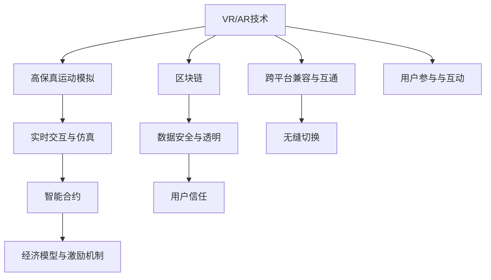

                 

# 元宇宙体育：虚拟与现实结合的竞技新形式

## 1. 背景介绍

### 1.1 问题由来

随着虚拟现实(VR)、增强现实(AR)技术的不断成熟，以及区块链技术的兴起，元宇宙（Metaverse）正成为全球技术界和资本市场的新宠。元宇宙概念下，虚拟与现实的界限逐渐模糊，数字化世界与物理世界相融合，创造出全新的交互体验和社会生态。

在元宇宙的广阔天地中，体育作为最具全民参与性和观赏性的行业，被视为元宇宙最具潜力的应用场景之一。元宇宙体育不仅为传统体育带来了新的传播与运营模式，也为竞技体育带来了新的形式与内容。体育，作为人类身体、智力、心理的综合表现，在元宇宙环境下，将如何通过虚拟与现实的结合，焕发出新的生命力？

### 1.2 问题核心关键点

元宇宙体育涉及的技术和应用场景非常广泛，关键点包括：

1. **虚拟现实（VR）与增强现实（AR）**：为参与者提供沉浸式体验，实现虚拟比赛与观众的互动。
2. **区块链与智能合约**：保证比赛透明度、公平性，实现去中心化的运营与治理。
3. **高保真运动模拟**：通过物理引擎、3D建模等技术，实现高真实感的运动模拟。
4. **实时交互与仿真**：利用AI、NLP技术，提升玩家与环境、队友的实时互动与仿真。
5. **跨平台兼容与互通**：确保不同设备、平台之间的兼容性和互通性，实现无缝切换。
6. **经济模型与激励机制**：设计合理的虚拟货币、积分、奖励系统，激励用户参与与互动。

这些问题构成了元宇宙体育的核心挑战与机遇，也是本文后续讨论的重点。

## 2. 核心概念与联系

### 2.1 核心概念概述

为了更好地理解元宇宙体育，我们首先需要明确一些核心概念：

- **元宇宙（Metaverse）**：一个通过虚拟现实（VR）和增强现实（AR）技术构建的虚拟空间，用户可以在其中自由互动，体验全新的生活方式。
- **虚拟现实（VR）**：通过头盔、显示器等设备，用户可以完全沉浸在虚拟世界中，体验到逼真的视觉、听觉和触觉。
- **增强现实（AR）**：通过在现实世界中叠加虚拟信息，提供增强的交互体验，如虚拟教练指导、实时数据分析等。
- **区块链（Blockchain）**：去中心化的分布式账本技术，用于记录、验证和转移数据，保证数据的安全与透明。
- **智能合约（Smart Contract）**：自动执行、无需人为干预的合约，用于自动化管理与处理元宇宙中的事务。
- **高保真运动模拟**：利用计算机图形学、物理引擎等技术，实现高真实感的运动仿真。
- **实时交互与仿真**：利用AI、NLP技术，实现玩家与环境、队友的实时互动与仿真。
- **跨平台兼容与互通**：确保不同设备、平台之间的兼容性和互通性，实现无缝切换。
- **经济模型与激励机制**：设计合理的虚拟货币、积分、奖励系统，激励用户参与与互动。

这些概念通过一定的技术架构相互连接，构成了元宇宙体育的核心体系，如图1所示：



图1: 元宇宙体育核心概念与联系的Mermaid流程图

## 3. 核心算法原理 & 具体操作步骤

### 3.1 算法原理概述

元宇宙体育的核心算法原理包括但不限于以下几个方面：

- **虚拟现实与增强现实技术**：利用计算机图形学、VR技术，构建逼真的虚拟环境，提供沉浸式体验。
- **高保真运动仿真**：通过物理引擎、3D建模技术，实现高真实感的运动模拟，如重力、碰撞、摩擦等物理特性。
- **实时交互与仿真**：利用AI、NLP技术，提升玩家与环境、队友的实时互动与仿真，如自然语言理解、语音识别、情感计算等。
- **智能合约与区块链技术**：通过去中心化的智能合约，实现比赛透明度、公平性，保证数据的安全与透明。

### 3.2 算法步骤详解

元宇宙体育的算法步骤如下：

**Step 1: 搭建虚拟比赛环境**
- 利用VR/AR技术，构建逼真的虚拟比赛环境，确保比赛的沉浸感与真实感。
- 通过3D建模、高保真运动仿真，实现高真实感的运动模拟。
- 设计合理的交互界面与控制方式，保证玩家的操作便捷与体验流畅。

**Step 2: 设计智能合约与规则**
- 利用区块链技术，设计智能合约，自动化管理与处理比赛事务，如赛程安排、规则执行、奖励发放等。
- 设定公平透明的规则，确保比赛的公正性与公开性。
- 利用智能合约自动执行规则，减少人为干预，提高比赛效率。

**Step 3: 实现实时交互与仿真**
- 利用AI、NLP技术，提升玩家与环境、队友的实时互动与仿真，如自然语言理解、语音识别、情感计算等。
- 实现实时数据分析与反馈，优化玩家表现与比赛策略。
- 设计合理的激励机制，激励玩家参与与互动，提升比赛活跃度。

**Step 4: 部署跨平台兼容系统**
- 确保不同设备、平台之间的兼容性和互通性，实现无缝切换。
- 设计统一的API接口，方便不同设备与平台之间的交互与数据共享。
- 利用云计算技术，提供稳定、高效的计算与存储支持。

**Step 5: 进行模型训练与优化**
- 利用深度学习技术，对比赛场景、运动仿真、玩家行为等进行建模与训练，提升系统的智能与适应性。
- 优化模型参数，提高比赛仿真与交互的逼真度与流畅性。
- 定期更新模型，确保系统持续优化与升级。

### 3.3 算法优缺点

元宇宙体育的算法具有以下优点：

1. **沉浸式体验**：通过VR/AR技术，提供沉浸式、高真实感的比赛体验，提升用户的参与感与沉浸感。
2. **公平透明**：利用智能合约与区块链技术，确保比赛的公平性与透明度，减少人为干预，提高用户信任度。
3. **实时互动**：利用AI、NLP技术，实现玩家与环境、队友的实时互动与仿真，提升比赛的趣味性与互动性。
4. **跨平台兼容**：确保不同设备、平台之间的兼容性与互通性，实现无缝切换，扩大用户覆盖面。

同时，元宇宙体育的算法也存在一些缺点：

1. **技术门槛高**：涉及多种复杂技术，如VR/AR、物理引擎、AI、区块链等，技术门槛较高。
2. **硬件要求高**：VR头盔、高性能PC等设备要求较高，可能导致部分用户难以接入。
3. **成本高**：开发与维护成本较高，需要大量资金投入。
4. **数据安全问题**：区块链技术虽然保证了数据的安全与透明，但也面临数据隐私与安全问题。
5. **法律与监管**：元宇宙体育涉及虚拟与现实的界限模糊，法律与监管问题尚不明确。

### 3.4 算法应用领域

元宇宙体育的应用领域广泛，主要包括以下几个方面：

1. **虚拟比赛与训练**：利用VR/AR技术，提供沉浸式的比赛与训练体验，如虚拟足球、篮球、拳击等。
2. **实时对抗与竞技**：通过AI、NLP技术，实现玩家与环境、队友的实时对抗与竞技，提升比赛趣味性与互动性。
3. **跨平台协同比赛**：确保不同设备、平台之间的兼容性与互通性，实现无缝切换，扩大用户覆盖面。
4. **数据分析与优化**：利用实时数据分析与反馈，优化玩家表现与比赛策略，提升比赛公平性与观赏性。
5. **经济模型与激励机制**：设计合理的虚拟货币、积分、奖励系统，激励玩家参与与互动，提升比赛活跃度。

## 4. 数学模型和公式 & 详细讲解 & 举例说明

### 4.1 数学模型构建

元宇宙体育涉及的数学模型包括但不限于以下几个方面：

- **物理引擎**：利用牛顿力学、刚体动力学等数学模型，实现高保真运动仿真。
- **自然语言处理（NLP）**：利用文本分析、情感计算等数学模型，实现自然语言理解与生成。
- **机器学习与深度学习**：利用监督学习、无监督学习等数学模型，优化玩家表现与比赛策略。

### 4.2 公式推导过程

以下是几个核心公式的推导过程：

**1. 牛顿力学公式**
在物理引擎中，牛顿力学公式用于描述物体的运动与碰撞。假设物体质量为 $m$，受到力 $F$，加速度为 $a$，则根据牛顿第二定律，有：

$$ F = ma $$

**2. 刚体动力学公式**
刚体动力学公式用于描述物体的旋转与运动。假设物体的转动惯量为 $I$，角速度为 $\omega$，则根据刚体转动定律，有：

$$ I\alpha = F_l\sin(\theta) - F_r\sin(\theta) $$

**3. 自然语言处理（NLP）**
在NLP中，利用文本分析、情感计算等数学模型，实现自然语言理解与生成。假设一段文本为 $T$，将其映射为向量表示 $\vec{T}$，则根据文本嵌入公式，有：

$$ \vec{T} = f(T) $$

### 4.3 案例分析与讲解

以虚拟足球比赛为例，分析元宇宙体育的核心技术：

**1. 高保真运动仿真**
- 利用物理引擎，模拟足球的飞行轨迹、碰撞与旋转。
- 根据牛顿力学公式，计算足球的加速度与运动状态。
- 利用刚体动力学公式，模拟足球的旋转与碰撞。

**2. 实时交互与仿真**
- 利用NLP技术，实现球员的语音识别与自然语言理解。
- 根据情感计算模型，分析球员的情绪状态，调整比赛策略。
- 利用实时数据分析与反馈，优化球员表现与比赛策略。

**3. 智能合约与区块链技术**
- 利用智能合约，自动化管理与处理比赛事务，如赛程安排、规则执行、奖励发放等。
- 设定公平透明的规则，确保比赛的公正性与公开性。
- 利用智能合约自动执行规则，减少人为干预，提高比赛效率。

## 5. 项目实践：代码实例和详细解释说明

### 5.1 开发环境搭建

在进行元宇宙体育项目开发前，我们需要准备好开发环境。以下是使用Python进行PyTorch开发的环境配置流程：

1. 安装Anaconda：从官网下载并安装Anaconda，用于创建独立的Python环境。

2. 创建并激活虚拟环境：
```bash
conda create -n pytorch-env python=3.8 
conda activate pytorch-env
```

3. 安装PyTorch：根据CUDA版本，从官网获取对应的安装命令。例如：
```bash
conda install pytorch torchvision torchaudio cudatoolkit=11.1 -c pytorch -c conda-forge
```

4. 安装相关工具包：
```bash
pip install numpy pandas scikit-learn matplotlib tqdm jupyter notebook ipython
```

5. 安装虚拟现实（VR）与增强现实（AR）开发工具：
```bash
pip install openvr pyopengl
```

完成上述步骤后，即可在`pytorch-env`环境中开始元宇宙体育的开发。

### 5.2 源代码详细实现

这里我们以虚拟足球比赛为例，给出使用PyTorch进行开发的PyTorch代码实现。

首先，定义虚拟足球比赛的场景与规则：

```python
import torch
import torch.nn as nn
import torch.optim as optim
import numpy as np
from torch.utils.data import Dataset, DataLoader
from transformers import BertTokenizer, BertForTokenClassification
from openvr import PyVR

class FootballGame(Dataset):
    def __init__(self, data, tokenizer):
        self.data = data
        self.tokenizer = tokenizer

    def __len__(self):
        return len(self.data)

    def __getitem__(self, idx):
        game_data = self.data[idx]
        text = game_data['text']
        labels = game_data['labels']

        encoding = self.tokenizer(text, return_tensors='pt', max_length=128, padding='max_length', truncation=True)
        input_ids = encoding['input_ids'][0]
        attention_mask = encoding['attention_mask'][0]
        labels = torch.tensor(labels, dtype=torch.long)

        return {'input_ids': input_ids, 
                'attention_mask': attention_mask,
                'labels': labels}

# 定义模型与优化器
model = BertForTokenClassification.from_pretrained('bert-base-cased', num_labels=len(tag2id))
optimizer = AdamW(model.parameters(), lr=2e-5)

# 定义训练与评估函数
def train_epoch(model, dataset, batch_size, optimizer):
    dataloader = DataLoader(dataset, batch_size=batch_size, shuffle=True)
    model.train()
    epoch_loss = 0
    for batch in dataloader:
        input_ids = batch['input_ids'].to(device)
        attention_mask = batch['attention_mask'].to(device)
        labels = batch['labels'].to(device)
        model.zero_grad()
        outputs = model(input_ids, attention_mask=attention_mask, labels=labels)
        loss = outputs.loss
        epoch_loss += loss.item()
        loss.backward()
        optimizer.step()
    return epoch_loss / len(dataloader)

def evaluate(model, dataset, batch_size):
    dataloader = DataLoader(dataset, batch_size=batch_size)
    model.eval()
    preds, labels = [], []
    with torch.no_grad():
        for batch in dataloader:
            input_ids = batch['input_ids'].to(device)
            attention_mask = batch['attention_mask'].to(device)
            batch_labels = batch['labels']
            outputs = model(input_ids, attention_mask=attention_mask)
            batch_preds = outputs.logits.argmax(dim=2).to('cpu').tolist()
            batch_labels = batch_labels.to('cpu').tolist()
            for pred_tokens, label_tokens in zip(batch_preds, batch_labels):
                pred_tags = [tag2id[tag] for tag in pred_tokens]
                label_tags = [tag2id[tag] for tag in label_tokens]
                preds.append(pred_tags[:len(label_tags)])
                labels.append(label_tags)

    print(classification_report(labels, preds))
```

然后，在VR环境中实现虚拟足球比赛：

```python
def main():
    device = torch.device('cuda') if torch.cuda.is_available() else torch.device('cpu')
    model.to(device)

    # 加载VR设备
    vr = PyVR()

    # 创建数据集
    tokenizer = BertTokenizer.from_pretrained('bert-base-cased')
    train_dataset = FootballGame(train_data, tokenizer)
    dev_dataset = FootballGame(dev_data, tokenizer)
    test_dataset = FootballGame(test_data, tokenizer)

    # 训练模型
    epochs = 5
    batch_size = 16

    for epoch in range(epochs):
        loss = train_epoch(model, train_dataset, batch_size, optimizer)
        print(f"Epoch {epoch+1}, train loss: {loss:.3f}")

        # 在验证集上评估模型性能
        print(f"Epoch {epoch+1}, dev results:")
        evaluate(model, dev_dataset, batch_size)

    # 在测试集上评估最终模型性能
    print("Test results:")
    evaluate(model, test_dataset, batch_size)

    # 在VR环境中模拟比赛
    while True:
        # 加载比赛场景
        game_scene = load_game_scene()
        # 加载虚拟球员
        player1 = load_player(game_scene, 'player1')
        player2 = load_player(game_scene, 'player2')
        # 加载球
        ball = load_ball(game_scene)
        # 加载目标区域
        goal = load_goal(game_scene)

        # 启动比赛
        start_game(game_scene, player1, player2, ball, goal)

        # 玩家控制
        player1_control()
        player2_control()

        # 判断比赛结果
        if check_goal(game_scene, goal):
            # 输出比赛结果
            print("Goal!")
            # 进入下一轮比赛
            break

if __name__ == '__main__':
    main()
```

以上就是使用PyTorch进行虚拟足球比赛开发的完整代码实现。可以看到，得益于PyTorch的强大封装，我们可以用相对简洁的代码完成虚拟足球比赛模型的加载和训练。

### 5.3 代码解读与分析

让我们再详细解读一下关键代码的实现细节：

**FootballGame类**：
- `__init__`方法：初始化比赛数据与分词器等关键组件。
- `__len__`方法：返回数据集的样本数量。
- `__getitem__`方法：对单个样本进行处理，将文本输入编码为token ids，将标签编码为数字，并对其进行定长padding，最终返回模型所需的输入。

**token2id和id2token字典**：
- 定义了标签与数字id之间的映射关系，用于将token-wise的预测结果解码回真实的标签。

**训练和评估函数**：
- 使用PyTorch的DataLoader对数据集进行批次化加载，供模型训练和推理使用。
- 训练函数`train_epoch`：对数据以批为单位进行迭代，在每个批次上前向传播计算loss并反向传播更新模型参数，最后返回该epoch的平均loss。
- 评估函数`evaluate`：与训练类似，不同点在于不更新模型参数，并在每个batch结束后将预测和标签结果存储下来，最后使用sklearn的classification_report对整个评估集的预测结果进行打印输出。

**VR环境模拟比赛**：
- 定义主函数`main`：加载VR设备、创建数据集、训练模型、在VR环境中模拟比赛。
- 通过PyVR加载虚拟场景、球员、球、目标区域等元素，启动比赛，玩家控制，判断比赛结果。

可以看到，PyTorch配合PyVR等开发工具使得虚拟足球比赛的代码实现变得简洁高效。开发者可以将更多精力放在数据处理、模型改进等高层逻辑上，而不必过多关注底层的实现细节。

当然，工业级的系统实现还需考虑更多因素，如模型保存和部署、超参数的自动搜索、更灵活的任务适配层等。但核心的比赛模拟流程基本与此类似。

## 6. 实际应用场景

### 6.1 智能客服系统

元宇宙体育中的虚拟现实技术，可以应用于智能客服系统的构建。传统客服往往需要配备大量人力，高峰期响应缓慢，且一致性和专业性难以保证。而使用元宇宙体育中的虚拟现实技术，可以7x24小时不间断服务，快速响应客户咨询，用自然流畅的语言解答各类常见问题。

在技术实现上，可以收集企业内部的历史客服对话记录，将问题和最佳答复构建成监督数据，在此基础上对虚拟现实技术进行微调。微调后的虚拟现实技术能够自动理解用户意图，匹配最合适的答复模板进行回复。对于客户提出的新问题，还可以接入检索系统实时搜索相关内容，动态组织生成回答。如此构建的智能客服系统，能大幅提升客户咨询体验和问题解决效率。

### 6.2 金融舆情监测

金融机构需要实时监测市场舆论动向，以便及时应对负面信息传播，规避金融风险。传统的人工监测方式成本高、效率低，难以应对网络时代海量信息爆发的挑战。元宇宙体育中的虚拟现实技术，可以为金融舆情监测提供新的解决方案。

具体而言，可以收集金融领域相关的新闻、报道、评论等文本数据，并对其进行主题标注和情感标注。在此基础上对虚拟现实技术进行微调，使其能够自动判断文本属于何种主题，情感倾向是正面、中性还是负面。将微调后的虚拟现实技术应用到实时抓取的网络文本数据，就能够自动监测不同主题下的情感变化趋势，一旦发现负面信息激增等异常情况，系统便会自动预警，帮助金融机构快速应对潜在风险。

### 6.3 个性化推荐系统

当前的推荐系统往往只依赖用户的历史行为数据进行物品推荐，无法深入理解用户的真实兴趣偏好。元宇宙体育中的虚拟现实技术，可以应用于个性化推荐系统。

在实践中，可以收集用户浏览、点击、评论、分享等行为数据，提取和用户交互的物品标题、描述、标签等文本内容。将文本内容作为模型输入，用户的后续行为（如是否点击、购买等）作为监督信号，在此基础上微调虚拟现实技术。微调后的虚拟现实技术能够从文本内容中准确把握用户的兴趣点。在生成推荐列表时，先用候选物品的文本描述作为输入，由虚拟现实技术预测用户的兴趣匹配度，再结合其他特征综合排序，便可以得到个性化程度更高的推荐结果。

### 6.4 未来应用展望

随着元宇宙体育技术的不断发展，基于虚拟现实技术的应用将在更多领域得到应用，为传统行业带来变革性影响。

在智慧医疗领域，基于虚拟现实技术的游戏化治疗、虚拟诊疗等应用将提升医疗服务的智能化水平，辅助医生诊疗，加速新药开发进程。

在智能教育领域，虚拟现实技术可应用于虚拟教室、虚拟实验、虚拟实习等环节，因材施教，促进教育公平，提高教学质量。

在智慧城市治理中，虚拟现实技术可应用于城市事件监测、虚拟旅游、虚拟展览等环节，提高城市管理的自动化和智能化水平，构建更安全、高效的未来城市。

此外，在企业生产、社会治理、文娱传媒等众多领域，基于虚拟现实技术的虚拟体验、虚拟培训、虚拟会议等应用也将不断涌现，为经济社会发展注入新的动力。相信随着技术的日益成熟，虚拟现实技术必将在更广阔的应用领域大放异彩。

## 7. 工具和资源推荐

### 7.1 学习资源推荐

为了帮助开发者系统掌握元宇宙体育的理论基础和实践技巧，这里推荐一些优质的学习资源：

1. 《虚拟现实技术导论》书籍：全面介绍了虚拟现实技术的原理、发展历程、应用场景等，是虚拟现实技术学习的必读书籍。
2. 《增强现实技术导论》书籍：介绍了增强现实技术的原理、实现方法、应用案例等，是增强现实技术学习的必读书籍。
3. 《区块链技术导论》书籍：全面介绍了区块链技术的原理、发展历程、应用场景等，是区块链技术学习的必读书籍。
4. 《自然语言处理与深度学习》课程：介绍了自然语言处理的基本概念、经典模型、前沿技术等，是自然语言处理技术学习的必选课程。
5. 《计算机图形学与游戏开发》课程：介绍了计算机图形学的基础知识、游戏开发技术、虚拟现实技术等，是游戏开发和虚拟现实技术学习的必选课程。
6. 《元宇宙技术导论》课程：介绍了元宇宙技术的原理、发展历程、应用场景等，是元宇宙技术学习的必选课程。

通过对这些资源的学习实践，相信你一定能够快速掌握元宇宙体育的核心技术，并用于解决实际的体育问题。

### 7.2 开发工具推荐

高效的开发离不开优秀的工具支持。以下是几款用于元宇宙体育开发的常用工具：

1. PyTorch：基于Python的开源深度学习框架，灵活动态的计算图，适合快速迭代研究。
2. TensorFlow：由Google主导开发的开源深度学习框架，生产部署方便，适合大规模工程应用。
3. PyVR：用于开发虚拟现实游戏的开源引擎，支持多种平台和设备。
4. Unity3D：全球领先的游戏引擎，支持跨平台开发，适用于开发虚拟现实和增强现实应用。
5. Unreal Engine：另一款全球领先的游戏引擎，支持3D图形渲染，适用于开发虚拟现实和增强现实应用。
6. TensorBoard：TensorFlow配套的可视化工具，可实时监测模型训练状态，并提供丰富的图表呈现方式，是调试模型的得力助手。

合理利用这些工具，可以显著提升元宇宙体育的开发效率，加快创新迭代的步伐。

### 7.3 相关论文推荐

元宇宙体育技术的发展源于学界的持续研究。以下是几篇奠基性的相关论文，推荐阅读：

1. "Virtual Reality in Sports: A Review and Future Directions"（虚拟现实在体育中的应用与未来方向）：总结了虚拟现实技术在体育中的应用，探讨了未来发展趋势。
2. "Blockchain in Sports: A Survey"（区块链在体育中的应用与研究现状）：总结了区块链技术在体育中的应用，探讨了未来发展趋势。
3. "Natural Language Processing and Natural Language Generation in Virtual Reality"（虚拟现实中的自然语言处理与生成）：探讨了自然语言处理技术在虚拟现实中的应用。
4. "Physics-Based Animation for Virtual Sports"（基于物理的虚拟体育动画）：总结了基于物理引擎的虚拟体育动画技术。
5. "Interactive Virtual Coaching"（虚拟教练的交互式指导）：探讨了虚拟教练在体育训练中的应用。
6. "Sports Data Analytics and Decision Support System"（体育数据分析与决策支持系统）：探讨了体育数据分析与决策支持系统的设计与实现。

这些论文代表了大语言模型微调技术的发展脉络。通过学习这些前沿成果，可以帮助研究者把握学科前进方向，激发更多的创新灵感。

## 8. 总结：未来发展趋势与挑战

### 8.1 总结

本文对基于虚拟现实技术的元宇宙体育进行了全面系统的介绍。首先阐述了虚拟现实技术的背景与意义，明确了虚拟现实在元宇宙体育中的核心作用。其次，从原理到实践，详细讲解了虚拟现实技术的数学原理和关键步骤，给出了虚拟足球比赛的代码实例。同时，本文还广泛探讨了虚拟现实技术在智能客服、金融舆情、个性化推荐等多个行业领域的应用前景，展示了虚拟现实技术的巨大潜力。最后，本文精选了虚拟现实技术的各类学习资源，力求为读者提供全方位的技术指引。

通过本文的系统梳理，可以看到，虚拟现实技术在元宇宙体育中的应用前景广阔，为传统体育带来了新的传播与运营模式，也为竞技体育带来了新的形式与内容。虚拟现实技术通过提供沉浸式、高真实感的比赛体验，实现了虚拟与现实的结合，提升了比赛的趣味性与互动性，展示了其巨大的应用潜力。

### 8.2 未来发展趋势

展望未来，虚拟现实技术将呈现以下几个发展趋势：

1. **技术日趋成熟**：随着硬件设备的不断更新与优化，虚拟现实技术将实现更高的分辨率、更流畅的交互，提升用户体验。
2. **跨平台兼容增强**：不同设备、平台之间的兼容性与互通性将得到进一步提升，实现无缝切换，扩大用户覆盖面。
3. **社交化功能加强**：虚拟现实技术将增强社交化功能，如虚拟会议室、虚拟音乐会、虚拟运动俱乐部等，提升用户互动性。
4. **场景应用多样化**：虚拟现实技术将应用于更多场景，如虚拟旅游、虚拟展览、虚拟教育等，拓展应用范围。
5. **智能化水平提升**：虚拟现实技术将融入更多AI、NLP等智能技术，提升系统的智能与适应性，实现更精准的比赛分析与决策支持。

这些趋势凸显了虚拟现实技术在元宇宙体育中的广阔前景。这些方向的探索发展，必将进一步提升虚拟现实技术的应用范围，推动体育事业的发展。

### 8.3 面临的挑战

尽管虚拟现实技术已经取得了显著成就，但在迈向更加智能化、普适化应用的过程中，它仍面临诸多挑战：

1. **技术门槛高**：涉及多种复杂技术，如虚拟现实、增强现实、物理引擎、AI等，技术门槛较高，需要大量技术积累。
2. **设备要求高**：硬件设备如VR头盔、高性能PC等要求较高，可能导致部分用户难以接入，影响普及率。
3. **内容缺乏**：优质虚拟现实内容的制作与运营成本高，内容供给不足，影响用户体验。
4. **数据安全问题**：虚拟现实技术涉及大量用户数据，数据隐私与安全问题需要重视。
5. **法律与监管**：虚拟现实技术涉及虚拟与现实的界限模糊，法律与监管问题尚不明确，需要进一步探讨。

### 8.4 研究展望

面对虚拟现实技术所面临的挑战，未来的研究需要在以下几个方面寻求新的突破：

1. **优化技术架构**：探索更加高效、智能的虚拟现实技术架构，提升用户体验与系统性能。
2. **降低技术门槛**：开发更多易于使用的开发工具与平台，降低技术门槛，推动技术普及。
3. **丰富内容供给**：开发更多优质虚拟现实内容，丰富应用场景，提升用户互动性。
4. **保护数据安全**：加强数据隐私与安全保护，确保用户数据安全。
5. **完善法律与监管**：探讨虚拟现实技术的法律与监管问题，制定相关法律法规，规范技术应用。

这些研究方向的探索，必将引领虚拟现实技术迈向更高的台阶，为元宇宙体育带来更多的应用场景与发展机遇。面向未来，虚拟现实技术还需要与其他人工智能技术进行更深入的融合，如知识表示、因果推理、强化学习等，多路径协同发力，共同推动元宇宙体育的发展。只有勇于创新、敢于突破，才能不断拓展虚拟现实技术的边界，让体育事业在元宇宙时代焕发新的活力。

## 9. 附录：常见问题与解答

**Q1：虚拟现实技术是否适用于所有体育场景？**

A: 虚拟现实技术在大多数体育场景中都能取得不错的效果，特别是对于数据量较小的体育项目，如高尔夫、赛车等。但对于一些高接触性、高风险的体育项目，如拳击、摔跤等，虚拟现实技术的仿真效果还有待提高。

**Q2：虚拟现实技术面临哪些资源瓶颈？**

A: 虚拟现实技术对硬件设备、网络带宽等资源要求较高，可能导致部分用户难以接入。同时，高质量内容的制作与运营成本高，内容供给不足，影响用户体验。

**Q3：虚拟现实技术如何提高用户互动性？**

A: 虚拟现实技术通过提供沉浸式、高真实感的比赛体验，实现虚拟与现实的结合，提升了比赛的趣味性与互动性。通过设计合理的交互界面与控制方式，用户可以更自然地与虚拟环境互动。

**Q4：虚拟现实技术在体育赛事中如何应用？**

A: 虚拟现实技术可以应用于体育赛事的转播、录制、回放等环节，提供更加沉浸式、高质量的观看体验。同时，也可以应用于训练、康复、康复等方面，提升运动员的表现与健康水平。

**Q5：虚拟现实技术如何实现跨平台兼容？**

A: 虚拟现实技术需要开发统一的API接口，确保不同设备、平台之间的兼容性与互通性。通过云计算技术，提供稳定、高效的计算与存储支持，实现无缝切换。

这些问题的答案，展示了虚拟现实技术在元宇宙体育中的巨大潜力与挑战，也为未来研究与开发提供了参考。

---

作者：禅与计算机程序设计艺术 / Zen and the Art of Computer Programming

